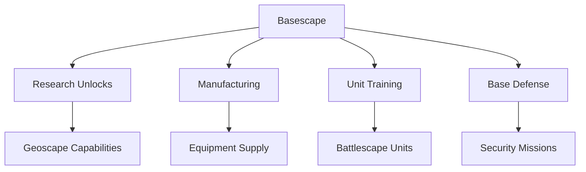
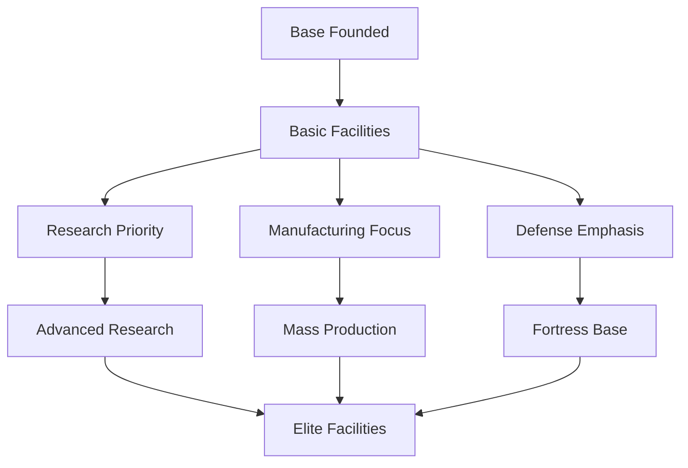
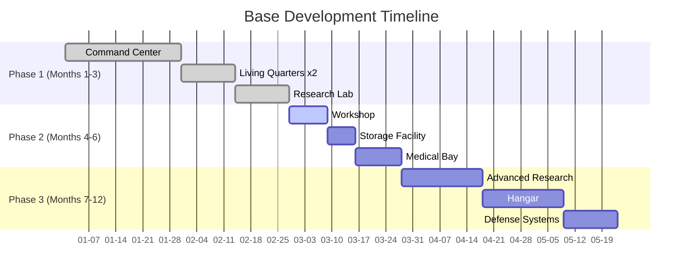

# Basescape - Base Management Layer

> **Implementation**: `../../../engine/basescape/`
> **Tests**: `../../../tests/battlescape/`, `../../../tests/unit/test_facility_system.lua`
> **Related**: `docs/economy/`, `docs/content/facilities/`, `docs/geoscape/craft-operations.md`

Base building and management layer focused on construction, research, manufacturing, and personnel management. Players develop their headquarters on a 5×5 facility grid.

## 🎯 Core Concept

**Base development simulation** where players construct and manage a headquarters facility. Balance resource allocation between research, manufacturing, defense, and personnel management.

## 🏗️ Base Construction

### Facility Grid
- **5×5 Grid**: Core base layout system
- **Facility Types**: Production, support, defense, special
- **Placement Rules**: Adjacency bonuses and restrictions
- **Expansion**: Unlock larger base sizes through research

### Construction Mechanics
- **Build Time**: Facilities require multiple days to complete
- **Resource Costs**: Funding, materials, and personnel
- **Prerequisites**: Some facilities require research unlocks
- **Upgrades**: Existing facilities can be improved

## 🏭 Production Systems

### Research Labs
- **Concurrent Projects**: Multiple research projects running simultaneously
- **Scientist Assignment**: Personnel allocation affects speed
- **Tech Tree**: Hierarchical research dependencies
- **Breakthrough Events**: Random discovery opportunities

### Workshops
- **Manufacturing Queue**: Production pipeline system
- **Engineer Requirements**: Skilled personnel for complex items
- **Material Costs**: Resource consumption for production
- **Quality Control**: Success chance based on facility level

## 👥 Personnel Management

### Unit Assignment
- **Quarters Capacity**: Housing limits for personnel
- **Role Assignment**: Scientists, engineers, soldiers, pilots
- **Training**: Skill improvement over time
- **Morale**: Living conditions affect performance

### Recruitment & Transfer
- **Global Pool**: Available personnel from countries
- **Transfer Costs**: Moving units between bases
- **Specialists**: Rare high-skill individuals
- **Attrition**: Personnel loss from combat or other events

## 🛡️ Defense Systems

### Base Security
- **Turret Networks**: Automated defense systems
- **Shield Generators**: Protective energy fields
- **Detection Arrays**: Early warning systems
- **Security Personnel**: Guard assignments

### Threat Response
- **Alert Levels**: Escalating security states
- **Evacuation Protocols**: Emergency procedures
- **Damage Control**: Repair and recovery systems

## 💰 Economic Management

### Maintenance Costs
- **Facility Upkeep**: Ongoing operational expenses
- **Personnel Salaries**: Monthly payroll requirements
- **Resource Storage**: Capacity limits and spoilage
- **Efficiency Bonuses**: Optimized layouts reduce costs

### Resource Flow
- **Income**: Monthly funding from countries
- **Expenses**: Construction, maintenance, salaries
- **Storage**: Warehouse capacity and organization
- **Marketplace**: Buy/sell interface for resources

## 📊 Base Analytics

### Performance Metrics
- **Efficiency Ratings**: Production and research output
- **Utilization**: Facility usage statistics
- **Growth Tracking**: Expansion progress over time
- **Risk Assessment**: Security and stability analysis

## 🎮 Player Experience

### Management Depth
- **Resource Allocation**: Balance competing priorities
- **Long-term Planning**: Research trees and facility expansion
- **Crisis Management**: Respond to threats and shortages
- **Optimization**: Maximize efficiency through layout design

### Progression Rewards
- **Unlocks**: New facilities through research
- **Capacity Increases**: Larger bases and more personnel
- **Efficiency Gains**: Better production and research rates
- **Defensive Strength**: Improved security and response capabilities

## 🔗 System Interactions



## 📁 Design Documents

- **[base-building.md](base-building.md)** - Construction mechanics
- **[facilities.md](facilities.md)** - Building types and effects
- **[capacity-systems.md](capacity-systems.md)** - Storage and limits
- **[transfers.md](transfers.md)** - Inter-base logistics
- **[maintenance.md](maintenance.md)** - Upkeep costs

## 🎯 Strategic Objectives

### Development Goals
- **Research Advancement**: Unlock new technologies
- **Production Capacity**: Manufacture advanced equipment
- **Defensive Strength**: Protect against threats
- **Operational Efficiency**: Optimize resource usage

### Expansion Strategy
- **Phased Growth**: Gradual base development
- **Specialization**: Focus on specific capabilities
- **Network Building**: Multiple bases for redundancy
- **Global Presence**: Worldwide operational coverage

## 📈 Base Development Examples & Tables

### Facility Grid Layout Example
```
Base Layout (5×5 Grid):
┌───┬───┬───┬───┬───┐
│ L │ L │ W │ W │ H │  L = Living Quarters, W = Workshop, H = Hangar
├───┼───┼───┼───┼───┤
│ L │ R │ R │ S │ A │  R = Research Lab, S = Storage, A = Access Lift
├───┼───┼───┼───┼───┤
│ G │ R │ C │ S │ D │  G = Generator, C = Command Center, D = Defense
├───┼───┼───┼───┼───┤
│ M │ W │ W │ S │ M │  M = Medical Bay
└───┴───┴───┴───┴───┘
```

### Facility Build Time Comparison

| Facility Type | Build Time | Cost | Prerequisites | Key Benefits |
|---------------|------------|------|---------------|--------------|
| **Living Quarters** | 7 days | $50K | None | +10 Personnel capacity |
| **Research Lab** | 14 days | $150K | Basic Research | +2 Concurrent projects |
| **Workshop** | 10 days | $100K | Basic Manufacturing | +1 Production queue |
| **Hangar** | 21 days | $300K | Advanced Aviation | +2 Craft capacity |
| **Command Center** | 30 days | $500K | Command Training | +50% Detection range |
| **Medical Bay** | 12 days | $120K | Medical Research | +25% Recovery speed |

### Base Development Progression Flow


### Personnel Assignment Optimization

| Role | Ideal Ratio | Key Facilities | Performance Impact |
|------|-------------|----------------|-------------------|
| **Scientists** | 40% | Research Labs | +15% Research speed |
| **Engineers** | 30% | Workshops | +20% Production speed |
| **Soldiers** | 20% | Training Facilities | +10% Combat readiness |
| **Pilots** | 10% | Hangars | +25% Craft efficiency |

### Resource Management Dashboard Example

| Resource | Current | Capacity | Monthly Change | Status |
|----------|---------|----------|----------------|--------|
| **Funding** | $2.5M | $5M | +$800K | Surplus |
| **Scientists** | 45 | 50 | +2 | Near Capacity |
| **Engineers** | 32 | 40 | +1 | Available |
| **Alloys** | 150 | 200 | -20 | Consuming |
| **Elerium** | 25 | 50 | +5 | Accumulating |

### Base Expansion Strategy Timeline


### Facility Adjacency Bonus Matrix

| Facility A | Facility B | Bonus Effect | Magnitude |
|------------|------------|--------------|-----------|
| **Research Lab** | Research Lab | Research Speed | +10% |
| **Workshop** | Workshop | Production Speed | +15% |
| **Living Quarters** | Medical Bay | Morale Recovery | +20% |
| **Hangar** | Workshop | Craft Repair | +25% |
| **Command Center** | Any Facility | Detection Range | +5% |

### Cross-Reference Integration
- **Economic Systems**: See `docs/economy/` for funding and resource management
- **Research Trees**: See `docs/economy/research.md` for technology progression
- **Manufacturing**: See `docs/economy/manufacturing.md` for production mechanics
- **Craft Operations**: See `docs/geoscape/craft-operations.md` for aerial deployment
- **Unit Training**: See `docs/battlescape/unit-systems/` for personnel development