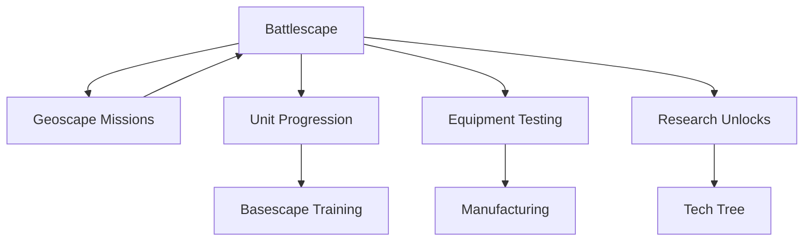

# Battlescape - Tactical Combat Layer

> **Implementation**: `engine/battlescape/`
> **Tests**: `tests/battlescape/`
> **Related**: `docs/geoscape/missions.md`, `docs/content/units/`, `docs/content/equipment/`

Tactical combat layer featuring turn-based squad combat on procedurally generated maps. Players command units in real-time strategy style gameplay with line-of-sight, cover, and positioning mechanics.

## 🎯 Core Concept

**Turn-based tactical combat** where players control squads of units on detailed maps. Combines X-COM style gameplay with modern RTS elements like overwatch, suppression, and positioning.

## 🗺️ Mission System

### Mission Types
- **UFO Crash Sites** - Recover alien technology
- **Terror Missions** - Protect civilians from alien attacks
- **Base Defense** - Protect player bases from assault
- **Research Outposts** - Secure scientific installations

### Deployment & Objectives
- Squad-based deployment (4-8 units typical)
- Multiple win/loss conditions
- Time pressure and resource constraints
- Dynamic objective generation

## 🗺️ Map System

### Procedural Generation
- **Mapblocks**: 10×10 tile building blocks
- **Mapscripts**: Generation rules for mission types
- **Biome System**: Urban, rural, desert, arctic themes
- **Connectivity**: Guaranteed pathfinding between objectives

### Terrain Mechanics
- **Tile Types**: Grass, concrete, metal, dirt with different movement costs
- **Elevation**: Height-based positioning and line-of-sight
- **Destructible Environment**: Walls and objects can be destroyed
- **Cover System**: Partial/full cover bonuses

## ⚔️ Combat Mechanics

### Turn Structure
- **Unit Activation**: Individual unit turns with action points
- **Time Units (TU)**: Legacy term for action points (AP)
- **Reaction Fire**: Overwatch system for opportunity attacks
- **Interruption**: High-priority actions can interrupt turns

### Action Point System
- **Movement**: Consume AP based on terrain difficulty
- **Shooting**: Ranged attacks with accuracy modifiers
- **Melee**: Close combat with positioning bonuses
- **Items**: Grenades, medkits, special equipment

### Accuracy & Damage
- **Hit Chance**: Base accuracy modified by range, cover, stance
- **Damage Calculation**: Armor reduction, wound system
- **Critical Hits**: Random chance for extra damage
- **Suppression**: Temporary morale damage from near misses

## 👥 Unit Systems

### Core Attributes
- **Health**: Hit points with wound system for permanent damage
- **Morale**: Mental state affecting behavior (0-100 scale)
- **Experience**: XP for stat growth and ability unlocks
- **Fatigue**: Stamina system for prolonged missions

### Status Effects
- **Wounds**: Permanent health reduction requiring medical treatment
- **Panic**: Loss of control when morale drops too low
- **Suppression**: Temporary accuracy and movement penalties
- **Burning/Stunned**: Environmental and combat effects

## 🤖 AI System

### Tactical AI
- **Behavior Trees**: Decision-making framework
- **Patrol Routes**: Pre-defined movement patterns
- **Aggression Levels**: Passive, defensive, aggressive stances
- **Group Coordination**: Squad-level tactics

### Difficulty Scaling
- **Rookie**: Basic AI with predictable behavior
- **Veteran**: Coordinated attacks and positioning
- **Commander**: Advanced tactics and adaptation
- **Legend**: Optimal play with perfect information

## 🌍 Environmental Effects

### Fire System
- **Spread Mechanics**: Fire propagates to adjacent tiles
- **Damage Over Time**: Continuous damage to units in flames
- **Extinguishing**: Methods to put out fires
- **Smoke**: Visibility reduction and movement penalties

### Lighting & Time
- **Day/Night Cycle**: Affects visibility and AI behavior
- **Artificial Lights**: Player-placed illumination
- **Shadow Casting**: Line-of-sight affected by lighting

## 📁 Design Documents

### Mission System
- **[mission-types.md](mission-system/mission-types.md)** - Mission categories and objectives
- **[objectives.md](mission-system/objectives.md)** - Win/loss conditions
- **[deployment.md](mission-system/deployment.md)** - Unit placement rules
- **[squad-building.md](mission-system/squad-building.md)** - Team composition

### Map System
- **[map-generation.md](map-system/map-generation.md)** - Procedural generation
- **[mapblocks.md](map-system/mapblocks.md)** - Building block system
- **[terrain-types.md](map-system/terrain-types.md)** - Tile mechanics
- **[biomes.md](map-system/biomes.md)** - Environmental themes

### Combat Mechanics
- **[turn-structure.md](combat-mechanics/turn-structure.md)** - Turn order and phases
- **[action-points.md](combat-mechanics/action-points.md)** - AP/TU system
- **[movement.md](combat-mechanics/movement.md)** - Movement rules
- **[shooting.md](combat-mechanics/shooting.md)** - Ranged combat
- **[damage.md](combat-mechanics/damage.md)** - Damage calculation

### Unit Systems
- **[unit-stats.md](unit-systems/unit-stats.md)** - Core attributes
- **[health-wounds.md](unit-systems/health-wounds.md)** - HP system
- **[morale.md](unit-systems/morale.md)** - Mental state mechanics
- **[experience.md](unit-systems/experience.md)** - Progression system

### AI System
- **[tactical-ai.md](ai-system/tactical-ai.md)** - Combat AI behavior
- **[difficulty-scaling.md](ai-system/difficulty-scaling.md)** - AI challenge levels

## 🎮 Player Experience

### Tactical Depth
- **Positioning**: Use of cover, elevation, and flanking
- **Resource Management**: AP conservation and prioritization
- **Risk Assessment**: Weighing aggression vs caution
- **Squad Synergy**: Unit combination and specialization

### Emergent Gameplay
- **Dynamic Objectives**: Changing mission goals
- **Environmental Interaction**: Using terrain to advantage
- **Unit Loss Consequences**: Permanent character death
- **Replayability**: Procedural generation ensures variety

## 🔗 Integration Points

**Pre-Mission**: Unit selection, equipment loadout, briefing
**During Mission**: Tactical combat with real-time decisions
**Post-Mission**: Debriefing, experience gains, salvage recovery