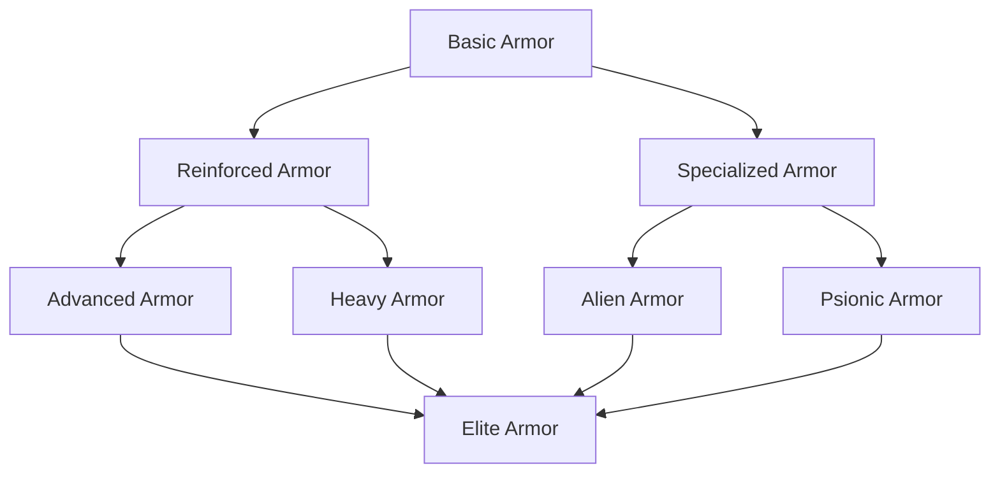
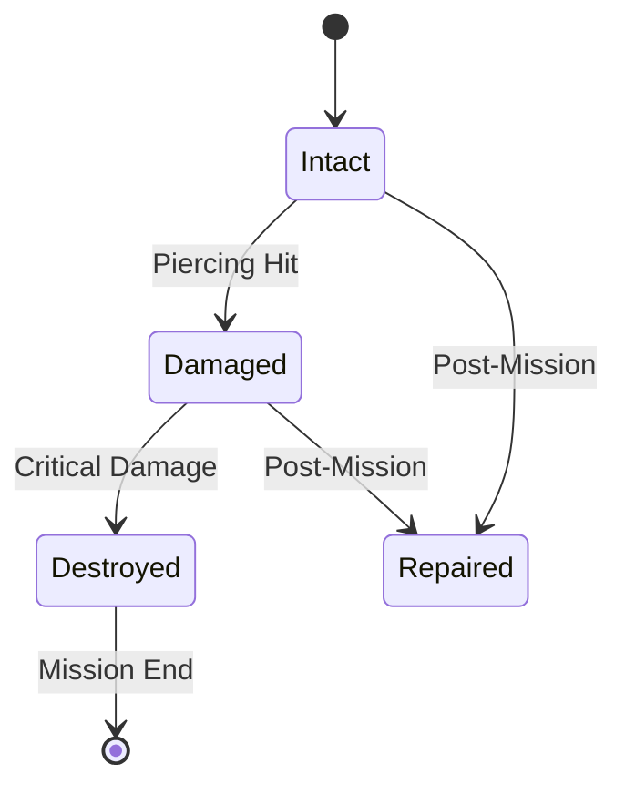

# Armor System

> **Implementation**: `../../../engine/core/units/`, `../../../engine/core/items/`
> **Tests**: `../../../tests/battlescape/`, `../../../tests/unit/test_movement_system.lua`
> **Related**: `docs/battlescape/weapons.md`, `docs/content/items.md`

Protective equipment system providing damage resistance and tactical bonuses.

## 🛡️ Armor Architecture

### Resistance System
Damage reduction mechanics against different attack types.

**Resistance Types:**
- **Kinetic**: Physical projectiles and impacts
- **Explosive**: Blast and fragmentation effects
- **Laser**: Energy beam weapons
- **Plasma**: Advanced energy weapons
- **Melee**: Close-quarters physical attacks
- **Stun**: Immobilization and disruption effects
- **Smoke**: Visibility and targeting impairment
- **Psi**: Mental and psionic attacks
- **Warp**: Dimensional and reality-warping effects

**Resistance Mechanics:**
- **Percentage Reduction**: Damage mitigation by resistance type
- **Unit Modification**: Armor can increase or decrease base resistances
- **20% Increments**: Resistance values snap to 20% steps (80%, 160%, etc.)
- **Type Matching**: Specific resistances counter corresponding damage types

## 🔪 Armor Piercing

### Penetration Mechanics
Weapon capability to bypass armor protection values.

**Piercing Rules:**
- **Armor Bypass**: Weapons can ignore armor rating
- **Resistance Unaffected**: Piercing doesn't impact damage type resistances
- **Tactical Choice**: Piercing vs high-damage weapon selection
- **Armor Degradation**: Potential for armor damage over time

## 📐 Armor Design

### Directional Protection
Frontal, side, and rear armor variations (currently unused).

**Armor Sides:**
- **Frontal**: Primary facing protection
- **Side**: Flanking vulnerability areas
- **Rear**: Back exposure weaknesses
- **Current Implementation**: Uniform armor values for all directions

### Armor Durability
Damage accumulation and degradation mechanics.

**Durability Rules:**
- **No Degradation**: Armor maintains full value during battle
- **Piercing Only**: Armor can be pierced but not reduced
- **Battle Immutability**: Units cannot change armor mid-combat
- **Repair Requirements**: Post-battle restoration needed

## 👤 Unit Integration

### Built-in Armor
Natural or cybernetic protection integrated into unit physiology.

**Built-in Types:**
- **Natural Armor**: Species-based protective traits
- **Cybernetic**: Implanted protective systems
- **Permanent**: Cannot be removed or changed
- **No Armor Slot**: Built-in units lack equipment armor options

### Passive Skills
Automatic abilities granted by armor equipment.

**Skill Types:**
- **Defensive**: Enhanced protection capabilities
- **Mobility**: Movement and positioning bonuses
- **Sensory**: Detection and awareness improvements
- **Special**: Unique tactical abilities

### Stat Bonuses
Armor-provided modifiers to unit performance.

**Bonus Categories:**
- **Strength**: Physical power enhancements (power armor)
- **Mobility**: Movement speed and agility
- **Durability**: Health and resilience improvements
- **Special**: Unique capabilities based on armor type

## ⚖️ Armor Restrictions

### Dependency Requirements
Prerequisites for armor usage and compatibility.

**Dependency Types:**
- **Unit Class**: Specific soldier types required (heavy, scout, etc.)
- **Race**: Species-specific armor compatibility
- **Traits**: Required characteristics or abilities
- **Transformation**: Special forms or modes needed

### Weight System
Encumbrance mechanics limiting armor usage.

**Weight Mechanics:**
- **Unit Capacity Check**: Soldiers must be able to carry armor
- **Movement Impact**: Heavy armor affects mobility
- **Tactical Trade-offs**: Protection vs speed decisions
- **Class Restrictions**: Some units cannot use heavy armor

## 🎮 Player Experience

### Armor Strategy
- **Mission Matching**: Choose armor appropriate for threat types
- **Unit Specialization**: Assign armor based on soldier roles
- **Resistance Optimization**: Counter expected enemy weapon types
- **Weight Management**: Balance protection with mobility needs

### Tactical Considerations
- **Piercing Threats**: Plan for weapons that bypass armor
- **Resistance Matching**: Use armor strengths against enemy weaknesses
- **Positioning**: Use cover and positioning for additional protection
- **Loadout Planning**: Pre-mission armor selection and preparation

### Armor Challenges
- **Weight Penalties**: Heavy armor reduces tactical flexibility
- **Cost Limitations**: Advanced armor requires significant resources
- **Compatibility Issues**: Not all units can use all armor types
- **Maintenance Requirements**: Armor needs repair and replacement

## 📊 Armor Balance

### Progression Tiers
- **Basic**: Light armor with minimal protection
- **Advanced**: Balanced armor with good all-around protection
- **Elite**: Heavy armor with excellent protection but mobility costs
- **Specialized**: Armor optimized for specific threat types

### Difficulty Scaling
- **Rookie**: Lightweight armor, minimal penalties, good protection
- **Veteran**: Standard armor performance and restrictions
- **Commander**: Heavy armor, significant penalties, reduced effectiveness
- **Legend**: Very heavy armor, extreme penalties, limited protection

### Balance Considerations
- **Trade-off Design**: Protection always comes with costs
- **Counter Systems**: Piercing weapons balance heavy armor
- **Tactical Depth**: Armor choices affect combat strategy
- **Resource Investment**: Better armor requires manufacturing investment

### Integration Points
- **Manufacturing**: Armor production requires facilities and materials (see `docs/economy/manufacturing.md`)
- **Research**: Technology unlocks advanced armor types (see `docs/economy/research.md`)
- **Unit Design**: Armor affects unit capabilities and roles (see `docs/battlescape/unit-systems/`)
- **Mission Planning**: Armor selection based on expected threats (see `docs/geoscape/missions.md`)

## 📈 Armor Examples & Tables

### Armor Comparison Matrix

| Armor Type | Kinetic | Energy | Explosive | Weight | Mobility | Cost |
|------------|---------|--------|-----------|--------|----------|------|
| **Light Armor** | 20% | 10% | 30% | 1 | +2 | $1,000 |
| **Medium Armor** | 40% | 25% | 20% | 2 | +0 | $3,000 |
| **Heavy Armor** | 60% | 40% | 10% | 4 | -2 | $8,000 |
| **Power Armor** | 50% | 50% | 25% | 3 | +1 | $15,000 |
| **Alien Alloy** | 30% | 70% | 15% | 2 | +0 | $25,000 |
| **Psionic Shield** | 15% | 20% | 15% | 0 | +0 | $50,000 |

*Resistance values are percentage damage reduction. Weight affects mobility.*

### Armor Progression Tree

### Damage Type Resistance Matrix

| Armor Type | Ballistic | Laser | Plasma | Explosive | Melee | Psi |
|------------|-----------|-------|--------|-----------|-------|-----|
| **Ballistic Plate** | 80% | 20% | 10% | 40% | 60% | 0% |
| **Energy Shield** | 30% | 70% | 60% | 20% | 20% | 10% |
| **Heavy Plate** | 90% | 40% | 30% | 50% | 80% | 0% |
| **Alien Carapace** | 50% | 85% | 75% | 30% | 70% | 40% |
| **Psionic Field** | 15% | 25% | 20% | 15% | 15% | 90% |

### Tactical Armor Usage Examples

#### Anti-Personnel Combat
**Threat:** Infantry with small arms and grenades
**Recommended Armor:** Medium Ballistic Armor
**Rationale:** Good against ballistic weapons, reasonable explosive resistance
**Trade-offs:** Moderate mobility penalty, vulnerable to energy weapons

#### Anti-Alien Combat  
**Threat:** Plasma weapons and psionic attacks
**Recommended Armor:** Alien Alloy Armor
**Rationale:** Superior energy resistance, some psionic protection
**Trade-offs:** Expensive, lower ballistic protection

#### Reconnaissance Missions
**Threat:** Mixed threats, mobility critical
**Recommended Armor:** Light Scout Armor
**Rationale:** Minimal weight penalty, adequate basic protection
**Trade-offs:** Limited resistance against heavy weapons

#### Heavy Assault Operations
**Threat:** Explosives and heavy weapons
**Recommended Armor:** Heavy Assault Armor
**Rationale:** Excellent ballistic and explosive resistance
**Trade-offs:** Significant mobility penalty, vulnerable to energy weapons

### Armor Degradation Flow

### Armor Cost vs Effectiveness Chart

| Effectiveness Tier | Cost Range | Weight Range | Typical Use |
|-------------------|------------|--------------|-------------|
| **Budget** | $500-2,000 | 1-2 | Early game, rookies |
| **Standard** | $3,000-8,000 | 2-3 | Mid-game, veterans |
| **Premium** | $10,000-20,000 | 3-4 | Late game, elites |
| **Exotic** | $25,000+ | 1-3 | Special operations |

### Cross-Reference Integration
- **Weapon Systems**: See `docs/battlescape/weapons.md` for piercing mechanics
- **Unit Classes**: See `docs/battlescape/unit-systems/` for armor compatibility
- **Combat Mechanics**: See `docs/battlescape/combat-mechanics/` for damage calculations
- **Manufacturing**: See `docs/economy/manufacturing.md` for armor production