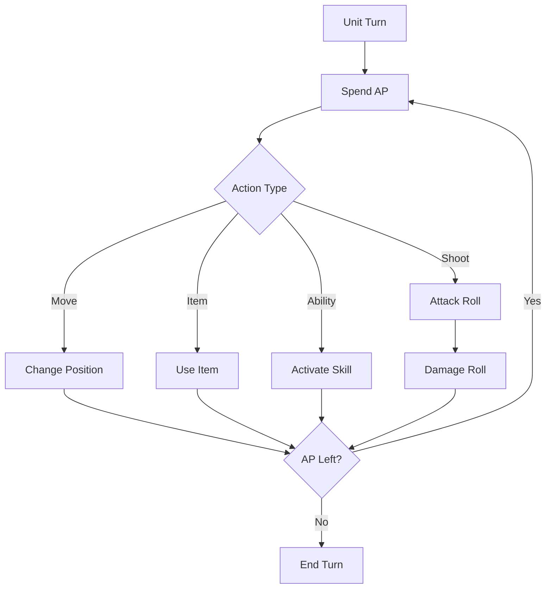
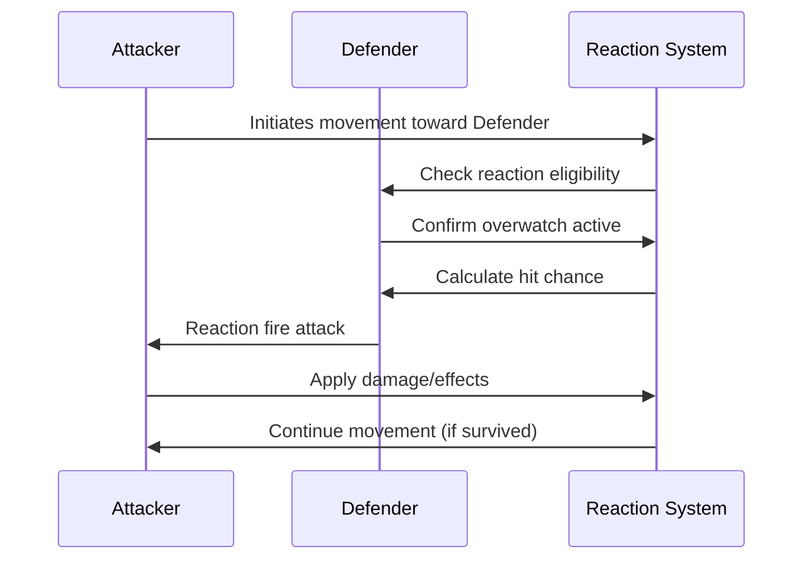
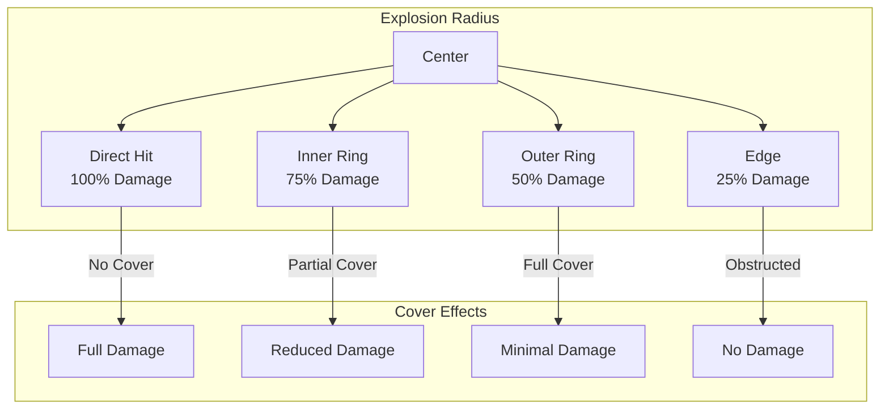
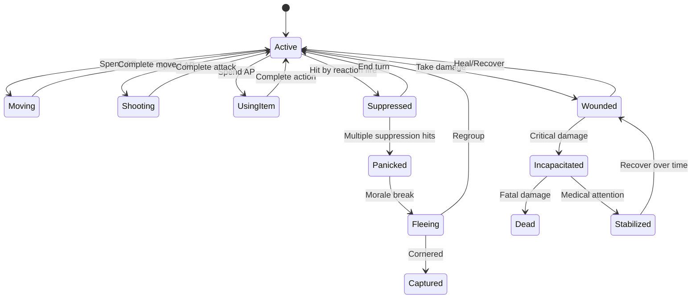

# Combat Mechanics

> **Implementation**: `../../../engine/battlescape/combat/`, `../../../engine/battlescape/systems/`
> **Tests**: `../../../tests/battlescape/`, `../../../tests/unit/test_movement_system.lua`
> **Related**: `docs/battlescape/unit-systems/`, `docs/battlescape/ai-system/`

Core turn-based combat rules: movement, shooting, damage, cover, reactions, and environmental effects.

## 🎯 Key Concepts

### Combat Flow


### Core Formula
```
Hit Chance = Base Accuracy + Modifiers - Target Defense
Damage = Weapon Damage - Armor × Damage Type Modifier
```

## ⚔️ Core Combat Mechanics

### Action Points System
- **Movement**: 1-3 AP per tile (terrain dependent)
- **Shooting**: 4-8 AP (weapon dependent)
- **Reload**: ~4 AP
- **Use Item**: 3-5 AP
- **Reaction Reserve**: 4+ AP for overwatch

### Line of Sight
- **Vision Calculation**: Direct line between unit centers
- **Blocking**: Walls, objects, and elevation
- **Partial Cover**: 30% accuracy reduction
- **Full Cover**: 60% accuracy reduction

### Targeting & Accuracy
- **Base Accuracy**: Weapon + unit skill modifiers
- **Range Penalties**: Distance-based accuracy reduction
- **Cover Bonuses**: Target defense increases
- **Movement Penalties**: -20% when moving and shooting

## 🌋 Environmental Effects

### Fire System
- **Spread Mechanics**: Fire propagates to adjacent flammable tiles
- **Damage Over Time**: 10-20 HP per turn in flames
- **Extinguishing**: Water, foam, or time-based decay
- **Movement**: Units can move through fire (with damage)

### Smoke & Gas
- **Visibility Reduction**: Blocks line of sight
- **Movement Hindrance**: Increased AP cost
- **Area Denial**: Creates tactical choke points
- **Dispersion**: Gradually fades over time

### Explosives
- **Blast Radius**: Circular area of effect
- **Damage Falloff**: Reduced damage at range
- **Terrain Destruction**: Can create new cover/craters
- **Chain Reactions**: May ignite flammable objects

## 🎯 Advanced Combat Systems

### Reaction Fire (Overwatch)
- **Setup Cost**: 4+ AP to enter overwatch
- **Trigger Conditions**: Enemy moves in line of sight
- **Accuracy Penalty**: -30% for reaction shots
- **Limited Ammo**: Uses weapon's normal ammunition

### Suppression & Morale
- **Suppression Mechanic**: Near-miss shots reduce accuracy
- **Morale Impact**: Failed hits increase panic chance
- **Recovery Time**: Morale restores gradually
- **Breaking Point**: Units may flee or surrender

### Critical Hits
- **Random Chance**: 5-15% base critical chance
- **Damage Multiplier**: 1.5x-3x normal damage
- **Special Effects**: May cause bleeding or stun
- **Armor Bypass**: Ignores portion of armor

### Status Effects
- **Bleeding**: Damage over time, stacks up to 3
- **Stunned**: Skip next turn, -50% accuracy
- **Burning**: Fire damage, spreads to adjacent units
- **Poisoned**: Reduced max health, gradual recovery

## 🛡️ Damage & Armor

### Damage Types
- **Ballistic**: Standard bullets, reduced by armor
- **Energy**: Plasma/laser, bypasses some armor
- **Explosive**: Area damage, armor penetration
- **Melee**: Close combat, ignores most armor

### Armor Mechanics
- **Damage Reduction**: Flat damage subtraction
- **Type Effectiveness**: Different armor vs damage types
- **Degradation**: Armor weakens with damage
- **Repair**: Field repairs restore armor

## 🎮 Player Experience

### Tactical Depth
- **Positioning**: Use cover, elevation, flanking
- **Resource Management**: AP conservation and prioritization
- **Risk Assessment**: Weigh aggression vs caution
- **Environmental Interaction**: Use terrain to advantage

### Combat Pacing
- **Turn-Based Tension**: Deliberate decision making
- **Reaction Opportunities**: Overwatch creates uncertainty
- **Environmental Chaos**: Fire/smoke adds unpredictability
- **Resource Pressure**: Limited AP forces prioritization

## 📊 Balance Considerations

### Difficulty Scaling
- **Rookie**: More forgiving accuracy, less suppression
- **Veteran**: Standard mechanics, moderate difficulty
- **Commander**: Increased AI accuracy, more aggressive tactics
- **Legend**: Perfect AI positioning, minimal margins for error

### Counter-Play
- **Cover Usage**: Proper positioning mitigates most threats
- **Suppression Control**: Area denial prevents enemy movement
- **Flanking**: Attack from unexpected angles
- **Environmental Control**: Use fire/explosives strategically

## 📈 Combat Examples

### Turn Sequence Example
**Unit: Assault Soldier (AP: 8, HP: 100, Accuracy: 70%)**

**Turn 1 Actions:**
1. **Move** (3 AP): Advance to cover → AP: 5
2. **Shoot** (4 AP): Fire at enemy → AP: 1
3. **Reaction Reserve** (1 AP): Set overwatch → AP: 0

**Combat Resolution:**
- **Hit Roll**: 70% base + 10% close range = 80% → Success
- **Damage**: Rifle (45 dmg) - Enemy armor (15) = 30 damage
- **Enemy Status**: 70/100 HP, suppressed (next turn penalty)

### Environmental Combat Scenario
**Battlefield: Urban Warehouse District**

**Initial Setup:**
```
[W] Wall  [C] Crate  [F] Fire  [S] Smoke
[U] Unit  [E] Enemy

Map Layout:
S S S S S
W U C C W
W     F W
W E     W
W W W W W
```

**Tactical Considerations:**
- **Smoke**: Reduces visibility, creates cover opportunities
- **Fire**: Damages units in area, blocks movement
- **Crates**: Provide cover, can be destroyed
- **Walls**: Block LOS, force flanking maneuvers

### Suppression Mechanics Table

| Suppression Level | Accuracy Penalty | Movement Penalty | Morale Impact |
|------------------|------------------|------------------|----------------|
| Light (1-2 hits) | -10% | -1 AP cost | -5% |
| Medium (3-4 hits) | -25% | -2 AP cost | -15% |
| Heavy (5+ hits) | -40% | Immobile | -30% |
| **Break** | **-60%** | **Panic** | **-50%** |

### Damage Type Effectiveness Matrix

| Armor Type | Ballistic | Energy | Explosive | Melee |
|------------|-----------|--------|-----------|-------|
| **Basic** | 80% | 60% | 40% | 90% |
| **Composite** | 60% | 80% | 50% | 70% |
| **Power Armor** | 40% | 90% | 60% | 50% |
| **Alien** | 30% | 95% | 70% | 30% |

*Values represent damage reduction percentage*

### Advanced Tactics Example
**Scenario: Flanking Maneuver**

**Situation:** Enemy squad behind heavy cover, suppressing friendly advance

**Tactical Solution:**
1. **Spotter Unit**: Uses overwatch to suppress enemy (4 AP)
2. **Flanking Unit**: Moves around cover using smoke for concealment (6 AP)
3. **Grenade Throw**: Creates additional smoke screen (3 AP)
4. **Close Assault**: Melee attack from flank (4 AP)

**Risk/Reward:**
- **High Risk**: Flanking unit exposed during movement
- **High Reward**: Enemy suppression broken, position compromised
- **Alternative**: Use explosives to destroy cover instead

### Reaction Fire Sequence


### Area Effect Damage Visualization


### Unit State Flow
