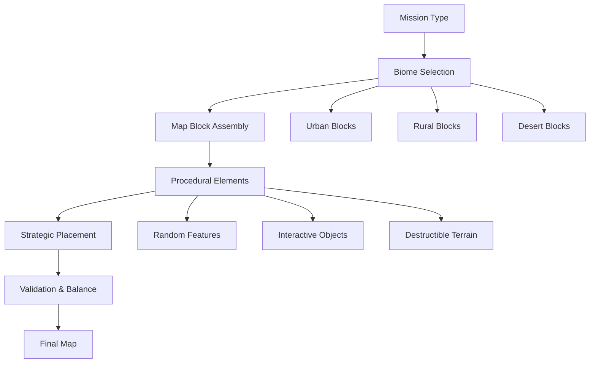

# Map System

> **Implementation**: `../../../engine/battlescape/maps/`, `../../../engine/battlescape/mission_map_generator.lua`
> **Tests**: `../../../tests/battlescape/test_map_generation.lua`, `../../../tests/unit/test_map_generation.lua`
> **Related**: `docs/battlescape/README.md`, `docs/geoscape/world-map.md`

Procedural map generation and battlefield design system for tactical combat.

## 🗺️ Map Architecture

### Map Generation Systems
Algorithms and frameworks for creating diverse battlefields.

**Generation Components:**
- **Terrain Algorithms**: Procedural landscape creation
- **Map Blocks**: Pre-designed terrain sections for assembly
- **Script Framework**: Mission-specific map modification rules
- **Grid System**: Coordinate-based battlefield navigation

### Tile & Grid Systems
Fundamental building blocks of battlefield terrain.

**Tile Mechanics:**
- **Tile Types**: Different terrain categories (urban, rural, alien, etc.)
- **Tile Properties**: Movement costs, cover values, interaction rules
- **Grid Navigation**: Pathfinding and movement calculations
- **Connectivity Rules**: Terrain adjacency and accessibility

## ⚔️ Battlefield Design

### Battlefield Creation
Mission-specific map assembly and configuration.

**Battlefield Elements:**
- **Size Scaling**: Variable battlefield dimensions
- **Landing Zones**: Unit deployment areas
- **Strategic Markers**: Key tactical positions
- **Environmental Features**: Destructible and interactive terrain

### Procedural Elements
Randomized but controlled map generation.

**Procedural Features:**
- **Deterministic Seeding**: Reproducible maps for testing
- **Terrain Variation**: Random element placement within rules
- **Mission Rules**: Layout constraints based on operation type
- **Balance Control**: Fair battlefield generation for both sides

## 🎮 Player Experience

### Tactical Terrain
- **Cover Utilization**: Use terrain for defensive positioning
- **Movement Planning**: Navigate complex terrain layouts
- **Area Control**: Secure strategic positions and chokepoints
- **Environmental Tactics**: Use terrain features for tactical advantage

### Map Strategy
- **Landing Zone Selection**: Choose optimal deployment areas
- **Terrain Analysis**: Identify high-ground and defensive positions
- **Pathfinding**: Plan routes considering movement costs
- **Dynamic Adaptation**: Respond to revealed map features

### Map Challenges
- **Unknown Terrain**: Initial fog of war and exploration
- **Complex Layouts**: Navigate irregular and obstructed battlefields
- **Positioning Pressure**: Terrain affects tactical positioning
- **Procedural Variance**: Adapt to different generated layouts

## 📊 Map Balance

### Difficulty Scaling
- **Rookie**: Simple terrain, clear paths, generous cover
- **Veteran**: Standard map complexity and terrain challenges
- **Commander**: Complex terrain, obstructed paths, limited cover
- **Legend**: Very complex terrain, maze-like layouts, minimal cover

### Mission Integration
- **UFO Crash Sites**: Debris fields and crash terrain features
- **Terror Missions**: Urban environments with civilian structures
- **Base Assaults**: Facility layouts with defensive positions
- **Alien Terrain**: Unusual landscapes with special properties

### Balance Considerations
- **Fair Generation**: Maps provide tactical opportunities for both sides
- **Strategic Depth**: Terrain affects but doesn't determine outcomes
- **Replayability**: Procedural generation creates varied experiences
- **Testing Support**: Deterministic seeding enables balance verification

### Technical Integration
- **Pathfinding**: Efficient unit movement calculations
- **Line of Sight**: Terrain-based visibility and targeting
- **Area Effects**: Terrain interaction with weapons and abilities
- **Performance**: Optimized rendering and collision detection

## 📈 Map Examples & Tables

### Map Generation Flow


### Terrain Type Comparison Matrix

| Terrain Type | Movement Cost | Cover Rating | LOS Blocking | Special Properties |
|--------------|---------------|--------------|--------------|-------------------|
| **Open Ground** | 1 | None | No | No special effects |
| **Light Woods** | 2 | Light (+20%) | Partial | Concealment bonus |
| **Heavy Woods** | 3 | Medium (+40%) | Yes | Dense cover, sound dampening |
| **Urban Building** | 2 | Heavy (+60%) | Yes | Interior access, elevation |
| **Rubble/Debris** | 3 | Medium (+30%) | Partial | Destructible, hazard potential |
| **Water** | 4 | None | No | Swimming required, visibility effects |
| **Rough Terrain** | 2 | Light (+10%) | No | Movement penalties, unstable |

### Map Size Scaling Table

| Mission Type | Map Size | Unit Count | Duration | Complexity |
|--------------|----------|------------|----------|------------|
| **Small Skirmish** | 20×20 | 4-6 units | 10-15 turns | Low |
| **Standard Battle** | 30×30 | 6-10 units | 15-25 turns | Medium |
| **Large Engagement** | 40×40 | 10-16 units | 25-40 turns | High |
| **Epic Assault** | 50×50 | 16-24 units | 40+ turns | Very High |

### Procedural Element Examples

#### Urban Combat Map
**Base Layout:** City street grid with buildings
**Procedural Elements:**
- Random building damage and rubble
- Variable alleyway connections
- Rooftop access points
- Civilian vehicle obstacles

**Tactical Implications:** Close-quarters combat, vertical movement, cover-rich environment

#### Rural Crash Site
**Base Layout:** Open farmland with roads
**Procedural Elements:**
- UFO debris field placement
- Forest edge boundaries
- Road network variations
- Farm structure positioning

**Tactical Implications:** Open sightlines, flanking opportunities, debris as cover

#### Alien Terrain Map
**Base Layout:** Unusual crystalline formations
**Procedural Elements:**
- Energy field placements
- Dimensional rift locations
- Alien vegetation clusters
- Terrain height variations

**Tactical Implications:** Unknown terrain effects, special alien mechanics, environmental hazards

### Map Block Assembly Example
```
Map Block Layout (3×3 grid):
┌─────┬─────┬─────┐
│Urban│Urban│Rural│
├─────┼─────┼─────┤
│Urban│Rural│Rural│
├─────┼─────┼─────┤
│Rural│Rural│Rural│
└─────┴─────┴─────┘

Block Properties:
- Urban: Buildings, streets, cover
- Rural: Open fields, light woods, roads
- Connection: Road networks link blocks
- Variation: Procedural elements added per block
```

### Terrain Interaction Matrix

| Weapon Type | Urban Terrain | Rural Terrain | Rough Terrain | Water Terrain |
|-------------|----------------|----------------|----------------|---------------|
| **Ballistic** | Standard | Standard | -10% accuracy | -50% accuracy |
| **Energy** | +10% damage | Standard | Standard | -25% damage |
| **Explosive** | +20% damage | Standard | Standard | No effect |
| **Melee** | Standard | Standard | -1 AP cost | -2 AP cost |

### Strategic Map Positioning Guide

| Position Type | Advantages | Disadvantages | Best For |
|---------------|------------|---------------|----------|
| **High Ground** | Better visibility, height bonus | Exposed, harder to reach | Snipers, overwatch |
| **Cover Position** | Protection, ambush potential | Limited visibility | Assault units, defense |
| **Chokepoint** | Force enemy routing | Easy to flank | Control, bottleneck defense |
| **Open Field** | Mobility, charge potential | No cover, exposed | Fast units, hit-and-run |
| **Flank Position** | Surprise attacks, encirclement | Vulnerable to counter-flank | Stealth units, maneuver warfare |

### Cross-Reference Integration
- **Combat Mechanics**: See `docs/battlescape/combat-mechanics/` for terrain interaction rules
- **Unit Systems**: See `docs/battlescape/unit-systems/` for movement and positioning
- **Weapons**: See `docs/battlescape/weapons.md` for terrain effect on accuracy
- **Geoscape**: See `docs/geoscape/world-map.md` for biome-to-terrain mapping
- **Mission Generation**: See `docs/geoscape/missions.md` for map size and complexity scaling