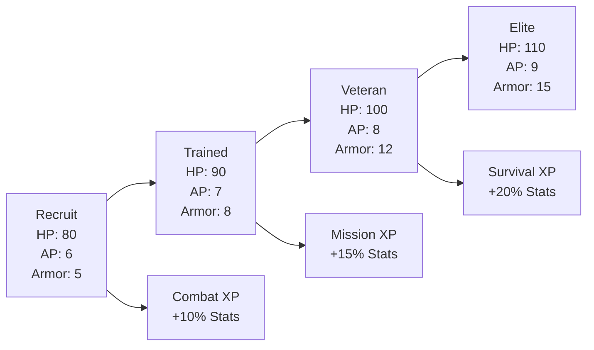
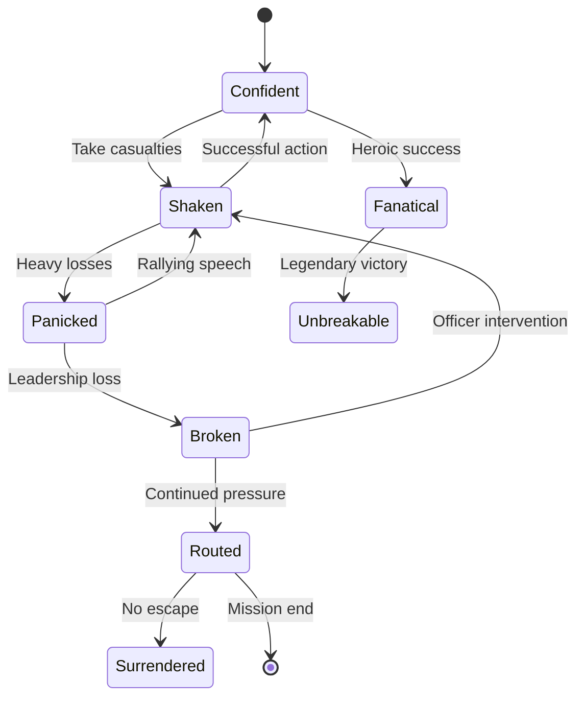
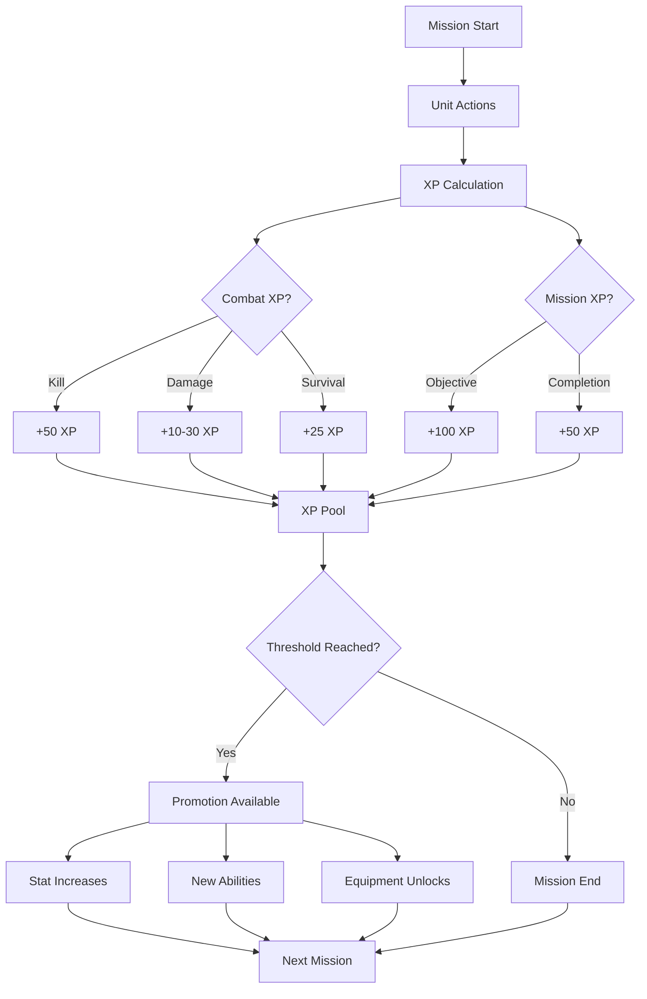

# Unit Systems

> **Implementation**: `../../../engine/core/units/`, `../../../engine/battlescape/entities/`
> **Tests**: `../../../tests/unit/test_movement_system.lua`, `../../../tests/battlescape/`
> **Related**: `docs/battlescape/combat-mechanics/`, `docs/content/units/`

Unit attributes, progression, morale, and status effects that define character capabilities and combat performance.

## 🎯 Core Attributes

### Primary Stats
| Stat | Description | Range | Combat Impact |
|------|-------------|-------|----------------|
| **Health** | Hit points, damage capacity | 0-200+ | Death at 0 HP |
| **Strength** | Carrying capacity, melee damage | 1-100 | Item limits, knockback |
| **Energy** | Action points, fatigue resistance | 0-200 | AP pool, stamina |
| **Armor** | Damage reduction | 0-100 | Damage mitigation |

### Combat Stats
| Stat | Description | Range | Effect |
|------|-------------|-------|--------|
| **React** | Reaction fire, dodge, melee | 1-100 | Overwatch accuracy, evasion |
| **Aim** | Ranged accuracy, throwing | 1-100 | Hit chance modifiers |
| **Speed** | Movement speed | 1-100 | AP cost for movement |

### Mental Stats
| Stat | Description | Range | Effect |
|------|-------------|-------|--------|
| **Will** | Bravery, morale resistance | 1-100 | Panic thresholds |
| **Morale** | Battle stress resistance | 0-100 | Behavior stability |
| **Sanity** | Long-term stress resistance | 1-100 | Prolonged campaign effects |

### Special Stats
| Stat | Description | Range | Effect |
|------|-------------|-------|--------|
| **Psi** | Psionic abilities | 0-100 | Psychic powers |
| **Sight** | Vision range (directional) | 1-50 | Line of sight distance |
| **Sense** | Detection range (omnidirectional) | 1-30 | Awareness radius |

## 👁️ Perception System

### Vision Mechanics
- **Sight Range**: Directional vision in facing direction
- **Sense Range**: Omnidirectional detection radius
- **Cover Bonus**: Units can hide from sight/sense
- **Night Penalty**: Reduced ranges in darkness

### Detection States
- **Visible**: Direct line of sight, normal targeting
- **Detected**: Within sense range, approximate position
- **Hidden**: Not detected, cannot be targeted
- **Revealed**: Was hidden, now visible (surprise)

## 📈 Experience & Progression

### XP Requirements
```
Level 0:    0 XP   (Recruit)
Level 1:  100 XP   (Squaddie)
Level 2:  300 XP   (Sergeant)
Level 3:  600 XP   (Lieutenant)
Level 4: 1,000 XP  (Captain)
Level 5: 1,500 XP  (Major)
```

### Promotion Mechanics
- **Class Trees**: Each class promotes to specific other classes
- **Stat Gains**: Promotions improve relevant attributes
- **Ability Unlocks**: New skills become available
- **Rank Tracking**: All previous classes stored for requirements

### Experience Sources
- **Combat**: 10-50 XP per enemy defeated
- **Objectives**: Bonus XP for mission completion
- **Leadership**: XP bonuses for squad command
- **Survival**: XP for completing missions alive

## 💔 Health & Wounds

### Wound System
- **Light Wounds**: -10% max HP, minor penalties
- **Medium Wounds**: -25% max HP, significant penalties
- **Heavy Wounds**: -50% max HP, severe penalties
- **Critical Wounds**: -75% max HP, incapacitated

### Medical Recovery
- **Field Treatment**: Temporary HP restoration
- **Base Healing**: Time-based wound recovery
- **Medical Facilities**: Accelerated healing rates
- **Permanent Damage**: Some wounds never fully heal

## 🎖️ Morale System

### Morale States
- **100-80**: High morale, bonus accuracy (+10%)
- **79-60**: Normal morale, standard performance
- **59-40**: Low morale, penalties (-10% accuracy)
- **39-20**: Shaken, increased panic chance
- **19-0**: Broken, will flee or surrender

### Morale Events
- **Combat Stress**: Taking damage, seeing allies die
- **Suppression**: Near-miss shots reduce morale
- **Leadership**: Nearby officers provide morale bonus
- **Objectives**: Mission success/failure affects morale

### Panic Behaviors
- **Freeze**: Skip turn, cannot act
- **Flee**: Move away from threats
- **Surrender**: Become non-combatant
- **Berserk**: Increased damage, reduced accuracy

## 🔮 Status Effects

### Combat Effects
- **Bleeding**: 5-15 HP/turn, stacks to 3
- **Burning**: 10-20 HP/turn, spreads to adjacent
- **Stunned**: Skip next turn, -50% accuracy
- **Poisoned**: Reduces max HP over time

### Recovery Mechanics
- **Natural Recovery**: Effects fade over 2-5 turns
- **Medical Treatment**: Medkits remove effects
- **Environmental**: Water extinguishes fire
- **Time-Based**: Most effects self-resolve

## 🏃 Movement & Fatigue

### Energy Pool
- **Base Pool**: 100-200 energy based on class
- **Movement Cost**: 10-30 energy per tile
- **Action Cost**: 20-50 energy per major action
- **Recovery**: 20-40 energy per turn rested

### Fatigue States
- **Fresh**: Full energy, bonus performance
- **Tired**: Reduced energy recovery
- **Exhausted**: Severe penalties, increased injury risk
- **Collapsed**: Cannot act until recovered

## 🎮 Player Experience

### Character Development
- **Specialization**: Classes define playstyles
- **Progression**: Meaningful advancement over campaigns
- **Loss Consequences**: Death has permanent impact
- **Squad Building**: Complementary unit combinations

### Tactical Considerations
- **Positioning**: Use unit strengths, cover weaknesses
- **Morale Management**: Keep units motivated
- **Resource Allocation**: Balance between multiple units
- **Risk Assessment**: Weigh aggression vs preservation

## 📊 Balance Considerations

### Class Roles
- **Assault**: High damage, low defense
- **Sniper**: Long range, low mobility
- **Heavy**: High armor, low speed
- **Medic**: Healing, low combat ability
- **Support**: Special abilities, situational

### Difficulty Scaling
- **Rookie**: Higher base stats, forgiving morale
- **Veteran**: Standard values, realistic penalties
- **Commander**: Lower stats, increased AI effectiveness
- **Legend**: Minimal margins, perfect AI tactics

## 📈 Unit Examples & Cross-References

### Unit Class Comparison Table

| Class | HP | AP | Armor | Primary Weapon | Role | Weakness |
|-------|----|----|-------|----------------|------|----------|
| **Assault** | 100 | 8 | 10 | Rifle | Close/Mid Range | Low Armor |
| **Sniper** | 90 | 7 | 5 | Sniper Rifle | Long Range | Low Mobility |
| **Heavy** | 120 | 6 | 25 | Heavy Weapon | Damage Soak | Slow Movement |
| **Medic** | 85 | 8 | 8 | Pistol + Medkit | Healing | Low Damage |
| **Support** | 95 | 7 | 12 | SMG + Grenades | Utility | Specialized |

*See `docs/content/units/` for detailed unit definitions*

### Stat Progression Example
**Recruit to Veteran Soldier Advancement**



### Morale State Machine


### Status Effect Interaction Matrix

| Effect | Stacks? | Healable? | Movement | Combat | Duration |
|--------|---------|-----------|----------|--------|----------|
| **Wounded** | No | Yes | -1 tile | -20% acc | Permanent |
| **Poisoned** | Yes | Yes | Normal | -10%/stack | 3-5 turns |
| **Burning** | No | No | Normal | 10 dmg/turn | 2-4 turns |
| **Suppressed** | No | No | -50% | -30% acc | 1 turn |
| **Panicked** | No | Yes | Random | No actions | 1-3 turns |
| **Inspired** | No | No | +1 tile | +20% acc | 2 turns |

### Squad Composition Example
**Balanced Fireteam (4 Units)**

**Tactical Analysis:**
```
Assault (Lead) + Sniper (Support) + Heavy (Anchor) + Medic (Sustain)

Strengths:
- Assault: High damage output, flanking capability
- Sniper: Long-range threat elimination
- Heavy: Damage absorption, close protection
- Medic: Sustained operations, casualty recovery

Weaknesses:
- Low stealth (Heavy unit)
- Vulnerable to suppression (no dedicated support)
- Limited explosives (no dedicated grenadier)

Counter Tactics:
- Use terrain for Heavy cover
- Position Sniper on high ground
- Keep Medic protected
- Rotate Assault for sustained pressure
```

### Experience & Promotion Flow


### Cross-Reference Links
- **Weapons**: See `docs/battlescape/weapons.md` for weapon compatibility
- **Armor**: See `docs/battlescape/armors.md` for protection systems
- **AI Behavior**: See `docs/battlescape/ai-system/` for enemy unit tactics
- **Content Creation**: See `docs/content/units.md` for unit creation guidelines

### Advanced Tactics Example
**Suppression & Flanking Combined**

**Scenario:** Enemy squad in fortified position

**Phase 1 - Suppression (Turn 1-2):**
- Sniper establishes overwatch (long-range suppression)
- Assault unit throws smoke grenades (create concealment)
- Heavy provides covering fire (area denial)

**Phase 2 - Flanking (Turn 3-4):**
- Medic moves through smoke (healing support)
- Assault flanks from concealed position (close assault)
- Sniper shifts to new overwatch position

**Phase 3 - Consolidation (Turn 5+):**
- Heavy advances to secure position
- Medic stabilizes wounded
- Squad regroups for next objective

**Success Metrics:**
- **Time**: 4 turns to clear position
- **Casualties**: 1 wounded (20% HP loss)
- **Resources**: 60% AP remaining
- **Morale**: Maintained above 70%