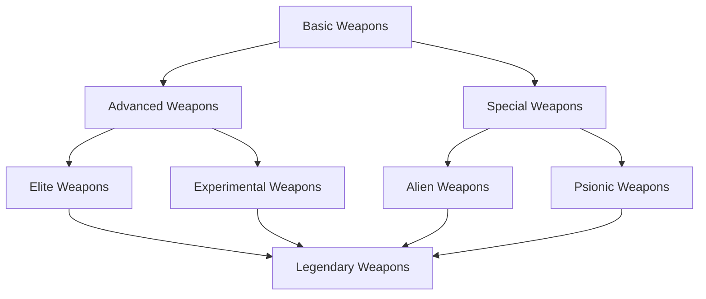

# Weapon System

> **Implementation**: `../../../engine/battlescape/combat/`, `../../../engine/core/items/`
> **Tests**: `../../../tests/battlescape/`, `../../../tests/unit/test_accuracy_system.lua`
> **Related**: `docs/battlescape/unit-systems/README.md`, `docs/content/items.md`

Comprehensive weapon mechanics for units and crafts with damage, accuracy, and tactical systems.

## 🔫 Weapon Categories

### Unit Weapons
Personal firearms and equipment for infantry combat.

**Weapon Types:**
- **Rifles**: Primary assault weapons with balanced range and damage
- **Pistols**: Sidearms for close-quarters combat
- **Heavy Weapons**: High-damage weapons with mobility penalties
- **Special Weapons**: Grenades, melee weapons, and exotic ordnance

### Craft Weapons
Vehicle-mounted armament systems for aerial and ground combat.

**Weapon Types:**
- **Turrets**: Fixed-position defensive weapons
- **Missiles**: Guided projectile systems
- **Aerial Weapons**: Specialized aircraft ordnance
- **Defensive Systems**: Countermeasures and protection

## 💥 Damage System

### Damage Calculations
Mathematical system determining final damage output.

**Damage Formula:**
- **Base Damage**: Weapon's raw damage value
- **Randomization**: 50%-150% variance for unpredictability
- **Resistance Application**: Damage type vs armor resistance
- **Armor Reduction**: Final damage after armor subtraction

### Damage Methods
Targeting systems for different area effects.

**Targeting Types:**
- **Point Damage**: Single tile precision targeting
- **Area Damage**: Splash effects with cutoff ranges
- **Combined Methods**: Weapons can use multiple damage types

### Damage Models
Various effects on target units beyond health reduction.

**Effect Types:**
- **Health Damage**: Standard hit point reduction
- **Stun Damage**: Temporary immobilization effects
- **Morale Damage**: Psychological impact on unit performance
- **Energy Drain**: Depletion of unit energy pools

### Damage Types
Elemental and physical damage categories with armor interactions.

**Type Categories:**
- **Kinetic**: Physical projectiles and impacts
- **Explosive**: Blast and fragmentation damage
- **Fire**: Incendiary and burning effects
- **Laser**: Energy beam weapons
- **Special**: Unique damage types (plasma, psionic, etc.)

## 🎯 Weapon Mechanics

### Weapon Modes
Firing options modifying weapon behavior and costs.

**Mode Types:**
- **Snap**: Single precise shots with accuracy bonus
- **Auto**: Continuous fire with increased damage
- **Aim**: Precision mode with range and accuracy bonuses
- **Far**: Extended range capability
- **Strong**: Increased damage output

**Mode Modifiers:**
- **AP Cost**: Action point consumption
- **EP Cost**: Energy point requirements
- **Cooldown**: Recovery time after use
- **Range Mod**: Distance modifiers
- **Damage Mod**: Power adjustments
- **Accuracy Mod**: Hit chance changes
- **Critical Mod**: Critical hit probability

### Weapon Economy
Resource costs for weapon operation and usage.

**Resource Costs:**
- **Action Points**: Tactical turn consumption for firing
- **Cooldown**: Recovery time between shots
- **Energy Points**: Ammunition consumption
- **Energy Pool**: Clip size and regeneration rate

### Unit/Craft Bonuses
Weapon-granted modifiers to unit or craft statistics.

**Bonus Types:**
- **Accuracy**: Hit chance improvements
- **Damage**: Raw power increases
- **Energy Pool**: Ammunition capacity enhancements
- **Special Abilities**: Unique tactical capabilities

## 📏 Weapon Restrictions

### Class Limitations
Weapon availability restrictions based on unit type or specialization.

**Restriction Types:**
- **Class Requirements**: Specific soldier classes (medic, heavy, etc.)
- **Race Limitations**: Species-specific weapon compatibility
- **Training Requirements**: Skill prerequisites for advanced weapons
- **Equipment Conflicts**: Incompatible gear combinations

### Line of Fire
Targeting requirements for optimal weapon performance.

**Line of Fire Rules:**
- **Required for Some Weapons**: Certain weapons need clear line of fire
- **50% Penalty**: Reduced effectiveness without proper positioning
- **Different from Line of Sight**: Visibility vs firing arc distinction
- **Tactical Positioning**: Unit placement affects weapon effectiveness

### Throwing Mechanics
Projectile weapons with simplified arc system.

**Throwing Rules:**
- **Flat Map System**: No complex arc calculations
- **Strength/Weight Range**: Unit attributes affect throw distance
- **Same as Firing**: Uses standard targeting but with throw mechanics
- **No Arcs**: Simplified flat-world throwing system

## 🎮 Player Experience

### Weapon Strategy
- **Loadout Optimization**: Match weapons to unit roles and mission types
- **Mode Selection**: Choose firing modes based on tactical situation
- **Resource Management**: Balance AP, EP, and cooldown timing
- **Positioning**: Use line of fire and cover for optimal effectiveness

### Combat Tactics
- **Weapon Synergy**: Combine different weapon types for effectiveness
- **Situational Awareness**: Adapt to damage types and resistances
- **Resource Planning**: Manage ammunition and energy pools
- **Positioning**: Use terrain and cover for tactical advantage

### Weapon Challenges
- **Resource Limits**: Ammunition and energy constraints
- **Cooldown Management**: Recovery times affect combat flow
- **Accuracy Variance**: Unpredictable hit chances
- **Counterplay**: Weapons have weaknesses and limitations

## 📊 Weapon Balance

### Progression Scaling
- **Early Game**: Basic weapons with reliable performance
- **Mid Game**: Advanced weapons with tactical options
- **Late Game**: High-tech weapons with powerful capabilities
- **Specialization**: Different weapons for different playstyles

### Difficulty Scaling
- **Rookie**: Reliable accuracy, generous ammunition, fast cooldowns
- **Veteran**: Standard weapon performance and limitations
- **Commander**: Reduced accuracy, limited ammunition, slow cooldowns
- **Legend**: Unreliable accuracy, scarce ammunition, very slow cooldowns

### Balance Considerations
- **Counter Systems**: Weapons have appropriate counters
- **Resource Costs**: Powerful weapons require significant investment
- **Tactical Depth**: Meaningful weapon choices affect combat
- **Progression Rewards**: Research unlocks increasingly powerful options

### Integration Points
- **Manufacturing**: Weapons require facilities and materials (see `docs/economy/manufacturing.md`)
- **Research**: Technology unlocks new weapon types (see `docs/economy/research.md`)
- **Unit Training**: Soldier skills affect weapon effectiveness (see `docs/battlescape/unit-systems/`)
- **Mission Planning**: Weapon availability affects tactical planning (see `docs/geoscape/missions.md`)

## 📈 Weapon Examples & Tables

### Weapon Comparison Matrix

| Weapon | Damage | AP Cost | Range | Accuracy | Special |
|--------|--------|---------|-------|----------|---------|
| **Pistol** | 25 | 3 | 12 | 70% | Fast, low damage |
| **Rifle** | 35 | 4 | 20 | 65% | Balanced, reliable |
| **SMG** | 20 | 3 | 10 | 60% | Auto-fire capable |
| **Sniper** | 55 | 5 | 30 | 80% | Long range, slow |
| **Shotgun** | 45 | 4 | 6 | 50% | Close range, spread |
| **Heavy Cannon** | 80 | 6 | 15 | 55% | High damage, slow |

### Damage Type Effectiveness Table

| Target Armor | Ballistic | Energy | Explosive | Melee |
|--------------|-----------|--------|-----------|-------|
| **Light Armor** | 100% | 90% | 120% | 80% |
| **Medium Armor** | 80% | 100% | 100% | 60% |
| **Heavy Armor** | 60% | 110% | 80% | 40% |
| **Alien Armor** | 40% | 120% | 90% | 30% |

*Values represent damage multiplier percentages*

### Weapon Mode Comparison

| Mode | AP Cost | EP Cost | Cooldown | Damage Mod | Accuracy Mod | Use Case |
|------|---------|---------|----------|------------|--------------|----------|
| **Snap** | Base | Base | None | 80% | +20% | Quick shots |
| **Auto** | Base+1 | Base+2 | 1 turn | 120% | -15% | Suppression |
| **Aim** | Base+2 | Base | 1 turn | 100% | +30% | Precision |
| **Far** | Base+1 | Base+1 | None | 90% | -10% | Extended range |
| **Strong** | Base+3 | Base+3 | 2 turns | 150% | -25% | Power attack |

### Weapon Progression Tree

### Tactical Weapon Usage Examples

#### Urban Combat Scenario
**Environment:** City streets with cover and civilians
**Recommended Loadout:**
- **SMG**: Close-quarters suppression and room clearing
- **Shotgun**: Door breaching and tight spaces
- **Grenades**: Area denial and cover destruction

**Tactics:**
- Use SMG for initial entry (auto mode for suppression)
- Shotgun for close encounters (strong mode for door destruction)
- Grenades to control choke points

#### Rural Combat Scenario  
**Environment:** Open fields with long sightlines
**Recommended Loadout:**
- **Rifle**: Mid-range engagement (aim mode for precision)
- **Sniper Rifle**: Long-range threat elimination
- **Grenades**: Area control and cover creation

**Tactics:**
- Sniper establishes overwatch positions
- Rifle units advance using terrain
- Grenades create smoke screens for movement

#### Alien Combat Scenario
**Environment:** Unknown alien terrain with unusual threats
**Recommended Loadout:**
- **Plasma Weapons**: Effective vs alien armor
- **Heavy Weapons**: High damage for tough targets
- **Special Ammo**: Alien-specific countermeasures

**Tactics:**
- Plasma weapons for primary damage (energy effective)
- Heavy weapons for suppression (explosive area denial)
- Adapt to unknown alien behaviors and armor types

### Weapon Economy Balance Table

| Weapon Type | Base Cost | Ammo Cost | Maintenance | Rarity |
|-------------|-----------|-----------|-------------|--------|
| **Basic** | $500 | $5/shot | Low | Common |
| **Advanced** | $2,000 | $20/shot | Medium | Uncommon |
| **Elite** | $8,000 | $50/shot | High | Rare |
| **Experimental** | $25,000 | $100/shot | Very High | Unique |

### Cross-Reference Integration
- **Unit Classes**: See `docs/battlescape/unit-systems/` for weapon compatibility
- **Armor Systems**: See `docs/battlescape/armors.md` for damage reduction
- **Combat Mechanics**: See `docs/battlescape/combat-mechanics/` for weapon usage
- **Manufacturing**: See `docs/economy/manufacturing.md` for weapon production