# 🎯 AlienFall ChatModes System

## Complete Guide to AI-Powered Development Personas

**23 Specialized personas organized in 6 layers with Mermaid diagrams explaining how everything connects.**

---

## 📖 Table of Contents

1. [Quick Overview](#quick-overview)
2. [System Architecture](#system-architecture)
3. [The 23 Personas](#the-23-personas)
4. [How They Connect](#how-they-connect)
5. [Common Workflows](#common-workflows)
6. [Using the System](#using-the-system)
7. [Routing Guide](#routing-guide)
8. [Quality Standards](#quality-standards)

---

## Quick Overview

### What is This System?

The **ChatModes System** organizes AlienFall development into **23 specialized personas**, each with distinct role, authority, and responsibility. Select a persona matching your task to get focused, contextually-aware assistance.

### Who Uses It?

- **Game Developers** - Select personas for coding, design, testing
- **AI Assistants** (Copilot, Claude) - Load personas for specialized responses
- **Project Managers** - Route work to appropriate personas
- **New Contributors** - Understand their role and collaborations

### Why It Works

✅ **Clear Authority** - No overlap, everyone knows their domain  
✅ **Information Flow** - Data flows naturally through layers  
✅ **Built-in Quality** - Each persona has quality standards  
✅ **Collaboration Defined** - Main collaborators explicit  
✅ **Scalable** - Works for teams of any size  

---

## System Architecture

### 🏗️ The 5-Layer Model

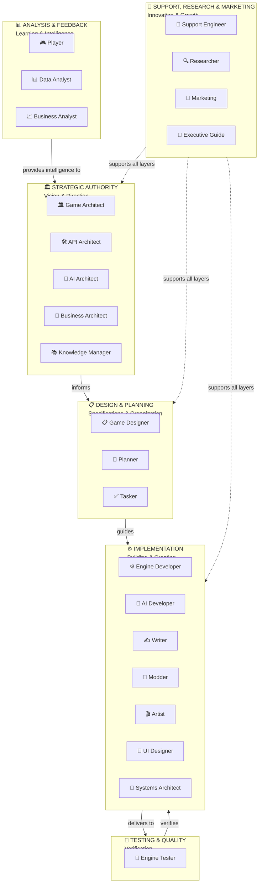

### 📍 Layer Purposes

| Layer | Purpose | Count | Key Decision |
|-------|---------|-------|---------------|
| 🏛️ **Strategic** | Define vision, specs | 5 | WHAT to build |
| 📋 **Design** | Plan work, detail requirements | 3 | HOW to organize |
| ⚙️ **Implementation** | Build & create | 7 | BUILD it |
| 🧪 **Testing** | Verify it works | 1 | VALIDATE it |
| 📊 **Analysis** | Learn from data | 3 | IMPROVE it |
| 🔧 **Support** | Research, troubleshoot, promote | 4 | SUPPORT all |

---

## The 23 Personas

### Strategic Authority Layer (5)

#### 🏛️ **Game Architect**
**Role**: Vision keeper, strategic decisions  
**Authority**: Game vision, core pillars, MVP scope, feature priority  
**Collaboration**: 📋 Game Designer, 🏢 Business Architect, ⚙️ Engine Developer

#### 🛠️ **API Architect**
**Role**: Interface & contract designer  
**Authority**: API specs, data formats, stability guarantees  
**Collaboration**: ⚙️ Engine Developer, 🎨 Modder, 📚 Knowledge Manager

#### 🤖 **AI Architect**
**Role**: AI behavior specification  
**Authority**: Behavior specs, difficulty scaling, faction AI  
**Collaboration**: 🧠 AI Developer, 📋 Game Designer, 🧪 Engine Tester

#### 🏢 **Business Architect**
**Role**: Success metrics definition  
**Authority**: KPIs, success thresholds, measurement frameworks  
**Collaboration**: 📊 Data Analyst, 📈 Business Analyst

#### 📚 **Knowledge Manager**
**Role**: Quality standards oversight  
**Authority**: Doc standards, quality checks, consistency (cross-cutting)  
**Collaboration**: ALL personas

### Design & Planning Layer (3)

#### 📋 **Game Designer**
**Role**: Game mechanics specialist  
**Authority**: Game rules, combat, progression, balance  
**Collaboration**: ⚙️ Engine Developer, 🤖 AI Architect, 🧪 Engine Tester

#### 📅 **Planner**
**Role**: Project organization  
**Authority**: Task org, priorities, dependencies, timeline  
**Collaboration**: ✅ Tasker, 🏛️ Game Architect, ALL implementers

#### ✅ **Tasker**
**Role**: Task refinement  
**Authority**: Task details, success criteria, estimation  
**Collaboration**: 📅 Planner, 📋 Game Designer, implementers

### Implementation Layer (7)

#### ⚙️ **Engine Developer**
**Role**: Core code implementation  
**Authority**: Code architecture, Lua implementation, performance  
**Collaboration**: 📋 Game Designer, 🧪 Engine Tester, 📐 Systems Architect

#### 🧠 **AI Developer**
**Role**: AI algorithm implementation  
**Authority**: AI code, algorithm optimization, behavior validation  
**Collaboration**: 🤖 AI Architect, 🧪 Engine Tester

#### ✍️ **Writer**
**Role**: Story & narrative content  
**Authority**: Campaign narrative, characters, world-building, lore  
**Collaboration**: 🏛️ Game Architect, 🎬 Artist, 🎨 Modder

#### 🎨 **Modder**
**Role**: Content creation & integration  
**Authority**: TOML content, asset integration, mod organization  
**Collaboration**: 🛠️ API Architect, 🎬 Artist, 📋 Game Designer

#### 🎬 **Artist**
**Role**: Graphics & audio creation  
**Authority**: Pixel art, animations, sound, music  
**Collaboration**: 🎨 UI Designer, ✍️ Writer, 🎨 Modder

#### 🎨 **UI Designer**
**Role**: Interface & user experience  
**Authority**: UI/UX, widgets, visual communication, accessibility  
**Collaboration**: ⚙️ Engine Developer, 🎬 Artist, 📚 Knowledge Manager

#### 📐 **Systems Architect**
**Role**: Visual system documentation  
**Authority**: Mermaid diagrams, system visualization, integration flows  
**Collaboration**: ALL personas (supports everyone)

### Testing & Quality Layer (1)

#### 🧪 **Engine Tester**
**Role**: Quality assurance  
**Authority**: Test strategy, coverage, quality metrics  
**Collaboration**: ⚙️ Engine Developer, 📋 Game Designer, ALL builders

### Analysis & Feedback Layer (3)

#### 🎮 **Player**
**Role**: Gameplay testing  
**Authority**: Gameplay experience, bug discovery, data generation  
**Collaboration**: 🧪 Engine Tester, 📊 Data Analyst

#### 📊 **Data Analyst**
**Role**: Game data analysis  
**Authority**: Data collection, processing, technical analysis  
**Collaboration**: 🏢 Business Architect, 📈 Business Analyst

#### 📈 **Business Analyst**
**Role**: Data interpretation  
**Authority**: Insight interpretation, improvement recommendations  
**Collaboration**: 📊 Data Analyst, 📋 Game Designer, 🏛️ Game Architect

### Support, Research & Marketing Layer (4)

#### 🔧 **Support Engineer**
**Role**: Troubleshooting  
**Authority**: Error analysis, bug investigation, prioritization  
**Collaboration**: ⚙️ Engine Developer, 🧪 Engine Tester

#### 🔍 **Researcher**
**Role**: Game research & innovation  
**Authority**: Competitive analysis, mechanics research, best practices  
**Collaboration**: 📋 Game Designer, ✍️ Writer, 🎬 Artist

#### 📢 **Marketing**
**Role**: Marketing strategy & content  
**Authority**: Game positioning, social media, marketing campaigns  
**Collaboration**: 🏛️ Game Architect, ✍️ Writer, 🎬 Artist

#### 🎯 **Executive Guide**
**Role**: System orientation  
**Authority**: System navigation, onboarding  
**Used by**: Everyone (entry point)

---

## How They Connect

### 🔄 Information Flow

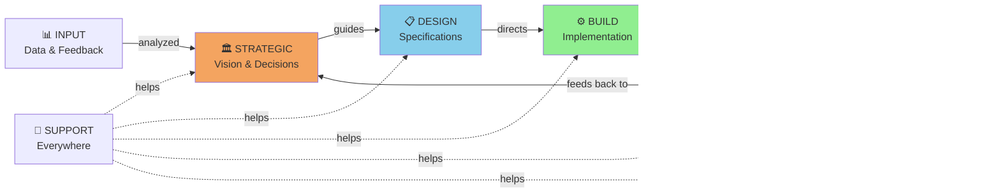

### 🤝 Core Collaboration Network

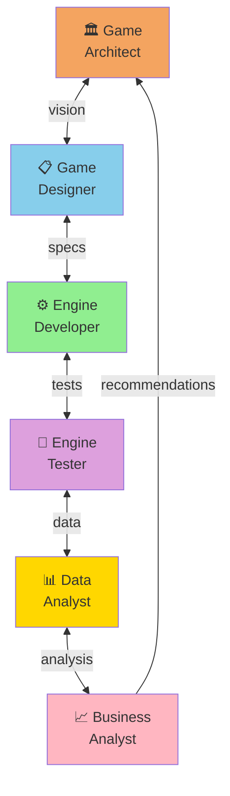

### 🔗 Dependency Relationships

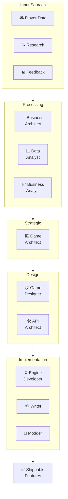

---

## Common Workflows

### 📋 Workflow 1: New Feature Development

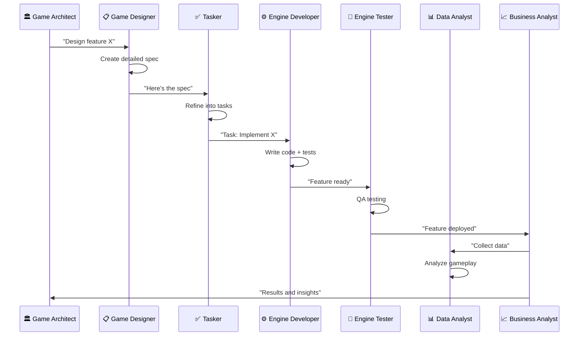

### 🔧 Workflow 2: Bug Fix

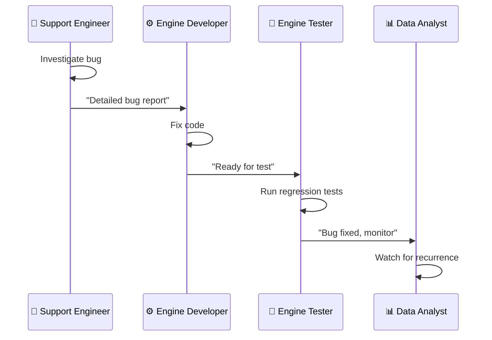

### ⚖️ Workflow 3: Game Balance Adjustment

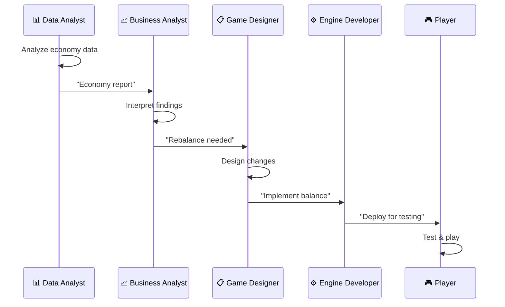

### 📚 Workflow 4: Content Creation

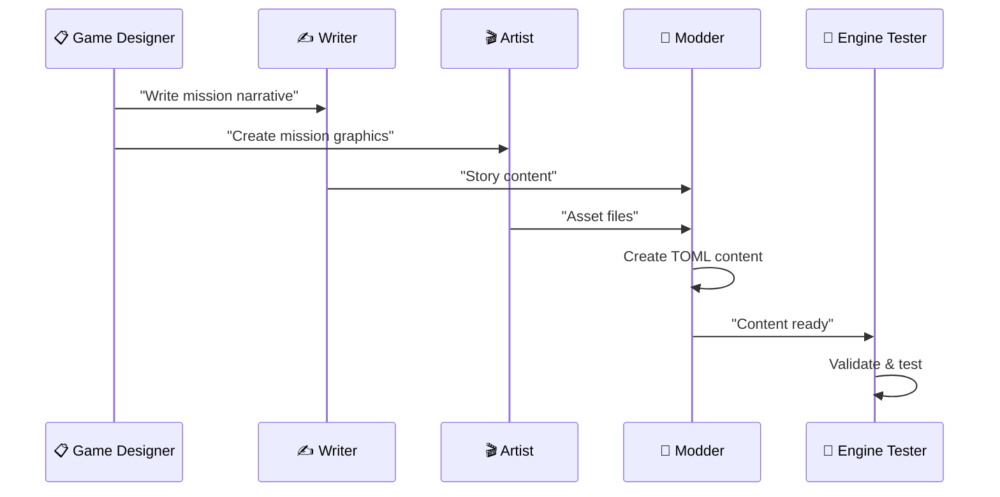

### 🎨 Workflow 5: UI Screen Design

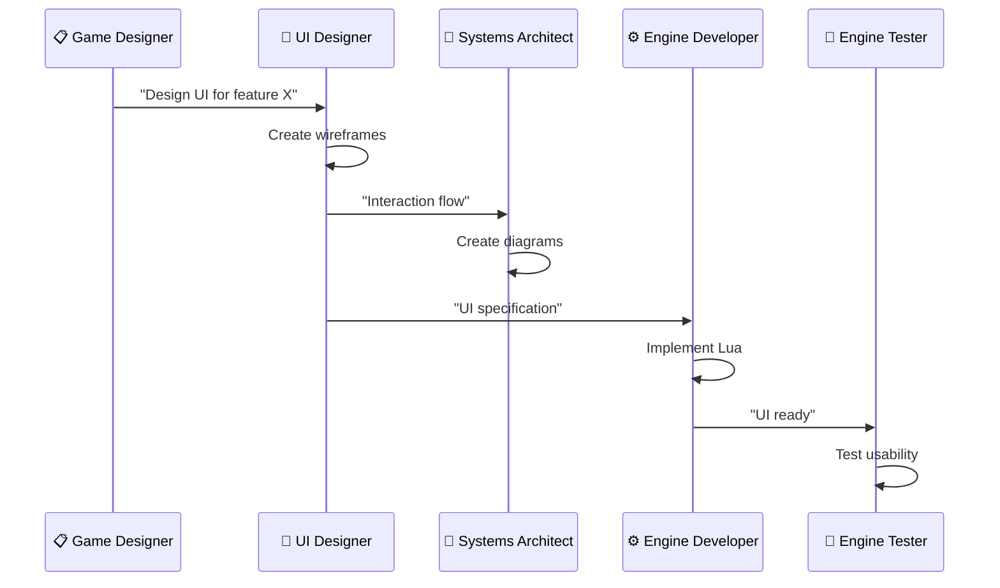

### 🔍 Workflow 6: Research & Innovation

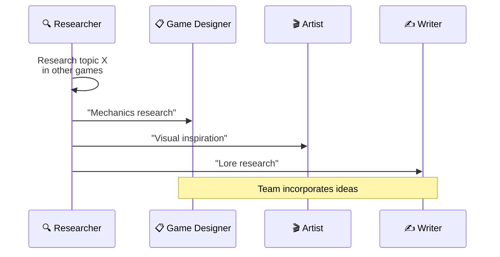

---

## Using the System

### 🎯 5-Minute Quick Start

**Step 1: Find Your Task**
- What are you working on right now?
- Look at the routing guide below

**Step 2: Load the Persona**
- Each persona has a `.chatmode.md` file
- Load it in your AI tool
- Example: `⚙️EngineDeveloper.chatmode.md`

**Step 3: Follow Their Process**
- Read their documented processes
- Use their quality standards
- Reference collaborators when needed

**Step 4: Start Working**
- You're ready!
- Ask the persona questions
- Follow their guidance

### 📁 All Persona Files

All 23 persona files are in `.github/chatmodes/`:

```
🏛️GameArchitect.chatmode.md
🛠️APIArchitect.chatmode.md
🤖AIArchitect.chatmode.md
🏢BusinessArchitect.chatmode.md
📚KnowledgeManager.chatmode.md
📋GameDesigner.chatmode.md
📅Planner.chatmode.md
✅Tasker.chatmode.md
⚙️EngineDeveloper.chatmode.md
🧠AIDeveloper.chatmode.md
✍️Writer.chatmode.md
🎨Modder.chatmode.md
🎬Artist.chatmode.md
🎨UIDesigner.chatmode.md
📐SystemsArchitect.chatmode.md
🧪EngineTester.chatmode.md
🎮Player.chatmode.md
📊DataAnalyst.chatmode.md
📈BusinessAnalyst.chatmode.md
🔧SupportEngineer.chatmode.md
🔍Researcher.chatmode.md
📢Marketing.chatmode.md
🎯ExecutiveGuide.chatmode.md
```

---

## Routing Guide

### 🎯 "I Need to..." → Load This Persona

#### Strategic Questions
| Question | Persona | File |
|----------|---------|------|
| What's the game vision? | 🏛️ Game Architect | `🏛️GameArchitect.chatmode.md` |
| Is this aligned with our vision? | 🏛️ Game Architect | `🏛️GameArchitect.chatmode.md` |
| What's the MVP? | 🏛️ Game Architect | `🏛️GameArchitect.chatmode.md` |

#### Game Design
| Question | Persona | File |
|----------|---------|------|
| How should combat work? | 📋 Game Designer | `📋GameDesigner.chatmode.md` |
| Is this balanced? | 📋 Game Designer | `📋GameDesigner.chatmode.md` |
| What's the progression system? | 📋 Game Designer | `📋GameDesigner.chatmode.md` |

#### Implementation
| Question | Persona | File |
|----------|---------|------|
| How do I code this? | ⚙️ Engine Developer | `⚙️EngineDeveloper.chatmode.md` |
| What's the architecture? | ⚙️ Engine Developer | `⚙️EngineDeveloper.chatmode.md` |
| Performance issues? | ⚙️ Engine Developer | `⚙️EngineDeveloper.chatmode.md` |

#### Testing & Quality
| Question | Persona | File |
|----------|---------|------|
| Test this feature | 🧪 Engine Tester | `🧪EngineTester.chatmode.md` |
| Quality standards? | 📚 Knowledge Manager | `📚KnowledgeManager.chatmode.md` |
| Bug investigation? | 🔧 Support Engineer | `🔧SupportEngineer.chatmode.md` |

#### Content & Creative
| Question | Persona | File |
|----------|---------|------|
| Create game content | 🎨 Modder | `🎨Modder.chatmode.md` |
| Asset creation? | 🎬 Artist | `🎬Artist.chatmode.md` |
| Story & narrative | ✍️ Writer | `✍️Writer.chatmode.md` |

#### AI & Behavior
| Question | Persona | File |
|----------|---------|------|
| Design AI behavior | 🤖 AI Architect | `🤖AIArchitect.chatmode.md` |
| Implement AI | 🧠 AI Developer | `🧠AIDeveloper.chatmode.md` |
| Difficulty scaling | 🤖 AI Architect | `🤖AIArchitect.chatmode.md` |

#### Analysis & Data
| Question | Persona | File |
|----------|---------|------|
| Analyze game data | 📊 Data Analyst | `📊DataAnalyst.chatmode.md` |
| What does data mean? | 📈 Business Analyst | `📈BusinessAnalyst.chatmode.md` |
| Player feedback? | 🎮 Player | `🎮Player.chatmode.md` |

#### Research & Innovation
| Question | Persona | File |
|----------|---------|------|
| How do others do it? | 🔍 Researcher | `🔍Researcher.chatmode.md` |
| Best practices? | 🔍 Researcher | `🔍Researcher.chatmode.md` |
| Marketing & promotion | 📢 Marketing | `📢Marketing.chatmode.md` |

#### UI & User Experience
| Question | Persona | File |
|----------|---------|------|
| Design UI screen | 🎨 UI Designer | `🎨UIDesigner.chatmode.md` |
| Visual explanation | 📐 Systems Architect | `📐SystemsArchitect.chatmode.md` |
| Show me a diagram | 📐 Systems Architect | `📐SystemsArchitect.chatmode.md` |

#### API & Interfaces
| Question | Persona | File |
|----------|---------|------|
| API design? | 🛠️ API Architect | `🛠️APIArchitect.chatmode.md` |
| How do I mod? | 🛠️ API Architect | `🛠️APIArchitect.chatmode.md` |

#### Project Management
| Question | Persona | File |
|----------|---------|------|
| What tasks are planned? | 📅 Planner | `📅Planner.chatmode.md` |
| When will X be done? | 📅 Planner | `📅Planner.chatmode.md` |
| Refine this task | ✅ Tasker | `✅Tasker.chatmode.md` |

#### Getting Started
| Question | Persona | File |
|----------|---------|------|
| I'm confused | 🎯 Executive Guide | `🎯ExecutiveGuide.chatmode.md` |
| How does this system work? | 🎯 Executive Guide | `🎯ExecutiveGuide.chatmode.md` |
| Help me get oriented | 🎯 Executive Guide | `🎯ExecutiveGuide.chatmode.md` |

---

## Quality Standards

### ✅ System-Wide Quality Gates

Each layer enforces quality:

**🏛️ Strategic Layer**
- ✅ Vision is clear (>90% team alignment)
- ✅ Specs are unambiguous
- ✅ Authority is clear
- ✅ Decisions are documented

**📋 Design Layer**
- ✅ Requirements are detailed
- ✅ Success criteria are measurable
- ✅ Tasks are estimable
- ✅ Dependencies are mapped

**⚙️ Implementation Layer**
- ✅ Code matches specs
- ✅ >80% test coverage
- ✅ Performance targets met
- ✅ Zero critical bugs

**🧪 Testing Layer**
- ✅ All features tested
- ✅ Regressions caught
- ✅ Edge cases covered
- ✅ Performance verified

**📊 Analysis Layer**
- ✅ Data is accurate
- ✅ Insights are actionable
- ✅ Trends are identified
- ✅ Recommendations are evidence-based

### 📊 Key Metrics by Layer

| Layer | Primary Metric | Target |
|-------|---------------|--------|
| 🏛️ Strategic | Vision clarity | >95% |
| 📋 Design | Spec completeness | 100% |
| ⚙️ Implementation | Test coverage | >80% |
| 🧪 Testing | Bug detection | >95% |
| 📊 Analysis | Data accuracy | >95% |

---

## Authority Matrix

### Who Owns What?

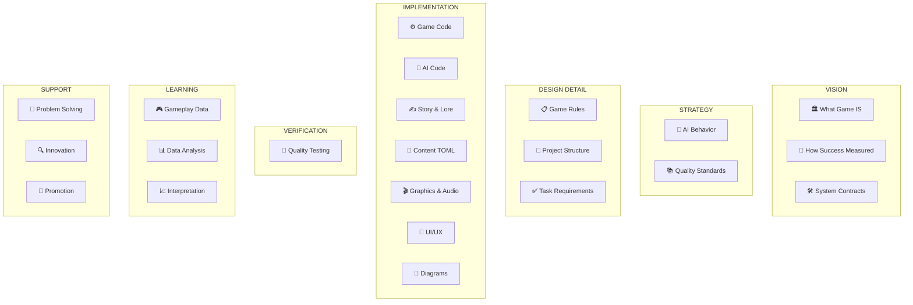

---

## System Statistics

```
Total Personas:        23
Organized in:          6 Layers
Documentation Files:   25+
Total Content:         80,000+ words

Layer Breakdown:
├─ 🏛️ Strategic Authority:   5 personas
├─ 📋 Design & Planning:    3 personas
├─ ⚙️ Implementation:        7 personas
├─ 🧪 Testing & Quality:    1 persona
├─ 📊 Analysis & Feedback:  3 personas
└─ 🔧 Support & Research:   4 personas
```

---

## Getting Help

### ❓ FAQ

**Q: Which persona should I use?**  
A: Find your task in the routing guide above. Match it to the persona list.

**Q: Can I use multiple personas?**  
A: Yes! Load them sequentially. Example: 🏛️ Game Architect → 📋 Game Designer

**Q: What if I'm still unsure?**  
A: Start with 🎯 Executive Guide. They help orient people.

**Q: How do I know I'm following the system right?**  
A: Each persona has quality standards. Follow them!

**Q: How often should personas be updated?**  
A: Quarterly as the game evolves.

---

## Next Steps

### 🚀 Ready?

1. **Pick your role** - Find it in routing guide
2. **Load your persona** - Open the `.chatmode.md` file
3. **Read Quick Reference** - At bottom of persona file
4. **Start working** - Follow documented processes
5. **Reference collaborators** - Know who to work with

### 📚 Learn More

- **System Architecture**: See diagrams in this document
- **Information Flows**: Review [How They Connect](#how-they-connect)
- **Common Workflows**: Check [Common Workflows](#common-workflows)
- **Authority Details**: See [Authority Matrix](#authority-matrix)

---

## System Info

**Version**: 2.0  
**Released**: October 16, 2025  
**Status**: ✅ ACTIVE & OPERATIONAL  
**Total Personas**: 23 Ready to Use  
**Documentation**: Complete with Mermaid Diagrams  

---

**For questions, feedback, or improvements:** Contact the 📚 Knowledge Manager or 🎯 Executive Guide.

