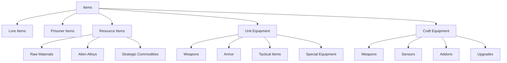
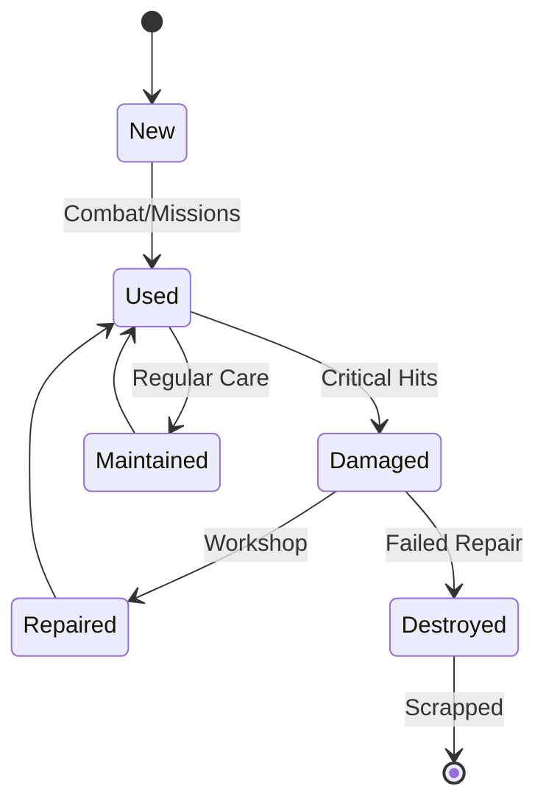

# Item System

> **Implementation**: `../../../engine/core/items/`, `../../../engine/basescape/logic/`
> **Tests**: `../../../tests/unit/test_data_loader.lua`, `../../../tests/systems/`
> **Related**: `docs/economy/manufacturing.md`, `docs/battlescape/unit-systems/README.md`

Comprehensive item management system for equipment, resources, and special objects.

## 📦 Item Categories

### Lore Items
Narrative-significant artifacts and story objects with special properties.

**Lore Characteristics:**
- **Zero Storage Cost**: No capacity requirements for storage
- **Global Access**: Shared across all bases automatically
- **Story Integration**: Plot-significant objects and artifacts
- **Special Properties**: Unique abilities or narrative effects

### Prisoner Items
Captured alien entities requiring containment and management.

**Prisoner Management:**
- **Containment Requirements**: Prison facility capacity needed
- **Interrogation Potential**: Intelligence gathering opportunities
- **Research Value**: Scientific study and technology insights
- **Instability Risk**: Potential escape or deterioration over time

### Resource Items
Raw materials and commodities for manufacturing and operations.

**Resource Types:**
- **Raw Materials**: Basic substances for production
- **Alien Alloys**: Advanced materials from recovered technology
- **Strategic Commodities**: Rare or valuable trade goods
- **Commodity Usage**: Cannot be equipped, used for manufacturing/trade

### Unit Equipment
Personal gear for soldiers including weapons, armor, and tactical items.

**Equipment Categories:**
- **Weapons**: Firearms, melee weapons, and special ordnance
- **Armor**: Protective gear and defensive equipment
- **Tactical Items**: Grenades, medical supplies, and tools
- **Special Equipment**: Advanced or experimental gear

### Craft Equipment
Vehicle-mounted systems for aircraft and ground vehicles.

**Craft Systems:**
- **Weapons**: Vehicle-mounted armament and defenses
- **Sensors**: Detection and targeting systems
- **Addons**: Performance modifications and special capabilities
- **Upgrades**: Enhancement systems for existing vehicles

## ⚖️ Item Mechanics

### Weight vs Unit Size
Encumbrance system balancing equipment load against carrying capacity.

**Weight Factors:**
- **Item Mass**: Physical weight of equipment
- **Unit Capacity**: Soldier carrying limits
- **Movement Impact**: Weight affecting mobility and stamina
- **Storage Requirements**: Base inventory space allocation

### Usage Economy
Resource costs for item activation and operation.

**Usage Costs:**
- **Action Points**: Tactical turn costs for item use
- **Energy Consumption**: Battery or power requirements
- **Cooldown Periods**: Recovery time between uses
- **Ammunition**: Expendable resources for weapons

## 🎮 Player Experience

### Inventory Management
- **Storage Planning**: Balance capacity across multiple bases
- **Equipment Loadouts**: Optimize soldier gear for missions
- **Resource Stockpiling**: Maintain supplies for manufacturing
- **Logistics Coordination**: Move items between base locations

### Item Strategy
- **Equipment Selection**: Choose gear based on mission requirements
- **Resource Allocation**: Prioritize critical manufacturing materials
- **Prisoner Management**: Balance containment vs research value
- **Lore Integration**: Utilize story items for narrative progression

### Item Challenges
- **Capacity Limits**: Storage constraints affect operations
- **Resource Scarcity**: Limited availability of key materials
- **Equipment Degradation**: Items wear out over time
- **Logistics Complexity**: Moving items between locations

## 📈 Item Balance

### Rarity System
- **Common**: Readily available basic equipment
- **Uncommon**: Specialized gear with limited availability
- **Rare**: Advanced equipment requiring research
- **Unique**: One-of-a-kind items with special properties

### Economic Integration
- **Manufacturing Costs**: Resource requirements for production
- **Market Value**: Trading prices for surplus items
- **Research Requirements**: Technology needed for advanced items
- **Mission Rewards**: Combat operations provide item rewards

### Progression Integration
- **Technology Unlocks**: Research enables new item types
- **Manufacturing Access**: Facilities allow item production
- **Reputation Effects**: Relationships affect item availability
- **Campaign Scaling**: Item power scales with organization growth

### Balance Considerations
- **Power Scaling**: Items appropriate for current progression level
- **Counterplay**: Equipment has weaknesses and limitations
- **Resource Management**: Items require ongoing support
- **Strategic Depth**: Meaningful equipment choices affect gameplay

## 📈 Item Examples & Tables

### Item Category Hierarchy

### Item Rarity Comparison Matrix

| Rarity | Availability | Research Required | Manufacturing Cost | Strategic Value |
|--------|--------------|-------------------|-------------------|-----------------|
| **Common** | High | None | Low | Operational |
| **Uncommon** | Medium | Basic | Medium | Tactical |
| **Rare** | Low | Advanced | High | Strategic |
| **Unique** | Very Low | Elite | Very High | Game-Changing |

### Equipment Loadout Examples

#### Assault Specialist Loadout
**Primary:** Plasma Rifle (Rare) - High damage, energy efficient
**Secondary:** Pistol (Common) - Backup weapon, reliable
**Armor:** Power Armor (Rare) - Heavy protection, strength bonus
**Tactical:** 2x Plasma Grenades (Uncommon) - Area denial, alien effective

**Total Weight:** 8 units | **Cost:** $45,000 | **Best For:** Frontline combat, high-threat missions

#### Recon Scout Loadout
**Primary:** Sniper Rifle (Uncommon) - Long range, precision
**Secondary:** SMG (Common) - Close defense, auto-fire
**Armor:** Light Armor (Common) - Mobility focus, minimal weight
**Tactical:** Medikit (Common) - Self-healing, smoke grenade (Common)

**Total Weight:** 4 units | **Cost:** $18,000 | **Best For:** Stealth missions, overwatch positions

#### Support Medic Loadout
**Primary:** Shotgun (Common) - Close range, spread damage
**Secondary:** Pistol (Common) - Backup, reliable
**Armor:** Medium Armor (Uncommon) - Balanced protection
**Tactical:** 3x Medikits (Common) - Healing focus, stim pack (Uncommon)

**Total Weight:** 6 units | **Cost:** $22,000 | **Best For:** Squad support, rescue missions

### Resource Item Usage Matrix

| Resource | Primary Use | Manufacturing Output | Market Value | Storage Notes |
|----------|-------------|---------------------|--------------|---------------|
| **Alloys** | Basic weapons/armor | Rifles, light armor | $500/unit | High volume |
| **Elerium** | Energy weapons | Plasma weapons | $2,000/unit | Secure storage |
| **Alien Alloys** | Advanced equipment | Power armor, crafts | $5,000/unit | Limited supply |
| **Electronics** | Weapon systems | All firearms | $300/unit | Moderate volume |
| **Alien Tech** | Research components | Elite equipment | $10,000/unit | Rare, valuable |

### Prisoner Management Scenarios

#### High-Value Scientist
**Containment Level:** Maximum security
**Interrogation Potential:** 80% success rate
**Research Value:** +25% to all projects
**Risk Level:** Low escape chance, high morale impact if lost
**Strategic Decision:** Balance research bonus vs containment costs

#### Elite Commander
**Containment Level:** Enhanced security
**Interrogation Potential:** 60% success rate
**Research Value:** +15% to combat projects
**Risk Level:** Medium escape chance, moderate morale impact
**Strategic Decision:** Use for tactical intelligence vs research benefits

#### Common Soldier
**Containment Level:** Standard security
**Interrogation Potential:** 40% success rate
**Research Value:** +5% to basic projects
**Risk Level:** High escape chance, low morale impact
**Strategic Decision:** Often better to release for reputation vs minimal research gain

### Item Degradation Flow

### Inventory Capacity Planning

| Base Size | Storage Capacity | Personnel Capacity | Craft Capacity | Expansion Cost |
|-----------|------------------|-------------------|----------------|----------------|
| **Small** | 500 items | 20 personnel | 2 crafts | $100K |
| **Medium** | 1,000 items | 40 personnel | 4 crafts | $250K |
| **Large** | 2,000 items | 80 personnel | 8 crafts | $500K |
| **Mega** | 5,000 items | 160 personnel | 16 crafts | $1M |

### Cross-Reference Integration
- **Unit Equipment**: See `docs/battlescape/unit-systems/` for equipment compatibility and loadout rules
- **Weapons & Armor**: See `docs/battlescape/weapons.md` and `docs/battlescape/armors.md` for specific item details
- **Manufacturing**: See `docs/economy/manufacturing.md` for production requirements and costs
- **Research**: See `docs/economy/research.md` for technology prerequisites for advanced items
- **Economic System**: See `docs/economy/funding.md` for item costs and marketplace integration
- **Mission Rewards**: See `docs/geoscape/missions.md` for item acquisition through operations