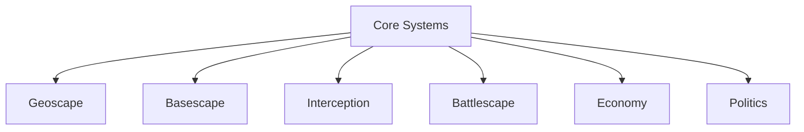
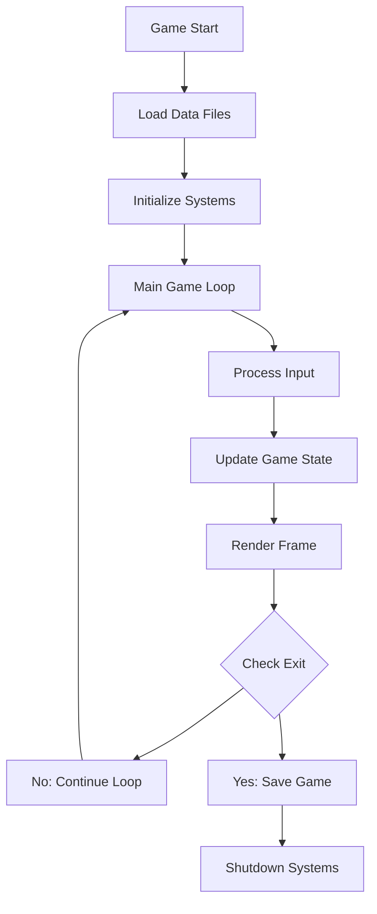

# Core Systems

> **Implementation**: `../../engine/core/`
> **Tests**: `../../tests/unit/`, `../../tests/systems/`
> **Related**: All game layers depend on core systems

Fundamental game mechanics that underpin all gameplay layers. Core systems define the basic rules and structure of the game.

## 📄 Documents

- **[game-loop.md](game-loop.md)** - Turn structure and update cycle
- **[calendar-system.md](calendar-system.md)** - Time management and scheduling
- **[save-system.md](save-system.md)** - Save/load mechanics

## 🎯 Core Concepts

### Turn-Based Everything
All gameplay is turn-based. No real-time elements:
- Geoscape: 1 day per turn
- Interception: Card-based turns  
- Battlescape: Unit activation turns

### Calendar System
Unified time tracking across all layers:
- 1 turn = 1 day
- 6 days = 1 week
- 30 days = 1 month
- 360 days = 1 year

### Data-Driven Design
Game content defined in data files (TOML), not hardcoded. Enables easy modding and balance tuning.

## 🔗 System Interactions



All game layers build on core systems for:
- Time progression
- State management
- Data loading
- Save/load

## 🏗️ Implementation Status

| System | Design | Implementation | Tests |
|--------|--------|----------------|-------|
| Game Loop | ✓ | `engine/main.lua` | `tests/` |
| Calendar | ✓ | `engine/core/calendar.lua` | TBD |
| Save System | Partial | `engine/core/save_system.lua` | TBD |

---

**Next**: [Geoscape Systems](../geoscape/)

## 📈 Core System Examples & Tables

### Game Loop Flow


### Turn Structure Comparison

| Game Layer | Turn Duration | Player Actions | AI Actions | Resolution |
|------------|---------------|----------------|------------|------------|
| **Geoscape** | 1 day | Deploy crafts, manage bases | UFO movement, mission updates | Daily events |
| **Interception** | Variable | Play cards, maneuver | UFO responses | Combat resolution |
| **Battlescape** | 1 unit activation | Move, attack, use items | Unit AI decisions | Action point depletion |

### Calendar System Progression

| Time Unit | Duration | Events | Player Impact |
|-----------|----------|--------|---------------|
| **Day** | 1 turn | Mission updates, UFO movement | Daily decisions |
| **Week** | 6 days | New missions generated | Strategic planning |
| **Month** | 30 days | Funding payments, base construction | Economic management |
| **Quarter** | 90 days | Major events, tech breakthroughs | Long-term strategy |
| **Year** | 360 days | Campaign milestones | Victory conditions |

### Data-Driven Architecture Examples

#### Unit Definition (TOML)
```toml
[unit.soldier]
name = "Soldier"
class = "rifleman"
health = 100
mobility = 12
weapons = ["rifle", "pistol"]
armor = "medium_armor"
cost = 20000
```

#### Mission Template (TOML)
```toml
[mission.crash_site]
type = "recovery"
duration = "2-4 hours"
objectives = ["recover_tech", "defend_position"]
enemy_count = "4-8"
rewards = ["alien_alloy", "elerium"]
```

#### Research Project (TOML)
```toml
[research.plasma_weapons]
name = "Plasma Weapons"
cost = 500
time = 30
prerequisites = ["laser_weapons"]
unlocks = ["plasma_rifle", "plasma_pistol"]
description = "Advanced energy weapons technology"
```

### System Initialization Sequence

| Order | System | Purpose | Dependencies |
|-------|--------|---------|--------------|
| **1** | Data Loader | Load TOML configs | None |
| **2** | Calendar | Initialize time system | Data Loader |
| **3** | Save System | Load game state | Data Loader |
| **4** | World Map | Create geography | Data Loader |
| **5** | Economy | Initialize funding | Data Loader, Calendar |
| **6** | Basescape | Load base data | Data Loader, Economy |
| **7** | Geoscape | Start world simulation | All above |

### Core System Testing Strategy

| Test Type | Coverage | Frequency | Tools |
|-----------|----------|-----------|-------|
| **Unit Tests** | Individual functions | Continuous | Busted (Lua testing) |
| **Integration Tests** | System interactions | Daily | Custom test runner |
| **Save/Load Tests** | Data persistence | Weekly | Automated scripts |
| **Performance Tests** | System efficiency | Milestone | Profiling tools |

### Cross-Reference Integration
- **Game Loop**: See `docs/core/game-loop.md` for detailed turn mechanics
- **Calendar System**: See `docs/core/calendar-system.md` for time management
- **Save System**: See `docs/core/save-system.md` for persistence mechanics
- **Data Files**: See `docs/content/` for TOML configuration examples
- **All Game Layers**: Core systems support geoscape, basescape, battlescape, and interception layers
