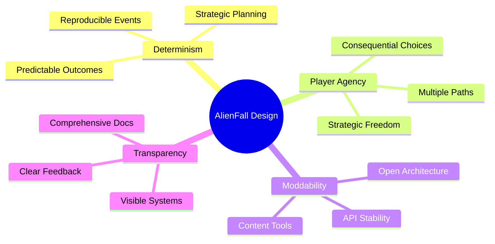
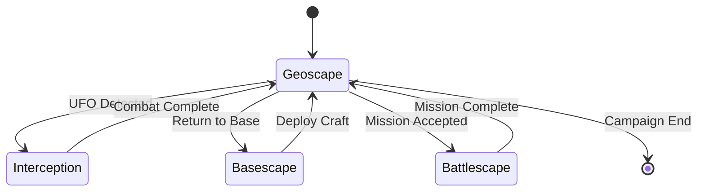

# Core Concepts

> **Implementation**: `../../engine/core/`, `../../engine/main.lua`
> **Tests**: `../../tests/unit/test_data_loader.lua`, `../../tests/unit/test_state_manager.lua`, `../../tests/unit/test_pathfinding.lua`
> **Related**: `docs/core/README.md`, `docs/lore/narrative.md`

Fundamental design principles and architectural layers defining the game.

## 🏗️ Game Layers Overview

### Geoscape Layer
Global strategic world map and mission management.

**Geoscape Features:**
- **World Map**: Geographic representation of Earth and mission sites
- **Craft Movement**: Vehicle deployment and interception operations
- **Mission Generation**: Dynamic operation creation and assignment
- **Strategic Planning**: Long-term campaign decision making

### Basescape Layer
Base construction, management, and resource allocation.

**Basescape Features:**
- **Facility Building**: Base expansion and capability development
- **Resource Management**: Personnel and material allocation
- **Production Systems**: Manufacturing and research operations
- **Economic Control**: Funding and resource flow management

### Interception Layer
Aerial combat and spacecraft engagement.

**Interception Features:**
- **Dogfighting**: Tactical aircraft combat mechanics
- **UFO Interception**: Alien craft engagement and destruction
- **Craft Management**: Vehicle deployment and recovery
- **Strategic Defense**: Airspace protection and threat response

### Battlescape Layer
Tactical ground combat and unit management.

**Battlescape Features:**
- **Unit Control**: Soldier deployment and tactical commands
- **Terrain Interaction**: Environmental tactical considerations
- **Combat Resolution**: Turn-based tactical engagement
- **Mission Objectives**: Specific operation goal completion

### Economy Layer
Resource management and financial systems.

**Economy Features:**
- **Funding Systems**: Government grants and income management
- **Manufacturing**: Equipment production and supply chains
- **Marketplace**: Resource trading and procurement
- **Research Investment**: Technology development funding

### Modding Layer
Community content creation and customization.

**Modding Features:**
- **Content Extension**: New units, weapons, and missions
- **Balance Modification**: Gameplay parameter adjustment
- **UI Customization**: Interface and visual modification
- **Total Conversions**: Complete gameplay transformation

### Lore Layer
Narrative framework and story integration.

**Lore Features:**
- **Campaign Structure**: Long-term story progression
- **Faction Dynamics**: Alien group relationships and motivations
- **Event System**: Dynamic narrative occurrences
- **Historical Context**: Game world background and history

## 🎯 Design Pillars

### Determinism
Predictable and reproducible game outcomes.

**Determinism Principles:**
- **Consistent Results**: Same inputs produce same outputs
- **Reproducible Events**: Random events with controlled seeds
- **Strategic Planning**: Reliable consequence prediction
- **Testing Support**: Deterministic behavior for validation

### Player Agency
Meaningful player choice and decision impact.

**Agency Principles:**
- **Consequential Choices**: Decisions affect game outcomes
- **Multiple Paths**: Different approaches to objectives
- **Strategic Freedom**: Flexible problem-solving approaches
- **Narrative Influence**: Player actions shape story development

### Moddability
Extensible architecture supporting community content.

**Moddability Principles:**
- **Open Architecture**: Accessible systems for modification
- **API Stability**: Consistent interfaces for external integration
- **Content Tools**: Creation tools for community developers
- **Compatibility**: Mod interaction without base game disruption

### Transparency
Clear communication of game systems and mechanics.

**Transparency Principles:**
- **Visible Systems**: Game mechanics are understandable
- **Feedback Systems**: Clear indication of action results
- **Documentation**: Comprehensive system explanation
- **Debug Tools**: Development insight for players and creators

## 🎮 Game Philosophy

### Turn-Based Design
Strategic depth through deliberate decision making.

**Turn-Based Elements:**
- **Planning Phase**: Consider actions before execution
- **Simultaneous Resolution**: Fair action processing
- **Strategic Depth**: Complex tactical considerations
- **Pacing Control**: Player-controlled game speed

### Emergent Gameplay
Complex behaviors arising from simple rules.

**Emergent Features:**
- **System Interaction**: Complex results from simple mechanics
- **Player Creativity**: Unexpected strategic approaches
- **Dynamic Situations**: Evolving tactical challenges
- **Replayability**: Multiple solution paths

### X-COM Legacy
Honoring strategy game traditions while innovating.

**Legacy Elements:**
- **Tactical Combat**: Squad-based turn-based battles
- **Base Management**: Facility construction and resource allocation
- **Research Trees**: Technology progression and unlocks
- **Alien Threat**: Mysterious extraterrestrial antagonists

## 🎮 Game Philosophy

### Core Design Pillars
Fundamental principles guiding all design decisions.

### Layer Architecture
Hierarchical game structure with distinct layers.

```mermaid
graph TD
    A[Geoscape Layer] --> B[Strategic Planning]
    A --> C[Mission Deployment]
    A --> D[Craft Operations]
    
    E[Basescape Layer] --> F[Facility Management]
    E --> G[Resource Allocation]
    E --> H[Research Direction]
    
    I[Interception Layer] --> J[Air Combat]
    I --> K[UFO Interception]
    I --> L[Craft Tactics]
    
    M[Battlescape Layer] --> N[Tactical Combat]
    M --> O[Unit Control]
    M --> P[Mission Objectives]
    
    Q[Economy Layer] --> R[Resource Flow]
    Q --> S[Manufacturing]
    Q --> T[Market Dynamics]
    
    U[Supporting Layers] --> V[Politics & Diplomacy]
    U --> W[Lore & Narrative]
    U --> X[Progression Systems]
```

## 🔧 Technical Foundations

### Love2D Framework
Game engine providing core functionality.

**Framework Benefits:**
- **Rapid Development**: Quick prototyping and iteration
- **Cross-Platform**: Multi-device compatibility
- **Graphics/Audio**: Comprehensive multimedia support
- **Community**: Active development community and resources

### Lua Implementation
Scripting language for game logic and content.

**Lua Advantages:**
- **Dynamic Typing**: Flexible development approach
- **Embeddable**: Clean integration with C/C++ components
- **Performance**: Efficient execution for game logic
- **Modding Friendly**: Accessible language for community content

### Data-Driven Design
Content separation from code for flexibility.

**Data-Driven Benefits:**
- **Content Iteration**: Easy modification without code changes
- **Modding Support**: External content creation capability
- **Balance Tuning**: Rapid parameter adjustment
- **Localization**: Text and content externalization

## 🎯 Design Balance

### Complexity Management
Appropriate challenge level for target audience.

**Complexity Balance:**
- **Accessible Core**: Simple fundamental mechanics
- **Strategic Depth**: Complex interactions for advanced players
- **Progressive Disclosure**: Information revealed gradually
- **Optional Complexity**: Advanced features without mandatory complexity

### Feature Integration
Seamless system interaction and cohesion.

**Integration Goals:**
- **Unified Experience**: Consistent feel across all layers
- **Mechanical Harmony**: Systems supporting rather than conflicting
- **Narrative Consistency**: Story integration with gameplay
- **Balance Cohesion**: All systems contributing to engaging experience

## 📊 Gameplay Examples

### Campaign Progression Example
How a typical campaign unfolds across game layers.

**Early Game (Months 1-3):**
- **Geoscape**: Scout provinces, establish radar coverage
- **Basescape**: Build basic facilities, hire initial staff
- **Battlescape**: Small skirmishes, learn unit capabilities
- **Economy**: Basic funding, simple manufacturing

**Mid Game (Months 4-8):**
- **Geoscape**: Active interception, mission selection
- **Basescape**: Expand facilities, research new technologies
- **Battlescape**: Complex missions, specialized tactics
- **Economy**: Advanced manufacturing, market trading

**Late Game (Months 9+):**
- **Geoscape**: Global operations, alien base assaults
- **Basescape**: Maximum facilities, advanced research
- **Battlescape**: Elite units, high-stakes missions
- **Economy**: Peak efficiency, strategic resource management

### Layer Transition Example
How gameplay flows between different layers.

### Strategic Decision Example
Complex choice illustrating player agency.

**Scenario**: Alien base discovered in remote province
- **Option A**: Immediate assault (High risk, high reward)
  - Requires: Elite units, advanced craft, full fuel load
  - Benefits: Technology breakthrough, alien captives
  - Risks: Unit losses, craft damage, reputation impact
  
- **Option B**: Surveillance and preparation (Moderate risk, moderate reward)
  - Requires: Recon craft, radar facilities, research investment
  - Benefits: Intelligence gathering, prepared assault
  - Risks: Alien escape, resource drain, opportunity cost
  
- **Option C**: Diplomatic approach (Low risk, variable reward)
  - Requires: Political investment, faction relations
  - Benefits: Potential alliance, reduced hostility
  - Risks: Time delay, uncertain outcomes, resource investment

**Consequences**: Choice affects campaign difficulty, available missions, and endgame options.