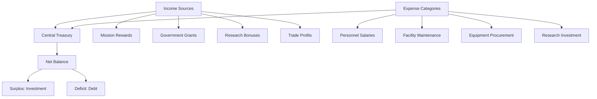

# Economic System

> **Implementation**: `../../../engine/economy/`, `../../../engine/basescape/logic/`
> **Tests**: `../../../tests/unit/test_research_system.lua`, `../../../tests/systems/`
> **Related**: `docs/basescape/facilities.md`, `docs/economy/research.md`

Resource management and financial systems governing base operations, manufacturing, and strategic funding.

## 💰 Economic Architecture

### Funding System
Global financial management with multiple income sources and expense categories.

**Core Components:**
- **Central Treasury**: Unified funding pool across all bases
- **Monthly Cycles**: Regular income and expense calculations
- **Score-Based Funding**: Performance-dependent government support
- **Debt Management**: Loan and interest tracking

### Manufacturing System
Production facilities converting resources into equipment and supplies.

**Production Elements:**
- **Facility Network**: Distributed manufacturing across bases
- **Resource Consumption**: Material requirements for production
- **Labor Requirements**: Personnel assignment to workshops
- **Quality Control**: Production efficiency and reliability

### Marketplace System
Dynamic trading system for resource acquisition and surplus management.

**Market Mechanics:**
- **Global Trade**: Inter-base resource redistribution
- **Supply/Demand**: Dynamic pricing based on availability
- **Transportation Costs**: Distance and logistics expenses
- **Market Events**: Random price fluctuations

## 📊 Financial Mechanics

### Income Sources
Multiple revenue streams supporting operations and expansion.

**Funding Categories:**
- **Government Grants**: Score-based monthly funding
- **Mission Rewards**: Combat operation payouts
- **Research Bonuses**: Technology development incentives
- **Trade Profits**: Marketplace transaction gains

### Expense Categories
Ongoing operational costs requiring budget allocation.

**Cost Structure:**
- **Personnel Salaries**: Scientist, soldier, and staff wages
- **Facility Maintenance**: Base building operating costs
- **Equipment Procurement**: Weapon and vehicle purchases
- **Research Investment**: Technology development expenses

### Budget Management
Strategic allocation of limited financial resources.

**Allocation Priorities:**
- **Essential Operations**: Salaries and basic maintenance
- **Strategic Investment**: Research and facility upgrades
- **Contingency Reserves**: Emergency fund management
- **Growth Funding**: Expansion and development costs

## 🏭 Manufacturing System

### Production Facilities
Workshops and factories converting raw materials into finished goods.

**Facility Types:**
- **General Workshops**: Basic manufacturing capabilities
- **Specialized Labs**: Advanced equipment production
- **Assembly Plants**: Vehicle and heavy equipment construction
- **Refineries**: Material processing and enhancement

### Production Process
Multi-stage manufacturing with resource requirements and time investment.

**Production Flow:**
- **Resource Gathering**: Acquire necessary materials
- **Facility Assignment**: Allocate production capacity
- **Labor Allocation**: Assign skilled personnel
- **Quality Assurance**: Production reliability checks

### Manufacturing Capacity
Total production slots available across all manufacturing facilities.

**Capacity Factors:**
- **Facility Count**: Number of active workshops
- **Worker Efficiency**: Personnel skill and experience
- **Equipment Quality**: Manufacturing tool upgrades
- **Supply Chain**: Material availability and logistics

## 🏪 Marketplace Dynamics

### Trade Mechanics
Resource exchange system with dynamic pricing and availability.

**Market Features:**
- **Resource Types**: Materials, equipment, supplies
- **Price Volatility**: Supply and demand fluctuations
- **Trade Routes**: Inter-base transportation networks
- **Market Orders**: Buy/sell transaction processing

### Economic Events
Random occurrences affecting market conditions and prices.

**Event Types:**
- **Supply Disruptions**: Resource shortages increasing prices
- **Market Booms**: Surplus conditions lowering costs
- **Trade Opportunities**: Special deals and bulk discounts
- **Economic Crises**: Widespread price instability

### Transportation Costs
Logistics expenses for moving goods between locations.

**Cost Factors:**
- **Distance**: Geographic separation penalties
- **Volume**: Shipment size modifiers
- **Urgency**: Rush delivery premiums
- **Security**: Protected transport requirements

## 🎮 Player Experience

### Economic Strategy
- **Resource Planning**: Balance immediate needs vs long-term goals
- **Budget Optimization**: Maximize funding efficiency
- **Production Prioritization**: Focus manufacturing on critical items
- **Market Timing**: Buy low, sell high opportunities

### Progression Rewards
- **Facility Expansion**: New manufacturing capabilities
- **Equipment Access**: Advanced weapons and vehicles
- **Economic Efficiency**: Reduced costs and improved production
- **Strategic Flexibility**: Financial independence from government

### Economic Challenges
- **Resource Scarcity**: Limited materials constrain operations
- **Budget Constraints**: Financial limitations affect all systems
- **Market Volatility**: Unpredictable prices require adaptation
- **Scaling Costs**: Growing organization increases expenses

## 📈 Economic Balance

### Difficulty Scaling
- **Rookie**: Generous funding, low costs, stable markets
- **Veteran**: Standard economic conditions
- **Commander**: Tight budgets, high costs, volatile markets
- **Legend**: Minimal funding, maximum costs, extreme volatility

### Integration Points
- **Combat Synergy**: Successful missions provide economic rewards
- **Research Investment**: Technology improves economic efficiency
- **Base Development**: Facilities enhance production capabilities
- **Strategic Planning**: Economic decisions affect campaign success

### Risk/Reward Balance
- **Investment Decisions**: High-risk research vs safe operations
- **Market Speculation**: Potential profits vs losses
- **Expansion Costs**: Growth expenses vs long-term benefits
- **Debt Management**: Loans provide flexibility with interest penalties

## 📈 Economic Examples & Tables

### Economic Flow Visualization

### Monthly Budget Breakdown Example

| Category | Amount | Percentage | Priority |
|----------|--------|------------|----------|
| **Personnel Salaries** | $250,000 | 45% | Critical |
| **Facility Maintenance** | $150,000 | 27% | High |
| **Research Investment** | $80,000 | 14% | Medium |
| **Equipment Procurement** | $50,000 | 9% | Medium |
| **Miscellaneous** | $25,000 | 5% | Low |
| **Total Expenses** | $555,000 | 100% | - |

### Income vs Expenses Tracking

| Month | Income | Expenses | Net | Cumulative |
|-------|--------|----------|-----|------------|
| **Jan** | $600K | $550K | +$50K | +$50K |
| **Feb** | $650K | $580K | +$70K | +$120K |
| **Mar** | $580K | $620K | -$40K | +$80K |
| **Apr** | $700K | $600K | +$100K | +$180K |
| **May** | $750K | $650K | +$100K | +$280K |

### Manufacturing Capacity Calculator

| Facility Type | Production Slots | Workers Required | Efficiency Bonus | Total Capacity |
|---------------|------------------|------------------|------------------|----------------|
| **Basic Workshop** | 2 | 5 | 0% | 2 |
| **Advanced Lab** | 3 | 8 | +25% | 3.75 |
| **Assembly Plant** | 4 | 12 | +50% | 6 |
| **Refinery** | 2 | 6 | +100% | 4 |

*Efficiency bonus applies to production speed and quality*

### Marketplace Price Volatility Table

| Resource | Base Price | Min Price | Max Price | Volatility | Demand Factor |
|----------|------------|-----------|-----------|------------|---------------|
| **Alloys** | $500 | $300 | $800 | High | Manufacturing |
| **Elerium** | $2,000 | $1,000 | $4,000 | Very High | Research |
| **Alien Alloys** | $5,000 | $2,500 | $10,000 | Extreme | Advanced Tech |
| **Basic Supplies** | $100 | $50 | $200 | Low | Operations |
| **Medical Supplies** | $300 | $150 | $600 | Medium | Personnel |

### Economic Strategy Scenarios

#### Early Game Bootstrapping
**Situation:** Limited funding, basic facilities, government grants only
**Strategy:** 
- Focus on high-success missions for quick income
- Minimize research investment, use basic equipment
- Build workshops before advanced facilities
- Maintain surplus for emergency reserves

**Expected Outcome:** Stable growth, foundation for expansion

#### Mid-Game Expansion
**Situation:** Multiple bases, research projects, manufacturing capacity
**Strategy:**
- Balance research investment with operational funding
- Use marketplace for resource trading
- Expand facilities strategically
- Build contingency reserves

**Expected Outcome:** Accelerated technological progress, increased operational capacity

#### Late-Game Optimization
**Situation:** Advanced technology, multiple income streams, complex operations
**Strategy:**
- Maximize research efficiency through facility bonuses
- Optimize manufacturing for high-value items
- Use marketplace speculation for profit
- Maintain large reserves for major projects

**Expected Outcome:** Economic independence, rapid technological advancement

### Difficulty Scaling Impact

| Difficulty | Government Grants | Mission Rewards | Market Volatility | Debt Interest |
|------------|-------------------|-----------------|-------------------|---------------|
| **Rookie** | +50% | +25% | Low | 5% |
| **Veteran** | Base | Base | Medium | 10% |
| **Commander** | -25% | -10% | High | 15% |
| **Legend** | -50% | -25% | Very High | 20% |

### Cross-Reference Integration
- **Research System**: See `docs/economy/research.md` for technology investment returns
- **Manufacturing**: See `docs/economy/manufacturing.md` for production capacity details
- **Base Facilities**: See `docs/basescape/` for facility construction and maintenance costs
- **Mission Rewards**: See `docs/geoscape/missions.md` for economic impact of operations
- **Marketplace**: See `docs/economy/marketplace.md` for trading mechanics