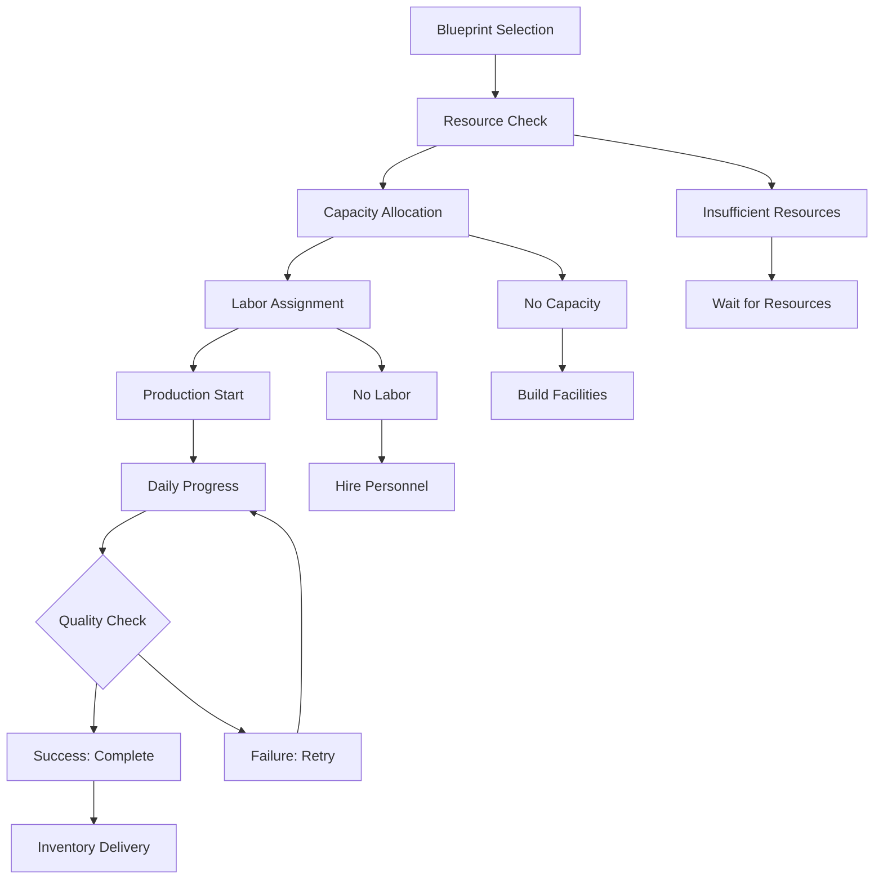
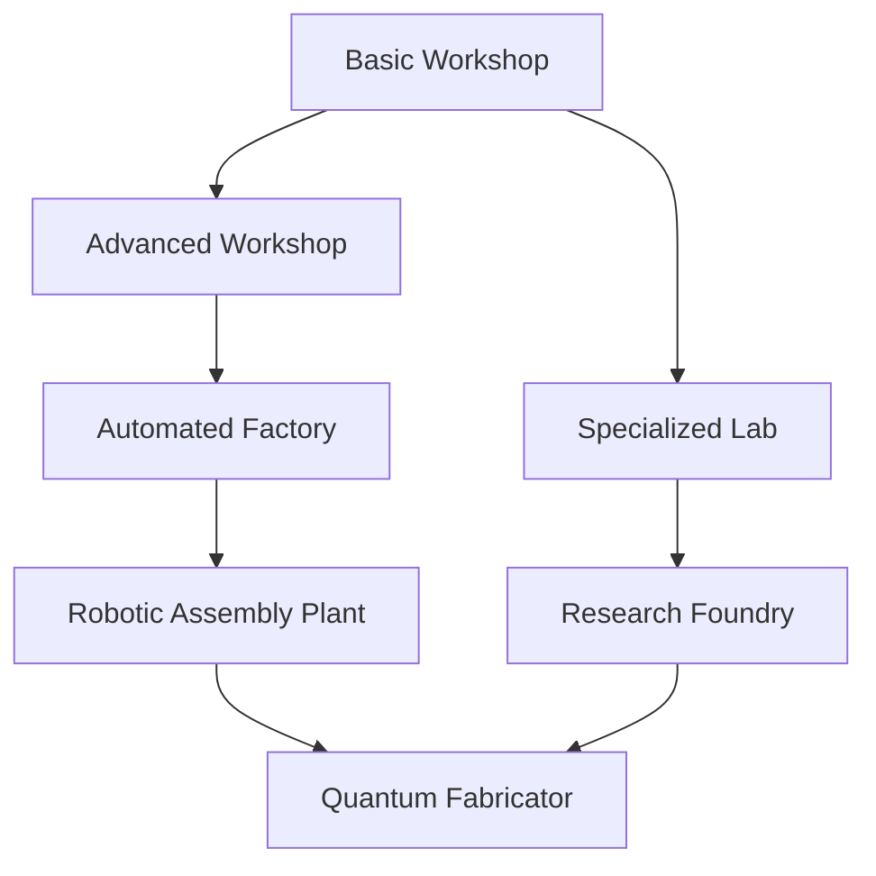

# Manufacturing System

> **Implementation**: `../../../engine/economy/production/`, `../../../engine/basescape/logic/`
> **Tests**: `../../../tests/unit/test_research_system.lua`, `../../../tests/systems/`
> **Related**: `docs/economy/funding.md`, `docs/basescape/facilities.md`

Production system for creating equipment, weapons, and supplies from raw materials.

## 🏭 Manufacturing Architecture

### Manufacturing System
Central management interface for all production operations across bases.

**Core Components:**
- **Global Oversight**: Unified production management across all bases
- **Project Tracking**: Monitor active manufacturing projects
- **Resource Management**: Input material consumption and allocation
- **Output Distribution**: Finished goods delivery and storage

### Manufacturing Projects
Individual production initiatives with defined requirements and outputs.

**Project Structure:**
- **Blueprint**: Manufacturing entry defining production requirements
- **Progress Tracking**: Real-time advancement toward completion
- **Resource Consumption**: Material inputs required for production
- **Completion Status**: Ready for delivery when finished

### Manufacturing Entries
Blueprint definitions specifying what can be produced and required resources.

**Entry Components:**
- **Item Definition**: What equipment or supply is being produced
- **Prerequisites**: Required technologies and facilities
- **Resource Requirements**: Materials needed for production
- **Labor Requirements**: Personnel time and skill requirements

## 📊 Production Mechanics

### Dependencies
Prerequisite conditions that must be met before manufacturing can begin.

**Dependency Types:**
- **Technological**: Research requirements for advanced items
- **Facility**: Required workshops and production equipment
- **Service**: Base services needed for manufacturing
- **Organization Level**: Command structure requirements

### Manufacturing Capacity
Total production slots available across all manufacturing facilities.

**Capacity Sources:**
- **Facility Count**: Number of active workshops and factories
- **Facility Quality**: Production efficiency and automation levels
- **Base Distribution**: Manufacturing spread across multiple locations
- **Upgrade Bonuses**: Facility improvements increasing capacity

### Labor Costs
Personnel expenses for manufacturing operations based on work performed.

**Cost Structure:**
- **Per-Unit Labor**: Cost per manufacturing day or production cycle
- **Facility Efficiency**: Automation reducing labor requirements
- **Worker Skills**: Personnel quality affecting production speed
- **Scale Bonuses**: Mass production reducing per-unit costs

## 🏭 Production Process

### Project Initiation
- **Blueprint Selection**: Choose from available manufacturing entries
- **Resource Verification**: Confirm material availability
- **Capacity Allocation**: Assign production slots
- **Labor Assessment**: Calculate personnel requirements

### Production Execution
- **Resource Consumption**: Materials deducted from inventory
- **Progress Advancement**: Daily production based on capacity
- **Quality Control**: Production reliability and success rates
- **Completion Delivery**: Finished items added to inventory

### Efficiency Bonuses
- **Serial Production**: Repeated manufacturing of same items
- **Facility Upgrades**: Automation and equipment improvements
- **Worker Training**: Skilled personnel bonuses
- **Supply Chain**: Reliable material sources

## 🏪 Marketplace Integration

### Automatic Pricing
Dynamic pricing system based on production costs and market conditions.

**Pricing Factors:**
- **Resource Costs**: Raw material expenses
- **Labor Expenses**: Personnel and facility costs
- **Production Time**: Manufacturing duration
- **Market Demand**: Supply and demand modifiers

### Facility Automation
Advanced facilities providing cost reductions through technology.

**Automation Benefits:**
- **Labor Reduction**: Robots and machines replacing manual work
- **Cost Efficiency**: Lower per-unit production expenses
- **Quality Consistency**: Reliable output standards
- **Scale Advantages**: Mass production capabilities

## 🎮 Player Experience

### Production Strategy
- **Capacity Planning**: Balance facility construction vs immediate needs
- **Resource Management**: Stockpile materials for critical production
- **Priority Setting**: Focus manufacturing on strategic requirements
- **Efficiency Optimization**: Upgrade facilities for better performance

### Manufacturing Challenges
- **Resource Scarcity**: Limited materials constrain production options
- **Capacity Limits**: Facility slots restrict concurrent projects
- **Time Investment**: Production delays affect operational readiness
- **Cost Management**: Balance production expenses with budget constraints

### Progression Rewards
- **Equipment Access**: New weapons and gear become available
- **Facility Expansion**: Additional manufacturing capabilities
- **Cost Reduction**: Automation lowers production expenses
- **Strategic Flexibility**: Self-sufficiency in equipment supply

## 📈 Manufacturing Balance

### Difficulty Scaling
- **Rookie**: Fast production, low costs, generous capacity
- **Veteran**: Standard manufacturing conditions
- **Commander**: Slower production, higher costs, limited capacity
- **Legend**: Very slow production, maximum costs, minimal capacity

### Economic Integration
- **Resource Synergy**: Manufacturing consumes marketplace goods
- **Research Benefits**: Technology unlocks advanced production
- **Base Development**: Facilities provide manufacturing capacity
- **Combat Support**: Production enables operational capabilities

### Production Optimization
- **Batch Production**: Efficient manufacturing of multiple units
- **Facility Specialization**: Dedicated workshops for specific items
- **Supply Chain Management**: Reliable material acquisition
- **Cost-Benefit Analysis**: Compare production vs purchase decisions

## 📈 Manufacturing Examples & Tables

### Production Pipeline Flow

### Manufacturing Capacity Calculator

| Facility Type | Production Slots | Efficiency | Automation Level | Total Effective Capacity |
|---------------|------------------|------------|------------------|--------------------------|
| **Basic Workshop** | 2 | 100% | 0% | 2.0 |
| **Advanced Workshop** | 3 | 125% | 25% | 3.75 |
| **Automated Factory** | 4 | 150% | 50% | 6.0 |
| **Robotic Assembly** | 5 | 200% | 75% | 10.0 |

*Efficiency includes worker skill bonuses; automation reduces labor costs*

### Production Time Examples

| Item Type | Base Time | With Automation | Batch Bonus | Total for 5 Units |
|-----------|-----------|-----------------|-------------|-------------------|
| **Basic Rifle** | 3 days | 2 days | -20% | 8 days |
| **Plasma Weapon** | 7 days | 4 days | -15% | 17 days |
| **Power Armor** | 14 days | 8 days | -10% | 36 days |
| **Interceptor Craft** | 21 days | 12 days | -5% | 57 days |

### Resource Requirements Matrix

| Item | Alloys | Elerium | Alien Alloys | Electronics | Time |
|------|--------|---------|--------------|-------------|------|
| **Rifle** | 5 | 0 | 0 | 2 | 3 days |
| **Plasma Rifle** | 3 | 2 | 0 | 3 | 7 days |
| **Heavy Cannon** | 8 | 0 | 1 | 4 | 10 days |
| **Power Armor** | 12 | 3 | 2 | 6 | 14 days |
| **Interceptor** | 25 | 5 | 5 | 15 | 21 days |

### Manufacturing Strategy Scenarios

#### Early Game Equipment Production
**Situation:** Limited facilities, basic technology, urgent equipment needs
**Strategy:**
- Focus on basic weapons and armor first
- Build 2-3 workshops for redundancy
- Stockpile common materials (alloys, electronics)
- Produce in small batches for flexibility

**Expected Outcome:** Self-sufficient basic equipment supply

#### Mid-Game Technology Rollout
**Situation:** Advanced research completed, specialized equipment needed
**Strategy:**
- Upgrade to advanced workshops
- Produce plasma weapons and power armor
- Balance production between weapons and vehicles
- Use marketplace for rare materials

**Expected Outcome:** Advanced equipment capability, tactical superiority

#### Late-Game Mass Production
**Situation:** Multiple bases, maximum facilities, large-scale operations
**Strategy:**
- Build automated factories for efficiency
- Produce in large batches for cost savings
- Specialize facilities by equipment type
- Maintain buffer stock of finished goods

**Expected Outcome:** Industrial-scale production, economic efficiency

### Production Queue Optimization

| Priority Level | Queue Position | Resource Allocation | Labor Priority |
|----------------|----------------|---------------------|----------------|
| **Critical** | Front of queue | 100% dedicated | Elite workers only |
| **High** | Next available | 75% priority | Skilled workers |
| **Medium** | Standard position | 50% allocation | Standard workers |
| **Low** | Back of queue | 25% allocation | Any available |

### Facility Upgrade Path

### Cross-Reference Integration
- **Economic System**: See `docs/economy/funding.md` for production costs and budget impact
- **Research System**: See `docs/economy/research.md` for technology prerequisites
- **Base Facilities**: See `docs/basescape/` for workshop construction and upgrades
- **Marketplace**: See `docs/economy/marketplace.md` for material acquisition
- **Equipment Usage**: See `docs/battlescape/weapons.md` and `docs/battlescape/armors.md` for manufactured items