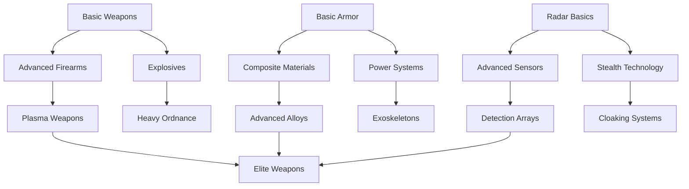
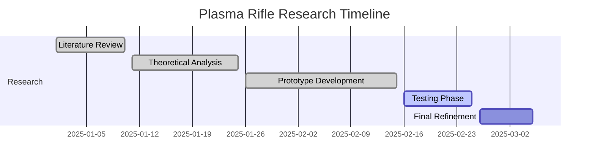

# Research System

> **Implementation**: `../../../engine/economy/research/`, `../../../engine/basescape/logic/`
> **Tests**: `../../../tests/unit/test_research_system.lua`, `../../../tests/systems/`
> **Related**: `docs/economy/funding.md`, `docs/basescape/facilities.md`

Technology progression system unlocking new capabilities, equipment, and strategic options.

## 🔬 Research Architecture

### Research System
Central management interface for all research operations and progress tracking.

**Core Components:**
- **Global Scope**: Cumulative research across all bases
- **Parallel Processing**: Multiple projects running simultaneously
- **Resource Allocation**: Scientist assignment and facility capacity
- **Progress Tracking**: Real-time advancement monitoring

### Research Projects
Individual research initiatives with defined scope and objectives.

**Project Structure:**
- **Title**: Clear, descriptive name
- **Description**: Detailed explanation of benefits
- **Requirements**: Prerequisites and resource costs
- **Duration**: Time to completion
- **Outcomes**: Unlocks and bonuses provided

## 📊 Research Mechanics

### Tech Tree Structure
Hierarchical technology progression with prerequisite dependencies.

**Tree Organization:**
- **Tiers**: Basic → Advanced → Elite technologies
- **Branches**: Combat, Economic, Strategic, Special
- **Dependencies**: Must unlock prerequisites first
- **Multiple Paths**: Different specialization routes

### Research Capacity
Total research slots available across all laboratories and facilities.

**Capacity Factors:**
- **Base Labs**: Primary research facilities
- **Scientist Count**: Personnel assigned to research
- **Facility Quality**: Lab equipment and upgrades
- **Global Pool**: Combined capacity across all bases

### Labor Costs
Personnel time and salary expenses for research operations.

**Cost Structure:**
- **Scientist Salaries**: Ongoing personnel expenses
- **Facility Maintenance**: Lab operating costs
- **Material Consumption**: Research resource requirements
- **Time Investment**: Days to complete projects

## 🎯 Research Categories

### Combat Technologies
- **Weapons**: New firearms, explosives, melee weapons
- **Armor**: Protective equipment and materials
- **Tactics**: Squad coordination and special abilities
- **Medical**: Healing technologies and trauma care

### Economic Technologies
- **Production**: Manufacturing efficiency improvements
- **Resource Management**: Storage and logistics systems
- **Facility Upgrades**: Base building enhancements
- **Market Access**: Trade and commerce capabilities

### Strategic Technologies
- **Detection**: Radar and sensor improvements
- **Transportation**: Craft upgrades and new vehicles
- **Intelligence**: Recon and surveillance systems
- **Defense**: Base security and countermeasures

### Special Technologies
- **Alien Artifacts**: Recovered technology analysis
- **Psionics**: Mental abilities and countermeasures
- **Dimensional**: Portal and inter-world travel
- **Advanced Materials**: Exotic substances and applications

## 🔄 Research Process

### Project Initiation
- **Selection**: Choose from available research options
- **Resource Allocation**: Assign scientists and facilities
- **Time Estimation**: Calculate completion duration
- **Cost Assessment**: Evaluate total expenses

### Progress Tracking
- **Daily Advancement**: Incremental progress based on capacity
- **Scientist Efficiency**: Individual researcher productivity
- **Facility Bonuses**: Lab quality modifiers
- **Breakthrough Events**: Random discovery accelerations

### Completion & Unlocks
- **Instant Application**: Immediate access to new capabilities
- **Manufacturing Access**: New items available for production
- **Facility Construction**: New base buildings unlocked
- **Strategic Options**: New mission types or tactics available

## 🎮 Player Experience

### Strategic Planning
- **Tech Path Selection**: Choose specialization focus
- **Resource Balancing**: Research vs operations trade-offs
- **Timeline Management**: Plan for long-term unlocks
- **Opportunity Costs**: Choose between competing projects

### Progression Rewards
- **Power Progression**: Meaningful capability improvements
- **Tactical Variety**: New weapons and strategies
- **Base Expansion**: Additional facility options
- **Campaign Milestones**: Major technological breakthroughs

### Research Strategy
- **Early Game**: Focus on basic combat and economic tech
- **Mid Game**: Specialize in chosen strategic direction
- **Late Game**: Pursue advanced and exotic technologies
- **Recovery Focus**: Alien artifact research for breakthroughs

## 📈 Research Balance

### Difficulty Scaling
- **Rookie**: Faster research, more breakthrough chances
- **Veteran**: Standard progression rates
- **Commander**: Slower research, strategic planning emphasis
- **Legend**: Very slow research, high breakthrough potential

### Economic Integration
- **Funding Impact**: Research costs affect budget management
- **Production Synergy**: Research enables better manufacturing
- **Mission Rewards**: Successful operations provide research bonuses
- **Market Dynamics**: Research affects trade values

### Risk/Reward Balance
- **Investment Required**: Significant time and money commitment
- **Payoff Timing**: Benefits realized over campaign duration
- **Dependency Chains**: Early choices affect late-game options
- **Recovery Options**: Alien technology provides alternative paths

## 📈 Research Flow Example

### Technology Tree Visualization

### Research Project Example
**Project: Plasma Rifle Development**

**Requirements:**
- Prerequisites: Advanced Firearms, Plasma Research
- Scientists: 8 researchers
- Time: 45 days
- Cost: $2.4M

**Progress Tracking:**

**Unlocks Upon Completion:**
- **Manufacturing**: Plasma Rifle (Damage: 80, AP Cost: 60%)
- **Strategic**: Anti-Alien tactics bonus
- **Research**: Opens path to Heavy Plasma weapons

### Capacity Planning Table

| Facility Type | Base Capacity | Scientist Efficiency | Total Slots |
|---------------|---------------|---------------------|-------------|
| Basic Lab | 5 | 100% | 5 |
| Advanced Lab | 8 | 125% | 10 |
| Alien Lab | 12 | 150% | 18 |
| **Total** | **25** | **Varies** | **33** |

### Breakthrough Event Example
**Random Discovery: Plasma Conduit Optimization**

**Trigger**: 75% completion on Plasma Rifle project
**Effect**: Reduces remaining time by 30%
**Description**: "Scientists discover an unexpected plasma stabilization method, accelerating development."

**Balance Impact:**
- **Positive**: Faster completion, resource savings
- **Risk**: May encourage rushing research
- **Counter**: Breakthroughs become rarer at higher difficulties