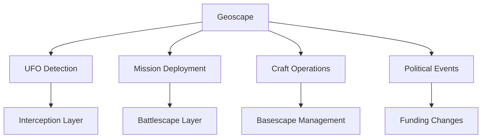
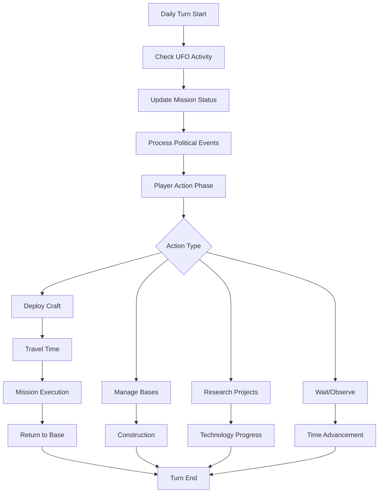

# Geoscape - Strategic World Layer

> **Implementation**: `../../../engine/geoscape/`
> **Tests**: `../../../tests/geoscape/`
> **Related**: `docs/politics/`, `docs/economy/funding.md`, `docs/interception/`

Global strategic layer managing world events, UFO activity, and high-level decision making. Players oversee worldwide operations from a satellite view of Earth.

## 🎯 Core Concept

**Turn-based world management** where each turn represents one day. Players track UFOs, deploy crafts, manage bases, and respond to global events on a continuous world map.

## 🌍 World Representation

### Geographic System
- **Hex Grid**: 80×40 hexagonal tiles covering Earth
- **Provinces**: Individual locations with unique properties
- **Regions**: Groups of provinces (continents, countries)
- **Paths**: Travel connections between provinces

### Time & Environment
- **Day/Night Cycle**: Visual overlay affecting operations
- **Seasons**: Long-term environmental changes
- **Weather**: Temporary effects on operations

## 🛸 UFO System

### Detection & Tracking
- **Radar Coverage**: Base-provided detection radius
- **UFO Types**: Different craft with unique behaviors
- **Flight Patterns**: Predictable and erratic movement
- **Interception Window**: Limited time to respond

### Mission Generation
- **Crash Sites**: Recover technology from downed UFOs
- **Terror Missions**: Protect population centers
- **Base Assaults**: Defend player facilities
- **Research Sites**: Secure scientific discoveries

## ✈️ Craft Operations

### Craft Management
- **Deployment**: Send crafts to provinces for missions
- **Fuel System**: Range limitations and consumption
- **Maintenance**: Downtime between operations
- **Upgrades**: Performance improvements

### Interception Mechanics
- **Pursuit**: Chase UFOs across province paths
- **Engagement**: Transition to interception layer
- **Recovery**: Return to base after missions

## 🏛️ Political System

### Country Relations
- **Funding**: Monthly income based on relations
- **Hostility**: Risk of diplomatic breakdown
- **Alliances**: Cooperative agreements
- **Espionage**: Covert operations

### Global Events
- **UFO Sightings**: Public awareness and panic
- **Government Actions**: Policy changes and funding adjustments
- **International Incidents**: Cross-border complications

## 📊 Analytics & Tracking

### World Statistics
- **UFO Activity**: Global alien presence levels
- **Country Stability**: Political situation monitoring
- **Mission Success Rates**: Performance tracking
- **Resource Flows**: Economic monitoring

## 🎮 Player Experience

### Strategic Depth
- **Resource Allocation**: Balance between multiple operations
- **Risk Management**: Weigh interception opportunities vs base defense
- **Long-term Planning**: Tech progression and base expansion
- **Crisis Response**: React to unexpected events

### Pacing & Tension
- **Time Pressure**: UFOs don't wait for player action
- **Opportunity Cost**: Can't be everywhere at once
- **Escalation**: Alien activity increases over time
- **Consequences**: Failed missions affect global situation

## 🔗 System Interactions

## 📁 Design Documents

- **[world-map.md](world-map.md)** - Geographic representation
- **[geography.md](geography.md)** - Provinces, regions, paths
- **[time-and-calendar.md](time-and-calendar.md)** - World time mechanics
- **[missions.md](missions.md)** - Mission generation system
- **[ufo-tracking.md](ufo-tracking.md)** - Alien activity monitoring
- **[craft-operations.md](craft-operations.md)** - Vehicle deployment

## 🎯 Strategic Objectives

### Short-term Goals
- Intercept UFOs to prevent terror missions
- Deploy to crash sites for technology recovery
- Manage base construction and expansion

### Long-term Goals
- Reduce global UFO activity
- Improve international relations
- Advance research through recovered technology

### Win Conditions
- No fixed victory - player-defined objectives
- Survive escalating alien threat
- Achieve technological superiority
- Maintain global stability

## 📈 Strategic Examples & Tables

### Geoscape Operations Flow

### UFO Threat Escalation Timeline

| Month | UFO Activity | Threat Level | Recommended Response |
|-------|--------------|--------------|---------------------|
| **1-3** | Scouting | Low | Monitor, intercept when possible |
| **4-6** | Reconnaissance | Medium | Active interception, base defense |
| **7-9** | Harassment | High | Multiple craft deployment, research priority |
| **10-12** | Invasion | Critical | All available forces, emergency measures |
| **13+** | Domination | Extreme | Desperate measures, final stand |

### Craft Deployment Strategy Matrix

| Mission Type | Craft Type | Squad Size | Success Factors | Risk Level |
|--------------|------------|------------|-----------------|------------|
| **Crash Site** | Skyranger | 6-8 units | Speed, recovery focus | Low |
| **Terror Mission** | Skyranger | 8-10 units | Defense, civilian protection | High |
| **Base Assault** | Multiple | 12-16 units | Heavy weapons, coordination | Very High |
| **UFO Interception** | Interceptor | N/A | Speed, weapons | Medium |
| **Research Site** | Skyranger | 4-6 units | Stealth, scientific | Low |

### Political Relations Impact Table

| Relations | Funding Multiplier | Hostility Risk | Cooperation Bonus | Espionage Access |
|-----------|-------------------|----------------|-------------------|------------------|
| **Excellent** | 1.5x | Very Low | High | Full |
| **Good** | 1.2x | Low | Medium | Partial |
| **Neutral** | 1.0x | Medium | None | Limited |
| **Poor** | 0.8x | High | None | None |
| **Hostile** | 0.5x | Very High | Negative | None |

### Strategic Decision Scenarios

#### Early Game: Resource Scarcity
**Situation:** Limited funding, single base, basic technology
**Strategic Focus:** 
- Prioritize crash site recoveries for technology
- Maintain good relations with 2-3 key countries
- Build second base in strategic location
- Research basic interception improvements

**Key Metrics:** Technology acquisition rate, funding stability

#### Mid Game: Expansion Phase
**Situation:** Multiple bases, advanced technology, growing threat
**Strategic Focus:**
- Establish global coverage with base network
- Intercept high-value UFOs before terror missions
- Balance research between military and economic tech
- Build diplomatic alliances for funding bonuses

**Key Metrics:** Global coverage percentage, mission success rate

#### Late Game: Containment Strategy
**Situation:** Maximum technology, multiple threats, political pressure
**Strategic Focus:**
- Maintain constant UFO interception
- Use advanced craft for rapid response
- Focus on terror mission prevention
- Maximize research for final technologies

**Key Metrics:** Global stability, technology completion rate

### Base Placement Strategy Guide

| Location Type | Advantages | Disadvantages | Best For |
|---------------|------------|---------------|----------|
| **Coastal** | Easy access, naval support | Weather exposure | Interception operations |
| **Mountain** | Natural defense, radar bonus | Construction difficulty | Research facilities |
| **Urban** | Infrastructure access, recruitment | High visibility | Manufacturing bases |
| **Desert** | Space for expansion, isolation | Resource scarcity | Storage and logistics |
| **Arctic** | Extreme isolation, security | Harsh conditions | Secret operations |

### Time Management Dashboard Example

| Time Element | Current Status | Next Event | Priority Action |
|--------------|----------------|------------|----------------|
| **UFO Interception** | 3 active pursuits | 2 hours | Deploy interceptor |
| **Mission Deployment** | 2 crafts en route | 4 hours | Monitor progress |
| **Base Construction** | Workshop building | 5 days | Allocate resources |
| **Research Projects** | 2 active | 3 days | Check progress |
| **Political Events** | Stable | 2 days | Monitor relations |

### Cross-Reference Integration
- **World Map**: See `docs/geoscape/world-map.md` for geographic systems and travel mechanics
- **Mission System**: See `docs/geoscape/missions.md` for mission generation and deployment
- **Craft Operations**: See `docs/basescape/crafts.md` for vehicle management and deployment
- **Political System**: See `docs/politics/` for country relations and diplomatic mechanics
- **Economic System**: See `docs/economy/funding.md` for funding calculations and resource management
- **Research System**: See `docs/economy/research.md` for technology progression and unlocks