# Mission System

> **Implementation**: `../../../engine/geoscape/logic/`, `../../../engine/battlescape/mission_map_generator.lua`
> **Tests**: `../../../tests/geoscape/test_mission_detection.lua`, `../../../tests/battlescape/`
> **Related**: `docs/geoscape/world-map.md`, `docs/battlescape/`

Dynamic mission generation, objectives, and strategic deployment system that drives tactical gameplay.

## 🎯 Mission Categories

### Site Missions
Static missions waiting for player interception within a time window.

**Characteristics:**
- **Fixed Location**: Stationary targets on the world map
- **Time Pressure**: Must be intercepted before expiration
- **Predictable**: Known location and objectives
- **Strategic Choice**: Player decides when to engage

### UFO Missions
Dynamic missions with moving targets and active behaviors.

**Characteristics:**
- **Mobile Targets**: UFOs that move, land, or attack
- **Unpredictable**: Changing locations and behaviors
- **Active Threats**: Can perform actions while moving
- **Interception Required**: Must be caught before escape

### Base Missions
Permanent installations that grow and generate secondary missions.

**Characteristics:**
- **Persistent**: Remain active until destroyed
- **Expanding**: Grow over time, increase threat level
- **Mission Hubs**: Generate additional smaller missions
- **Strategic Targets**: High-value objectives

## 🎮 Mission Objectives

### Primary Objectives
Core goals that determine mission success/failure.

**Types:**
- **Elimination**: Destroy all enemy units
- **Recovery**: Secure alien technology/artifacts
- **Protection**: Defend civilians or installations
- **Sabotage**: Destroy specific targets
- **Extraction**: Rescue personnel or items

### Secondary Objectives
Bonus goals that provide additional rewards.

**Types:**
- **Time Bonus**: Complete within time limit
- **Casualty Limit**: Minimize friendly losses
- **Stealth**: Avoid detection or alarms
- **Collection**: Gather bonus items/resources

### Dynamic Objectives
Objectives that change based on mission progress.

**Types:**
- **Escalation**: Difficulty increases over time
- **Reinforcements**: New enemies arrive based on actions
- **Discovery**: Hidden objectives revealed through exploration
- **Contingency**: Backup plans when primary objectives fail

## 🎲 Mission Generation

### Strategic Factors
- **Geographic Location**: Province biome affects mission type
- **Time of Day**: Day/night cycle influences difficulty
- **Country Relations**: Diplomatic status affects hostility
- **Player Progress**: Technology level scales enemy strength

### Difficulty Scaling
- **Rookie**: Basic objectives, forgiving timers
- **Veteran**: Complex objectives, moderate time pressure
- **Commander**: Multiple objectives, strict requirements
- **Legend**: Dynamic objectives, minimal margins

### Thematic Variation
- **Urban**: City environments, civilian rescue focus
- **Rural**: Open terrain, artifact recovery emphasis
- **Desert**: Harsh conditions, survival challenges
- **Arctic**: Extreme weather, visibility issues

## 🚁 Deployment System

### Craft Assignment
- **Capacity Limits**: Unit count restrictions
- **Equipment Load**: Inventory space constraints
- **Fuel Requirements**: Range limitations
- **Specialization**: Craft types for different missions

### Squad Composition
- **Class Balance**: Mix of roles (assault, sniper, medic)
- **Experience Levels**: Veteran units for difficult missions
- **Equipment Loadouts**: Mission-specific gear
- **Psychological Prep**: Morale considerations

### Strategic Timing
- **Interception Windows**: Limited time to engage UFOs
- **Travel Times**: Distance affects response capability
- **Multiple Operations**: Coordinating concurrent missions
- **Resource Allocation**: Balancing global operations

## 📊 Mission Scoring

### Performance Metrics
- **Objective Completion**: Primary/secondary goal achievement
- **Casualty Rates**: Friendly and civilian losses
- **Time Efficiency**: Speed of mission completion
- **Resource Usage**: Equipment and ammunition consumption

### Scoring System
```
Base Score = 100 × (Objectives Completed / Total Objectives)
Casualty Penalty = -10 × Friendly Casualties
Time Bonus = +50 × (1 - Time Used / Time Limit)
Efficiency Bonus = +25 × (Resources Saved / Resources Total)
```

### Rewards Calculation
- **Experience**: XP for unit advancement
- **Funding**: Country contributions based on success
- **Technology**: Alien artifacts for research
- **Reputation**: Diplomatic standing improvements

## 🎯 Mission Intelligence

### Pre-Mission Briefing
- **Objective Details**: Clear success criteria
- **Enemy Composition**: Known unit types and numbers
- **Environmental Data**: Terrain and weather conditions
- **Strategic Context**: Mission importance and consequences

### Real-Time Updates
- **Dynamic Intel**: New information discovered during mission
- **Reinforcement Warnings**: Incoming enemy arrivals
- **Objective Changes**: Modified goals based on progress
- **Extraction Points**: Evacuation zone updates

## 🌍 Strategic Integration

### Campaign Context
- **Faction Storylines**: Mission ties to alien faction goals
- **Global Impact**: Local actions affect worldwide situation
- **Progression Gates**: Missions unlock new technologies
- **Narrative Branches**: Success/failure affects story paths

### Resource Management
- **Craft Availability**: Limited fleet for multiple operations
- **Personnel Rotation**: Managing unit fatigue and recovery
- **Equipment Maintenance**: Gear repair and replacement
- **Supply Lines**: Logistics for sustained operations

## 🎮 Player Experience

### Strategic Depth
- **Opportunity Cost**: Choosing which missions to pursue
- **Risk Assessment**: Weighing difficulty vs rewards
- **Resource Allocation**: Balancing global operations
- **Long-term Planning**: Campaign-level strategic thinking

### Tactical Variety
- **Mission Diversity**: Different objectives and environments
- **Dynamic Challenges**: Changing conditions during missions
- **Replayability**: Procedural generation ensures variety
- **Progressive Difficulty**: Escalating challenges over campaign

### Consequences & Impact
- **Permanent Loss**: Failed missions can cost units permanently
- **Diplomatic Effects**: Success/failure affects country relations
- **Economic Impact**: Mission performance influences funding
- **Technological Progress**: Successful recovery advances research

## 📈 Mission Examples & Tables

### Mission Type Comparison Matrix

| Mission Type | Duration | Difficulty | Rewards | Risk Level | Frequency |
|--------------|----------|------------|---------|------------|-----------|
| **Crash Site** | 2-4 hours | Medium | High Tech | Medium | Common |
| **Terror Site** | 1-2 hours | High | Low Tech, High Rep | High | Rare |
| **Base Assault** | 4-6 hours | Very High | Very High Tech | Very High | Rare |
| **UFO Landing** | 3-5 hours | Medium-High | Medium Tech | Medium | Common |
| **Abduction** | 2-3 hours | Low-Medium | Low Tech, High Rep | Low | Common |
| **Research** | 1-2 hours | Low | Medium Tech | Low | Uncommon |

### Mission Generation Flow


### Mission Success Probability Calculator

| Factor | Weight | Rookie | Veteran | Commander | Legend |
|--------|--------|--------|---------|-----------|--------|
| **Unit Experience** | 40% | +20% | +0% | -10% | -20% |
| **Equipment Quality** | 30% | +15% | +0% | -15% | -30% |
| **Squad Size** | 20% | +10% | +0% | -10% | -20% |
| **Mission Intel** | 10% | +5% | +0% | -5% | -10% |
| **Base Success Rate** | - | 60% | 50% | 40% | 30% |

*Final success rate = Base + weighted modifiers*

### Tactical Mission Examples

#### Crash Site Recovery
**Location:** Rural farmland, daytime
**Objectives:** 
- Primary: Recover alien technology from crashed UFO
- Secondary: Minimize civilian casualties, complete within 2 hours

**Enemy Composition:** 4-6 alien units, light armor
**Recommended Squad:** 6 units (2 assault, 2 sniper, 1 medic, 1 heavy)
**Key Tactics:** Secure perimeter, use snipers for overwatch, heavy weapons for breaching

#### Terror Mission Defense
**Location:** Urban city center, night
**Objectives:**
- Primary: Protect civilians from alien attack
- Secondary: Eliminate all hostiles, evacuate survivors

**Enemy Composition:** 8-12 alien units with heavy weapons
**Recommended Squad:** 8 units (balanced composition, focus on defense)
**Key Tactics:** Establish defensive positions, use cover, coordinate fire teams

#### Base Assault Operation
**Location:** Alien base complex, underground
**Objectives:**
- Primary: Destroy alien base command center
- Secondary: Recover research data, minimize structural damage

**Enemy Composition:** 15+ elite alien units, turrets, reinforcements
**Recommended Squad:** 10 units (full elite team, specialized equipment)
**Key Tactics:** Stealth approach, disable security systems, systematic room clearing

### Mission Timeline Example

```mermaid
gantt
    title Sample Mission Timeline
    dateFormat HH:mm
    axisFormat %H:%M
    
    section Deployment
    Craft Launch     :done, launch, 00:00, 30m
    Travel Time      :done, travel, after launch, 45m
    
    section Combat
    Initial Contact  :active, contact, after travel, 15m
    Main Engagement  :engage, after contact, 2h
    Objective Phase  :objective, after engage, 1h
    
    section Extraction
    Evacuation       :evac, after objective, 30m
    Return Journey   :return, after evac, 45m
```


### Reward Scaling Table

| Mission Success | Funding | Research | Experience | Reputation |
|-----------------|---------|----------|------------|------------|
| **Complete** | 100% | 100% | 100% | +10 |
| **Good** | 120% | 110% | 120% | +15 |
| **Excellent** | 150% | 125% | 150% | +20 |
| **Perfect** | 200% | 150% | 200% | +30 |
| **Failed** | 25% | 25% | 25% | -20 |

### Cross-Reference Integration
- **Battlescape Combat**: See `docs/battlescape/combat-mechanics/` for tactical execution
- **Unit Systems**: See `docs/battlescape/unit-systems/` for squad composition
- **Craft Systems**: See `docs/basescape/crafts.md` for deployment mechanics
- **Economic Impact**: See `docs/economy/funding.md` for reward calculations
- **Research Progression**: See `docs/economy/research.md` for technology unlocks