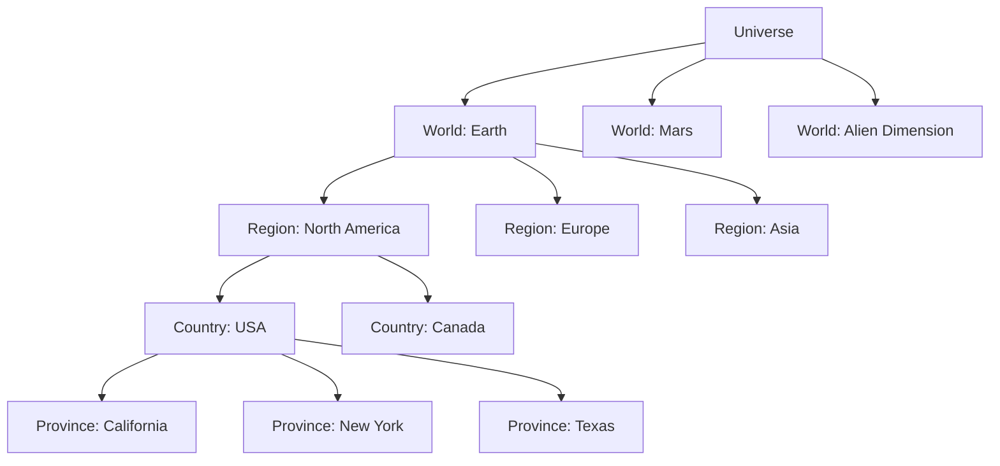
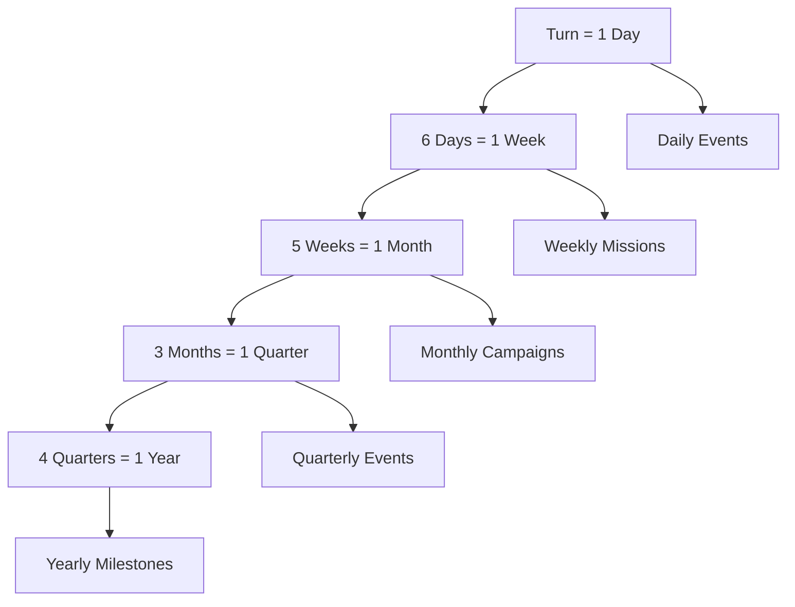

# World Map & Geography

> **Implementation**: `../../../engine/geoscape/world/`, `../../../engine/geoscape/geography/`
> **Tests**: `../../../tests/geoscape/test_hex_grid.lua`, `../../../tests/unit/test_world_system.lua`
> **Related**: `docs/geoscape/missions.md`, `docs/politics/`

Geographic representation of the game world, including provinces, regions, countries, and travel systems.

## 🌍 World Structure

### Universe
The entire game world containing multiple planets and dimensional realms. Manages inter-world travel through portals and dimensional mechanics.

### World
A single planet or dimensional plane serving as the primary setting for operations. Contains interconnected provinces linked by travel paths.

### World Tiles
Virtual 2D grid underlying the world display (80×40 for Earth). Used for pathfinding calculations between provinces.

**Tile Types:**
- **Water**: Cost 1, accessible by water/air craft
- **Land**: Cost 1, accessible by all craft types
- **Rough Land**: Cost 3, difficult terrain penalties

## 🗺️ Geographic Hierarchy

### Regions
Large geographical areas grouping multiple countries with shared characteristics. Used for mission generation and strategic analytics.

**Properties:**
- Geographic boundaries (continents, climate zones)
- Mission generation patterns
- Strategic importance weighting
- All provinces must belong to a region

### Countries
Political entities with governments, economies, and diplomatic relations. Provide funding and strategic context.

**Key Attributes:**
- **Relations**: Affects funding and hostility levels
- **Economy Power**: Sum of province economies
- **Government Type**: Influences diplomatic behavior
- **Hostility Threshold**: Point where country becomes actively hostile

### Provinces
Smallest administrative divisions serving as mission locations and strategic points.

**Core Properties:**
- **Economy Level**: Contributes to country GDP
- **Biome**: Determines battle terrain and interception backgrounds
- **Base Capacity**: Can contain one player base
- **Mission Slots**: Multiple concurrent missions possible
- **Terrain Type**: Land or water provinces

## 🕐 Time Systems

### World Time
Global time system advancing consistently across all regions and activities.

**Time Units:**
- **1 Day** = 1 Turn (base time unit)
- **6 Days** = 1 Week
- **5 Weeks** = 1 Month (30 days)
- **3 Months** = 1 Quarter
- **4 Quarters** = 1 Year (360 days)

### Calendar System
Unified dating system tracking campaign progression through structured time periods.

**Calendar Logic:**
- **Daily**: Mission updates, UFO movement
- **Weekly**: New missions generated for active campaigns
- **Monthly**: New faction campaigns initiated
- **Quarterly**: Major strategic events
- **Yearly**: Long-term progression milestones

### Day/Night Cycle
Dynamic lighting system affecting mission generation and strategic timing.

**Earth Cycle (Primary World):**
- **World Size**: 80×40 tiles (500km per tile)
- **Cycle Length**: 20 days for full rotation
- **Shift Speed**: 4 tiles per turn
- **Impact**: Affects UFO activity patterns and mission difficulty

## 🛤️ Travel Systems

### Province Paths
Transportation routes connecting provinces for movement and logistics.

**Path Properties:**
- **Travel Time**: Base time between provinces
- **Fuel Consumption**: Craft resource costs
- **Terrain Effects**: Different path types affect efficiency
- **Interception Points**: Strategic chokepoints for air combat

### Portal System
Special province links enabling inter-dimensional or long-distance travel.

**Portal Mechanics:**
- **Inter-World Travel**: Connect provinces across different worlds
- **Instant Transit**: Bypass normal travel time/costs
- **Strategic Value**: Enable rapid redeployment
- **UFO Usage**: Aliens can use portals for surprise attacks

## 🏞️ Biome System

### Province Biomes
Environmental characteristics affecting terrain generation and mission types.

**Biome Types:**
- **Urban**: City environments, high cover, civilian presence
- **Rural**: Open fields, mixed terrain, agricultural areas
- **Desert**: Harsh conditions, limited cover, extreme temperatures
- **Arctic**: Snow/ice terrain, visibility issues, cold penalties
- **Forest**: Dense woods, heavy cover, restricted movement
- **Mountain**: Rugged terrain, elevation advantages, limited access

### Biome Effects
- **Battle Terrain**: Determines mapblock selection and tile types
- **Interception Background**: Visual theme for air combat
- **Mission Variety**: Influences available mission types
- **Resource Availability**: Affects salvage and recovery

## 🎯 Strategic Implications

### Geographic Strategy
- **Positioning**: Base placement affects radar coverage and response times
- **Chokepoints**: Control key paths for interception advantages
- **Regional Focus**: Concentrate operations in high-value areas
- **Portal Control**: Secure dimensional access points

### Time Management
- **UFO Windows**: Limited time to intercept before targets escape
- **Campaign Pacing**: Weekly mission generation creates rhythm
- **Seasonal Effects**: Long-term strategic planning around calendar
- **Day/Night Tactics**: Time operations for optimal conditions

### Economic Geography
- **Country Relations**: Province control affects diplomatic standing
- **Resource Distribution**: Strategic positioning for supply lines
- **Mission Economics**: High-economy provinces offer better rewards
- **Global Impact**: Local actions affect worldwide funding

## 📊 Analytics & Tracking

### Geographic Metrics
- **Province Activity**: Mission frequency and success rates
- **Regional Stability**: Political situation by area
- **Economic Flow**: Funding distribution patterns
- **UFO Patterns**: Activity trends by geography

### Strategic Intelligence
- **Coverage Maps**: Radar and detection ranges
- **Travel Times**: Optimized route calculations
- **Threat Assessment**: Regional danger levels
- **Opportunity Analysis**: High-value target identification

## 📈 Geographic Examples & Tables

### World Hierarchy Visualization

### Province Biome Comparison Matrix

| Biome | Terrain Difficulty | Cover Density | Mission Types | Interception Theme | Salvage Rate |
|-------|-------------------|---------------|---------------|-------------------|--------------|
| **Urban** | Medium | High | Terror, Recovery | City Skyline | Low |
| **Rural** | Low | Medium | Crash, Landing | Countryside | Medium |
| **Desert** | High | Low | Research, Base | Desert Dunes | High |
| **Arctic** | Very High | Medium | Supply, Scout | Snow Fields | Medium |
| **Forest** | High | Very High | Ambush, Infiltrate | Forest Canopy | Low |
| **Mountain** | Very High | High | Recon, Defense | Mountain Peaks | High |

### Time System Flow

### Day/Night Cycle Impact Table

| Time of Day | UFO Activity | Mission Difficulty | Visibility | Player Advantage |
|-------------|---------------|-------------------|------------|------------------|
| **Dawn** | Low | -10% | Medium | High (surprise) |
| **Day** | Medium | Base | High | Medium |
| **Dusk** | High | +5% | Medium | Low |
| **Night** | Very High | +15% | Low | Very Low |
| **Midnight** | Maximum | +25% | Very Low | Minimum |

### Travel Cost Calculator

| Distance (tiles) | Land Travel | Air Travel | Portal Travel |
|------------------|-------------|------------|---------------|
| **1-5** | 1 hour | 30 min | Instant |
| **6-10** | 2 hours | 1 hour | Instant |
| **11-20** | 4 hours | 2 hours | Instant |
| **21-40** | 8 hours | 4 hours | Instant |
| **41+** | 16+ hours | 8+ hours | Instant |

*Fuel consumption scales with distance and terrain difficulty*

### Strategic Positioning Examples

#### North American Campaign
**Strategic Goals:** Control eastern seaboard, intercept Atlantic UFOs
**Key Provinces:** New York (High Economy), Washington DC (Political), Boston (Tech)
**Base Placement:** Upstate New York for radar coverage
**Portal Strategy:** Secure dimensional rifts in Appalachian mountains

#### European Theater
**Strategic Goals:** NATO coordination, European Union funding
**Key Provinces:** London (Intelligence), Berlin (Industrial), Paris (Cultural)
**Base Placement:** Central Germany for continental coverage
**Mission Focus:** Urban terror sites, rural crash recoveries

#### Pacific Operations
**Strategic Goals:** Asian containment, Pacific UFO interception
**Key Provinces:** Tokyo (High Tech), Sydney (Resources), Singapore (Trade)
**Base Placement:** Hawaiian islands for Pacific coverage
**Economic Strategy:** High-value Asian markets for funding

### Geographic Analytics Dashboard Example

| Metric | North America | Europe | Asia | Global |
|--------|---------------|--------|------|--------|
| **Active Missions** | 12 | 8 | 15 | 35 |
| **UFO Interceptions** | 85% | 78% | 92% | 85% |
| **Funding Generated** | $450K/month | $380K/month | $520K/month | $1.35M/month |
| **Province Stability** | 7.2/10 | 6.8/10 | 8.1/10 | 7.4/10 |
| **Threat Level** | High | Medium | Very High | High |

### Cross-Reference Integration
- **Mission System**: See `docs/geoscape/missions.md` for biome-based mission generation
- **Craft Operations**: See `docs/geoscape/craft-operations.md` for travel and interception mechanics
- **Political Systems**: See `docs/politics/` for country relations and diplomatic effects
- **Economic Systems**: See `docs/economy/funding.md` for province-based funding calculations
- **Battlescape Terrain**: See `docs/battlescape/maps.md` for biome-to-terrain mapping