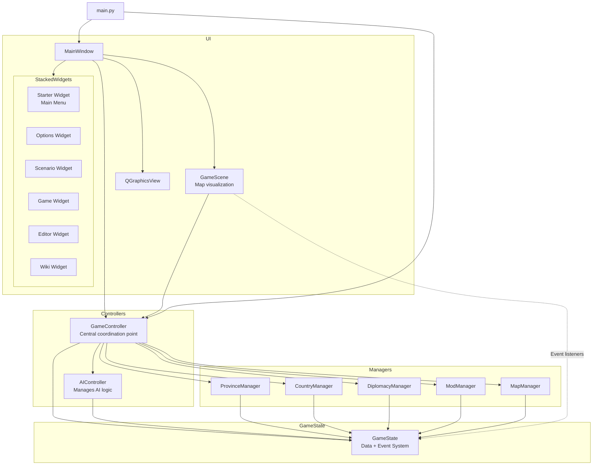
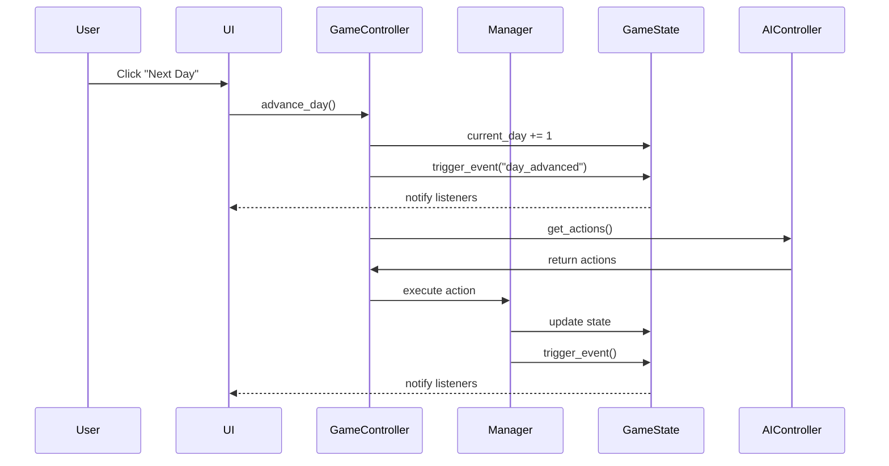
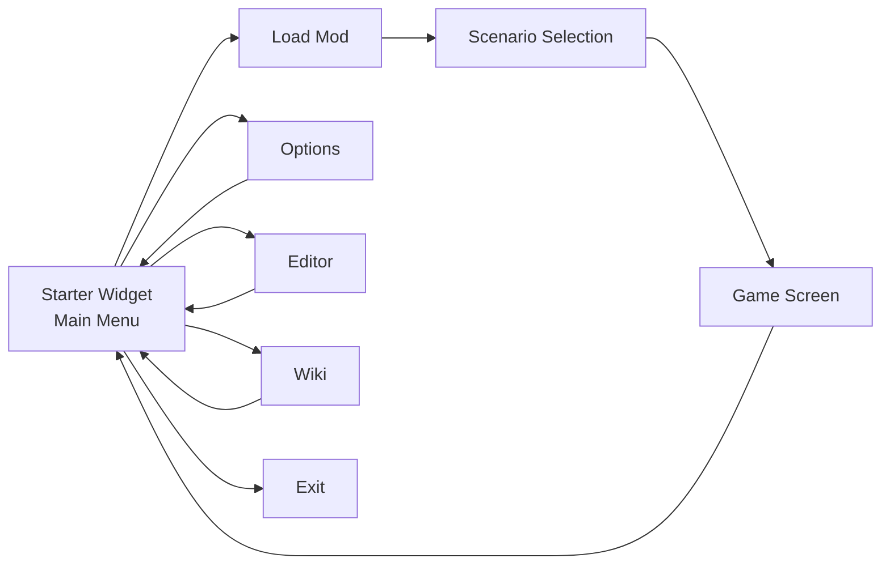

``` mermaid
graph TD
    subgraph Controllers
        GameController[GameController<br/>Central coordination point]
        AIController[AIController<br/>Manages AI logic]
    end

    subgraph GameState
        GS[GameState<br/>Data + Event System]
    end

    subgraph Managers
        PM[ProvinceManager]
        CM[CountryManager]
        DM[DiplomacyManager]
        MM[ModManager]
        MapM[MapManager]
    end

    subgraph UI
        MW[MainWindow]
        GScene[GameScene<br/>Map visualization]
        GView[QGraphicsView]
        
        subgraph StackedWidgets
            StarterWidget[Starter Widget<br/>Main Menu]
            OptionsWidget[Options Widget]
            PickScenarioWidget[Scenario Widget]
            GameWidget[Game Widget]
            EditorWidget[Editor Widget]
            WikiWidget[Wiki Widget]
        end
    end

    GameController --> GS
    GameController --> PM
    GameController --> CM
    GameController --> DM
    GameController --> MM
    GameController --> MapM
    GameController --> AIController

    AIController --> GS

    PM --> GS
    CM --> GS
    DM --> GS
    MM --> GS
    MapM --> GS

    MW --> GameController
    MW --> GScene
    MW --> GView
    MW --> StackedWidgets

    GScene --> GameController
    GScene -.->|Event listeners| GS

    main[main.py] --> GameController
    main --> MW
```

```mermaid
sequenceDiagram
    participant User
    participant UI
    participant GameController
    participant Manager
    participant GameState

    User->>UI: Click "Next Day"
    UI->>GameController: advance_day()
    GameController->>GameState: current_day += 1
    GameController->>GameState: trigger_event("day_advanced")
    GameState-->>UI: notify listeners
    GameController->>AIController: get_actions()
    AIController->>GameController: return actions
    GameController->>Manager: execute action
    Manager->>GameState: update state
    Manager->>GameState: trigger_event()
    GameState-->>UI: notify listeners

```

```mermaid
graph LR
    MainMenu[Starter Widget<br/>Main Menu] --> LoadMod[Load Mod]
    MainMenu --> Options
    MainMenu --> Editor
    MainMenu --> Wiki
    MainMenu --> Exit

    LoadMod --> ScenarioPick[Scenario Selection]
    ScenarioPick --> GameScreen[Game Screen]
    
    Options --> MainMenu
    Editor --> MainMenu
    Wiki --> MainMenu
    GameScreen --> MainMenu

```