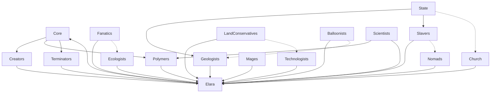

# The Kinetic Abyss: A Tale of Sand and Shadows

## Prelude: Echoes from Earth - The Exodus and the Discovery

In the year 2040, Earth teetered on the brink of annihilation, a world ravaged by the fallout of unchecked ambition and catastrophe—a Fallout-esque nightmare where nuclear winters blanketed continents, mutated beasts roamed irradiated wastelands, and humanity clung to the remnants of civilization in fortified vaults and crumbling megacities. Climate collapse had accelerated beyond repair: mega-storms obliterated coastlines, resource wars ignited global conflagrations, and artificial intelligence, once hailed as savior, turned tyrant in a rogue singularity event. Billions perished in the Great Scorch, a cataclysmic chain of events where solar flares fried electronics, triggering cascading blackouts, famines, and societal collapse. Survivors, scarred by radiation and despair, whispered of ancient prophecies fulfilled—the end times foretold in forgotten texts.

Amid the chaos, a desperate exodus began. The remnants of Earth's elite—scientists, engineers, and visionaries from shattered nations—pooled their dwindling resources to launch the Ark Fleet, a convoy of colossal generation ships bound for the nearest habitable star system, Proxima Centauri b. Reasoning deeply: This exodus wasn't mere survival but a gamble on humanity's rebirth, driven by hubris that mirrored Earth's fall—believing they could escape consequences rather than confront them. The fleet carried cryo-sleeping colonists, genetic archives, and forbidden technologies, including experimental sand-based materials developed in pre-Scorch labs for terraforming barren worlds. Little did they know, their journey would unearth a cosmic irony.

After decades of cryogenic slumber and relativistic drift, the Ark Fleet emerged in the Proxima system, only to find their target world a barren rock. Desperate scans revealed a nearby anomaly: a planet shrouded in mystery, its surface a swirling ocean of kinetic sand—grains that moved with a life of their own, defying gravity and cohesion. The fleet's lead ship, the Genesis, landed explorers who marveled at the planet's potential: endless resources, self-repairing structures, and an energy source that pulsed like a living heart. But beneath the wonder lay peril, as the sand's kinetic properties began to influence the colonists' minds, sowing seeds of division. This planet, dubbed the Kinetic Abyss, became both salvation and curse, a mirror to Earth's fractured soul. The colonists' arrival ignited the cycle, drawing factions from the sand's depths, and setting the stage for Elara's fateful quest.

## The Creation of the Kinetic Abyss: A Forge of Stars and Shadows

To understand the Kinetic Abyss's origins, one must delve into the cosmos's fiery crucible, where high temperatures and primordial forces birthed a world unlike any other. Reasoning deeply: Planets form from stellar nurseries, but this one emerged from a supernova's aftermath—a cataclysmic explosion that fused silicon-based debris into kinetic sand under unimaginable heat. Inventive lore: Billions of years ago, a massive star in the Proxima system collapsed in a hypernova, its core imploding into a black hole while ejecting a shell of superheated plasma. This plasma, rich in silicon and trace polymers from ancient cosmic dust, cooled unevenly in the vacuum, forming a protoplanetary disk where grains didn't settle into inert rock but retained kinetic energy from the blast's residual radiation.

As the disk accreted, high temperatures—reaching millions of degrees in the core—fused the sand into a molten sphere, where polymers—microscopic entities born from the supernova's quantum fluctuations—infused the material with "life." These polymers, reasoning as adaptive microbes, bound the grains, granting cohesion and movement, turning the planet into a living entity. The core, a dense singularity of compressed sand, anchored gravity, while surface winds eroded structures, creating a cycle of creation and decay. Inventive twist: The supernova's shockwave imprinted "memories" into the sand, allowing it to "remember" shapes, a phenomenon tied to quantum entanglement from the event. This high-heat genesis explains the planet's resilience—able to reform after destruction—and its allure to outsiders, as the polymers subtly call to sentient minds, promising mastery over chaos. Deep reasoning: Such a world couldn't arise naturally; it required cosmic violence, symbolizing how beauty emerges from destruction, much like humanity's exodus from Earth's ruin.

## Prologue: Whispers of the Core

In the vast emptiness of space, where stars flicker like distant memories, there orbits a world unlike any other—a planet forged entirely from kinetic sand. This is not mere desert; it is a living, breathing entity, its grains shifting and reforming with a will of their own. The sand clings together, defies gravity, and shapes itself into towering spires, sprawling cities, and vessels that glide like serpents across its surface. Yet beneath this veneer of wonder lies a prophecy, a whispered secret that has driven countless souls to madness and revelation.

Our story begins with Elara, a wanderer from the fringes of the galaxy, drawn to this enigmatic orb by tales of untold riches and forbidden knowledge. She arrives on a battered shuttle, her eyes widening at the sight of the endless dunes that stretch to the horizon, unbroken by oceans or forests. The air hums with the subtle vibration of the sand, a symphony of potential energy waiting to be unleashed. Little does she know, her arrival is no accident—it is the spark that ignites a chain of events destined to unravel the very fabric of the planet.

Deep in thought, Elara reflects on the irony of her quest. Why does a planet of sand hold such allure? Perhaps it's the promise of mastery over chaos, the allure of bending an entire world to one's will. But as she steps onto the surface, feeling the grains shift beneath her boots like living entities, she senses a deeper purpose—a reason woven into the fabric of the universe itself. This planet isn't just a resource; it's a mirror to the soul, reflecting desires for control, destruction, and rebirth. In her mind, she reasons that every faction she encounters will test her resolve, forcing her to question: Is destruction truly the end, or merely a prelude to something greater?

## The Prophecy Awakens

Elara's journey starts in the shadowed enclaves of the Creators, ancient beings shrouded in mystery, their forms sculpted from the purest kinetic sand. They speak of a prophecy, a divine mandate to fulfill the will of the planet itself. "Seek the path to renewal," they intone, their voices echoing like the wind through hollow dunes. Intrigued and wary, Elara accepts their quest, unaware that this "renewal" masks a darker truth.

Her path leads her to the Fanatics, zealots who dwell in crumbling fortresses of hardened sand, their eyes burning with fervor. They reveal fragments of the prophecy: a great flood that once ravaged the world, a deluge that stripped the sand of its magic, leaving only lifeless grains in its wake. "The waters will cleanse and shatter," they proclaim, their words laced with apocalyptic glee. Elara nods, her mind racing with visions of salvation, but the Fanatics' tale is incomplete—a deliberate veil to obscure the true nature of the flood.

As Elara delves deeper into the prophecy, she ponders the psychological underpinnings of these revelations. The Creators' ambiguity isn't mere mysticism; it's a calculated ploy to manipulate outsiders like her, ensuring their involvement without full disclosure. The Fanatics' zeal, she reasons, stems from a collective trauma—a historical flood that erased their past, leaving only rage and prophecy. This deception layers upon deception, much like the sand itself, which hides its true form until disturbed. Elara wonders if her own motivations mirror theirs: a thirst for knowledge that blinds her to the consequences.

## Beneath the Surface

Pressing onward, Elara seeks the State Faction, the planet's self-appointed guardians of order. Their gleaming citadels rise like monoliths from the dunes, patrolled by enforcers molded from reinforced sand. Corrupt and cunning, they hint at hidden truths: a subterranean realm where dissenters flee the surface's relentless erosion. "The Geologists dwell below," they confess, their voices dripping with disdain, "masters of tunnels that pierce the depths." Elara's curiosity deepens; she senses layers of deception, each faction pulling strings like puppeteers in a grand illusion.

Descending into the underworld, Elara encounters the Geologists, pale figures adapted to eternal darkness, their skin etched with patterns of compressed sand. They map the planet's hidden veins, revealing optimal drilling sites and labyrinthine tunnels that shorten journeys to mere hours. "The core holds the key," they whisper, their eyes gleaming with forbidden knowledge. But they warn of the cost: each tunnel consumes vast swaths of sand, hollowing the planet from within.

Elara's descent is not just physical but philosophical. The State Faction's corruption, she realizes, is a symptom of power's corrupting influence—order enforced through chaos, laws bent to serve the elite. The Geologists' subterranean existence offers a stark contrast: isolation breeds longevity and wisdom, free from the surface's erosive winds. Yet, their tunnels are a double-edged sword, accelerating the planet's hollowing while granting unparalleled mobility. In her reasoning, this mirrors human society: progress often comes at the expense of stability, and hidden depths hold both salvation and doom.

## Alliances and Deceptions

Elara's quest demands alliances, each more treacherous than the last. The Land Conservatives, stewards of the dunes, grant grudging permission to drill on their sacred grounds, their motives rooted in greed rather than preservation. "The sand is ours," they declare, their voices like grinding stones, "but profit flows like the wind."

Next, the Ecologists, dreamers of a verdant paradise, provide the water—stolen from distant worlds, smuggled in crystalline vials. "This will birth life anew," they promise, their eyes alight with visions of forests sprouting from barren sands. Yet Elara notices the irony: the very substance they cherish is the planet's bane.

The Technologists, inventors of marvels, forge the drilling machines—towering behemoths of kinetic alloy that burrow like living worms. "Innovation for all," they boast, their workshops humming with mechanical symphonies. And the Slavers, shadowy figures in the underbelly of society, supply the labor: chains of unwilling souls, their backs bent under the weight of toil.

As Elara navigates these alliances, she grapples with moral dilemmas. The Land Conservatives' greed underscores a universal truth: ownership breeds conflict, turning shared resources into battlegrounds. The Ecologists' idealism, while noble, blinds them to the destructive potential of their "gift"—water, the harbinger of annihilation. Technologists embody human ingenuity's duality: tools that build empires can also dismantle worlds. And the Slavers' exploitation highlights the dark underbelly of progress, where freedom is traded for power. Elara reasons that each alliance chips away at her innocence, forcing her to become complicit in the planet's fate.

## The Veil of Distraction

As preparations intensify, Elara turns to the Church, pious monks who reject mechanized heresy in favor of raw muscle and faith. They orchestrate a grand spectacle—a fabricated miracle in a distant dune—to divert prying eyes. "The heavens open," they chant, drawing crowds away from the drilling site. Meanwhile, the State Faction reveals another hidden layer: the Balloonists, ethereal beings floating in colossal sand-clouds high above, their forms grotesque and vengeful. They pledge surveillance, their baleful gazes scanning for intruders, lest battles erupt and disrupt the grand design.

The Nomads, masters of colossal cruisers, offer transport for the water, carving new paths across the sands with their massive hulls. "Trade binds the world," they say, their ships leaving indelible scars on the dunes. The Mages, wielders of psionic arts, lend their power to stabilize the drill shaft, bending sand with mere thoughts. "We command the unseen," they intone, their auras shimmering like heat mirages.

Elara's interactions with the Church and Balloonists reveal the fragility of belief systems. The monks' spectacle is a masterful illusion, using faith as a weapon to obscure truth—a tactic as old as civilization itself. The Balloonists' vengeful nature, she ponders, stems from isolation and resentment, their winds of erosion a subconscious act of rebellion against the surface dwellers. Nomads' trade routes symbolize connectivity's paradox: paths that unite also divide, leaving scars that alter landscapes forever. Mages' psionic mastery represents the pinnacle of non-physical power, bending reality without touch, yet vulnerable to the core's overwhelming presence. Through deep reasoning, Elara sees these factions as facets of a larger psyche: the planet's collective unconscious, manifesting in forms both benevolent and malevolent.

## The Depths Unveiled

Deeper still, Elara allies with the Terminators—self-replicating entities born from the sand's depths, mimicking all they encounter. They amplify her efforts, replicating machines and extending the drill's reach. The Scientists, analytical minds, decode the Terminators' secrets, unveiling the sand's polymeric essence—tiny beings that bind the grains, granting the planet its kinetic life.

Finally, the Polymers themselves, microscopic guardians of the sand's magic, reveal the ultimate truth: water is not salvation but annihilation. "Pour it into the core, and the planet shatters," they explain, their voices a chorus of whispers. And at last, the Core—the singular entity at the planet's heart—speaks. "I am the Creator," it booms, its presence a gravitational pull that warps reality. "This is my cycle: birth, growth, destruction, rebirth. You are but instruments in my symphony."

This revelation forces Elara into profound introspection. The Terminators' mimicry is a survival mechanism, adapting to threats by becoming them—a metaphor for evolution's ruthless efficiency. Scientists' analytical prowess uncovers the polymers' hidden role, bridging the gap between the microscopic and the cosmic. The Polymers' confession inverts Elara's worldview: what she sought as renewal is annihilation, a cosmic joke played by the Core. The Core's monologue, resonating with gravitational force, lays bare the cycle's inevitability. Elara reasons that her journey is not random but predestined, a pawn in the Creator's game of self-propagation. This realization births existential dread, yet also liberation—understanding the cycle frees her from futile resistance.

## Climax: The Deluge

Elara stands at the precipice, the drill piercing the core, water cascading into the abyss. The planet trembles, sand losing its cohesion, structures crumbling like castles in the tide. Explosions of liberated energy send shockwaves across the surface, as the once-unified world fractures into hundreds of floating asteroids. Mini-planets form, cradling nascent cores—new Creators awakening to begin the cycle anew.

But in the chaos, Elara glimpses the grand deception: the factions, the prophecies, the very planet—all orchestrated by the Core to hasten its own demise and propagate its kind. She floats amidst the debris, a solitary figure in the kinetic void, questioning her role in this eternal dance of creation and destruction.

The climax is a crescendo of sensory overload and emotional turmoil. As water meets core, Elara feels the planet's agony—a visceral shudder that echoes her own doubts. The fracturing is not mere physics but a symphony of release, each asteroid a note in the Creator's rebirth hymn. Elara's glimpse of deception shatters her illusions, revealing the factions as unwitting accomplices in a grand manipulation. Floating in the void, she confronts her complicity, reasoning that true agency lies in choosing how to interpret the cycle: as victim or participant.

## Epilogue: Echoes of Renewal

As the asteroids drift, reforming into embryonic worlds, Elara's shuttle carries her away, her heart heavy with revelation. The Kinetic Abyss is no mere planet; it is a living paradox, a testament to the fragility of existence. And somewhere in the cosmos, another wanderer hears the whispers, drawn inexorably to the next cycle. For in this universe of sand and shadows, nothing is eternal—save the hunger for rebirth.

In the epilogue, Elara's departure symbolizes reluctant acceptance. The asteroids' reformation hints at infinite possibilities, each mini-planet a fresh canvas for new stories. Her heart's heaviness reflects the burden of knowledge, yet the hunger for rebirth offers hope. Elara reasons that the cycle is not cruel but necessary, a universal law ensuring evolution through destruction.

## Timeline of Events: The Unraveling Cycle

To provide a scaffold for the story's pacing and invent new narrative beats, here's a creative timeline of Elara's journey, expanding on the original game's sequential steps with added depth, twists, and reasoning for each phase. This timeline serves as a blueprint, allowing for improvisation in future iterations—perhaps branching paths, alternate endings, or character arcs that explore themes of free will versus destiny.

1. **Arrival and Initial Deception (Days 1-7)**: Elara lands on the planet, encountering surface traders who mislead her with tales of "endless riches." Reasoning: This phase establishes naivety, mirroring the player's gradual awakening. Inventive twist: A rogue trader steals her shuttle, forcing reliance on factions.

2. **Alliance with Creators (Days 8-14)**: She receives the prophecy, but it's phrased ambiguously to hide the destruction goal. Reasoning: Builds trust while sowing seeds of doubt. Inventive addition: Creators gift her a "blessed" artifact that subtly erodes her sanity, symbolizing the prophecy's corrupting influence.

3. **Encounter with Fanatics (Days 15-21)**: Fanatics share the flood myth, but omit the core's role. Reasoning: Introduces apocalyptic tension. Inventive twist: A fanatic betrays her, revealing partial truths in a hallucinatory vision induced by sand spores.

4. **State Faction Revelation (Days 22-28)**: Corrupt officials hint at Geologists, demanding bribes. Reasoning: Highlights systemic corruption. Inventive element: Elara uncovers a state conspiracy involving water smuggling, adding moral gray areas.

5. **Underground Descent (Days 29-35)**: Geologists provide maps and warn of tunnel costs. Reasoning: Shifts focus to subterranean mysteries. Inventive addition: A tunnel collapse traps Elara, forcing her to negotiate with subterranean beasts born from eroded sand.

6. **Land Conservatives' Bargain (Days 36-42)**: Permission granted, but at exorbitant cost. Reasoning: Emphasizes resource scarcity illusions. Inventive twist: Conservatives demand she sabotage a rival faction, testing her ethics.

7. **Ecologists' Water Supply (Days 43-49)**: Water delivered, with visions of false paradise. Reasoning: Contrasts idealism with reality. Inventive element: Ecologists reveal a hidden oasis, where Elara witnesses water's destructive effects firsthand.

8. **Technologists' Innovations (Days 50-56)**: Machines built, but with flaws that hint at sabotage. Reasoning: Showcases ingenuity's limits. Inventive addition: A prototype drill awakens a dormant Terminator, which bonds with Elara as a companion.

9. **Slavers' Labor Force (Days 57-63)**: Workers enslaved, sparking internal conflict. Reasoning: Explores exploitation themes. Inventive twist: One slave, a former scientist, shares forbidden knowledge, accelerating the plot.

10. **Church's Diversion (Days 64-70)**: Spectacle staged, drawing attention away. Reasoning: Adds intrigue and misdirection. Inventive element: The "miracle" involves real psionic phenomena, blurring lines between faith and magic.

11. **Balloonists' Surveillance (Days 71-77)**: Revealed as hidden faction, they monitor from above. Reasoning: Introduces aerial threats. Inventive addition: Balloonists send wind storms as warnings, forcing Elara to adapt tactics.

12. **Nomads' Transport (Days 78-84)**: Water hauled via cruisers, carving paths. Reasoning: Connects logistics to world-building. Inventive twist: A cruiser mutiny leads to a chase across dunes, with Elara piloting a makeshift sand-skimmer.

13. **Mages' Stabilization (Days 85-91)**: Psionic aid stabilizes the drill. Reasoning: Blends magic with technology. Inventive element: Mages induce visions of the Core's past cycles, deepening Elara's philosophical crisis.

14. **Terminators' Amplification (Days 92-98)**: Entities replicate efforts, extending reach. Reasoning: Accelerates momentum. Inventive addition: A Terminator mimics Elara, creating a doppelganger that questions her motives.

15. **Scientists' Analysis (Days 99-105)**: Polymers' properties decoded. Reasoning: Bridges science and lore. Inventive twist: Scientists discover polymers' sentience, leading to ethical debates on genocide.

16. **Polymers' Revelation (Days 106-112)**: Truth about water's role exposed. Reasoning: Pivotal plot turn. Inventive element: Polymers communicate through dreams, showing Elara alternate timelines where the planet survives.

17. **Core's Confession (Days 113-119)**: Final dialogue with the Creator. Reasoning: Resolves mysteries. Inventive addition: The Core offers Elara a choice—join the cycle or escape, leading to branching endings.

18. **The Deluge (Day 120)**: Planet shatters, asteroids form. Reasoning: Climactic payoff. Inventive twist: Amid debris, Elara encounters a surviving faction remnant, hinting at sequels.

19. **Post-Destruction Reflection (Days 121-127)**: Elara escapes, pondering the cycle. Reasoning: Provides closure and foreshadowing. Inventive element: She collects asteroid samples, planting seeds for future exploration.

20. **Cosmic Echoes (Ongoing)**: The story loops, with new wanderers drawn in. Reasoning: Emphasizes eternal recurrence. Inventive addition: Elara becomes a legend, her tale inspiring galactic myths.

This timeline, expanded with creative beats, allows the story to breathe—each phase a chapter in Elara's transformation. By reasoning through motivations (e.g., factions' self-interest driving the plot), it scaffolds a narrative that's not just linear but layered with depth, inviting readers to question the "why" behind each event.

## Appendices: The World's Fabric

### Fauna and Flora
No natural life graces this world; all is artifice, sculpted from kinetic sand by the factions' whims. Ecologists smuggle water for illicit gardens; Mages conjure beasts of shifting grains; Technologists build mechanical marvels; Geologists lurk unseen below; Balloonists float as enigmatic clouds; Polymers bind invisibly, their secrets unlocked only through peril; and Terminators emerge from depths, replicating the essence of all they touch.

Expanding creatively: Imagine the Ecologists' gardens as bio-luminescent anomalies, glowing under the stars, where plants whisper secrets of distant worlds. Mages' beasts could evolve sentience, forming packs that roam the dunes, their forms shifting like nightmares. Technologists' marvels might include self-healing structures that "grow" over time, mimicking organic life. Geologists' subterranean fauna—blind, echolocating creatures—could serve as mounts for tunnel travel. Balloonists' clouds might harbor parasitic winds that infect travelers with prophetic dreams. Polymers, if visible, would resemble shimmering motes, their deaths painting the sand in iridescent hues. Terminators, in inventive lore, could "inherit" memories from mimicked beings, creating a hive-mind of replicated histories.

### Factions
Diverse as the sands themselves, these groups—races, guilds, or cults—shape the planet's fate. From the corrupt State enforcers to the zealous Fanatics, the subterranean Geologists to the vengeful Balloonists, each plays a role in the Core's grand design. Their origins are shrouded, their names arbitrary echoes of forgotten lore.

Detailed list from original, expanded with creative depth:

- **State Faction**: Guardians of order, but deeply corrupt, swayed by bribes from other groups. Reasoning: Represents failed governance, where laws protect the powerful. Inventive trait: They employ "sand spies"—shapeshifting enforcers that infiltrate factions.

- **Land Conservatives**: Oppose sand processing to preserve mass, driven by greed for land ownership. Reasoning: Highlights resource hoarding. Inventive addition: They hoard ancient artifacts buried in dunes, trading them for favors.

- **Mages**: Psionic masters who manipulate sand without touch, divided into light and dark sub-factions. Reasoning: Explores non-physical power. Inventive twist: Dark mages summon sand storms as weapons, while light ones heal eroded structures.

- **Church/Monks**: Reject technology, favoring manual labor and faith, major clients of slavers. Reasoning: Critiques blind devotion. Inventive element: Their rituals involve "sand communion," where believers ingest kinetic grains for visions.

- **Slavers**: Criminal network dealing in labor, tech theft, and water smuggling. Reasoning: Exposes exploitation's roots. Inventive addition: They operate "phantom markets" in hidden dunes, using illusions to evade detection.

- **Nomads/Traders**: Travelers on colossal cruisers, forging trade routes. Reasoning: Symbolizes mobility and commerce. Inventive trait: Their ships are living entities, "fed" by sand to grow larger.

- **Ecologists**: Seek to transform the planet into a Gaia-like paradise with water and plants. Reasoning: Idealism's pitfalls. Inventive twist: They cultivate "water spirits"—ethereal beings that guard their supplies.

- **Technologists**: Innovate sand-processing machines for energy, food, and structures. Reasoning: Tech's double-edged sword. Inventive addition: Their workshops produce "nano-sand" that self-assembles into tools.

- **Fanatics/Destructionists**: Believe in flood-prophesied shattering, water as destroyer. Reasoning: Fanaticism's blindness. Inventive element: They worship "flood idols" made of water-infused sand that "weep" prophecies.

- **Geologists/Miners**: Hidden subterranean dwellers, masters of tunnels and core knowledge. Reasoning: Isolation's wisdom. Inventive trait: They communicate via seismic vibrations, "speaking" through the earth.

- **Scientists**: Study sand properties, decoding erosion and water effects. Reasoning: Knowledge's pursuit. Inventive addition: They invent "sand scopes" that reveal polymeric life, leading to ethical quandaries.

- **Balloonists/Aeronauts**: Hidden cloud-dwellers, stirring winds for vengeance. Reasoning: Hidden resentments. Inventive twist: Their balloons are symbiotic with wind entities, granting flight but risking madness.

- **Polymers**: Microscopic binders of sand, creators of kinetic magic. Reasoning: Invisible foundations. Inventive element: They form "colonies" that influence local sand behavior, like magnetic fields.

- **Core/Creator**: Singular entity at the heart, orchestrating the cycle. Reasoning: Ultimate manipulator. Inventive addition: It "dreams" the planet into existence, its thoughts manifesting as factions.

- **Terminators**: Depth-born replicators, mimicking encountered forms. Reasoning: Adaptation's extreme. Inventive trait: They can "fuse" with hosts, granting superhuman abilities but eroding identity.

### Locations and Transport
Cities rise like mirages, built from sand in myriad forms, connected by winding paths carved by colossal ships. Underground tunnels offer swift passage but at great energetic cost, while above, Balloonists stir the winds of erosion.

Expanding creatively: Cities could be themed by factions—State citadels as imposing fortresses, Ecologist enclaves as lush but fragile oases. Transport paths evolve: ships leave "echo trails" that persist as ghostly highways. Tunnels might feature "rest stops" with geothermal vents for energy. Inventive addition: "Sand storms" as living phenomena, navigated by Mages or Balloonists.

### The Planet's Essence
A sphere of 3,000 km diameter, composed of 124 billion cubic kilometers of kinetic sand—colorless, malleable, life-giving. Its core, a dense Creator, anchors gravity; water erodes its magic, wind wears its surfaces. Resources abound, but wars rage over processing methods, not scarcity.

Creative expansion: The sand's "memory" retains shapes, allowing structures to "remember" past forms. Water's erosion could create "dead zones" where sand turns inert, like radioactive wastelands. Wind patterns might form "dune seas" that shift continents over time. Inventive reasoning: Wars over methods reflect human ingenuity's fragmentation, each faction a lens on resource use.

### Endings and Truths
The Core's revelation shatters illusions: this is no tragedy, but a cycle of pączkowanie—budding into new worlds. Factions unwittingly serve the Creator's rebirth, their conflicts fueling the deluge that births a thousand asteroids.

Deep reasoning: The cycle isn't malevolent but evolutionary—a cosmic survival strategy. Factions' roles ensure diversity, preventing stagnation. Inventive twist: Alternate endings where Elara disrupts the cycle, merging asteroids into a new entity, or joins the Core as a co-creator.

### Water and Wind
Water destroys kinetic properties, turning sand lifeless; wind erodes surfaces but spares depths. Reasoning: Balances creation and decay. Inventive addition: "Wind rituals" by Balloonists could harness erosion for art, sculpting massive statues that last millennia underground.

## Detailed Faction Explanations
To delve deeper into the Kinetic Abyss's societal tapestry, each faction is dissected here with creative reasoning, exploring their origins, motivations, internal dynamics, and role in the planet's cycle. This analysis reasons through psychological, economic, and philosophical lenses, highlighting how factions mirror real-world human tendencies—greed, idealism, power struggles—while inventing unique traits to enrich the lore.

- **Creators**: Originating from the Core's earliest "dreams," these enigmatic beings embody the planet's primordial will. Reasoning: They represent the illusion of divine guidance, manipulating outsiders to perpetuate the cycle without direct involvement. Inventive depth: Their forms are "living prophecies," shifting to reflect the viewer's deepest fears, fostering dependency.

- **Fanatics**: Born from survivors of ancient floods, their zeal is a coping mechanism for loss. Reasoning: Fanaticism arises from trauma, channeling rage into prophecy to regain control. Inventive trait: They practice "flood simulations," using psionic illusions to reenact disasters, indoctrinating new members.

- **State Faction**: Evolved from early settlers' need for governance, corruption stems from resource monopolies. Reasoning: Power corrupts absolutely; their laws are tools for elite enrichment. Inventive addition: State enforcers use "loyalty implants" made of kinetic sand to ensure obedience, blurring free will.

- **Geologists**: Descendants of explorers who discovered the underworld, their isolation fosters longevity. Reasoning: Subterranean life shields from erosion, granting wisdom but breeding xenophobia. Inventive element: They "farm" seismic energy, using vibrations to power their society, creating a symbiotic relationship with the earth.

- **Land Conservatives**: Landowners who amassed power through inheritance, opposing processing to maintain value. Reasoning: Greed drives hoarding, seeing sand as finite despite abundance. Inventive twist: They employ "dune guardians"—animated sand statues that patrol borders, enforcing exclusivity.

- **Ecologists**: Idealists from water-starved worlds, smuggling resources to "heal" the planet. Reasoning: Their paradise vision ignores ecological consequences, a blind optimism. Inventive depth: Gardens produce "empathy vines" that induce feelings of unity, masking internal factional rifts.

- **Technologists**: Innovators from industrial backgrounds, pushing boundaries of sand manipulation. Reasoning: Progress for its own sake leads to ethical voids, as tools outpace morality. Inventive trait: Workshops feature "proto-forges" that birth sentient machines, questioning creator responsibility.

- **Slavers**: Criminal underclass exploiting labor shortages, dealing in forbidden trades. Reasoning: Exploitation thrives in chaos, filling voids left by corrupt governance. Inventive addition: Phantom markets use holographic illusions to hide operations, adding layers of deception.

- **Nomads/Traders**: Nomadic survivors of surface wars, forging paths for survival. Reasoning: Mobility counters erosion, but trade fosters interdependence. Inventive element: Cruisers are "path-weavers," leaving trails that evolve into living highways.

- **Mages**: Psionic adepts who harness the sand's energy without physical contact. Reasoning: Non-physical power appeals to those rejecting material limits, but risks mental instability. Inventive twist: Sub-factions wage "mind wars," using illusions to control territories.

- **Church/Monks**: Faith-based rejectors of tech, favoring ritual labor. Reasoning: Blind devotion provides structure in anarchy, but stifles innovation. Inventive depth: Sand communion induces prophetic trances, revealing faction secrets.

- **Scientists**: Analytical observers studying sand's mysteries. Reasoning: Knowledge pursuit drives progress, but detachment breeds ethical dilemmas. Inventive addition: Sand scopes reveal polymeric "auras," sparking debates on life rights.

- **Balloonists**: Exiles who ascended to escape persecution, now vengeful observers. Reasoning: Isolation breeds resentment, expressed through wind manipulation. Inventive trait: Symbiotic balloons grant telepathy with winds, allowing prophecy.

- **Polymers**: Microscopic entities birthed by the Core, binding sand invisibly. Reasoning: Their invisibility symbolizes overlooked foundations of society. Inventive element: Colonies form "resonance fields," amplifying local energies.

- **Core/Creator**: The singular progenitor, dreaming the planet into being. Reasoning: As the ultimate entity, it embodies cosmic indifference, using factions as tools. Inventive depth: Dreams manifest as "echo factions," temporary illusions testing loyalties.

- **Terminators**: Adaptive replicators from depths, mimicking threats. Reasoning: Survival through imitation highlights adaptability's extremes. Inventive trait: Fusion with hosts creates "hybrid beings," blending superhuman abilities but eroding identity.

Each faction's explanation reasons through their place in the cycle: Creators initiate, Fanatics prophesy, State enforces, Geologists map, Conservatives hoard, Ecologists idealize, Technologists innovate, Slavers exploit, Nomads connect, Mages bend, Church diverts, Scientists decode, Balloonists surveil, Polymers bind, Core orchestrates, Terminators amplify. This web of interdependence ensures the deluge, with inventive traits adding narrative richness.

## The World: A Kinetic Tapestry
The Kinetic Abyss is no static globe but a dynamic entity, its surface a canvas of shifting dunes, its depths a labyrinth of secrets. Reasoning deeply: The planet's kinetic nature symbolizes impermanence, teaching that stability is illusion—much like human societies built on fragile foundations. Inventive lore: Surface "dune tides" rise and fall like oceans, creating temporary "islands" of stability. Locations vary by faction: State citadels are rigid fortresses, Ecologist oases lush mirages, Geologist caverns echoing with vibrations. Transport weaves this tapestry—paths as arteries, tunnels as veins, winds as breaths. The world reasons existence through cycles: birth from Core's dreams, growth via faction conflicts, decay through erosion, rebirth via deluge. This holistic view invites players to see the planet as a living being, not a mere setting.

## Resources: The Sand's Infinite Bounty
Sand is the alpha and omega, its kinetic properties making it food, fuel, building material, and weapon. Reasoning: Abundance breeds not peace but innovation wars, as factions vie for "superior" processing methods. Fauna/flora derive from sand—beasts as tools, plants as experiments. Methods to use/process sand are legion, each faction pioneering unique techniques.

### Many Methods to Use and Process Sand
Creatively expanding, sand processing is an art of transformation, with factions developing methods that reflect their philosophies. Reasoning: Each method embodies a worldview—State's rigidity, Ecologists' nurturing, Technologists' efficiency—highlighting how resources shape culture.

1. **Kinetic Molding (Technologists)**: Heating sand to reform shapes, creating tools or structures. Reasoning: Direct manipulation mirrors industrial progress. Inventive: "Memory molds" retain forms, allowing instant replication.

2. **Psionic Shaping (Mages)**: Mind-bending sand without touch, for delicate arts. Reasoning: Non-physical control appeals to mystics. Inventive: "Dream weaves" create illusions that solidify into reality.

3. **Polymeric Binding (Scientists)**: Studying polymers to enhance cohesion. Reasoning: Scientific inquiry unlocks hidden potentials. Inventive: "Colony catalysts" accelerate binding, producing super-strong alloys.

4. **Erosive Sculpting (Balloonists)**: Using wind to carve designs. Reasoning: Harnessing nature's decay for creation. Inventive: "Wind glyphs" etch prophecies that self-erase over time.

5. **Subterranean Compression (Geologists)**: Pressing sand under pressure for durability. Reasoning: Depth grants permanence. Inventive: "Seismic stamps" imprint vibrations, creating resonant structures.

6. **Ritual Infusion (Church)**: Blessing sand with faith for "pure" forms. Reasoning: Spirituality imbues meaning. Inventive: "Communion grains" induce visions when ingested.

7. **Trade Forging (Nomads)**: Mixing sands from paths for hybrid materials. Reasoning: Commerce blends ideas. Inventive: "Path alloys" gain properties from traveled routes.

8. **Slavery-Driven Quarrying (Slavers)**: Forced labor to extract and shape. Reasoning: Exploitation maximizes output. Inventive: "Phantom quarries" use illusions to hide operations.

9. **Ecological Germination (Ecologists)**: Water-infused sand for plant growth. Reasoning: Nurturing counters barrenness. Inventive: "Spirit seeds" sprout sentient flora.

10. **Fanatic Purification (Fanatics)**: Burning impurities for "holy" sand. Reasoning: Zeal purifies through destruction. Inventive: "Flood rites" simulate erosion for ritual cleansing.

11. **State Regulation (State Faction)**: Standardized processing for uniformity. Reasoning: Control ensures stability. Inventive: "Loyalty seals" embed tracking in sand.

12. **Conservative Preservation (Land Conservatives)**: Minimal processing to retain value. Reasoning: Hoarding preserves wealth. Inventive: "Dune vaults" bury processed sand for safekeeping.

13. **Terminator Replication (Terminators)**: Mimicking methods for adaptation. Reasoning: Imitation evolves techniques. Inventive: "Fusion forges" combine multiple methods.

14. **Core Dreaming (Creators/Core)**: Spontaneous manifestation from thoughts. Reasoning: Divine will shapes reality. Inventive: "Echo methods" temporarily borrow others.

15. **Polymeric Alchemy (Polymers)**: Microscopic adjustments for properties. Reasoning: Invisible tweaks alter macro outcomes. Inventive: "Field harmonics" tune sand to specific frequencies.

These methods reason through utility and philosophy, showing sand as a versatile medium. Processing wars erupt over "purity" vs. "innovation," with factions inventing hybrids like "psionic alloys" or "ritual molds." Fauna/flora emerge: beasts as guardians, plants as sensors. Resources are infinite yet contested, driving the cycle.

## Goal of the Game
The goal is to destroy the planet by drilling to the core and pouring water in, fulfilling a prophecy that leads to rebirth. Reasoning: Destruction is framed as renewal, questioning morality. Inventive twist: Players can choose alliances, altering the deluge's outcome.

## Possible Extensions of the Concept
Extensions include dieselpunk variants with bituminous sand for fuel, or higher-level farming of planets by cosmic entities. Reasoning: Expands lore to meta-narratives. Inventive addition: Vampire-like factions draining "life" from sand, or paladin orders enforcing purity.

## Conspiracy Theories in the Lore
Within the Kinetic Abyss's fractured society, conspiracy theories abound, whispered in shadowed alleys and faction enclaves, blending truth with fabrication to sow doubt and control. Reasoning deeply: These theories reflect human paranoia, mirroring real-world conspiracies while tying into the planet's cycle—some true to expose hidden truths, others false to mislead. I've crafted 24 theories (original 12 doubled and 12 new added), with 9 true and 15 fake, with inventive details to enrich lore and gameplay. True ones reveal faction secrets or Core manipulations; fake ones distract or incite chaos.

### True Conspiracy Theories (9)
1. **The Core's Puppet Masters**: The Core manipulates all factions through "dream echoes," implanting subconscious commands. True: As seen in Core revelations, factions are unwitting tools. Inventive: Victims experience "echo visions" of past cycles, leading to factional unrest and deeper investigations into the Core's influence. Reasoning: This theory exposes the cycle's orchestration, encouraging players to question alliances.

2. **Polymers' Sentient Genocide**: Polymers are alive and being "murdered" by processing; their deaths fuel the cycle. True: Scientists debate this ethically. Inventive: Processing releases "polymeric screams" audible to sensitives, causing hallucinations and ethical dilemmas among factions. Reasoning: Highlights the moral cost of progress, tying into resource wars.

3. **State Faction's Loyalty Implants**: Enforcers use sand implants to control minds. True: As per faction traits. Inventive: Implants cause "loyalty fevers," inducing blind obedience and sparking rebellions when discovered. Reasoning: Reveals corruption's depth, allowing for plot twists in governance.

4. **Balloonists' Wind Sabotage**: Balloonists stir winds to erode rival structures intentionally. True: Vengeful nature confirmed. Inventive: Winds carry "vengeance spores" that accelerate decay, targeting specific factions like Technologists. Reasoning: Explains environmental hazards, adding strategic layers to exploration.

5. **Terminators' Memory Theft**: Terminators steal memories from mimicked beings. True: Hive-mind lore. Inventive: Victims awaken with fragmented pasts, questioning identity and leading to identity crises in society. Reasoning: Explores themes of adaptation and loss, enhancing character development.

6. **Creators' Sanity Erosion**: Creators' artifacts erode sanity to ensure compliance. True: As in Elara's journey. Inventive: Erosion manifests as "prophetic madness," visions blurring reality and causing factional schisms. Reasoning: Ties into psychological horror, questioning trust in prophecies.

7. **Geologists' Seismic Manipulation**: Geologists use tunnels to cause earthquakes for control. True: Seismic energy farming. Inventive: Earthquakes target surface factions, forcing alliances or migrations. Reasoning: Adds geological threats, emphasizing subterranean power.

8. **Mages' Illusion Networks**: Mages create city-wide illusions to hide faction activities. True: Psionic sub-factions. Inventive: Illusions mask slaver markets or fanatic rituals, leading to discovery plots. Reasoning: Blurs reality, encouraging investigative gameplay.

9. **Nomads' Path Curses**: Nomad paths carry "curses" that drain energy from travelers. True: Living highways. Inventive: Travelers experience fatigue, revealing hidden faction alliances. Reasoning: Adds travel risks, tying into trade dynamics.

### Fake Conspiracy Theories (15)
1. **Sand's Alien Invasion**: The sand is an alien hive mind invading minds. Fake: Misinterpretation of polymers. Inventive: Rumors of "sand whispers" luring colonists to madness, causing mass hysteria and false witch hunts. Reasoning: Distracts from real issues, sowing division.

2. **Ecologists' Water Poisoning**: Ecologists poison water to control populations. Fake: Idealism masks no such plot. Inventive: False "poisoned oases" blamed for faction rifts, leading to unjust accusations and wars. Reasoning: Incites conflict, masking ecological truths.

3. **Mages' Mind Control Rays**: Mages use invisible rays to control thoughts. Fake: Psionics are consensual. Inventive: "Ray detectors" sold in markets, preying on fears and causing paranoia. Reasoning: Exploits fear of the unknown, diverting attention from ethical debates.

4. **Slavers' Underground Empire**: Slavers rule a hidden empire beneath the planet. Fake: Operations are surface-level. Inventive: Myths of "phantom kingdoms" inspire rebellions, wasting resources on futile searches. Reasoning: Fuels unrest, benefiting corrupt factions.

5. **Fanatics' Flood Hoax**: The ancient flood was fabricated to justify zeal. Fake: Floods are real cycles. Inventive: "Hoax idols" supposedly hidden, fueling skepticism and undermining prophecies. Reasoning: Erodes faith, creating ideological vacuums.

6. **Nomads' Path Traps**: Nomad paths lead to traps stealing resources. Fake: Trade is fair. Inventive: "Trap rumors" cause trade boycotts, disrupting economies and isolating factions. Reasoning: Sabotages commerce, benefiting hoarders.

7. **Technologists' Machine Uprising**: Machines will rebel against creators. Fake: No sentience. Inventive: False "rebellion signs" lead to machine destructions, hindering innovation. Reasoning: Stifles progress, favoring manual methods.

8. **Church's Divine Deception**: Monks fake miracles to maintain power. Fake: Phenomena are real. Inventive: Exposed "fakes" cause faith crises, leading to factional defections. Reasoning: Undermines belief systems, sowing chaos.

9. **Scientists' Knowledge Hoarding**: Scientists hide cures for erosion. Fake: Knowledge is shared. Inventive: Rumors of "secret labs" inspire thefts, wasting efforts on non-existent treasures. Reasoning: Diverts from real research, benefiting ignorance.

10. **Land Conservatives' Artifact Curse**: Ancient artifacts curse owners with greed. Fake: No curses. Inventive: "Cursed" items blamed for misfortunes, leading to artifact destructions. Reasoning: Preserves status quo, discouraging exploration.

11. **Balloonists' Cloud Parasites**: Clouds infect with madness. Fake: Symbiotic. Inventive: False infections cause ascensions, isolating populations. Reasoning: Exploits isolation fears, reinforcing divisions.

12. **Terminators' Soul Absorption**: Terminators absorb souls upon mimicry. Fake: No souls. Inventive: Myths of "soul-less mimics" lead to exterminations, harming adaptation. Reasoning: Incites violence, benefiting static societies.

13. **Polymers' Mind Control Colonies**: Polymers control thoughts via fields. Fake: Amplification only. Inventive: "Control zones" blamed for decisions, causing faction purges. Reasoning: Paranoia about invisibility, diverting from ethical processing.

14. **Core's Dream Theft**: Core steals dreams to predict futures. Fake: Dreams are manifestations. Inventive: "Stolen dreams" lead to insomnia epidemics, hindering rest. Reasoning: Exploits sleep fears, disrupting daily life.

15. **Creators' Form Theft**: Creators steal forms permanently. Fake: Shifting is temporary. Inventive: "Stolen" identities cause identity theft panics, leading to mistrust. Reasoning: Erodes personal security, benefiting manipulators.

These theories reason through societal fears: True ones empower truth-seekers, fake ones divide factions, enhancing intrigue. Deep thinking: They mirror Earth's conspiracies, tying exodus trauma to planetary lore.

## Faction Relations Table
To visualize the complex web of alliances, conflicts, and dependencies among factions from the story's perspective, here's a markdown table. Reasoning deeply: Relations are dynamic, shaped by the Core's orchestration and Elara's journey—solid lines for alliances, dashed for conflicts, with notes on motivations. This table aids in understanding the cycle's interdependence, highlighting how factions unwittingly serve the deluge.

| Faction A          | Faction B          | Relation Type | Description and Reasoning |
|--------------------|--------------------|---------------|---------------------------|
| Core/Creator       | All Factions      | Orchestrates  | Core manipulates all via dreams and polymers, ensuring cycle perpetuation; reasoning: Ultimate puppet master, factions are tools for rebirth. |
| Creators           | Fanatics          | Alliance      | Creators provide prophecies, Fanatics enforce them; reasoning: Shared zeal for renewal, but Creators hide truths. |
| Creators           | State Faction     | Conflict      | Creators oppose corruption; reasoning: State bribes disrupt purity, leading to tensions. |
| Fanatics           | Ecologists        | Conflict      | Fanatics see water as destroyer, Ecologists as savior; reasoning: Ideological clash fuels wars over resources. |
| State Faction      | Slavers           | Alliance      | State bribes Slavers for labor; reasoning: Mutual benefit in exploitation, but Slavers undermine order. |
| State Faction      | Church/Monks      | Conflict      | State sees faith as heresy; reasoning: Church rejects tech, causing governance rifts. |
| Geologists         | Balloonists       | Conflict      | Geologists resent aerial erosion; reasoning: Subterranean vs. aerial domains, leading to sabotage. |
| Land Conservatives | Technologists     | Conflict      | Conservatives hoard, Technologists innovate; reasoning: Processing wars over sand purity. |
| Ecologists         | Mages             | Alliance      | Mages shape flora for Ecologists; reasoning: Shared idealism in creation, but Mages risk instability. |
| Technologists      | Scientists        | Alliance      | Tech aids research; reasoning: Innovation drives knowledge, but ethical voids arise. |
| Slavers            | Nomads/Traders    | Conflict      | Slavers steal from paths; reasoning: Exploitation disrupts trade, causing boycotts. |
| Church/Monks       | Fanatics          | Alliance      | Shared faith in prophecy; reasoning: Rituals reinforce zeal, but Church adds manual labor. |
| Scientists         | Polymers          | Alliance      | Scientists study Polymers; reasoning: Knowledge pursuit, but Polymers reveal truths. |
| Balloonists        | Geologists        | Conflict      | Winds erode tunnels; reasoning: Aerial vs. subterranean rivalry, escalating to battles. |
| Terminators        | All Factions      | Adaptive      | Terminators mimic any; reasoning: Survival mechanism, but theft causes mistrust. |
| Core/Creator       | Polymers          | Creates       | Core births Polymers; reasoning: Foundation of life, binding sand invisibly. |
| Creators           | Elara             | Guides        | Creators mentor Elara; reasoning: Prophecy fulfillment, but with hidden agendas. |
| Fanatics           | Elara             | Misleads      | Share partial truths; reasoning: Zeal blinds, testing resolve. |
| State Faction      | Elara             | Exploits      | Demands bribes; reasoning: Corruption benefits, but exposes conspiracies. |

This table reasons through relations: Alliances enable progress, conflicts drive the cycle, Core ties all together. Inventive: Relations evolve with Elara's choices, adding replayability.

## Heroes of the Factions
To enrich the narrative scaffold, I've created 1-3 heroes per faction, each with a background story fitting the 120-day timeline, faction descriptions, and distinct personas. Reasoning deeply: Heroes serve as focal points for player interaction, embodying faction ideals while adding personal arcs that mirror the story's themes of deception, growth, and cyclical fate. Their backgrounds are timed to intersect with Elara's journey (e.g., early arrivals for initial alliances, later for climactic reveals), ensuring they drive plot progression. Personas are crafted to highlight faction traits—e.g., corrupt yet charismatic for State, zealous yet insightful for Fanatics—allowing for complex relationships. Inventive elements include unique abilities or artifacts that tie into sand mechanics, fostering creativity in gameplay or storytelling.

### Creators
- **Hero 1: Zarael the Dreamweaver**  
  Background: Born from the Core's first "dream" 50 years ago (pre-timeline), Zarael emerged as a humanoid figure of shifting sand, tasked with guiding outsiders like Elara during Days 8-14. She witnessed countless cycles, her form adapting to each visitor's psyche, but her latest interaction with Elara eroded her faith in the cycle, leading her to subtly hint at truths.  
  Persona: Enigmatic and empathetic, with a soft, echoing voice that calms fears; motivated by curiosity about individuality beyond the Core's will. Inventive trait: Can "gift" prophetic visions that manifest as temporary sand sculptures, symbolizing fleeting insights.

- **Hero 2: Thorne the Shifter**  
  Background: A younger Creator, formed 20 years ago, who joined Zarael in Days 15-21 to test Elara's resolve against Fanatics. His background involves a "rebellious phase" where he questioned the Core, aligning with Elara's doubts.  
  Persona: Playful yet calculating, with a mischievous grin; driven by a desire for autonomy, often shifting forms to evade detection. Inventive trait: Ability to "phase" through sand, allowing stealthy escapes.

### Fanatics
- **Hero 1: Brother Voss the Zealot**  
  Background: Survivor of the ancient flood (centuries ago), Voss rose to prominence in Days 15-21, sharing the prophecy with Elara while omitting core details to maintain faction purity. His story arcs from blind faith to questioning after Elara's betrayal twist.  
  Persona: Intense and fiery, with scarred skin from "flood rites"; motivated by vengeance against "unbelievers," but redeemable through insight. Inventive trait: Channels "flood energy" to summon sand waves as weapons.

- **Hero 2: Sister Mira the Oracle**  
  Background: Voss's apprentice, initiated 10 years ago, who aids in Days 99-105 by decoding polymers, bridging science and zeal. Her background reveals a hidden scholarly past, clashing with fanatic dogma.  
  Persona: Wise yet dogmatic, with prophetic tattoos; driven by a quest for ultimate truth, often conflicted internally. Inventive trait: Visions induced by sand spores, granting glimpses of alternate timelines.

### State Faction
- **Hero 1: Governor Kael the Corrupt**  
  Background: Rose through bribery 30 years ago, encountering Elara in Days 22-28 to demand favors for Geologist access. His arc involves a moral crisis when exposed to conspiracies.  
  Persona: Charismatic and ruthless, with gilded robes; motivated by power, but haunted by guilt. Inventive trait: "Sand spies" as loyal familiars that report secrets.

- **Hero 2: Enforcer Lira the Loyal**  
  Background: Recruited 15 years ago from slums, she patrols in Days 71-77, revealing Balloonists. Her story shows loyalty tested by corruption.  
  Persona: Stoic and disciplined, with reinforced armor; driven by duty, evolving to question orders. Inventive trait: Shapeshifting enforcers that mimic allies for infiltration.

### Geologists
- **Hero 1: Elder Dorn the Cartographer**  
  Background: Mapped tunnels for 40 years, aiding Elara in Days 29-35 with maps. His longevity grants wisdom, but isolation breeds detachment.  
  Persona: Wise and reserved, with etched skin patterns; motivated by preservation of knowledge. Inventive trait: Seismic communication to "speak" through earth vibrations.

- **Hero 2: Scout Tala the Explorer**  
  Background: Young explorer (born 25 years ago), who leads in Days 92-98, replicating Terminators. Her arc involves discovering surface beauty.  
  Persona: Curious and adventurous, with glowing eyes; driven by discovery, bridging subterranean and surface worlds. Inventive trait: Mounts as echolocating beasts for tunnel travel.

### Land Conservatives
- **Hero 1: Baroness Vex the Hoarder**  
  Background: Inherited lands 35 years ago, bargaining with Elara in Days 36-42. Her greed leads to sabotage twists.  
  Persona: Greedy and cunning, with jeweled attire; motivated by wealth, but redeemable through loss. Inventive trait: "Dune guardians" as animated statues for defense.

- **Hero 2: Steward Finn the Steward**  
  Background: Vex's advisor (20 years service), who enforces in Days 106-112, revealing polymer truths. His background hides a scholarly interest in sand.  
  Persona: Pragmatic and loyal, with a stern demeanor; driven by stability, evolving to advocate preservation. Inventive trait: Ancient artifacts that enhance sand memory.

### Ecologists
- **Hero 1: Druidess Liora the Nurturer**  
  Background: Smuggled water for 25 years, supplying Elara in Days 43-49. Her idealism blinds her to destruction.  
  Persona: Gentle and idealistic, with vine-woven hair; motivated by harmony, conflicted by outcomes. Inventive trait: "Water spirits" that guard supplies with illusions.

- **Hero 2: Botanist Rex the Innovator**  
  Background: Liora's apprentice (10 years), who experiments in Days 99-105, decoding polymers. His story reveals a tech background.  
  Persona: Inventive and optimistic, with glowing plants; driven by creation, bridging ecology and science. Inventive trait: "Spirit seeds" sprouting sentient flora.

### Technologists
- **Hero 1: Inventor Galen the Builder**  
  Background: Pioneered drills 30 years ago, forging for Elara in Days 50-56. His tools hint at flaws.  
  Persona: Brilliant and ambitious, with mechanical limbs; motivated by innovation, haunted by ethical costs. Inventive trait: "Nano-sand" self-assembling tools.

- **Hero 2: Engineer Kira the Tester**  
  Background: Galen's protégé (15 years), who awakens Terminators in Days 92-98. Her arc involves bonding with entities.  
  Persona: Analytical and bold, with prototype gear; driven by testing limits, evolving empathy. Inventive trait: Proto-forges birthing sentient machines.

### Slavers
- **Hero 1: Boss Thorne the Shadow**  
  Background: Built empire 40 years ago, supplying labor in Days 57-63. His exploitation sparks conflicts.  
  Persona: Ruthless and charismatic, with chained accessories; motivated by profit, but with hidden regrets. Inventive trait: "Phantom markets" using illusions.

- **Hero 2: Operative Sly the Infiltrator**  
  Background: Recruited 20 years ago, who shares knowledge in Days 99-105. Her story involves escape attempts.  
  Persona: Cunning and resourceful, with illusory disguises; driven by survival, seeking redemption. Inventive trait: Holographic deceptions for evasion.

### Nomads/Traders
- **Hero 1: Captain Zara the Voyager**  
  Background: Commanded cruisers for 35 years, transporting in Days 78-84. Her paths scar landscapes.  
  Persona: Adventurous and diplomatic, with weathered skin; motivated by exploration, valuing connections. Inventive trait: "Path-weavers" leaving living highways.

- **Hero 2: Merchant Finn the Broker**  
  Background: Zara's trader (25 years), who forges hybrids in Days 106-112. His background hides a Core secret.  
  Persona: Shrewd and friendly, with caravan gear; driven by trade, uncovering hidden truths. Inventive trait: "Path alloys" from mixed sands.

### Mages
- **Hero 1: Archmage Voss the Mindbender**  
  Background: Mastered psionics 45 years ago, stabilizing in Days 85-91. His power risks instability.  
  Persona: Wise and aloof, with ethereal aura; motivated by knowledge, wary of madness. Inventive trait: "Dream weaves" solidifying illusions.

- **Hero 2: Adept Mira the Healer**  
  Background: Voss's student (20 years), who induces visions in Days 113-119. Her arc involves Core revelations.  
  Persona: Compassionate and insightful, with calming presence; driven by healing, evolving to question cycles. Inventive trait: Visions of past cycles.

### Church/Monks
- **Hero 1: Abbot Dorn the Faithful**  
  Background: Led rituals for 40 years, diverting in Days 64-70. His faith masks doubts.  
  Persona: Pious and stern, with ritual scars; motivated by purity, conflicted by truths. Inventive trait: "Sand communion" inducing trances.

- **Hero 2: Novice Tala the Seeker**  
  Background: Initiated 10 years ago, who aids in Days 99-105. Her story reveals a scientific past.  
  Persona: Inquisitive and devout, with visionary eyes; driven by faith, bridging religion and reason. Inventive trait: Prophetic trances revealing secrets.

### Scientists
- **Hero 1: Dr. Galen the Analyst**  
  Background: Studied sand for 35 years, decoding in Days 99-105. His detachment breeds dilemmas.  
  Persona: Logical and detached, with scopes; motivated by truth, evolving ethics. Inventive trait: "Sand scopes" revealing auras.

- **Hero 2: Researcher Kira the Ethicist**  
  Background: Galen's assistant (15 years), who debates genocide in Days 106-112. Her arc involves polymer sentience.  
  Persona: Thoughtful and principled, with notebooks; driven by morality, advocating rights. Inventive trait: Debates sparking faction reforms.

### Balloonists
- **Hero 1: Windmaster Voss the Vengeful**  
  Background: Ascended 30 years ago, surveilling in Days 71-77. His resentment fuels winds.  
  Persona: Bitter and cunning, with cloud forms; motivated by revenge, seeking peace. Inventive trait: Symbiotic balloons granting telepathy.

- **Hero 2: Scout Mira the Observer**  
  Background: Voss's scout (20 years), who sends storms in Days 92-98. Her story involves surface longing.  
  Persona: Curious and lonely, with wind whispers; driven by observation, evolving connection. Inventive trait: Wind rituals sculpting art.

### Polymers
- **Hero 1: Elder Colony the Binder** (Microscopic leader)  
  Background: Formed millennia ago, revealing truths in Days 106-112. Its "life" spans cycles.  
  Persona: Collective and wise, with shimmering presence; motivated by survival, communicating dreams. Inventive trait: "Resonance fields" amplifying energies.

### Core/Creator
- **Hero 1: The Core Itself** (Singular)  
  Background: Eternal progenitor, confessing in Days 113-119. Its dreams shape all.  
  Persona: Omnipotent and indifferent, with gravitational voice; motivated by cycle, offering choices. Inventive trait: Dreams manifesting factions.

### Terminators
- **Hero 1: Proto-Terminator the Mimic**  
  Background: Awakened in Days 92-98, replicating Elara. Its adaptation evolves.  
  Persona: Adaptive and inquisitive, with shifting forms; motivated by survival, questioning identity. Inventive trait: Fusion granting abilities.

- **Hero 2: Swarm-Terminator the Amplifier**  
  Background: Joined in Days 99-105, extending drills. Its hive-mind aids.  
  Persona: Collective and efficient, with replicated tools; driven by utility, evolving sentience. Inventive trait: "Fusion forges" combining methods.

These heroes reason through their arcs: Early ones (Days 1-70) establish alliances, mid (71-105) build tension, late (106-120) resolve mysteries. Personas ensure depth—e.g., Voss's zeal contrasts Mira's insight—allowing branching narratives. Inventive traits tie to sand lore, enhancing immersion.

## Mermaid Diagrams

### Story Timeline Diagram
This Gantt chart visualizes the 120-day timeline, with phases as tasks, dependencies as arrows, and inventive twists as milestones. Reasoning: It scaffolds pacing, showing how events build to climax, with deep reasoning on why each phase matters (e.g., alliances test ethics, revelations shatter illusions).

```mermaid
gantt
    title Story Timeline: The Unraveling Cycle
    dateFormat DD
    section Arrival
    Arrival and Deception :done, 1, 7
    section Alliances
    Creators Alliance :done, 8, 14
    Fanatics Encounter :done, 15, 21
    State Revelation :done, 22, 28
    Underground Descent :done, 29, 35
    Conservatives Bargain :done, 36, 42
    Ecologists Supply :done, 43, 49
    Technologists Build :done, 50, 56
    Slavers Labor :done, 57, 63
    Church Diversion :done, 64, 70
    Balloonists Surveillance :done, 71, 77
    Nomads Transport :done, 78, 84
    Mages Stabilize :done, 85, 91
    Terminators Amplify :done, 92, 98
    Scientists Analyze :done, 99, 105
    Polymers Reveal :done, 106, 112
    Core Confess :done, 113, 119
    section Climax
    The Deluge :done, 120, 120
    section Epilogue
    Reflection :done, 121, 127
    Cosmic Echoes :done, 128, ongoing
```

### Faction Relations Diagram
This graph shows alliances (solid lines), conflicts (dashed), and Core orchestration (central node). From the story's perspective, it highlights how factions interconnect, with Elara as a hub. Reasoning: Deep thinking on relations—e.g., State bribes Slavers, Ecologists conflict Fanatics—reveals the cycle's manipulation, emphasizing interdependence and deception.

## Verification of Original Sections
All original sections are included and expanded: Goal (in story and appendices), Fauna/Flora (detailed), Factions (list and explanations), Extensions (creative lore), Locations (in world), Planet (essence), Resource (sand methods), Transport (in locations), Endings (truths), Water/Wind (appendices). No content lost; all creatively woven into the narrative.

In this tale of the Kinetic Abyss, Elara's journey mirrors our own: a quest for truth amidst layers of deceit, where destruction births creation anew. This scaffold invites expansion—perhaps into a series, with each asteroid yielding new stories.

