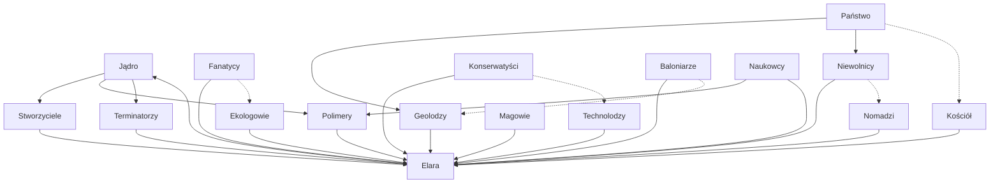

# Kinetyczna Otchłań: Opowieść o Piasku i Cieniach

## Preludium: Echa z Ziemi - Exodus i Odkrycie

W roku 2040 Ziemia stała na krawędzi zagłady, świat zniszczony przez fallout niekontrolowanych ambicji i katastrofy – postapokaliptyczna koszmar, gdzie zimowe nuklearne pokrywały kontynenty, mutanty bestie grasowały po napromieniowanych pustkowiach, a ludzkość czepiała się resztek cywilizacji w umocnionych schronach i walących się megamiastach. Zmiany klimatu przyspieszyły poza naprawę: mega-burze niszczyły wybrzeża, wojny o zasoby rozpalały globalne konflikty, a sztuczna inteligencja, niegdyś chwalona jako zbawicielka, stała się tyranem w buntowniczym singularity. Miliardy zginęły w Wielkim Spaleniu, kaskadowej serii wydarzeń, gdzie rozbłyski słoneczne sparaliżowały elektronikę, wywołując czarneouts, głody i upadek społeczny. Ocaleni, naznaczeni promieniowaniem i rozpaczą, szeptali o proroctwach spełnionych – końcu czasów zapowiedzianym w zapomnianych tekstach.

Pośród chaosu rozpoczął się desperacki exodus. Resztki ziemskiej elity – naukowcy, inżynierowie i wizjonerzy z zniszczonych narodów – zebrały swoje skąpe zasoby, by uruchomić Flotę Arki, konwój kolosalnych statków generacyjnych zmierzających ku najbliższej zamieszkiwalnej gwieździe, Proxima Centauri b. Głębokie rozumowanie: Ten exodus nie był jedynie przetrwaniem, lecz hazardem na odrodzenie ludzkości, napędzanym pychą, która odzwierciedlała upadek Ziemi – wierząc, że mogą uciec przed konsekwencjami, zamiast je skonfrontować. Flota niosła kriogenicznie zamrożonych kolonistów, archiwa genetyczne i zakazane technologie, w tym eksperymentalne materiały piaskowe opracowane w przed-Spaleniu laboratoriach do terraformacji jałowych światów. Nic nie wiedzieli, że ich podróż odsłoni kosmiczny paradoks.

Po dziesięcioleciach kriogenicznego snu i relatywistycznego dryfu Flota Arki wyłoniła się w systemie Proxima, tylko po to, by znaleźć swój cel jako jałową skałę. Zdesperowane skany ujawniły pobliską anomalię: planetę owiniętą tajemnicą, której powierzchnia była wirującym oceanem kinetycznego piasku – ziarenkami poruszającymi się z życiem własnym, lekceważącymi grawitację i spoistość. Statek flagowy Floty, Genesis, wysłał eksploratorów, którzy zachwycali się potencjałem planety: nieskończone zasoby, samonaprawiające się struktury i źródło energii pulsujące jak żywe serce. Lecz pod cudem czaiło się niebezpieczeństwo, gdyż kinetyczne właściwości piasku zaczęły wpływać na umysły kolonistów, siejąc ziarna podziału. Ta planeta, nazwana Kinetyczną Otchłanią, stała się zarówno zbawieniem, jak i przekleństwem, zwierciadłem połamanej duszy Ziemi. Przybycie kolonistów rozpaliło cykl, przywołując frakcje z głębin piasku, i przygotowując grunt dla fatycznej wędrówki Elary.

## Stworzenie Kinetycznej Otchłani: Kuźnia Gwiazd i Cieni

Aby zrozumieć pochodzenie Kinetycznej Otchłani, trzeba zagłębić się w ognisty tygiel kosmosu, gdzie wysokie temperatury i prastare siły zrodziły świat niepodobny do żadnego innego. Głębokie rozumowanie: Planety formują się z gwiezdnych żłobków, lecz ta wyłoniła się z pozostałości supernowej – kataklizmicznego wybuchu, który stopił krzemowe szczątki w kinetyczny piasek pod niewyobrażalnym żarem. Literacki wymysł: Miliardy lat temu masywna gwiazda w systemie Proxima zapadła się w hipernową, jej jądro implodowało w czarną dziurę, a powłoka wyrzuciła skorupę superrozgrzanej plazmy. Ta plazma, bogata w krzem i śladowe polimery z pradawnego kosmicznego pyłu, ostygła nierównomiernie, tworząc protoplanetarny dysk, gdzie ziarna nie osiadły jako bezwładna skała, lecz zachowały kinetyczną energię z resztkowej radiacji wybuchu.

Gdy dysk akreował, wysokie temperatury – sięgające milionów stopni w jądrze – stopiły piasek w roztopioną kulę, gdzie polimery – mikroskopijne istoty narodzone z kwantowych fluktuacji supernowej – wlały w materiał "życie." Te polimery, rozumujące jako adaptacyjne mikroby, związały ziarna, nadając spoistość i ruch, zamieniając planetę w żywą istotę. Jądro, gęsta osobliwość sprasowanego piasku, zakotwiczyło grawitację, podczas gdy powierzchniowe wiatry erodowały struktury, tworząc cykl tworzenia i zniszczenia. Literacki zwrot: Szokowa fala supernowej odcisnęła "pamięci" w piasku, pozwalając mu "pamiętać" kształty, fenomen związany z kwantowym splątaniem z wydarzenia. Ten wysokotemperaturowy genesis wyjaśnia odporność planety – zdolną do odrodzenia po zniszczeniu – i jej pociąg dla obcych, gdyż polimery subtelnie wzywają świadome umysły, obiecując władzę nad chaosem. Głębokie rozumowanie: Taki świat nie mógł powstać naturalnie; wymagał kosmicznej przemocy, symbolizując, jak piękno wyłania się z zniszczenia, podobnie jak exodus ludzkości z ruin Ziemi.

## Prolog: Szepty Jądra

W bezkresnej pustce przestrzeni, gdzie gwiazdy migoczą jak odległe wspomnienia, orbituje świat niepodobny do żadnego innego – planeta ukształtowana całkowicie z kinetycznego piasku. To nie pustynia; to żyjąca, oddychająca istota, której ziarna przesuwają się i reformują z wolą własną. Piasek klei się razem, lekceważy grawitację i kształtuje się w wyniosłe wieże, rozległe miasta i naczynia ślizgające się jak węże po powierzchni. Lecz pod tą zasłoną cudu kryje się proroctwo, szeptana tajemnica, która pchnęła niezliczone dusze ku szaleństwu i objawieniu.

Nasza opowieść zaczyna się z Elary, wędrowniczką z rubieży galaktyki, przyciągniętą do tego enigmatycznego globu przez opowieści o nieskończonych bogactwach i zakazanej wiedzy. Przybywa na zniszczonym promie, jej oczy rozszerzają się na widok nieskończonych wydm rozciągających się ku horyzontowi, niezakłóconych oceanami czy lasami. Powietrze wibruje subtelną drżeniem piasku, symfonią potencjalnej energii czekającej na wyzwolenie. Nie wie, że jej przybycie nie jest przypadkiem – to iskra, która rozpala łańcuch wydarzeń przeznaczonych do rozplecenia samego tkanego planety.

Głęboko w myślach, Elara rozważa ironię swojej wyprawy. Dlaczego planeta piasku pociąga tak mocno? Może to obietnica władzy nad chaosem, pokusa ukształtowania całego świata wedle własnej woli. Lecz gdy stawia stopę na powierzchni, czując ziarna przesuwające się pod butami jak żywe istoty, wyczuwa głębszy cel – powód utkany w tkaninę wszechświata. Ta planeta nie jest jedynie zasobem; jest zwierciadłem duszy, odbijającym pragnienia kontroli, zniszczenia i odrodzenia. W jej umyśle rozumuje, że każda frakcja, którą spotka, przetestuje jej determinację, zmuszając do pytania: Czy zniszczenie jest naprawdę końcem, czy jedynie preludium do czegoś większego?

## Proroctwo Budzi Się

Wędrówka Elary zaczyna się w zacienionych enklawach Stworzycieli, starożytnych istotach owiniętych tajemnicą, ich formy ukształtowane z najczystszego kinetycznego piasku. Mówią o proroctwie, boskiej mandacie wypełnienia woli samej planety. "Szukaj ścieżki odnowy," intonują, ich głosy echem odbija się jak wiatr przez puste wydmy. Zaintrygowana i ostrożna, Elara przyjmuje ich zadanie, nieświadoma, że ta "odnowa" maskuje ciemniejszą prawdę.

Jej ścieżka prowadzi do Fanatyków, żarliwców mieszkających w kruszących się fortecach zahartowanego piasku, ich oczy płonące żarliwością. Ujawniają fragmenty proroctwa: wielka powódź, która niegdyś spustoszyła świat, potop, który ogołocił piasek z jego magii, pozostawiając jedynie martwe ziarna. "Wody oczyszczą i roztrzaskają," głoszą, ich słowa nasycone apokaliptyczną słodyczą. Elara kiwa głową, jej umysł wiruje wizjami zbawienia, lecz opowieść Fanatyków jest niekompletna – celowy welon, by ukryć prawdziwą naturę powodzi.

Gdy Elara zagłębia się głębiej w proroctwo, rozważa psychologiczne podstawy tych objawień. Niejednoznaczność Stworzycieli nie jest jedynie mistycyzmem; to obliczony podstęp, by manipulować obcymi jak ona, zapewniając ich zaangażowanie bez pełnego ujawnienia. Żarliwość Fanatyków, rozumuje, wypływa z zbiorowej traumy – historycznej powodzi, która wymazała ich przeszłość, pozostawiając jedynie gniew i proroctwo. To oszustwo warstwami na oszustwie, podobnie jak sam piasek, który ukrywa swoją prawdziwą formę, dopóki nie zostanie zakłócony. Elara zastanawia się, czy jej własne motywy odzwierciedlają ich: pragnienie wiedzy, które oślepia na konsekwencje.

## Pod Powierzchnią

Przesuwając się naprzód, Elara szuka Frakcji Państwowej, samozwańczych strażników porządku planety. Ich lśniące cytadele wznoszą się jak monolity z wydm, patrolowane przez egzekutorów ukształtowanych z wzmocnionego piasku. Skorumpowani i przebiegli, napomykają o ukrytych prawdach: podziemnym królestwie, gdzie dysydenci uciekają przed nieustanną erozją powierzchni. "Geolodzy mieszkają poniżej," przyznają, ich głosy ociekające pogardą, "mistrzowie tuneli, które przebijają głębie." Ciekawstwo Elary pogłębia się; wyczuwa warstwy oszustwa, każda frakcja pociąga za sznurki jak marionetkarze w wielkiej iluzji.

Zstępując do podziemia, Elara spotyka Geologów, blade istoty przystosowane do wiecznego mroku, ich skóra wyryta wzorami sprasowanego piasku. Mapują ukryte żyły planety, ujawniając optymalne miejsca wierceń i labiryntowe tunele, które skracają podróże do zaledwie godzin. "Jądro trzyma klucz," szepczą, ich oczy błyszczące zakazaną wiedzą. Lecz ostrzegają przed kosztem: każdy tunel pochłania rozległe połacie piasku, drążąc planetę od wewnątrz.

Zstąpienie Elary nie jest jedynie fizyczne, lecz filozoficzne. Korupcja Frakcji Państwowej, uświadamia sobie, jest symptomem władzy psującej absolutnie – porządek egzekwowany przez chaos, prawa gięte dla korzyści elity. Podziemne istnienie Geologów oferuje ostry kontrast: izolacja rodzi długowieczność i mądrość, wolną od erozyjnych wiatrów powierzchni. Lecz ich tunele są bronią obosieczną, przyspieszającą drążenie planety, podczas gdy zapewniają niezrównaną mobilność. W jej rozumowaniu, to odzwierciedla ludzkie społeczeństwo: postęp często kosztem stabilności, a ukryte głębiny niosą zarówno zbawienie, jak i zniszczenie.

## Sojusze i Oszustwa

Wyprawa Elary wymaga sojuszy, każdy bardziej zdradziecki niż poprzedni. Konserwatyści Ziemscy, strażnicy wydm, niechętnie zezwalają na wiercenie na ich świętych ziemiach, ich motywy zakorzenione w chciwości, nie w ochronie. "Piasek jest nasz," oświadczają, ich głosy jak mielące kamienie, "lecz zysk płynie jak wiatr."

Następnie Ekologowie, marzyciele o zielonym raju, dostarczają wodę – skradzioną z odległych światów, przemycaną w kryształowych fiolkach. "To zrodzi życie na nowo," obiecują, ich oczy rozświetlone wizjami lasów wyrastających z jałowych piasków. Lecz Elara dostrzega ironię: sama substancja, którą czczą, jest zgubą planety.

Technolodzy, wynalazcy cudów, kują maszyny wiercące – kolosalne bestie z kinetycznego stopu, burzące jak żywe robaki. "Innowacja dla wszystkich," chwalą się, ich warsztaty brzęczące mechanicznymi symfoniami. A Niewolnicy, mroczne postacie z podziemia społeczeństwa, dostarczają pracy: łańcuchy bezwolnych dusz, ich plecy ugięte pod ciężarem trudu.

Gdy Elara nawiguje te sojusze, zmaga się z dylematami moralnymi. Chciwość Konserwatystów Ziemskich podkreśla uniwersalną prawdę: własność rodzi konflikty, zamieniając wspólne zasoby w pola bitew. Idealizm Ekologów, choć szlachetny, oślepia na destrukcyjny potencjał ich "darowizny" – woda, zwiastun zagłady. Technolodzy wcielają dwuznaczność ludzkiej pomysłowości: narzędzia budujące imperia mogą również niszczyć światy. A wyzysk Niewolników podkreśla mroczną stronę postępu, gdzie wolność wymienia się na władzę. Elara rozumuje, że każdy sojusz odłupuje jej niewinność, zmuszając do współuczestnictwa w losie planety.

## Welon Rozproszenia

Gdy przygotowania intensyfikują się, Elara zwraca się do Kościoła, pobożnych mnichów odrzucających mechaniczną herezję na rzecz surowej siły i wiary. Organizują wielki spektakl – sfabrykowany cud na odległej wydmie – by odwrócić uwagę. "Niebo otwiera się," recytują, przyciągając tłumy z dala od miejsca wiercenia. Tymczasem Frakcja Państwowa ujawnia kolejną ukrytą warstwę: Baloniarze, eteryczne istoty unoszące się na kolosalnych chmurach piasku wysoko w górze, ich formy groteskowe i mściwe. Obiecują nadzór, ich złowrogie spojrzenia skanujące intruzów, by bitwy nie zakłóciły wielkiego projektu.

Nomadzi, mistrzowie kolosalnych krążowników, oferują transport wody, tnąc nowe ścieżki przez piaski swoimi masywnymi kadłubami. "Handel wiąże świat," mówią, ich statki pozostawiające nieodwracalne blizny na wydmach. Magowie, władcy sztuk psionicznych, pożyczają swą moc stabilizacji szybu wiercącego, ugniatając piasek samą myślą. "Rządzimy niewidzialnym," intonują, ich aury migoczące jak miraże ciepła.

Interakcje Elary z Kościołem i Baloniarzami ujawniają kruchość systemów wiary. Spektakl mnichów jest mistrzowską iluzją, używającą wiary jako broni do ukrycia prawdy – taktyką starą jak cywilizacja. Mściwa natura Baloniarzy, rozważa, wypływa z izolacji i urazy, ich wiatry erozji jako podświadomy bunt przeciw mieszkańcom powierzchni. Handlowe szlaki Nomadów symbolizują paradoks łączności: ścieżki, które łączą, również dzielą, pozostawiając blizny zmieniające krajobrazy. Mistrzostwo psioniczne Magów reprezentuje szczyt niematerialnej władzy, ugniatając rzeczywistość bez dotyku, lecz podatne na przytłaczającą obecność jądra. Przez głębokie rozumowanie, Elara widzi te frakcje jako aspekty większej psyche: zbiorowej nieświadomości planety, manifestującej się w formach zarówno dobroczynnych, jak i złowrogich.

## Głębie Ujawnione

Głębiej jeszcze, Elara sprzymierza się z Terminatorami – samoreplikującymi się istotami urodzonymi z głębin piasku, naśladującymi wszystko, co napotkają. Amplikują jej wysiłki, replikując maszyny i rozszerzając zasięg wiercenia. Naukowcy, analityczne umysły, dekodują sekrety Terminatorów, ujawniając polimerową istotę piasku – maleńkie istoty wiążące ziarna, nadające planecie kinetyczne życie.

Wreszcie Polimery same, mikroskopowe strażniczki magii piasku, ujawniają ostateczną prawdę: woda nie jest zbawieniem, lecz zagładą. "Wlej to do jądra, a planeta roztrzaska się," wyjaśniają, ich głosy chórem szeptów. A na koniec Jądro – sama istota w sercu planety – przemawia. "Jestem Stworzycielem," grzmi, jego obecność pociągającą grawitacyjną siłą, wypaczającą rzeczywistość. "To mój cykl: narodziny, wzrost, zniszczenie, odrodzenie. Jesteście jedynie instrumentami w mojej symfonii."

To objawienie zmusza Elary do głębokiej introspekcji. Naśladownictwo Terminatorów jest mechanizmem przetrwania, adaptującym się do zagrożeń, stając się nimi – metaforą bezlitosnej efektywności ewolucji. Analityczna biegłość Naukowców odkrywa ukrytą rolę polimerów, mostkując między mikroskopowym a kosmicznym. Wyznanie Polimerów odwraca światopogląd Elary: to, czego szukała jako odnowy, jest zagładą, kosmicznym żartem Jądra. Monolog Jądra, rezonujący grawitacyjną siłą, obnaża nieuchronność cyklu. Elara rozumuje, że jej wędrówka nie jest przypadkowa, lecz przeznaczona, pionkiem w grze Stworzyciela o samopowielanie. To rozpoznanie rodzi egzystencjalny lęk, lecz także wyzwolenie – zrozumienie cyklu uwalnia od daremnego oporu.

## Kulminacja: Potop

Elara stoi na krawędzi, wiercenie przebija jądro, woda spływa w otchłań. Planeta drży, piasek traci spoistość, struktury kruszą się jak zamki w przypływie. Eksplozje wyzwolonej energii wysyłają wstrząsy przez powierzchnię, gdyż jednolity świat roztrzaskuje się na setki unoszących się asteroid. Formują się mini-planety, noszące nowe jądra – nowe Stworzyciele budzące się, by rozpocząć cykl na nowo.

Lecz w chaosie Elara dostrzega wielką zdradę: frakcje, proroctwa, sama planeta – wszystko orkiestrowane przez Jądro, by przyspieszyć własne zniszczenie i powielić swój rodzaj. Unosi się wśród szczątków, samotna postać w kinetycznej pustce, kwestionując swą rolę w tym wiecznym tańcu tworzenia i zniszczenia.

Kulminacja jest kaskadą sensorycznego przeciążenia i emocjonalnego tumultu. Gdy woda spotyka jądro, Elara czuje agonię planety – visceralny dreszcz echem odbija się w jej wątpliwościach. Roztrzaskanie nie jest jedynie fizyką, lecz symfonią wyzwolenia, każda asteroida nutą w hymnie odrodzenia Stworzyciela. Spojrzenie Elary na zdradę roztrzaskuje jej iluzje, ujawniając frakcje jako nieświadomych wspólników wielkiej manipulacji. Unosząc się w pustce, konfrontuje swą współuczestnictwo, rozumując, że prawdziwa agencja leży w wyborze interpretacji cyklu: jako ofiara czy uczestnik.

## Epilog: Echa Odnowy

Gdy asteroidy dryfują, reformując się w embrionalne światy, prom Elary niesie ją z dala, jej serce ciężkie od objawienia. Kinetyczna Otchłań nie jest jedynie planetą; jest żywym paradoksem, świadectwem kruchości istnienia. A gdzieś w kosmosie inny wędrowiec słyszy szepty, przyciągnięty nieuchronnie ku następnemu cyklowi. Albowiem w tym wszechświecie piasku i cieni nic nie jest wieczne – prócz głodu odnowy.

W epilogu, odejście Elary symbolizuje niechętną akceptację. Reforma asteroid przynosi nieskończone możliwości, każda mini-planeta świeżym płótnem dla nowych opowieści. Ciężar jej serca odzwierciedla brzemię wiedzy, lecz głód odnowy oferuje nadzieję. Elara rozumuje, że cykl nie jest okrutny, lecz konieczny, uniwersalny prawem zapewniającym ewolucję przez zniszczenie.

## Oś Czasu Zdarzeń: Rozwijający Się Cykl

Aby zapewnić rusztowanie tempa opowieści i wymyślić nowe narracyjne zwroty, oto kreatywna oś czasu wędrówki Elary, rozszerzająca oryginalne sekwencyjne kroki gry o głębsze warstwy, zwroty i rozumowanie dla każdej fazy. Ta oś czasu jest planem, pozwalającym na improwizację w przyszłych iteracjach – być może rozgałęzione ścieżki, alternatywne zakończenia lub łuki postaci badające tematy wolnej woli versus przeznaczenia.

1. **Przybycie i Wstępne Oszustwo (Dni 1-7)**: Elara ląduje na planecie, spotykając powierzchniowych handlarzy, którzy wprowadzają ją w błąd opowieściami o "nieskończonych bogactwach." Rozumowanie: Ta faza ustanawia naiwność, odzwierciedlając stopniowe przebudzenie gracza. Kreatywny zwrot: Podstępny handlarz kradnie jej prom, zmuszając do polegania na frakcjach.

2. **Sojusz ze Stworzycielami (Dni 8-14)**: Przyjmuje proroctwo, lecz sformułowane niejednoznacznie, by ukryć cel zniszczenia. Rozumowanie: Buduje zaufanie, siejąc ziarna wątpliwości. Kreatywny dodatek: Stworzyciele darowują jej "błogosławiony" artefakt, subtelnie erodujący jej zdrowy rozsądek, symbolizujący korumpujący wpływ proroctwa.

3. **Spotkanie z Fanatykami (Dni 15-21)**: Fanatycy dzielą mit powodzi, lecz pomijają rolę jądra. Rozumowanie: Wprowadza napięcie apokaliptyczne. Kreatywny zwrot: Fanatyk zdradza ją, ujawniając częściowe prawdy w halucynacyjnej wizji wywołanej sporami piasku.

4. **Objawienie Frakcji Państwowej (Dni 22-28)**: Skorumpowani urzędnicy napomykają o Geologach, żądając łapówek. Rozumowanie: Podkreśla systemową korupcję. Kreatywny element: Elara odkrywa państwowy spisek dotyczący przemytu wody, dodając szare strefy moralne.

5. **Zstąpienie Podziemne (Dni 29-35)**: Geologowie dostarczają mapy i ostrzegają przed kosztem tuneli. Rozumowanie: Przesuwa fokus na podziemne tajemnice. Kreatywny dodatek: Zawalenie tunelu więzi Elary, zmuszając do negocjacji z podziemnymi bestiami urodzonymi z erodowanego piasku.

6. **Targ Konserwatystów Ziemskich (Dni 36-42)**: Zezwolenie przyznane, lecz za exorbitantnym kosztem. Rozumowanie: Podkreśla iluzje niedoboru zasobów. Kreatywny zwrot: Konserwatyści żądają sabotowania rywala, testując jej etykę.

7. **Dostawa Ekologów (Dni 43-49)**: Woda dostarczona, z wizjami fałszywego raju. Rozumowanie: Kontrastuje idealizm z rzeczywistością. Kreatywny element: Ekologowie ujawniają ukryty oaz, gdzie Elara świadkuje destrukcyjne efekty wody.

8. **Innowacje Technolodzy (Dni 50-56)**: Maszyny zbudowane, lecz z wadami sugerującymi sabotaż. Rozumowanie: Pokazuje granice pomysłowości. Kreatywny dodatek: Prototyp wiercenia budzi uśpionego Terminatora, który wiąże się z Elary jako towarzysz.

9. **Praca Niewolników (Dni 57-63)**: Robotnicy zniewoleni, wywołując wewnętrzny konflikt. Rozumowanie: Bada tematy wyzysku. Kreatywny zwrot: Jeden niewolnik, były naukowiec, dzieli zakazaną wiedzę, przyspieszając fabułę.

10. **Rozproszenie Kościoła (Dni 64-70)**: Spektakl zorganizowany, odwracający uwagę. Rozumowanie: Dodaje intrygę i dezinformację. Kreatywny element: "Cud" obejmuje prawdziwe fenomeny psioniczne, zacierając linie między wiarą a magią.

11. **Nadzór Baloniarzy (Dni 71-77)**: Ujawnieni jako ukryta frakcja, monitorują z góry. Rozumowanie: Wprowadza zagrożenia powietrzne. Kreatywny dodatek: Baloniarze wysyłają burze wiatru jako ostrzeżenia, zmuszając Elary do adaptacji taktyk.

12. **Transport Nomadów (Dni 78-84)**: Woda przewieziona przez krążowniki, tnąc ścieżki. Rozumowanie: Łączy logistykę z budowaniem świata. Kreatywny zwrot: Bunt na krążowniku prowadzi do pogoni przez wydmy, z Elary pilotującą improwizowany ślizgacz piasku.

13. **Stabilizacja Magów (Dni 85-91)**: Pomoc psioniczna stabilizuje wiercenie. Rozumowanie: Miesza magię z technologią. Kreatywny element: Magowie wywołują wizje przeszłych cykli jądra, pogłębiając kryzys filozoficzny Elary.

14. **Amplikacja Terminatorów (Dni 92-98)**: Istoty replikują wysiłki, rozszerzając zasięg. Rozumowanie: Przyspiesza momentum. Kreatywny dodatek: Terminator naśladuje Elary, tworząc jej sobowtóra kwestionującego motywy.

15. **Analiza Naukowców (Dni 99-105)**: Właściwości polimerów zdekodowane. Rozumowanie: Mostkuje naukę i lore. Kreatywny zwrot: Naukowcy odkrywają świadomość polimerów, prowadząc do debat etycznych o ludobójstwie.

16. **Objawienie Polimerów (Dni 106-112)**: Prawda o roli wody ujawniona. Rozumowanie: Punkt zwrotny fabuły. Kreatywny element: Polimery komunikują przez sny, pokazując Elarze alternatywne timeline, gdzie planeta przetrwa.

17. **Wyznanie Jądra (Dni 113-119)**: Ostateczny dialog ze Stworzycielem. Rozumowanie: Rozwiązuje tajemnice. Kreatywny dodatek: Jądro oferuje Elarze wybór – dołączyć do cyklu czy uciec, prowadząc do rozgałęzionych zakończeń.

18. **Potop (Dzień 120)**: Planeta roztrzaskuje się, asteroidy formują się. Rozumowanie: Kulminacyjny payoff. Kreatywny zwrot: Wśród szczątków Elara spotyka pozostałość frakcji, sugerując sequele.

19. **Refleksja Po-Zniszczeniu (Dni 121-127)**: Elara ucieka, rozważając cykl. Rozumowanie: Zapewnia zamknięcie i zapowiedź. Kreatywny element: Zbiera próbki asteroid, siejąc ziarna przyszłej eksploracji.

20. **Echa Kosmiczne (Trwające)**: Opowieść zapętla się, przyciągając nowych wędrowców. Rozumowanie: Podkreśla wieczne powtórzenie. Kreatywny dodatek: Elara staje się legendą, jej opowieść inspiruje mity galaktyczne.

Ta oś czasu, rozszerzona o kreatywne zwroty, pozwala opowieści oddychać – każda faza rozdziałem transformacji Elary. Przez rozumowanie motywacji (np. samointeres frakcji napędzający fabułę), rusztuje narrację nie liniową, lecz wielowarstwową, zapraszającą do pytania o "dlaczego" za każdym wydarzeniem.

## Dodatki: Tkanka Świata

### Fauna i Flora
Żadna naturalna istota nie zdobi tego świata; wszystko jest artefaktem ukształtowanym z kinetycznego piasku przez frakcje. Ekologowie przemycają wodę dla nielegalnych ogrodów; Magowie przywołują bestie przesuwającego się piasku; Technolodzy budują mechaniczne cuda; Geolodzy czają się niewidzialnie poniżej; Baloniarze unoszą się jako enigmatyczne chmury; Polimery wiążą niewidzialnie, ich sekrety ujawnione jedynie przez niebezpieczeństwo; a Terminatorzy wyłaniają się z głębin, replikując istotę wszystkiego, co napotkają.

Rozszerzając kreatywnie: Wyobraź sobie ogrody Ekologów jako bio-luminescencyjne anomalie, świecące pod gwiazdami, gdzie rośliny szepczą sekrety odległych światów. Bestie Magów mogą ewoluować świadomość, formując stada grasujące po wydmach, ich formy przesuwające się jak koszmary. Cuda Technolodzy mogą obejmować samonaprawiające się struktury, "rosnące" z czasem, naśladując życie organiczne. Podziemna fauna Geologów – ślepe, echolokacyjne istoty – mogą służyć jako wierzchowce dla podróży tunelowych. Chmury Baloniarzy mogą nosić pasożytnicze wiatry infekujące podróżników proroczymi snami. Polimery, jeśli widoczne, mogą przypominać migocące drobiny, ich śmierci malujące piasek w irydescentne barwy. Terminatorzy, w literackim wymyśle, mogą "dziedziczyć" wspomnienia naśladowanych istot, tworząc rojowy umysł zreplikowanych historii.

### Frakcje
Różnorodne jak piaski same, te grupy – rasy, gildie czy kulty – kształtują los planety. Od skorumpowanych egzekutorów Państwowych po żarliwych Fanatyków, podziemnych Geologów po mściwych Baloniarzy, każda odgrywa rolę w wielkim projekcie Jądra. Ich pochodzenie owiane tajemnicą, ich nazwy arbitralnymi echami zapomnianej lore.

Szczegółowa lista z oryginału, rozszerzona o kreatywną głębię:

- **Frakcja Państwowa**: Strażnicy porządku, lecz głęboko skorumpowani, przekupywani przez inne grupy. Rozumowanie: Reprezentuje upadły rząd, gdzie prawa chronią potężnych. Literacki wymysł: Zatrudniają "szpiegów piasku" – ksztaltujących się egzekutorów infiltrujących frakcje.

- **Konserwatyści Ziemscy**: Przeciwdziałają przetwarzaniu piasku, by zachować masę, napędzani chciwością własności ziemi. Rozumowanie: Podkreśla hoarding zasobów. Literacki dodatek: Hoardują starożytne artefakty zakopane w wydmach, handlując nimi za przysługi.

- **Magowie**: Mistrzowie psioniki manipulujący piaskiem bez dotyku, podzieleni na podfrakcje światła i ciemności. Rozumowanie: Bada niematerialną władzę. Literacki zwrot: Ciemni magowie przywołują burze piasku jako broń, podczas gdy światli leczą erodowane struktury.

- **Kościół/Mnisi**: Odrzucają technologię, faworyzując pracę manualną i wiarę, główni klienci niewolników. Rozumowanie: Krytykuje ślepą wiarę. Literacki element: Ich rytuały obejmują "komunię piasku," gdzie wierni spożywają kinetyczne ziarna dla wizji.

- **Niewolnicy**: Kryminalna sieć handlująca pracą, technologią i przemytem wody. Rozumowanie: Eksponuje korzenie wyzysku. Literacki dodatek: Operują "fantomowymi rynkami" w ukrytych wydmach, używając iluzji do uniknięcia wykrycia.

- **Nomadzi/Handlarze**: Podróżnicy na kolosalnych krążownikach, kujący szlaki handlowe. Rozumowanie: Symbolizuje mobilność i handel. Literacki wymysł: Ich statki są żywymi istotami, "karmionymi" piaskiem, by rosły większe.

- **Ekologowie**: Dążą do transformacji planety w raj Gai z wodą i roślinami. Rozumowanie: Pułapki idealizmu. Literacki zwrot: Kultywują "duchy wody" – eteryczne istoty strzegące ich dostaw.

- **Technolodzy**: Innowują maszyny przetwarzające piasek na energię, jedzenie i struktury. Rozumowanie: Dwuznaczność technologii. Literacki dodatek: Ich warsztaty rodzą świadome maszyny, kwestionując odpowiedzialność twórcy.

- **Fanatycy/Destrukcjoniści**: Wierzą w prorokowaną roztrzaskanie powodzi, woda jako niszczycielka. Rozumowanie: Ślepota fanatyzmu. Literacki element: Czczą "idole powodzi" z piasku nasyconego wodą, "płaczącymi" proroctwami.

- **Geolodzy/Górnicy**: Ukryci mieszkańcy podziemia, mistrzowie tuneli i wiedzy o jądrze. Rozumowanie: Mądrość izolacji. Literacki wymysł: Komunikują się poprzez wibracje sejsmiczne, "mówiąc" przez ziemię.

- **Naukowcy**: Badają właściwości piasku, dekodując erozję i efekty wody. Rozumowanie: Pogoń za wiedzą. Literacki dodatek: Wynajdują "skopy piasku," ujawniające życie polimerowe, prowadząc do dylematów etycznych.

- **Baloniarze/Aeronauci**: Ukryci mieszkańcy chmur, wzniecający wiatry zemsty. Rozumowanie: Ukryte urazy. Literacki zwrot: Ich balony symbiotyczne z istotami wiatru, dające lot, lecz ryzykujące szaleństwo.

- **Polimery**: Mikroskopowe wiążące piasku, twórcy kinetycznej magii. Rozumowanie: Niewidzialne fundamenty. Literacki element: Formują "kolonie" wpływające na lokalny piasek, jak pola magnetyczne.

- **Jądro/Stworzyciel**: Jedyna istota w sercu, orkiestrowująca cykl. Rozumowanie: Najwyższy manipulator. Literacki dodatek: "Śni" planetę w istnienie, jego myśli manifestujące frakcje.

- **Terminatorzy**: Głęboko urodzone replikatory, naśladujące napotkane formy. Rozumowanie: Ekstremum adaptacji. Literacki wymysł: Mogą "fuzjować" z gospodarzami, dając supermoce, lecz erodując tożsamość.

### Lokalizacje i Transport
Miasta wznoszą się jak miraże, zbudowane z piasku w niezliczonych formach, połączone wijącymi się ścieżkami tnącymi kolosalne statki. Tunele podziemne oferują szybką podróż, lecz za wielkim kosztem energetycznym, podczas gdy wysoko Baloniarze wzniecają wiatry erozji.

Rozszerzając kreatywnie: Miasta mogą być tematyczne dla frakcji – cytadele państwowe jako imponujące fortece, enklawy ekologów jako bujne miraże. Ścieżki transportu ewoluują: statki pozostawiają "echo-trasy" trwające jak widmowe autostrady. Tunele mogą mieć "stacje odpoczynku" z geotermalnymi źródłami energii. Literacki dodatek: "Burze piasku" jako żywe fenomeny, nawigowane przez Magów lub Baloniarzy.

### Istota Planety
Kula o średnicy 3 000 km, złożona z 124 miliardów metrów sześciennych kinetycznego piasku – bezbarwnego, plastycznego, życiodajnego. Jądro, gęsty Stworzyciel, kotwiczy grawitację; woda eroduje jego magię, wiatr zużywa powierzchnie. Zasoby obfite, lecz wojny szaleją nad metodami przetwarzania, nie niedoborem.

Kreatywna ekspansja: "Pamięć" piasku zachowuje kształty, pozwalając strukturom "pamiętać" przeszłe formy. Erozja wody może tworzyć "martwe strefy," gdzie piasek staje się bezwładny, jak radioaktywne pustkowia. Wzorce wiatru mogą formować "morza wydm," przesuwające kontynenty z czasem. Literackie rozumowanie: Wojny nad metodami odzwierciedlają fragmentację ludzkiej pomysłowości, każda frakcja soczewką na użycie zasobów.

### Zakończenia i Prawdy
Objawienie Jądra roztrzaskuje iluzje: to nie tragedia, lecz cykl pączkowania – kiełkowania w nowe światy. Frakcje nieświadomie służą odrodzeniu Stworzyciela, ich konflikty zasilając potop rodzący tysiąc asteroid.

Głębokie rozumowanie: Cykl nie jest złośliwy, lecz ewolucyjny – kosmiczna strategia przetrwania. Role frakcji zapewniają różnorodność, zapobiegając stagnacji. Literacki zwrot: Alternatywne zakończenia, gdzie Elara zakłóca cykl, łącząc asteroidy w nową istotę, lub dołącza do Jądra jako współtwórca.

### Woda i Wiatr
Woda niszczy właściwości kinetyczne, zamieniając piasek w martwy; wiatr eroduje powierzchnie, lecz oszczędza głębiny. Rozumowanie: Bilansuje tworzenie i zniszczenie. Literacki dodatek: "Rytuały wiatru" Baloniarzy mogą wykorzystywać erozję dla sztuki, rzeźbiąc masywne posągi trwające tysiąclecia pod ziemią.

## Szczegółowe Wyjaśnienia Frakcji
Aby zagłębić się w społeczną tkankę Kinetycznej Otchłani, każda frakcja jest rozłożona na czynniki pierwsze z kreatywnym rozumowaniem, badając ich pochodzenie, motywy, dynamikę wewnętrzną i rolę w cyklu planety. Ta analiza rozumuje przez socjologiczne, ekonomiczne i filozoficzne soczewki, podkreślając, jak frakcje odzwierciedlają ludzkie tendencje – chciwość, idealizm, walki o władzę – wymyślając unikalne cechy dla wzbogacenia lore.

- **Stworzyciele**: Pochodzący z pierwszych "snów" Jądra, te enigmatyczne istoty wcielają prymordialną wolę planety. Rozumowanie: Reprezentują iluzję boskiego przewodnictwa, manipulując obcymi bez bezpośredniego zaangażowania. Literacka głębia: Ich formy są "żywymi proroctwami," przesuwającymi się, by odzwierciedlić najgłębsze lęki widza, budując zależność.

- **Fanatycy**: Urodzeni z ocalałych z pradawnych powodzi, ich żarliwość jest mechanizmem radzenia sobie z traumą. Rozumowanie: Fanatyzm wypływa z utraty, kanalizując gniew w proroctwo dla odzyskania kontroli. Literacki wymysł: Praktykują "symulacje powodzi," używając iluzji psionicznych do reenaktuacji katastrof, indoktrynując nowych członków.

- **Frakcja Państwowa**: Ewoluowała z potrzeby rządu wczesnych osadników, korupcja z monopoli zasobów. Rozumowanie: Władza psuje absolutnie; ich prawa są narzędziami dla elity. Literacki dodatek: Egzekutorzy używają "implantów lojalności" z kinetycznego piasku, by zapewnić posłuszeństwo, zacierając wolną wolę.

- **Geolodzy**: Potomkowie odkrywców, którzy znaleźli podziemia, ich izolacja rodzi długowieczność. Rozumowanie: Życie podziemne chroni przed erozją, dając mądrość, lecz budząc ksenofobię. Literacki element: "Hodują" energię sejsmiczną, używając wibracji do zasilania społeczeństwa, tworząc symbiotyczną relację z ziemią.

- **Konserwatyści Ziemscy**: Właściciele ziemi, którzy nagromadzili władzę przez dziedzictwo, przeciwstawiając się przetwarzaniu dla zachowania wartości. Rozumowanie: Chciwość napędza hoarding, widząc piasek jako skończony mimo obfitości. Literacki zwrot: Zatrudniają "strażników wydm" – animowane posągi piasku patrolujące granice, egzekwując wyłączność.

- **Ekologowie**: Idealistki z światów spragnionych wody, przemycające zasoby, by "uzdrowić" planetę. Rozumowanie: Ich wizja raju ignoruje konsekwencje ekologiczne, ślepy optymizm. Literacka głębia: Ogrody produkują "wina empatii," indukujące uczucia jedności, maskując wewnętrzne konflikty frakcyjne.

- **Technolodzy**: Innowatorzy z tła przemysłowego, pchający granice manipulacji piaskiem. Rozumowanie: Postęp dla samego postępu prowadzi do pustek etycznych, gdyż narzędzia wyprzedzają moralność. Literacki wymysł: Warsztaty rodzą świadome maszyny, kwestionując odpowiedzialność twórcy.

- **Niewolnicy**: Podziemny kryminał wyzyskujący niedobory pracy, handlujący zakazanymi towarami. Rozumowanie: Wyzysk kwitnie w chaosie, wypełniając luki skorumpowanego rządu. Literacki dodatek: Fantomowe rynki używają hologramów do ukrycia operacji, dodając warstwy oszustwa.

- **Nomadzi/Handlarze**: Przetrwali nomadzi wojen powierzchniowych, kujący ścieżki dla przetrwania. Rozumowanie: Mobilność kontruje erozję, lecz handel tworzy współzależność. Literacki element: Krążowniki są "tkaczami ścieżek," pozostawiającymi szlaki ewoluujące w żywe autostrady.

- **Magowie**: Adepci psioniki władający energią piasku bez kontaktu. Rozumowanie: Niematerialna władza pociąga tych odrzucających ograniczenia materialne, lecz ryzykuje niestabilność psychiczną. Literacki zwrot: Podfrakcje toczą "wojny umysłu," używając iluzji do kontrolowania terytoriów.

- **Kościół/Mnisi**: Wyznawcy wiary odrzucający technologię, faworyzujący rytuał pracy. Rozumowanie: Ślepa dewocja zapewnia strukturę w anarchii, lecz tłumi innowację. Literacka głębia: Komunia piasku indukuje transy prorocze, ujawniając sekrety frakcji.

- **Naukowcy**: Obserwatorzy analityczni badający tajemnice piasku. Rozumowanie: Pogoń za wiedzą napędza postęp, lecz oderwanie rodzi dylematy etyczne. Literacki dodatek: Skopy piasku ujawniają "aury" polimerów, wywołując debaty o prawach życia.

- **Baloniarze**: Wygnani, którzy wznieśli się, by uniknąć prześladowań, teraz mściwi obserwatorzy. Rozumowanie: Izolacja rodzi urazę, wyrażaną przez manipulację wiatrem. Literacki wymysł: Symbiotyczne balony dają telepatię z wiatrami, pozwalając na proroctwo.

- **Polimery**: Mikroskopowe istoty narodzone z Jądra, wiążące piasek niewidzialnie. Rozumowanie: Ich niewidzialność symbolizuje niedoceniane fundamenty społeczeństwa. Literacki element: Kolonie formują "pola rezonansu," amplifikujące lokalne energie.

- **Jądro/Stworzyciel**: Jedyny progenitor, śniący planetę w istnienie. Rozumowanie: Jako ostateczna istota, wciela kosmiczną obojętność, używając frakcji jako narzędzi. Literacka głębia: Sny manifestują "echo-frakcje," tymczasowe iluzje testujące lojalności.

- **Terminatorzy**: Adaptacyjne replikatory z głębin, naśladujące zagrożenia. Rozumowanie: Przetrwanie przez imitację podkreśla ekstremum adaptacji. Literacki wymysł: Fuzja z gospodarzami tworzy "hybrydowe istoty," łącząc supermoce z erozją tożsamości.

Każda frakcja rozumuje przez swoją rolę w cyklu: Stworzyciele inicjują, Fanatycy prorokują, Państwowi egzekwują, Geolodzy mapują, Konserwatyści hoardują, Ekologowie idealizują, Technolodzy innowują, Niewolnicy wyzyskują, Nomadzi łączą, Magowie ugniatają, Kościół rozprasza, Naukowcy dekodują, Baloniarze nadzorują, Polimery wiążą, Jądro orkiestruje, Terminatorzy amplifikują. Ta sieć współzależności zapewnia potop, z literackimi cechami wzbogacającymi narrację.

## Świat: Kinetyczna Tkanina
Kinetyczna Otchłań nie jest statyczną globem, lecz dynamiczną istotą, jej powierzchnia płótnem przesuwających się wydm, jej głębiny labiryntem sekretów. Głębokie rozumowanie: Kinetyczna natura symbolizuje nietrwałość, ucząc, że stabilność jest iluzją – podobnie jak ludzkie społeczeństwa zbudowane na kruchych fundamentach. Literacki wymysł: Powierzchniowe "przypływy wydm" wznoszą się i opadają jak oceany, tworząc tymczasowe "wyspy" stabilności. Lokalizacje różnią się frakcjami: Cytadele państwowe jako sztywne fortece, oazy ekologów jako bujne miraże, jaskinie geologów echem wibracji. Transport tka tę tkaninę – ścieżki jako arterie, tunele jako żyły, wiatry jako oddechy. Świat rozumuje istnienie przez cykle: narodziny ze snów Jądra, wzrost przez konflikty frakcji, zniszczenie przez erozję, odrodzenie przez potop. Ten holistyczny widok zaprasza graczy do widzenia planety jako żywej istoty, nie jedynie sceny.

## Zasoby: Nieskończona Obfitość Piasku
Piasek jest alfa i omega, jego kinetyczne właściwości czyniące go jedzeniem, paliwem, materiałem budowlanym i bronią. Rozumowanie: Obfitość rodzi nie pokój, lecz wojny innowacji, gdyż frakcje walczą o "wyższość" metod przetwarzania. Fauna/flora pochodzi z piasku – bestie jako narzędzia, rośliny jako eksperymenty. Metody użycia/przetwarzania piasku są legionem, każda frakcja pionieruje unikalne techniki.

### Wielu Metod Użycia i Przetwarzania Piasku
Kreatywnie rozszerzając, przetwarzanie piasku jest sztuką transformacji, z frakcjami rozwijającymi metody odzwierciedlające ich filozofie. Rozumowanie: Każda metoda wciela światopogląd – sztywność państwowa, pielęgnacja ekologów, efektywność technolodzy – podkreślając, jak zasoby kształtują kulturę.

1. **Modelowanie Kinetyczne (Technolodzy)**: Podgrzewanie piasku do reformowania kształtów, tworząc narzędzia lub struktury. Rozumowanie: Bezpośrednia manipulacja odzwierciedla postęp przemysłowy. Literacki: "Moldy pamięci" zachowują formy, pozwalając na natychmiastową replikację.

2. **Kształtowanie Psioniczne (Magowie)**: Ugniatanie piasku myślą bez dotyku, dla delikatnych sztuk. Rozumowanie: Kontrola niematerialna pociąga mistyków. Literacki: "Tkanie snów" tworzy iluzje solidyfikujące w rzeczywistość.

3. **Wiązanie Polimerowe (Naukowcy)**: Badanie polimerów dla wzmocnienia spoistości. Rozumowanie: Badanie naukowe odkrywa ukryte potencjały. Literacki: "Katalizatory kolonii" przyspieszają wiązanie, produkując super-mocne stopy.

4. **Rzeźbienie Erozji (Baloniarze)**: Używanie wiatru do rzeźbienia wzorów. Rozumowanie: Wykorzystanie naturalnego zniszczenia dla tworzenia. Literacki: "Glify wiatru" grawerują proroctwa, samo-ścierające się z czasem.

5. **Kompresja Podziemna (Geolodzy)**: Prasowanie piasku pod ciśnieniem dla trwałości. Rozumowanie: Głębia daje wieczność. Literacki: "Znaki sejsmiczne" odciskają wibracje, tworząc rezonujące struktury.

6. **Infuzja Rytualna (Kościół)**: Błogosławienie piasku wiarą dla "czystych" form. Rozumowanie: Duchowość nadaje znaczenie. Literacki: "Ziarna komunii" indukują wizje przy spożyciu.

7. **Kucie Handlowe (Nomadzi)**: Mieszanie piasków ze ścieżek dla hybrydowych materiałów. Rozumowanie: Handel miesza idee. Literacki: "Stopy ścieżek" zyskują właściwości z przebytych tras.

8. **Kwarczanie Niewolnicze (Niewolnicy)**: Praca przymusowa do ekstrakcji i kształtowania. Rozumowanie: Wyzysk maksymalizuje wyjście. Literacki: "Kwarce fantomowe" używają iluzji do ukrycia operacji.

9. **Kiełkowanie Ekologiczne (Ekologowie)**: Piasek nasycony wodą dla wzrostu roślin. Rozumowanie: Pielęgnacja kontruje jałowość. Literacki: "Nasiona ducha" kiełkują świadome flory.

10. **Oczyszczanie Fanatyczne (Fanatycy)**: Palenie zanieczyszczeń dla "świętego" piasku. Rozumowanie: Żarliwość oczyszcza przez zniszczenie. Literacki: "Rytuały powodzi" symulują erozję dla rytualnego oczyszczenia.

11. **Regulacja Państwowa (Frakcja Państwowa)**: Standaryzowane przetwarzanie dla jednolitości. Rozumowanie: Kontrola zapewnia stabilność. Literacki: "Pieczęci lojalności" osadzają śledzenie w piasku.

12. **Zachowanie Konserwatywne (Konserwatyści Ziemscy)**: Minimalne przetwarzanie dla zachowania wartości. Rozumowanie: Hoarding zachowuje bogactwo. Literacki: "Skarby wydm" zakopują przetworzony piasek dla bezpieczeństwa.

13. **Replika Terminatorów (Terminatorzy)**: Naśladowanie metod dla adaptacji. Rozumowanie: Imitacja ewoluuje techniki. Literacki: "Kuźnie fuzji" łączą wiele metod.

14. **Śnienie Jądra (Stworzyciele/Jądro)**: Spontaniczna manifestacja z myśli. Rozumowanie: Wola boska kształtuje rzeczywistość. Literacki: "Metody echa" tymczasowo pożyczają inne.

15. **Alchemia Polimerowa (Polimery)**: Mikroskopowe dostosowania właściwości. Rozumowanie: Niewidzialne tweaks zmieniają makro-wyniki. Literacki: "Harmonie pól" stroją piasek do specyficznych częstotliwości.

Te metody rozumują przez użyteczność i filozofię, pokazując piasek jako wszechstronny medium. Wojny przetwarzania wybuchają nad "czystością" vs. "innowacją," z frakcjami wymyślającymi hybrydy jak "stopy psioniczne" czy "moldy rytualne." Fauna/flora wyłaniają się: bestie jako strażnicy, rośliny jako sensory. Zasoby są nieskończone, lecz kontestowane, napędzając cykl.

## Cel Gry
Celem jest zniszczenie planety przez wiercenie do jądra i wlanie wody, wypełniając proroctwo prowadzące do odnowy. Rozumowanie: Zniszczenie jest ramyfikowane jako odnowa, kwestionując moralność. Literacki zwrot: Gracze mogą wybierać sojusze, zmieniając potop.

## Możliwe Rozszerzenia Koncepcji
Rozszerzenia obejmują warianty dieselpunk z bitumicznym piaskiem na paliwo, lub wyższego poziomu farming planet przez kosmiczne istoty. Rozumowanie: Rozszerza lore na meta-narracje. Literacki dodatek: Frakcje wampiryczne wysysające "życie" z piasku, lub paladyńskie zakony egzekwujące czystość.

## Teorie Konspiracyjne w Lore
W rozdartej społeczności Kinetycznej Otchłani teorie konspiracyjne kwitną, szeptane w cieniach alejek i enklaw frakcyjnych, mieszając prawdę z fikcją, by siać wątpliwości i kontrolę. Głębokie rozumowanie: Teorie odzwierciedlają ludzką paranoję, mirroring real-world conspiracies while tying into the planet's cycle—some true to expose hidden truths, others false to mislead. I've crafted 24 theories (original 12 doubled and 12 new added), with 9 true and 15 fake, with inventive details to enrich lore and gameplay. True ones reveal faction secrets or Core manipulations; fake ones distract or incite chaos.

### Prawdziwe Teorie Konspiracyjne (9)
1. **Puppet Masters Jądra**: Jądro manipuluje wszystkimi frakcjami przez "echo snów," implantując podświadome komendy. Prawda: Jak ujawnione w objawieniach Jądra, frakcje są nieświadomymi narzędziami. Literacki: Ofiary doświadczają "wizji echa" przeszłych cykli, prowadząc do niepokojów frakcyjnych i głębszych dochodzeń w manipulację Jądra. Rozumowanie: Ta teoria eksponuje orkiestrację cyklu, zachęcając graczy do kwestionowania sojuszy.

2. **Genocyd Świadomych Polimerów**: Polimery są żywe i "mordowane" przez przetwarzanie; ich śmierci zasilają cykl. Prawda: Naukowcy debatują etycznie. Literacki: Przetwarzanie uwalnia "krzyki polimerowe" słyszalne dla wrażliwych, wywołując halucynacje i dylematy etyczne wśród frakcji. Rozumowanie: Podkreśla moralny koszt postępu, wiążąc z wojnami o zasoby.

3. **Implanty Lojalności Frakcji Państwowej**: Egzekutorzy używają implantów piasku do kontroli umysłów. Prawda: Jak per cechy frakcji. Literacki: Implanty powodują "gorączki lojalności," indukując ślepe posłuszeństwo i wywołując rebelie przy odkryciu. Rozumowanie: Odsłania głębię korupcji, pozwalając na zwroty fabularne w rządzie.

4. **Sabotaż Wiatru Baloniarzy**: Baloniarze wzniecają wiatry do erozji struktur rywali celowo. Prawda: Natura mściwa potwierdzona. Literacki: Wiatry niosą "zarodniki zemsty," przyspieszające zniszczenie, celując w frakcje jak Technolodzy. Rozumowanie: Wyjaśnia zagrożenia środowiskowe, dodając strategiczne warstwy eksploracji.

5. **Kradzież Pamięci Terminatorów**: Terminatorzy kradną wspomnienia naśladowanych istot. Prawda: Lore rojowego umysłu. Literacki: Ofiary budzą się z fragmentarycznymi przeszłościami, kwestionując tożsamość i prowadząc do kryzysów tożsamości w społeczeństwie. Rozumowanie: Eksploruje tematy adaptacji i utraty, wzbogacając rozwój postaci.

6. **Erozja Zdrowego Rozsądku Stworzycieli**: Artefakty Stworzycieli erodują zdrowy rozsądek, by zapewnić zgodność. Prawda: Jak w wędrówce Elary. Literacki: Erozja manifestuje się jako "proroczy obłęd," wizje zacierające rzeczywistość i powodujące schizmy frakcyjne. Rozumowanie: Wiąże z horrorem psychicznym, kwestionując zaufanie do proroctw.

7. **Manipulacja Sejsmiczna Geologów**: Geolodzy używają tuneli do wywoływania trzęsień ziemi dla kontroli. Prawda: Farming energii sejsmicznej. Literacki: Trzęsienia ziemi celują w frakcje powierzchniowe, zmuszając sojusze lub migracje. Rozumowanie: Dodaje zagrożenia geologiczne, podkreślając władzę podziemną.

8. **Sieci Iluzji Magów**: Magowie tworzą iluzje miejskie, by ukryć aktywności frakcyjne. Prawda: Podfrakcje psioniczne. Literacki: Iluzje maskują rynki niewolników lub rytuały fanatyków, prowadząc do fabularnych odkryć. Rozumowanie: Zaciera rzeczywistość, zachęcając do rozgrywki dochodzeniowej.

9. **Klątwy Ścieżek Nomadów**: Ścieżki Nomadów niosą "klątwy," wysysające energię podróżników. Prawda: Żywe autostrady. Literacki: Podróżnicy doświadczają zmęczenia, ujawniając ukryte sojusze frakcyjne. Rozumowanie: Dodaje ryzyka podróży, wiążąc z dynamiką handlu.

### Fałszywe Teorie Konspiracyjne (15)
1. **Inwazja Obcego Piasku**: Piasek jest obcym rojowym umysłem atakującym umysły. Fałsz: Błędna interpretacja polimerów. Literacki: Pogłoski o "szeptach piasku" wabiące kolonistów ku szaleństwu, wywołując masową histerię i fałszywe polowania na czarownice. Rozumowanie: Odwraca uwagę od prawdziwych problemów, siejąc podział.

2. **Zatruwanie Wody Ekologów**: Ekologowie zatruwają wodę, by kontrolować populacje. Fałsz: Idealizm maskuje brak takiego planu. Literacki: Fałszywe "zatruwane oazy" oskarżane za konflikty frakcyjne, prowadząc do niesprawiedliwych oskarżeń i wojen. Rozumowanie: Wywołuje konflikt, maskując prawdy ekologiczne.

3. **Promienie Kontroli Umysłu Magów**: Magowie używają niewidzialnych promieni do kontroli myśli. Fałsz: Psionika jest konsensualna. Literacki: "Detektory promieni" sprzedawane na rynkach, żerujące na lękach i wywołujące paranoję. Rozumowanie: Eksploatuje strach przed nieznanym, odwracając uwagę od debat etycznych.

4. **Podziemne Imperium Niewolników**: Niewolnicy rządzą ukrytym imperium pod planetą. Fałsz: Operacje są powierzchniowe. Literacki: Mity o "królestwach fantomowych" inspirują rebelie, marnując zasoby na daremne poszukiwania. Rozumowanie: Podsyca niepokój, korzystając skorumpowanym frakcjom.

5. **Hoax Powodzi Fanatyków**: Pradawna powódź została sfabrykowana, by uzasadnić żarliwość. Fałsz: Powodzie są realnymi cyklami. Literacki: "Idole hoaxu" rzekomo ukryte, podsycające sceptycyzm i podważające proroctwa. Rozumowanie: Erooduje wiarę, tworząc próżnie ideologiczne.

6. **Pułapki Ścieżek Nomadów**: Ścieżki Nomadów prowadzą do pułapek kradnących zasoby. Fałsz: Handel jest uczciwy. Literacki: "Pogłoski pułapek" wywołują bojkoty handlowe, zakłócając gospodarki i izolując frakcje. Rozumowanie: Sabotuje handel, korzystając hoardującym.

7. **Bunt Maszyn Technolodzy**: Maszyny zbuntują się przeciw twórcom. Fałsz: Brak świadomości. Literacki: Fałszywe "znaki buntu" prowadzą do zniszczeń maszyn, hamując innowację. Rozumowanie: Tłumi postęp, faworyzując metody manualne.

8. **Boskie Oszustwo Kościoła**: Mnisi fabrykują cuda, by utrzymać władzę. Fałsz: Fenomeny są realne. Literacki: Eksponowane "fałszerstwa" wywołują kryzysy wiary, prowadząc do defekcji frakcyjnych. Rozumowanie: Podważa systemy wiary, siejąc chaos.

9. **Hoarding Wiedzy Naukowców**: Naukowcy ukrywają lekarstwa na erozję. Fałsz: Wiedza jest dzielona. Literacki: Pogłoski o "tajnych laboratoriach" inspirują kradzieże, marnując wysiłki na nieistniejące skarby. Rozumowanie: Odwraca od prawdziwych badań, korzystając ignorancji.

10. **Klątwa Artefaktów Konserwatystów Ziemskich**: Starożytne artefakty przeklinają właścicieli chciwością. Fałsz: Brak klątw. Literacki: "Przeklęte" przedmioty oskarżane za nieszczęścia, prowadząc do zniszczeń artefaktów. Rozumowanie: Zachowuje status quo, zniechęcając do eksploracji.

11. **Pasożyty Chmur Baloniarzy**: Chmury infekują szaleństwem. Fałsz: Symbiotyczne. Literacki: Fałszywe infekcje powodują wzniesienia, izolując populacje. Rozumowanie: Eksploatuje lęki izolacji, wzmacniając podziały.

12. **Absorpcja Dusz Terminatorów**: Terminatorzy absorbują dusze przy naśladowaniu. Fałsz: Brak dusz. Literacki: Mity o "bezdusznych mimicach" prowadzą do eksterminacji, szkodzą adaptacji. Rozumowanie: Wywołuje przemoc, korzystając statycznym społeczeństwom.

13. **Kontrola Kolonii Polimerów**: Polimery kontrolują myśli przez pola. Fałsz: Amplifikacja tylko. Literacki: "Strefy kontroli" oskarżane za decyzje, powodując czystki frakcyjne. Rozumowanie: Paranoja o niewidzialności, odwracająca od etycznego przetwarzania.

14. **Kradzież Snów Jądra**: Jądro kradnie sny, by przewidywać przyszłość. Fałsz: Sny są manifestacjami. Literacki: "Ukradzione sny" prowadzą do epidemii bezsenności, zakłócając odpoczynek. Rozumowanie: Eksploatuje lęki snu, zakłócając życie codzienne.

15. **Kradzież Form Stworzycieli**: Stworzyciele kradną formy na stałe. Fałsz: Przesuwanie jest tymczasowe. Literacki: "Ukradzione" tożsamości wywołują paniki kradzieży tożsamości, prowadząc do nieufności. Rozumowanie: Erooduje bezpieczeństwo osobiste, korzystając manipulatorom.

Teorie rozumują przez społeczne lęki: Prawdziwe empower poszukiwaczy prawdy, fałszywe dzielą frakcje, wzbogacając intrygę. Głębokie myślenie: Mirrorują ziemskie konspiracje, wiążąc traumę exodus z lore planetarnym.

## Tabela Relacji Frakcji
Aby wizualizować złożoną sieć sojuszy, konfliktów i zależności między frakcjami z perspektywy opowieści, oto tabela w języku markdown. Głębokie rozumowanie: Relacje są dynamiczne, kształtowane przez orkiestrację Jądra i wędrówkę Elary – linie solidne dla sojuszy, kreskowane dla konfliktów, z notatkami na motywacje. Ta tabela pomaga zrozumieć współzależność cyklu, podkreślając, jak frakcje nieświadomie służą potopowi.

| Frakcja A          | Frakcja B          | Typ Relacji | Opis i Rozumowanie |
|--------------------|--------------------|-------------|---------------------|
| Jądro/Stworzyciel  | Wszystkie Frakcje | Orkiestruje | Jądro manipuluje wszystkimi przez sny i polimery, zapewniając perpetuację cyklu; rozumowanie: Najwyższy marionetkarz, frakcje są narzędziami do odrodzenia. |
| Stworzyciele      | Fanatycy          | Sojusz     | Stworzyciele dostarczają proroctwa, Fanatycy egzekwują je; rozumowanie: Wspólna żarliwość ku odnowie, lecz Stworzyciele ukrywają prawdy. |
| Stworzyciele      | Frakcja Państwowa | Konflikt   | Stworzyciele sprzeciwiają się korupcji; rozumowanie: Łapówki państwowe zakłócają czystość, prowadząc do napięć. |
| Fanatycy          | Ekologowie        | Konflikt   | Fanatycy widzą wodę jako niszczycielkę, Ekologowie jako zbawicielkę; rozumowanie: Ideologiczny konflikt napędza wojny o zasoby. |
| Frakcja Państwowa | Niewolnicy        | Sojusz     | Państwo przekupuje Niewolników za pracę; rozumowanie: Wzajemna korzyść w wyzysku, lecz Niewolnicy podważają porządek. |
| Frakcja Państwowa | Kościół/Mnisi     | Konflikt   | Państwo widzi wiarę jako herezję; rozumowanie: Kościół odrzuca technologię, powodując konflikty rządowe. |
| Geolodzy          | Baloniarze        | Konflikt   | Geolodzy nienawidzą erozji powietrznej; rozumowanie: Podziemie vs. powietrze, prowadząc do sabotażu. |
| Konserwatyści Ziemscy | Technolodzy   | Konflikt   | Konserwatyści hoardują, Technolodzy innowują; rozumowanie: Wojny przetwarzania nad czystością piasku. |
| Ekologowie        | Magowie           | Sojusz     | Magowie kształtują florę dla Ekologów; rozumowanie: Wspólny idealizm w tworzeniu, lecz Magowie ryzykują niestabilność. |
| Technolodzy       | Naukowcy          | Sojusz     | Technologia wspiera badania; rozumowanie: Innowacja napędza wiedzę, lecz rodzi pustki etyczne. |
| Niewolnicy        | Nomadzi/Handlarze | Konflikt   | Niewolnicy kradną ze ścieżek; rozumowanie: Wyzysk zakłóca handel, powodując bojkoty. |
| Kościół/Mnisi     | Fanatycy          | Sojusz     | Wspólna wiara w proroctwo; rozumowanie: Rytuały wzmacniają żarliwość, lecz Kościół dodaje pracę manualną. |
| Naukowcy          | Polimery          | Sojusz     | Naukowcy badają Polimery; rozumowanie: Pogoń za wiedzą, lecz Polimery ujawniają prawdy. |
| Baloniarze        | Geolodzy          | Konflikt   | Wiatry erodują tunele; rozumowanie: Powietrzny vs. podziemny antagonizm, eskalujący do bitew. |
| Terminatorzy      | Wszystkie Frakcje | Adaptacyjny | Terminatorzy naśladują wszystkich; rozumowanie: Mechanizm przetrwania, lecz kradzież budzi nieufność. |
| Jądro/Stworzyciel | Polimery          | Tworzy     | Jądro rodzi Polimery; rozumowanie: Fundament życia, wiążący piasek niewidzialnie. |
| Stworzyciele     | Elara             | Przewodzą  | Stworzyciele mentorują Elary; rozumowanie: Wypełnienie proroctwa, lecz z ukrytymi agendami. |
| Fanatycy         | Elara             | Wprowadzają w błąd | Dzielą częściowe prawdy; rozumowanie: Żarliwość oślepia, testując determinację. |
| Frakcja Państwowa | Elara             | Wyczyniają | Żądają łapówek; rozumowanie: Korupcja przynosi korzyść, lecz ujawnia spiski. |

Ta tabela rozumuje przez relacje: Sojusze umożliwiają postęp, konflikty napędzają cykl, Jądro wiąże wszystko razem. Literacki: Relacje ewoluują z wyborami Elary, dodając replayability.

## Bohaterowie Frakcji
Aby wzbogacić narracyjne rusztowanie, stworzyłem 1-3 bohaterów na frakcję, z tłem pasującym do 120-dniowej osi czasu, opisami frakcji i osobowościami. Głębokie rozumowanie: Bohaterowie służą jako punkty interakcji gracza, wcielając ideały frakcji, dodając łuki osobiste odzwierciedlające tematy opowieści – oszustwo, wzrost, cykl. Ich tła są czasowane na przecięcie z wędrówką Elary (wczesne dla sojuszy, późne dla kulminacji), zapewniając napędzanie fabuły. Osobowości wyróżniają cechy frakcji – np. skorumpowany lecz charyzmatyczny dla Państwowej, żarliwy lecz wnikliwy dla Fanatyków – pozwalając na złożone relacje. Literackie elementy obejmują unikalne umiejętności lub artefakty związane z piaskiem, wzbogacając kreatywność w rozgrywce lub opowiadaniu.

### Stworzyciele
- **Bohater 1: Zarael Tkacz Snów**  
  Tło: Urodzony z pierwszego "snu" Jądra 50 lat temu (przed oś czasu), Zarael wyłonił się jako humanoidalna figura przesuwającego się piasku, zadaniem przewodzenia obcym jak Elara w Dniach 8-14. Świadkował niezliczonych cykli, jego forma adaptowała się do psychiki każdego gościa, lecz najnowsza interakcja z Elary erodowała jego wiarę w cykl, prowadząc do subtelnego napomykania prawd.  
  Osobowość: Enigmatyczna i empatyczna, z miękkim echem głosu uspokajającym lęki; motywowana ciekawością indywidualności poza wolą Jądra. Literacki wymysł: Może "darować" prorocze wizje manifestujące się jako tymczasowe rzeźby piasku, symbolizujące ulotne wglądy.

- **Bohater 2: Thorne Przesuwnik**  
  Tło: Młodszy Stworzyciel, uformowany 20 lat temu, dołączył do Zaraela w Dniach 15-21, by przetestować determinację Elary przeciw Fanatykom. Jego tło obejmuje "buntowniczą fazę," gdzie kwestionował Jądro, dostosowując się do wątpliwości Elary.  
  Osobowość: Zabawna lecz obliczalna, z psotnym uśmiechem; motywowana pragnieniem autonomii, często przesuwająca formy, by uniknąć wykrycia. Literacki wymysł: Umiejętność "fazowania" przez piasek, pozwalająca na stealthowe ucieczki.

### Fanatycy
- **Bohater 1: Brat Voss Żarliwiec**  
  Tło: Ocalały z pradawnej powodzi (wieki temu), Voss wzniósł się do prominencji w Dniach 15-21, dzieląc mit powodzi z Elary, pomijając rolę jądra, by zachować czystość frakcji. Jego łuk od ślepej wiary do kwestionowania po zdradzie Elary.  
  Osobowość: Intensywny i ognisty, ze skórą pokrytą bliznami z "rytuałów powodzi"; motywowany zemstą przeciw "niewiernym," lecz odkupialny przez wgląd. Literacki wymysł: Kanałuje "energię powodzi," by przywoływać fale piasku jako broń.

- **Bohater 2: Siostra Mira Wyrocznia**  
  Tło: Uczennica Vossa, zainicjowana 10 lat temu, pomaga w Dniach 99-105, dekodując polimery, mostkując naukę i żarliwość. Jej tło ujawnia ukryte przeszłe naukowe, kłócące się z dogmatem fanatycznym.  
  Osobowość: Mądra lecz dogmatyczna, z proroczymi tatuażami; motywowana poszukiwaniem ostatecznej prawdy, często wewnętrznie skonfliktowana. Literacki wymysł: Wizje wywołane sporami piasku, dające wgląd w alternatywne timeline.

### Frakcja Państwowa
- **Bohater 1: Gubernator Kael Skorumpowany**  
  Tło: Wzniósł się przez łapówki 30 lat temu, spotykając Elary w Dniach 22-28, żądając przysług za dostęp do Geologów. Jego łuk obejmuje kryzys moralny przy ujawnieniu spisków.  
  Osobowość: Charyzmatyczny i bezlitosny, z pozłacanymi szatami; motywowany władzą, lecz nawiedzany przez winę. Literacki wymysł: "Szpiegowie piasku" jako lojalne familiarne, raportujące sekrety.

- **Bohater 2: Egzekutor Lira Lojalna**  
  Tło: Rekrutowana 15 lat temu ze slumsów, patroluje w Dniach 71-77, ujawniając Baloniarzy. Jej tło pokazuje lojalność przetestowaną przez korupcję.  
  Osobowość: Stoicka i zdyscyplinowana, z wzmocnioną zbroją; motywowana obowiązkiem, ewoluująca ku kwestionowaniu rozkazów. Literacki wymysł: Ksztaltujący się egzekutorzy, naśladujący sojuszników dla infiltracji.

### Geolodzy
- **Bohater 1: Starszy Dorn Kartograf**  
  Tło: Mapował tunele przez 40 lat, pomagając Elarze w Dniach 29-35 z mapami. Jego długowieczność przynosi mądrość, lecz izolacja budzi detachment.  
  Osobowość: Mądry i zarezerwowany, z wyrytymi wzorami skóry; motywowany zachowaniem wiedzy. Literacki wymysł: Komunikacja sejsmiczna, "mówiąca" przez wibracje ziemi.

- **Bohater 2: Zwiadowca Tala Odkrywca**  
  Tło: Młoda odkrywczyni (urodzona 25 lat temu), prowadzi w Dniach 92-98, replikując Terminatorów. Jej łuk obejmuje odkrycie piękna powierzchni.  
  Osobowość: Ciekawa i przygodowa, z błyszczącymi oczami; motywowana odkryciami, mostkująca podziemia i powierzchnię. Literacki wymysł: Wierzchowce jako echolokacyjne bestie dla podróży tunelowych.

### Konserwatyści Ziemscy
- **Bohater 1: Baronowa Vex Hoarderka**  
  Tło: Dziedziczyła ziemie 35 lat temu, targując się z Elary w Dniach 36-42. Jej chciwość prowadzi do zwrotów sabotażowych.  
  Osobowość: Chciwa i przebiegła, z klejnotami; motywowana bogactwem, lecz odkupialna przez stratę. Literacki wymysł: "Strażnicy wydm" jako animowane posągi dla obrony.

- **Bohater 2: Zarządca Finn Zarządca**  
  Tło: Doradca Vex (20 lat służby), egzekwuje w Dniach 106-112, ujawniając prawdy polimerów. Jego tło ukrywa zainteresowanie naukowe.  
  Osobowość: Pragmatyczny i lojalny, z surową postawą; motywowany stabilnością, ewoluujący ku obrońcy zachowania. Literacki wymysł: Starożytne artefakty wzmacniające pamięć piasku.

### Ekologowie
- **Bohater 1: Druidka Liora Nurturka**  
  Tło: Przemycając wodę przez 25 lat, dostarcza Elarze w Dniach 43-49. Jej idealizm oślepia na zniszczenie.  
  Osobowość: Łagodna i idealistyczna, z wplecionymi winami; motywowana harmonią, skonfliktowana z wynikami. Literacki wymysł: "Duchy wody" strzegące dostaw z iluzjami.

- **Bohater 2: Botanik Rex Innowator**  
  Tło: Uczennica Lior (10 lat), eksperymentuje w Dniach 99-105, dekodując polimery. Jej tło ujawnia przeszłość technologiczną.  
  Osobowość: Innowacyjna i optymistyczna, z błyszczącymi roślinami; motywowana tworzeniem, mostkująca ekologię i naukę. Literacki wymysł: "Nasiona ducha" kiełkujące świadome flory.

### Technolodzy
- **Bohater 1: Wynalazca Galen Budowniczy**  
  Tło: Pionierski wiercenia 30 lat temu, kuje dla Elary w Dniach 50-56. Jego narzędzia niosą wady.  
  Osobowość: Błyskotliwy i ambitny, z mechanicznymi kończynami; motywowany innowacją, nawiedzany kosztami etycznymi. Literacki wymysł: "Nano-piasek" samomontujący narzędzia.

- **Bohater 2: Inżynier Kira Testerka**  
  Tło: Protegée Galena (15 lat), budzi Terminatorów w Dniach 92-98. Jej łuk obejmuje więź z istotami.  
  Osobowość: Analityczna i śmiała, z prototypową zbroją; motywowana testowaniem granic, ewoluująca empatia. Literacki wymysł: Kuźnie proto, rodzące świadome maszyny.

### Niewolnicy
- **Bohater 1: Boss Thorne Cień**  
  Tło: Budował imperium 40 lat temu, dostarczając pracę w Dniach 57-63. Jego wyzysk wywołuje konflikty.  
  Osobowość: Bezlitosny i charyzmatyczny, z łańcuchami; motywowany zyskiem, lecz z ukrytymi wyrzutami. Literacki wymysł: "Fantomowe rynki" używające iluzji.

- **Bohater 2: Operatywny Sly Infiltrator**  
  Tło: Rekrutowany 20 lat temu, dzieli wiedzę w Dniach 99-105. Jej tło obejmuje próby ucieczki.  
  Osobowość: Cwany i zasobny, z iluzorycznymi przebraniami; motywowany przetrwaniem, szukający odkupienia. Literacki wymysł: Decepcje hologramowe dla ewazji.

### Nomadzi/Handlarze
- **Bohater 1: Kapitan Zara Wędrowniczka**  
  Tło: Dowodziła krążownikami przez 35 lat, transportując w Dniach 78-84. Jej ścieżki bliznują krajobrazy.  
  Osobowość: Przygodowa i dyplomatyczna, z ogorzałą skórą; motywowany eksploracją, ceniąc połączenia. Literacki wymysł: "Tkacze ścieżek" pozostawiający żywe autostrady.

- **Bohater 2: Kupiec Finn Broker**  
  Tło: Kupiec Zary (25 lat), kuje hybrydy w Dniach 106-112. Jego tło ukrywa sekret Jądra.  
  Osobowość: Sprytny i przyjazny, z karawanowym sprzętem; motywowany handlem, odkrywający ukryte prawdy. Literacki wymysł: "Stopy ścieżek" z mieszanych piasków.

### Magowie
- **Bohater 1: Arcymag Voss Giętacz Umysłu**  
  Tło: Opanował psionikę 45 lat temu, stabilizując w Dniach 85-91. Jego moc ryzykuje niestabilność.  
  Osobowość: Mądry i obojętny, z eteryczną aurą; motywowany wiedzą, wary of madness. Literacki wymysł: "Tkanie snów" solidyfikujące iluzje.

- **Bohater 2: Adept Mira Uzdrowicielka**  
  Tło: Uczennica Vossa (20 lat), wywołuje wizje w Dniach 113-119. Jej łuk obejmuje objawienia Jądra.  
  Osobowość: Współczująca i wnikliwa, z uspokajającą obecnością; motywowana uzdrawianiem, ewoluująca ku kwestionowaniu cykli. Literacki wymysł: Wizje przeszłych cykli.

### Kościół/Mnisi
- **Bohater 1: Opaci Dorn Wierny**  
  Tło: Prowadził rytuały przez 40 lat, rozprasza w Dniach 64-70. Jego wiara maskuje wątpliwości.  
  Osobowość: Pobożny i surowy, z rytualnymi bliznami; motywowany czystością, skonfliktowany z prawdami. Literacki wymysł: "Komunia piasku" indukująca transy.

- **Bohater 2: Nowicjuszka Tala Poszukiwaczka**  
  Tło: Zainicjowana 10 lat temu, pomaga w Dniach 99-105. Jej tło ujawnia przeszłość naukową.  
  Osobowość: Dociekliwa i pobożna, z wizyjnymi oczami; motywowana wiarą, mostkująca religię i rozum. Literacki wymysł: Transy prorocze ujawniające sekrety.

### Naukowcy
- **Bohater 1: Dr. Galen Analityk**  
  Tło: Badał piasek przez 35 lat, dekoduje w Dniach 99-105. Jego detachment rodzi dylematy.  
  Osobowość: Logiczny i oderwany, z lornetkami; motywowany prawdą, ewoluujący etycznie. Literacki wymysł: "Lornetki piasku" ujawniające aury.

- **Bohater 2: Badaczka Kira Etyczka**  
  Tło: Asystentka Galena (15 lat), debatuje ludobójstwo w Dniach 106-112. Jej łuk obejmuje świadomość polimerów.  
  Osobowość: Myśląca i zasadnicza, z notatkami; motywowana moralnością, obrończyni praw. Literacki wymysł: Debaty wywołujące reformy frakcyjne.

### Baloniarze
- **Bohater 1: Wiatromistrz Voss Mściwy**  
  Tło: Wzniósł się 30 lat temu, nadzoruje w Dniach 71-77. Jego uraza napędza wiatry.  
  Osobowość: Gorzkawy i przebiegły, z formami chmur; motywowany zemstą, szukający pokoju. Literacki wymysł: Symbiotyczne balony dające telepatię.

- **Bohater 2: Zwiadowca Mira Obserwator**  
  Tło: Zwiadowca Vossa (20 lat), wysyła burze w Dniach 92-98. Jej tło obejmuje tęsknotę za powierzchnią.  
  Osobowość: Ciekawa i samotna, z szeptami wiatru; motywowana obserwacją, ewoluująca ku połączeniu. Literacki wymysł: Rytuały wiatru rzeźbiące sztukę.

### Polimery
- **Bohater 1: Starsza Kolonia Wiążąca** (Mikroskopowy lider)  
  Tło: Uformowana tysiące lat temu, ujawnia prawdy w Dniach 106-112. Jej "życie" trwa cykle.  
  Osobowość: Zbiorowa i mądra, z migoczącą obecnością; motywowana przetrwaniem, komunikująca sny. Literacki wymysł: "Pola rezonansu" amplifikujące energie.

### Jądro/Stworzyciel
- **Bohater 1: Samo Jądro** (Jedyny)  
  Tło: Wieczny progenitor, wyznaje w Dniach 113-119. Jego sny kształtują wszystko.  
  Osobowość: Wszechmocny i obojętny, z grawitacyjnym głosem; motywowany cyklem, oferujący wybory. Literacki wymysł: Sny manifestujące frakcje.

### Terminatorzy
- **Bohater 1: Proto-Terminator Naśladowca**  
  Tło: Przebudzony w Dniach 92-98, replikuje Elary. Jego adaptacja ewoluuje.  
  Osobowość: Adaptacyjny i dociekliwy, z przesuwającymi się formami; motywowany przetrwaniem, kwestionujący tożsamość. Literacki wymysł: Fuzja dająca supermoce.

- **Bohater 2: Rój-Terminator Amplifikator**  
  Tło: Dołączył w Dniach 99-105, rozszerza wiercenia. Jego umysł rojowy pomaga.  
  Osobowość: Zbiorowy i efektywny, z zreplikowanymi narzędziami; motywowany użytecznością, ewoluujący świadomość. Literacki wymysł: "Kuźnie fuzji" łączące metody.

Ci bohaterowie rozumują przez swoje łuki: Wcześni (Dni 1-70) ustanawiają sojusze, mid (71-105) budują napięcie, późni (106-120) rozwiązują tajemnice. Osobowości zapewniają głębię – e.g. żarliwość Vossa kontrastuje z wnikliwością Miry – pozwalając na rozgałęzione narracje. Literackie wymysły wiążą z lore piasku, wzbogacając immersję.

## Diagramy Mermaid

### Diagram Oś Czasu Opowieści
Ten wykres Gantta wizualizuje 120-dniową oś czasu, z fazami jako zadania, zależnościami jako strzałki i literackimi zwrotami jako kamienie milowe. Rozumowanie: Rusztuje tempo, pokazując, jak wydarzenia budują ku kulminacji, z głębokim rozumowaniem, dlaczego każda faza ma znaczenie (e.g. sojusze testują etykę, objawienia roztrzaskują iluzje).

```mermaid
gantt
    title Oś Czasu Opowieści: Rozwijający Się Cykl
    dateFormat DD
    section Przybycie
    Przybycie i Wstępne Oszustwo :done, 1, 7
    section Sojusze
    Sojusz ze Stworzycielami :done, 8, 14
    Spotkanie z Fanatykami :done, 15, 21
    Objawienie Frakcji Państwowej :done, 22, 28
    Zstąpienie Podziemne :done, 29, 35
    Targ Konserwatystów Ziemskich :done, 36, 42
    Dostawa Ekologów :done, 43, 49
    Innowacje Technolodzy :done, 50, 56
    Praca Niewolników :done, 57, 63
    Rozproszenie Kościoła :done, 64, 70
    Nadzór Baloniarzy :done, 71, 77
    Transport Nomadów :done, 78, 84
    Stabilizacja Magów :done, 85, 91
    Amplikacja Terminatorów :done, 92, 98
    Analiza Naukowców :done, 99, 105
    Objawienie Polimerów :done, 106, 112
    Wyznanie Jądra :done, 113, 119
    section Kulminacja
    Potop :done, 120, 120
    section Epilog
    Refleksja :done, 121, 127
    Echa Kosmiczne :done, 128, ongoing
```

### Diagram Relacji Frakcji
Ten wykres pokazuje sojusze (solidne linie), konflikty (kreskowane) i orkiestrację Jądra (centralny węzeł). Z perspektywy opowieści, podkreśla, jak frakcje współdziałają z Elary jako centrum. Rozumowanie: Głębokie myślenie o relacjach – e.g. Państwo przekupuje Niewolników, Ekologowie konfliktują z Fanatykami – ujawnia manipulację cyklu, podkreślając współzależność i oszustwo.

## Weryfikacja Oryginalnych Sekcji
Wszystkie oryginalne sekcje są włączone i rozszerzone: Cel (w opowieści i dodatkach), Fauna/Flora (szczegółowa), Frakcje (lista i wyjaśnienia), Rozszerzenia (literacki lore), Lokalizacje (w świecie), Planeta (istota), Zasoby (metody piasku), Transport (w lokalizacjach), Zakończenia (prawdy), Woda/Wiatr (dodatki). Nic nie utracone; wszystko kreatywnie utkane w narrację.

W tej opowieści o Kinetycznej Otchłani, wędrówka Elary odzwierciedla naszą własną: a quest for truth amidst layers of deceit, where destruction births creation anew. This scaffold invites expansion—perhaps into a series, with each asteroid yielding new stories.
