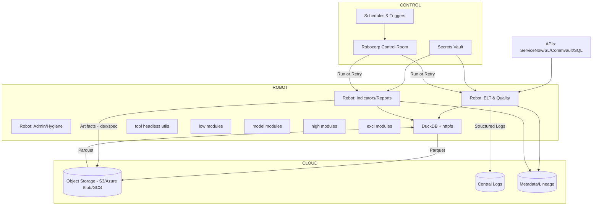
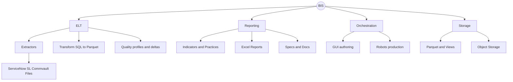

# BIS Architecture, Design, and Cloud Migration Blueprint

> Purpose: This document focuses on the target cloud architecture and the migration blueprint (Robocorp + Cloud Storage + DuckDB). Current-state architecture is documented in README (wiki/readme.md).

## Executive summary

This blueprint describes how to evolve BIS to a headless, cloud-orchestrated runtime using Robocorp Control Room and cloud object storage while retaining DuckDB and Parquet as core data technologies. It covers target architecture, migration phases, design choices, and operational patterns. For the existing (current-state) desktop/OneDrive solution details, see the README.

<!-- Removed (moved to README):
- High-level architecture (current) and sequence
- Domain overview and business goals
- Part I — Current-state architecture deep dive (Data, Application, Infrastructure, Config, Business, Known constraints)
- Module deep-dive (current), Data and storage model (current), Cross-cutting concerns (current)
-->

## Table of Contents
- [Executive summary](#executive-summary)
- [Part II — Target cloud architecture and migration ☁️](#part-ii--target-cloud-architecture-and-migration-)
  - [Proposed target architecture](#proposed-target-architecture)
  - [Key design choices](#key-design-choices)
  - [Migration plan (phased)](#migration-plan-phased)
  - [Detailed technical blueprint](#detailed-technical-blueprint)
    - [Storage adapter contract](#storage-adapter-contract)
    - [DuckDB cloud IO patterns](#duckdb-cloud-io-patterns)
    - [Robocorp robot patterns](#robocorp-robot-patterns)
    - [Data quality patterns](#data-quality-patterns)
    - [Delivery patterns in cloud](#delivery-patterns-in-cloud)
  - [Business/functional specification mapping](#businessfunctional-specification-mapping)
  - [Real-world references and analogous solutions](#real-world-references-and-analogous-solutions)
  - [Suggested improvements (shortlist)](#suggested-improvements-shortlist)
  - [Work plan and responsibilities mapping](#work-plan-and-responsibilities-mapping)
  - [Risks and mitigations](#risks-and-mitigations)
  - [Success metrics](#success-metrics)
  - [Appendix A — Module inventories (from code)](#appendix-a--module-inventories-from-code)
  - [Appendix B — Example run contracts](#appendix-b--example-run-contracts)
  - [Document owner](#document-owner)

[↑ Back to top](#table-of-contents)

---

## Part II — Target cloud architecture and migration (Robocorp + Cloud Storage + DuckDB) ☁️

Objectives:
- Keep DuckDB as the query engine and Parquet-based data products
- Replace local filesystem with cloud object storage (S3/Azure Blob/GCS)
- Orchestrate with Robocorp Control Room; run headless robots
- Decouple GUI; keep optional for local authoring; make all core ops runnable headless
- Manage secrets in Robocorp Vault; emit structured logs and attach artifacts

### Proposed target architecture



[↑ Back to top](#table-of-contents)

### Key design choices
- DuckDB httpfs extension to read/write Parquet directly from cloud object stores
  - S3: s3://… with AWS credentials (or role/IRSA)
  - Azure: abfs(s)://… or https presigned URLs; DuckDB supports Azure via environment and httpfs
  - GCS: gs://… with service account via httpfs
- Artifact strategy
  - Parquet and views remain canonical; Excel reports and docs written to object storage
  - Robocorp attaches key artifacts per run
- Secrets and configs
  - All API keys/connection strings in Robocorp Vault
  - World (TWorld) reads from env/vars injected by robot
- Observability
  - Emit JSON logs; include structured run context (run_id, task_id, workspace)
  - Optionally push lineage to OpenLineage/Marquez
- GUI strategy
  - Keep PySide6 GUI for authoring and exploratory runs; production runs via robots

---

- Further reading:
  - DuckDB httpfs: https://duckdb.org/docs/extensions/httpfs.html
  - AWS S3 access patterns: https://docs.aws.amazon.com/AmazonS3/latest/userguide/using-with-s3-actions.html
  - Azure Blob/ADLS auth: https://learn.microsoft.com/azure/storage/blobs/authorize-access-azure-active-directory
  - GCS auth: https://cloud.google.com/storage/docs/authentication
  - Object store best practices (parquet/partitioning): https://lakefs.io/blog/data-lake-best-practices/

[↑ Back to top](#table-of-contents)

### Migration plan (phased)

1) Headless-first run
- Add CLI entry points to replace GUI paths for common flows:
  - model: connect/process/quality/deploy
  - high: indicator_execute/report/spec/deliver
  - admin: hygiene, registration, backups
- Decouple tool.logger from PySide6: add a GUI-free adapter and structured JSON logging

2) Cloud storage abstraction
- Introduce a storage adapter interface in TWorld (and tool.utils) with implementations:
  - LocalFSAdapter (current behavior)
  - S3Adapter / AzureBlobAdapter / GCSAdapter
- Ensure low.table COPY TO reads/writes through cloud paths
  - Use DuckDB httpfs and credential injection (env vars or config)
- Normalize path scheme usage (e.g., s3://bucket/path, abfss://container@account.dfs.core.windows.net/path)

3) Robocorp robots
- Create Robots:
  - robot-elt: invokes model flows
  - robot-indicator: runs indicator/practice and produces Excel/specs
  - robot-admin: hygiene/backups/registration
- robot.yaml defines tasks, env vars, secret references; attach artifacts and logs

4) Data quality and governance
- Add standardized quality checks (row count deltas, null checks, schema drift) with summary tables
- Optional: integrate Great Expectations for readable validations; publish results as artifacts
- Add dataset metadata/manifest written alongside Parquet (KV metadata, JSON sidecars)

5) Observability & lineage
- Structured JSON logs with run metadata (workspace, job, component)
- Optionally emit OpenLineage events per table/view materialization

6) Delivery and comms in cloud
- Replace Outlook COM with:
  - Robocorp email library, or
  - Cloud-native email (SES, SendGrid, Office 365 Graph API)
- Shareable report links from object storage (presigned URLs, SAS tokens)

7) Security & compliance
- Use Vault for secrets; least privilege policies for storage buckets
- Encrypt data at rest; restrict public access
- Mask sensitive data in logs and Excel exports where needed

8) Optional modernization
- Consider dbt-duckdb for SQL transforms when declarative DAGs are beneficial
- Consider MotherDuck if managed DuckDB fits constraints (optional)

---

[↑ Back to top](#table-of-contents)

## Detailed technical blueprint

### Storage adapter contract
- Inputs
  - Logical path intents (raw, stage, prod, reports)
  - Operation type (read, write, list, delete)
- Outputs
  - Resolved URI suitable for DuckDB or Python IO
- Requirements
  - Must support streaming reads/writes where feasible
  - Expose presigned access for Excel consumers, or rely on access policies

Example conceptual interface:

```text
IStorageAdapter
- resolve(uri_or_logical_path) -> absolute URI
- open_read(uri) -> file-like
- open_write(uri) -> file-like
- list(prefix) -> [objects]
- delete(uri)
- to_duckdb_path(uri) -> string
```

- Further reading:
  - fsspec adapters (s3fs, gcsfs, abfs): https://filesystem-spec.readthedocs.io/
  - smart_open streaming IO: https://github.com/RaRe-Technologies/smart_open
  - Azure Storage SDK (Blobs): https://learn.microsoft.com/azure/storage/blobs/storage-quickstart-blobs-python
  - Boto3 S3 client: https://boto3.amazonaws.com/v1/documentation/api/latest/reference/services/s3.html

[↑ Back to top](#table-of-contents)

### DuckDB cloud IO patterns

- S3 example (httpfs):

```sql
INSTALL httpfs;
LOAD httpfs;
SET s3_region='eu-central-1';
SET s3_access_key_id='${AWS_ACCESS_KEY_ID}';
SET s3_secret_access_key='${AWS_SECRET_ACCESS_KEY}';
COPY tmp_tbl TO 's3://my-bucket/prod/table/date=2025-08-22/part-000.parquet' (FORMAT PARQUET, COMPRESSION ZSTD);
CREATE OR REPLACE VIEW prod.table AS SELECT * FROM read_parquet('s3://my-bucket/prod/table/*.parquet');
```

- Azure example (httpfs):

```sql
INSTALL httpfs; LOAD httpfs;
SET azure_storage_account='myacct';
SET azure_storage_sas='sv=2025-01-01&ss=bfqt&srt=sco&sp=rw...';
COPY tmp_tbl TO 'https://myacct.blob.core.windows.net/container/prod/table/part-000.parquet' (FORMAT PARQUET);
CREATE OR REPLACE VIEW prod.table AS SELECT * FROM read_parquet('https://myacct.blob.core.windows.net/container/prod/table/*.parquet');
```

- GCS example:

```sql
INSTALL httpfs; LOAD httpfs;
SET gcs_bucket='my-bucket';
SET gcs_auth_token='${GCP_OAUTH_TOKEN}';
COPY tmp_tbl TO 'gs://my-bucket/prod/table/part-000.parquet' (FORMAT PARQUET);
CREATE OR REPLACE VIEW prod.table AS SELECT * FROM read_parquet('gs://my-bucket/prod/table/*.parquet');
```

- Further reading:
  - DuckDB S3/HTTP settings: https://duckdb.org/docs/extensions/httpfs/s3.html
  - Parquet writer options: https://duckdb.org/docs/data/parquet#writing-parquet-files
  - View over Parquet patterns: https://duckdb.org/docs/sql/statements/create_view

[↑ Back to top](#table-of-contents)

### Robocorp robot patterns

- robot.yaml (conceptual):

```yaml
tasks:
  ELT:
    shell: python -m engine.src.__main__ --Workspace=workspace --Engine=engine --task elt
  INDICATOR:
    shell: python -m engine.src.__main__ --Workspace=workspace --Engine=engine --task indicator --yml {{vars.job}}
artifacts:
  - path: workspace/**/reports/*.xlsx
  - path: workspace/**/logs/*.jsonl
condaConfigFile: conda.yaml
environmentVariables:
  STORAGE_SCHEME: s3
  STORAGE_BUCKET: my-bucket
vault:
  - name: BIS-Keys
    keys: [aws_access_key_id, aws_secret_access_key, servicenow_user, servicenow_password]
```

- Python robot entry points call into the existing model/high flows; use the new storage adapter and structured logging.

- Further reading:
  - Robocorp tasks and processes: https://robocorp.com/docs/control-room/tasks-and-processes
  - Robocorp Vault: https://robocorp.com/docs/development-guide/variables-and-secrets/vault
  - Conda environment for robots: https://robocorp.com/docs/courses/rpa-developer/conda-yaml
  - Artifacts in Control Room: https://robocorp.com/docs/control-room/artifacts

[↑ Back to top](#table-of-contents)

### Data quality patterns

- Implement minimal checks:
  - schema drift detection vs. last run
  - null rate thresholds
  - row count deltas
  - foreign key existence where applicable
- Persist results in a quality schema and emit summary artifacts (JSON/Markdown)

- Further reading:
  - Great Expectations quickstart: https://docs.greatexpectations.io/docs/guides/quickstart/
  - Soda Core: https://docs.soda.io/soda-core/overview.html
  - DuckDB constraints and checks (SQL-side): https://duckdb.org/docs/sql/statements/create_table#constraints

[↑ Back to top](#table-of-contents)

### Delivery patterns in cloud

- Write reports to object storage under a path: reports/{workspace}/{job}/{yyyymmdd}/report.xlsx
- Deliver via email using Robocorp libraries or Graph API; include presigned link

- Further reading:
  - Microsoft Graph sendMail: https://learn.microsoft.com/graph/api/user-sendmail
  - AWS SES: https://docs.aws.amazon.com/ses/latest/dg/send-email.html
  - SendGrid API: https://docs.sendgrid.com/api-reference/
  - Presigned URLs (S3): https://docs.aws.amazon.com/AmazonS3/latest/userguide/ShareObjectPreSignedURL.html
  - Azure SAS tokens: https://learn.microsoft.com/azure/storage/common/storage-sas-overview

[↑ Back to top](#table-of-contents)

## Business/functional specification mapping



- Core use cases:
  - Rapidly author a KPI (SQL + components), produce Excel/spec
  - Run ELT to refresh curated datasets
  - Execute practices/pipelines
  - Explore lake, preview/export, hygiene

[↑ Back to top](#table-of-contents)

## Real-world references and analogous solutions

- DuckDB with cloud object storage
  - DuckDB httpfs docs: https://duckdb.org/docs/extensions/httpfs.html
  - Parquet best practices: columnar, partitioning by date/id
  - MotherDuck (managed DuckDB) for team collaboration: https://motherduck.com (optional)
- Data lake architecture
  - Medallion (Bronze/Silver/Gold) pattern for curation: https://docs.databricks.com/en/lakehouse/medallion.html
  - LakeFS for lake versioning: https://lakefs.io (optional)
- Transformation engines
  - dbt-duckdb for SQL DAGs: https://docs.getdbt.com/reference/warehouse-setups/duckdb
- Orchestration
  - Robocorp Control Room runbooks: https://robocorp.com/docs/control-room
  - Alternatives for context: Prefect, Airflow, Dagster
- Data quality and lineage
  - Great Expectations: https://greatexpectations.io
  - OpenLineage / Marquez: https://openlineage.io
- Delivery
  - Microsoft Graph for email: https://learn.microsoft.com/graph/api/resources/mail-api-overview

How others solve similar problems:
- “ELT-on-lake” with Parquet + DuckDB or Spark for curation; dbt for transforms; object store as system of record; pipeline orchestrator handles retries and observability.
- Report generation as headless jobs writing to storage and distributed via links/emails with signed access; artifacts attached to pipeline run metadata.

[↑ Back to top](#table-of-contents)

## Suggested improvements (shortlist)

- Headless-first architecture
  - Add CLI/SDK façades for all GUI operations; keep GUI as thin client
- Storage abstraction
  - Introduce storage adapters and eliminate filesystem assumptions in low/model
- Observability
  - Structured logs; correlation IDs; per-component timings; attach to runs
- Quality and metadata
  - Standardized quality checks; dataset manifests; optional Great Expectations
- Delivery decoupling
  - Replace Outlook COM with cloud mail or Robocorp email; use links to artifacts
- Security
  - Secrets in Vault; scoped roles to object store; redact logs
- Performance
  - Partition Parquet by date/workspace; enable ZSTD; avoid large single files; parallelize sheet generation where safe
- Extensibility
  - Pluggable extractors; dbt integration; optional OpenLineage emitter

[↑ Back to top](#table-of-contents)

## Work plan and responsibilities mapping

- tool
  - Add LoggerJSON and headless Worker adapter
  - Add utils.storage with adapter interface and cloud impls
- low
  - Route COPY/READ via storage URIs; metadata sidecars
- model
  - Inject storage adapter via TWorld; CLI entry points for process_* verbs
  - Quality summary tables
- high
  - CLI for indicator/practice/report/spec/deliver
  - Delivery adapter for cloud email/links
- excl
  - Parallel sheet writes (optional); artifact-friendly outputs
- gui
  - Remains optional; consumes structured logs locally
- exts
  - Move credentials to Vault; add retry/backoff; rate-limiters

[↑ Back to top](#table-of-contents)

## Risks and mitigations

- DuckDB and object store consistency
  - Mitigation: write-temp + atomic rename patterns; partitioning; idempotency
- Credential sprawl
  - Mitigation: Robocorp Vault; short-lived tokens where possible
- Large Excel files
  - Mitigation: limit sheets/rows; provide CSV/Parquet alternatives; archive old artifacts
- API rate limits
  - Mitigation: backoff with jitter; incremental sync windows

[↑ Back to top](#table-of-contents)

## Success metrics

- 100% of production runs headless under Robocorp with artifacts captured
- 0 local-only storage dependencies in core flows
- p95 end-to-end run time stable or improved
- Quality checks reported for 100% curated tables
- Zero secrets on disk; all in Vault

[↑ Back to top](#table-of-contents)

## Appendix A — Module inventories (from code)

- low: table.py, symptom.py, action.py, snapshot.py, trend.py, component.py, styler.py
- model: data_model.py, data_table.py, world.py, pipeline.py, scheduler.py
- high: indicator.py, practice.py, workspace.py, utils/spec_builder.py, utils/report_metadata.py, utils/report_delivery.py
- excl: excel_report.py, excel_sheet.py, excel_table.py, excel_header.py, excel_chart.py, excel_caption.py, excel_widget.py, excel_summary.py, excel_format.py, excel_logo.py, excel_column.py
- gui: gui_main.py, gui_loader.py, gui_elt.py, gui_admin.py, gui_indicator.py, gui_practice.py, gui_pipeline.py, gui_datalake.py, gui_sql.py, gui_snow.py, gui_search.py, gui_test.py
- tool: logger.py, utils.py
- exts: snow/readme.md (ServiceNow driver description), commvault/readme.md (placeholder)

[↑ Back to top](#table-of-contents)

## Appendix B — Example run contracts

- ELT
  - Inputs: workspace, env, schemas/tables config, secrets
  - Outputs: curated Parquet, DuckDB views, quality summary, logs
  - Error modes: schema drift, API/network, storage write failures
- Indicator
  - Inputs: job config, world, components
  - Outputs: Excel report, spec/docs, logs
  - Error modes: missing view/table, insufficient data, write failures

[↑ Back to top](#table-of-contents)

## Document owner

Document owner: autogenerated consolidation based on engine/src READMEs and architecture synthesis. Update as implementation evolves.

[↑ Back to top](#table-of-contents)


