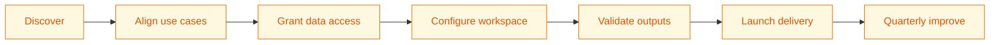
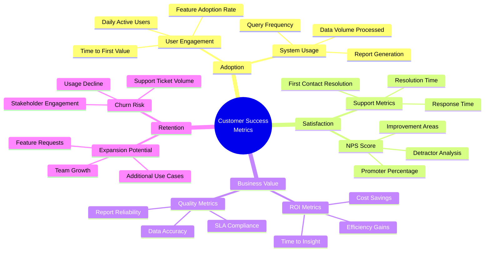
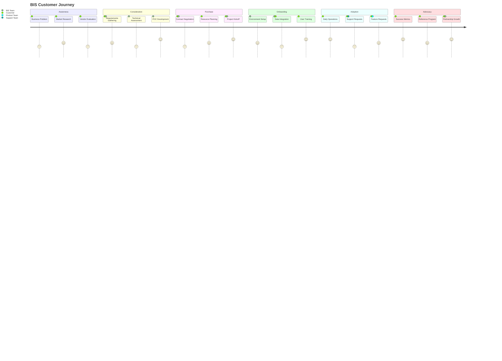
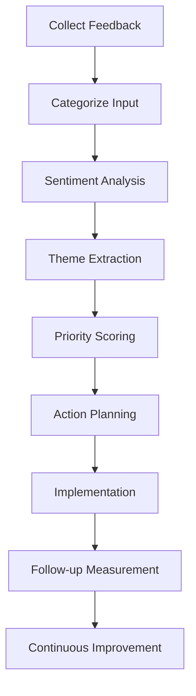
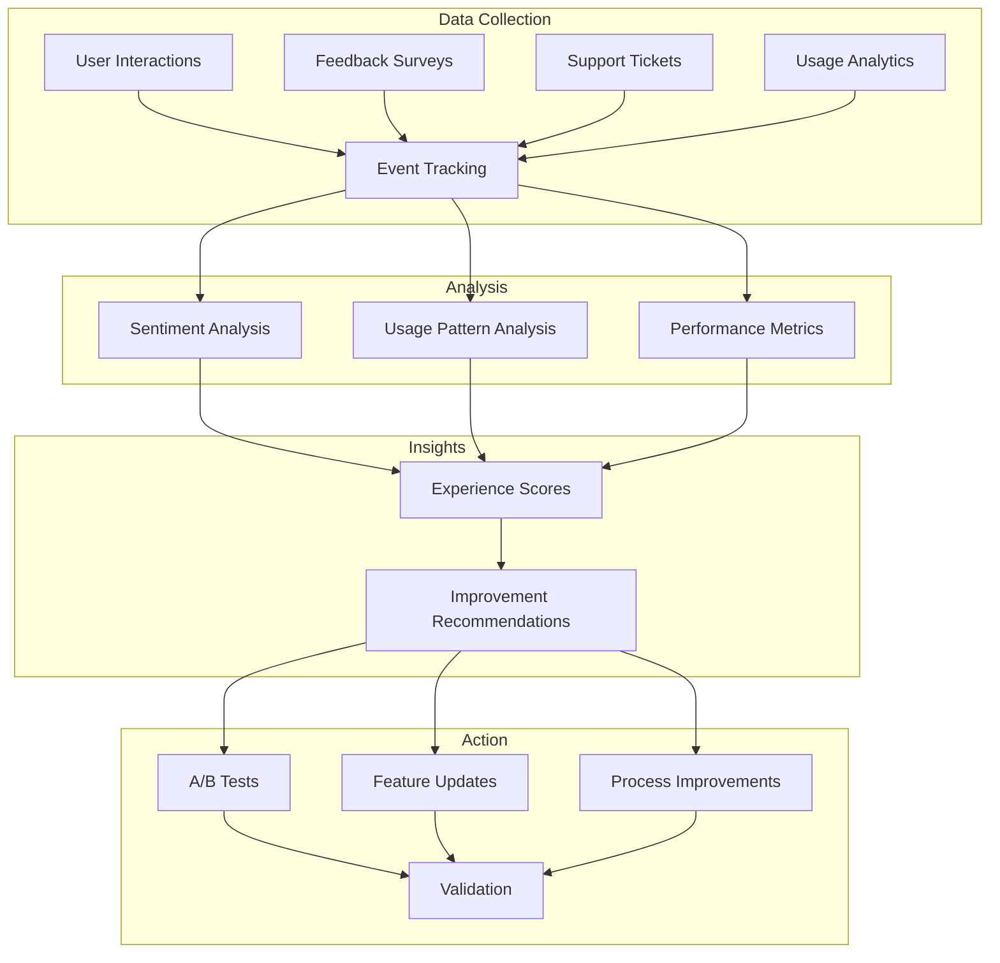
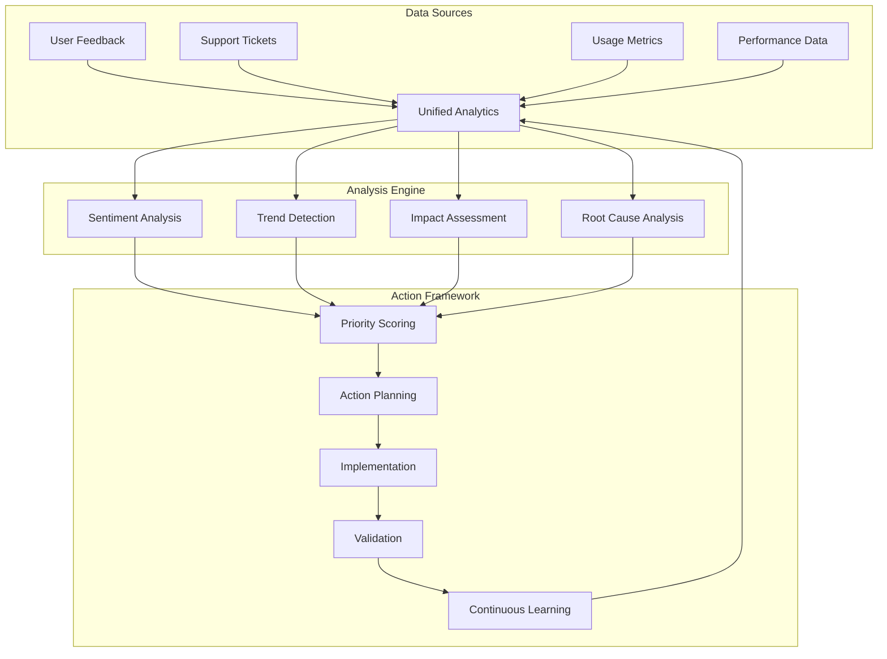

# Customer Experience

> **BIS Handbook 2.0** — Customer-Centric Approach and Lifecycle Management  
> **Last Updated:** September 13, 2025  
> **Navigation:** [🏠 Main Handbook](../README.md) | [Previous: Purpose and Value](01-Purpose-and-Value.md) | [Next: Business Architecture](03-Business-Architecture.md)

---

## Section Overview

**Overview:** Comprehensive guide to customer onboarding, support models, and success strategies. Covers the entire customer lifecycle from initial engagement to ongoing support.

**Target Audience:** Business teams, account managers, customer success managers, and anyone involved in customer interactions.

**How to Use:** Reference during customer onboarding, support planning, and success measurement. Use checklists and templates for consistent customer experiences.

**Key Content:** Customer onboarding processes, support and escalation procedures, success metrics, customer feedback integration, relationship management.

**Use Cases:** New customer setup, support process design, customer success planning, feedback analysis, relationship building.

---

## Table of Contents

- [Customer Onboarding](#customer-onboarding)
- [Customer Support](#customer-support)
- [Customer Success Plans](#customer-success-plans)
- [Go-to-Market Strategy](#go-to-market-strategy)
- [Navigation](#navigation)

---

## Customer Onboarding

BIS onboarding ensures smooth adoption through structured processes and clear guidance.

### Journey Map



### Detailed Customer Journey Workflow

```mermaid
flowchart TD
    subgraph "Awareness Phase"
        AWARENESS[Initial Awareness] --> DISCOVERY[Product Discovery]
        DISCOVERY --> INTEREST[Interest Generation]
        INTEREST --> EVALUATION[Requirements Evaluation]
    end
    
    subgraph "Consideration Phase"
        EVALUATION --> DEMO[Technical Demo]
        DEMO --> POC[Proof of Concept]
        POC --> ASSESSMENT[Technical Assessment]
        ASSESSMENT --> APPROVAL[Stakeholder Approval]
    end
    
    subgraph "Purchase Phase"
        APPROVAL --> CONTRACT[Contract Negotiation]
        CONTRACT --> LEGAL[Legal Review]
        LEGAL --> PROCUREMENT[Procurement Process]
        PROCUREMENT --> SIGNING[Contract Signing]
    end
    
    subgraph "Onboarding Phase"
        SIGNING --> SETUP[Technical Setup]
        SETUP --> TRAINING[User Training]
        TRAINING --> CONFIGURATION[Workspace Configuration]
        CONFIGURATION --> TESTING[Validation Testing]
        TESTING --> DEPLOYMENT[Go-Live Deployment]
    end
    
    subgraph "Adoption Phase"
        DEPLOYMENT --> MONITORING[Usage Monitoring]
        MONITORING --> SUPPORT[Ongoing Support]
        SUPPORT --> OPTIMIZATION[Process Optimization]
        OPTIMIZATION --> EXPANSION[Feature Expansion]
    end
    
    subgraph "Advocacy Phase"
        EXPANSION --> SUCCESS[Success Measurement]
        SUCCESS --> ADVOCACY[Customer Advocacy]
        ADVOCACY --> REFERENCES[Case Studies & References]
        REFERENCES --> EXPANSION
    end
    
    classDef awareness fill:#e3f2fd,stroke:#1976d2
    classDef consideration fill:#fff3e0,stroke:#ef6c00
    classDef purchase fill:#e8f5e8,stroke:#2e7d32
    classDef onboarding fill:#f3e5f5,stroke:#7b1fa2
    classDef adoption fill:#fce4ec,stroke:#c62828
    classDef advocacy fill:#e1f5fe,stroke:#0277bd
    
    class AWARENESS,DISCOVERY,INTEREST,EVALUATION awareness
    class DEMO,POC,ASSESSMENT,APPROVAL consideration
    class CONTRACT,LEGAL,PROCUREMENT,SIGNING purchase
    class SETUP,TRAINING,CONFIGURATION,TESTING,DEPLOYMENT onboarding
    class MONITORING,SUPPORT,OPTIMIZATION,EXPANSION adoption
    class SUCCESS,ADVOCACY,REFERENCES advocacy
```



### Support Process Flow

```mermaid
flowchart TD
    subgraph "Issue Detection"
        USER_REPORT[User Reports Issue] --> TICKET_CREATION[Ticket Creation]
        MONITORING[Automated Monitoring] --> ALERT_GENERATION[Alert Generation]
        ALERT_GENERATION --> TICKET_CREATION
    end
    
    subgraph "Initial Assessment"
        TICKET_CREATION --> TRIAGE[Triage & Classification]
        TRIAGE --> PRIORITY_ASSIGNMENT[Priority Assignment]
        PRIORITY_ASSIGNMENT --> ASSIGNMENT[Support Assignment]
    end
    
    subgraph "Investigation Phase"
        ASSIGNMENT --> DIAGNOSIS[Problem Diagnosis]
        DIAGNOSIS --> ROOT_CAUSE[Root Cause Analysis]
        ROOT_CAUSE --> SOLUTION_IDENTIFICATION[Solution Identification]
    end
    
    subgraph "Resolution Phase"
        SOLUTION_IDENTIFICATION --> WORKAROUND[Workaround Implementation]
        WORKAROUND --> PERMANENT_FIX[Permanent Fix Development]
        PERMANENT_FIX --> TESTING[Solution Testing]
        TESTING --> DEPLOYMENT[Fix Deployment]
    end
    
    subgraph "Closure Phase"
        DEPLOYMENT --> VALIDATION[Resolution Validation]
        VALIDATION --> DOCUMENTATION[Knowledge Base Update]
        DOCUMENTATION --> CUSTOMER_CONFIRMATION[Customer Confirmation]
        CUSTOMER_CONFIRMATION --> TICKET_CLOSURE[Ticket Closure]
    end
    
    subgraph "Follow-up"
        TICKET_CLOSURE --> SATISFACTION_SURVEY[Satisfaction Survey]
        SATISFACTION_SURVEY --> FEEDBACK_ANALYSIS[Feedback Analysis]
        FEEDBACK_ANALYSIS --> PROCESS_IMPROVEMENT[Process Improvement]
    end
    
    classDef detection fill:#ffebee,stroke:#c62828
    classDef assessment fill:#fff3e0,stroke:#ef6c00
    classDef investigation fill:#e3f2fd,stroke:#1976d2
    classDef resolution fill:#e8f5e8,stroke:#2e7d32
    classDef closure fill:#f3e5f5,stroke:#7b1fa2
    classDef followup fill:#fce4ec,stroke:#c62828
    
    class USER_REPORT,MONITORING,ALERT_GENERATION,TICKET_CREATION detection
    class TRIAGE,PRIORITY_ASSIGNMENT,ASSIGNMENT assessment
    class DIAGNOSIS,ROOT_CAUSE,SOLUTION_IDENTIFICATION investigation
    class WORKAROUND,PERMANENT_FIX,TESTING,DEPLOYMENT resolution
    class VALIDATION,DOCUMENTATION,CUSTOMER_CONFIRMATION,TICKET_CLOSURE closure
    class SATISFACTION_SURVEY,FEEDBACK_ANALYSIS,PROCESS_IMPROVEMENT followup
```



### Customer Success Metrics Dashboard



### Customer Success KPI Framework

| **KPI Category** | **Primary Metric** | **Target** | **Measurement** | **Frequency** | **Owner** |
|-----------------|-------------------|------------|----------------|--------------|-----------|
| **Adoption** | Time to First Value | < 30 days | Days from access to first successful report | Monthly | Customer Success |
| **Engagement** | Monthly Active Users | > 80% of licensed users | Unique users running reports/queries | Monthly | Analytics Team |
| **Satisfaction** | Net Promoter Score | > 7.0 | Likelihood to recommend (0-10 scale) | Quarterly | Customer Success |
| **Efficiency** | Query Response Time | < 5 seconds | Average time for query execution | Daily | Engineering |
| **Quality** | Data Accuracy Rate | > 99% | Percentage of accurate data outputs | Weekly | Data Team |
| **Support** | First Contact Resolution | > 70% | Issues resolved without escalation | Weekly | Support Team |

#### Customer Health Score Components

| **Health Dimension** | **Weight** | **Metrics** | **Scoring Method** | **Red Flag Threshold** |
|---------------------|------------|-------------|-------------------|----------------------|
| **Product Usage** | 30% | Active users, feature adoption, login frequency | Usage rate vs. baseline | < 50% of expected |
| **Business Value** | 25% | ROI achieved, efficiency gains, stakeholder satisfaction | Value realization score | < 60% target achievement |
| **Support Interaction** | 20% | Ticket volume, resolution time, escalation rate | Support efficiency score | > 2 tickets per user/month |
| **Relationship Strength** | 15% | Meeting frequency, feedback quality, advocacy | Relationship health score | < 1 meeting per quarter |
| **Expansion Potential** | 10% | Feature requests, additional use cases, team growth | Expansion readiness score | No new requirements |

#### Customer Journey Stage Metrics

| **Journey Stage** | **Key Metrics** | **Success Indicators** | **Risk Indicators** | **Intervention Strategy** |
|------------------|----------------|----------------------|-------------------|-------------------------|
| **Onboarding** | Time to first value, setup completion rate | < 30 days to value, 100% setup success | > 45 days to value, technical blockers | Dedicated onboarding specialist |
| **Adoption** | Feature usage, user engagement | > 70% feature adoption, daily active users | Low engagement, feature abandonment | Usage coaching, feature training |
| **Optimization** | Advanced features, custom development | Complex queries, automated workflows | Stagnant usage, basic features only | Advanced training, solution consulting |
| **Expansion** | Additional use cases, team growth | New departments, increased license usage | No growth, contract limits reached | Account planning, value demonstration |
| **Advocacy** | NPS, referrals, case studies | High NPS, customer references | Neutral/negative feedback | Relationship building, success storytelling |

### Onboarding Success Framework

| **Phase** | **Duration** | **Key Activities** | **Success Criteria** | **Risk Mitigation** |
|-----------|--------------|-------------------|---------------------|-------------------|
| **Discovery** | 1-2 weeks | Requirements gathering, stakeholder identification | Clear use cases defined | Regular check-ins, detailed documentation |
| **Setup** | 2-4 weeks | Environment provisioning, data integration | Technical environment ready | Parallel workstreams, expert consultation |
| **Configuration** | 3-6 weeks | Workspace setup, indicator development | First reports generated | Template reuse, phased approach |
| **Validation** | 2-4 weeks | Testing, user acceptance, training | Stakeholder approval received | Comprehensive testing, feedback loops |
| **Go-Live** | 1-2 weeks | Production deployment, monitoring | Successful first delivery | Rollback procedures, support readiness |
| **Optimization** | Ongoing | Performance tuning, feature expansion | Continuous improvement | Regular reviews, success metrics tracking |

### Detailed Onboarding Steps

1. **🔑 Data access agreements** and sample files reviewed
2. **🧩 Owners and scoring weights** documented for autoranking
3. **🧪 Validation** with redacted real data; acceptance per practice
4. **📨 First delivery** to pilot owners; confirm experience and cadence

### Technical Setup Steps

**Account Creation:**
1. Request account creation from system administrator
2. Get added to appropriate GIAM group (e.g., WIN_OPS_PL_LOC_IMG)
3. Use RDP to connect to BIS Server (10.17.80.23)

**BIS & DBeaver Configuration:**
1. Run BIS via script: `E:\run BIS.bat`
2. Select RAC (Report as Code) → Click START
3. Switch to DataLake tab → Create personal DB connection
4. This generates: `E:\Users\{username}\Documents\{tenant}.duckdb`

**DBeaver Setup:**
1. Install DBeaver Community Edition
2. Add DuckDB JDBC driver from DuckDB website
3. Connect to personal `.duckdb` file
4. Set bootstrap with: `SET file_search_path TO 'E:\data\BIS\workspace\{tenant}\data'`

### Data Storage Locations
- **E:\master**: Output data in Parquet format
- **E:\prod**: Incoming data in Parquet format
- **E:\raw**: Human-readable input data
- **E:\spec**: Jobs and specs by workspace

### Query Development
1. Open DBeaver and connect to personal DB
2. Refresh connection if no data visible
3. Execute SQL against registered Parquet views
4. Export results for analysis as needed

### Additional Setup
- **Owners and Weights**: Define stakeholders, assign owners to actions, set priority weights in CSV for autoranking
- **Training**: Conduct sessions on GUI usage, YAML authoring, troubleshooting
- **Support**: Establish email or chat channels for ongoing questions

### Benefits of Structured Onboarding
- Smooth adoption with clear guidance, reducing trial-and-error
- Reduced setup time through pre-configured templates and examples
- Early value realization by focusing on high-impact indicators first
- Building trust through validated outputs and responsive support

### Post-Onboarding Monitoring
- Track usage metrics and feedback for continuous improvement
- Schedule follow-up reviews to address challenges and expand capabilities

---

## Customer Support

Ongoing support ensures BIS delivers continuous value and addresses evolving needs.

### Account Creation and Access
- Request account creation from system administrator
- Get added to appropriate access group
- Connect via RDP to designated server
- Use secure file transfer methods for data exchange

### Supporting Existing Customers
- **Reports Already Built**: SLA reports, XLA summaries, action queues
- **Quality and Service Continuity**: Regular audits, updates, backups
- **Contact**: Email support, Teams channels, scheduled reviews
- **Focus**: Continuity and improvements

### Support Model Comparison

| **Support Model** | **Response Time** | **Resolution Approach** | **Best For** | **Resource Requirements** | **BIS Recommendation** |
|------------------|------------------|-----------------------|-------------|-------------------------|----------------------|
| **Dedicated CSM** | < 4 hours | Proactive + reactive | Strategic accounts | High (1:1 ratio) | 🟢 For key customers |
| **Shared Support** | < 24 hours | Reactive-focused | Standard customers | Medium (1:10-20 ratio) | 🟢 Current approach |
| **Self-Service** | 24-72 hours | Knowledge base | Technical users | Low (1:50+ ratio) | 🟡 Supplemental |
| **Community-Driven** | Variable | Peer support | Developer community | Low (facilitated) | 🟡 Future consideration |
| **AI-Assisted** | < 1 hour | Automated + human | All customers | Medium (AI tools) | 🟢 Recommended enhancement |

#### Customer Escalation Matrix

| **Escalation Level** | **Trigger Criteria** | **Response Time** | **Involved Parties** | **Resolution Authority** |
|---------------------|---------------------|------------------|-------------------|-------------------------|
| **L1 - Standard** | General questions, basic issues | < 24 hours | Support engineer | Issue resolution, workaround |
| **L2 - Technical** | Complex technical issues, system errors | < 8 hours | Senior engineer, product team | Root cause analysis, code fixes |
| **L3 - Executive** | Business-critical impact, contract issues | < 4 hours | Engineering lead, account executive | Strategic decisions, contract adjustments |
| **L4 - Crisis** | System down, data loss, security breach | < 1 hour | Full leadership team | Emergency response, crisis management |

#### Support Channel Effectiveness

| **Channel** | **Response Speed** | **Resolution Rate** | **Customer Satisfaction** | **Cost Efficiency** | **Use Case** |
|-------------|-------------------|-------------------|-------------------------|-------------------|-------------|
| **Email** | Medium (4-24 hours) | High (80%) | Medium | High | Complex issues, documentation |
| **Chat/Teams** | Fast (< 1 hour) | Medium (60%) | High | Medium | Quick questions, urgent issues |
| **Phone** | Immediate | High (85%) | Very High | Low | Critical issues, complex discussions |
| **Ticketing System** | Variable | High (90%) | Medium | High | Structured support, tracking |
| **Knowledge Base** | Self-service | N/A | High | Very High | Common questions, self-help |

---

## Customer Success Plans

Structured success planning with measurable outcomes and regular reviews.

### Success Plan Template
- **Baseline (now)** → **Target (date)** → **KPI/XLA** → **Owner** → **Evidence** → **Review cadence**
- **Example**: "Reduce reopen rate by 15% by Q4; owner: Ops Lead; evidence: monthly XLAs"

### SMART Commitments
Success plans include SMART commitments with baseline vs. improved state and ROI framing, reviewed quarterly.

---

## Go-to-Market Strategy

Strategic approach to acquiring and expanding BIS adoption.

### Talking with New Customers
Process for new practices:

1. **Discovery**: Understand business problems, data sources, stakeholders
2. **Proposal**: Define indicators, reports, delivery methods
3. **Demo**: Show sample reports and AI capabilities
4. **Onboarding**: Set up workspace, train users
5. **Go-Live**: Deploy and monitor

New practices involve co-creation with customers for tailored solutions.

### Delivery UX
- **Primary Delivery**: Excel with targeted sheets per owner, including SLAs, symptoms, and actions
- **Dashboards**: Optional and secondary

---

## Navigation

**[🏠 Main Handbook](../README.md)** | **[Previous: Purpose and Value](01-Purpose-and-Value.md)** | **[Next: Business Architecture](03-Business-Architecture.md)**

### Quick Links
- [📋 Complete Table of Contents](../README.md#table-of-contents)
- [🎯 Executive Summary](../README.md#executive-summary)
- [🔗 Key Resources](../README.md#key-resources)
- [📚 All Handbook Sections](../README.md#handbook-sections)

### Related Handbook Sections
- [📊 Business Architecture](03-Business-Architecture.md) — Business strategy and stakeholder management
- [⚙️ Configuration](05-Configuration.md) — Workspace setup and technical onboarding
- [🔧 Operating Model](10-Operating-Model.md) — Service delivery and support processes
- [📈 Product Development](11-Product-Development.md) — Implementation stages and delivery

---

## Customer Journey Mapping and Experience Design

### Comprehensive Customer Journey Framework

#### Journey Stage Analysis
BIS customer journeys span from initial awareness through long-term value realization:

**Awareness Stage**:
- **Touchpoints**: Marketing materials, peer references, executive briefings
- **Customer Needs**: Business problem identification, ROI understanding, risk assessment
- **BIS Value Proposition**: Data-driven insights, automated reporting, operational efficiency
- **Success Metrics**: Lead generation, initial engagement, stakeholder alignment

**Consideration Stage**:
- **Touchpoints**: Technical demos, proof-of-concept, stakeholder workshops
- **Customer Needs**: Technical feasibility, integration requirements, resource planning
- **BIS Capabilities**: YAML configuration, DuckDB processing, Excel delivery
- **Success Metrics**: Requirements validation, technical approval, budget allocation

**Purchase Stage**:
- **Touchpoints**: Contract negotiation, legal review, procurement processes
- **Customer Needs**: SLA definition, implementation timeline, success criteria
- **BIS Deliverables**: Workspace setup, data integration, training programs
- **Success Metrics**: Contract execution, resource allocation, project initiation

**Onboarding Stage**:
- **Touchpoints**: Technical setup, data integration, user training
- **Customer Needs**: Quick time-to-value, minimal disruption, clear success path
- **BIS Support**: Guided configuration, validation testing, go-live assistance
- **Success Metrics**: System deployment, user adoption, initial value delivery

**Adoption Stage**:
- **Touchpoints**: Daily usage, support interactions, feature expansion
- **Customer Needs**: Reliable operation, continuous improvement, expanding use cases
- **BIS Evolution**: New indicators, process optimization, advanced analytics
- **Success Metrics**: Usage growth, satisfaction scores, business impact

**Advocacy Stage**:
- **Touchpoints**: Success stories, reference programs, partnership expansion
- **Customer Needs**: Recognition, continued value, strategic alignment
- **BIS Partnership**: Co-innovation, best practice sharing, ecosystem expansion
- **Success Metrics**: Referenceability, expansion opportunities, strategic partnership

### Customer Experience Mapping Techniques

#### Experience Flow Diagrams


#### Touchpoint Analysis Matrix

| Touchpoint | Frequency | Customer Effort | BIS Effort | Satisfaction Impact | Improvement Priority |
|------------|-----------|-----------------|------------|-------------------|-------------------|
| **Initial Demo** | One-time | Low | High | High | Critical |
| **Onboarding Training** | One-time | Medium | High | High | Critical |
| **Daily Report Delivery** | Daily | Low | Low | Medium | High |
| **Support Requests** | As-needed | Medium | Medium | High | High |
| **Quarterly Reviews** | Quarterly | Low | Medium | High | Medium |
| **Feature Requests** | Ongoing | Low | Medium | Medium | Medium |

### Feedback Collection and Analysis Framework

#### Multi-Channel Feedback Systems

##### Structured Feedback Collection
- **Post-Implementation Surveys**: Comprehensive assessment of onboarding experience
- **Usage Analytics**: Automated tracking of system adoption and feature utilization
- **Support Interaction Analysis**: Quality and resolution time metrics from support tickets
- **Stakeholder Interviews**: Qualitative feedback from key decision-makers and end-users
- **Net Promoter Score (NPS) Tracking**: Regular measurement of customer loyalty and satisfaction

##### Real-Time Feedback Mechanisms
```yaml
feedback_channels:
  in_app_feedback:
    triggers:
      - after_report_delivery
      - after_support_resolution
      - after_feature_usage
    questions:
      - satisfaction_rating: "How satisfied are you with this feature?"
      - ease_of_use: "How easy was this to use?"
      - meets_needs: "Does this meet your needs?"
      - improvement_suggestions: "What could be improved?"
  email_surveys:
    cadence: quarterly
    distribution: automated
    response_tracking: unique_links
  user_interviews:
    frequency: monthly
    methodology: structured_interviews
    participant_selection: stratified_sampling
```

#### Feedback Analysis and Action Framework

##### Sentiment Analysis Pipeline


##### Action Planning Matrix

| Feedback Category | Example Issues | Response Time | Action Type | Success Metrics |
|------------------|----------------|---------------|-------------|-----------------|
| **Usability Issues** | Complex configuration, unclear documentation | 24 hours | UI/UX improvements | Task completion rates |
| **Performance Problems** | Slow report generation, system delays | 4 hours | Performance optimization | Response time improvements |
| **Feature Requests** | New indicators, enhanced visualizations | 1 week | Product roadmap updates | Feature adoption rates |
| **Integration Issues** | Data source problems, API failures | 2 hours | Technical fixes | System uptime |
| **Training Needs** | Onboarding improvements, skill gaps | 48 hours | Training enhancements | User proficiency scores |

### Customer Success Management Framework

#### Success Planning Methodology

##### Customer Success Roadmap Template
```yaml
customer_success_plan:
  customer_profile:
    name: "ACME Corporation"
    industry: "Manufacturing"
    size: "Enterprise"
    initial_use_case: "IT Service Management"
  
  success_metrics:
    adoption_metrics:
      - daily_active_users: { baseline: 0, target: 50, timeframe: "3 months" }
      - report_utilization: { baseline: 0, target: 85, timeframe: "6 months" }
    business_impact:
      - xla_improvement: { baseline: "Current", target: "15% improvement", timeframe: "6 months" }
      - process_efficiency: { baseline: "Current", target: "20% reduction", timeframe: "12 months" }
  
  success_milestones:
    month_1: "Complete onboarding and deliver first reports"
    month_3: "Achieve 80% user adoption and positive feedback"
    month_6: "Demonstrate measurable business impact"
    month_12: "Expand to additional use cases and departments"
  
  risk_mitigation:
    technical_risks:
      - data_integration_issues: "Proactive data validation and testing"
      - performance_concerns: "Infrastructure monitoring and optimization"
    adoption_risks:
      - user_resistance: "Comprehensive training and change management"
      - stakeholder_alignment: "Regular executive check-ins and progress reports"
  
  support_plan:
    technical_support: "24/7 access to support team"
    business_consulting: "Quarterly strategic reviews"
    training_resources: "On-demand training modules and documentation"
```

#### Health Score Framework

##### Customer Health Dimensions
- **Product Usage**: Feature adoption, login frequency, report generation volume
- **Support Interaction**: Ticket volume, resolution time, satisfaction ratings
- **Business Value**: XLA improvements, process efficiency gains, ROI metrics
- **Relationship Strength**: Stakeholder engagement, strategic alignment, expansion potential

##### Health Score Calculation
```python
def calculate_customer_health_score(customer_data):
    """
    Calculate overall customer health score (0-100)
    """
    weights = {
        'usage': 0.3,
        'support': 0.2,
        'value': 0.3,
        'relationship': 0.2
    }
    
    scores = {
        'usage': calculate_usage_score(customer_data),
        'support': calculate_support_score(customer_data),
        'value': calculate_value_score(customer_data),
        'relationship': calculate_relationship_score(customer_data)
    }
    
    health_score = sum(weights[metric] * scores[metric] for metric in weights)
    return health_score
```

### Experience Optimization Strategies

#### Personalization Framework

##### User Profile Management
- **Role-Based Experiences**: Tailored interfaces for analysts, managers, executives
- **Preference Learning**: Adaptive report formatting and delivery preferences
- **Contextual Assistance**: Intelligent suggestions based on usage patterns
- **Progressive Disclosure**: Feature exposure based on user proficiency

##### Adaptive User Interfaces
```yaml
adaptive_ui_config:
  user_segments:
    novice:
      features: ["guided_tours", "simplified_views", "extensive_help"]
      complexity: low
    intermediate:
      features: ["advanced_filters", "custom_dashboards", "bulk_operations"]
      complexity: medium
    expert:
      features: ["api_access", "custom_queries", "automation_tools"]
      complexity: high
  
  personalization_rules:
    - condition: "login_frequency > 20"
      action: "enable_advanced_features"
    - condition: "support_tickets < 2"
      action: "reduce_help_visibility"
    - condition: "report_customization > 5"
      action: "enable_expert_mode"
```

#### Continuous Experience Improvement

##### A/B Testing Framework
- **Feature Testing**: Alternative implementations comparison
- **UI Variations**: Interface design optimization
- **Content Testing**: Documentation and training material effectiveness
- **Process Testing**: Workflow efficiency improvements

##### Experience Metrics Dashboard


### Customer Advocacy and Expansion Framework

#### Reference Program Management
- **Success Story Development**: Comprehensive case studies and ROI documentation
- **Reference Architecture**: Reusable patterns for similar implementations
- **Peer Networking**: Customer community building and knowledge sharing
- **Marketing Collateral**: Customer testimonials and co-branded materials

#### Expansion Opportunity Identification
- **Usage Analytics**: Feature utilization patterns and capability gaps
- **Stakeholder Mapping**: Additional departments and use cases
- **Business Value Assessment**: Potential ROI from expanded adoption
- **Change Management**: Organizational readiness and adoption planning

This comprehensive customer experience framework ensures BIS delivers exceptional value throughout the entire customer lifecycle, from initial engagement through long-term partnership and advocacy.

---

## Practical Templates and Checklists

### Customer Journey Mapping Template

#### Journey Stage Assessment Framework

```markdown
# Customer Journey Mapping Template

## Customer Profile
- **Company**: [Company Name]
- **Industry**: [Industry Sector]
- **Size**: [Employee Count/Revenue Range]
- **Primary Use Case**: [Main BIS Application]
- **Key Stakeholders**: [List key decision-makers and influencers]

## Current Journey Stage Assessment

### Awareness Stage (1-2 weeks)
- [ ] Business problem clearly identified
- [ ] BIS value proposition understood
- [ ] Initial stakeholder alignment achieved
- [ ] Budget and resources identified

**Completion Score**: ___/10
**Blockers**: [List any issues preventing progress]

### Consideration Stage (2-4 weeks)
- [ ] Technical requirements documented
- [ ] Data sources identified and validated
- [ ] Proof-of-concept planned
- [ ] ROI expectations defined

**Technical Readiness**: ___/10
**Risk Assessment**: [High/Medium/Low]

### Purchase Stage (1-3 weeks)
- [ ] Contract terms agreed
- [ ] Implementation timeline set
- [ ] Resource allocation confirmed
- [ ] Success criteria defined

**Deal Status**: [Prospect/Committed/Closed]
**Go-Live Date**: [Target Date]

### Onboarding Stage (2-6 weeks)
- [ ] Technical environment ready
- [ ] Data integration completed
- [ ] User training conducted
- [ ] First reports delivered

**Time to First Value**: [Actual Days]
**User Adoption Rate**: [Percentage]

### Adoption Stage (Ongoing)
- [ ] Daily usage established
- [ ] Support processes optimized
- [ ] Feature expansion planned
- [ ] Business impact measured

**Monthly Active Users**: [Count/Percentage]
**Satisfaction Score**: [NPS/Scale]

### Advocacy Stage (6+ months)
- [ ] Success stories documented
- [ ] Reference program participation
- [ ] Expansion opportunities identified
- [ ] Strategic partnership developed

**Advocacy Level**: [Satisfied/Advocate/Champion/Partner]
**Expansion Revenue**: [Amount]
```

#### Touchpoint Optimization Matrix

| **Touchpoint** | **Current Experience** | **Pain Points** | **Improvement Ideas** | **Priority** | **Owner** | **Timeline** |
|---------------|----------------------|---------------|---------------------|-------------|-----------|-------------|
| **Initial Sales Call** | [Rating 1-10] | [Issues] | [Solutions] | [High/Med/Low] | [Name] | [Date] |
| **Technical Demo** | [Rating 1-10] | [Issues] | [Solutions] | [High/Med/Low] | [Name] | [Date] |
| **Contract Negotiation** | [Rating 1-10] | [Issues] | [Solutions] | [High/Med/Low] | [Name] | [Date] |
| **Onboarding Training** | [Rating 1-10] | [Issues] | [Solutions] | [High/Med/Low] | [Name] | [Date] |
| **Go-Live Support** | [Rating 1-10] | [Issues] | [Solutions] | [High/Med/Low] | [Name] | [Date] |
| **Ongoing Support** | [Rating 1-10] | [Issues] | [Solutions] | [High/Med/Low] | [Name] | [Date] |
| **Quarterly Reviews** | [Rating 1-10] | [Issues] | [Solutions] | [High/Med/Low] | [Name] | [Date] |

### Customer Success Metrics Dashboard Template

#### Executive Summary Dashboard

```markdown
# Customer Success Dashboard - [Customer Name]

## Executive Overview
**Report Period**: [Month/Quarter/Year]
**Overall Health Score**: [Score]/100
**Risk Level**: [Low/Medium/High/Critical]

## Key Metrics Summary

### Adoption Metrics
- **Active Users**: [Current] / [Target] ([Percentage]%)
- **Feature Utilization**: [Features Used] / [Total Available]
- **Login Frequency**: [Average Sessions per User per Week]
- **Report Generation**: [Reports per Week]

### Business Impact
- **XLA Achievement**: [Current] vs [Target] ([Variance]%)
- **Process Efficiency**: [Time Saved] hours per week
- **Cost Reduction**: $[Amount] per month
- **ROI Realization**: [Percentage]% of projected ROI

### Satisfaction & Engagement
- **NPS Score**: [Score]/10 ([Previous Period] change)
- **Support Tickets**: [Count] per month ([Trend])
- **Response Time**: [Average Hours] to resolution
- **Training Completion**: [Percentage]% of users

## Risk Indicators
🚨 **Critical Issues**:
- [Issue 1]: [Description] - [Impact] - [Action Required]

⚠️ **Warning Signs**:
- [Issue 1]: [Description] - [Potential Impact]

✅ **Positive Trends**:
- [Achievement 1]: [Description] - [Business Impact]

## Action Plan
### Immediate Actions (Next 30 days)
1. [Action 1] - Owner: [Name] - Due: [Date]
2. [Action 2] - Owner: [Name] - Due: [Date]
3. [Action 3] - Owner: [Name] - Due: [Date]

### Short-term Goals (Next 90 days)
1. [Goal 1] - Target: [Metric] - Owner: [Name]
2. [Goal 2] - Target: [Metric] - Owner: [Name]
3. [Goal 3] - Target: [Metric] - Owner: [Name]

### Long-term Objectives (Next 6-12 months)
1. [Objective 1] - Success Criteria: [Metrics]
2. [Objective 2] - Success Criteria: [Metrics]
3. [Objective 3] - Success Criteria: [Metrics]
```

#### Customer Health Score Calculator

```python
def calculate_customer_health_score(customer_metrics, weights=None):
    """
    Calculate comprehensive customer health score
    
    Args:
        customer_metrics (dict): Dictionary of customer metrics
        weights (dict): Optional custom weights for scoring
    
    Returns:
        dict: Health score breakdown and recommendations
    """
    
    # Default weights for health dimensions
    if weights is None:
        weights = {
            'usage': 0.25,
            'satisfaction': 0.25,
            'business_value': 0.25,
            'relationship': 0.15,
            'support': 0.10
        }
    
    # Calculate dimension scores (0-100 scale)
    scores = {}
    
    # Usage Score (25% weight)
    usage_metrics = customer_metrics.get('usage', {})
    scores['usage'] = calculate_usage_score(usage_metrics)
    
    # Satisfaction Score (25% weight)
    satisfaction_metrics = customer_metrics.get('satisfaction', {})
    scores['satisfaction'] = calculate_satisfaction_score(satisfaction_metrics)
    
    # Business Value Score (25% weight)
    value_metrics = customer_metrics.get('business_value', {})
    scores['business_value'] = calculate_business_value_score(value_metrics)
    
    # Relationship Score (15% weight)
    relationship_metrics = customer_metrics.get('relationship', {})
    scores['relationship'] = calculate_relationship_score(relationship_metrics)
    
    # Support Score (10% weight)
    support_metrics = customer_metrics.get('support', {})
    scores['support'] = calculate_support_score(support_metrics)
    
    # Overall health score
    overall_score = sum(weights[dimension] * scores[dimension] for dimension in weights)
    
    # Determine health status
    if overall_score >= 80:
        status = "Healthy"
        color = "🟢"
    elif overall_score >= 60:
        status = "At Risk"
        color = "🟡"
    elif overall_score >= 40:
        status = "Critical"
        color = "🟠"
    else:
        status = "Urgent Action Required"
        color = "🔴"
    
    # Generate recommendations
    recommendations = generate_health_recommendations(scores, overall_score)
    
    return {
        'overall_score': round(overall_score, 1),
        'status': status,
        'status_color': color,
        'dimension_scores': scores,
        'recommendations': recommendations,
        'trend_analysis': analyze_health_trends(customer_metrics)
    }

def calculate_usage_score(usage_metrics):
    """Calculate usage dimension score"""
    score = 0
    
    # Daily active users (30% of usage score)
    dau_percentage = usage_metrics.get('daily_active_users_percentage', 0)
    score += min(dau_percentage, 100) * 0.3
    
    # Feature adoption (40% of usage score)
    feature_adoption = usage_metrics.get('feature_adoption_rate', 0)
    score += min(feature_adoption, 100) * 0.4
    
    # Login frequency (30% of usage score)
    login_frequency = usage_metrics.get('login_frequency_weekly', 0)
    frequency_score = min(login_frequency / 5 * 100, 100)  # 5 logins/week = 100%
    score += frequency_score * 0.3
    
    return min(score, 100)

def calculate_satisfaction_score(satisfaction_metrics):
    """Calculate satisfaction dimension score"""
    score = 0
    
    # NPS Score (50% of satisfaction score)
    nps = satisfaction_metrics.get('nps', 0)
    nps_score = (nps + 100) / 2  # Convert -100 to 100 scale to 0-100
    score += nps_score * 0.5
    
    # Support satisfaction (30% of satisfaction score)
    support_sat = satisfaction_metrics.get('support_satisfaction', 0)
    score += support_sat * 0.3
    
    # Product satisfaction (20% of satisfaction score)
    product_sat = satisfaction_metrics.get('product_satisfaction', 0)
    score += product_sat * 0.2
    
    return min(score, 100)

def calculate_business_value_score(value_metrics):
    """Calculate business value dimension score"""
    score = 0
    
    # XLA achievement (40% of value score)
    xla_achievement = value_metrics.get('xla_achievement_percentage', 0)
    score += min(xla_achievement, 100) * 0.4
    
    # ROI realization (30% of value score)
    roi_realization = value_metrics.get('roi_realization_percentage', 0)
    score += min(roi_realization, 100) * 0.3
    
    # Process efficiency (30% of value score)
    efficiency_gain = value_metrics.get('efficiency_gain_percentage', 0)
    score += min(efficiency_gain, 100) * 0.3
    
    return min(score, 100)

def calculate_relationship_score(relationship_metrics):
    """Calculate relationship dimension score"""
    score = 0
    
    # Meeting frequency (40% of relationship score)
    meetings_quarterly = relationship_metrics.get('meetings_per_quarter', 0)
    meeting_score = min(meetings_quarterly / 4 * 100, 100)  # 4 meetings/quarter = 100%
    score += meeting_score * 0.4
    
    # Stakeholder engagement (40% of relationship score)
    engagement_level = relationship_metrics.get('stakeholder_engagement', 0)
    score += engagement_level * 0.4
    
    # Advocacy level (20% of relationship score)
    advocacy_score = relationship_metrics.get('advocacy_score', 0)
    score += advocacy_score * 0.2
    
    return min(score, 100)

def calculate_support_score(support_metrics):
    """Calculate support dimension score"""
    score = 100  # Start with perfect score, deduct for issues
    
    # Ticket volume penalty (40% impact)
    tickets_per_user = support_metrics.get('tickets_per_user_monthly', 0)
    if tickets_per_user > 2:
        volume_penalty = min((tickets_per_user - 2) * 10, 40)
        score -= volume_penalty
    
    # Resolution time penalty (40% impact)
    avg_resolution_hours = support_metrics.get('avg_resolution_hours', 0)
    if avg_resolution_hours > 24:
        time_penalty = min((avg_resolution_hours - 24) / 24 * 20, 40)
        score -= time_penalty
    
    # Escalation rate penalty (20% impact)
    escalation_rate = support_metrics.get('escalation_rate_percentage', 0)
    score -= escalation_rate * 0.2
    
    return max(score, 0)

def generate_health_recommendations(scores, overall_score):
    """Generate actionable recommendations based on health scores"""
    recommendations = []
    
    # Usage recommendations
    if scores['usage'] < 60:
        recommendations.append({
            'priority': 'High',
            'category': 'Usage',
            'action': 'Schedule user training session and usage review',
            'expected_impact': '15-25% improvement in adoption metrics'
        })
    
    # Satisfaction recommendations
    if scores['satisfaction'] < 70:
        recommendations.append({
            'priority': 'High',
            'category': 'Satisfaction',
            'action': 'Conduct satisfaction survey and address top pain points',
            'expected_impact': '10-20 point NPS improvement'
        })
    
    # Business value recommendations
    if scores['business_value'] < 50:
        recommendations.append({
            'priority': 'Critical',
            'category': 'Business Value',
            'action': 'Review XLA targets and adjust implementation plan',
            'expected_impact': 'Accelerate time-to-value delivery'
        })
    
    # Relationship recommendations
    if scores['relationship'] < 70:
        recommendations.append({
            'priority': 'Medium',
            'category': 'Relationship',
            'action': 'Schedule executive business review meeting',
            'expected_impact': 'Strengthen stakeholder alignment'
        })
    
    # Support recommendations
    if scores['support'] < 80:
        recommendations.append({
            'priority': 'Medium',
            'category': 'Support',
            'action': 'Review support processes and implement improvements',
            'expected_impact': 'Reduce resolution time by 20-30%'
        })
    
    return recommendations

def analyze_health_trends(customer_metrics):
    """Analyze trends in customer health metrics"""
    trends = {
        'usage_trend': 'stable',
        'satisfaction_trend': 'stable',
        'value_trend': 'stable',
        'overall_trend': 'stable'
    }
    
    # Analyze usage trends
    usage_history = customer_metrics.get('usage_history', [])
    if len(usage_history) >= 3:
        recent_avg = sum(usage_history[-3:]) / 3
        previous_avg = sum(usage_history[-6:-3]) / 3 if len(usage_history) >= 6 else recent_avg
        
        if recent_avg > previous_avg * 1.1:
            trends['usage_trend'] = 'improving'
        elif recent_avg < previous_avg * 0.9:
            trends['usage_trend'] = 'declining'
    
    # Similar analysis for other metrics...
    
    return trends

# Example usage
customer_data = {
    'usage': {
        'daily_active_users_percentage': 75,
        'feature_adoption_rate': 60,
        'login_frequency_weekly': 4
    },
    'satisfaction': {
        'nps': 8,
        'support_satisfaction': 85,
        'product_satisfaction': 80
    },
    'business_value': {
        'xla_achievement_percentage': 70,
        'roi_realization_percentage': 65,
        'efficiency_gain_percentage': 15
    },
    'relationship': {
        'meetings_per_quarter': 3,
        'stakeholder_engagement': 75,
        'advocacy_score': 60
    },
    'support': {
        'tickets_per_user_monthly': 1.5,
        'avg_resolution_hours': 12,
        'escalation_rate_percentage': 5
    }
}

health_assessment = calculate_customer_health_score(customer_data)
print(f"Customer Health Score: {health_assessment['overall_score']}")
print(f"Status: {health_assessment['status_color']} {health_assessment['status']}")
```

### Customer Onboarding Checklist Template

#### Pre-Onboarding Preparation (1-2 weeks before go-live)

**Technical Preparation**
- [ ] Server environment provisioned and configured
- [ ] Database connections tested and validated
- [ ] Security permissions and access controls set up
- [ ] Backup and recovery procedures documented
- [ ] Monitoring and alerting configured
- [ ] Network connectivity and firewall rules verified

**Data Preparation**
- [ ] Data sources identified and access granted
- [ ] Data quality assessment completed
- [ ] Data transformation requirements documented
- [ ] Sample data sets prepared for testing
- [ ] Data retention and privacy policies reviewed
- [ ] Data backup procedures established

**Team Preparation**
- [ ] Key stakeholders identified and engaged
- [ ] Project team roles and responsibilities defined
- [ ] Training schedule developed and communicated
- [ ] Support channels and escalation procedures established
- [ ] Communication plan created and distributed
- [ ] Success criteria and metrics agreed upon

#### Onboarding Execution (Go-live week)

**Day 1: Environment Setup**
- [ ] Welcome and overview session conducted
- [ ] Access credentials distributed and tested
- [ ] Basic navigation and interface training completed
- [ ] Initial data connections established
- [ ] Basic report generation demonstrated
- [ ] Q&A session and feedback collection

**Day 2: Configuration and Testing**
- [ ] Workspace configuration completed
- [ ] Indicator definitions created and validated
- [ ] Report templates customized and tested
- [ ] Data integration verified and tested
- [ ] User permissions and security settings configured
- [ ] Backup and recovery procedures tested

**Day 3: Training and Validation**
- [ ] Advanced features and capabilities training
- [ ] Report interpretation and analysis training
- [ ] Troubleshooting and support procedures covered
- [ ] User acceptance testing conducted
- [ ] Performance and scalability validated
- [ ] Go-live readiness assessment completed

**Day 4: Go-Live and Handover**
- [ ] Production environment deployment completed
- [ ] Final data synchronization performed
- [ ] Initial production reports generated and validated
- [ ] Support handover and knowledge transfer completed
- [ ] Post-go-live monitoring initiated
- [ ] Success metrics baseline established

#### Post-Onboarding Support (First 30 days)

**Week 1: Stabilization**
- [ ] Daily monitoring and support provided
- [ ] Usage patterns and adoption tracked
- [ ] Performance optimization and tuning
- [ ] User feedback collection and analysis
- [ ] Additional training sessions as needed
- [ ] Issue resolution and bug fixes

**Week 2: Optimization**
- [ ] Advanced feature adoption encouraged
- [ ] Custom report development initiated
- [ ] Integration with existing systems expanded
- [ ] Performance benchmarks established
- [ ] User proficiency assessment conducted
- [ ] Process improvements identified

**Week 3-4: Expansion**
- [ ] Additional use cases identified and prioritized
- [ ] Advanced analytics and reporting implemented
- [ ] Team training and knowledge sharing promoted
- [ ] Success metrics review and adjustment
- [ ] Long-term roadmap discussion initiated
- [ ] Reference program participation offered

### Experience Optimization Playbook

#### Rapid Issue Resolution Framework

**Issue Identification**
1. **Symptom Recognition**: Monitor for common patterns
   - Slow report generation (> 30 seconds)
   - Data refresh failures
   - User interface errors
   - Authentication issues

2. **Impact Assessment**: Evaluate business impact
   - Number of affected users
   - Criticality of impacted processes
   - Financial impact assessment
   - Regulatory compliance implications

3. **Root Cause Analysis**: Systematic investigation
   - Log analysis and error tracing
   - Performance metrics review
   - Configuration validation
   - Environmental factor assessment

**Resolution Strategies**

| **Issue Category** | **Common Causes** | **Quick Fixes** | **Prevention** |
|-------------------|------------------|----------------|----------------|
| **Performance Issues** | Large datasets, complex queries | Query optimization, data partitioning | Index optimization, query monitoring |
| **Data Quality Problems** | Source system changes, data corruption | Data validation, cleansing rules | Automated quality checks, source monitoring |
| **Integration Failures** | API changes, network issues | Connection retry logic, fallback mechanisms | Circuit breaker patterns, health monitoring |
| **User Adoption Barriers** | Complex UI, unclear workflows | Simplified interfaces, guided tours | User research, iterative design |
| **Security Concerns** | Permission issues, data exposure | Access control review, encryption | Security audits, compliance monitoring |

#### Continuous Improvement Process

**Feedback Integration**
- **Collection Methods**: Surveys, user interviews, support tickets, usage analytics
- **Analysis Framework**: Sentiment analysis, trend identification, impact assessment
- **Action Planning**: Priority scoring, resource allocation, timeline development
- **Implementation Tracking**: Progress monitoring, success measurement, iteration planning

**Experience Metrics Dashboard**



This comprehensive enhancement provides practical templates, actionable frameworks, and detailed playbooks that customer success managers can immediately use to improve customer experiences, track success metrics, and drive continuous improvement.
