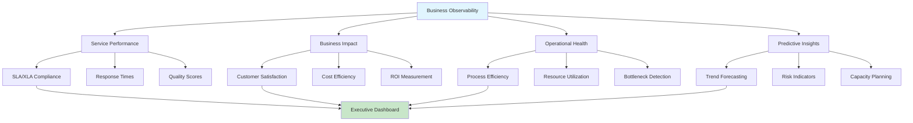
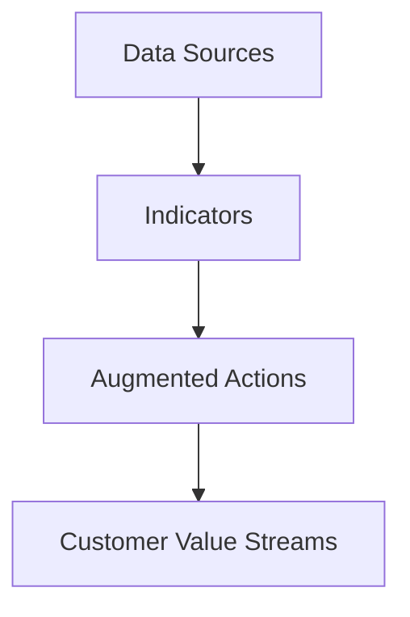
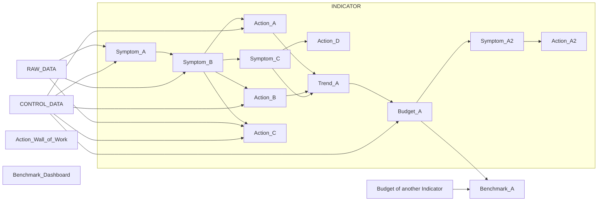
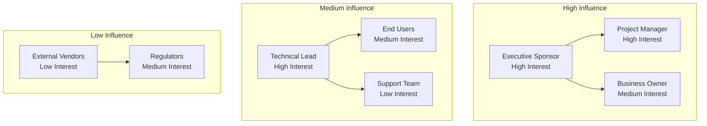
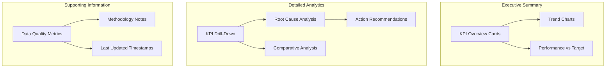
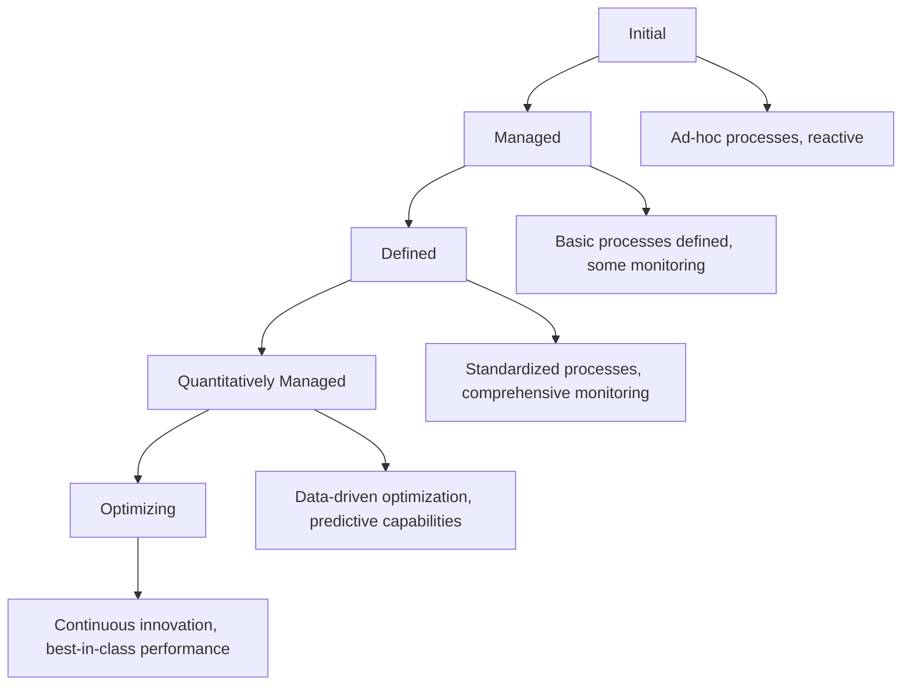
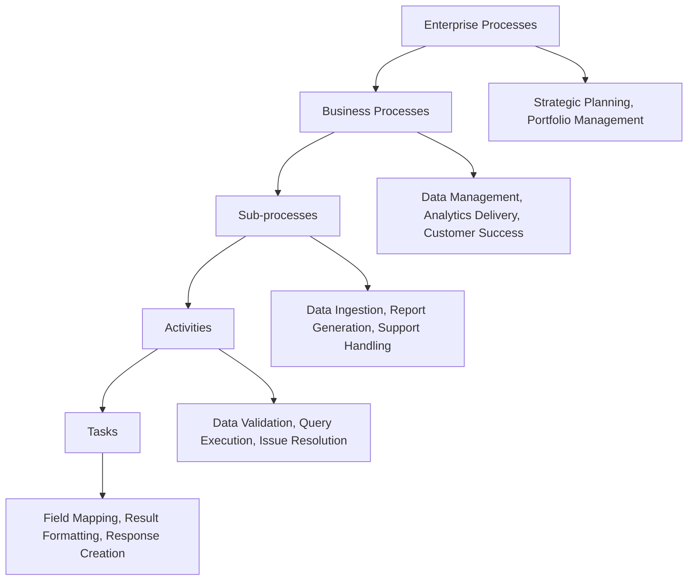
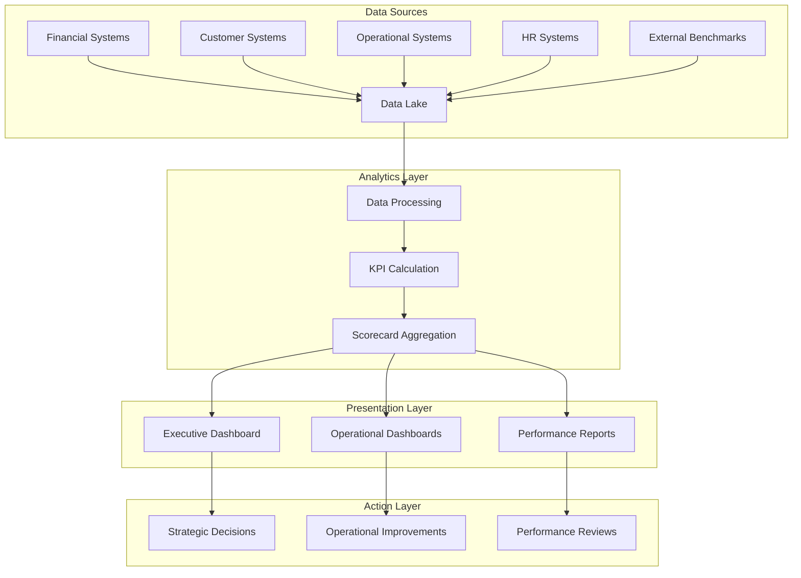
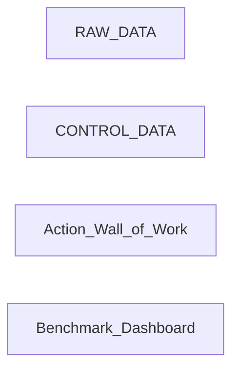

# Business Architecture

> **BIS Handbook 2.0** — Business Strategy, Observability, and Performance Management  
> **Last Updated:** September 13, 2025  
> **Navigation:** [🏠 Main Handbook](../README.md) | [Previous: Customer Experience](02-Customer-Experience.md) | [Next: Technical Architecture](04-Technical-Architecture.md)

---

## Section Overview

**Overview:** Strategic planning framework covering business architecture, observability, and performance management. Defines how BIS integrates with business operations.

**Target Audience:** Business architects, strategists, operations leaders, and executives focused on business outcomes.

**How to Use:** Use for strategic planning, KPI design, performance monitoring, and business-IT alignment. Apply frameworks for business context integration.

**Key Content:** Stakeholder and relationship models, business context and autoranking, product capabilities (RAC→BO→SMA), outcome and value stream models, symptoms and preventive actions, strategic/tactical/operational coverage, business performance benchmarks.

**Use Cases:** Strategic planning, KPI development, performance management, business-IT alignment, outcome measurement.

---

## Table of Contents

- [Business Observability](#business-observability)
- [Product Strategy](#product-strategy)
- [Business Model](#business-model)
- [Stakeholders and Relationships](#stakeholders-and-relationships)
- [Product Capabilities](#product-capabilities)
- [Outcome Model and Value Streams](#outcome-model-and-value-streams)
- [Symptoms and Preventive Actions](#symptoms-and-preventive-actions)
- [Strategic, Tactical, and Operational Layers](#strategic-tactical-and-operational-layers)
- [Business Performance Benchmarks](#business-performance-benchmarks)
- [CSI Integration](#csi-integration)
- [Pricing and Engagement](#pricing-and-engagement)
- [Navigation](#navigation)

---

## Business Observability

Business observability goes beyond traditional system monitoring to provide visibility into business-critical metrics and outcomes.



### Components

| Component | Purpose | Key Metrics | Visual Indicators |
|-----------|---------|-------------|------------------|
| Service Performance | Track SLA/XLA compliance across practices | Response times, availability, quality scores | 📊 Trend charts, ⚡ Performance gauges |
| Business Impact | Measure outcomes and value delivery | Customer satisfaction, cost efficiency, ROI | 💰 ROI dashboards, 😊 Satisfaction meters |
| Operational Health | Monitor process efficiency and bottlenecks | Throughput, error rates, resource utilization | 🔄 Flow diagrams, 🚨 Alert indicators |
| Predictive Insights | Forecast trends and potential issues | Capacity planning, risk indicators, growth patterns | 🔮 Forecast charts, ⚠️ Risk heatmaps |

### Key Benefits
- **Proactive Decision Making**: Spot trends before they become problems
- **Aligned Incentives**: Ensure all practices focus on business outcomes
- **Executive Visibility**: Single pane of glass for leadership oversight
- **Continuous Improvement**: Data-driven optimization opportunities

📚 **Learn More**: [Business Observability Practices](https://www.thoughtworks.com/insights/blog/observability-business-value) | [SLI/SLO Best Practices](https://sre.google/sre-book/service-level-objectives/)

---

## Product Strategy

BIS enables measurement-driven management: "You cannot manage what you cannot measure."

### Business Context and Autoranking
Context drives what matters. Weights and priorities live in CSV and are merged into scoring.

#### Sample CSV Schema
| column | type | meaning |
|---|---|---|
| owner | string | accountable person or team |
| priority_weight | float | importance weight 0 to 1 |
| contract_penalty | float | penalty factor |
| customer_impact | float | estimated impact factor |

#### Sample Scoring Formula
score = priority_weight * customer_impact + contract_penalty

#### Tie-Breakers and Thresholds
- When scores tie, prefer higher customer_impact, then unresolved age, then alphabetical owner
- Thresholds may suppress low-importance actions (e.g., score < 0.2 not delivered)

---

## Business Model

### Stakeholders and Relationship Model
Roles and collaboration rules defined via personas. Typical mapping:

| Role | Responsibilities | Primary Artifacts | Key Skills |
|---|---|---|---|
| Business Analyst | Capture requirements, define KPIs and acceptance | Stories, KPI sheets | Elicitation, KPI design, stakeholder management |
| Data Analyst | Translate to SQL, design views and tests | SQL views, data quality checks | SQL optimization, data modeling, testing frameworks |
| Data Engineer | Automate ELT, maintain lake and CI | Pipelines, quality and schedules | Python, ETL tools, CI/CD pipelines |
| Engine Developer | Implement engine modules and reporting | Python modules, Excel widgets | Python development, Excel APIs, module architecture |
| Planner | Roadmap and dependencies | Plans, risk registers | Project management, risk analysis, dependency mapping |

### Team Dynamics
- Weekly syncs for alignment, with BA leading requirements gathering and DA/DE executing technical solutions
- Cross-functional reviews ensure quality, integration, and alignment with business goals
- AI personas assist in coding, validation, documentation, and prompt engineering for efficiency

### Collaboration Best Practices
- Use shared tools like GitHub for version control and issues for tracking
- Regular retrospectives to improve processes and address blockers
- Knowledge sharing sessions to build skills across roles

---

## Stakeholders and Relationships

See Chatmodes for full RACI and relationships graph.

### Collaboration Cadence
- Weekly value check-ins, monthly outcome reviews, quarterly strategy refresh
- Lightweight intake and prioritization with transparent status
- Shared glossary and working agreements to keep everyone aligned

### Business Perspective Layers
- **Strategic Layer**: Product backlog management with client-specific owners and designated business owners responsible for budget. Tied to Continuous Service Improvement (CSI) processes requiring CSA process manager. Uses single analytics benchmark dashboard for decision-making during iteration planning, development cycles, goal-setting, and outcome measurement.
- **Tactical Layer**: Managers and technical teams collaborate to develop and deliver new iterations. Budget performance monitored against targets, indicator update proposals reviewed by BIS squad after comparing results with targets.
- **Operational Layer**: Operations personnel use developed tools and pull work from product backlog. Daily analytics snapshots provide simple overview of performed actions. Process is data-driven, focusing on fixing issues identified through measurements.

---

## Product Capabilities

### RAC → BO → SMA

| Stage | What It Is | Inputs | Outputs | Typical Effort | Risks |
|---|---|---|---|---|---|
| RAC Report as Code | Deterministic reports as YAML | workspace YAML formats YAML | Excel files and views | Low to medium | Schema drift |
| BO Business Observability | Rollups across practices and vendors | RAC outputs and context | Unified performance overview | Medium | Misaligned weights |
| SMA Smart Actions | Personalized and prioritized actions | BO plus scoring CSV | Action lists and deliveries | Medium to high | False positives |

### Practical Guidance
- Start with RAC to stabilize inputs and outputs; move to BO once teams trust the numbers
- Introduce SMA after owners are identified and weights are agreed—this is where the magic compounds

---

## Outcome Model and Value Streams



---

## Symptoms and Preventive Actions

Symptoms are early signals that precede KPI misses; actions are prescriptive steps mapped to owners. Both are first-class entities managed via the `low` layer (TSymptom, TAction) and connected to indicators and reports.

### Indicator Design Flow

Indicators follow a structured flow from raw data through symptoms, actions, and analytics.



### Flow Explanation
- **Symptoms (red)**: Early warning signals based on data thresholds
- **Actions (green)**: Prescriptive remediation steps with owners and deadlines
- **Analytics (blue)**: Trends, budgets, and benchmarks for insights
- **Data Sources**: Raw data feeds symptoms, control data feeds actions and budgets
- **Outputs**: Action wall of work and benchmark dashboards

### Linkage
- Indicator ↔ Symptom: Each indicator may define symptoms with thresholds and lookbacks
- Symptom ↔ Action: Each symptom prescribes one or more actions with owners and deadlines
- Action ↔ Report: Actions appear in Excel per-owner sheets with status and due dates

---

## Strategic, Tactical, and Operational Layers

- **Operational**: Daily action queues by owner and service; symptom tracking
- **Tactical**: Weekly and monthly SLA reports, trends, and CSI alignment
- **Strategic**: Benchmarks and composite indices where needed; executive overviews

---

## Business Performance Benchmarks

When a single composite is required, aggregate normalized KPIs with transparent weights. Use caution: provide drill-downs and sensitivity.

### Approach
- Normalize KPIs to a 0–1 range; apply stakeholder-approved weights
- Example: composite = 0.5*SLA_attainment + 0.3*NPS + 0.2*Backlog_reduction
- Always include a drill-down sheet and sensitivity analysis notes in delivery

---

## CSI Integration

Reports, SLAs, and actions plug into CSI and SIP governance. Each run updates evidence for SIP items and tracks resolution.

### Touchpoints
- SIP item registers minimum evidence tables and Excel tabs
- Actions carry SIP references and roll statuses forward

---

## Pricing and Engagement

- **In Scope**: Data ingestion to action delivery with Excel outputs and Outlook integration
- **Out of Scope**: Custom BI dashboards as a primary deliverable, cross-tenant analytics
- **Assumptions**: Timely data access, named owners, CSV weights are maintained by business

---

## Navigation

**[🏠 Main Handbook](../README.md)** | **[Previous: Customer Experience](02-Customer-Experience.md)** | **[Next: Technical Architecture](04-Technical-Architecture.md)**

### Quick Links
- [📋 Complete Table of Contents](../README.md#table-of-contents)
- [🎯 Executive Summary](../README.md#executive-summary)
- [🔗 Key Resources](../README.md#key-resources)
- [📚 All Handbook Sections](../README.md#handbook-sections)

### Related Handbook Sections
- [📊 Business Analysis Practices](12-Best-Practices.md#business-analysis-practices) — Detailed methodologies for business analysis
- [⚙️ DataOps Principles](06-Engineering-Processes.md#dataops-principles-and-squad) — DataOps implementation and squad structure
- [🎯 Product Development](11-Product-Development.md) — Roadmap and backlog management
- [🤖 AI Integration](09-Augmented-Workload.md) — AI support for business analysis and decision making

---

## Practical Templates and Frameworks

### Business Process Flow Mapping Template

#### Process Discovery Framework

```markdown
# Business Process Mapping Template

## Process Overview
- **Process Name**: [Name of the business process]
- **Process Owner**: [Name and role]
- **Business Unit**: [Department/Function]
- **Process Purpose**: [What the process achieves]
- **Key Stakeholders**: [List of people/departments involved]

## Current State Analysis

### Process Steps
1. **Step 1**: [Description] - Owner: [Name] - Duration: [Time]
2. **Step 2**: [Description] - Owner: [Name] - Duration: [Time]
3. **Step 3**: [Description] - Owner: [Name] - Duration: [Time]
4. **Step 4**: [Description] - Owner: [Name] - Duration: [Time]
5. **Step 5**: [Description] - Owner: [Name] - Duration: [Time]

### Process Metrics
- **Volume**: [Number of transactions/cases per period]
- **Cycle Time**: [Average time to complete process]
- **Quality**: [Error rate/percentage accuracy]
- **Cost**: [Cost per transaction/total cost]
- **Customer Satisfaction**: [Rating/feedback score]

### Pain Points & Issues
- [ ] Manual processing steps requiring automation
- [ ] Bottlenecks causing delays
- [ ] Quality issues and error rates
- [ ] Communication gaps between stakeholders
- [ ] Lack of visibility and tracking
- [ ] Compliance and risk concerns

### Technology & Systems Used
- **Primary System**: [System name and purpose]
- **Supporting Tools**: [List of tools/applications]
- **Data Sources**: [Where data comes from]
- **Integration Points**: [How systems connect]

## Future State Design

### Target Process Flow
1. **Step 1**: [Optimized description] - Owner: [Name] - Duration: [Time]
2. **Step 2**: [Optimized description] - Owner: [Name] - Duration: [Time]
3. **Step 3**: [Optimized description] - Owner: [Name] - Duration: [Time]
4. **Step 4**: [Optimized description] - Owner: [Name] - Duration: [Time]

### Improvement Opportunities
- **Automation**: [Steps to automate and expected benefits]
- **Technology**: [New tools/systems to implement]
- **Process Changes**: [Structural improvements]
- **Training**: [Skills development needed]

### Success Metrics
- **Cycle Time Reduction**: [Target percentage improvement]
- **Cost Reduction**: [Target percentage improvement]
- **Quality Improvement**: [Target error rate reduction]
- **User Satisfaction**: [Target satisfaction score]

## Implementation Plan

### Phase 1: Design & Planning
- [ ] Requirements gathering completed
- [ ] Solution design finalized
- [ ] Stakeholder approval obtained
- [ ] Resource allocation confirmed

### Phase 2: Development & Testing
- [ ] System configuration completed
- [ ] Integration testing passed
- [ ] User acceptance testing completed
- [ ] Training materials prepared

### Phase 3: Deployment & Go-Live
- [ ] Production deployment completed
- [ ] User training conducted
- [ ] Support processes established
- [ ] Success metrics baseline established

### Phase 4: Optimization & Support
- [ ] Performance monitoring implemented
- [ ] User feedback collection ongoing
- [ ] Continuous improvement process established
- [ ] Support and maintenance procedures documented
```

#### Process Flow Diagram Template

```mermaid
flowchart TD
    subgraph "Process Triggers"
        A[Process Initiation] --> B{Decision Point}
        C[Scheduled Trigger] --> B
        D[Event-Based Trigger] --> B
    end
    
    subgraph "Core Process Flow"
        B --> E[Step 1<br/>Owner: [Name]<br/>Duration: [Time]]
        E --> F[Step 2<br/>Owner: [Name]<br/>Duration: [Time]]
        F --> G{Validation<br/>Checkpoint}
        
        G --> H[Step 3<br/>Owner: [Name]<br/>Duration: [Time]]
        G --> I[Error Handling<br/>Rejection Process]
        
        H --> J[Step 4<br/>Owner: [Name]<br/>Duration: [Time]]
        J --> K[Quality Check<br/>Review Process]
    end
    
    subgraph "Process Outputs"
        K --> L[Final Output<br/>Delivery]
        K --> M[Rework Required<br/>Loop Back]
        M --> F
        
        L --> N[Process Complete<br/>Metrics Updated]
        I --> O[Exception Handling<br/>Escalation]
    end
    
    classDef trigger fill:#e3f2fd,stroke:#1976d2
    classDef process fill:#fff3e0,stroke:#ef6c00
    classDef output fill:#e8f5e8,stroke:#2e7d32
    classDef decision fill:#ffebee,stroke:#d32f2f
```

### Stakeholder Mapping and Analysis Framework

#### Comprehensive Stakeholder Analysis Template

```markdown
# Stakeholder Analysis and Mapping

## Stakeholder Identification

### Primary Stakeholders
| **Stakeholder** | **Role** | **Interest Level** | **Influence Level** | **Priority** | **Key Concerns** |
|----------------|----------|-------------------|-------------------|-------------|------------------|
| [Name] | [Role] | High/Med/Low | High/Med/Low | [1-5] | [List concerns] |
| [Name] | [Role] | High/Med/Low | High/Med/Low | [1-5] | [List concerns] |
| [Name] | [Role] | High/Med/Low | High/Med/Low | [1-5] | [List concerns] |

### Secondary Stakeholders
| **Stakeholder** | **Role** | **Interest Level** | **Influence Level** | **Communication Plan** |
|----------------|----------|-------------------|-------------------|----------------------|
| [Name] | [Role] | High/Med/Low | High/Med/Low | [Communication strategy] |
| [Name] | [Role] | High/Med/Low | High/Med/Low | [Communication strategy] |

### Stakeholder Influence Map


## Communication and Engagement Strategy

### Communication Plan
| **Stakeholder Group** | **Communication Method** | **Frequency** | **Key Messages** | **Responsible** |
|----------------------|------------------------|--------------|------------------|----------------|
| **Executives** | Status reports, steering committee | Weekly/Monthly | Business value, risks, milestones | [Name] |
| **Business Users** | Workshops, demos, newsletters | Bi-weekly | Progress updates, training | [Name] |
| **Technical Team** | Stand-ups, technical reviews | Daily/Weekly | Technical progress, issues | [Name] |
| **Support Team** | Training sessions, documentation | As needed | System knowledge, procedures | [Name] |

### Engagement Tactics
- **Regular Updates**: Status reports and progress dashboards
- **Feedback Loops**: Surveys, interviews, and suggestion mechanisms
- **Involvement Opportunities**: Working groups, review sessions, pilot programs
- **Recognition**: Acknowledging contributions and celebrating milestones
- **Issue Resolution**: Clear escalation paths and timely responses

## Risk Assessment and Mitigation

### Stakeholder-Related Risks
| **Risk** | **Probability** | **Impact** | **Mitigation Strategy** | **Owner** |
|----------|----------------|------------|----------------------|-----------|
| **Resistance to Change** | High | High | Change management plan, training | [Name] |
| **Lack of Engagement** | Medium | Medium | Regular communication, involvement | [Name] |
| **Conflicting Priorities** | Medium | High | Clear prioritization framework | [Name] |
| **Resource Constraints** | Low | High | Resource planning, contingency | [Name] |

### Risk Monitoring
- **Early Warning Signs**: Decreased participation, negative feedback
- **Monitoring Frequency**: Weekly stakeholder health checks
- **Escalation Process**: Clear triggers and response procedures
- **Contingency Plans**: Backup strategies for key risks
```

#### Power/Interest Grid Analysis

```mermaid
quadrantChart
    title Stakeholder Power/Interest Analysis
    x-axis Low Power --> High Power
    y-axis Low Interest --> High Interest
    quadrant-1 Monitor (Minimum Effort)
    quadrant-2 Keep Satisfied
    quadrant-3 Keep Informed
    quadrant-4 Key Players (Manage Closely)
    "Executive Sponsor": [0.9, 0.9]
    "Business Owner": [0.8, 0.7]
    "Project Manager": [0.7, 0.8]
    "Technical Lead": [0.6, 0.8]
    "End Users": [0.4, 0.6]
    "Support Team": [0.3, 0.4]
    "External Vendors": [0.2, 0.3]
```

### KPI Design and Measurement Framework

#### KPI Development Methodology

```markdown
# KPI Design and Implementation Framework

## KPI Definition Framework

### KPI Fundamentals
- **Name**: [Clear, descriptive name]
- **Purpose**: [What it measures and why it matters]
- **Formula**: [Calculation method and data sources]
- **Target**: [Desired performance level]
- **Frequency**: [How often it's measured]
- **Owner**: [Who is responsible for the KPI]

### KPI Categories and Examples

#### Strategic KPIs (Business Outcomes)
| **KPI** | **Formula** | **Target** | **Frequency** | **Owner** |
|---------|-------------|------------|--------------|-----------|
| **Revenue Growth** | (Current Revenue - Previous Revenue) / Previous Revenue * 100 | > 10% | Monthly | CFO |
| **Customer Satisfaction** | Average NPS score across all customers | > 7.5 | Quarterly | Customer Success |
| **Market Share** | (Company Revenue / Total Market Revenue) * 100 | > 15% | Quarterly | Marketing |

#### Operational KPIs (Process Efficiency)
| **KPI** | **Formula** | **Target** | **Frequency** | **Owner** |
|---------|-------------|------------|--------------|-----------|
| **Process Cycle Time** | Average time from start to completion | < 5 days | Weekly | Operations |
| **Quality Rate** | (Total Items - Defective Items) / Total Items * 100 | > 98% | Daily | Quality |
| **Resource Utilization** | Actual Hours Used / Available Hours * 100 | 85-95% | Weekly | Resource Manager |

#### Leading vs Lagging Indicators
| **Type** | **Definition** | **Examples** | **Use Case** |
|----------|----------------|--------------|-------------|
| **Leading** | Predictive measures that drive future performance | Sales pipeline value, employee engagement | Proactive management |
| **Lagging** | Historical measures of past performance | Revenue achieved, customer retention | Performance evaluation |

## KPI Dashboard Design

### Dashboard Layout Framework


### KPI Health Score Calculator

```python
def calculate_kpi_health_score(kpi_metrics, weights=None):
    """
    Calculate overall KPI portfolio health score
    
    Args:
        kpi_metrics (dict): Dictionary of KPI performance data
        weights (dict): Optional custom weights for scoring
    
    Returns:
        dict: Health assessment with recommendations
    """
    
    if weights is None:
        weights = {
            'performance': 0.4,  # How well KPIs are performing vs targets
            'trend': 0.3,        # Direction and momentum
            'data_quality': 0.2, # Reliability of KPI data
            'coverage': 0.1      # KPI portfolio completeness
        }
    
    # Calculate performance score
    performance_score = calculate_performance_score(kpi_metrics)
    
    # Calculate trend score
    trend_score = calculate_trend_score(kpi_metrics)
    
    # Calculate data quality score
    data_quality_score = calculate_data_quality_score(kpi_metrics)
    
    # Calculate coverage score
    coverage_score = calculate_coverage_score(kpi_metrics)
    
    # Overall health score
    overall_score = (
        weights['performance'] * performance_score +
        weights['trend'] * trend_score +
        weights['data_quality'] * data_quality_score +
        weights['coverage'] * coverage_score
    )
    
    # Determine health status
    if overall_score >= 80:
        status = "Excellent"
        recommendations = ["Maintain current KPI framework", "Focus on continuous improvement"]
    elif overall_score >= 60:
        status = "Good"
        recommendations = ["Address underperforming KPIs", "Improve data quality"]
    elif overall_score >= 40:
        status = "Needs Attention"
        recommendations = ["Review KPI definitions", "Enhance measurement processes"]
    else:
        status = "Critical"
        recommendations = ["Complete KPI framework redesign", "Immediate executive intervention"]
    
    return {
        'overall_score': round(overall_score, 1),
        'status': status,
        'component_scores': {
            'performance': performance_score,
            'trend': trend_score,
            'data_quality': data_quality_score,
            'coverage': coverage_score
        },
        'recommendations': recommendations,
        'action_priority': 'High' if overall_score < 60 else 'Medium'
    }

def calculate_performance_score(kpi_metrics):
    """Calculate performance vs target score"""
    kpis = kpi_metrics.get('kpis', [])
    if not kpis:
        return 0
    
    on_target_count = sum(1 for kpi in kpis if kpi.get('on_target', False))
    return (on_target_count / len(kpis)) * 100

def calculate_trend_score(kpi_metrics):
    """Calculate trend direction score"""
    kpis = kpi_metrics.get('kpis', [])
    if not kpis:
        return 50  # Neutral score
    
    improving_count = sum(1 for kpi in kpis if kpi.get('trend', '') == 'improving')
    declining_count = sum(1 for kpi in kpis if kpi.get('trend', '') == 'declining')
    
    if declining_count == 0:
        return 100  # All improving or stable
    elif improving_count == 0:
        return 0    # All declining
    
    return (improving_count / (improving_count + declining_count)) * 100

def calculate_data_quality_score(kpi_metrics):
    """Calculate data quality score"""
    quality_metrics = kpi_metrics.get('data_quality', {})
    
    completeness = quality_metrics.get('completeness_percentage', 0)
    accuracy = quality_metrics.get('accuracy_percentage', 0)
    timeliness = quality_metrics.get('timeliness_percentage', 0)
    
    return (completeness + accuracy + timeliness) / 3

def calculate_coverage_score(kpi_metrics):
    """Calculate KPI coverage completeness score"""
    coverage_metrics = kpi_metrics.get('coverage', {})
    
    strategic_coverage = coverage_metrics.get('strategic_kpis_percentage', 0)
    operational_coverage = coverage_metrics.get('operational_kpis_percentage', 0)
    functional_coverage = coverage_metrics.get('functional_coverage_percentage', 0)
    
    return (strategic_coverage + operational_coverage + functional_coverage) / 3

# Example usage
kpi_data = {
    'kpis': [
        {'name': 'Revenue Growth', 'on_target': True, 'trend': 'improving'},
        {'name': 'Customer Satisfaction', 'on_target': False, 'trend': 'stable'},
        {'name': 'Process Efficiency', 'on_target': True, 'trend': 'improving'}
    ],
    'data_quality': {
        'completeness_percentage': 95,
        'accuracy_percentage': 98,
        'timeliness_percentage': 90
    },
    'coverage': {
        'strategic_kpis_percentage': 80,
        'operational_kpis_percentage': 85,
        'functional_coverage_percentage': 75
    }
}

health_assessment = calculate_kpi_health_score(kpi_data)
print(f"KPI Health Score: {health_assessment['overall_score']}/100")
print(f"Status: {health_assessment['status']}")
print(f"Recommendations: {health_assessment['recommendations']}")
```

### Business Capability Mapping Framework

#### Capability Assessment Template

```markdown
# Business Capability Assessment

## Capability Overview
- **Capability Name**: [Name of business capability]
- **Domain**: [Business domain/function]
- **Owner**: [Capability owner]
- **Description**: [What the capability enables]
- **Strategic Importance**: [High/Medium/Low]

## Current State Assessment

### Capability Components
| **Component** | **Current Maturity** | **Strengths** | **Weaknesses** | **Improvement Priority** |
|---------------|---------------------|---------------|---------------|-------------------------|
| **People** | [1-5 scale] | [List] | [List] | [High/Med/Low] |
| **Process** | [1-5 scale] | [List] | [List] | [High/Med/Low] |
| **Technology** | [1-5 scale] | [List] | [List] | [High/Med/Low] |
| **Information** | [1-5 scale] | [List] | [List] | [High/Med/Low] |

### Performance Metrics
- **Efficiency**: [Current vs target performance]
- **Effectiveness**: [Quality and outcome measures]
- **Compliance**: [Regulatory and standards adherence]
- **Innovation**: [Improvement and adaptation rate]

### Dependencies and Relationships
- **Upstream Dependencies**: [Capabilities this depends on]
- **Downstream Consumers**: [Capabilities that depend on this]
- **External Interfaces**: [Systems and partners involved]

## Target State Design

### Target Maturity Level
- **People**: [Target maturity and key initiatives]
- **Process**: [Target maturity and key initiatives]
- **Technology**: [Target maturity and key initiatives]
- **Information**: [Target maturity and key initiatives]

### Transformation Roadmap
1. **Phase 1**: [Foundation improvements]
2. **Phase 2**: [Core capability enhancement]
3. **Phase 3**: [Advanced optimization]
4. **Phase 4**: [Innovation and leadership]

### Success Measures
- **Maturity Improvement**: [Target level and timeline]
- **Performance Targets**: [Specific metrics and goals]
- **Business Impact**: [Expected benefits and ROI]

## Implementation Plan

### Key Initiatives
| **Initiative** | **Objective** | **Timeline** | **Owner** | **Budget** | **Success Criteria** |
|----------------|--------------|--------------|-----------|------------|---------------------|
| [Initiative 1] | [Objective] | [Timeline] | [Owner] | [Budget] | [Criteria] |
| [Initiative 2] | [Objective] | [Timeline] | [Owner] | [Budget] | [Criteria] |

### Risk Mitigation
- **Technical Risks**: [Risks and mitigation strategies]
- **Organizational Risks**: [Change management approach]
- **Resource Risks**: [Resource planning and backup]
- **Timeline Risks**: [Contingency planning]

### Governance and Monitoring
- **Steering Committee**: [Composition and frequency]
- **Progress Reporting**: [Metrics and cadence]
- **Change Control**: [Process for scope changes]
- **Benefits Realization**: [Tracking and validation]
```

#### Value Stream Analysis Template

```markdown
# Value Stream Analysis Template

## Value Stream Overview
- **Value Stream Name**: [Name of the value stream]
- **Primary Customer**: [Who receives the value]
- **Value Proposition**: [What value is delivered]
- **Key Metrics**: [Lead time, quality, cost, satisfaction]

## Current State Value Stream Map

### Value Stream Stages
1. **Stage 1**: [Activity] - Duration: [Time] - Value Add: [Yes/No] - Wait Time: [Time]
2. **Stage 2**: [Activity] - Duration: [Time] - Value Add: [Yes/No] - Wait Time: [Time]
3. **Stage 3**: [Activity] - Duration: [Time] - Value Add: [Yes/No] - Wait Time: [Time]
4. **Stage 4**: [Activity] - Duration: [Time] - Value Add: [Yes/No] - Wait Time: [Time]
5. **Stage 5**: [Activity] - Duration: [Time] - Value Add: [Yes/No] - Wait Time: [Time]

### Value Stream Metrics
- **Total Lead Time**: [Sum of all stage durations and waits]
- **Value-Add Time**: [Time spent on value-adding activities]
- **Process Efficiency**: [Value-add time / total lead time * 100]
- **Quality Rate**: [Percentage of defect-free outputs]

### Waste Identification
| **Waste Type** | **Description** | **Impact** | **Examples** | **Elimination Strategy** |
|---------------|----------------|------------|--------------|----------------------|
| **Waiting** | Time spent waiting for inputs | Delays, frustration | Approval delays, queue time | Streamline approvals, just-in-time delivery |
| **Transportation** | Unnecessary movement of materials/info | Cost, time, errors | Hand-offs, file transfers | Colocate teams, automate transfers |
| **Overprocessing** | Doing more work than required | Cost, time | Excessive reviews, redundant steps | Simplify processes, eliminate unnecessary work |
| **Inventory** | Excess work in progress | Cost, delays | Large backlogs, work queues | Pull systems, smaller batch sizes |
| **Motion** | Unnecessary movement of people | Time, fatigue | Walking between departments | Better layout, digital collaboration |
| **Defects** | Errors requiring rework | Cost, time, quality | Data errors, miscommunication | Quality checks, error-proofing |
| **Overproduction** | Producing more than needed | Cost, waste | Extra reports, unused features | Demand-driven production |

## Future State Value Stream Design

### Target Improvements
- **Lead Time Reduction**: [Target percentage improvement]
- **Quality Improvement**: [Target defect rate reduction]
- **Cost Reduction**: [Target cost savings]
- **Customer Satisfaction**: [Target satisfaction improvement]

### Optimized Value Stream
1. **Stage 1**: [Streamlined activity] - Duration: [Time] - Value Add: [Yes] - Wait Time: [0]
2. **Stage 2**: [Streamlined activity] - Duration: [Time] - Value Add: [Yes] - Wait Time: [0]
3. **Stage 3**: [Streamlined activity] - Duration: [Time] - Value Add: [Yes] - Wait Time: [0]
4. **Stage 4**: [Streamlined activity] - Duration: [Time] - Value Add: [Yes] - Wait Time: [0]

### Implementation Roadmap
| **Improvement** | **Expected Benefit** | **Implementation Effort** | **Timeline** | **Owner** |
|----------------|---------------------|--------------------------|--------------|-----------|
| [Improvement 1] | [Benefit] | [Effort level] | [Timeline] | [Owner] |
| [Improvement 2] | [Benefit] | [Effort level] | [Timeline] | [Owner] |
| [Improvement 3] | [Benefit] | [Effort level] | [Timeline] | [Owner] |

### Success Metrics and Monitoring
- **Lead Time**: Track and report weekly
- **Quality**: Monitor defect rates daily
- **Cost**: Track efficiency improvements monthly
- **Customer Satisfaction**: Survey quarterly
- **Process Efficiency**: Calculate monthly

## Continuous Improvement Plan

### Kaizen Events
- **Frequency**: [Monthly/Quarterly]
- **Focus Areas**: [Specific improvement targets]
- **Participants**: [Cross-functional team members]
- **Duration**: [1-5 days per event]

### Performance Dashboard
- **Real-time Metrics**: Key performance indicators
- **Trend Analysis**: Historical performance tracking
- **Benchmarking**: Comparison against best practices
- **Action Tracking**: Improvement initiative progress

### Lessons Learned and Best Practices
- **Success Stories**: Documented improvements and benefits
- **Standard Work**: Established best practices and procedures
- **Training**: Knowledge sharing and skill development
- **Replication**: Apply successful patterns to other value streams
```

This comprehensive enhancement provides business architects with practical templates and frameworks for process mapping, stakeholder analysis, KPI design, capability assessment, and value stream optimization - making the handbook significantly more actionable for strategic business planning and transformation initiatives.

---

## Business Capability Modeling

### Capability Framework Overview

BIS business capabilities represent the "what" of business operations - the abilities and competencies required to deliver value. This framework provides a structured approach to capability identification, assessment, and optimization.

#### Core Capability Categories

| Capability Category | Description | Key Components | Maturity Indicators |
|-------------------|-------------|----------------|-------------------|
| **Data Management** | Ability to acquire, process, and govern data assets | Data ingestion, quality management, cataloging | Data quality scores, catalog completeness |
| **Analytics & Insights** | Capacity to transform data into actionable intelligence | Reporting, visualization, predictive modeling | Insight accuracy, decision impact |
| **Process Automation** | Capability to streamline and optimize business processes | Workflow automation, RPA, intelligent routing | Process efficiency, error reduction |
| **Integration & Connectivity** | Ability to connect systems and exchange data seamlessly | API management, data pipelines, event streaming | Integration uptime, data flow velocity |
| **Governance & Compliance** | Framework for managing risk and ensuring regulatory compliance | Policy management, audit trails, control frameworks | Compliance scores, risk mitigation |

#### Capability Maturity Model



### Value Stream Mapping and Analysis

#### Value Stream Architecture

Value streams represent the sequence of activities required to deliver specific business outcomes. BIS value streams focus on data-to-insight-to-action cycles that drive business performance.

##### Primary Value Streams

**Data-to-Action Value Stream**:

```mermaid
flowchart LR
    subgraph "Data Acquisition"
        A[Data Sources] --> B[Ingestion]
        B --> C[Validation]
    end
    
    subgraph "Data Processing"
        C --> D[Transformation]
        D --> E[Enrichment]
        E --> F[Storage]
    end
    
    subgraph "Insight Generation"
        F --> G[Analysis]
        G --> H[Modeling]
        H --> I[Visualization]
    end
    
    subgraph "Action Enablement"
        I --> J[Recommendations]
        J --> K[Automation]
        K --> L[Execution]
    end
    
    subgraph "Value Realization"
        L --> M[Outcomes]
        M --> N[Measurement]
        N --> O[Optimization]
    end
    
    O --> A
```


**Customer Success Value Stream**:
- **Awareness**: Problem identification and solution exploration
- **Adoption**: Implementation and initial value delivery
- **Optimization**: Continuous improvement and expansion
- **Advocacy**: Reference and partnership development

#### Value Stream Performance Metrics

| Value Stream Stage | Key Metrics | Target Performance | Measurement Frequency |
|-------------------|-------------|-------------------|---------------------|
| **Data Acquisition** | Ingestion success rate, data completeness | >99%, >95% | Real-time |
| **Data Processing** | Processing latency, transformation accuracy | <5min, >98% | Hourly |
| **Insight Generation** | Analysis completion rate, insight relevance | >95%, >80% | Daily |
| **Action Enablement** | Action acceptance rate, automation coverage | >70%, >60% | Weekly |
| **Value Realization** | Business impact, ROI achievement | Measurable improvement | Monthly |

### Strategic Planning and Portfolio Management

#### Strategic Alignment Framework

BIS strategic planning connects business objectives with technical capabilities through a structured alignment process.

##### Strategy-to-Execution Mapping

```yaml
strategic_objectives:
  customer_centricity:
    objective: "Deliver exceptional customer experiences through data-driven insights"
    kpis:
      - customer_satisfaction_score: { target: 4.5, current: 4.2 }
      - net_promoter_score: { target: 70, current: 65 }
    initiatives:
      - customer_journey_optimization
      - predictive_support_system
      - personalized_recommendations
  
  operational_excellence:
    objective: "Achieve operational efficiency through automation and optimization"
    kpis:
      - process_efficiency_gain: { target: 30, current: 15 }
      - cost_reduction_percentage: { target: 25, current: 10 }
    initiatives:
      - process_automation_platform
      - predictive_maintenance_system
      - resource_optimization_engine
  
  innovation_growth:
    objective: "Drive innovation through advanced analytics and AI capabilities"
    kpis:
      - innovation_pipeline_value: { target: 50M, current: 20M }
      - time_to_market: { target: 60_days, current: 90_days }
    initiatives:
      - ai_model_factory
      - innovation_lab_establishment
      - partnership_ecosystem
```

#### Portfolio Management Framework

##### Initiative Prioritization Matrix

| Criteria | Weight | Customer Centricity | Operational Excellence | Innovation Growth |
|----------|--------|-------------------|----------------------|------------------|
| **Strategic Alignment** | 0.3 | High | Medium | High |
| **Business Value** | 0.25 | High | High | Medium |
| **Feasibility** | 0.2 | Medium | High | Low |
| **Risk Level** | 0.15 | Low | Low | High |
| **Resource Requirements** | 0.1 | Medium | Medium | High |
| **Total Score** | 1.0 | **High** | **High** | **Medium** |

### Business Process Management and Optimization

#### Process Architecture Framework

BIS process architecture provides a structured approach to designing, implementing, and optimizing business processes.

##### Process Hierarchy Model



#### Process Performance Optimization

##### Process Mining and Analysis

```yaml
process_optimization_framework:
  discovery_phase:
    data_collection:
      - event_logs: "System interaction logs"
      - user_journeys: "Customer interaction traces"
      - performance_metrics: "Process execution times"
    analysis_techniques:
      - process_mining: "Automated process discovery"
      - bottleneck_analysis: "Performance constraint identification"
      - variant_analysis: "Process deviation detection"
  
  optimization_phase:
    improvement_opportunities:
      - automation_candidates: "Repetitive manual tasks"
      - standardization_opportunities: "Inconsistent process variants"
      - elimination_candidates: "Non-value-adding activities"
    implementation_approach:
      - pilot_testing: "Small-scale validation"
      - phased_rollout: "Gradual implementation"
      - change_management: "Stakeholder communication"
  
  monitoring_phase:
    kpi_tracking:
      - process_efficiency: "Time and cost metrics"
      - quality_indicators: "Error rates and compliance"
      - customer_satisfaction: "Experience metrics"
    continuous_improvement:
      - feedback_loops: "Regular performance reviews"
      - adaptation_cycles: "Process refinement iterations"
```

### Business Performance Management System

#### Balanced Scorecard Framework

BIS implements a comprehensive balanced scorecard approach to track performance across multiple dimensions.

##### Performance Dimensions

| Perspective | Key Objectives | Critical Success Factors | Key Performance Indicators |
|-------------|----------------|------------------------|---------------------------|
| **Financial** | Revenue growth, cost management, ROI optimization | Profitability, cash flow, investment returns | Revenue growth rate, cost-to-income ratio, ROI percentage |
| **Customer** | Satisfaction improvement, retention enhancement, experience optimization | Customer loyalty, satisfaction scores, lifetime value | NPS, customer retention rate, satisfaction index |
| **Internal Process** | Efficiency gains, quality improvement, innovation acceleration | Process optimization, quality management, cycle time reduction | Process efficiency metrics, defect rates, innovation pipeline |
| **Learning & Growth** | Capability development, knowledge management, organizational health | Skills development, knowledge sharing, employee engagement | Training completion rates, knowledge utilization, engagement scores |

#### Performance Dashboard Architecture



#### Predictive Performance Management

##### Leading Indicator Framework

```yaml
leading_indicators:
  customer_health:
    indicators:
      - engagement_frequency: "Weekly active users"
      - feature_utilization: "Core feature adoption rates"
      - support_ticket_trends: "Support volume patterns"
    prediction_targets:
      - customer_retention: "6-month retention probability"
      - expansion_opportunities: "Cross-sell potential"
  
  operational_health:
    indicators:
      - system_performance: "Response time trends"
      - error_rates: "System error patterns"
      - resource_utilization: "Capacity usage trends"
    prediction_targets:
      - incident_probability: "System outage likelihood"
      - scalability_needs: "Infrastructure expansion requirements"
  
  financial_health:
    indicators:
      - sales_pipeline_velocity: "Deal progression rates"
      - contract_renewal_indicators: "Usage and satisfaction trends"
      - market_demand_signals: "Industry adoption patterns"
    prediction_targets:
      - revenue_forecasts: "Quarterly revenue projections"
      - budget_variance_probability: "Cost overrun likelihood"
```

This comprehensive business architecture framework provides the foundation for strategic alignment, operational excellence, and continuous value delivery in the BIS ecosystem.

## Legacy Content from 02-Product-Model.md

# Business architecture and product model

> **Canonical** — Extracted from BIS Handbook  
> **Last Updated:** 2025-09-03  
> **Navigation:** [← BIS Executive Summary](../Handbook.md) | [📚 All Handbook Sections](../Handbook.md#handbook-sections)

[Back to Top](#bis-handbook-comprehensive-guide-to-business-integration-service)

### Stakeholders and relationship model
Roles and collaboration rules are defined via personas. Typical mapping:
| Role | Responsibilities | Primary artifacts | Key Skills |
|---|---|---|---|
| Business Analyst | Capture requirements, define KPIs and acceptance | Stories, KPI sheets | Elicitation, KPI design, stakeholder management |
| Data Analyst | Translate to SQL, design views and tests | SQL views, data quality checks | SQL optimization, data modeling, testing frameworks |
| Data Engineer | Automate ELT, maintain lake and CI | Pipelines, quality and schedules | Python, ETL tools, CI/CD pipelines |
| Engine Developer | Implement engine modules and reporting | Python modules, Excel widgets | Python development, Excel APIs, module architecture |
| Planner | Roadmap and dependencies | Plans, risk registers | Project management, risk analysis, dependency mapping |
See Chatmodes for full RACI and relationships graph.

Team Dynamics
- Weekly syncs for alignment, with BA leading requirements gathering and DA/DE executing technical solutions.
- Cross-functional reviews ensure quality, integration, and alignment with business goals.
- AI personas assist in coding, validation, documentation, and prompt engineering for efficiency.

Collaboration Best Practices
- Use shared tools like GitHub for version control and issues for tracking.
- Regular retrospectives to improve processes and address blockers.
- Knowledge sharing sessions to build skills across roles.

References
- Personas catalog and RACI: [../.github/chatmodes/README.md](../.github/chatmodes/README.md)

Collaboration cadence
- Weekly value check-ins, monthly outcome reviews, quarterly strategy refresh.
- Lightweight intake and prioritization with transparent status.
- Shared glossary and working agreements to keep everyone aligned.

Business perspective layers:
- **Strategic Layer**: Product backlog management with client-specific owners and designated business owners responsible for budget. Tied to Continuous Service Improvement (CSI) processes requiring CSA process manager. Uses single analytics benchmark dashboard for decision-making during iteration planning, development cycles, goal-setting, and outcome measurement. Crucial for aligning development with business goals and ensuring planned actions are executed.
- **Tactical Layer**: Managers and technical teams collaborate to develop and deliver new iterations. Budget performance monitored against targets, indicator update proposals reviewed by BIS squad after comparing results with targets. Ensures management decisions are data-driven and focused on result improvement.
- **Operational Layer**: Operations personnel use developed tools and pull work from product backlog. Daily analytics snapshots provide simple overview of performed actions. Process is data-driven, focusing on fixing issues identified through measurements. Responsible for task execution and practical strategy application.

### Business context and autoranking
Context drives what matters. Weights and priorities live in CSV and are merged into scoring.
Sample CSV schema
| column | type | meaning |
|---|---|---|
| owner | string | accountable person or team |
| priority_weight | float | importance weight 0 to 1 |
| contract_penalty | float | penalty factor |
| customer_impact | float | estimated impact factor |

Sample scoring formula
- Example: score = priority_weight * customer_impact + contract_penalty

Tie-breakers and thresholds
- When scores tie, prefer higher customer_impact, then unresolved age, then alphabetical owner.
- Thresholds may suppress low-importance actions (e.g., score < 0.2 not delivered).

References
- Analysis guardrails: [../.github/instructions/best-practices-business-analysis.instructions.md](../.github/instructions/best-practices-business-analysis.instructions.md)

What this unlocks
- Action queues that reflect business priorities—automatically.
- Smarter trade-offs during crunch time (e.g., month-close) with clear rationale.
- Transparent, adjustable weights so stakeholders can "tune" outcomes.

### Product capabilities (RAC → BO → SMA)
| Stage | What it is | Inputs | Outputs | Typical effort | Risks |
|---|---|---|---|---|---|
| RAC Report as Code | Deterministic reports as YAML | workspace YAML formats YAML | Excel files and views | Low to medium | Schema drift |
| BO Business Observability | Rollups across practices and vendors | RAC outputs and context | Unified performance overview | Medium | Misaligned weights |
| SMA Smart Actions | Personalized and prioritized actions | BO plus scoring CSV | Action lists and deliveries | Medium to high | False positives |

Practical guidance
- Start with RAC to stabilize inputs and outputs; move to BO once teams trust the numbers.
- Introduce SMA after owners are identified and weights are agreed—this is where the magic compounds.

### Outcome model and value streams


### Symptoms and preventive actions model
Symptoms are early signals that precede KPI misses; actions are prescriptive steps mapped to owners. Both are first-class entities managed via the `low` layer (TSymptom, TAction) and connected to indicators and reports.

**Indicator Design Flow:**
Indicators follow a structured flow from raw data through symptoms, actions, and analytics. The flow is automatically generated based on FROM statements in indicator jobs.


