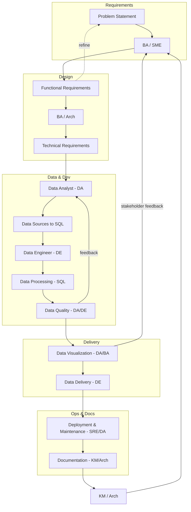

# Team and Roles

> **BIS Handbook 2.0** — Roles, Skills, Onboarding, and Team Dynamics  
> **Last Updated:** September 13, 2025  
> **Navigation:** [🏠 Main Handbook](../README.md) | [Previous: Engineering Processes](06-Engineering-Processes.md) | [Next: Knowledge Management](08-Knowledge-Management.md)

---

## Section Overview

**Overview:** Organizational structure, roles matrix, skills assessment, and team dynamics. Defines team composition and responsibilities.

**Target Audience:** HR managers, team leaders, project managers, and organizational planners.

**How to Use:** Use for team planning, role assignments, skills assessment, and organizational design. Reference for understanding team dynamics and responsibilities.

**Key Content:** Roles and skills matrix, relationship models, internal governance, onboarding processes, team collaboration frameworks.

**Use Cases:** Team building, role definition, skills assessment, organizational planning, performance management.

---

## Table of Contents

- [Roles and Skills Matrix](#roles-and-skills-matrix)
- [AI Personas in Development](#ai-personas-in-development)
- [Skills and Training Resources](#skills-and-training-resources)
- [Development Workflow](#development-workflow)
- [New Team Member Onboarding](#new-team-member-onboarding)
- [Squad Scale and Capacity](#squad-scale-and-capacity)
- [Internal Governance](#internal-governance)
- [Navigation](#navigation)

---

## DataOps Squad

BIS development follows a structured DataOps squad model with specialized roles and clear cooperation flows.

### Squad Roles
- **Business Analyst (BA)**: Requirements and business context
- **Data Analyst (DA)**: Data processing and analytics
- **Data Engineer (DE)**: Data sources and delivery systems
- **SRE/DevOps (SRE)**: Deployment and infrastructure
- **Data Architect (Arch)**: Overall design and architecture
- **Scrum Master (SM)**: Process facilitation and management
- **Knowledge Manager (KM)**: Documentation and knowledge transfer
- **Subject Matter Expert (SME)**: Domain-specific consulting

### Cooperation Flow

### Development Steps

#### Planning Phase
1. Define business owner and stakeholders
2. Define problem statement and business needs
3. Perform feasibility study
4. Size estimation (T-shirt sizing) and prioritization (MoSCoW)
5. ROI description and use case for Product Owner
6. Development decision

#### Development Phase
7. Structure requirements into AI-ready documentation
8. Manage data access and system permissions
9. Extract example input data for development
10. Create data schema from input data
11. Code business logic SQL based on schema and requirements
12. Create technical documentation from SQL code
13. Validate technical implementation against business requirements
14. Code playbook (job) to execute SQL logic

#### Delivery Phase
15. Setup data quality checks for inputs
16. Setup visualization (Excel reports, email formatting)
17. Setup delivery mechanisms to owners
18. Integration and comprehensive testing
19. Customer feedback and validation
20. Setup automation, pipelines, and scheduling
21. Update all documentation (specs, playbooks, wiki)
22. Production deployment
23. Ongoing monitoring and maintenance

### Skills Matrix
| Role | Core skills | Tools/tech |
|------|-------------|------------|
| BA | Requirements, stakeholder comms, KPI definition | Miro, Markdown, GitHub Issues |
| DA | SQL (DuckDB), data modeling, analytics, Excel viz | DuckDB SQL, pandas, xlsxwriter |
| DE | Data ingestion, APIs, files, storage, CI/CD | Python, fsspec/s3fs/abfs, Boto3/Azure SDK, GitHub Actions |
| SRE/DevOps | Packaging, environments, observability, automation | Python/conda, logging, Robocorp, CI/CD |
| Architect | Target design, standards, review, security | Architecture diagrams, ADRs, IaC patterns |
| Scrum Master | Facilitation, cadence, impediment removal | Scrum ceremonies, metrics |
| Knowledge Manager | Docs, templates, knowledge transfer | Markdown, wiki, playbook templates |
| SME | Domain expertise, validation, data context | Source systems, glossary |

- **Shared competencies**:
  - Version control and reviews (Git/GitHub PRs)
  - Documentation-first mindset (AI-friendly Markdown)
  - Data quality and testing (unit/integration/performance)
  - Security-by-default (secrets handling, PII redaction)

### Relationship Model
- **Ownership boundaries**
  - Business Owner: prioritization, ROI, acceptance
  - CSI Manager: backlog intake, SIP alignment
  - BIS Squad: technical implementation and delivery
  - SMEs: domain rules and validation
- **RACI (typical)**
  - Requirements: R(BA/Owner), A(Owner), C(SME/Arch), I(Squad)
  - Data access: R(DE), A(Owner/IT), C(SME/Sec), I(Squad)
  - Indicator SQL: R(DA), A(Arch), C(SME/BA), I(Owner)
  - Playbook/config: R(DA/DE), A(Arch), C(SME/BA), I(Owner)
  - Report/delivery: R(DA), A(Owner), C(BA), I(Stakeholders)
  - Quality policy: R(Arch/DA), A(Owner), C(SME), I(Squad)
  - Runbook/automation: R(SRE/DE), A(Arch), C(DA), I(Owner)
- **Communication cadence**
  - Daily standup (Squad), Weekly refinement (Owner+SME), Bi-weekly sprint review, Monthly steering (KPIs/ROI)
- **Working agreements**
  - "Everything as code," single source of truth in repo/wiki
  - SLA to XLA mapping is explicit and versioned
  - One owner per action; aggregated daily messages per owner

---

## AI Personas in Development

Each team member has their own AI persona for support. For comprehensive AI persona documentation, see [09. Augmented Workload](09-Augmented-Workload.md).

### Core AI Support Personas
- **Digital Knowledge Manager**: Curates and maintains Markdown documentation
- **Digital Scrum Master**: Facilitates agile delivery and Scrum best practices  
- **Digital Product Owner**: Key decision-maker for product value and backlog

### Roles Collaborate with AI Support
BA uses Business Architect persona, DA uses Data Analyst, etc. See [09. Augmented Workload](09-Augmented-Workload.md) for the complete AI persona catalog.

## Development Workflow

From requirement intake to delivered Excel, with weekly cadence, explicit handoffs, and exit criteria for each stage.

### Cadence We Love
- Weekly planning with small, meaningful increments
- Demos with real data, not slides
- Retros that turn into action, not parking lots

---

## New Team Member Onboarding

- **30 Days**: Environment setup, sample workspace run, read the architecture doc
- **60 Days**: Author a small indicator and report, add tests and docs
- **90 Days**: Own a tenant's monthly cycle and contribute to release notes

---

## Squad Scale and Capacity

With agentic support and this handbook, a focused squad can scale to multiple tenants while keeping humans in the loop for reviews and customer outputs.

### Guardrails for Scale
- Always preserve tenant isolation
- Keep contracts stable; evolve additively

---

## Internal Governance

ADRs capture significant decisions, reviewed in design sessions; releases follow the discipline encoded in release.yml.

### Decision Hygiene
- Small docs, big clarity. Decisions recorded once, referenced often

### Team Composition Comparison

| **Squad Size** | **Composition** | **Best For** | **Capacity** | **Overhead** | **BIS Recommendation** |
|----------------|-----------------|-------------|-------------|-------------|----------------------|
| **Small (3-5)** | BA + DA + DE + SRE | Simple projects, single tenant | 2-3 indicators/month | Low | 🟢 Recommended for startups |
| **Medium (6-8)** | Full squad + Architect + SM | Complex projects, multi-tenant | 5-8 indicators/month | Medium | 🟢 Recommended for growth |
| **Large (9-12)** | Multiple specialists + KM + SME | Enterprise scale, multiple domains | 10+ indicators/month | High | 🟡 Optional for scale |
| **Cross-functional** | BA/DA hybrid + DE + SRE | Fast iteration, small teams | 3-5 indicators/month | Low | 🟢 Recommended for agility |
| **AI-Augmented** | Core team + AI personas | Standard projects with AI support | 4-6 indicators/month | Low | 🟢 Recommended for efficiency |

#### Squad Scaling Models

| **Model** | **Team Structure** | **Communication** | **Decision Making** | **Scalability** | **Complexity** |
|-----------|-------------------|------------------|-------------------|---------------|---------------|
| **Feature Teams** | Cross-functional, end-to-end ownership | Daily standups, weekly demos | Decentralized, team-level | High | Medium |
| **Component Teams** | Specialized by layer/component | Bi-weekly syncs, component leads | Component architects | Medium | High |
| **Pod Teams** | Small cross-functional units | Daily huddles, pod autonomy | Pod-level autonomy | Very High | Low |
| **Matrix Teams** | Functional + project matrix | Multiple reporting lines | Matrix governance | Medium | Very High |
| **Platform Teams** | Platform enablement + product teams | Platform guilds, quarterly reviews | Platform governance | High | Medium |

### Skill Gap Analysis Framework

| **Skill Category** | **Junior Level** | **Mid Level** | **Senior Level** | **Assessment Method** |
|-------------------|------------------|---------------|-----------------|---------------------|
| **Technical Skills** | Basic SQL/Python, follows patterns | Complex queries, debugging, optimization | Architecture design, performance tuning | Code reviews, technical interviews |
| **Domain Knowledge** | Basic concepts, requires guidance | Applies knowledge independently | Expert-level understanding, mentors others | Business case analysis, SME validation |
| **Process Skills** | Follows processes, needs reminders | Improves processes, suggests changes | Designs processes, leads improvements | Process audits, improvement initiatives |
| **Leadership Skills** | Individual contributor | Mentors juniors, leads small tasks | Leads projects, strategic planning | 360° feedback, project outcomes |
| **AI Collaboration** | Uses AI tools, basic prompts | Optimizes prompts, trains AI | Designs AI workflows, evaluates models | AI integration projects, persona development |

#### Career Progression Matrix

| **Level** | **Experience** | **Scope** | **Impact** | **Technical Depth** | **Leadership** |
|-----------|----------------|-----------|-----------|-------------------|---------------|
| **Associate** | 0-2 years | Individual tasks, guided work | Team impact | Basic tools and patterns | Self-management |
| **Specialist** | 2-4 years | Feature ownership, peer reviews | Squad impact | Advanced techniques, optimization | Peer mentoring |
| **Senior** | 4-7 years | System design, cross-team coordination | Organization impact | Architecture, complex problem-solving | Team leadership |
| **Principal** | 7+ years | Strategic initiatives, technical strategy | Business impact | Industry expertise, innovation | Executive collaboration |
| **Architect** | 10+ years | Enterprise architecture, technical vision | Industry impact | Thought leadership, standards development | Strategic leadership |

### Team Performance Metrics

| **Metric Category** | **Primary Metric** | **Target** | **Measurement** | **Frequency** | **Owner** |
|-------------------|-------------------|------------|----------------|--------------|-----------|
| **Delivery** | Sprint Goal Success Rate | > 80% | Completed vs. committed work | Per sprint | Scrum Master |
| **Quality** | Defect Density | < 0.5 defects/indicator | Bugs per deliverable | Per release | QA Lead |
| **Efficiency** | Cycle Time | < 2 weeks | From commit to production | Per feature | Engineering Lead |
| **Satisfaction** | Team Happiness Score | > 7.0/10 | Anonymous surveys | Monthly | Team Lead |
| **Growth** | Skill Development Hours | > 8 hours/month | Training and learning time | Monthly | Individual |
| **Collaboration** | Cross-team Dependencies | < 3 active | Open blockers with other teams | Weekly | Tech Lead |

---

## Navigation

**[🏠 Main Handbook](../README.md)** | **[Previous: Engineering Processes](06-Engineering-Processes.md)** | **[Next: Knowledge Management](08-Knowledge-Management.md)**

### Quick Links
- [📋 Complete Table of Contents](../README.md#table-of-contents)
- [🎯 Executive Summary](../README.md#executive-summary)
- [🔗 Key Resources](../README.md#key-resources)
- [📚 All Handbook Sections](../README.md#handbook-sections)

---

**Note**: For comprehensive AI persona documentation, see [09. Augmented Workload](09-Augmented-Workload.md).
