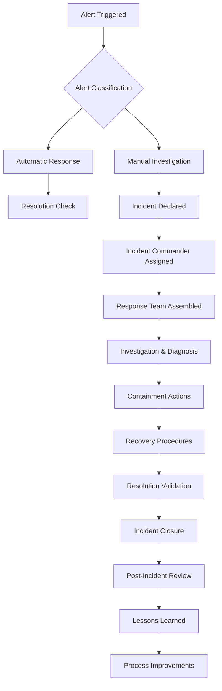
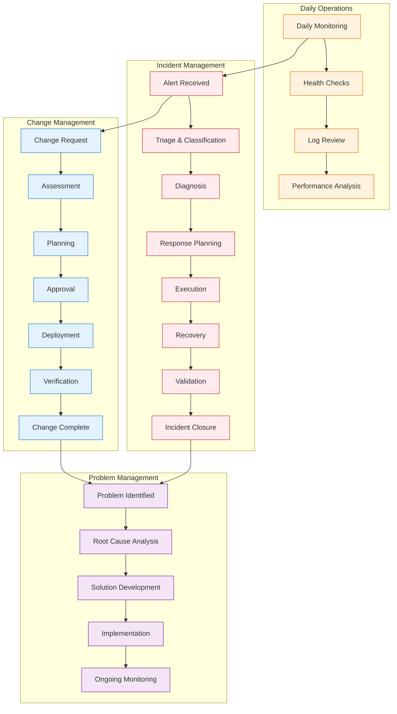
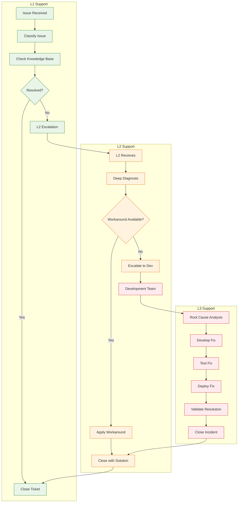
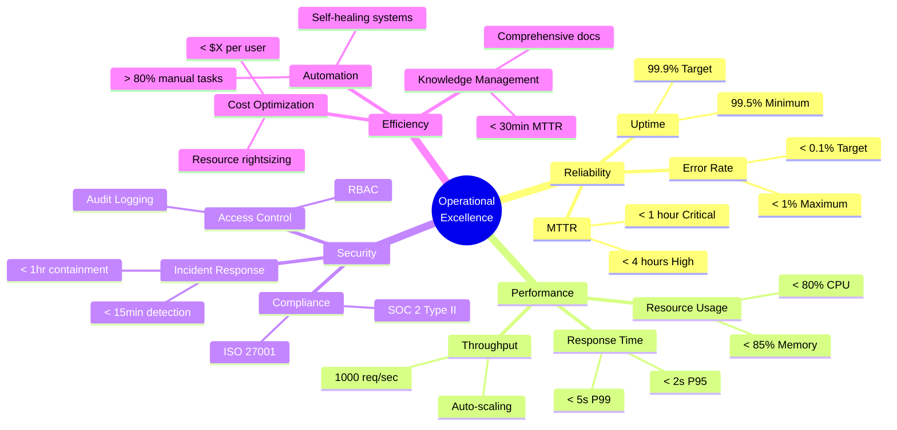
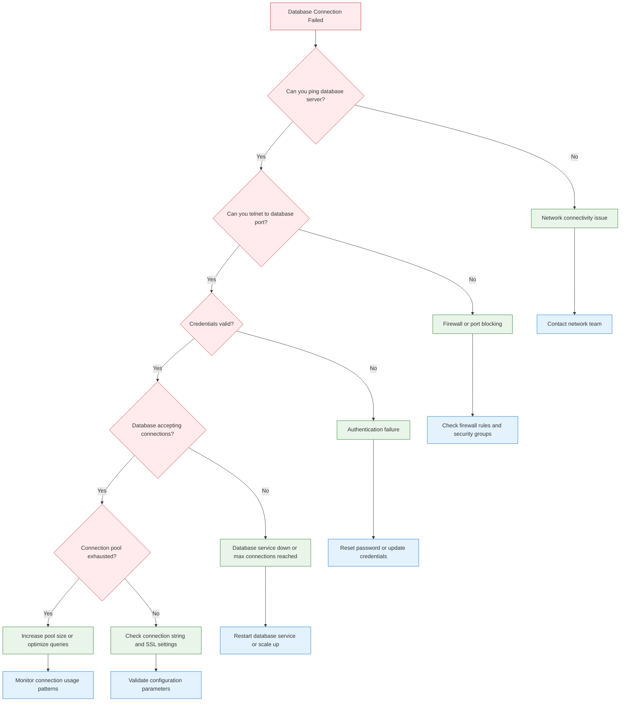
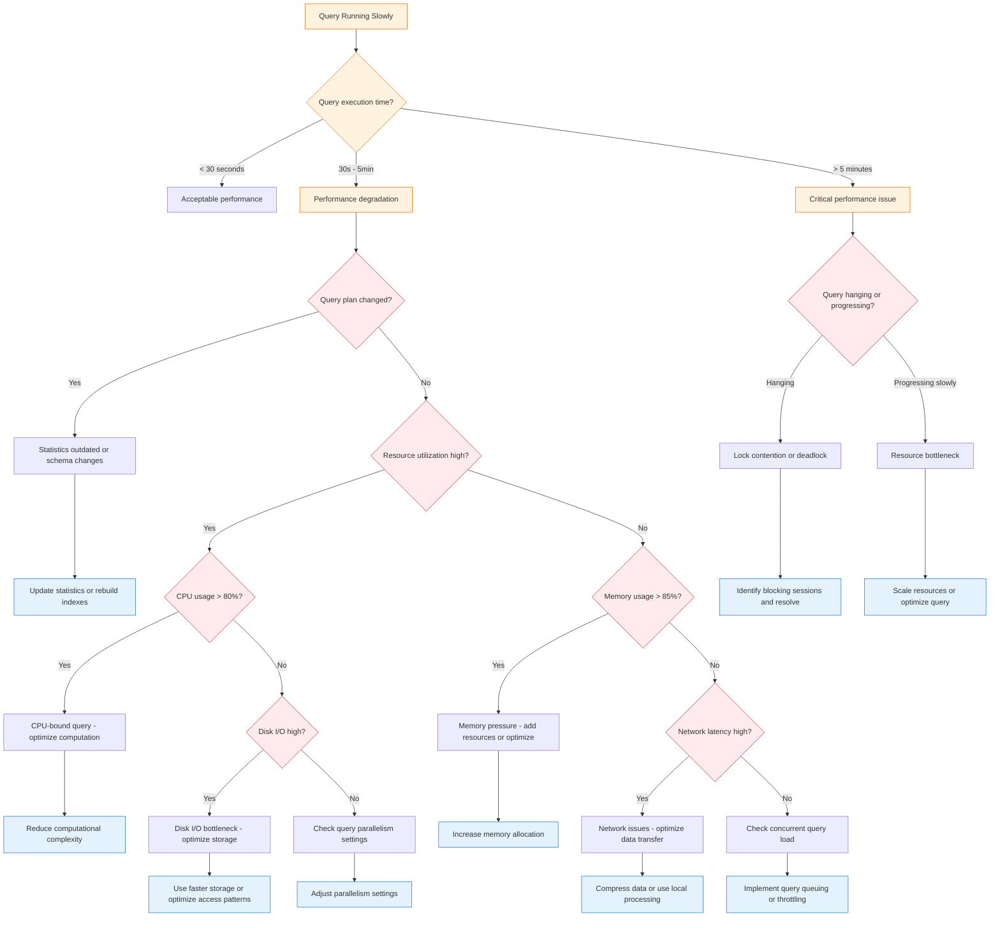
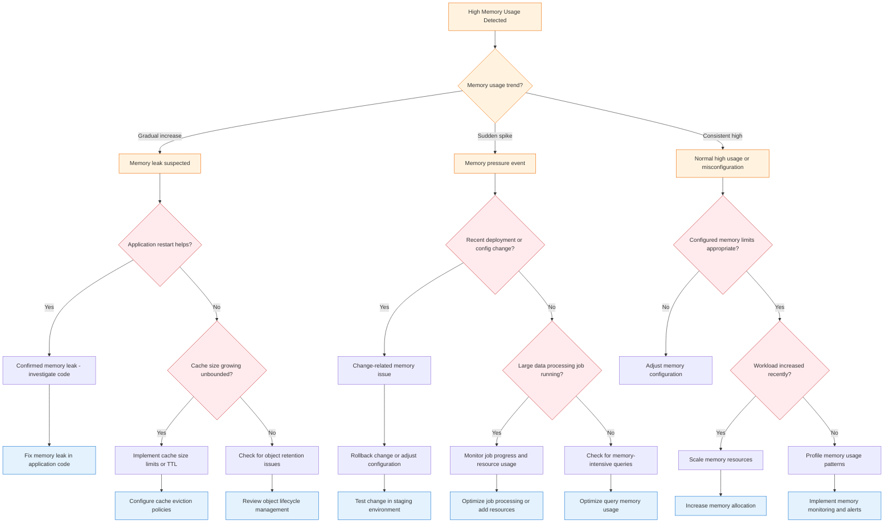

# Operating Model

> **BIS Handbook 2.0** — Runbooks, Service Delivery, and Operational Excellence  
> **Last Updated:** September 13, 2025  
> **Navigation:** [🏠 Main Handbook](../README.md) | [Previous: Augmented Workload](09-Augmented-Workload.md) | [Next: Product Development](11-Product-Development.md)

---

## Section Overview

**Overview:** Runbooks, service delivery, and operational excellence frameworks. Defines operational processes and procedures.

**Target Audience:** Operations teams, service managers, support staff, and operational leaders.

**How to Use:** Use runbooks for operational procedures, apply service delivery frameworks, follow operational excellence practices.

**Key Content:** Runbook procedures, service delivery models, operational excellence frameworks, SLA management, incident response.

**Use Cases:** Service delivery, incident management, operational planning, performance monitoring, process improvement.

---

## Table of Contents

- [Runbook and Operations](#runbook-and-operations)
- [Service Delivery and Support](#service-delivery-and-support)
- [Troubleshooting and Error Triage](#troubleshooting-and-error-triage)
- [SLAs and XLAs](#slas-and-xlas)
- [L1/L2 Support Model](#l1l2-support-model)
- [Navigation](#navigation)

---

## Runbook and Operations

### Runbook at a Glance
Comprehensive operational procedures for BIS delivery and maintenance.

### Run Flow
- **Entry Trigger:** Scheduler or manual GUI run
- **Stages:** Ingest → Normalize → Consolidate → Validate → Publish → Report → Deliver
- **Handoffs & Queues:** Scheduler gating, manual approval for external delivery
- **Outcomes:** Parquet artifacts, DuckDB views, Excel reports, delivery receipts/logs

### Operator Tips
- Quality gates fail fast with clear messages
- Lineage makes impact analysis and audits a breeze
- Idempotent operations ensure safe retries without side effects

---

## Service Delivery and Support

### Report as a Code (Main BIS Focus)
Configuration-driven report generation and delivery.

### Operator Playbook
Step-by-step procedures for operational tasks.

### L1/L2 Support Model
Tiered support structure for issue resolution.

### Error Triage and Feedback Loop
Systematic approach to identifying, categorizing, and resolving operational issues.

### Support and SLAs/XLAs
Service level management and experience level agreements.

### Troubleshooting Catalog
Comprehensive guide to common issues and their resolutions.

---

## Troubleshooting and Error Triage

### Error Categories
- **Data Quality Issues:** Validation failures, schema drift
- **Performance Problems:** Slow queries, resource constraints
- **Delivery Failures:** Email issues, file system errors
- **Configuration Errors:** Invalid YAML, missing dependencies

### Triage Process
1. **Initial Assessment:** Log review, error classification
2. **Impact Analysis:** Affected systems, business impact
3. **Root Cause Analysis:** Systematic investigation
4. **Resolution Planning:** Fix development and testing
5. **Implementation:** Safe deployment with rollback plan
6. **Post-Mortem:** Lessons learned and preventive measures

---

## SLAs and XLAs

### SLA vs XLA Comparison

| Aspect | SLA | XLA |
|---|---|---|
| Focus | Outputs | Outcomes |
| Measurement | Processes | Value added |
| Consequences | Sanctions | Rewards |
| Targets | Fixed | Flexible |
| Success criteria | Time Budget Scope | Business value |
| Deliverables | Technical | User experience |
| Assessment | Objective | Subjective |
| Perspective | Vendor | Customer |
| Evaluation | Binary | Quantitative |
| Scope | Atomic | Holistic |

### Operationalization Notes
- Use CSV-driven weights and priorities to compute context-aware scores
- Autoranked actions drive delivery order and owner focus

---

## L1/L2 Support Model

### Level 1 (L1) Support
- **First-line response** to operational issues
- **Initial triage** and basic troubleshooting
- **Escalation** to L2 for complex issues
- **Documentation** of symptoms and initial findings

### Level 2 (L2) Support
- **Advanced troubleshooting** and root cause analysis
- **Configuration changes** and system optimizations
- **Coordination** with development team for code fixes
- **Knowledge base** maintenance and updates

### Support Workflow
1. **Issue Intake:** L1 receives and categorizes issue
2. **Initial Response:** L1 provides immediate workarounds if available
3. **Escalation:** Complex issues moved to L2 within defined timeframe
4. **Resolution:** L2 implements permanent fixes
5. **Closure:** Issue documented and knowledge base updated

---

## Navigation

**[🏠 Main Handbook](../handbook2/Handbook.md)** | **[Previous: Augmented Workload](Augmented-Workload.md)** | **[Next: Product Development](Product-Development.md)**

### Quick Links
- [📋 Complete Table of Contents](../handbook2/Handbook.md#table-of-contents)
- [🎯 Executive Summary](../handbook2/Handbook.md#executive-summary)
- [🔗 Key Resources](../handbook2/Handbook.md#key-resources)
- [📚 All Handbook Sections](../handbook2/Handbook.md#handbook-sections)

---

## Operational Runbooks and Procedures

### Comprehensive Runbook Framework

#### Runbook Categories and Structure
- **Standard Operating Procedures (SOPs)**: Day-to-day operational tasks and maintenance activities
- **Emergency Response Procedures**: Incident response, disaster recovery, and crisis management
- **Deployment Runbooks**: Application deployment, configuration changes, and system updates
- **Monitoring and Alert Response**: Automated alert handling and manual intervention procedures
- **Maintenance Runbooks**: Scheduled maintenance, patching, and system upgrades

#### Runbook Components
- **Purpose and Scope**: Clear objectives, applicability, and limitations
- **Prerequisites**: Required access, tools, and environmental conditions
- **Step-by-Step Instructions**: Detailed procedures with decision points and error handling
- **Validation Steps**: Success criteria and verification procedures
- **Rollback Procedures**: Safe reversal steps and recovery mechanisms
- **Documentation Requirements**: Logging, reporting, and knowledge base updates

### Deployment and Release Management

#### Deployment Strategies

##### Blue-Green Deployment
```yaml
deployment_strategy: blue_green
environments:
  blue:
    version: "v1.2.3"
    traffic_percentage: 0
    health_checks:
      - endpoint: "/health"
        timeout: 30
      - metric: "error_rate"
        threshold: 0.01
  green:
    version: "v1.3.0"
    traffic_percentage: 100
    health_checks:
      - endpoint: "/health"
        timeout: 30
      - metric: "response_time"
        threshold: 2000
rollback_plan:
  traffic_shift_duration: 300
  monitoring_window: 1800
  auto_rollback_threshold: 0.05
```

##### Canary Deployment
- **Traffic Routing**: Gradual traffic shifting with percentage-based controls
- **Success Metrics**: Response time, error rate, and business KPIs monitoring
- **Automated Rollback**: Threshold-based automatic reversion to previous version
- **Staged Rollout**: Environment-specific deployment with progressive exposure

##### Feature Flags and Dark Launches
- **Flag Management**: Centralized feature flag service with role-based access
- **Gradual Rollout**: Percentage-based user exposure and A/B testing capabilities
- **Kill Switches**: Emergency disable functionality for problematic features
- **Audit Trail**: Complete history of flag changes and user impact

#### Release Management Process

##### Release Planning
- **Release Calendar**: Scheduled release windows and blackout periods
- **Change Approval**: Change Advisory Board (CAB) review and approval
- **Risk Assessment**: Impact analysis and rollback planning
- **Stakeholder Communication**: Release notifications and coordination

##### Release Execution
- **Pre-Release Validation**: Automated testing, security scanning, and performance validation
- **Deployment Automation**: Infrastructure as code and configuration management
- **Post-Release Monitoring**: Real-time health checks and performance monitoring
- **Go/No-Go Decision**: Release success criteria and abort procedures

##### Release Retrospective
- **Success Metrics**: Deployment success rate, incident count, and recovery time
- **Lessons Learned**: Process improvements and best practice updates
- **Documentation Updates**: Runbook updates and knowledge base enhancements

### Monitoring and Observability Framework

#### Comprehensive Monitoring Architecture

##### Application Monitoring
- **Performance Metrics**: Response time, throughput, error rates, and resource utilization
- **Business Metrics**: User engagement, conversion rates, and key performance indicators
- **Custom Metrics**: Domain-specific measurements and alerting thresholds
- **Distributed Tracing**: Request flow tracking across microservices and external dependencies

##### Infrastructure Monitoring
- **System Metrics**: CPU, memory, disk, and network utilization
- **Container Metrics**: Kubernetes pod health, resource consumption, and scaling events
- **Cloud Services**: API usage, service limits, and cost monitoring
- **Network Monitoring**: Connectivity, latency, and packet loss tracking

##### Log Management and Analysis
```yaml
logging_configuration:
  levels:
    - name: DEBUG
      retention_days: 7
      compression: gzip
    - name: INFO
      retention_days: 30
      compression: gzip
    - name: WARN
      retention_days: 90
      compression: gzip
    - name: ERROR
      retention_days: 365
      compression: gzip
  structured_logging:
    format: json
    fields:
      - timestamp
      - level
      - service
      - request_id
      - user_id
      - message
      - stack_trace
  log_shipping:
    destination: centralized_aggregator
    batch_size: 1000
    flush_interval: 30
```

#### Alerting and Incident Response

##### Alert Classification and Routing
- **Severity Levels**: Critical, High, Medium, Low, Informational
- **Alert Enrichment**: Contextual information and runbook links
- **Escalation Policies**: Time-based escalation and on-call rotation
- **Suppression Rules**: Alert deduplication and noise reduction

##### Incident Response Process


### Comprehensive Operational Workflow



### Support Model Visualization



### Support Model Comparison

| **Model** | **L1 Focus** | **L2 Focus** | **L3 Focus** | **Resolution Time** | **Cost Efficiency** | **BIS Recommendation** |
|-----------|-------------|-------------|-------------|-------------------|-------------------|----------------------|
| **Tiered Support** | Basic triage, KB lookup | Deep diagnosis, workarounds | Root cause, permanent fixes | 2-4 hours | High | 🟢 Recommended |
| **Swarm Support** | Collaborative problem-solving | Cross-functional analysis | Expert consultation | 1-2 hours | Medium | 🟡 Optional |
| **Follow-the-Sun** | 24/7 basic support | Regional expertise | Global specialists | < 1 hour | Low | 🔴 Not Recommended |
| **Self-Service** | Guided troubleshooting | Expert chat | Escalation only | Variable | Very High | 🟢 Recommended |

### Incident Priority Matrix

| **Priority** | **Impact** | **Urgency** | **Response Time** | **Resolution Time** | **Examples** |
|-------------|------------|------------|------------------|-------------------|-------------|
| **Critical** | System down, data loss | Immediate action required | < 15 minutes | < 2 hours | Production outage, security breach |
| **High** | Major feature broken | Business impact significant | < 1 hour | < 4 hours | Core functionality failure |
| **Medium** | Minor feature issues | Some business impact | < 4 hours | < 24 hours | Non-critical feature broken |
| **Low** | Cosmetic issues | Minimal impact | < 24 hours | < 72 hours | UI inconsistencies, minor bugs |

### Monitoring Strategy Comparison

| **Strategy** | **Best For** | **Detection Speed** | **False Positives** | **Maintenance** | **Scalability** |
|-------------|-------------|-------------------|-------------------|---------------|---------------|
| **Threshold-based** | Known patterns, stable systems | Fast | Medium | Low | High |
| **Anomaly Detection** | Dynamic environments, new patterns | Variable | High | High | Medium |
| **Log Analysis** | Troubleshooting, forensics | Slow | Low | Medium | High |
| **Synthetic Monitoring** | User journey validation | Fast | Low | Medium | Medium |
| **Real User Monitoring** | Performance insights | Real-time | Low | Low | High |

### SLA Management Framework

| SLA Type | Response Time | Resolution Time | Escalation | Monitoring |
|----------|---------------|-----------------|------------|------------|
| **Critical** | 15 minutes | 2 hours | Immediate | Real-time |
| **High** | 1 hour | 4 hours | 2 hours | Hourly |
| **Medium** | 4 hours | 24 hours | 8 hours | Daily |
| **Low** | 24 hours | 72 hours | 48 hours | Weekly |

### Operational Excellence Metrics



##### Incident Management Workflow
1. **Detection**: Automated monitoring and manual reporting
2. **Assessment**: Impact analysis and severity classification
3. **Response**: Coordinated team response and communication
4. **Resolution**: Root cause identification and fix implementation
5. **Recovery**: System restoration and validation
6. **Review**: Post-incident analysis and improvement actions

### Service Level Management

#### SLA/XLA Framework Implementation

##### Service Level Objectives (SLOs)
- **Availability SLOs**: Uptime percentages and maintenance windows
- **Performance SLOs**: Response time and throughput targets
- **Quality SLOs**: Error rates and data accuracy requirements
- **Security SLOs**: Incident response time and breach notification

##### Experience Level Agreements (XLAs)
- **User Experience Metrics**: Task completion rates and user satisfaction scores
- **Business Impact Metrics**: Revenue impact and operational efficiency measures
- **Stakeholder Satisfaction**: Survey results and feedback analysis
- **Value Delivery Metrics**: Business outcome achievement and ROI measurement

##### SLA Management Process
- **SLA Definition**: Stakeholder negotiation and agreement establishment
- **Monitoring and Reporting**: Continuous measurement and dashboard reporting
- **Non-Compliance Handling**: Breach notification and remediation planning
- **Continuous Improvement**: SLA review and adjustment based on business needs

### Operational Excellence Practices

#### Continuous Improvement Framework

##### Kaizen Methodology
- **Daily Improvements**: Small, incremental process enhancements
- **Problem Solving**: Root cause analysis and systematic improvement
- **Standardization**: Best practice documentation and process consistency
- **Employee Empowerment**: Front-line staff involvement in improvement initiatives

##### Lean Operations
- **Value Stream Mapping**: Process flow analysis and waste identification
- **Just-in-Time**: Resource optimization and inventory management
- **Pull Systems**: Demand-driven work allocation and capacity planning
- **Continuous Flow**: Work-in-progress limits and bottleneck elimination

#### Capacity Planning and Management

##### Resource Forecasting
- **Workload Analysis**: Historical patterns and future demand prediction
- **Capacity Modeling**: Resource requirements and scaling projections
- **Bottleneck Identification**: Performance constraints and optimization opportunities
- **Cost-Benefit Analysis**: Investment decisions and ROI calculations

##### Scalability Planning
- **Horizontal Scaling**: Load distribution and service replication
- **Vertical Scaling**: Resource upgrade and performance optimization
- **Auto-Scaling**: Automated resource adjustment based on demand
- **Disaster Recovery**: Backup systems and failover capabilities

#### Knowledge Management and Documentation

##### Operational Knowledge Base
- **Runbook Library**: Comprehensive procedure documentation
- **Troubleshooting Guides**: Common issues and resolution steps
- **Best Practice Repository**: Proven solutions and optimization techniques
- **Training Materials**: Onboarding guides and skill development resources

##### Documentation Standards
- **Content Structure**: Consistent format and navigation
- **Version Control**: Change tracking and approval workflows
- **Review Process**: Technical accuracy and usability validation
- **Maintenance Schedule**: Regular updates and freshness checks

### Security Operations Center (SOC) Integration

#### Security Monitoring and Response
- **Threat Detection**: Anomaly identification and security event monitoring
- **Incident Response**: Coordinated security incident handling
- **Vulnerability Management**: Patch management and security updates
- **Compliance Monitoring**: Regulatory requirement adherence

#### Access Management and Controls
- **Identity Governance**: User lifecycle management and access rights
- **Privileged Access**: Elevated permission management and monitoring
- **Multi-Factor Authentication**: Enhanced authentication security
- **Session Management**: Secure session handling and timeout controls

### Operational Strategy Comparison Tables

#### Capacity Planning Approaches

| **Approach** | **Best For** | **Planning Horizon** | **Accuracy** | **Resource Intensity** | **BIS Recommendation** |
|-------------|-------------|-------------------|-------------|----------------------|----------------------|
| **Reactive** | Small teams, stable workloads | Short-term (1-3 months) | Low | Low | 🔴 Not Recommended |
| **Predictive** | Historical patterns, seasonal demand | Medium-term (3-12 months) | Medium | Medium | 🟡 Optional |
| **Adaptive** | Dynamic environments, new products | Rolling forecasts (1-6 months) | High | High | 🟢 Recommended |
| **Data-Driven** | Large scale, complex systems | Long-term (6-24 months) | Very High | Very High | 🟢 Recommended |

#### Incident Response Strategies

| **Strategy** | **Response Time** | **Coordination** | **Documentation** | **Learning** | **Best Use Case** |
|-------------|------------------|----------------|-------------------|-------------|------------------|
| **Swarm Response** | Fast (< 30 min) | High collaboration | Minimal during | Real-time | Critical system outages |
| **Tiered Escalation** | Variable (30 min - 4 hrs) | Structured | Comprehensive | Post-incident | Complex technical issues |
| **Follow-the-Sun** | 24/7 coverage | Global teams | Detailed handoffs | Continuous | International operations |
| **Automated Response** | Immediate (< 5 min) | Minimal human | Full automation logs | AI-driven | Known pattern issues |

#### Knowledge Management Systems

| **System Type** | **Content Types** | **Search Capability** | **Collaboration** | **Maintenance** | **Scalability** |
|----------------|------------------|---------------------|-------------------|----------------|---------------|
| **Wiki-based** | Text, diagrams, guides | Full-text search | Version control | Medium | High |
| **Document CMS** | Structured docs, PDFs | Metadata search | Workflow approval | High | Medium |
| **Q&A Platform** | Questions, answers, discussions | Semantic search | Community-driven | Low | Very High |
| **Integrated Platform** | All types, multimedia | AI-powered search | Real-time editing | Medium | High |

#### Continuous Improvement Methodologies

| **Methodology** | **Focus Area** | **Time Investment** | **Measurable Outcomes** | **Team Size** | **BIS Fit** |
|----------------|---------------|-------------------|----------------------|-------------|-----------|
| **Kaizen** | Daily improvements | Low (15-30 min/day) | Process efficiency | Any size | 🟢 Excellent |
| **Six Sigma** | Quality defects | High (weeks/months) | Defect reduction | Large teams | 🟡 Good |
| **Lean** | Waste elimination | Medium (ongoing) | Value delivery | Medium-large | 🟢 Excellent |
| **Agile Retrospectives** | Sprint improvements | Low (1-2 hours/sprint) | Team velocity | Small-medium | 🟢 Excellent |

This comprehensive operating model ensures efficient, scalable, and secure delivery of BIS services while maintaining high standards of quality and compliance.

---

## Legacy Content from 08-Delivery-Operations.md

# 08. Delivery Operations

> **Purpose:** Comprehensive delivery operations framework for BIS  
> **Audience:** Operations Teams, Delivery Managers, Technical Teams  
> **Last Updated:** 2025-09-03

**Previous:** [07. AI Practices](07-AI-Practices.md) | **Next:** [09. Release Management](09-Release-Management.md)  
**Up:** [BIS Handbook](../Handbook.md) | **Section:** [Operations](08-Delivery-Operations.md)

---

## BIS Delivery Operations Framework

### Overview
BIS Delivery Operations encompasses the complete lifecycle of service delivery, from initial planning through deployment and ongoing support. This framework ensures consistent, high-quality delivery across all BIS domains while maintaining operational excellence and customer satisfaction.

### Key Components

#### 1. **Delivery Planning**
- **Capacity Planning**: Resource allocation based on demand forecasting
- **Risk Assessment**: Proactive identification and mitigation of delivery risks
- **Timeline Management**: Realistic scheduling with buffer time for contingencies
- **Stakeholder Alignment**: Clear communication of expectations and dependencies

#### 2. **Quality Assurance**
- **Code Review Standards**: Mandatory peer reviews for all code changes
- **Automated Testing**: Comprehensive test coverage including unit, integration, and performance tests
- **Security Scanning**: Continuous security assessment throughout the delivery pipeline
- **Compliance Checks**: Automated validation against regulatory and organizational standards

#### 3. **Deployment Strategy**
- **Environment Management**: Consistent configuration across dev, test, staging, and production
- **Rollback Procedures**: Well-defined processes for reverting changes when necessary
- **Monitoring Setup**: Comprehensive observability for deployed services
- **Documentation Updates**: Automatic generation and publishing of deployment documentation

#### 4. **Support Readiness**
- **Knowledge Transfer**: Complete documentation and training for support teams
- **Incident Response**: Established procedures for handling production issues
- **Performance Monitoring**: Continuous tracking of service health and performance
- **Customer Communication**: Clear protocols for communicating with stakeholders during delivery

### Delivery Metrics

| Metric Category | Key Metrics | Target | Measurement |
|----------------|-------------|--------|-------------|
| **Quality** | Defect Density, Test Coverage, Code Quality Score | < 0.5 defects/KLOC, > 90% coverage | Automated tools, manual reviews |
| **Timeliness** | On-Time Delivery, Cycle Time, Lead Time | > 95% on-time, < 2 weeks cycle | Project tracking, CI/CD metrics |
| **Efficiency** | Resource Utilization, Cost Variance, Automation Rate | > 85% utilization, < 5% variance | Resource management, financial tracking |
| **Customer Satisfaction** | Delivery Satisfaction Score, Support Ticket Resolution | > 4.5/5, < 4 hours resolution | Surveys, ticketing system |

### Risk Management

#### Common Delivery Risks
- **Technical Risks**: Architecture issues, technology stack problems, integration challenges
- **Resource Risks**: Skill gaps, team capacity constraints, vendor dependencies
- **Schedule Risks**: Scope creep, dependency delays, resource conflicts
- **Quality Risks**: Testing gaps, security vulnerabilities, performance issues

#### Mitigation Strategies
- **Technical**: Proof-of-concept validation, technology spikes, expert consultation
- **Resource**: Skills assessment, training programs, contingency staffing
- **Schedule**: Agile planning, regular progress reviews, scope management
- **Quality**: Automated quality gates, peer reviews, independent testing

### Continuous Improvement

#### Feedback Loops
- **Retrospective Analysis**: Regular review of delivery performance and lessons learned
- **Metrics Review**: Monthly analysis of delivery metrics and trend identification
- **Process Optimization**: Continuous refinement of delivery processes and tools
- **Technology Updates**: Regular evaluation and adoption of new delivery technologies

#### Innovation Initiatives
- **Automation Enhancement**: Increased adoption of CI/CD and DevOps practices
- **Tool Integration**: Seamless integration of development, testing, and operations tools
- **Skill Development**: Ongoing training and certification programs for delivery teams
- **Process Standardization**: Development of reusable delivery templates and frameworks

## Legacy Content from 09-Release-Management.md

# 09. Release Management

> **Purpose:** Comprehensive release management framework for BIS  
> **Audience:** Release Managers, DevOps Teams, Technical Leads  
> **Last Updated:** 2025-09-03

**Previous:** [08. Delivery Operations](08-Delivery-Operations.md) | **Next:** [10. DevOps](10-DevOps.md)  
**Up:** [BIS Handbook](../Handbook.md) | **Section:** [Operations](08-Delivery-Operations.md)

---

## BIS Release Management Framework

### Overview
Release Management in BIS encompasses the planning, scheduling, and controlling of software releases across the entire product portfolio. This framework ensures smooth, predictable releases while minimizing risk and maximizing business value.

### Release Types

#### 1. **Major Releases**
- **Frequency**: Quarterly or bi-annually
- **Scope**: Significant new features, architectural changes
- **Process**: Extended testing cycles, comprehensive documentation
- **Stakeholder Involvement**: High - business stakeholders, key customers

#### 2. **Minor Releases**
- **Frequency**: Monthly
- **Scope**: Feature enhancements, bug fixes, performance improvements
- **Process**: Standard release process with automated testing
- **Stakeholder Involvement**: Medium - product owners, development teams

#### 3. **Patch Releases**
- **Frequency**: As needed (weekly or bi-weekly)
- **Scope**: Critical bug fixes, security patches
- **Process**: Expedited process with minimal testing
- **Stakeholder Involvement**: Low - operations teams, security team

#### 4. **Emergency Releases**
- **Frequency**: As required
- **Scope**: Critical security fixes, system stability issues
- **Process**: Bypass standard process with executive approval
- **Stakeholder Involvement**: High - executive team, security team

### Release Planning

#### Release Calendar
- **Annual Planning**: High-level release schedule aligned with business objectives
- **Quarterly Planning**: Detailed planning for upcoming quarter's releases
- **Monthly Planning**: Fine-tuning of release schedules and dependencies
- **Weekly Planning**: Tactical planning for immediate releases

#### Dependency Management
- **Internal Dependencies**: Coordination between development teams
- **External Dependencies**: Third-party vendors, infrastructure providers
- **Business Dependencies**: Marketing campaigns, customer communications
- **Regulatory Dependencies**: Compliance requirements, audit schedules

### Release Process

#### Phase 1: Planning
- **Scope Definition**: Clear definition of release contents and objectives
- **Risk Assessment**: Identification and mitigation of release risks
- **Resource Allocation**: Assignment of team members and responsibilities
- **Communication Plan**: Stakeholder notification and coordination

#### Phase 2: Development
- **Feature Development**: Implementation of planned features and fixes
- **Code Integration**: Merging of code changes into release branch
- **Testing**: Comprehensive testing including unit, integration, and user acceptance
- **Documentation**: Update of user and technical documentation

#### Phase 3: Staging
- **Environment Setup**: Configuration of staging environment
- **Deployment Testing**: Validation of deployment procedures
- **Performance Testing**: Load and performance validation
- **Security Testing**: Final security assessment and validation

#### Phase 4: Production
- **Deployment Execution**: Controlled rollout to production environment
- **Monitoring**: Real-time monitoring of deployment and system health
- **Rollback Planning**: Preparation for potential rollback scenarios
- **Go-Live Support**: On-call support during initial production period

### Quality Gates

#### Automated Gates
- **Code Quality**: Static analysis, code coverage, security scanning
- **Build Success**: Successful compilation and packaging
- **Test Results**: Passing unit and integration tests
- **Performance Benchmarks**: Meeting established performance criteria

#### Manual Gates
- **Code Review**: Peer review of all code changes
- **Architecture Review**: Validation of architectural decisions
- **Security Review**: Assessment of security implications
- **Business Review**: Validation of business requirements and user stories

### Release Metrics

| Metric Category | Key Metrics | Target | Measurement |
|----------------|-------------|--------|-------------|
| **Quality** | Release Defect Rate, Rollback Rate | < 1 defect/release, < 5% rollbacks | Issue tracking, deployment logs |
| **Timeliness** | Release Frequency, Deployment Time | 2-4 weeks cycle, < 2 hours deployment | Release calendar, CI/CD metrics |
| **Reliability** | Uptime Post-Release, Incident Rate | > 99.9% uptime, < 0.1 incidents/release | Monitoring tools, incident reports |
| **Efficiency** | Release Preparation Time, Automation Rate | < 20% of cycle time, > 90% automated | Time tracking, process metrics |

### Risk Management

#### Release Risks
- **Technical Risks**: Deployment failures, performance degradation, integration issues
- **Business Risks**: Feature delays, scope changes, stakeholder dissatisfaction
- **Operational Risks**: Resource constraints, team availability, tool failures
- **Compliance Risks**: Regulatory violations, security breaches, audit findings

#### Mitigation Strategies
- **Technical**: Comprehensive testing, gradual rollouts, monitoring
- **Business**: Clear requirements, regular communication, change management
- **Operational**: Resource planning, backup procedures, tool redundancy
- **Compliance**: Security reviews, compliance checks, audit preparation

### Continuous Improvement

#### Feedback Collection
- **Post-Release Reviews**: Analysis of release success and lessons learned
- **Stakeholder Surveys**: Collection of feedback from all involved parties
- **Metrics Analysis**: Trend analysis and identification of improvement opportunities
- **Process Audits**: Regular review of release processes and procedures

#### Process Optimization
- **Automation**: Increased use of automated testing and deployment tools
- **Standardization**: Development of reusable release templates and checklists
- **Training**: Ongoing education and certification for release team members
- **Technology Adoption**: Evaluation and implementation of new release management tools

## Legacy Content from 10-DevOps.md

# 10. DevOps

> **Purpose:** Comprehensive DevOps framework for BIS  
> **Audience:** DevOps Engineers, Development Teams, Operations Teams  
> **Last Updated:** 2025-09-03

**Previous:** [09. Release Management](09-Release-Management.md) | **Next:** [11. Support Engineering](11-Support-Engineering.md)  
**Up:** [BIS Handbook](../Handbook.md) | **Section:** [Operations](08-Delivery-Operations.md)

---

## BIS DevOps Framework

### Overview
DevOps in BIS represents the integration of development and operations practices to enable faster, more reliable software delivery. This framework encompasses the entire software lifecycle from code development through production operations.

### Core Principles

#### 1. **Automation**
- **Infrastructure as Code**: Automated provisioning and configuration of infrastructure
- **CI/CD Pipelines**: Automated build, test, and deployment processes
- **Monitoring and Alerting**: Automated system health monitoring and incident response
- **Security Automation**: Automated security scanning and compliance checks

#### 2. **Collaboration**
- **Cross-Functional Teams**: Development, operations, and security working together
- **Shared Responsibility**: Collective ownership of quality and reliability
- **Knowledge Sharing**: Regular communication and documentation practices
- **Continuous Feedback**: Ongoing improvement through metrics and retrospectives

#### 3. **Monitoring and Observability**
- **Application Metrics**: Performance, error rates, and user experience tracking
- **Infrastructure Monitoring**: System resources, network, and service health
- **Log Aggregation**: Centralized logging for troubleshooting and analysis
- **Alert Management**: Proactive notification and incident response

#### 4. **Security Integration**
- **DevSecOps**: Security practices integrated throughout the development lifecycle
- **Automated Security Testing**: Continuous security scanning and vulnerability assessment
- **Compliance Automation**: Automated compliance checks and reporting
- **Access Management**: Secure access controls and audit trails

### DevOps Pipeline

#### Continuous Integration (CI)
- **Automated Builds**: Triggered builds on code commits
- **Code Quality Checks**: Static analysis, linting, and code coverage
- **Unit Testing**: Automated execution of unit test suites
- **Integration Testing**: Validation of component interactions

#### Continuous Delivery (CD)
- **Artifact Management**: Versioned storage of build artifacts
- **Environment Provisioning**: Automated setup of test and staging environments
- **Deployment Automation**: Scripted and repeatable deployment processes
- **Configuration Management**: Automated configuration of application settings

#### Continuous Deployment
- **Automated Releases**: Push-button deployment to production
- **Feature Flags**: Controlled rollout of new features
- **Rollback Automation**: Automated rollback procedures for failed deployments
- **Blue-Green Deployments**: Zero-downtime deployment strategies

### Infrastructure Management

#### Cloud Infrastructure
- **Auto-Scaling**: Dynamic resource allocation based on demand
- **Load Balancing**: Distribution of traffic across multiple instances
- **Disaster Recovery**: Automated backup and recovery procedures
- **Cost Optimization**: Resource usage monitoring and optimization

#### Container Orchestration
- **Container Registry**: Secure storage and distribution of container images
- **Orchestration Platform**: Automated deployment and scaling of containers
- **Service Mesh**: Traffic management and service-to-service communication
- **Configuration Management**: Centralized configuration for containerized applications

### Monitoring and Alerting

#### Application Monitoring
- **Performance Metrics**: Response times, throughput, and error rates
- **Business Metrics**: User engagement, conversion rates, and revenue tracking
- **Custom Dashboards**: Real-time visualization of key performance indicators
- **Anomaly Detection**: Automated identification of unusual patterns

#### Infrastructure Monitoring
- **System Metrics**: CPU, memory, disk, and network utilization
- **Service Health**: Availability and responsiveness of services
- **Log Analysis**: Centralized logging and log correlation
- **Synthetic Monitoring**: Simulated user interactions for proactive monitoring

### Security Practices

#### Security Automation
- **Vulnerability Scanning**: Automated detection of security vulnerabilities
- **Dependency Checking**: Automated analysis of third-party dependencies
- **Secrets Management**: Secure storage and rotation of sensitive credentials
- **Access Control**: Role-based access control and least privilege principles

#### Compliance and Audit
- **Automated Compliance**: Continuous validation against security standards
- **Audit Trails**: Comprehensive logging of all system activities
- **Incident Response**: Automated response to security incidents
- **Forensic Analysis**: Detailed investigation of security events

### DevOps Metrics

| Metric Category | Key Metrics | Target | Measurement |
|----------------|-------------|--------|-------------|
| **Deployment** | Deployment Frequency, Lead Time, Failure Rate | Daily, < 1 hour, < 5% | CI/CD tools, deployment logs |
| **Quality** | Test Coverage, Code Quality, Security Score | > 90%, A grade, > 95% | Testing tools, static analysis |
| **Performance** | Response Time, Uptime, Error Rate | < 200ms, > 99.9%, < 0.1% | Monitoring tools, APM |
| **Efficiency** | MTTR, Automation Rate, Resource Utilization | < 1 hour, > 90%, > 85% | Incident tracking, process metrics |

### Continuous Improvement

#### Feedback Loops
- **Retrospective Meetings**: Regular review of processes and outcomes
- **Metrics Analysis**: Data-driven identification of improvement opportunities
- **Experimentation**: A/B testing and gradual rollout of changes
- **Knowledge Sharing**: Documentation and training for best practices

#### Tool Ecosystem
- **CI/CD Platforms**: Jenkins, GitLab CI, GitHub Actions
- **Infrastructure Tools**: Terraform, Ansible, Kubernetes
- **Monitoring Tools**: Prometheus, Grafana, ELK Stack
- **Security Tools**: SonarQube, OWASP ZAP, Vault

## Legacy Content from 11-Support-Engineering.md

# 11. Support Engineering

> **Purpose:** Comprehensive support engineering framework for BIS  
> **Audience:** Support Engineers, Operations Teams, Development Teams  
> **Last Updated:** 2025-09-03

**Previous:** [10. DevOps](10-DevOps.md) | **Next:** [12. Advanced Topics](12-Advanced-Topics.md)  
**Up:** [BIS Handbook](../Handbook.md) | **Section:** [Operations](08-Delivery-Operations.md)

---

## BIS Support Engineering Framework

### Overview
Support Engineering in BIS encompasses the processes, tools, and practices for providing effective technical support to internal teams and external customers. This framework ensures rapid resolution of issues while building knowledge and preventing future problems.

### Support Model

#### Tiered Support Structure
- **Tier 1 (First Line)**: Basic troubleshooting, user guidance, ticket routing
- **Tier 2 (Technical)**: In-depth analysis, system diagnostics, solution implementation
- **Tier 3 (Expert)**: Complex issues, root cause analysis, product development coordination
- **Tier 4 (Vendor/Partner)**: Escalation to external vendors or specialized partners

#### Support Channels
- **Internal Ticketing**: JIRA Service Desk for internal team support
- **Customer Portal**: Self-service knowledge base and ticket submission
- **Live Chat**: Real-time support for urgent issues
- **Email/Phone**: Traditional support channels for complex communications

### Incident Management

#### Incident Classification
- **Severity 1 (Critical)**: System down, major functionality unavailable
- **Severity 2 (High)**: Significant impact, workarounds available
- **Severity 3 (Medium)**: Minor impact, non-critical functionality affected
- **Severity 4 (Low)**: Cosmetic issues, informational requests

#### Incident Response Process
- **Detection**: Automated monitoring alerts or user reports
- **Assessment**: Initial triage and severity classification
- **Diagnosis**: Root cause analysis and impact assessment
- **Resolution**: Implementation of fixes or workarounds
- **Communication**: Regular updates to stakeholders
- **Post-Incident Review**: Analysis and preventive measures

### Problem Management

#### Proactive Problem Solving
- **Trend Analysis**: Identification of recurring issues and patterns
- **Root Cause Analysis**: Deep investigation of underlying causes
- **Preventive Measures**: Implementation of fixes and process improvements
- **Knowledge Base Updates**: Documentation of solutions and workarounds

#### Problem Resolution Process
- **Problem Identification**: Recognition of systemic issues
- **Problem Analysis**: Detailed investigation and impact assessment
- **Solution Development**: Design and testing of permanent fixes
- **Solution Implementation**: Coordinated rollout of fixes
- **Effectiveness Monitoring**: Tracking of solution success and side effects

### Knowledge Management

#### Knowledge Base Structure
- **Articles**: Step-by-step guides and troubleshooting procedures
- **FAQs**: Common questions and answers
- **Video Tutorials**: Visual guides for complex procedures
- **Best Practices**: Preventive maintenance and optimization tips

#### Content Management
- **Creation**: Structured templates for consistent documentation
- **Review**: Peer review and validation of knowledge content
- **Maintenance**: Regular updates and retirement of outdated information
- **Search Optimization**: Tagging and categorization for easy discovery

### Support Tools and Technologies

#### Ticketing Systems
- **JIRA Service Desk**: Primary ticketing and service management platform
- **ServiceNow**: Enterprise service management for complex workflows
- **Zendesk**: Customer-facing support and communication platform

#### Monitoring and Diagnostics
- **Application Performance Monitoring**: Real-time performance tracking
- **Log Analysis Tools**: Centralized logging and correlation
- **Remote Access Tools**: Secure remote troubleshooting capabilities
- **Diagnostic Scripts**: Automated system health checks

### Support Metrics

| Metric Category | Key Metrics | Target | Measurement |
|----------------|-------------|--------|-------------|
| **Resolution** | First Response Time, Resolution Time, Resolution Rate | < 1 hour, < 4 hours, > 95% | Ticketing system, SLA tracking |
| **Quality** | Customer Satisfaction, Knowledge Base Usage | > 4.5/5, > 70% self-service | Surveys, usage analytics |
| **Efficiency** | Ticket Volume, Escalation Rate, Automation Rate | < 10% growth, < 5%, > 60% | Ticket tracking, process metrics |
| **Prevention** | Problem Prevention Rate, Knowledge Coverage | > 80%, > 90% | Incident analysis, content metrics |

### Continuous Improvement

#### Feedback Collection
- **Customer Surveys**: Regular feedback on support quality and effectiveness
- **Support Team Reviews**: Internal assessment of processes and tools
- **Trend Analysis**: Identification of common issues and improvement opportunities
- **Benchmarking**: Comparison with industry standards and best practices

#### Process Optimization
- **Automation**: Increased use of automated diagnostics and responses
- **Training**: Ongoing skill development and certification programs
- **Tool Enhancement**: Adoption of new technologies and process improvements
- **Collaboration**: Improved coordination between support and development teams

## Legacy Content from 13-Handbook-Maintenance.md

# 13. Handbook Maintenance

> **Purpose:** Comprehensive handbook maintenance framework for BIS  
> **Audience:** Documentation Teams, Technical Writers, Content Owners  
> **Last Updated:** 2025-09-03

**Previous:** [12. Advanced Topics](12-Advanced-Topics.md) | **Next:** [14. AI System Architecture](14-AI-System-Architecture.md)  
**Up:** [BIS Handbook](../Handbook.md) | **Section:** [Operations](08-Delivery-Operations.md)

---

## BIS Handbook Maintenance Framework

### Overview
Handbook Maintenance encompasses the processes, tools, and practices for keeping the BIS Handbook current, accurate, and valuable. This framework ensures that documentation evolves with the organization while maintaining high standards of quality and usability.

### Content Management

#### Content Lifecycle
- **Creation**: Development of new content based on identified needs
- **Review**: Regular assessment of content accuracy and relevance
- **Update**: Modification of existing content to reflect changes
- **Archival**: Retirement of outdated or obsolete content
- **Deletion**: Removal of content that is no longer applicable

#### Content Types
- **Procedural**: Step-by-step instructions and processes
- **Reference**: Technical specifications and configuration details
- **Guidelines**: Best practices and standards
- **Training**: Educational materials and tutorials
- **Policy**: Organizational policies and compliance requirements

### Maintenance Processes

#### Regular Reviews
- **Quarterly Reviews**: Comprehensive assessment of all content
- **Monthly Updates**: Incremental updates based on changes
- **Ad-hoc Reviews**: Immediate updates for critical changes
- **User Feedback**: Incorporation of user suggestions and corrections

#### Change Management
- **Change Requests**: Formal process for requesting content changes
- **Impact Assessment**: Evaluation of change implications
- **Approval Process**: Review and approval by content owners
- **Implementation**: Coordinated rollout of content changes

### Quality Assurance

#### Content Standards
- **Accuracy**: Technical correctness and factual accuracy
- **Completeness**: Comprehensive coverage of topics
- **Clarity**: Clear, understandable language and structure
- **Consistency**: Uniform formatting and terminology
- **Currency**: Up-to-date information and references

#### Review Processes
- **Peer Review**: Technical review by subject matter experts
- **Editorial Review**: Language and style review by technical writers
- **User Testing**: Validation of content usability and effectiveness
- **Compliance Review**: Verification of regulatory and policy compliance

### Documentation Tools

#### Authoring Tools
- **Markdown**: Primary format for content creation
- **Git**: Version control for documentation changes
- **GitHub**: Collaboration platform for content development
- **Visual Studio Code**: Primary editor for documentation work

#### Publishing Tools
- **GitHub Pages**: Automated publishing of documentation
- **PDF Generation**: Creation of printable documentation versions
- **Search Indexing**: Automated indexing for content discovery
- **Version Control**: Tracking of documentation versions and changes

### Collaboration Framework

#### Content Ownership
- **Subject Matter Experts**: Technical accuracy and content ownership
- **Technical Writers**: Editorial quality and structure
- **Content Reviewers**: Quality assurance and compliance
- **User Representatives**: User experience and practicality validation

#### Collaboration Tools
- **GitHub Issues**: Tracking of documentation tasks and requests
- **Pull Requests**: Review and approval of content changes
- **Discussions**: Community feedback and improvement suggestions
- **Wiki**: Collaborative content development and maintenance

### Metrics and Analytics

#### Content Metrics
- **Usage Analytics**: Page views, search queries, and user engagement
- **Update Frequency**: Rate of content updates and maintenance
- **Quality Scores**: Automated assessment of content quality
- **User Satisfaction**: Feedback on content usefulness and accuracy

#### Process Metrics
- **Review Cycle Time**: Time from change request to publication
- **Update Coverage**: Percentage of content updated regularly
- **Error Rates**: Frequency of content errors and corrections
- **Collaboration Efficiency**: Effectiveness of content development processes

### Continuous Improvement

#### Feedback Mechanisms
- **User Surveys**: Regular collection of user feedback
- **Usage Analysis**: Identification of content gaps and needs
- **Process Reviews**: Assessment of maintenance effectiveness
- **Technology Evaluation**: Adoption of new documentation tools

#### Innovation Initiatives
- **Automation**: Increased use of automated content generation
- **AI Assistance**: AI-powered content improvement and translation
- **Interactive Content**: Development of interactive tutorials and guides
- **Mobile Optimization**: Improved mobile access to documentation

## Legacy Content from 15-Technical-Architecture.md

# 15. Technical Architecture

> **Purpose:** Comprehensive technical architecture framework for BIS  
> **Audience:** Architects, Technical Leads, Development Teams  
> **Last Updated:** 2025-09-03

**Previous:** [14. AI System Architecture](14-AI-System-Architecture.md) | **Next:** [16. AI Model Ratings](16-AI-Model-Ratings.md)  
**Up:** [BIS Handbook](../Handbook.md) | **Section:** [Operations](08-Delivery-Operations.md)

---

## BIS Technical Architecture Framework

### Overview
The BIS Technical Architecture defines the fundamental structure and principles that guide the design, development, and evolution of BIS systems. This framework ensures consistency, scalability, and maintainability across all technical components.

### Architectural Principles

#### 1. **Modularity**
- **Component Isolation**: Clear boundaries between system components
- **Interface Standardization**: Consistent APIs and data formats
- **Dependency Management**: Controlled dependencies between modules
- **Reusability**: Design for component reuse across systems

#### 2. **Scalability**
- **Horizontal Scaling**: Ability to add resources dynamically
- **Performance Optimization**: Efficient resource utilization
- **Load Distribution**: Balanced workload across system components
- **Capacity Planning**: Proactive resource planning and allocation

#### 3. **Reliability**
- **Fault Tolerance**: Graceful handling of component failures
- **Redundancy**: Multiple instances for critical components
- **Monitoring**: Comprehensive system health monitoring
- **Recovery**: Automated recovery from failures

#### 4. **Security**
- **Defense in Depth**: Multiple layers of security controls
- **Data Protection**: Encryption and access controls for sensitive data
- **Compliance**: Adherence to security standards and regulations
- **Auditability**: Comprehensive logging and audit trails

### System Architecture

#### Application Layer
- **Web Interfaces**: User-facing web applications and portals
- **API Gateways**: Centralized API management and routing
- **Microservices**: Modular, independently deployable services
- **Batch Processing**: Scheduled and event-driven data processing

#### Data Layer
- **Relational Databases**: Structured data storage and querying
- **NoSQL Databases**: Flexible data storage for unstructured data
- **Data Warehouses**: Analytical data storage and processing
- **Caching Systems**: High-performance data caching and retrieval

#### Infrastructure Layer
- **Cloud Platforms**: Scalable cloud infrastructure and services
- **Container Orchestration**: Automated deployment and scaling
- **Network Infrastructure**: Secure and reliable network connectivity
- **Storage Systems**: Durable and accessible data storage

### Technology Stack

#### Programming Languages
- **Python**: Primary language for backend services and data processing
- **JavaScript/TypeScript**: Frontend development and Node.js services
- **SQL**: Database querying and stored procedure development
- **Shell Scripting**: Automation and system administration tasks

#### Frameworks and Libraries
- **Web Frameworks**: Flask, FastAPI for API development
- **Frontend Frameworks**: React, Vue.js for user interfaces
- **Data Processing**: Pandas, NumPy for data analysis
- **Testing Frameworks**: Pytest, Jest for comprehensive testing

#### Infrastructure Tools
- **Containerization**: Docker for application packaging
- **Orchestration**: Kubernetes for container management
- **CI/CD**: GitHub Actions, Jenkins for automated pipelines
- **Monitoring**: Prometheus, Grafana for system observability

### Design Patterns

#### Architectural Patterns
- **Microservices**: Decomposed system into independent services
- **Event-Driven**: Asynchronous communication between components
- **CQRS**: Separate read and write models for complex domains
- **Saga**: Distributed transaction management across services

#### Design Patterns
- **Repository**: Data access abstraction and encapsulation
- **Factory**: Object creation and dependency injection
- **Observer**: Event handling and notification systems
- **Strategy**: Algorithm selection and runtime configuration

### Data Architecture

#### Data Models
- **Conceptual Models**: High-level business data representation
- **Logical Models**: Technology-independent data structures
- **Physical Models**: Database-specific implementation details
- **Data Flow Diagrams**: Data movement and transformation processes

#### Data Management
- **Data Quality**: Validation, cleansing, and standardization
- **Data Governance**: Policies, standards, and accountability
- **Master Data Management**: Centralized management of core data entities
- **Data Security**: Encryption, masking, and access controls

### Integration Architecture

#### API Design
- **RESTful APIs**: Resource-based API design and implementation
- **GraphQL**: Flexible query language for API consumers
- **Webhooks**: Event-driven integration with external systems
- **Message Queues**: Asynchronous communication and decoupling

#### Integration Patterns
- **Point-to-Point**: Direct communication between systems
- **Hub-and-Spoke**: Centralized integration through enterprise service bus
- **Event Streaming**: Real-time data streaming and processing
- **API Composition**: Aggregation of multiple APIs into unified interfaces

### Performance Architecture

#### Performance Principles
- **Caching Strategies**: Multi-level caching for improved performance
- **Database Optimization**: Query optimization and indexing strategies
- **Asynchronous Processing**: Non-blocking operations and background tasks
- **Resource Pooling**: Efficient resource management and reuse

#### Monitoring and Tuning
- **Performance Metrics**: Response times, throughput, and resource utilization
- **Bottleneck Identification**: Analysis of performance constraints
- **Optimization Techniques**: Code profiling and performance tuning
- **Capacity Planning**: Resource forecasting and scaling strategies

### Security Architecture

#### Security Layers
- **Network Security**: Firewalls, VPNs, and network segmentation
- **Application Security**: Input validation, authentication, and authorization
- **Data Security**: Encryption, tokenization, and key management
- **Operational Security**: Secure configuration and vulnerability management

#### Security Controls
- **Access Control**: Role-based and attribute-based access management
- **Threat Detection**: Intrusion detection and anomaly monitoring
- **Incident Response**: Security incident handling and recovery
- **Compliance Monitoring**: Continuous compliance assessment and reporting

## Legacy Content from 17-Performance-Optimization.md

# 17. Performance Optimization

> **Purpose:** Comprehensive performance optimization framework for BIS  
> **Audience:** Performance Engineers, Development Teams, Operations Teams  
> **Last Updated:** 2025-09-03

**Previous:** [16. AI Model Ratings](16-AI-Model-Ratings.md) | **Next:** [18. Security](18-Security.md)  
**Up:** [BIS Handbook](../Handbook.md) | **Section:** [Operations](08-Delivery-Operations.md)

---

## BIS Performance Optimization Framework

### Overview
Performance Optimization in BIS encompasses the systematic identification, analysis, and resolution of performance bottlenecks across all system components. This framework ensures optimal system performance while maintaining scalability and user satisfaction.

### Performance Principles

#### 1. **Proactive Monitoring**
- **Real-time Metrics**: Continuous collection of performance data
- **Threshold Alerts**: Automated notification of performance degradation
- **Trend Analysis**: Identification of performance patterns and trends
- **Predictive Analytics**: Forecasting of potential performance issues

#### 2. **Systematic Analysis**
- **Bottleneck Identification**: Root cause analysis of performance issues
- **Impact Assessment**: Evaluation of performance issue consequences
- **Prioritization**: Ranking of performance issues by business impact
- **Solution Design**: Development of targeted performance improvements

#### 3. **Continuous Optimization**
- **Iterative Improvements**: Gradual performance enhancements
- **Automation**: Automated performance testing and optimization
- **Knowledge Sharing**: Documentation of performance best practices
- **Technology Evolution**: Adoption of new performance optimization techniques

#### 4. **User-Centric Focus**
- **User Experience**: Optimization for end-user satisfaction
- **Business Impact**: Alignment of performance goals with business objectives
- **SLA Compliance**: Meeting service level agreements and expectations
- **Competitive Advantage**: Performance as a differentiator

### Performance Monitoring

#### Application Performance
- **Response Times**: API and user interface response measurements
- **Throughput**: Transaction processing capacity and rates
- **Error Rates**: Application error frequency and types
- **Resource Utilization**: CPU, memory, and I/O usage patterns

#### Infrastructure Performance
- **Server Metrics**: System resource consumption and availability
- **Network Performance**: Bandwidth, latency, and packet loss measurements
- **Database Performance**: Query execution times and resource usage
- **External Dependencies**: Third-party service performance and reliability

### Performance Analysis

#### Profiling Techniques
- **Code Profiling**: Identification of performance bottlenecks in application code
- **Database Profiling**: Analysis of database query performance and optimization
- **Memory Analysis**: Detection of memory leaks and inefficient memory usage
- **Concurrency Analysis**: Evaluation of multi-threading and parallel processing efficiency

#### Diagnostic Tools
- **Application Performance Monitoring (APM)**: Comprehensive application monitoring
- **Database Performance Tools**: Query analysis and optimization utilities
- **Load Testing Tools**: Simulation of user load and stress testing
- **Profiling Tools**: Code-level performance analysis and debugging

### Optimization Strategies

#### Code Optimization
- **Algorithm Improvement**: Selection of more efficient algorithms and data structures
- **Caching Implementation**: Strategic use of caching to reduce computational overhead
- **Lazy Loading**: Deferred loading of resources to improve initial response times
- **Code Refactoring**: Restructuring code for better performance and maintainability

#### Database Optimization
- **Query Optimization**: Efficient query design and execution planning
- **Indexing Strategy**: Appropriate use of database indexes for query performance
- **Data Partitioning**: Distribution of data across multiple storage units
- **Connection Pooling**: Efficient management of database connections

#### Infrastructure Optimization
- **Auto-scaling**: Dynamic resource allocation based on demand
- **Load Balancing**: Distribution of workload across multiple servers
- **CDN Implementation**: Content delivery network for static asset optimization
- **Resource Optimization**: Right-sizing of infrastructure resources

### Performance Testing

#### Testing Types
- **Load Testing**: Evaluation of system performance under expected load
- **Stress Testing**: Assessment of system behavior under extreme conditions
- **Spike Testing**: Testing of sudden load increases and recovery
- **Endurance Testing**: Long-term performance stability assessment

#### Testing Tools
- **Load Generators**: Tools for simulating user load and traffic
- **Performance Monitors**: Real-time performance data collection and analysis
- **Test Automation**: Automated performance test execution and reporting
- **Benchmarking Tools**: Comparison of performance against industry standards

### Performance Metrics

| Metric Category | Key Metrics | Target | Measurement |
|----------------|-------------|--------|-------------|
| **Response Time** | API Response, Page Load, Query Time | < 200ms, < 2s, < 100ms | APM tools, browser metrics |
| **Throughput** | Requests/sec, Transactions/min, Data Transfer | > 1000 req/s, > 1000 tx/min | Load testing, monitoring |
| **Resource Usage** | CPU %, Memory %, Disk I/O | < 70%, < 80%, < 80% | System monitoring, profiling |
| **Availability** | Uptime %, MTTR, Error Rate | > 99.9%, < 1 hour, < 0.1% | Monitoring, incident tracking |

### Continuous Improvement

#### Feedback Loops
- **Performance Reviews**: Regular assessment of system performance
- **User Feedback**: Collection of user experience and performance perceptions
- **Technology Updates**: Adoption of new performance optimization technologies
- **Process Refinement**: Continuous improvement of performance management processes

#### Automation and Tools
- **Automated Testing**: Continuous performance testing in CI/CD pipelines
- **Intelligent Monitoring**: AI-powered anomaly detection and alerting
- **Performance Dashboards**: Real-time visualization of key performance indicators
- **Optimization Tools**: Automated code and infrastructure optimization

## Legacy Content from 18-Security.md

# 18. Security

> **Purpose:** Comprehensive security framework for BIS  
> **Audience:** Security Teams, Development Teams, Operations Teams  
> **Last Updated:** 2025-09-03

**Previous:** [17. Performance Optimization](17-Performance-Optimization.md) | **Next:** [19. AI Personas System](19-AI-Personas-System.md)  
**Up:** [BIS Handbook](../Handbook.md) | **Section:** [Operations](08-Delivery-Operations.md)

---

## BIS Security Framework

### Overview
Security in BIS encompasses the protection of systems, data, and users from threats and vulnerabilities. This framework ensures comprehensive security coverage across all aspects of the BIS ecosystem while maintaining operational efficiency and compliance.

### Security Principles

#### 1. **Defense in Depth**
- **Multiple Layers**: Security controls at network, application, and data levels
- **Redundancy**: Backup security measures for critical protection
- **Diversity**: Use of different security technologies and approaches
- **Monitoring**: Continuous surveillance and threat detection

#### 2. **Zero Trust Architecture**
- **Verify Everything**: Continuous verification of all access requests
- **Least Privilege**: Minimal access rights for all users and systems
- **Micro-Segmentation**: Isolation of network segments and resources
- **Continuous Monitoring**: Real-time assessment of security posture

#### 3. **Risk-Based Approach**
- **Risk Assessment**: Systematic identification and evaluation of risks
- **Prioritization**: Focus on high-impact security threats and vulnerabilities
- **Resource Allocation**: Efficient use of security resources based on risk
- **Continuous Evaluation**: Ongoing assessment of changing threat landscape

#### 4. **Compliance and Governance**
- **Regulatory Compliance**: Adherence to industry standards and regulations
- **Security Policies**: Clear policies and procedures for security practices
- **Audit and Reporting**: Regular security assessments and reporting
- **Continuous Improvement**: Evolution of security practices based on lessons learned

### Security Architecture

#### Network Security
- **Firewalls**: Network traffic filtering and access control
- **Intrusion Detection/Prevention**: Real-time threat detection and blocking
- **VPN and Encryption**: Secure remote access and data transmission
- **Network Segmentation**: Isolation of sensitive network zones

#### Application Security
- **Input Validation**: Protection against injection attacks and malicious input
- **Authentication**: Secure user identity verification and session management
- **Authorization**: Granular access control and permission management
- **Secure Coding**: Development practices that prevent common vulnerabilities

#### Data Security
- **Encryption**: Protection of data at rest and in transit
- **Data Classification**: Categorization of data by sensitivity and protection requirements
- **Access Controls**: Role-based and attribute-based access management
- **Data Loss Prevention**: Prevention of unauthorized data exfiltration

### Security Operations

#### Threat Detection and Response
- **Security Information and Event Management (SIEM)**: Centralized security event monitoring
- **Intrusion Detection**: Automated detection of suspicious activities
- **Incident Response**: Coordinated response to security incidents
- **Forensic Analysis**: Investigation of security breaches and incidents

#### Vulnerability Management
- **Vulnerability Scanning**: Automated discovery of system vulnerabilities
- **Patch Management**: Timely application of security patches and updates
- **Risk Assessment**: Evaluation of vulnerability impact and exploitability
- **Remediation**: Systematic fixing of identified vulnerabilities

### Identity and Access Management

#### Authentication
- **Multi-Factor Authentication**: Multiple verification methods for user access
- **Single Sign-On**: Unified authentication across multiple systems
- **Password Policies**: Strong password requirements and management
- **Biometric Authentication**: Advanced authentication using biometric data

#### Authorization
- **Role-Based Access Control**: Access based on user roles and responsibilities
- **Attribute-Based Access Control**: Fine-grained access control based on attributes
- **Privileged Access Management**: Secure management of administrative access
- **Access Review**: Regular review and validation of user access rights

### Security Monitoring and Compliance

#### Continuous Monitoring
- **Log Analysis**: Comprehensive logging and analysis of security events
- **Security Dashboards**: Real-time visualization of security metrics
- **Automated Alerts**: Proactive notification of security issues
- **Compliance Monitoring**: Continuous assessment of regulatory compliance

#### Audit and Reporting
- **Security Audits**: Regular independent assessment of security controls
- **Compliance Reporting**: Documentation of compliance with standards and regulations
- **Incident Reporting**: Detailed reporting of security incidents and responses
- **Metrics and KPIs**: Measurement of security program effectiveness

### Security Tools and Technologies

#### Security Platforms
- **Endpoint Protection**: Comprehensive endpoint security and threat prevention
- **Web Application Firewalls**: Protection against web-based attacks
- **Security Orchestration**: Automated coordination of security tools
- **Threat Intelligence**: Integration of external threat intelligence feeds

#### Development Security Tools
- **Static Application Security Testing (SAST)**: Code-level vulnerability detection
- **Dynamic Application Security Testing (DAST)**: Runtime vulnerability assessment
- **Software Composition Analysis**: Third-party component vulnerability scanning
- **Secrets Management**: Secure storage and management of sensitive credentials

### Security Metrics

| Metric Category | Key Metrics | Target | Measurement |
|----------------|-------------|--------|-------------|
| **Prevention** | Vulnerability Remediation Time, Patch Coverage | < 30 days, > 95% | Vulnerability scanning, patch management |
| **Detection** | Mean Time to Detect (MTTD), False Positive Rate | < 1 hour, < 5% | SIEM, monitoring tools |
| **Response** | Mean Time to Respond (MTTR), Incident Resolution Rate | < 4 hours, > 95% | Incident tracking, response processes |
| **Compliance** | Audit Findings, Compliance Score | < 5 findings, > 95% | Audit reports, compliance tools |

### Continuous Improvement

#### Security Awareness and Training
- **Security Training**: Regular training for all personnel on security practices
- **Phishing Awareness**: Ongoing education on social engineering threats
- **Incident Simulation**: Regular drills and exercises for incident response
- **Culture of Security**: Fostering security awareness throughout the organization

#### Technology and Process Evolution
- **Security Research**: Monitoring of emerging threats and vulnerabilities
- **Tool Evaluation**: Assessment and adoption of new security technologies
- **Process Optimization**: Continuous improvement of security processes
- **Collaboration**: Partnership with industry groups and security communities

---

## Detailed Operational Runbooks and Procedures

### Comprehensive BIS Operations Runbook

#### Daily Operations Checklist

```markdown
# BIS Daily Operations Checklist

## Morning Health Check (8:00 AM)
- [ ] Review overnight batch processing results
- [ ] Check system resource utilization (CPU, memory, disk)
- [ ] Verify database connectivity and performance
- [ ] Review error logs and alert notifications
- [ ] Confirm scheduled reports were delivered successfully
- [ ] Check backup completion status
- [ ] Validate data pipeline health and throughput

## Midday Monitoring (12:00 PM)
- [ ] Monitor real-time data ingestion rates
- [ ] Review user query performance and response times
- [ ] Check for any SLA breaches or warnings
- [ ] Validate data quality metrics and thresholds
- [ ] Review security monitoring alerts
- [ ] Confirm scheduled maintenance windows are clear

## Afternoon Operations (4:00 PM)
- [ ] Prepare for end-of-day processing
- [ ] Review capacity planning for upcoming loads
- [ ] Coordinate with business users on urgent requests
- [ ] Update incident tickets and change requests
- [ ] Document any operational issues encountered
- [ ] Plan for next day's operational priorities

## End-of-Day Procedures (6:00 PM)
- [ ] Initiate final data processing runs
- [ ] Verify all critical reports are generated
- [ ] Confirm data backups are running
- [ ] Review and close resolved incidents
- [ ] Update operational documentation
- [ ] Hand off to overnight support team
```

#### Emergency Response Runbook

##### Critical System Outage Response

**Trigger Conditions:**
- Complete system unavailability
- Data processing stopped for > 15 minutes
- Critical business reports not generating
- Database connectivity lost

**Immediate Actions (First 5 minutes):**
1. **Assess Impact:** Determine affected systems and business impact
2. **Notify Stakeholders:** Alert incident response team and business owners
3. **Gather Information:** Collect error logs, system metrics, and recent changes
4. **Initial Containment:** Stop automated processes if causing harm

**Investigation Phase (5-30 minutes):**
1. **Check Infrastructure:** Verify network, servers, and database connectivity
2. **Review Logs:** Analyze application and system logs for error patterns
3. **Database Health:** Check database locks, connections, and disk space
4. **Recent Changes:** Review recent deployments, configuration changes, or data loads

**Recovery Actions (30-120 minutes):**
1. **Service Restart:** Restart affected services in dependency order
2. **Data Recovery:** Restore from backups if data corruption detected
3. **Configuration Rollback:** Revert recent changes if identified as root cause
4. **Load Balancing:** Redistribute load if partial system recovery achieved

**Validation and Monitoring (Ongoing):**
1. **Health Checks:** Verify all systems are responding normally
2. **Data Integrity:** Validate data consistency and processing accuracy
3. **Performance Monitoring:** Ensure system performance meets baseline requirements
4. **Business Validation:** Confirm critical business processes are functioning

**Communication Plan:**
- **Internal Team:** Real-time updates via Slack/Teams incident channel
- **Business Stakeholders:** Hourly updates with ETA for resolution
- **Customers:** Notification if SLA impact exceeds 4 hours
- **Management:** Executive summary every 2 hours for critical incidents

#### Data Quality Incident Response

**Trigger Conditions:**
- Data validation failures > 5%
- Schema drift detected
- Duplicate or missing data identified
- Business rule violations

**Response Procedure:**
1. **Isolate Affected Data:** Quarantine problematic data sets
2. **Impact Assessment:** Determine downstream system impact
3. **Root Cause Analysis:** Identify source of data quality issues
4. **Data Correction:** Apply fixes or data cleansing procedures
5. **Reprocessing:** Rerun affected processes with corrected data
6. **Validation:** Verify data quality meets requirements
7. **Preventive Measures:** Update validation rules and monitoring

### Troubleshooting Decision Trees

#### Database Connection Issues



#### Query Performance Issues



#### Memory Usage Troubleshooting



### Comprehensive Incident Response Procedures

#### Incident Response Framework

##### Incident Classification Matrix

| Severity | Business Impact | Response Time | Escalation |
|----------|----------------|---------------|------------|
| **Critical** | Complete system outage, data loss, security breach | Immediate (< 15 min) | Executive leadership, all stakeholders |
| **High** | Major functionality impaired, significant performance degradation | < 1 hour | Department heads, key stakeholders |
| **Medium** | Minor functionality issues, performance degradation | < 4 hours | Team leads, affected users |
| **Low** | Cosmetic issues, minor inconveniences | < 24 hours | Local team resolution |
| **Informational** | No impact, proactive notification | Within business hours | No escalation required |

##### Incident Response Timeline

```yaml
incident_response_timeline:
  phase_1_identification:
    duration: "0-15 minutes"
    actions:
      - Alert classification and initial assessment
      - Incident declaration and team notification
      - Initial impact assessment and containment
    responsibilities:
      - Primary: On-call engineer
      - Secondary: Incident response coordinator
      
  phase_2_investigation:
    duration: "15-60 minutes"
    actions:
      - Detailed impact analysis
      - Root cause investigation
      - Communication with stakeholders
    responsibilities:
      - Primary: Incident commander
      - Secondary: Subject matter experts
      
  phase_3_resolution:
    duration: "1-4 hours"
    actions:
      - Solution development and testing
      - Implementation of fixes
      - Validation of resolution
    responsibilities:
      - Primary: Development/SRE team
      - Secondary: Quality assurance
      
  phase_4_recovery:
    duration: "4-24 hours"
    actions:
      - System stabilization
      - Data recovery and validation
      - Performance monitoring
    responsibilities:
      - Primary: Operations team
      - Secondary: Business stakeholders
      
  phase_5_post_mortem:
    duration: "1-3 days"
    actions:
      - Incident documentation
      - Root cause analysis report
      - Process improvement recommendations
    responsibilities:
      - Primary: Incident commander
      - Secondary: Cross-functional team
```

#### Incident Communication Templates

##### Initial Incident Notification

```markdown
**INCIDENT NOTIFICATION**

**Incident ID:** INC-2024-001  
**Severity:** [Critical/High/Medium/Low]  
**Status:** Active  
**Start Time:** [Timestamp]  

**Description:**  
[Brief description of the incident and immediate impact]

**Affected Systems:**  
- [List of affected systems/components]  

**Current Impact:**  
- [Business impact description]  
- [Number of affected users]  
- [Expected duration if known]  

**Actions Taken:**  
- [Immediate containment actions]  
- [Investigation steps initiated]  

**Next Update:** [Time]  
**Incident Commander:** [Name]  

**Communication Channels:**  
- Internal: #incident-response Slack channel  
- External: [Customer communication plan if applicable]  
```

##### Incident Update Template

```markdown
**INCIDENT UPDATE - INC-2024-001**

**Status:** [Active/Resolved/Monitoring]  
**Last Update:** [Timestamp]  

**Current Situation:**  
[Detailed status update]

**Progress Made:**  
- [Completed actions and results]  
- [Current investigation findings]  

**Remaining Actions:**  
- [Next steps and timeline]  
- [Potential risks or challenges]  

**ETA for Resolution:** [Estimated time]  
**Impact Assessment:** [Updated impact description]  

**Next Update:** [Time]  
**On Call:** [Current on-call engineer]  
```

##### Incident Resolution Notification

```markdown
**INCIDENT RESOLVED - INC-2024-001**

**Resolution Time:** [Timestamp]  
**Total Duration:** [Duration]  

**Root Cause:**  
[Detailed root cause analysis]

**Resolution Actions:**  
- [Steps taken to resolve the incident]  
- [Permanent fixes implemented]  

**Verification:**  
- [Validation steps performed]  
- [System health confirmation]  

**Follow-up Actions:**  
- [Post-incident tasks]  
- [Monitoring period]  
- [Documentation updates]  

**Post-Mortem:**  
- Scheduled for: [Date/Time]  
- Location: [Meeting details]  

**Lessons Learned:**  
[Key takeaways and improvements identified]

**Thank you for your patience and support.**
```

### Operational Checklists and Templates

#### System Maintenance Checklist

```markdown
# BIS System Maintenance Checklist

## Pre-Maintenance Preparation
- [ ] Schedule maintenance window with stakeholders
- [ ] Notify affected users and business teams
- [ ] Prepare rollback plan and backup procedures
- [ ] Validate maintenance scripts and procedures
- [ ] Confirm team availability during maintenance window
- [ ] Set up monitoring and alerting for maintenance activities

## Database Maintenance
- [ ] Check database backup status and integrity
- [ ] Review database performance metrics
- [ ] Update database statistics and rebuild indexes
- [ ] Clean up old log files and temporary data
- [ ] Verify database connectivity from application servers
- [ ] Test database failover procedures (if applicable)

## Application Maintenance
- [ ] Review application logs for errors or warnings
- [ ] Check application performance metrics
- [ ] Update application dependencies and security patches
- [ ] Validate configuration files and environment variables
- [ ] Test application health endpoints
- [ ] Verify integration with external systems

## Infrastructure Maintenance
- [ ] Check server resource utilization (CPU, memory, disk)
- [ ] Update operating system patches and security fixes
- [ ] Review network connectivity and firewall rules
- [ ] Validate backup systems and disaster recovery procedures
- [ ] Test monitoring and alerting systems
- [ ] Verify high availability and failover mechanisms

## Security Maintenance
- [ ] Review security monitoring alerts and logs
- [ ] Update security signatures and threat intelligence
- [ ] Validate access controls and permissions
- [ ] Check for security vulnerabilities and exposures
- [ ] Review and update security policies
- [ ] Test incident response procedures

## Post-Maintenance Validation
- [ ] Verify all systems are functioning normally
- [ ] Confirm application performance meets baseline requirements
- [ ] Validate data integrity and consistency
- [ ] Test critical business processes and workflows
- [ ] Confirm monitoring and alerting are working
- [ ] Document maintenance activities and any issues encountered

## Communication and Documentation
- [ ] Send maintenance completion notification
- [ ] Document any changes made during maintenance
- [ ] Update operational runbooks if procedures changed
- [ ] Schedule post-maintenance review meeting
- [ ] Update maintenance schedule and calendar
- [ ] File incident reports for any issues discovered
```

#### Change Management Template

```markdown
# Change Request Template

## Change Details
**Change ID:** CR-2024-001  
**Title:** [Brief description of the change]  
**Priority:** [Critical/High/Medium/Low]  
**Type:** [Standard/Emergency/Normal]  

## Change Description
**Business Case:**  
[Why is this change needed? Business impact and benefits]

**Technical Description:**  
[What will be changed? Detailed technical description]

**Scope:**  
[Systems, applications, and components affected]

## Risk Assessment
**Risk Level:** [High/Medium/Low]  
**Impact Analysis:**  
- Business Impact: [Description]  
- Technical Impact: [Description]  
- Operational Impact: [Description]  

**Mitigation Plan:**  
[Steps to minimize risks and handle potential issues]

## Implementation Plan
**Scheduled Date/Time:** [Date and time window]  
**Duration:** [Expected duration]  
**Required Resources:**  
- Personnel: [Team members and roles]  
- Tools: [Required tools and software]  
- Access: [Required system access and permissions]  

**Rollback Plan:**  
[Steps to revert the change if needed]

**Success Criteria:**  
[How to verify the change was successful]

## Testing and Validation
**Pre-Implementation Testing:**  
[Test steps before implementing in production]

**Post-Implementation Validation:**  
[Validation steps after implementation]

**Monitoring Plan:**  
[Monitoring and alerting during and after change]

## Approval and Communication
**Approvers:**  
- [List of required approvals]  

**Communication Plan:**  
- [Who needs to be notified and when]  
- [Communication channels and methods]  

**Stakeholder Notification:**  
[Business users and teams to notify]

## Post-Change Activities
**Documentation Updates:**  
[Runbooks, procedures, and documentation to update]

**Training Requirements:**  
[Training needed for users or support teams]

**Follow-up Review:**  
[Post-change review meeting and timeline]
```

#### Capacity Planning Template

```markdown
# BIS Capacity Planning Assessment

## Current Capacity Analysis
**Assessment Date:** [Date]  
**Assessment Period:** [Time period covered]  

### Resource Utilization Metrics
**Compute Resources:**  
- CPU Usage: [Current %] / [Peak %] / [Average %]  
- Memory Usage: [Current GB] / [Peak GB] / [Average GB]  
- Storage Usage: [Current TB] / [Peak TB] / [Growth rate %/month]  

**Database Resources:**  
- Connection Pool Usage: [Current] / [Maximum]  
- Query Performance: [Average response time] / [95th percentile]  
- Data Growth Rate: [Records/day] / [Size increase %/month]  

**Network Resources:**  
- Bandwidth Usage: [Current Mbps] / [Peak Mbps]  
- Error Rate: [Current %]  

### Performance Benchmarks
**Application Performance:**  
- Page Load Time: [Average seconds]  
- API Response Time: [Average ms]  
- Error Rate: [Current %] / [Target %]  

**Data Processing:**  
- Batch Processing Time: [Average hours]  
- Real-time Processing Latency: [Average ms]  
- Data Quality Success Rate: [Current %]  

## Growth Projections
**Business Growth Forecast:**  
- User Growth: [Expected % increase over next 12 months]  
- Data Volume Growth: [Expected % increase over next 12 months]  
- Query Load Growth: [Expected % increase over next 12 months]  

**Seasonal Patterns:**  
- Peak Usage Periods: [Description and expected load]  
- Seasonal Variations: [Description and capacity adjustments needed]  

## Capacity Planning Recommendations
**Short-term (0-3 months):**  
- [Immediate capacity adjustments needed]  
- [Quick wins and optimizations]  

**Medium-term (3-12 months):**  
- [Infrastructure upgrades planned]  
- [Architecture improvements]  
- [Process optimizations]  

**Long-term (12+ months):**  
- [Strategic capacity planning]  
- [Technology refresh cycles]  
- [Scalability architecture changes]  

## Risk Assessment
**Capacity Risks:**  
- [High-risk scenarios and mitigation plans]  
- [Single points of failure]  
- [Resource exhaustion scenarios]  

**Business Impact:**  
- [Impact of capacity issues on business operations]  
- [Cost of capacity-related downtime]  

## Action Plan
**Immediate Actions:**  
- [Actions required within 30 days]  
- [Priority and ownership]  

**Monitoring and Alerts:**  
- [Capacity monitoring thresholds]  
- [Alert escalation procedures]  

**Review Schedule:**  
- [Regular capacity review cadence]  
- [Stakeholder reporting frequency]  
```

This comprehensive enhancement provides operations teams with detailed, actionable procedures and templates that significantly improve operational efficiency, incident response capabilities, and overall system reliability.

---

## Navigation
