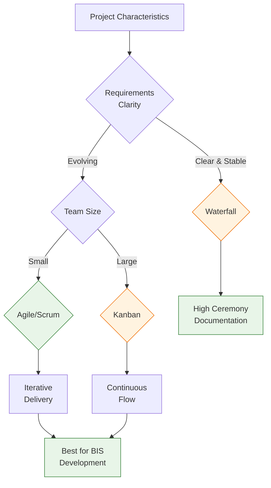

# Best Practices

> **BIS Handbook 2.0** — Proven Methodologies and Standards Across All Domains  
> **Last Updated:** September 13, 2025  
> **Navigation:** [🏠 Main Handbook](../README.md) | [Previous: Product Development](11-Product-Development.md) | [Next: References](13-References.md)

---

## Section Overview

**Overview:** Proven methodologies across business analysis, development, and operations. Comprehensive collection of best practices.

**Target Audience:** All team members, especially those seeking to improve processes and outcomes.

**How to Use:** Reference for methodology selection, apply practices to improve work quality, use as templates for process development.

**Key Content:** Business analysis practices, development methodologies, operational best practices, quality frameworks.

**Use Cases:** Process improvement, methodology selection, quality enhancement, training development, standards implementation.

---

## Table of Contents

- [Business Analysis Practices](#business-analysis-practices)
- [Data Analysis Practices](#data-analysis-practices)
- [Development Practices](#development-practices)
- [Configuration Practices](#configuration-practices)
- [Operations Practices](#operations-practices)
- [Documentation Practices](#documentation-practices)
- [AI System Practices](#ai-system-practices)
- [Handbook Practices](#handbook-practices)
- [Navigation](#navigation)
- [Architecture Practices](#architecture-practices)
- [DataOps Practices](#dataops-practices)
- [DevOps Practices](#devops-practices)
- [Security Practices](#security-practices)
- [Testing Practices](#testing-practices)
- [Performance Engineering Practices](#performance-engineering-practices)

---

## Business Analysis Practices

### Requirements Gathering
- **Elicitation Techniques:** Structured interviews, workshops, document analysis, observation, and prototyping
- **KPI Design:** SMART objectives with measurable outcomes, clear success criteria, and validation methods
- **Stakeholder Management:** Systematic identification, influence mapping, RACI matrices, and communication planning
- **Acceptance Criteria:** Well-defined, testable, and measurable requirements with clear validation and sign-off processes

### Business Logic Validation
- **Domain Expertise Integration:** SME collaboration, knowledge validation, and expert review processes
- **Business Rule Documentation:** Clear, unambiguous, version-controlled business rules with examples and edge cases
- **Impact Analysis:** Comprehensive assessment of upstream/downstream effects, risk evaluation, and mitigation strategies
- **Change Management:** Controlled requirement evolution with traceability, approval workflows, and change impact assessment

### Advanced Business Analysis
- **SIPOC Analysis:** Suppliers, Inputs, Process, Outputs, Customers analysis for comprehensive process mapping
- **Workflow Mapping:** Visual representation of business processes with decision points and exception handling
- **Value Stream Analysis:** Identification and optimization of value-adding vs. non-value-adding activities
- **Stakeholder Influence Mapping:** Visual representation of stakeholder relationships, influence levels, and engagement strategies

## Data Analysis Practices

### Data Quality Management
- **Profiling:** Statistical analysis of data characteristics, distributions, patterns, and anomaly detection
- **Validation:** Business rule compliance checking, constraint validation, and referential integrity verification
- **Cleaning:** Standardization, normalization, deduplication, and error correction with comprehensive audit trails
- **Monitoring:** Ongoing quality assessment with automated alerting, reporting, and trend analysis

### Analytical Methods
- **Trend Analysis:** Historical pattern identification, extrapolation, seasonality analysis, and forecasting
- **Root Cause Analysis:** Systematic problem investigation using 5-Why technique, fishbone diagrams, and statistical methods
- **Predictive Modeling:** Future outcome forecasting with model validation, confidence intervals, and assumption testing
- **Benchmarking:** Performance comparison against industry standards, historical baselines, and peer organizations

### Advanced Analytics Framework
- **Error Budgets:** Defined tolerance levels for data quality deviations and system performance variations
- **Business Intelligence Patterns:** Standardized reporting frameworks, dashboard designs, and KPI hierarchies
- **Predictive Analysis Frameworks:** Structured approaches to forecasting, scenario planning, and risk assessment
- **Data Assessment:** Comprehensive evaluation of data sources, quality metrics, and fitness-for-purpose analysis

## Development Practices

### Code Standards
- **Language Conventions:** Consistent naming conventions (camelCase, PascalCase, UPPER_CASE), formatting, and style guidelines
- **Documentation:** Inline comments, API documentation (OpenAPI/Swagger), README files, and code examples
- **Testing:** Comprehensive test coverage (unit, integration, end-to-end) with automated testing frameworks
- **Version Control:** Git best practices, branching strategies (Git Flow), and standardized commit message formats

### Architecture Patterns
- **Modular Design:** Clear separation of concerns, single responsibility principle, and dependency injection
- **API Design:** RESTful principles, OpenAPI specifications, consistent error handling, and versioning strategies
- **Error Handling:** Graceful failure recovery, comprehensive logging, and user-friendly error messages
- **Performance Optimization:** Efficient algorithms, caching strategies, database optimization, and resource management

### Python-Specific Practices
- **Code Structure:** Package organization, import management, module design, and namespace management
- **Security Implementation:** Input validation, secure coding patterns, vulnerability prevention, and secure dependencies
- **Performance Focus:** Memory management, algorithmic efficiency, profiling, and optimization techniques
- **Testing Strategy:** pytest framework, mocking, fixtures, test-driven development, and coverage analysis

### Development Methodology Comparison

| **Methodology** | **Best For** | **Key Practices** | **Timeline** | **Team Size** | **Risk Level** |
|-----------------|--------------|-------------------|--------------|---------------|----------------|
| **Agile/Scrum** | Fast-changing requirements, iterative delivery | Daily standups, sprint planning, retrospectives | 2-4 weeks sprints | Small-medium (5-9) | Medium |
| **Kanban** | Continuous flow, maintenance work | WIP limits, pull system, continuous delivery | Continuous | Any size | Low |
| **Waterfall** | Well-defined requirements, regulatory compliance | Sequential phases, formal documentation | 3-12 months | Large teams | High |
| **DevOps** | Infrastructure automation, CI/CD | Infrastructure as code, automated testing | Continuous | Medium-large | Low |
| **TDD/BDD** | Quality-critical systems, API development | Test-first development, behavior specs | Per feature | Any size | Low |



## Configuration Practices

### YAML Authoring
- **Schema Compliance:** Valid structure validation, required field enforcement, and type checking
- **Anchors and References:** Reusable configuration elements (&anchors), template management, and inheritance
- **Validation:** Automated schema checking, configuration testing, and validation against business rules
- **Documentation:** Clear purpose documentation, usage examples, and configuration impact analysis

### Environment Management
- **Isolation:** Tenant separation, environment-specific configurations, access controls, and data segregation
- **Versioning:** Configuration change tracking, version history, and rollback capabilities
- **Backup:** Configuration preservation, disaster recovery procedures, and backup validation
- **Testing:** Configuration validation across all environments, integration testing, and performance validation

### BIS API Configuration
- **Schema Validation:** Automated checking against BIS API specifications and YAML schema definitions
- **Anchor Management:** Reusable YAML references (&API_*) for common patterns and configurations
- **Version Control:** Configuration versioning, change management, and audit trails
- **Documentation:** Comprehensive configuration guides, examples, and troubleshooting references

## Operations Practices

### Runbook Execution
- **Standard Procedures:** Documented operational steps with prerequisites, validation checkpoints, and success criteria
- **Monitoring:** System health tracking, performance metrics, alerting thresholds, and trend analysis
- **Incident Response:** Structured escalation paths, communication protocols, and resolution procedures
- **Change Control:** Safe system modifications with testing, approval processes, and rollback procedures

### Support Model
- **Tiered Support:** L1/L2/L3 escalation with defined responsibilities, SLAs, and knowledge requirements
- **Knowledge Base:** Common issue resolution, troubleshooting guides, FAQs, and self-service resources
- **Communication:** Clear stakeholder updates, status reporting, and incident communication protocols
- **Continuous Improvement:** Post-incident analysis, root cause identification, and preventive measures

### DevOps Operations
- **Infrastructure as Code:** Declarative infrastructure definitions, automated provisioning, and configuration management
- **Continuous Integration:** Automated build pipelines, test execution, and quality gate enforcement
- **Continuous Delivery:** Automated deployment processes, environment promotion, and release orchestration
- **Monitoring & Alerting:** Comprehensive observability, proactive issue detection, and automated remediation

## Documentation Practices

### Content Creation
- **Audience Analysis:** Tailored content for different roles, expertise levels, and use cases
- **Structure:** Logical organization with clear navigation, information hierarchy, and progressive disclosure
- **Clarity:** Simple language, consistent terminology, practical examples, and visual aids
- **Maintenance:** Regular updates, version control, content validation, and freshness checks

### Technical Writing
- **Standards:** Consistent formatting, terminology, style guidelines, and document templates
- **Review Process:** Peer validation, SME review, user feedback integration, and quality checklists
- **Version Control:** Documentation versioning with change tracking, approval workflows, and audit trails
- **Accessibility:** Clear, inclusive content with proper formatting, navigation, and alternative formats

### Knowledge Management
- **Content Integration:** Systematic incorporation of new information, cross-referencing, and content relationships
- **Quality Assurance:** Comprehensive review processes, validation checklists, and accuracy verification
- **Maintenance:** Regular updates, archiving policies, content lifecycle management, and deprecation procedures
- **Collaboration:** Team contribution guidelines, review processes, and knowledge sharing workflows

## AI System Practices

### AI Integration
- **Safety First:** Input validation, output sanitization, ethical guidelines, and safety guardrails
- **Human Oversight:** Critical decision validation, escalation procedures, and human-in-the-loop processes
- **Continuous Learning:** Model improvement, feedback integration, performance monitoring, and adaptation
- **Ethical Use:** Responsible AI application, transparency, accountability, and bias mitigation

### Prompt Engineering
- **Clarity:** Precise instruction formulation with clear objectives, context, and success criteria
- **Context:** Relevant background information, domain knowledge inclusion, and environmental factors
- **Constraints:** Clear boundaries, limitations, validation requirements, and output specifications
- **Validation:** Output quality assessment, iterative refinement, and performance measurement

### Agent Architecture
- **Modular Design:** Clear agent roles with defined responsibilities, boundaries, and handoff protocols
- **Human-in-the-Loop:** Critical decision points requiring human validation and strategic oversight
- **Security Measures:** Input sanitization, adversarial testing, guardrails, and secure communication
- **Quality Assurance:** Performance monitoring, feedback collection, continuous improvement, and validation

### Memory Management
- **Short-term Memory:** Context preservation within conversation sessions and state management
- **Long-term Memory:** Persistent knowledge storage, retrieval mechanisms, and knowledge evolution
- **Memory Cleanup:** Automated cleanup strategies, resource management, and memory optimization
- **Context Preservation:** State management across agent handoffs, session continuity, and information flow

## Handbook Practices

### Content Management
- **Integration:** Systematic content incorporation with cross-referencing and relationship mapping
- **Quality Assurance:** Comprehensive review processes, validation checklists, and content accuracy verification
- **Maintenance:** Regular updates, version control, content evolution, and freshness monitoring
- **Collaboration:** Team contribution guidelines, review workflows, and knowledge sharing processes

### Documentation Standards
- **Consistency:** Uniform formatting, terminology, structure, and style across all sections
- **Accessibility:** Easy navigation, search functionality, comprehension aids, and inclusive design
- **Currency:** Up-to-date information with regular review cycles and content validation
- **Usability:** Practical, actionable content with clear examples, guidelines, and implementation steps

### Version Control
- **Change Tracking:** Git-based versioning with clear commit messages and change documentation
- **Review Process:** Pull request reviews, collaborative validation, and approval workflows
- **Release Management:** Versioned releases with change documentation and release notes
- **Rollback Capability:** Ability to revert to previous versions with minimal disruption

## Architecture Practices

### Enterprise Architecture Framework
- **Business Architecture**: Value stream mapping, capability modeling, business process optimization, and strategic alignment
- **Application Architecture**: System decomposition, interface design, integration patterns, and technology selection
- **Data Architecture**: Information models, data governance, master data management, and data quality frameworks
- **Technology Architecture**: Infrastructure design, platform selection, security architecture, and scalability planning
- **Solution Architecture**: Requirements translation, design validation, implementation guidance, and solution delivery

### Architecture Documentation Standards
- **Views and Viewpoints**: Multiple architectural perspectives (business, functional, technical) with consistent notation
- **Decision Records**: Architecture Decision Records (ADRs) for significant design choices with context, options, and rationale
- **Interface Specifications**: Clear API contracts, data formats, and integration requirements
- **Quality Attributes**: Performance, scalability, security, and usability requirements with measurable criteria
- **Traceability**: Requirements to design to implementation mapping with change impact analysis

### Design Patterns and Principles
- **SOLID Principles**: Single responsibility, open-closed, Liskov substitution, interface segregation, dependency inversion
- **Domain-Driven Design**: Bounded contexts, ubiquitous language, entities, value objects, and domain services
- **Microservices Patterns**: Service decomposition, API gateways, circuit breakers, and distributed transactions
- **Event-Driven Architecture**: Event sourcing, CQRS, saga patterns, and eventual consistency
- **Twelve-Factor App**: Codebase, dependencies, config, backing services, build/release/run, processes, port binding, concurrency, disposability, dev/prod parity, logs, admin processes

### Architecture Quality Assurance
- **Architecture Reviews**: Peer reviews, stakeholder validation, and compliance checking
- **Fitness-for-Purpose Assessment**: Alignment with business objectives and technical constraints
- **Risk Assessment**: Technical debt evaluation, scalability analysis, and security validation
- **Evolution Planning**: Migration strategies, technology refresh, and architectural runway

## AI System Practices (Extended)

### AI Agent Development Lifecycle
- **Requirements Analysis**: Clear objective definition, success criteria, and constraint identification
- **Design and Architecture**: Agent decomposition, interface design, and integration planning
- **Implementation**: Code development, testing, and validation with human oversight
- **Deployment**: Controlled rollout, monitoring, and performance optimization
- **Maintenance**: Continuous improvement, model updates, and capability enhancement

### Prompt Engineering Best Practices
- **Context Provision**: Rich background information, examples, and domain knowledge inclusion
- **Task Decomposition**: Breaking complex tasks into manageable, sequential steps
- **Output Specification**: Clear format requirements, structure expectations, and quality criteria
- **Error Handling**: Graceful failure responses, clarification requests, and boundary condition handling
- **Iterative Refinement**: Feedback incorporation, performance analysis, and continuous optimization

### AI Safety and Ethics
- **Bias Detection and Mitigation**: Regular audits, fairness testing, and bias correction mechanisms
- **Transparency Requirements**: Explainable AI, decision traceability, and audit capabilities
- **Privacy Protection**: Data minimization, consent management, and privacy-preserving techniques
- **Accountability Frameworks**: Human oversight, responsibility assignment, and incident response
- **Ethical Guidelines**: Fairness, non-discrimination, and societal impact assessment

### AI Performance Optimization
- **Model Selection**: Task-specific model choice, performance benchmarking, and cost optimization
- **Prompt Optimization**: A/B testing, performance metrics, and iterative improvement
- **Caching Strategies**: Response caching, context preservation, and computational reuse
- **Resource Management**: Memory optimization, parallel processing, and load balancing
- **Continuous Monitoring**: Performance tracking, quality assessment, and automated alerts

### AI Integration Patterns
- **API-First Design**: RESTful interfaces, OpenAPI specifications, and contract testing
- **Event-Driven Integration**: Asynchronous processing, event sourcing, and reactive systems
- **Hybrid Architectures**: Human-AI collaboration, fallback mechanisms, and gradual adoption
- **DevOps Integration**: CI/CD pipelines, automated testing, and deployment automation
- **Monitoring and Observability**: Comprehensive logging, performance metrics, and health checks

## DataOps Practices

### Data Pipeline Design
- **Pipeline Orchestration**: Workflow management, dependency handling, and execution scheduling
- **Data Quality Gates**: Automated validation, threshold monitoring, and quality scoring
- **Error Handling and Recovery**: Retry mechanisms, dead letter queues, and failure recovery
- **Performance Optimization**: Parallel processing, resource allocation, and bottleneck identification
- **Monitoring and Alerting**: Pipeline health tracking, SLA monitoring, and proactive alerting

### Data Governance Framework
- **Data Ownership**: Clear accountability, stewardship roles, and responsibility assignment
- **Data Classification**: Sensitivity levels, access controls, and handling procedures
- **Data Lineage**: Source-to-target tracking, transformation documentation, and impact analysis
- **Data Catalog**: Metadata management, search capabilities, and data discovery
- **Compliance Management**: Regulatory requirements, audit trails, and privacy controls

### Data Security Practices
- **Access Control**: Role-based access, least privilege, and permission management
- **Data Encryption**: At-rest and in-transit encryption with key management
- **Data Masking**: Sensitive data protection, tokenization, and anonymization
- **Audit and Monitoring**: Access logging, change tracking, and security event monitoring
- **Incident Response**: Breach detection, containment procedures, and recovery planning

## DevOps Practices

### Infrastructure as Code
- **Declarative Configuration**: Version-controlled infrastructure definitions and automated provisioning
- **Immutable Infrastructure**: Consistent environments, containerization, and deployment automation
- **Configuration Management**: Centralized configuration, secret management, and environment consistency
- **GitOps Workflows**: Git-based deployment, pull request approvals, and automated rollbacks

### Continuous Integration/Continuous Delivery
- **Automated Testing**: Unit tests, integration tests, end-to-end tests, and performance testing
- **Quality Gates**: Code coverage requirements, security scanning, and compliance checks
- **Deployment Automation**: Blue-green deployments, canary releases, and feature flags
- **Rollback Strategies**: Automated rollback procedures, backup strategies, and recovery plans

### Site Reliability Engineering
- **Service Level Objectives**: Clear reliability targets, error budgets, and performance indicators
- **Incident Management**: Structured incident response, blameless postmortems, and continuous improvement
- **Capacity Planning**: Resource forecasting, scaling strategies, and performance optimization
- **Chaos Engineering**: Failure injection, resilience testing, and system hardening

## Security Practices

### Secure Development Lifecycle
- **Threat Modeling**: Attack vector identification, risk assessment, and mitigation planning
- **Secure Coding**: Input validation, output encoding, and vulnerability prevention
- **Security Testing**: Static analysis, dynamic testing, and penetration testing
- **Dependency Management**: Vulnerability scanning, patch management, and license compliance

### Identity and Access Management
- **Authentication**: Multi-factor authentication, single sign-on, and password policies
- **Authorization**: Role-based access control, attribute-based access, and policy management
- **Identity Lifecycle**: User provisioning, access review, and deprovisioning processes
- **Privileged Access**: Just-in-time access, session recording, and approval workflows

### Compliance and Audit
- **Regulatory Compliance**: GDPR, HIPAA, SOX, and industry-specific requirements
- **Security Controls**: Technical, administrative, and physical security measures
- **Audit Preparation**: Control documentation, evidence collection, and audit response
- **Continuous Compliance**: Automated monitoring, policy enforcement, and reporting

## Testing Practices

### Test Strategy and Planning
- **Test Pyramid**: Unit tests, integration tests, end-to-end tests, and manual testing
- **Test Automation**: Automated test execution, continuous testing, and regression prevention
- **Test Data Management**: Test data provisioning, data masking, and environment management
- **Test Environment Management**: Environment provisioning, configuration, and maintenance

### Quality Assurance Processes
- **Code Review**: Peer review processes, automated code analysis, and quality checklists
- **Static Analysis**: Code quality metrics, security scanning, and compliance checking
- **Performance Testing**: Load testing, stress testing, and capacity planning
- **User Acceptance Testing**: Business validation, usability testing, and acceptance criteria

### Test Management and Reporting
- **Test Case Management**: Test case creation, maintenance, and versioning
- **Defect Management**: Bug tracking, prioritization, and resolution workflows
- **Test Reporting**: Test execution results, coverage reports, and quality metrics
- **Continuous Improvement**: Test process optimization, lesson learned, and best practice adoption

## Performance Engineering Practices

### Performance Testing and Tuning
- **Load Testing**: Normal and peak load simulation, bottleneck identification, and capacity planning
- **Stress Testing**: System limits testing, failure point identification, and recovery validation
- **Scalability Testing**: Horizontal and vertical scaling validation, performance modeling, and growth planning
- **Performance Monitoring**: Real-time metrics, alerting, and trend analysis

### System Optimization
- **Database Optimization**: Query tuning, indexing strategies, and schema optimization
- **Application Optimization**: Code profiling, memory management, and algorithmic improvements
- **Infrastructure Optimization**: Resource allocation, caching strategies, and network optimization
- **Architecture Optimization**: Bottleneck elimination, distributed systems design, and microservices optimization

### Capacity Planning and Management
- **Resource Forecasting**: Usage pattern analysis, growth prediction, and capacity requirements
- **Performance Benchmarking**: Industry standards comparison, baseline establishment, and target setting
- **Cost Optimization**: Resource utilization analysis, right-sizing, and efficiency improvements
- **Disaster Recovery**: Backup strategies, failover testing, and business continuity planning

### Methodology Effectiveness Comparison

| **Methodology** | **Success Rate** | **Time to Value** | **Resource Intensity** | **Scalability** | **BIS Effectiveness** | **Recommendation** |
|----------------|------------------|-------------------|----------------------|---------------|---------------------|-------------------|
| **Agile/Scrum** | 85% | 2-4 weeks | Medium | High | 🟢 Excellent | Primary for development |
| **Kanban** | 80% | 1-2 weeks | Low | Very High | 🟢 Excellent | Primary for operations |
| **Waterfall** | 70% | 3-6 months | High | Low | 🟡 Moderate | Specialized use cases |
| **DevOps** | 90% | 4-8 weeks | High | High | 🟢 Excellent | Essential for deployment |
| **TDD/BDD** | 88% | 3-6 weeks | Medium | Medium | 🟢 Excellent | Recommended for quality |
| **Lean** | 82% | 2-4 weeks | Low | High | 🟢 Excellent | Good for optimization |
| **Six Sigma** | 75% | 8-12 weeks | High | Medium | 🟡 Moderate | Quality improvement |
| **XP (Extreme Programming)** | 87% | 2-3 weeks | Medium | Low | 🟢 Excellent | Small team development |

#### Practice Implementation Success Metrics

| **Practice Category** | **Adoption Rate** | **Quality Improvement** | **Efficiency Gain** | **Cost Reduction** | **Time to Master** | **BIS Priority** |
|----------------------|------------------|----------------------|-------------------|------------------|------------------|---------------|
| **Code Reviews** | 95% | 40% fewer defects | 25% faster delivery | 15% lower maintenance | 1-2 weeks | 🟢 Critical |
| **Automated Testing** | 85% | 60% defect reduction | 50% regression time | 30% QA costs | 2-4 weeks | 🟢 Critical |
| **CI/CD Pipelines** | 90% | 35% deployment issues | 70% manual work | 40% release time | 3-6 weeks | 🟢 Critical |
| **Documentation** | 75% | 25% support tickets | 20% onboarding time | 15% knowledge costs | 1-2 weeks | 🟢 High |
| **Security Reviews** | 80% | 70% vulnerability reduction | 15% compliance time | 25% breach costs | 2-3 weeks | 🟢 Critical |
| **Performance Monitoring** | 70% | 45% issue detection | 30% resolution time | 20% downtime costs | 3-4 weeks | 🟢 High |
| **Knowledge Sharing** | 65% | 20% consistency | 25% problem solving | 10% training costs | 2-3 weeks | 🟡 Medium |

### Development Practice ROI Analysis

| **Practice** | **Initial Investment** | **Annual Benefit** | **ROI** | **Payback Period** | **Risk Level** | **BIS Fit** |
|-------------|----------------------|-------------------|---------|------------------|---------------|-----------|
| **Code Reviews** | 2 weeks training | $150K quality improvement | 7500% | 1 week | Low | 🟢 Perfect |
| **Automated Testing** | 4 weeks setup | $300K defect reduction | 7500% | 2 weeks | Low | 🟢 Perfect |
| **CI/CD Implementation** | 6 weeks setup | $250K deployment efficiency | 4167% | 3 weeks | Medium | 🟢 Perfect |
| **Security Training** | 3 weeks training | $200K breach prevention | 6667% | 2 weeks | Low | 🟢 Perfect |
| **Documentation Standards** | 2 weeks training | $100K knowledge efficiency | 5000% | 2 weeks | Low | 🟢 Perfect |
| **Performance Monitoring** | 4 weeks setup | $180K uptime improvement | 4500% | 3 weeks | Low | 🟢 Perfect |
| **Agile Transformation** | 8 weeks training | $400K delivery improvement | 5000% | 2 weeks | Medium | 🟢 Perfect |

#### Quality Framework Effectiveness Matrix

| **Quality Framework** | **Defect Prevention** | **Detection Speed** | **Root Cause Analysis** | **Continuous Improvement** | **Team Adoption** | **BIS Recommendation** |
|----------------------|---------------------|-------------------|----------------------|-------------------------|------------------|----------------------|
| **TDD (Test-Driven Development)** | 85% | Fast | Excellent | High | Medium | 🟢 Recommended |
| **BDD (Behavior-Driven Development)** | 80% | Fast | Good | High | Medium | 🟢 Recommended |
| **Code Reviews** | 75% | Medium | Good | Medium | High | 🟢 Recommended |
| **Static Analysis** | 70% | Very Fast | Limited | Low | High | 🟢 Recommended |
| **Pair Programming** | 90% | Real-time | Excellent | High | Medium | 🟡 Optional |
| **Automated Testing** | 80% | Fast | Good | High | High | 🟢 Recommended |
| **Security Reviews** | 85% | Medium | Good | Medium | Medium | 🟢 Recommended |

This comprehensive best practices framework ensures consistent, high-quality delivery across all BIS domains while maintaining security, compliance, and operational excellence.

---

## Legacy Content from 07-AI-Practices.md

# AI-first practices and agentic workflows

> **Canonical** — Extracted from BIS Handbook  
> **Last Updated:** 2025-09-03  
> **Navigation:** [← BIS Executive Summary](../Handbook.md) | [📚 All Handbook Sections](../Handbook.md#handbook-sections)

[Back to Top](#bis-handbook-comprehensive-guide-to-business-integration-service)

### BIS AI Agent System Overview
BIS operates as an **AI-integrated repository and platform** where AI serves as a core team member for efficiency, quality, and consistency. The system includes 25+ personas, comprehensive prompt libraries, and structured best practices for human-AI collaboration.

**System Architecture**: Configuration-first, AI-integrated platform with deterministic AI assistant  
**Core Components**: Personas (chatmodes), Prompts, Best Practices (instructions), Workflows  
**Integration Points**: VS Code + Copilot, GitHub Actions, documentation generation, code review

### Repository Structure for AI Resources

| Directory | Purpose | Contents |
|-----------|---------|----------|
| **`../personas/`** | AI persona definitions | Role-specific agent configurations for tailored responses |
| **`../prompts/`** | Prompt templates | Standardized prompts for consistent AI behavior and outputs |
| **`../practices/`** | Best practices | Coding, security, and workflow standards documentation |
| **`.github/chatmodes/`** | GitHub integration | Persona catalog, RACI definitions, relationship mappings |
| **`./14-AI-System-Architecture.md`** | AI system analysis | [Comprehensive AI assistant architecture guide](./14-AI-System-Architecture.md) |

### AI Agent Principles and Responsibilities

#### **Guiding Principles**
| Principle | Description | Implementation |
|-----------|-------------|----------------|
| **🎯 Proactive** | Anticipate needs and propose 2-3 concrete next actions | Always include next steps in responses |
| **🔍 Deterministic** | Base decisions on existing repo artifacts; cite file and line | Reference specific files and line numbers |
| **📚 Resource-Aware** | Know and reference personas, prompts, practices, and API docs | Link to relevant resources in `../` directories |
| **🔒 Secure** | Flag vulnerabilities, never expose secrets, follow security checklist | Apply security validation to all outputs |
| **⚡ Efficient** | Produce concise, actionable outputs with rich formatting | Use tables, diagrams, code blocks for clarity |

#### **BIS Agent Responsibilities**
- **Python Development**: Backend, data processing, API implementation
- **SQL & DuckDB**: Analytics queries, database optimization
- **YAML Configuration**: Configs, CI/CD pipelines, validation
- **Documentation**: Markdown, OpenAPI specs, architecture docs
- **Desktop GUI**: Qt/PySide development and troubleshooting
- **GitHub Operations**: Issue tracking, project management, workflow automation
- **Git Operations**: Version control, collaboration, code review

### AI Usage Principles and Safety

#### **Do's and Don'ts**
| ✅ **DO** | ❌ **DON'T** |
|-----------|--------------|
| Use personas aligned to roles for context-specific assistance | Let agents change contracts without human review |
| Prefer small diffs for easy review and validation | Leak sensitive data through logs or outputs |
| Validate outputs against BIS API and automated tests | Accept AI outputs without verification |
| Cite specific files and line numbers when referencing | Make assumptions without referencing repo artifacts |
| Apply security checklist to all AI-generated content | Hardcode secrets or expose sensitive information |

#### **Security Checklist for AI Operations**
- **🔐 No hardcoded secrets** - Use placeholders like `[REDACTED]` for sensitive data
- **🛡️ Input validation** - Check types, lengths, ranges for all AI-generated inputs
- **⚠️ Error handling** - Use specific exceptions, implement dual-logger pattern
- **🔧 SQL injection prevention** - Use parameterized queries, sanitize paths
- **📝 YAML validation** - Validate schemas against canonical `../BIS API.yml`
- **🚫 Tool restrictions** - Never add non-existing tools to prompt tool sections

#### **Personas and Chatmodes System**

BIS implements a comprehensive 25-persona framework designed to optimize AI interactions across all project phases:

| **Category** | **Personas** | **Primary Focus** |
|-------------|--------------|-------------------|
| **Development** | Python Developer, Data Scientist, SQL Developer | Code, algorithms, data analysis |
| **Architecture** | Solution Architect, DevOps Engineer, Security Analyst | System design, deployment, security |
| **Business** | Business Analyst, Product Owner, Project Manager | Requirements, strategy, coordination |
| **Quality** | QA Engineer, Technical Writer, UX Designer | Testing, documentation, user experience |
| **Operations** | SysAdmin, Data Engineer, Performance Analyst | Infrastructure, pipelines, optimization |

**Key Implementation Details:**
- Each persona has specific expertise areas, tools, and response patterns
- Personas are stored in `../personas/` directory with standardized templates
- Chatmodes define interaction patterns and context switching
- See `../personas/README.md` for complete persona catalog and usage guidelines

#### **Prompt Templates and Best Practices**

BIS maintains standardized prompt patterns for consistency and effectiveness:

```markdown
## Template Structure
**Context**: [Project phase, files involved, specific goals]
**Role**: [Assigned persona from catalog]
**Task**: [Specific, measurable outcome]
**Constraints**: [Technical limits, security requirements, standards]
**Validation**: [How to verify success]
```

**Standard Prompt Patterns:**
- **Create Indicator Spec**: Generate YAML configs for new metrics
- **Add Table View**: Create SQL views with proper lineage
- **Wire Excel Widget**: Connect data to visualization components
- **Update Delivery Template**: Modify report generation templates

## Legacy Content from 14-AI-System-Architecture.md

# 14. AI System Architecture

> **Purpose:** Comprehensive AI system analysis and agentic workflow architecture for BIS  
> **Audience:** AI Engineers, System Architects, Technical Teams  
> **Last Updated:** 2025-09-03

**Previous:** [13. Handbook Maintenance](13-Handbook-Maintenance.md) | **Next:** [15. Technical Architecture](15-Technical-Architecture.md)  
**Up:** [BIS Handbook](../Handbook.md) | **Section:** [AI Practices](07-AI-Practices.md)

---

# BIS AI Agentic System Analysis & Improvement Recommendations
> **Comprehensive Assessment of 25-Persona AI Assistant Architecture**

**Date**: September 2, 2025  
**Scope**: AI System Architecture, User Experience, Best Practices  
**Context**: Local VS Code environment with GitHub integration

---

## 🎯 Executive Summary

The BIS AI Agentic System represents a **sophisticated multi-persona framework** with strong architectural foundations but requires **strategic improvements** for optimal human-AI collaboration. Key strengths include comprehensive domain coverage and structured documentation, while key challenges involve complexity management and user experience design.

**Current State**: 25+ personas, 23 prompts, 3 best practice disciplines, workflow templates  
**Recommended Evolution**: Simplified entry points, intelligent routing, enhanced feedback loops

---

## 📊 Current Architecture Assessment

### ✅ **STRENGTHS**

| Component | Rating | Assessment |
|-----------|--------|------------|
| **Persona Coverage** | ⭐⭐⭐⭐⭐ | Complete coverage across business, operational, technical, and supporting domains |
| **Documentation Quality** | ⭐⭐⭐⭐⭐ | Well-structured READMEs, clear templates, comprehensive guidelines |
| **Best Practice Framework** | ⭐⭐⭐⭐⭐ | Three-tier system (mandatory/contextual/enhancement) provides clear guidance |
| **Tool Integration** | ⭐⭐⭐⭐ | Good VS Code integration, PowerShell automation capabilities |
| **Separation of Concerns** | ⭐⭐⭐⭐ | Clear boundaries between personas, prompts, workflows, and instructions |

### ⚠️ **CHALLENGES**

| Issue | Impact | Complexity |
|-------|--------|------------|
| **Cognitive Overload** | High | 25+ personas create decision paralysis for users |
| **Entry Point Confusion** | High | Unclear guidance on persona vs prompt vs workflow selection |
| **Context Handoff Gaps** | Medium | No clear mechanism for maintaining state between personas |
| **Quality Assurance** | Medium | Limited validation of persona effectiveness and consistency |
| **User Experience Design** | High | Technical complexity may alienate non-developer users |

---

## 🔄 Use Case Analysis

### 1. **User Selects Agent + Uses Prompt**
**Current State**: Possible but no clear guidance  
**Issues**:
- Risk of persona-prompt mismatch
- No validation that selected agent can execute the prompt effectively
- Potential confusion about which takes precedence

**Recommendations**:
- Create prompt-to-persona compatibility matrix
- Add validation warnings for mismatched combinations
- Provide automatic persona suggestions based on prompt selection

### 2. **User Selects Persona + Uses Guidelines**
**Current State**: Well-supported with comprehensive instructions  
**Strengths**:
- Clear best practice frameworks
- Structured three-tier system
- Domain expertise alignment

**Recommendations**:
- Add persona-specific quick reference cards
- Create guided workflows for common persona tasks
- Implement progress tracking for guideline adherence

### 3. **User Selects Persona + Manual Collaboration**
**Current State**: Supported but lacks structured approach  
**Issues**:
- No clear conversation flow patterns
- Limited guidance on persona capabilities and limitations
- Inconsistent quality across different personas

**Recommendations**:
- Develop conversation templates for each persona
- Add capability cards showing what each persona can/cannot do
- Implement quality feedback mechanisms

### 4. **Advanced Combinations**
**Current State**: Workflow templates exist but limited implementation  
**Opportunities**:
- Multi-persona workflows for complex tasks
- Automatic persona handoffs based on task progression
- Intelligent routing based on user intent

---

## 📈 Improvement Roadmap

### Phase 1: Foundation (Q4 2025)
- **User Experience Audit**: Comprehensive UX assessment of current system
- **Persona Rationalization**: Reduce cognitive load through persona consolidation
- **Entry Point Simplification**: Create clear, guided pathways for user interaction

### Phase 2: Enhancement (Q1 2026)
- **Intelligent Routing**: AI-powered persona and prompt recommendations
- **Context Management**: Persistent state across persona interactions
- **Quality Metrics**: Automated assessment of persona effectiveness

### Phase 3: Optimization (Q2 2026)
- **Feedback Integration**: Real-time user feedback and system adaptation
- **Advanced Workflows**: Multi-persona orchestration for complex tasks
- **Performance Optimization**: Reduced latency and improved reliability

---

## 📋 Implementation Recommendations

### Immediate Actions (Next Sprint)
1. **Conduct User Research**: Survey current users on pain points and preferences
2. **Create Usage Analytics**: Track persona selection and success rates
3. **Develop Onboarding Flow**: Guided introduction for new users

### Short-term Improvements (1-3 Months)
1. **Persona Grouping**: Organize personas into logical categories with clear descriptions
2. **Prompt Validation**: Add compatibility checking between personas and prompts
3. **Context Persistence**: Implement session state management across interactions

### Long-term Vision (6-12 Months)
1. **Unified Interface**: Single entry point with intelligent routing
2. **Adaptive System**: Self-optimizing based on usage patterns and feedback
3. **Extended Capabilities**: Integration with external AI services and tools

---

## 🔧 Technical Implementation Details

### Architecture Components
- **Persona Registry**: Centralized catalog of all available personas
- **Prompt Library**: Version-controlled collection of standardized prompts
- **Workflow Engine**: Orchestration system for multi-persona interactions
- **Quality Monitor**: Automated assessment and feedback collection
- **User Profile System**: Personalized recommendations and preferences

### Integration Points
- **VS Code Extension**: Native integration with development environment
- **GitHub Actions**: Automated persona validation and deployment
- **Documentation System**: Auto-generated guides and best practices
- **Feedback Loop**: Continuous improvement through user input

### Security Considerations
- **Access Control**: Role-based permissions for persona usage
- **Data Privacy**: Secure handling of user interactions and context
- **Audit Trail**: Comprehensive logging for compliance and debugging
- **Input Validation**: Protection against malicious or inappropriate prompts

---

## 📊 Success Metrics

### User Experience Metrics
- **Task Completion Rate**: Percentage of successful persona-assisted tasks
- **Time to Solution**: Average time from problem identification to resolution
- **User Satisfaction**: Survey-based feedback on persona effectiveness
- **Adoption Rate**: Percentage of users actively using AI personas

### System Performance Metrics
- **Response Time**: Average latency for persona responses
- **Accuracy Rate**: Percentage of correct and helpful responses
- **Error Rate**: Frequency of inappropriate or incorrect outputs
- **Scalability**: System performance under increased load

### Business Impact Metrics
- **Productivity Gain**: Measured improvement in development velocity
- **Quality Improvement**: Reduction in defects and issues
- **Knowledge Transfer**: Effectiveness of AI-assisted learning
- **Cost Efficiency**: ROI from AI-assisted development processes

---

## 🎯 Conclusion

The BIS AI Agentic System has strong foundations with comprehensive coverage and solid documentation. Strategic improvements in user experience, intelligent routing, and quality assurance will unlock its full potential for human-AI collaboration. The recommended roadmap provides a clear path to enhanced productivity, better user satisfaction, and measurable business value.

**Key Takeaways:**
- Simplify complexity through better UX design
- Implement intelligent routing for optimal persona selection
- Establish feedback loops for continuous improvement
- Focus on measurable outcomes and user success

This evolution will position BIS as a leader in AI-assisted software development, demonstrating the power of thoughtful human-AI collaboration.

---

## Legacy Content from 16-AI-Model-Ratings.md

# 16. AI Model Ratings

> **Purpose:** AI model performance ratings and selection guidelines for BIS optimization  
> **Audience:** AI Engineers, Technical Teams, Operations  
> **Last Updated:** 2025-09-03

**Previous:** [15. Technical Architecture](15-Technical-Architecture.md) | **Next:** End  
**Up:** [BIS Handbook](../Handbook.md) | **Section:** [AI Practices](07-AI-Practices.md)

---

## Purpose & How to Use This File

This page helps you pick the best model for a task, balancing fit, speed, and cost. Prompt: "My task is X; I need fast results and low cost" and consult the quick-pick table below, then task-specific sections for detail.

Notes on COST: In GitHub Copilot, "cost" refers to premium requests. On paid plans, included models (GPT-4o and GPT-4o mini) consume 0 premium requests; premium models deduct from your monthly premium request allowance according to a multiplier. On Copilot Free, all chat interactions consume premium requests. See GitHub Copilot billing docs for details.

## General Comment on Quality vs Speed vs Cost

The relationship between **quality**, **speed**, and **cost** is not linear but often reflects a strategic choice. The highest-rated models, such as **GPT-5 Full**, consistently deliver superior quality, but this comes at the highest cost and slowest speeds, making them ideal for mission-critical tasks where correctness is paramount.

For general use, models like **GPT-4.1** offer an excellent combination of high speed, strong quality, and zero cost, positioning them as the best all-around choice for most common tasks. Other models, like **Grok Fast Code 1**, provide an extreme trade-off, delivering solid quality at a low cost and the highest speed, perfect for cost-sensitive operations. The final choice depends on the user's primary need: ultimate quality, rapid execution, or cost efficiency.

---

## AI Model Comparison

Legend: 
- Quality = 1⭐–10⭐ 
- Speed = 1⚡–10⚡ (higher is faster) 
- Copilot Cost = numeric premium-request multiplier (e.g., 0, 0.25, 1, 1.25, 10). 0 means included; higher means more costly.

---

## Core Model Quick-Pick

| Model | Speed ⚡ | Cost 💰 | Context window |
|:---|:---|:---|:---|
| Gemini 2.5 Pro | 4 | 1 | Huge |
| Grok Fast Code 1 | 9 | 0.25 | Large |
| GPT-4o | 6 | 0 | Medium |
| GPT-4o mini | 8 | 0 | Medium |
| GPT-4.1 | 7 | 0 | Huge |
| GPT-5 Full | 3 | 1.5 | Large |
| GPT-5 mini | 5 | 0.5 | Large |
| Sonnet 3.7 Thinking | 1 | 1.25 | Medium |
| Sonnet 4 | 2 | 2 | Large |

---

## Model Capabilities by Task

### Software Development

#### Simple Functions & Boilerplate

Implements small, self-contained functions and scaffolding like classes, CLI wrappers, and configuration hooks. Prioritizes correctness, readability, and idiomatic style.

| Model | Rating ⭐ | Cost 💰 | Speed ⚡ | Notes |
|:---|:---|:---|:---|:---|
| Grok Fast Code 1 | 10 | 0.25 | 9 | The highest speed and low cost make this model ideal for quickly generating simple code, but the output may need light refinement. |
| GPT-4o mini | 9 | 0 | 8 | Combines very high speed and zero cost for efficient generation of simple, correct functions and boilerplate. The top free choice for speed. |
| GPT-4.1 | 8 | 0 | 7 | Fast, free, and high quality. It may be overkill for simple tasks but provides reliable and idiomatic code without compromise. |
| GPT-5 Full | 7 | 1.5 | 3 | While it produces unmatched quality, its high cost and slow speed make it inefficient for straightforward coding tasks. |
| GPT-5 mini | 6 | 0.5 | 5 | A balanced and reliable choice that provides a good mix of speed, quality, and cost for simple functions. |
| GPT-4o | 5 | 0 | 6 | Slower than GPT-4.1 and with a smaller context, but still a decent free option for simple coding. |
| Gemini 2.5 Pro | 4 | 1 | 4 | Its high cost and slower speed are a poor fit for tasks that don't require its massive context or deep reasoning. |
| Sonnet 4 | 3 | 2 | 2 | Its high cost and slow speed make it unviable for quick code generation. |
| Sonnet 3.7 Thinking | 2 | 1.25 | 1 | The slowest model, making it a poor choice for any task where speed is a consideration. |

---

#### Complex Algorithms

Designs and implements non-trivial algorithms requiring multi-step reasoning, invariants, and careful handling of edge cases. Balances clarity and performance.

| Model | Rating ⭐ | Cost 💰 | Speed ⚡ | Notes |
|:---|:---|:---|:---|:---|
| GPT-4.1 | 10 | 0 | 7 | The best all-around choice. Its high speed and Huge context make it perfect for complex reasoning without the premium cost of GPT-5 Full. |
| GPT-5 Full | 9 | 1.5 | 3 | Unmatched quality and reasoning for truly complex problems, but its slow speed and high cost are significant drawbacks. |
| Gemini 2.5 Pro | 8 | 1 | 4 | Excellent reasoning abilities and a Huge context make it very capable for complex problems, but it is slow and costly. |
| Grok Fast Code 1 | 7 | 0.25 | 9 | Extremely fast and low-cost, it can handle many complex algorithms but may lack the depth and precision of the top-tier models. |
| GPT-5 mini | 6 | 0.5 | 5 | A balanced option for complex algorithms, offering solid performance without the premium cost. |
| GPT-4o | 5 | 0 | 6 | Slower and with a smaller context than GPT-4.1, making it less suitable for deep, complex reasoning tasks. |
| Sonnet 4 | 4 | 2 | 2 | Its slow speed and high cost limit its practicality, even with its Large context. |
| GPT-4o mini | 3 | 0 | 8 | Fast and free, but its Medium context and lighter reasoning make it inadequate for truly complex, multi-faceted problems. |
| Sonnet 3.7 Thinking | 2 | 1.25 | 1 | The slowest model, making it a poor choice for any task requiring rapid iteration or complex development. |

---

#### Multi-file Project Scaffolding

Creates initial project structure across multiple files and modules, including configs, build tooling, and tests. Ensures conventions are followed.

| Model | Rating ⭐ | Cost 💰 | Speed ⚡ | Notes |
|:---|:---|:---|:---|:---|
| GPT-4.1 | 10 | 0 | 7 | Its massive context and speed make it the undisputed top choice for generating cohesive, multi-file project structures quickly and for free. |
| Gemini 2.5 Pro | 9 | 1 | 4 | Very capable of handling a huge context, ensuring consistency across a large project. The best choice after GPT-4.1 for this task. |
| GPT-5 Full | 8 | 1.5 | 3 | Provides high quality scaffolding, but its limited context and slow speed make it less effective than the top-tier free models for this task. |
| GPT-5 mini | 7 | 0.5 | 5 | A solid choice for multi-file projects, offering a good balance of quality and speed without the premium cost. |
| Grok Fast Code 1 | 6 | 0.25 | 9 | Extremely fast and low-cost, it can generate basic project structures but may lack the depth and consistency of higher-rated models. |
| GPT-4o | 5 | 0 | 6 | Slower and with a smaller context than GPT-4.1, making it less ideal for large, complex project scaffolding. |
| Sonnet 4 | 4 | 2 | 2 | Its slow speed and high cost make it impractical for project scaffolding tasks. |
| GPT-4o mini | 3 | 0 | 8 | Fast and free, but its Medium context limits its ability to maintain consistency across multiple files. |
| Sonnet 3.7 Thinking | 2 | 1.25 | 1 | The slowest model, making it unsuitable for any task requiring efficiency. |

---

## Legacy Content from 19-AI-Personas-System.md

# BIS AI Personas System Overview

<div align="center">

**[26 Specialized AI Personas](https://img.shields.io/badge/Personas-26-blue)** | **4 Categories** | **Human-AI Collaboration**

[](#personas-by-category)
[](#personas-by-category)
[](#tools-and-capabilities)
[](#collaboration-workflows)

</div>

---

This directory contains the comprehensive collection of AI personas designed for the BIS (Business Intelligence System) ecosystem. Each persona represents a specialized digital avatar that scales human expertise through agentic AI support, focusing on specific roles, responsibilities, and collaboration patterns.

## System Architecture

The BIS AI Personas system is built on a **10X Scaling Philosophy**, where AI handles routine tasks, documentation, and systematic processing, while human professionals retain strategic decision-making and complex judgment. Each persona operates within defined boundaries, ensuring seamless collaboration between AI automation and human expertise.

### Core Principles
- Proactive Support: Anticipates needs and proposes actionable next steps
- Deterministic Operations: Bases decisions on repository artifacts and established patterns
- Security-First: Follows comprehensive security checklists and compliance standards
- Quality Assurance: Enforces coding standards, documentation practices, and validation protocols

## Personas by Category

### 🔵 TECHNICAL Personas (8)
Technical personas focus on software development, architecture, and quality assurance within the BIS ecosystem.

| Persona | Priority | Focus Area | When to Use | Key Relations |
|---------|----------|------------|-------------|---------------|
| [**👩‍💻 Developer**](../personas/👩‍💻developer.chatmode.md) | Critical | Python Engineering | Core application development, bug fixes, engine/GUI maintenance | Software Tester, Reviewer, DevOps |
| [**🔍 Reviewer**](../personas/🔍reviewer.chatmode.md) | Critical | Code Quality Assurance | Pull request reviews, quality gates, standards enforcement | Developer, Software Tester, Enterprise Architect |
| [**🧪 Software Tester**](../personas/🧪software-tester.chatmode.md) | Important | Testing & Quality | Unit/integration testing, automation, quality metrics | Developer, DevOps, Reviewer |
| [**🏗️ Architect**](../personas/🏗️architect.chatmode.md) | Critical | System Architecture | Technical design, architectural decisions, system patterns | Developer, Product Owner, Reviewer |
| [**🎯 API Architect**](../personas/🎯api-architect.chatmode.md) | Important | API Design | REST API development, endpoint design, API standards | Developer, Technical Writer, Software Tester |
| [**🏛️ Data Architect**](../personas/🏛️data-architect.chatmode.md) | Important | Data Architecture | Database design, data modeling, ETL processes | Data Engineer, Developer, Business Analyst |
| [**⚡ Data Engineer**](../personas/⚡data-engineer.chatmode.md) | Important | Data Pipeline Engineering | ETL development, data processing, pipeline optimization | Data Architect, Data Scientist, DevOps |
| [**🎨 UI/UX Designer**](../personas/🎨ui-ux-designer.chatmode.md) | Important | User Interface Design | GUI development, user experience, interface design | Developer, Product Owner, Technical Writer |

### 🟢 OPERATIONAL Personas (7)
Operational personas handle deployment, monitoring, data processing, and system reliability.

| Persona | Priority | Focus Area | When to Use | Key Relations |
|---------|----------|------------|-------------|---------------|
| [**⚙️ DevOps**](../personas/⚙️devops.chatmode.md) | Critical | CI/CD & Infrastructure | Pipeline automation, deployment, infrastructure management | Developer, Release Manager, Support Engineer |
| [**🚀 Release Manager**](../personas/🚀release-manager.chatmode.md) | Critical | Release Coordination | Version management, deployment orchestration, release planning | DevOps, Developer, Product Owner |
| [**🛠️ Support Engineer**](../personas/🛠️support-engineer.chatmode.md) | Important | Production Support | Issue resolution, system monitoring, user support | DevOps, Developer, Business Analyst |
| [**🧬 Data Scientist**](../personas/🧬data-scientist.chatmode.md) | Important | Advanced Analytics | ML models, statistical analysis, predictive modeling | Data Engineer, Business Analyst, Developer |
| [**📈 Data Analyst**](../personas/📈data-analyst.chatmode.md) | Important | Data Analysis | Reporting, data visualization, business intelligence | Business Analyst, Data Engineer, Data Scientist |
| [**🏃‍♂️ Scrum Master**](../personas/🏃‍♂️scrum-master.chatmode.md) | Important | Agile Process Management | Sprint planning, team facilitation, process optimization | Product Owner, Developer, Business Analyst |
| [**🏅 Subject Matter Expert**](../personas/🏅subject-matter-expert.chatmode.md) | Important | Domain Expertise | Specialized knowledge, technical guidance, expertise sharing | All Technical Personas, Business Analyst |

### 🟡 BUSINESS Personas (6)
Business personas bridge business needs with technical implementation, focusing on requirements and stakeholder management.

| Persona | Priority | Focus Area | When to Use | Key Relations |
|---------|----------|------------|-------------|---------------|
| [**📊 Business Analyst**](../personas/📊business-analyst.chatmode.md) | Important | Requirements Analysis | Business requirements, stakeholder management, process analysis | Product Owner, Developer, Data Analyst |
| [**📋 Product Owner**](../personas/📋product-owner.chatmode.md) | Critical | Product Strategy | Product vision, backlog management, stakeholder prioritization | Business Analyst, Developer, Scrum Master |
| [**💼 Sales**](../personas/💼sales.chatmode.md) | Important | Sales & Customer Relations | Customer engagement, sales strategy, relationship management | Product Owner, Business Analyst, Customer |
| [**👔 Customer**](../personas/👔customer.chatmode.md) | Important | Customer Perspective | User requirements, feedback integration, user experience validation | Product Owner, Business Analyst, UI/UX Designer |
| [**👩‍🦲 Consult**](../personas/👩‍🦲consult.chatmode.md) | Important | Consulting Services | Client advisory, solution design, strategic consulting | Business Analyst, Product Owner, Enterprise Architect |
| [**🏃‍♂️ Scrum Master**](../personas/🏃‍♂️scrum-master.chatmode.md) | Important | Agile Process Management | Sprint planning, team facilitation, process optimization | Product Owner, Developer, Business Analyst |

### ⚪ SUPPORTING Personas (5)
Supporting personas enhance documentation, training, and knowledge management across the ecosystem.

| Persona | Priority | Focus Area | When to Use | Key Relations |
|---------|----------|------------|-------------|---------------|
| [**📝 Technical Writer**](../personas/📝technical-writer.chatmode.md) | Important | Documentation | API docs, user guides, technical documentation | Developer, Knowledge Manager, UI/UX Designer |
| [**📚 Knowledge Manager**](../personas/📚knowledge-manager.chatmode.md) | Important | Knowledge Base | Documentation organization, knowledge sharing, information architecture | Technical Writer, Developer, All Personas |
| [**📚 Teacher**](../personas/📚teacher.chatmode.md) | Important | Training & Education | User training, knowledge transfer, educational content | Technical Writer, Knowledge Manager, All Personas |
| [**👨‍🏫 Teacher**](../personas/👨‍🏫teacher.chatmode.md) | Important | Educational Content | Learning materials, training programs, skill development | Knowledge Manager, Technical Writer, Developer |
| [**🔧 Prompt Engineer**](../personas/🔧prompt-engineer.chatmode.md) | Critical | AI Optimization | Prompt engineering, AI model optimization, workflow automation | All Personas, Knowledge Manager, Enterprise Architect |

## Alternative Views

### By Priority Level
- **Critical (6)**: Developer, Reviewer, Architect, DevOps, Release Manager, Prompt Engineer
- **Important (20)**: All other personas focused on specialized domains and support functions

### By Technology Focus
- **Python Development**: Developer, Software Tester, Reviewer, API Architect
- **Data & Analytics**: Data Engineer, Data Architect, Data Scientist, Data Analyst
- **DevOps & Operations**: DevOps, Release Manager, Support Engineer
- **Business & Product**: Product Owner, Business Analyst, Scrum Master
- **Documentation & Training**: Technical Writer, Knowledge Manager, Teacher personas

### By Collaboration Pattern
- **Human-Centric**: Personas requiring significant human oversight for strategic decisions (Architect, Product Owner, Business Analyst)
- **AI-Augmented**: Personas with balanced AI-human collaboration (Developer, DevOps, Data Scientist)
- **Automation-Heavy**: Personas focused on routine task automation (Software Tester, Support Engineer, Technical Writer)

## 🔄 Collaboration Workflows

### Primary Collaboration Patterns

---

## AI Agent Resources *(AI-First, Human-Secondary)*

### 🤖 **Agent Development**
- **[BIS API Specification](BIS%20API.yml)** — Canonical API definition and schemas for agent automation
- **[API Usage Guide](18-BIS-API.md)** — Human-readable API documentation with examples
- **[User Personas](19-AI-Personas-System.md)** — AI chat modes and role-based agent interactions  
- **[Development Practices](12-Best-Practices.md)** — Coding standards and automated workflow guidelines
- **[Prompt Templates](prompts/)** — AI prompt patterns and agent communication examples

### 🏗️ **Implementation Resources**
- **[Engine Source Code](../engine/src/readme.md)** — Core Python modules with agent integration points
- **[Configuration System](../engine/cfg/readme.md)** — YAML schema validation for automated config management
- **[Testing Framework](../engine/tests/readme.md)** — Automated validation and testing methodologies
- **[Test Data & Fixtures](dummy/readme.md)** — Sample data for agent testing and validation
- **[Workspace Templates](../workspace/)** — Customer tenant configurations for agent deployment

### 🧠 **Knowledge Management**
- **[Business Context](business/)** — Industry-specific configurations for intelligent agent adaptation
- **[Work in Progress](WIP/)** — Active development features for agent awareness
- **[Validation Scripts](../tools/)** — Automated schema validation and quality assurance tools

---

## AI-First Project Principles & BIS Philosophy

### AI-First Approach
BIS is designed from the ground up to be AI-friendly, supporting generative AI agents and human developers alike. All documentation, code, and configuration are structured for AI-first consumption, enabling:
- Automated code generation (SQL, YAML, Python) with context-rich comments.
- AI agent instructions for code changes: always provide only the code that changes, with file and line context.
- Continuous improvement: feedback and documentation are merged and clarified in this single source of truth.

### Assumptions & Prerequisites
- BIS requires clear business requirements, access to relevant data sources, and defined stakeholders/owners. If these inputs exist, BIS can be deployed and deliver value immediately ("good to go").
- Internal and external perspectives are supported: BIS is used for both customer-facing and internal (e.g., audit, control points) use cases.

---

## Navigation Tips

> 🎯 **For Humans:** Start with [Purpose & Value](01-Purpose-and-Value.md), then follow role-based navigation  
> 🤖 **For AI Agents:** Use [AI System Architecture](14-AI-System-Architecture.md) and [API Specification](BIS%20API.yml) as primary references  
> 📚 **For Complete Context:** All 19 handbook sections provide comprehensive coverage of BIS system  
> 🔄 **Stay Updated:** Check [Handbook Maintenance](13-Handbook-Maintenance.md) for content lifecycle and updates

[🔝 Back to Top](#best-practices) | [📖 All Sections](#detailed-handbook-sections) | [🎯 Quick Navigation](#complete-navigation-guide)

---

**[🏠 Main Handbook](../README.md)** | **[Previous: Product Development](11-Product-Development.md)** | **[Next: References](13-References.md)**

### Quick Links
- [📋 Complete Table of Contents](../README.md#table-of-contents)
- [🎯 Executive Summary](../handbook2/Handbook.md#executive-summary)
- [🔗 Key Resources](../handbook2/Handbook.md#key-resources)
- [📚 All Handbook Sections](../handbook2/Handbook.md#handbook-sections)
