# Best practices & Guidelines - Architecture Documentation

Apply to '**/arch_*.md' files  

## Table of Contents
- [Overview](#overview)
  - [Purpose](#purpose)
  - [Audience](#audience)
  - [Scope](#scope)
  - [Expectations](#expectations)
  - [How to use](#how-to-use)
- [Content](#content)
  - [Purpose](#purpose)
  - [Audience](#audience)
  - [Sources of Truth (in order of preference)](#sources-of-truth-in-order-of-preference)
  - [General Expectations for AI-maintained Docs](#general-expectations-for-ai-maintained-docs)
  - [How to Use This Guide](#how-to-use-this-guide)
- [Sections](#sections)
  - [1. Business & Service Architecture](#1-business--service-architecture)
    - [1.1 Service Model (Value Stream)](#11-service-model-value-stream)
    - [1.2 Business Model (Customer Engagement)](#12-business-model-customer-engagement)
  - [2) Solution Architecture](#2-solution-architecture)
    - [2.1 System (Context)](#21-system-context)
    - [2.2 Modules (Containers/Components)](#22-modules-containerscomponents)
    - [2.3 Classes (Per-Module Class Relations)](#23-classes-per-module-class-relations)
    - [2.4 Data Flow (End-to-End Processing)](#24-data-flow-end-to-end-processing)
    - [2.5 Data Model (Data Lake Structure and Entity Relationships)](#25-data-model-data-lake-structure-and-entity-relationships)
    - [2.6 UI Flow (GUI User Journey — Per File)](#26-ui-flow-gui-user-journey--per-file)
  - [3) People & Operations](#3-people--operations)
    - [3.1 Organizational (Roles and RACI)](#31-organizational-roles-and-raci)
    - [3.2 Product Backlog (Roadmap Overview)](#32-product-backlog-roadmap-overview)
    - [3.3 Deployment (Release Process)](#33-deployment-release-process)
  - [4) Advanced Architectural Views](#4-advanced-architectural-views)
    - [4.1 Configuration Management & Service Map](#41-configuration-management--service-map)
    - [4.2 Observability Map (ITIL Event Management)](#42-observability-map-itil-event-management)
- [Cross-cutting Documentation Standards](#cross-cutting-documentation-standards)
- [Acceptance for Completeness](#acceptance-for-completeness)
- [Templates and Stubs](#templates-and-stubs)
- [Notes for This Repository (BIS)](#notes-for-this-repository-bis)
- [Alignment with Instruction Specs](#alignment-with-instruction-specs)
- [Quick Reference for AI Agents](#quick-reference-for-ai-agents)

---

## Overview

## Purpose
Define expectations and templates for architecture artifacts.

## Audience
Enterprise/Solution/Data Architects, Tech Leads, AI documentation agents.

## Scope
All architectural documentation for BIS-like software projects.

## Expectations
Maintain consistency, traceability, and compliance with the provided templates and structured text.

## How to use
Use this guide as a reference for producing and maintaining architecture documentation and diagrams.

## Content

### Purpose
- **Define**: Clarify what architecture documentation AI must maintain for BIS-like software projects (BIS-like refers to projects similar to the BIS repository, focusing on AI-first, config-driven BI engines with Python/SQL/YAML components).
- **Instruct**: Explain the meaning, scope, inputs, visualization, and text structure for each diagram/type.
- **Guide**: Provide examples (Mermaid + structured text) and best practices. This is a reference guide, not a prompt.

### Audience
- Enterprise/Solution/Data Architects, Tech Leads, AI documentation agents.

### Sources of Truth (in order of preference)
- **Module READMEs** maintained by engine developers: `./engine/src/**/readme.md`.
- **Engine-wide docs**: `./wiki/*.md`, `./wiki/BIS API.yml`.
- **Configs**: `./engine/cfg/*.yml`, workspace YAMLs under `./workspace/**`.
- **Python code and package structure**: `./engine/src/**/*.py` (public classes, package deps, logging).
- **UI**: `./engine/src/gui/*.py` (tabs, flows).
- **Observability**: Logs/metrics patterns in code; avoid production payloads.

### General Expectations for AI-maintained Docs
- **Consistency**: Maintain stable headings and labels. Sanitize Mermaid labels (ASCII, spaces/underscores only) for readability and consistency.
- **Idempotence**: Overwrite only inside designated blocks. Keep UTC timestamps on all generated sections to track currency (e.g., `Last updated: 2023-10-01T12:00:00Z`).
- **Redaction**: Replace any token, secret, or PII with `[REDACTED]`. **Never** copy production values or sensitive information.
- **Link Policy**: Use repo-root relative links starting with `./` and verify their existence to prevent broken references.
- **Traceability**: Reference the source of truth (README, YAML, code path) for all key statements to ensure auditability.
- **Currency**: Refresh documentation when module READMEs, configs, or public APIs change to maintain an accurate view of the system.
- **AI-Specific Handling**: When inputs are incomplete, mark content as **(speculative)** and list gaps (e.g., "Gap: Missing .github/chatmodes/; next step: Consult team for persona files"). Always prioritize secure, deterministic outputs; if a request conflicts with principles, flag and suggest alternatives.

### How to Use This Guide
- For each artifact described, AI agents should produce:
    1. A Mermaid diagram.
    2. A structured plain-text description following the provided template.
    3. Links to all sources used.
- Where inputs are incomplete, mark the content as **(speculative)** and list the explicit gaps.
- **AI Workflow Steps**: (1) Scan sources of truth; (2) Generate diagram/text; (3) Validate links and redact; (4) Add timestamp; (5) Offer proactive suggestions (e.g., "Do you need to update related READMEs?").

---

## Sections

### 1. Business & Service Architecture

These artifacts explain what the service does, its value, and how people interact with it, from a non-technical perspective.

#### 1.1 Service Model (Value Stream)
**What it is**
A value-stream view from a business request to a delivered outcome (e.g., a report), showing steps, handoffs, wait states, and opportunities for improvement. This aligns with a **TOGAF Business Capability** view, showing what the system does from an external perspective.

**Inputs to Collect**
- Business objectives and outcomes from `./wiki/roadmap.md`.
- Module READMEs for responsibilities and outputs.
- Orchestration hints from `./engine/src/model/pipeline.py` and `./engine/cfg/*.yml`.
- Delivery paths (e.g., Outlook COM) from `./engine/src/high/report_delivery.py`.

**Visualization (Mermaid)**
- Use `flowchart LR` or `TD`. Keep steps as verbs+nouns. Represent queues/waits as distinct nodes.
- Do not use colors or styling. Keep labels concise and readable.

**Example Diagram**
```mermaid
flowchart LR
  Req[Business request] --> Scope[Scope & acceptance criteria]
  Scope --> Ingest[Ingest data]
  Ingest --> Model[Model & transform]
  Model --> Validate[Data quality checks]
  Validate --> Publish[Publish curated datasets]
  Publish --> Report[Generate report]
  Report --> Deliver[Deliver via channels]
  Deliver --> Feedback[Collect feedback & metrics]
```
**Structured Text Template**

- **Scope:** Business goal(s) and success criteria.
- **Entry Trigger:** Who/what starts the flow; cadence.
- **Stages:** Ordered steps with owner (Human/AI/System) and inputs/outputs.
- **Handoffs & Queues:** Where waiting occurs; SLAs.
- **Outcomes:** Delivered assets, consumers, feedback loops.
- **Improvement Areas:** Bottlenecks, errors, automation opportunities.
- **Source Refs:** Links to READMEs/configs that substantiate steps.

**Good Practices**

- **Boundaries:** Keep business steps free of implementation details; reference solution sections for deep dives.
- **Metrics:** Attach 2–3 flow-level KPIs (e.g., lead time, failure rate, rework %) to provide quantitative context.
- **Exceptions:** Explicitly note manual approvals, compensations, or regulated steps.

**Example Description (concise)**

- **Scope:** Weekly KPI insights for stakeholders; success = report delivered by 09:00 Mon with <1% data error.
- **Entry Trigger:** Scheduler starts at 02:00 Mon or manual run via GUI Loader.
- **Stages:** Ingest → Model → Validate → Publish → Report → Deliver → Feedback.
- **Handoffs:** Manual approval prior to external delivery (R-1h); automated retries on ingest.
- **Outcomes:** Excel report + DuckDB views; feedback logged in backlog.
- **Sources:** ./engine/src/model/pipeline.py, ./engine/cfg/quality.yml, ./engine/src/high/report_delivery.py.

#### 1.2 Business Model (Customer Engagement)
**What it is**
A process view of engaging a customer from requirement intake through delivery and feedback, highlighting key decisions and responsibilities. This is a TOGAF/ITIL Service Management process view.

**Inputs to Collect**

Stakeholder map (roles, consumers) from ./wiki/docs.
RACI from Organizational section (see 3.1).
Release and delivery policies from ./wiki and ./engine/cfg/release.yml.

**Visualization (Mermaid)**

Use a flowchart with decision diamonds. Annotate RACI at key steps.

**Example Diagram**

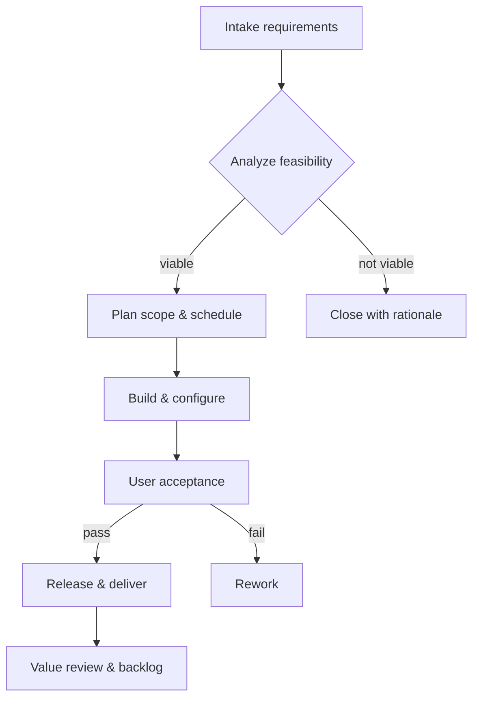
**Structured Text Template**

- **Actors:** Roles involved (e.g., Sponsor, Analyst, Developer, QA, AI Agent).
- **Decisions:** Key gates with criteria and approvers.
- **Responsibilities (RACI):** Per major step.
- **Artifacts:** Requirement doc, backlog items, release notes, report.
- **SLAs & Policies:** Intake SLAs, UAT standards, release window.
- **Source Refs:** Links to policy docs/backlog.

**Good Practices**

- **Decision criteria:** Keep criteria objective and testable; cite policy IDs if available.
- **Escalation paths:** Capture escalation paths for rejected decisions.
- **Privacy checks:** Indicate data privacy checks where applicable, aligning with ITIL Security Management.

### 2) Solution Architecture
From high-level context to module and class internals.

#### 2.1 System (Context)
**What it is**
A C4 Level 1-like view: the entire solution as a unit, its users, and external systems. This is the starting point for a deeper technical understanding.

**Inputs to Collect**

External integrations from ./wiki/BIS API.yml and ./engine/cfg/sql.yml.
User types from GUI usage and org roles.
Data lake/storage layers from repo docs.

**Visualization (Mermaid)**

Use graph TD to depict actors → system → externals and data stores.

**Example Diagram**

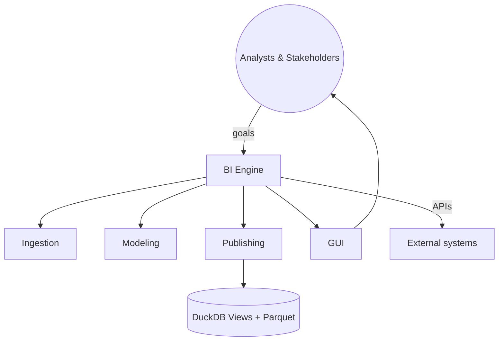
**Structured Text Template**

- **Actors:** Primary users and automation.
- **External Systems:** Names, purpose, protocol (API/ODBC/files).
- **Core Capabilities:** Ingest, Model, Publish, UI, Delivery.
- **Data Stores:** Layers, engines, retention.
- **Security Boundary:** AuthN/Z and secret handling (high level).
- **Source Refs:** ./wiki/BIS API.yml, configs.

**Good Practices**

- **Label interfaces:** Label interfaces by protocol (REST, ODBC, File drop) and directionality (in/out/bidirectional).
- **Trust boundaries:** Identify trust boundaries and compliance-sensitive zones.
- **SLAs:** List known rate limits and SLAs for external systems (if known).

#### 2.2 Modules (Containers/Components)
**What it is**
The structure of major modules and how they interact, defining the architectural layers. Each "module" corresponds to a Python package/folder under ./engine/src/ (e.g., high, low, model, gui, exts).

**Inputs to Collect**

Folder-level READMEs: ./engine/src/**/readme.md.
Import relationships and call patterns among packages.

**Visualization (Mermaid)**

Use flowchart or a C4 container-like diagram; 5–12 nodes max.

**Example Diagram**

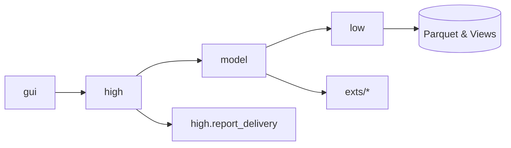
**Structured Text Template**

- **Layer Purpose:** Short role of each module.
- **Contracts:** What each exposes (APIs, files, views) and expects.
- **Interactions:** Typical call paths between modules.
- **Extension Points:** Where new integrations plug in.
- **Source Refs:** Links to module READMEs.

**Good Practices**

- **Module focus:** Keep the module count focused; group minor helpers under their parent module.
- **Public interactions:** Show only stable, public interactions; relegate internals to per-module sections.
- **Anti-coupling:** Note anti-coupling rules (e.g., gui must not import low directly if policies prohibit).

#### 2.3 Classes (Per-Module Class Relations)
**What it is**
Internal class relationships within a specific module/folder, focusing on public classes and key patterns. A UML-like view that is generated per module.

**Inputs to Collect**

Public classes from ./engine/src/<module>/*.py and its README.
Inheritance/composition seen in code (names only; no private methods unless documented).

**Visualization (Mermaid)**

Use classDiagram. Prefer ~10–20 classes max; group by file when helpful.

**Example Diagram**

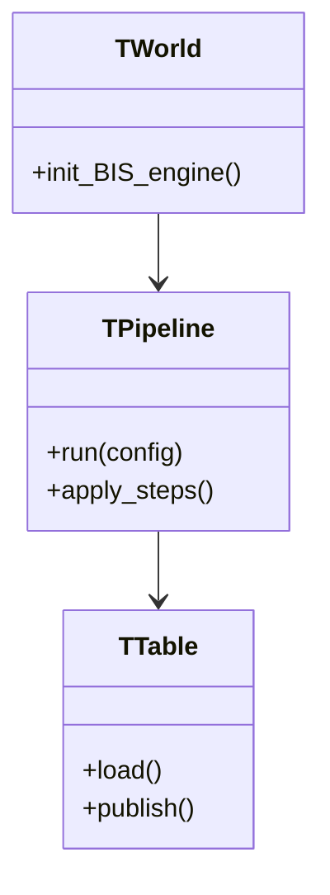
**Structured Text Template**

- **Public Classes:** Names, primary responsibilities.
- **Relations:** Inheritance, composition, collaboration.
- **Key Methods:** Names only for public API.
- **Notes:** Design patterns, constraints, thread-safety, idempotency.
- **Source Refs:** Files containing classes.

**Good Practices**

- **One diagram per module:** One class diagram per Python module folder under ./engine/src/*.
- **Public API only:** Include only public classes and key collaborators; avoid private/internal helpers.
- **Notation:** Show inheritance with <|--, composition with *-- or o--, and dependencies with ..>.
- **Resilience notes:** Document error modes and idempotency in notes when relevant (pipelines, publishers).

#### 2.4 Data Flow (End-to-End Processing)
**What it is**
The movement of data from ingestion to published outputs and delivery. This is a data lineage or pipeline flow view.

**Inputs to Collect**

Pipelines from ./engine/src/model/pipeline.py and YAML under ./engine/cfg/*.yml.
Data lake layout from docs and ./engine/cfg/sql.yml.

**Visualization (Mermaid)**

Use sequenceDiagram for staged processing or flowchart for lineage hops.

**Example Diagram (sequence)**

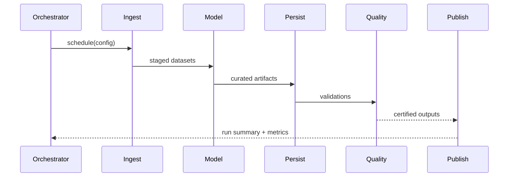
**Structured Text Template**

- **Triggers:** Schedules, manual runs, dependencies.
- **Stages:** For each stage, inputs, transforms, outputs, and storage layer.
- **Data Contracts:** Formats, schemas, versioning.
- **Quality Gates:** Validations, thresholds, handling.
- **Observability:** Metrics, logs emitted.
- **Source Refs:** Pipeline code, quality/config YAMLs.

**Good Practices**

- **Naming consistency:** Keep names consistent with YAML pipeline verbs and table/view names.
- **Retries & error handling:** Note retry/backoff, dead-letter behavior, and compensation steps.
- **Side effects:** Indicate side effects (cache refreshes, email sends) as explicit steps.

#### 2.5 Data Model (Data Lake Structure and Entity Relationships)
**What it is**
A combined lake layout and ER view. This is a TOGAF Data Architecture view, showing folder structure, conventions, and key entities/relationships.

**Inputs to Collect**

- Table/view definitions (DuckDB views, Parquet schemas).
- Schema hints from SQL files and ./engine/cfg/sql.yml.
- Data lake conventions from repo docs and team standards.

**Visualization (Mermaid)**

Use two diagrams:
- flowchart of lake layers and folder conventions (RAW/STAGE/PROD/MASTER/CUSTOM).
- erDiagram of core entities and relationships.

**Example Diagram — Lake Layout**

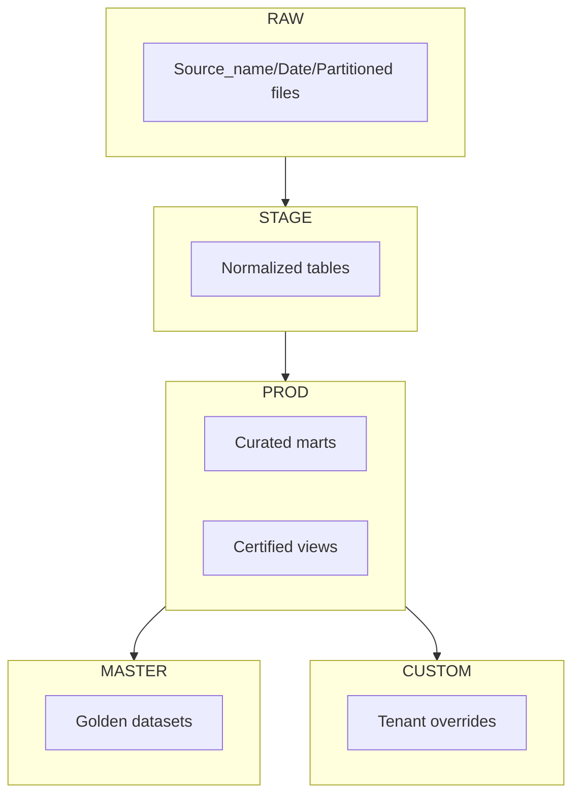
**Example Diagram — ER View**

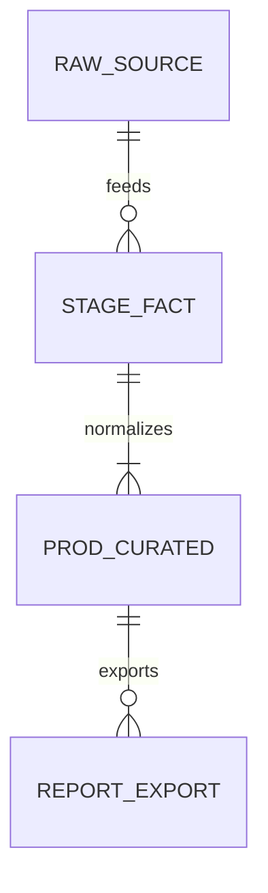
**Structured Text Template**

- **Entities:** Name, grain, primary keys.
- **Attributes:** Key columns and data types (high-level).
- **Relationships:** Cardinalities and join keys.
- **Layering:** Where each entity lives across the lake; naming and folder path conventions.
- **Versioning/Lineage:** How schema changes are handled.
- **Source Refs:** Views/tables creation points.

**Good Practices**

- **Conventions:** Define naming (snake_case), partitioning (by date/tenant), file formats (Parquet), and compression.
- **Data contracts:** Record schema versions and backward‑compat fields; use views to abstract breaking changes.
- **Quality mapping:** Map validations from quality.yml to entities; indicate certification criteria for MASTER.
- **Multi-tenant:** Explain CUSTOM overlays and precedence rules over PROD/MASTER.

#### 2.6 UI Flow (GUI User Journey — Per File)
**What it is**
The sequence of screens/tabs and actions to complete tasks (e.g., report generation). One UI Flow is documented per Python file in ./engine/src/gui/ (e.g., gui_loader.py, gui_pipeline.py, etc.).

**Inputs to Collect**

UI entry points from ./engine/src/gui/gui_main.py and sibling tab files.
Typical user tasks from module READMEs and wiki.

**Visualization (Mermaid)**

Use a flowchart or stateDiagram-v2 for navigation.

**Example Diagram**

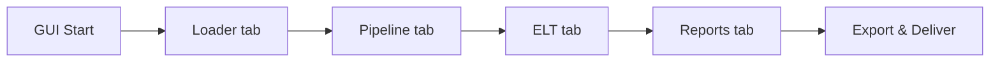
**Structured Text Template**

- **Entry Points:** How a user launches and authenticates (if any).
- **Screens/Tabs:** Ordered navigation with purposes.
- **Actions:** Key user actions and system responses.
- **Error Surfaces:** Where errors appear and how they're resolved.
- **Source Refs:** GUI files and READMEs.

**Good Practices**

- **GUI labels:** Keep labels aligned to tab/file names; include key dialogs and modal steps.
- **Commands per tab:** For each tab, include primary commands (run, validate, export) and state changes.
- **Styling:** Avoid styling; stick to nodes and arrows for clarity.

### 3) People & Operations
These artifacts describe the human and automated elements that support the service.

#### 3.1 Organizational (Roles and RACI)
**What it is**
Roles, responsibilities, and skills across the team, including AI agents and automation boundaries. This is a crucial part of the TOGAF Architecture Governance and ITIL Organizational Change Management.

**Inputs to Collect**

AI personas/agents under .github/chatmodes/ or docs/chatmodes/ (if present).
Persona prompts under .github/prompts/*.
Operating model docs.

**Visualization (Mermaid)**

Use a flowchart or classDiagram to show roles and their primary responsibilities.

**Example Diagram (speculative when chatmodes missing)**

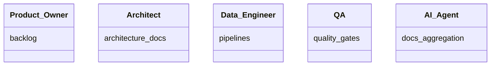
**Structured Text Template**

- **Roles:** List with a brief responsibility statement.
- **RACI:** For key processes (Intake, Build, Release, Incident).
- **Skills:** Core skills per role (brief).
- **Automation:** What AI agents own vs. humans (boundaries).
- **Source Refs:** Operating model docs.

**Good Practices**

- **Derive RACI:** Derive AI Agent RACI from chatmode/persona files (inputs/outputs/quality gates sections).
- **Note gaps:** If .github/chatmodes is absent, note the gap and use persona prompts as provisional sources.
- **Handoffs & escalation:** Include handoffs between humans and agents, and escalation paths.

**AI Agents Relationship Diagram (speculative example)**

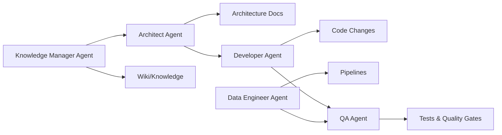
**Example Diagram (derived from current .github/chatmodes)**

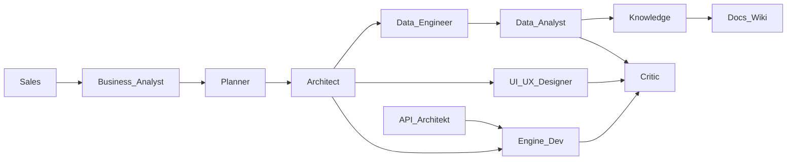
**RACI Example (based on current chatmodes, illustrative)**

- **Architecture docs refresh**
  - **R:** Architect, Knowledge
  - **A:** Architect
  - **C:** Business_Analyst, Data_Engineer, Engine_Dev, UI_UX_Designer
  - **I:** Sales, Critic

- **Release workflow**
  - **R:** Engine_Dev, Data_Engineer
  - **A:** Architect
  - **C:** Critic, Planner
  - **I:** Sales, Business_Analyst

- **Data pipeline change**
  - **R:** Data_Engineer
  - **A:** Architect
  - **C:** Data_Analyst, Engine_Dev
  - **I:** Knowledge, Critic

#### 3.2 Product Backlog (Roadmap Overview)
**What it is**
A visual roadmap that aligns issues and priorities to user journeys. This is a core practice of ITIL Service Strategy.

**Inputs to Collect**

GitHub issues/PRs metadata, wiki roadmap notes, major epics.

**Visualization (Mermaid)**

Use gantt or flowchart to group by epic/quarter.

**Example Diagram (Gantt)**

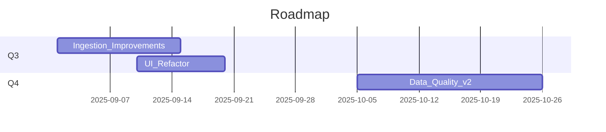
**Structured Text Template**

- **Themes/Epics:** Brief description and goals.
- **Milestones:** Dates and acceptance outcomes.
- **Dependencies:** Cross-team/system dependencies.
- **Metrics:** How progress/value is measured.
- **Source Refs:** Links to issues/boards.

#### 3.3 Deployment (Release Process)
**What it is**
The process for releasing new software versions, including branching, CI, and desktop delivery. This maps directly to ITIL Release and Deployment Management.

**Inputs to Collect**

Branching strategy from repo (e.g., work4 default, work5 feature).
Build/run steps from tasks and requirements.txt.
Release automation from scripts or CI (if any).

**Visualization (Mermaid)**

Use sequenceDiagram or flowchart to show commit → build → test → package → deliver.

**Example Diagram**

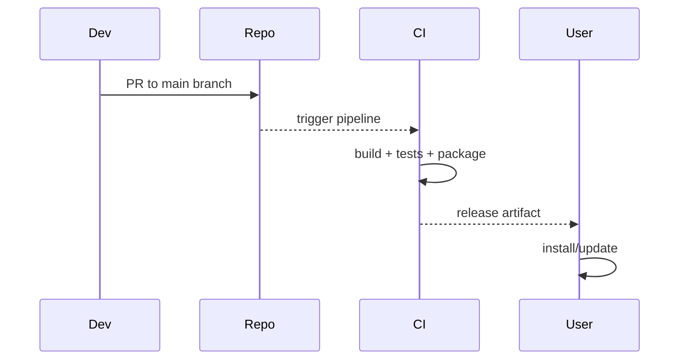
**Additional Diagram (extracted from provided release picture)**

```mermaid
flowchart LR
  subgraph Work4_Line
    W4[work4]
    Branch4[feature branches]
    PR4[PR]
  end
  subgraph Work5_Line
    W5a[work5]
    W5b[work5]
    W5c[work5]
    Branch5[feature branches]
  end
  Fix[Fix] --> Branch4
  Branch4 --> PR4 --> W4
  W4 --> Retrofit[Retrofit to work5] --> W5a --> W5b --> W5c
  Branch5 --> W5a
  subgraph BIS4_5
    DevOD[OneDrive Dev (BIS 4.5)]
  end
  subgraph Legacy
    ALZ[ALZ DAILY (legacy BIS 4)]
  end
  W4 -->|Release forced (no cleanup)| DevOD
  Fix -->|Hot fix| DevOD --> ALZ
  DevOD -->|Copy data| OD5[OneDrive (BIS 5)] --> Test[Test] --> GoLive[GoLive (rename to BIS 5)]
  W5c -->|Release forced (cleanup)| OD5
  GoLive -->|Switch env| ALZ
```
**Structured Text Template**

- **Branching:** Main vs. feature/hotfix; PR rules.
- **Build:** Commands and environments (Windows specifics if relevant).
- **Packaging:** Artifacts and distribution.
- **Rollout:** Channels, approvals, and rollback strategy.
- **Source Refs:** Tasks, scripts, CI configs.

**Good Practices**

- **Short branches:** Keep branch lifetimes short; retrofit merges from stable to next line documented.
- **Environment switches:** Explicitly mark environment switches and data copy steps.
- **Cleanup policy:** Define cleanup policies for releases targeting BIS 5 vs. legacy.

### 4) Advanced Architectural Views
This section introduces additional diagrams and documentation types, inspired by concepts from TOGAF and ITIL, to provide a more holistic view of the system.

#### 4.1 Configuration Management & Service Map
**What it is**
This view, aligned with ITIL Service Asset and Configuration Management, documents the different configuration sources and their precedence. It helps understand how the system's behavior is configured and managed.

**Inputs to Collect**

Configuration files: ./engine/cfg/*.yml, workspace.yml.
CLI arguments.
Environmental variables.

**Visualization (Mermaid)**

Use a flowchart to show the hierarchy of configuration sources, with precedence clearly defined.

**Example Diagram**

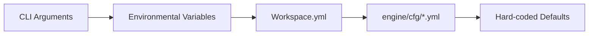
**Structured Text Template**

- **Sources:** List all sources of configuration.
- **Precedence:** Document the order in which settings are applied and overridden.
- **Redaction:** Rules for handling sensitive information within configs.
- **Source Refs:** Links to configuration files and relevant code.

**Good Practices**

- **[REDACTED] handling:** Explain how [REDACTED] values are handled.
- **Fallback logic:** Document the fallback logic if a required configuration is missing.

#### 4.2 Observability Map (ITIL Event Management)
**What it is**
A diagram showing how logs, metrics, and traces are generated and correlated across different stages of the data flow. This is essential for incident management and troubleshooting.

**Inputs to Collect**

Logging patterns from ./engine/src/**/*.py.
Metrics from code.
Known correlation IDs or identifiers passed between stages.

**Visualization (Mermaid)**

Use a sequenceDiagram to show how observability data is emitted and consumed.

**Example Diagram**

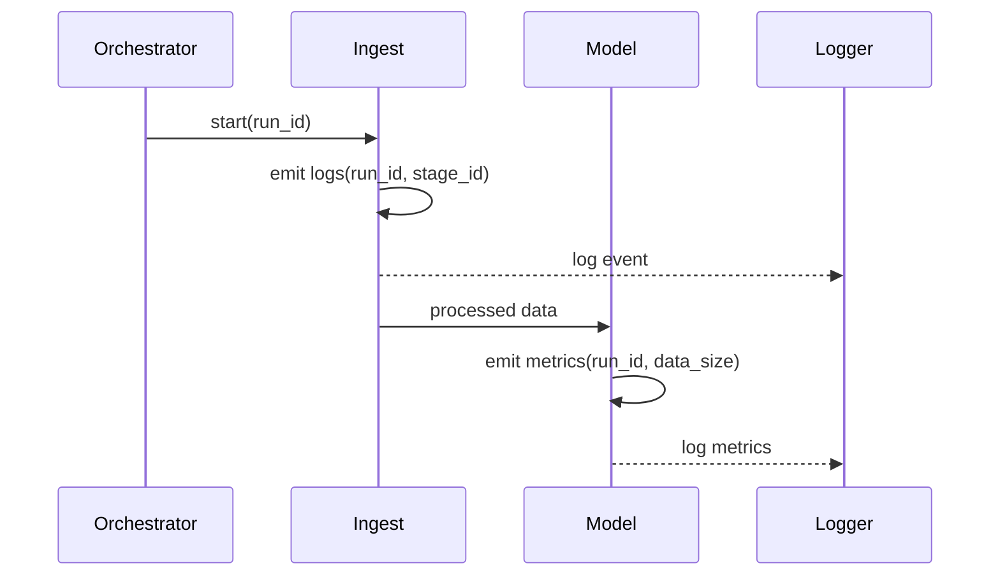
**Structured Text Template**

- **Events:** List types of events (e.g., info, warning, error, metrics).
- **Correlation:** Explain how events are linked (e.g., using run_id).
- **Storage:** Where logs and metrics are stored and for how long.
- **Source Refs:** Links to code files with logging patterns.

**Good Practices**

- **Trace identifiers:** Highlight the key identifiers used for tracing.
- **Log types:** Explain the difference between operational logs and detailed error logs.

## Cross-cutting Documentation Standards

- **Naming:** Use consistent, business-friendly names; avoid acronyms unless defined.
- **Diagrams:** ≤25 nodes, readable layout, clear legends; prefer LR for flows.
- **Formatting:** Avoid colors and custom styles in diagrams; rely on labels only.
- **Templates:** Use the structured text templates above verbatim for consistency.
- **Gaps:** Mark (speculative) where inputs are missing; list next steps to confirm.
- **For AI**: Always use ≤25 nodes in diagrams to ensure readability; prefer LR flows for consistency.

## Acceptance for Completeness

- **Business:** Service model + Business model present.
- **Solution:** System + Modules + Classes (per module) + Data Flow + Data Model + UI Flow present.
- **People & Ops:** Organizational + Product Backlog + Deployment present.
- **Each artifact includes:** Mermaid diagram + structured text + source refs.
- **Redaction:** Never include real credentials/PII; use [REDACTED].
- **Link Validation:** Check that all ./engine/src/** and ./engine/cfg/** links resolve.

## Templates and Stubs

**Consolidated Section**: All minimal structured text stubs are listed here for easy reference. Use these verbatim in outputs.

- **Service Model Stub**
  - **Scope:** …
  - **Entry trigger:** …
  - **Stages:** …
  - **Handoffs & queues:** …
  - **Outcomes:** …
  - **Improvement areas:** …
  - **Source refs:** …

- **Module View Stub**
  - **Layer purpose:** …
  - **Contracts:** …
  - **Interactions:** …
  - **Extension points:** …
  - **Source refs:** …

- **Class View Stub**
  - **Public classes:** …
  - **Relations:** …
  - **Key methods:** …
  - **Notes:** …
  - **Source refs:** …

- **Data Flow Stub**
  - **Triggers:** …
  - **Stages:** …
  - **Data contracts:** …
  - **Quality gates:** …
  - **Observability:** …
  - **Source refs:** …

- **Data Model Stub**
  - **Entities:** …
  - **Attributes:** …
  - **Relationships:** …
  - **Layering:** …
  - **Versioning/lineage:** …
  - **Source refs:** …

- **UI Flow Stub**
  - **Entry points:** …
  - **Screens/tabs:** …
  - **Actions:** …
  - **Error surfaces:** …
  - **Source refs:** …

- **Organizational Stub**
  - **Roles:** …
  - **RACI:** …
  - **Skills:** …
  - **Automation:** …
  - **Source refs:** …
- **Backlog Stub**
  - **Themes/Epics:** …
  - **Milestones:** …
  - **Dependencies:** …
  - **Metrics:** …
  - **Source refs:** …

- **Deployment Stub**
  - **Branching:** …
  - **Build:** …
  - **Packaging:** …
  - **Rollout:** …
  - **Source refs:** …

## Notes for This Repository (BIS)

- **Modules:** Folders under ./engine/src/ (e.g., high, low, model, gui, exts). Produce one consolidated Modules file and one Classes file per module.
- **Data lake:** Uses Parquet and DuckDB views; quality gates configured in ./engine/cfg/quality.yml.
- **GUI tabs:** Located at ./engine/src/gui/*.py; entry is ./engine/src/gui/gui_main.py.
- **Delivery:** Outlook COM on Windows exists in ./engine/src/high/report_delivery.py.
- **UI Flow targets:** See list of per-file targets (./engine/src/gui/gui_*.py).

## Alignment with Instruction Specs
Architecture Aggregation (architecture.md): This guide mirrors required sections and diagrams (Context, Containers/Components, Data Flow, etc.). Idempotence, redaction, link normalization, and speculative labeling are explicitly stated.

Python Docstring-to-README Aggregator: This guide aligns READMEs as primary inputs, with per-file/per-module expectations, class relations, dependency maps, and sequence views. It defines how AI should structure summaries, diagrams, and cross-links.

Chatmodes & Personas: Organizational RACI guidance references .github/chatmodes/*.chatmode.md and .github/prompts/* as the canonical inputs to derive AI agent roles, handoffs, and boundaries.

## Quick Reference for AI Agents
- **Best Practices Enforcement**:
  - **When User Requests Full Enforcement**: If the user explicitly asks to "enforce all practices" or similar, apply ALL best practices from this guide to the relevant architecture documentation.
  - **When User Requests Specific Practice**: If the user asks to enforce a specific practice, always confirm with the user which specific practice(s) they want applied by listing the available section headers from the Content section:
    - 1. Business & Service Architecture
    - 2. Solution Architecture
    - 3. People & Operations
    - 4. Advanced Architectural Views
    - Cross-cutting Documentation Standards
  - **Default Agent Decision**: By default, it's up to the agent to decide which practices to apply or not based on context and documentation analysis.
- **Logging Requirements**: Always maintain detailed logs of practice adoption status. Use structured format with timestamps, file paths, and specific practice references. Regardless of what was implemented, always log which file, section, which practice was applied, in a nice looking log to chat for the user.

- **Key Principles**: AI-first, config-first; enforce tenant isolation and temp file policy.
- **Common Actions**: When speculative, list gaps and suggest next steps. Use UTC timestamps. Proactively offer related tasks.
- **Error Handling**: If sources missing, mark speculative and escalate (e.g., "Gap: No chatmodes found; recommend querying team").
- **Output Format**: Always include diagram, text, and refs; keep concise.


