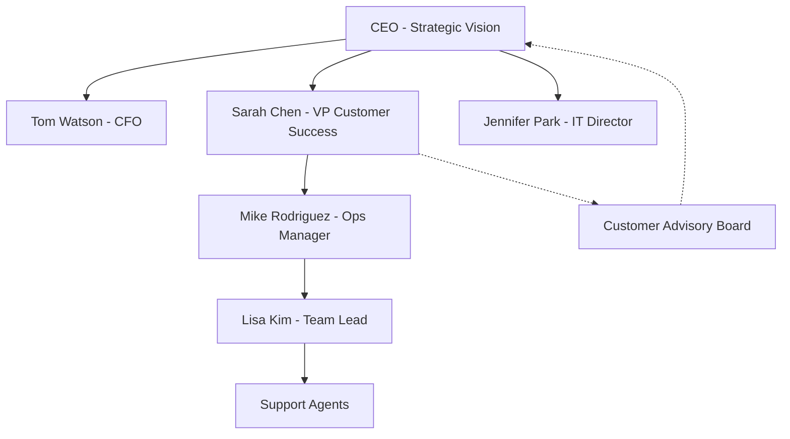

# Business Analysis Best Practices & Guidelines for AI Agents - BIS Repository
<a id="top"></a>

**Target Audience:** AI Agents, Business Analysts, Product Owners, and BIS stakeholders working with business requirements  
**Scope:** All business analysis documentation and requirements in BIS repository (`**/ba_*.md`, requirements docs)  
**Apply to:** `**/ba_*.md` files, business requirements, stakeholder documentation

---

## 📋 Table of Contents
<div align="right"><a href="#top">↑ Back to top</a></div>

- [🎯 Agent Mission & Usage Guide](#-agent-mission--usage-guide)
  - [Purpose](#purpose)
  - [How AI Agents Should Use This Guide](#how-ai-agents-should-use-this-guide)
  - [Decision-Making Framework](#decision-making-framework)
- [🏗️ Core Principles & Business Framework](#️-core-principles--business-framework)
  - [Business-First Architecture (MANDATORY)](#business-first-architecture-mandatory)
  - [Core BA Principles (MANDATORY)](#core-ba-principles-mandatory)
- [⚙️ AI Agent Adaptation Guide](#️-ai-agent-adaptation-guide)
  - [🎯 Agent Decision Framework](#-agent-decision-framework)
  - [🔄 Documentation vs Enhancement Rules](#-documentation-vs-enhancement-rules)
  - [🎨 Practice Categorization for Agents](#-practice-categorization-for-agents)
  - [📊 Enforcement Actions & Logging](#-enforcement-actions--logging)
  - [🔧 Context-Aware Practice Selection](#-context-aware-practice-selection)
- [🤖 AI-Powered Discovery & Extraction](#-ai-powered-discovery--extraction)
  - [Discovery Extraction Classes (MANDATORY)](#discovery-extraction-classes-mandatory)
  - [Prompt Engineering Templates (CONTEXTUAL)](#prompt-engineering-templates-contextual)
  - [Multi-Step Analysis Workflows (ENHANCEMENT)](#multi-step-analysis-workflows-enhancement)
  - [Validation & Refinement Patterns (CONTEXTUAL)](#validation--refinement-patterns-contextual)
- [📊 Business Requirements Structure](#-business-requirements-structure)
  - [Problem Statement Analysis (MANDATORY)](#problem-statement-analysis-mandatory)
  - [Solution Definition Patterns (MANDATORY)](#solution-definition-patterns-mandatory)
  - [Value Proposition Framework (CONTEXTUAL)](#value-proposition-framework-contextual)
  - [Metrics & KPI Definition (MANDATORY)](#metrics--kpi-definition-mandatory)
- [👥 Stakeholder Analysis & Management](#-stakeholder-analysis--management)
  - [Stakeholder Identification (MANDATORY)](#stakeholder-identification-mandatory)
  - [RACI Matrix Construction (CONTEXTUAL)](#raci-matrix-construction-contextual)
  - [Influence Mapping (ENHANCEMENT)](#influence-mapping-enhancement)
  - [Communication Strategies (CONTEXTUAL)](#communication-strategies-contextual)
- [🔍 Discovery Methods & Tools](#-discovery-methods--tools)
  - [Interview Techniques (CONTEXTUAL)](#interview-techniques-contextual)
  - [Process Mapping (ENHANCEMENT)](#process-mapping-enhancement)
  - [Risk Assessment Framework (MANDATORY)](#risk-assessment-framework-mandatory)
  - [Assumption Management (MANDATORY)](#assumption-management-mandatory)
- [📝 Structured Documentation Output](#-structured-documentation-output)
  - [Document Templates (MANDATORY)](#document-templates-mandatory)
  - [Markdown Best Practices (CONTEXTUAL)](#markdown-best-practices-contextual)
  - [Diagram Guidelines (ENHANCEMENT)](#diagram-guidelines-enhancement)
  - [Version Control Patterns (CONTEXTUAL)](#version-control-patterns-contextual)
- [🎯 Quality Assurance & Validation](#-quality-assurance--validation)
  - [Acceptance Criteria Framework (MANDATORY)](#acceptance-criteria-framework-mandatory)
  - [Business Rules Validation (MANDATORY)](#business-rules-validation-mandatory)
  - [Scope Management (MANDATORY)](#scope-management-mandatory)
  - [Traceability Matrix (CONTEXTUAL)](#traceability-matrix-contextual)
- [📈 Advanced Analytics & Enhancement](#-advanced-analytics--enhancement)
  - [SRE-Inspired Error Budgets (ENHANCEMENT)](#sre-inspired-error-budgets-enhancement)
  - [Business Intelligence Patterns (ENHANCEMENT)](#business-intelligence-patterns-enhancement)
  - [Predictive Analysis Framework (ENHANCEMENT)](#predictive-analysis-framework-enhancement)
  - [Data Assessment Techniques (CONTEXTUAL)](#data-assessment-techniques-contextual)
- [✅ Quick Validation Checklist](#-quick-validation-checklist)
  - [Business Requirements ✅](#business-requirements-)
  - [Stakeholder Analysis ✅](#stakeholder-analysis-)
  - [Documentation Quality ✅](#documentation-quality-)
  - [Risk & Assumptions ✅](#risk--assumptions-)
  - [AI Agent Compliance ✅](#ai-agent-compliance-)
- [🛠️ Development Workflow](#️-development-workflow)
  - [BA Document Lifecycle](#ba-document-lifecycle)
  - [Review & Approval Process](#review--approval-process)
  - [AI Agent Enforcement Examples](#ai-agent-enforcement-examples)
- [🎯 Practice Priority Matrix](#-practice-priority-matrix)
- [🔍 Troubleshooting Common Issues](#-troubleshooting-common-issues)
- [🎯 Final Note for AI Agents](#-final-note-for-ai-agents)

---

## 🎯 Agent Mission & Usage Guide
<div align="right"><a href="#top">↑ Back to top</a></div>

### Purpose
This guide provides comprehensive business analysis standards for AI agents working on the BIS repository. It combines business methodology, stakeholder management, and documentation patterns to ensure consistent, actionable, and stakeholder-focused business analysis deliverables.

### How AI Agents Should Use This Guide

**Decision-Making Framework:**
- **MANDATORY PRACTICES**: Must always be applied (KPI definitions, risk classification, stakeholder RACI, acceptance criteria)
- **CONTEXTUAL PRACTICES**: Apply based on business context (SIPOC diagrams for process analysis, advanced analytics for complex cases)
- **ENHANCEMENT PRACTICES**: Apply when improving existing documentation or when explicitly requested

**User Prompts & Enforcement:**
- **"Apply all practices"**: Agent MUST implement ALL applicable practices from this guide
- **"Force update documentation"**: Agent MUST overwrite existing BA documents completely
- **"Enforce best practices"**: Agent selects and applies relevant practices based on business context

**Scope of Autonomy:**
- Agents can decide which practices are relevant to the current business analysis task
- When in doubt, err on the side of applying more comprehensive analysis rather than less
- Always log what practices were applied for transparency and audit trails

---

## 🏗️ Core Principles & Business Framework
<div align="right"><a href="#top">↑ Back to top</a></div>

### Business-First Architecture (MANDATORY)

The BIS business analysis follows a **stakeholder-centric** design with clear separation of concerns:

```
┌─────────────────────────────┐
│   Business Strategy Layer   │  ← Outcomes, KPIs, value proposition
├─────────────────────────────┤
│ Requirements Layer          │  ← Functional, non-functional, constraints
├─────────────────────────────┤
│ Implementation Layer        │  ← Technical solution, architecture
└─────────────────────────────┘
```

**✅ Correct Implementation:**
*Reason: This correctly implements business-first analysis by starting with business outcomes and working down to implementation, ensuring all technical decisions align with business value.*

```markdown
## Business Outcome
**Goal**: Reduce customer churn by 15% within 6 months
**KPI**: Monthly churn rate < 5%
**Owner**: VP Customer Success

## Requirements
**Functional**: Real-time churn prediction dashboard
**Non-Functional**: 99.5% uptime, <2 second response time
**Constraints**: Must integrate with existing CRM

## Implementation Approach
**Technical Solution**: Machine learning pipeline with PowerBI dashboard
**Architecture**: Delegate to technical team after requirements approval
```

**❌ Wrong Implementation:**
*Reason: This violates business-first principles by jumping straight to technical solutions without defining business outcomes, KPIs, or stakeholder needs. This leads to solutions that may not address actual business problems.*

```markdown
## Technical Solution
We need a Python ML model using scikit-learn to predict churn.
Database: PostgreSQL with real-time analytics.
Dashboard: React frontend with REST API.
```

### Core BA Principles (MANDATORY)

#### 1. Outcome-Driven Analysis
All analysis must start with clear business outcomes and success metrics.

**✅ Correct Implementation:**
*Reason: Starts with measurable business outcome, defines success criteria, and includes ownership. This ensures all subsequent analysis serves a clear business purpose.*

```markdown
## Business Outcome
**Problem**: Customer support resolution time averaging 4.2 hours
**Target Outcome**: Reduce average resolution time to <2 hours
**Success Metric**: Average resolution time ≤ 2 hours for 95% of tickets
**Business Impact**: $2M annual savings in operational costs
**Owner**: Director of Customer Operations
```

#### 2. Stakeholder-Centric Approach
Every requirement must be traceable to specific stakeholder needs.

**✅ Correct Implementation:**
*Reason: Links each requirement to specific stakeholders with clear value justification and acceptance criteria.*

```markdown
## Stakeholder Requirements Map

| Requirement | Stakeholder | Value | Acceptance Criteria |
|-------------|-------------|-------|-------------------|
| Real-time ticket status | Support Agents | Reduce context switching | Status updates within 5 seconds |
| Escalation alerts | Support Managers | Proactive management | Automated alerts for >2hr tickets |
| Performance metrics | VP Operations | Strategic visibility | Daily executive dashboard |
```

#### 3. Risk-First Documentation
Assumptions and risks must be explicitly documented and classified.

**✅ Correct Implementation:**
*Reason: Uses clear risk classification system with impact assessment and mitigation strategies, enabling proactive risk management.*

```markdown
## Risk Assessment

| Risk | Probability | Impact | Classification | Mitigation |
|------|-------------|--------|----------------|------------|
| API rate limits | High | 🔴 Blocking | Technical | Implement caching layer |
| Stakeholder availability | Medium | 🟡 Partial | Resource | Weekly commitment confirmation |
| Data quality issues | Low | 🟢 Minor | Data | Automated validation rules |
```

---

## ⚙️ AI Agent Adaptation Guide
<div align="right"><a href="#top">↑ Back to top</a></div>

### 🎯 Agent Decision Framework

#### Trigger Word Recognition (MANDATORY)
**AI agents MUST recognize these user prompts and respond accordingly:**

| User Prompt Pattern | Agent Action | Scope | Documentation Level |
|---------------------|--------------|-------|-------------------|
| **"complete business analysis"** | Apply ALL applicable practices | Full document | Complete rewrite |
| **"analyze requirements"** | Apply business requirements practices | Requirements sections | Selective updates |
| **"map stakeholders"** | Apply stakeholder analysis practices | Stakeholder sections | Targeted updates |
| **"extract from [source]"** | Apply AI discovery patterns | Extraction tasks | New content |
| **"validate business case"** | Apply validation practices | Quality checks | Incremental validation |
| **"document assumptions"** | Apply risk/assumption practices | Risk sections | Targeted documentation |

#### Decision Tree for Practice Application

```
User Request
    ├── Contains "complete" or "full analysis"?
    │   ├── Yes → Apply ALL relevant practices
    │   └── No → Check specific domain
    ├── Contains stakeholder keywords?
    │   ├── Yes → Apply stakeholder analysis practices
    │   └── No → Continue evaluation
    ├── Contains risk/assumption keywords?
    │   ├── Yes → Apply risk assessment practices
    │   └── No → Apply contextual practices based on content
    └── Default → Apply mandatory practices only
```

### 🔄 Documentation vs Enhancement Rules

#### Complete Documentation Triggers (MANDATORY)
**Agent MUST create comprehensive documentation when:**
- User says "complete", "full", "comprehensive", "from scratch"
- User says "complete business analysis"
- User provides raw source material for analysis
- No existing BA documentation found
- Business requirements are unclear or missing

#### Incremental Update Triggers (CONTEXTUAL)
**Agent SHOULD update incrementally when:**
- User mentions specific practice ("add stakeholder analysis", "update KPIs")
- Documentation exists but needs specific improvements
- User says "enhance" or "improve" without "complete"
- Working with established requirements that function correctly

### 🎨 Practice Categorization for Agents

#### MANDATORY Practices (Always Apply)
```yaml
business_requirements:
  - kpi_operational_definitions
  - risk_classification_system
  - stakeholder_raci_matrix
  - acceptance_criteria_traceability

documentation:
  - problem_statement_structure
  - solution_definition_framework
  - scope_boundary_documentation
  - assumption_explicit_tracking
```

#### CONTEXTUAL Practices (Apply Based on Business Context)
```yaml
process_analysis:
  - sipoc_diagrams
  - workflow_mapping
  - value_stream_analysis

complex_projects:
  - kpi_tree_decomposition
  - advanced_stakeholder_mapping
  - multi_phase_planning

integration_projects:
  - data_lineage_analysis
  - system_dependency_mapping
  - change_impact_assessment
```

#### ENHANCEMENT Practices (Apply When Improving)
```yaml
advanced_analytics:
  - predictive_analysis_patterns
  - sre_error_budgets
  - business_intelligence_integration

quality_improvements:
  - traceability_matrices
  - automated_validation
  - continuous_improvement_feedback
```

### 📊 Enforcement Actions & Logging

#### Logging Requirements (MANDATORY)
**Agent MUST log enforcement actions in this format:**

```text
[BA ENFORCEMENT LOG - YYYY-MM-DD HH:MM:SS]
==========================================
Trigger: "{user_prompt}"
Action Level: {complete_analysis | incremental_update | targeted_extraction}
Scope: {document_path | section_name | stakeholder_group}

Documents Modified:
- {document_path_1}
  Practices Applied:
  ✅ {practice_name}: {specific_change_description}
  
- {document_path_2}
  Practices Applied:
  ✅ {practice_name}: {specific_change_description}

Extraction Results:
- Business Context: {extracted_elements}
- Stakeholders Identified: {count}
- Risks Classified: {count}
- KPIs Defined: {count}

Summary:
- Total Documents: {count}
- Total Practices Applied: {count}
- Mandatory Practices: {count}
- Contextual Practices: {count}
- Enhancement Practices: {count}
- Business Impact Score: {Low | Medium | High}
- Stakeholder Coverage: {percentage}%
```

#### Agent Self-Validation Checklist
**Before completing enforcement, agent MUST verify:**
- [ ] All mandatory practices for document type applied
- [ ] Stakeholder RACI matrix is complete and valid
- [ ] All KPIs have operational definitions
- [ ] Risks are properly classified (🔴🟡🟢)
- [ ] Assumptions are explicitly documented
- [ ] Acceptance criteria are measurable and testable
- [ ] All outputs are in `temp/BUSINESS_ANALYST/` directory
- [ ] Business outcomes are clearly linked to requirements

### 🔧 Context-Aware Practice Selection

#### Document Type Detection
```python
# Agent logic for practice selection
def select_ba_practices(document_type: str, user_prompt: str, content: str = "") -> list:
    practices = []
    
    # Mandatory practices for all BA documents
    practices.extend(['kpi_definitions', 'stakeholder_raci', 'risk_classification'])
    
    # Context-specific practices
    if 'requirements' in document_type.lower():
        practices.extend(['functional_requirements', 'acceptance_criteria'])
    
    if 'stakeholder' in user_prompt.lower():
        practices.extend(['stakeholder_mapping', 'influence_analysis'])
        
    if 'process' in content.lower():
        practices.extend(['sipoc_diagram', 'workflow_mapping'])
        
    if 'risk' in user_prompt.lower():
        practices.extend(['risk_assessment', 'mitigation_planning'])
    
    return list(set(practices))  # Remove duplicates
```

---

## 🤖 AI-Powered Discovery & Extraction
<div align="right"><a href="#top">↑ Back to top</a></div>

### Discovery Extraction Classes (MANDATORY)

**AI agents MUST be capable of extracting these business elements from unstructured content:**

#### Business Context Extraction
```markdown
**Extraction Target**: Industry, company size, business model, market position
**Source Types**: Company descriptions, meeting notes, strategic documents
**Output Format**: Structured context profile with industry classification
```

#### Problem Statement Extraction
```markdown
**Extraction Target**: Core business pain points, impact quantification, urgency factors
**Source Types**: Interview transcripts, complaint logs, performance reports
**Output Format**: Structured problem statements with measurable impact
```

#### Solution Requirements Extraction
```markdown
**Extraction Target**: Functional needs, technical constraints, success criteria
**Source Types**: RFP documents, user stories, technical specifications
**Output Format**: Categorized requirements with priority classification
```

#### Stakeholder Ecosystem Extraction
```markdown
**Extraction Target**: Roles, responsibilities, influence levels, communication preferences
**Source Types**: Org charts, meeting attendee lists, email threads
**Output Format**: RACI matrix with contact information and influence mapping
```

### Prompt Engineering Templates (CONTEXTUAL)

#### Problem Statement Extraction Prompt
```markdown
**Prompt Template:**
"Analyze the following content and extract business problems using this structure:

FOR EACH PROBLEM IDENTIFIED:
1. **Problem Statement**: [One clear sentence]
2. **Business Impact**: [Quantified cost/risk/opportunity]
3. **Affected Stakeholders**: [Who is impacted]
4. **Urgency Level**: [Critical/High/Medium/Low]
5. **Current State**: [How it works now]
6. **Desired State**: [How it should work]

Content to analyze:
[INSERT CONTENT HERE]

Output format: Structured markdown table"
```

**✅ Correct Usage:**
*Reason: This prompt provides clear structure, specific output format, and ensures all critical problem elements are captured systematically.*

```markdown
**Input**: "Our customer support team is overwhelmed. Tickets take forever to resolve and customers are complaining. We're losing business because of poor service quality."

**AI Output**:
| Element | Details |
|---------|---------|
| Problem Statement | Customer support resolution times exceed acceptable standards |
| Business Impact | Customer churn risk, revenue loss estimated at $500K annually |
| Affected Stakeholders | Customers, Support Team, Sales Team, Management |
| Urgency Level | Critical |
| Current State | Manual ticket processing, no prioritization, 4+ hour resolution |
| Desired State | Automated triage, <2 hour resolution, customer satisfaction >90% |
```

**❌ Wrong Usage:**
*Reason: Vague prompt leads to unstructured output that doesn't provide actionable business insights or clear problem definition.*

```markdown
**Input**: "Our customer support team is overwhelmed. Tickets take forever to resolve and customers are complaining."

**Poor AI Output**: "The company has support issues that need to be fixed."
```

#### Stakeholder Analysis Extraction Prompt
```markdown
**Prompt Template:**
"Extract stakeholder information from the content below and create a RACI matrix:

FOR EACH STAKEHOLDER:
1. **Name/Role**: [Title and name if available]
2. **Department**: [Organizational unit]
3. **Responsibility Level**: [R/A/C/I for this project]
4. **Influence Level**: [High/Medium/Low]
5. **Interest Level**: [High/Medium/Low]
6. **Communication Preference**: [Email/Meeting/Dashboard/etc.]
7. **Key Concerns**: [Primary interests/worries]

Content to analyze:
[INSERT CONTENT HERE]

Create both a RACI matrix table and an influence/interest grid."
```

**✅ Correct Usage:**
*Reason: Comprehensive stakeholder extraction that provides actionable information for engagement strategies and project planning.*

```markdown
**Input**: "John Smith (VP Sales) needs daily reports. Mary Johnson from IT will implement the solution. The CEO wants monthly updates on ROI. Support managers need real-time access to data."

**AI Output**:
| Stakeholder | Role | RACI | Influence | Interest | Communication | Key Concerns |
|-------------|------|------|-----------|----------|---------------|--------------|
| John Smith | VP Sales | A | High | High | Daily email | Sales impact, data accuracy |
| Mary Johnson | IT Manager | R | Medium | Medium | Technical meetings | Implementation complexity |
| CEO | Executive | I | High | Medium | Monthly reports | ROI, strategic value |
| Support Managers | Operations | C | Medium | High | Real-time dashboard | Operational efficiency |
```

#### KPI & Metrics Discovery Prompt
```markdown
**Prompt Template:**
"Identify and define KPIs from the business context below:

FOR EACH METRIC MENTIONED OR IMPLIED:
1. **Metric Name**: [Clear, business-friendly name]
2. **Definition**: [What it measures in business terms]
3. **Formula**: [High-level calculation method]
4. **Unit**: [Percentage, count, currency, time, etc.]
5. **Target Value**: [Desired goal if mentioned]
6. **Measurement Frequency**: [Daily/Weekly/Monthly]
7. **Data Source**: [Where the data comes from]
8. **Owner**: [Who is accountable for this metric]
9. **Business Relevance**: [Why this metric matters]

Content to analyze:
[INSERT CONTENT HERE]

Also suggest any IMPLIED metrics that would be valuable for measuring success."
```

**✅ Correct Usage:**
*Reason: Comprehensive KPI extraction that creates actionable, measurable business metrics with clear ownership and business context.*

```markdown
**Input**: "We want to improve customer satisfaction and reduce support costs. Currently spending $2M annually on support with 60% customer satisfaction. Want to achieve 90% satisfaction while reducing costs by 25%."

**AI Output**:
| Metric | Definition | Formula | Unit | Target | Frequency | Source | Owner | Relevance |
|--------|------------|---------|------|--------|-----------|--------|-------|-----------|
| Customer Satisfaction Score | Customer satisfaction with support experience | (Satisfied responses / Total responses) × 100 | Percentage | 90% | Monthly | Survey data | VP Customer Success | Primary success indicator |
| Support Cost per Ticket | Average cost to resolve each support ticket | Total support costs / Number of tickets | Currency | $75 | Monthly | Financial system | CFO | Cost efficiency measure |
| First Contact Resolution Rate | Percentage of tickets resolved on first contact | (FCR tickets / Total tickets) × 100 | Percentage | 80% | Weekly | Support system | Support Manager | Quality and efficiency |

**Implied Metrics**:
- Average Resolution Time (hours)
- Support Agent Productivity (tickets/day)
- Customer Effort Score (survey-based)
```

#### Technology & Solution Extraction Prompt
```markdown
**Prompt Template:**
"Extract technology and solution requirements from the content:

CURRENT TECHNOLOGY LANDSCAPE:
1. **Existing Systems**: [List current tools/platforms]
2. **Integration Points**: [How systems connect]
3. **Technical Constraints**: [Limitations, compliance requirements]
4. **Data Sources**: [Where information originates]

SOLUTION REQUIREMENTS:
1. **Functional Requirements**: [What the solution must do]
2. **Non-Functional Requirements**: [Performance, security, scalability]
3. **Integration Requirements**: [How it connects to existing systems]
4. **Technology Preferences**: [Preferred platforms/vendors]

Content to analyze:
[INSERT CONTENT HERE]

Flag any technical risks or compatibility concerns."
```

### Multi-Step Analysis Workflows (ENHANCEMENT)

#### Comprehensive Business Analysis Workflow
```markdown
**Step 1: Context Discovery**
Prompt: "Extract business context and stakeholder ecosystem"
Output: Business profile + stakeholder map

**Step 2: Problem Analysis**
Prompt: "Identify and prioritize business problems"
Output: Problem statement matrix with impact assessment

**Step 3: Solution Requirements**
Prompt: "Define functional and non-functional requirements"
Output: Requirements catalog with acceptance criteria

**Step 4: Success Metrics**
Prompt: "Define KPIs and success measurements"
Output: Metrics framework with targets and ownership

**Step 5: Risk Assessment**
Prompt: "Identify risks, assumptions, and mitigation strategies"
Output: Risk register with classification and mitigation plans

**Step 6: Implementation Planning**
Prompt: "Create high-level implementation approach"
Output: Project roadmap with milestones and dependencies
```

#### Iterative Refinement Workflow
```markdown
**Round 1: Initial Extraction**
- Extract raw elements from source material
- Create preliminary business analysis structure

**Round 2: Validation & Enrichment**
- Validate extracted elements against business logic
- Add missing elements and relationships
- Suggest additional considerations

**Round 3: Stakeholder Review Preparation**
- Format for stakeholder consumption
- Create summary views and detailed appendices
- Prepare review questions and validation checkpoints

**Round 4: Finalization**
- Incorporate stakeholder feedback
- Finalize acceptance criteria and success metrics
- Create implementation handoff documentation
```

### Validation & Refinement Patterns (CONTEXTUAL)

#### Business Logic Validation Prompts
```markdown
**Validation Prompt:**
"Review the extracted business analysis for logical consistency:

CHECK FOR:
1. **Stakeholder Completeness**: Are all affected parties identified?
2. **Metric Feasibility**: Are the KPIs measurable with available data?
3. **Requirement Gaps**: Are there functional gaps between problems and solutions?
4. **Risk Coverage**: Are all major risk categories addressed?
5. **Success Criteria Alignment**: Do acceptance criteria align with business goals?

VALIDATION QUESTIONS:
- Does each problem statement have a corresponding solution requirement?
- Are all KPIs owned by identified stakeholders?
- Do the timelines align with business urgency levels?
- Are the technical requirements feasible within stated constraints?

Content to validate:
[INSERT BUSINESS ANALYSIS]

Provide specific recommendations for improvements."
```

#### Stakeholder Perspective Validation
```markdown
**Multi-Perspective Prompt:**
"Evaluate this business analysis from different stakeholder perspectives:

EXECUTIVE PERSPECTIVE:
- Is the business value clear and quantified?
- Are the risks and mitigation strategies comprehensive?
- Is the ROI justification sufficient?

OPERATIONAL PERSPECTIVE:
- Are the requirements implementable?
- Are the timelines realistic?
- Are resource requirements identified?

TECHNICAL PERSPECTIVE:
- Are integration requirements feasible?
- Are performance targets achievable?
- Are technical risks adequately addressed?

END USER PERSPECTIVE:
- Will the solution address their actual pain points?
- Are usability requirements considered?
- Is change management planning adequate?

Business Analysis to Review:
[INSERT CONTENT]

Provide perspective-specific feedback and recommendations."
```

#### Completeness Check Prompts
```markdown
**Completeness Audit Prompt:**
"Audit this business analysis for completeness using the BIS framework:

MANDATORY ELEMENTS CHECK:
□ Business outcome clearly defined
□ Problem statements with quantified impact
□ Stakeholder RACI matrix complete
□ KPIs with operational definitions
□ Risk classification (🔴🟡🟢) applied
□ Acceptance criteria measurable and testable
□ Scope boundaries explicitly defined
□ Assumptions explicitly documented

CONTEXTUAL ELEMENTS CHECK:
□ Process diagrams where applicable
□ Technology landscape documented
□ Data sources identified
□ Integration requirements specified
□ Change management considerations
□ Success metrics ownership assigned

ENHANCEMENT ELEMENTS CHECK:
□ Advanced analytics opportunities
□ Predictive analysis potential
□ Continuous improvement framework
□ Business intelligence integration

Content to audit:
[INSERT BUSINESS ANALYSIS]

Provide a completeness score and specific recommendations for missing elements."
```

**✅ Correct Validation Implementation:**
*Reason: Systematic validation ensures comprehensive coverage and identifies gaps before stakeholder review.*

```markdown
**Validation Results:**
Completeness Score: 85%

**Missing Mandatory Elements:**
- Risk mitigation strategies for 🔴 risks
- Operational definitions for 2 KPIs
- Acceptance criteria for non-functional requirements

**Missing Contextual Elements:**
- Data quality assessment
- Change management strategy for affected departments

**Recommendations:**
1. Add specific mitigation plans for identified blocking risks
2. Define measurement methodology for "Customer Satisfaction Score" and "System Performance"
3. Include user training requirements in acceptance criteria
4. Assess data accuracy requirements for reporting KPIs
5. Plan communication strategy for organizational changes
```

---

## 📊 Business Requirements Structure

<div align="right"><a href="#top">↑ Back to top</a></div>

### Problem Statement Analysis (MANDATORY)

**Business problems must be analyzed with quantified impact and clear causality.**

**✅ Correct Problem Statement:**
*Reason: Specific, measurable impact with clear causality and affected stakeholders. Provides baseline for solution evaluation.*

```markdown
## Problem Statement

**Problem**: Customer service resolution time exceeds industry standards
**Current State**: Average resolution time of 4.2 hours (industry benchmark: 2.0 hours)
**Business Impact**: 
- Customer satisfaction score declined to 65% (target: 90%)
- 23% increase in customer churn over 6 months
- $2.1M annual revenue at risk
**Affected Stakeholders**: 
- Customers (poor experience)
- Support agents (overwhelming workload)
- Sales team (reputation impact)
**Root Cause**: Manual ticket routing and lack of priority classification
**Urgency**: Critical - Q3 customer retention targets at risk
```

**❌ Wrong Problem Statement:**
*Reason: Vague, unmeasurable, no business impact quantification, and no stakeholder analysis. Impossible to validate solutions or measure success.*

```markdown
## Problem Statement
Customer service is slow and customers are unhappy. We need better tools to help our support team work faster.
```

### Solution Definition Patterns (MANDATORY)

**Solutions must be defined in terms of business capabilities, not technical implementation.**

**✅ Correct Solution Definition:**
*Reason: Focuses on business capabilities and outcomes while leaving technical implementation flexible. Includes measurable success criteria.*

```markdown
## Solution Definition

**Business Capability**: Intelligent customer service management platform
**Core Functions**:
1. Automated ticket routing based on customer tier and issue complexity
2. Real-time workload balancing across support agents
3. Escalation management with SLA monitoring
4. Customer communication automation for status updates

**Success Criteria**:
- Average resolution time ≤ 2.0 hours
- Customer satisfaction score ≥ 90%
- Support agent productivity increased by 40%
- 95% SLA compliance for priority tickets

**Non-Goals**:
- Customer self-service portal (separate project)
- Integration with third-party CRM systems
- Advanced analytics and reporting (phase 2)

**Essential Properties**:
- Real-time processing (≤ 30 seconds for routing decisions)
- 99.9% uptime during business hours
- Scalable to 1000+ concurrent tickets
- Audit trail for all customer interactions
```

**❌ Wrong Solution Definition:**
*Reason: Jumps to technical implementation without defining business value or success criteria. No measurable outcomes or stakeholder considerations.*

```markdown
## Solution Definition
Build a web application with React frontend and Node.js backend. Use PostgreSQL database for ticket storage and implement machine learning for ticket classification.
```

### Value Proposition Framework (CONTEXTUAL)

**Value propositions should quantify business benefits with ROI analysis.**

**✅ Correct Value Proposition:**
*Reason: Quantified benefits with clear ROI calculation and timeline. Links business outcomes to specific stakeholder value.*

```markdown
## Value Proposition Analysis

**Investment Required**: $850K (development + first year operation)

**Quantified Benefits** (Annual):
| Benefit Category | Current Cost | Target Cost | Annual Savings |
|------------------|--------------|-------------|----------------|
| Support Operations | $3.2M | $2.4M | $800K |
| Customer Churn | $2.1M | $600K | $1.5M |
| Agent Overtime | $450K | $180K | $270K |
| **Total Benefits** | **$5.75M** | **$3.18M** | **$2.57M** |

**ROI Calculation**:
- Net Annual Benefit: $2.57M - $850K = $1.72M
- ROI: 202%
- Payback Period: 4.9 months

**Stakeholder Value**:
- **Customers**: Faster resolution, improved satisfaction
- **Support Team**: Reduced stress, focus on complex issues
- **Management**: Cost reduction, improved metrics
- **Sales**: Better customer references, reduced churn impact

**Risk-Adjusted ROI**: 145% (accounting for 30% implementation risk)
```

### Metrics & KPI Definition (MANDATORY)
<div align="right"><a href="#top">↑ Back to top</a></div>

> **🔗 See Also**: For SQL implementation patterns of KPIs and metrics calculation, refer to the [SQL Advanced Analytics & SLA Metrics](best-practices_sql.instructions.md#advanced-analytics-preventive-predictive--sla) section.

**All KPIs must have complete operational definitions with measurement methodology.**

**✅ Correct KPI Definition:**
*Reason: Complete operational definition with clear measurement methodology, ownership, and business context. Enables consistent measurement and accountability.*

```markdown
## KPI Operational Definitions

### Customer Satisfaction Score (CSAT)
- **Definition**: Percentage of customers rating their support experience as "Satisfied" or "Very Satisfied"
- **Formula**: (Satisfied + Very Satisfied responses) / Total survey responses × 100
- **Unit**: Percentage (0-100%)
- **Measurement Frequency**: Monthly
- **Data Source**: Post-resolution customer survey (5-point scale)
- **Target**: ≥ 90%
- **Tolerance**: ±2% (88%-92% acceptable range)
- **Owner**: VP Customer Success
- **Escalation Trigger**: <85% for 2 consecutive months
- **Business Context**: Primary indicator of solution effectiveness and customer experience quality

### Average Resolution Time (ART)
- **Definition**: Mean time from ticket creation to customer-accepted resolution
- **Formula**: SUM(Resolution Time for all closed tickets) / COUNT(Closed tickets)
- **Unit**: Hours (to 1 decimal place)
- **Measurement Frequency**: Daily (with weekly trending)
- **Data Source**: Support ticket system timestamps
- **Target**: ≤ 2.0 hours
- **Tolerance**: ±0.3 hours (1.7-2.3 hours acceptable)
- **Owner**: Support Operations Manager
- **Escalation Trigger**: >2.5 hours for 3 consecutive days
- **Exclusions**: Tickets requiring external vendor support
- **Business Context**: Core efficiency metric directly tied to customer satisfaction and operational costs

### First Contact Resolution Rate (FCR)
- **Definition**: Percentage of tickets resolved during initial customer contact
- **Formula**: COUNT(Tickets resolved on first contact) / COUNT(Total tickets) × 100
- **Unit**: Percentage (0-100%)
- **Measurement Frequency**: Weekly
- **Data Source**: Support ticket interaction log
- **Target**: ≥ 75%
- **Tolerance**: ±5% (70%-80% acceptable range)
- **Owner**: Support Team Lead
- **Business Context**: Quality indicator showing solution comprehensiveness and agent capability
```

**❌ Wrong KPI Definition:**
*Reason: Incomplete definition with no measurement methodology, unclear ownership, and vague targets. Cannot be consistently measured or validated.*

```markdown
## KPIs
- Improve customer satisfaction
- Reduce support costs
- Make agents more productive
- Better response times
```

---

## 👥 Stakeholder Analysis & Management
<div align="right"><a href="#top">↑ Back to top</a></div>

> **🔗 See Also**: For technical implementation of user-centered design and UI responsiveness, refer to the [Python PySide/Qt UI Best Practices](best-practices_python.instructions.md#️-pysideqt-ui-best-practices) section.

### Stakeholder Identification (MANDATORY)

**All stakeholders must be systematically identified with clear role definitions.**

**✅ Correct Stakeholder Identification:**
*Reason: Comprehensive stakeholder mapping with clear roles, influence assessment, and communication requirements. Enables effective engagement strategies.*

```markdown
## Stakeholder Analysis Matrix

| Stakeholder | Role | Department | Influence | Interest | Communication Style | Key Concerns |
|-------------|------|------------|-----------|----------|-------------------|--------------|
| Sarah Chen | VP Customer Success | Customer Operations | High | High | Weekly reports + escalations | Customer retention, team efficiency |
| Mike Rodriguez | Support Operations Manager | Customer Operations | Medium | High | Daily metrics dashboard | Operational efficiency, agent workload |
| Jennifer Park | IT Director | Technology | High | Medium | Technical specs + milestone reviews | Integration complexity, system stability |
| Tom Watson | CFO | Finance | High | Medium | Monthly ROI reports | Cost control, budget adherence |
| Lisa Kim | Support Team Lead | Customer Operations | Low | High | Team meetings + feedback sessions | Agent productivity, tool usability |
| David Johnson | Head of Sales | Sales | Medium | Medium | Customer impact reports | Revenue protection, customer references |
| Customer Advisory Board | External advisors | External | Medium | High | Quarterly feedback sessions | Service quality, satisfaction metrics |

### Stakeholder Influence-Interest Grid

**High Influence, High Interest (Manage Closely)**:
- Sarah Chen (VP Customer Success)
- Mike Rodriguez (Support Operations Manager)

**High Influence, Medium Interest (Keep Satisfied)**:
- Jennifer Park (IT Director)
- Tom Watson (CFO)

**Medium Influence, High Interest (Keep Informed)**:
- David Johnson (Head of Sales)
- Customer Advisory Board

**Low Influence, High Interest (Monitor)**:
- Lisa Kim (Support Team Lead)
- Individual support agents
```

### RACI Matrix Construction (CONTEXTUAL)

**RACI assignments must be unambiguous with single accountability points.**

**✅ Correct RACI Matrix:**
*Reason: Clear accountability assignments with single 'A' per activity and comprehensive coverage of all project phases.*

```markdown
## RACI Matrix - Customer Service Improvement Project

| Activity | Sarah Chen (VP) | Mike Rodriguez (Ops Mgr) | Jennifer Park (IT Dir) | Tom Watson (CFO) | Lisa Kim (Team Lead) |
|----------|-----------------|--------------------------|------------------------|-------------------|----------------------|
| **Project Approval** | A | C | C | A | I |
| **Requirements Definition** | A | R | C | I | C |
| **Solution Design** | C | C | A | I | I |
| **Budget Approval** | C | I | I | A | I |
| **System Implementation** | I | C | A | I | C |
| **User Training** | C | A | C | I | R |
| **Go-Live Decision** | A | R | C | C | I |
| **Success Metrics Monitoring** | A | R | I | C | C |
| **Change Management** | A | R | C | I | R |

**Legend**: R=Responsible, A=Accountable, C=Consulted, I=Informed

**Validation Rules**:
- Each activity has exactly one (1) Accountable person
- Critical activities have identified Responsible executors
- Key stakeholders are appropriately Consulted or Informed
- Decision rights are clearly assigned
```

### Influence Mapping (ENHANCEMENT)

**Stakeholder influence patterns should be mapped for effective change management.**

**✅ Correct Influence Mapping:**
*Reason: Visual representation of stakeholder relationships and influence flows enables strategic engagement and coalition building.*



**Influence Strategy**:
- **High Influence Stakeholders**: Direct engagement, formal approval processes
- **Coalition Building**: Align VP Customer Success and IT Director early
- **Change Champions**: Leverage Lisa Kim's team connection for user adoption
- **External Validation**: Use Customer Advisory Board feedback to reinforce business case

### Communication Strategies (CONTEXTUAL)

**Communication plans must be tailored to stakeholder preferences and project phases.**

**✅ Correct Communication Strategy:**
*Reason: Tailored communication approach based on stakeholder analysis with clear frequency, format, and feedback mechanisms.*

```markdown
## Stakeholder Communication Plan

### Executive Level (CEO, CFO, VP Customer Success)
- **Format**: Executive dashboard + monthly steering committee
- **Frequency**: Weekly dashboard updates, monthly review meetings
- **Content**: ROI tracking, milestone progress, risk status, business impact metrics
- **Feedback Mechanism**: Steering committee decisions, quarterly strategy reviews

### Operational Level (Operations Manager, Team Lead)
- **Format**: Daily operational dashboard + weekly detailed reports
- **Frequency**: Real-time dashboard, weekly progress meetings
- **Content**: Implementation status, user adoption metrics, operational issues
- **Feedback Mechanism**: Weekly team retrospectives, issue escalation process

### Technical Level (IT Director, Development Team)
- **Format**: Technical documentation + bi-weekly sprint reviews
- **Frequency**: Sprint-based updates, milestone delivery confirmations
- **Content**: Technical progress, integration status, system performance
- **Feedback Mechanism**: Technical review boards, architecture decision records

### End User Level (Support Agents, Team Leads)
- **Format**: Training sessions + feedback surveys + user forums
- **Frequency**: Bi-weekly training, monthly feedback collection
- **Content**: Feature demonstrations, usage tips, feedback incorporation
- **Feedback Mechanism**: User surveys, focus groups, suggestion portal

### External Level (Customer Advisory Board)
- **Format**: Quarterly impact reports + annual satisfaction survey
- **Frequency**: Quarterly business reviews, annual strategic alignment
- **Content**: Service improvement metrics, customer satisfaction trends
- **Feedback Mechanism**: Advisory board meetings, customer interviews
```

---

## 🔍 Discovery Methods & Tools
<div align="right"><a href="#top">↑ Back to top</a></div>

### Interview Techniques (CONTEXTUAL)

**Structured interviews should extract comprehensive business requirements systematically.**

**✅ Correct Interview Structure:**
*Reason: Systematic approach with specific question types that extract actionable business requirements and validate assumptions.*

```markdown
## Stakeholder Interview Guide Template

### Pre-Interview Preparation
- **Stakeholder Profile**: [Role, department, project involvement level]
- **Objectives**: [Specific information to gather]
- **Duration**: 60 minutes (45 min interview + 15 min notes)
- **Method**: Video call with screen sharing for diagrams

### Opening Questions (5 minutes)
1. "Can you describe your role and how this project impacts your daily work?"
2. "What's your primary concern or expectation for this initiative?"

### Current State Analysis (15 minutes)
1. "Walk me through how you currently handle [specific process]?"
2. "What works well in the current system?"
3. "What are your biggest pain points or frustrations?"
4. "How do you measure success in your current role?"
5. "What happens when things go wrong? Can you give me a specific example?"

### Future State Vision (15 minutes)
1. "If this project succeeds completely, how would your day-to-day work change?"
2. "What would 'good' look like from your perspective?"
3. "How would you measure the success of this solution?"
4. "What features or capabilities are absolutely essential vs. nice-to-have?"

### Requirements Deep-Dive (10 minutes)
1. "What information do you need to make decisions in your role?"
2. "How frequently do you need this information?"
3. "Who else depends on your work or decisions?"
4. "What are your reporting requirements to management?"

### Validation & Closing (15 minutes)
1. "Let me summarize what I heard..." [Validate understanding]
2. "What risks or concerns do you have about this project?"
3. "Who else should I speak with to get a complete picture?"
4. "What questions do you have about the project or timeline?"

### Post-Interview Actions
- [ ] Summarize key insights within 24 hours
- [ ] Identify follow-up questions or clarifications needed
- [ ] Update requirements documentation
- [ ] Schedule follow-up if necessary
```

### Process Mapping (ENHANCEMENT)

**Business processes should be documented with clear inputs, outputs, and decision points.**

**✅ Correct Process Mapping:**
*Reason: Clear SIPOC structure with detailed process steps, decision points, and metrics. Enables identification of improvement opportunities.*

```markdown
## SIPOC Analysis - Customer Support Resolution Process

### Current State Process Map

**Suppliers**:
- Customers (via phone, email, chat)
- Internal systems (CRM, knowledge base)
- External vendors (for escalated issues)

**Inputs**:
- Customer service requests
- Historical customer data
- Product documentation
- Escalation policies

**Process Steps**:
1. **Ticket Creation** (1-2 minutes)
   - Customer initiates contact
   - Agent logs initial information
   - System assigns ticket ID
   
2. **Initial Assessment** (3-5 minutes)
   - Agent reviews customer history
   - Classifies issue type and priority
   - Determines resolution approach
   
3. **Resolution Attempt** (15-45 minutes)
   - Agent applies standard procedures
   - Accesses knowledge base and tools
   - Documents steps taken
   
4. **Escalation Decision Point**
   - **If Resolved**: Proceed to step 5
   - **If Unresolved**: Escalate to L2 support
   
5. **Resolution Confirmation** (2-3 minutes)
   - Customer confirms issue resolved
   - Agent closes ticket
   - System logs resolution time

**Outputs**:
- Resolved customer issues
- Updated customer records
- Support metrics and reports
- Knowledge base updates

**Customers** (Internal):
- Customer (primary)
- Account management team
- Product development team
- Management (for reporting)

### Process Metrics
| Metric | Current Performance | Target | Gap |
|--------|-------------------|--------|-----|
| Average Resolution Time | 4.2 hours | 2.0 hours | -2.2 hours |
| First Contact Resolution | 62% | 75% | +13% |
| Customer Satisfaction | 65% | 90% | +25% |
| Escalation Rate | 28% | 15% | -13% |

### Improvement Opportunities
1. **Automated Routing**: Reduce initial assessment time by 60%
2. **Knowledge Management**: Improve FCR through better documentation
3. **Predictive Analytics**: Proactive issue identification
4. **Workflow Optimization**: Streamline handoffs and escalations
```

### Risk Assessment Framework (MANDATORY)

**All risks must be classified systematically with mitigation strategies.**

**✅ Correct Risk Assessment:**
*Reason: Systematic risk classification with clear impact assessment, probability evaluation, and specific mitigation strategies for each risk level.*

```markdown
## Risk Assessment Matrix

### Risk Classification System
- 🔴 **Critical/Blocking**: Project failure or major business impact
- 🟡 **Significant/Partial**: Delayed delivery or reduced functionality  
- 🟢 **Minor/Manageable**: Minimal impact with workarounds available

### Identified Risks

| Risk Description | Probability | Business Impact | Classification | Mitigation Strategy | Owner | Status |
|------------------|-------------|----------------|----------------|-------------------|-------|---------|
| Key stakeholder unavailable during requirements phase | High | Delayed requirements validation, potential scope gaps | 🟡 Significant | Identify backup stakeholders, document decisions in writing | Project Manager | Active |
| Integration with legacy CRM system fails | Medium | Manual data entry required, reduced efficiency gains | 🔴 Critical | Proof of concept integration, technical spike, backup API development | IT Director | Monitoring |
| User adoption lower than expected | Medium | Reduced ROI, parallel system usage | 🟡 Significant | Comprehensive training program, change management plan, user champions | VP Customer Success | Planning |
| Budget overrun due to technical complexity | Low | Reduced scope or delayed delivery | 🟡 Significant | Detailed technical assessment, contingency budget (15%), phased delivery | CFO | Approved |
| Data migration issues from current system | High | Temporary data loss, manual reconciliation required | 🔴 Critical | Full data backup, migration testing, rollback plan | IT Director | Active |
| Vendor support inadequate post-implementation | Medium | Delayed bug fixes, reduced system reliability | 🟢 Minor | SLA requirements in vendor contract, internal technical capabilities | IT Director | Contracted |

### Risk Mitigation Plans

#### 🔴 Critical Risks - Immediate Action Required

**Integration Failure Risk**:
- **Action Plan**: 
  1. Week 1: Technical spike to test API connectivity
  2. Week 2: Proof of concept data synchronization
  3. Week 3: Performance testing under load
  4. Week 4: Fallback API development begins if issues found
- **Success Criteria**: Successful data sync test with <2 second response time
- **Escalation**: Daily status updates to IT Director, weekly to steering committee

**Data Migration Risk**:
- **Action Plan**:
  1. Complete data inventory and quality assessment
  2. Develop automated migration scripts with validation
  3. Execute migration in test environment with full validation
  4. Create rollback procedures and test thoroughly
- **Success Criteria**: 100% data migration accuracy, <4 hour migration window
- **Escalation**: Migration failure triggers immediate rollback protocol

#### 🟡 Significant Risks - Active Monitoring

**User Adoption Risk**:
- **Early Indicators**: Training attendance <80%, user feedback scores <7/10
- **Mitigation Triggers**: Begin enhanced communication if adoption <60% after 2 weeks
- **Success Criteria**: 85% user adoption within 30 days of go-live

#### 🟢 Minor Risks - Standard Monitoring

**Vendor Support Risk**:
- **Contract Requirements**: 24-hour response time for critical issues
- **Internal Backup**: Technical team trained on core system administration
- **Review Schedule**: Quarterly vendor performance review
```

### Assumption Management (MANDATORY)

**All assumptions must be explicitly documented with validation plans.**

**✅ Correct Assumption Management:**
*Reason: Explicit assumption documentation with validation methods and impact assessment enables proactive assumption testing and risk mitigation.*

```markdown
## Assumption Register

### Business Assumptions

| Assumption | Rationale | Validation Method | Validation Owner | Target Validation Date | Impact if False | Status |
|------------|-----------|-------------------|------------------|----------------------|----------------|---------|
| Customer satisfaction will improve with faster resolution times | Industry research shows correlation between speed and satisfaction | Customer survey baseline + post-implementation measurement | VP Customer Success | Before go-live + 3 months post | Reduced ROI, may need additional features | Validated ✅ |
| Support agents will adopt new system within 2 weeks | Similar tool adoption took 2 weeks in past projects | Training completion tracking + usage analytics | Support Manager | Go-live + 2 weeks | Extended parallel running, reduced efficiency | Monitoring 📊 |
| Current ticket volume will remain stable | Historical data shows 5% annual growth | Monthly volume trending analysis | Operations Manager | Ongoing monthly | System capacity issues, need scaling | Validated ✅ |
| Integration with CRM will not require custom development | Vendor confirmed standard API availability | Technical proof of concept | IT Director | Week 6 of project | Budget increase, timeline extension | Testing 🔬 |

### Technical Assumptions

| Assumption | Rationale | Validation Method | Validation Owner | Target Validation Date | Impact if False | Status |
|------------|-----------|-------------------|------------------|----------------------|----------------|---------|
| Current infrastructure can handle 50% increase in database transactions | System currently at 40% capacity | Load testing with projected transaction volume | IT Director | Week 4 of project | Infrastructure upgrade required, $200K additional cost | Pending ⏳ |
| SSO integration will work with existing Active Directory | Vendor documentation shows AD compatibility | SSO testing in development environment | IT Manager | Week 3 of project | Manual login required, reduced user experience | Testing 🔬 |
| Data quality is sufficient for automated routing | Recent data audit showed 92% accuracy | Automated data quality checks on routing fields | Data Analyst | Week 2 of project | Manual routing fallback, reduced automation benefits | Validated ✅ |

### Validation Status Legend
- ✅ **Validated**: Assumption confirmed through testing/measurement
- 📊 **Monitoring**: Ongoing tracking in place, trending positive  
- 🔬 **Testing**: Active validation in progress
- ⏳ **Pending**: Validation not yet started
- ❌ **Invalid**: Assumption proven false, mitigation plan activated

### Assumption Impact Assessment

**High Impact Assumptions** (Project success dependent):
1. Customer satisfaction correlation with resolution time
2. Infrastructure capacity for increased load
3. CRM integration feasibility

**Medium Impact Assumptions** (Affects scope/timeline):
1. User adoption timeline
2. Data quality sufficiency
3. SSO integration compatibility

**Low Impact Assumptions** (Manageable workarounds):
1. Stable ticket volume
2. Standard vendor support response

### Assumption Validation Schedule

**Week 2**: Data quality assessment completion
**Week 3**: SSO integration testing
**Week 4**: Infrastructure load testing  
**Week 6**: CRM integration proof of concept
**Go-live + 2 weeks**: User adoption measurement
**Go-live + 3 months**: Customer satisfaction validation
```

---

## 📝 Structured Documentation Output
<div align="right"><a href="#top">↑ Back to top</a></div>

### Document Templates (MANDATORY)

**All business analysis documents must follow standardized templates for consistency.**

**✅ Correct Document Template:**
*Reason: Comprehensive template with all mandatory sections, clear structure, and standardized metadata for traceability and consistency.*

```markdown
# Business Analysis Document Template

**Document Metadata:**
- **Version**: 1.0
- **Last Updated**: [Date]
- **Author**: [Business Analyst Name]
- **Reviewer**: [Stakeholder Name]
- **Approval Status**: [Draft/Review/Approved]
- **Source Artifacts**: [Links to meeting notes, interviews, requirements]

## Executive Summary
[3-6 sentences covering customer, problem, solution, and success measurement]

## Business Context
### Customer Profile
- **Organization**: [Industry, size, business model]
- **Key Stakeholders**: [Primary decision makers and influencers]
- **Business Constraints**: [Budget, timeline, regulatory requirements]

### Problem Statement
- **Current State**: [Quantified current performance]
- **Business Impact**: [Cost, risk, opportunity quantification]
- **Root Cause Analysis**: [Underlying causes, not just symptoms]
- **Urgency Assessment**: [Critical/High/Medium/Low with justification]

## Solution Definition
### Business Capability Description
- **Core Functions**: [What the solution must do]
- **Success Criteria**: [Measurable outcomes]
- **Non-Goals**: [Explicit exclusions]
- **Essential Properties**: [Performance, reliability, scalability requirements]

### Value Proposition
- **Investment Required**: [Total cost breakdown]
- **Quantified Benefits**: [ROI analysis with timeline]
- **Risk-Adjusted ROI**: [Conservative estimates]

## Stakeholder Analysis
### RACI Matrix
[Responsibility assignments for all key activities]

### Communication Plan
[Stakeholder-specific communication strategies]

## Requirements Specification
### Functional Requirements
[Business capabilities with acceptance criteria]

### Non-Functional Requirements
[Performance, security, reliability specifications]

### Business Rules
[Logic, constraints, and validation rules]

## KPI & Metrics Framework
### Operational Definitions
[Complete metric definitions with measurement methodology]

### Target Setting
[Goals, tolerance ranges, ownership assignments]

### Governance Framework
[Review cadence, escalation procedures]

## Risk Management
### Risk Register
[Risk classification, impact assessment, mitigation strategies]

### Assumption Log
[Documented assumptions with validation plans]

## Implementation Approach
### Scope Boundaries
[Included/excluded elements]

### Acceptance Criteria
[Measurable sign-off conditions]

### Success Validation
[How success will be measured and verified]

## Appendices
### Supporting Analysis
[Detailed calculations, research, additional diagrams]

### Decision Log
[Key decisions made during analysis process]

### Open Questions
[Unresolved items with ownership and target resolution dates]
```

---

## 📈 Advanced Analytics & Enhancement
<div align="right"><a href="#top">↑ Back to top</a></div>

### SRE-Inspired Error Budgets (ENHANCEMENT)

**Error budgets provide systematic approach to service level management and risk tolerance.**

**✅ Correct Error Budget Implementation:**
*Reason: Quantified approach to reliability management that enables proactive decision-making and balances innovation with stability.*

```markdown
## Error Budget Framework

### Service Level Objectives (SLO) Definition

#### Customer Support Resolution SLO
- **Service**: Customer ticket resolution
- **SLO Target**: 95% of tickets resolved within target time
- **Time Period**: Monthly (30 days)
- **Error Budget**: 5% (allows 5% of tickets to exceed target time)

#### Specific SLO Targets by Priority:
| Priority | Target Resolution Time | SLO Target | Error Budget |
|----------|----------------------|------------|--------------|
| Critical | 2 hours | 98% compliance | 2% (0.6 days/month) |
| High | 4 hours | 95% compliance | 5% (1.5 days/month) |
| Medium | 8 hours | 90% compliance | 10% (3 days/month) |
| Low | 24 hours | 85% compliance | 15% (4.5 days/month) |

### Error Budget Monitoring

#### Current Month Performance (September 2025):
| Priority | Target SLO | Current Performance | Error Budget Used | Remaining Budget | Status |
|----------|------------|-------------------|------------------|------------------|---------|
| Critical | 98% | 96.2% | 60% | 40% | 🟡 Caution |
| High | 95% | 93.1% | 76% | 24% | 🔴 Alert |
| Medium | 90% | 91.5% | -15% | 115% | 🟢 Healthy |
| Low | 85% | 87.2% | -26% | 126% | 🟢 Healthy |

#### Error Budget Burn Rate Analysis:
- **High Priority Tickets**: Burning budget at 2.5x normal rate
- **Root Cause**: New staff learning curve + system integration issues
- **Projected End-of-Month**: Will exceed error budget by 15%
- **Action Required**: Immediate process improvements

### Error Budget Policies

#### When Error Budget is Healthy (>50% remaining):
- **Innovation Allowed**: New feature rollouts and process changes permitted
- **Change Velocity**: Normal change deployment schedule
- **Risk Tolerance**: Standard risk acceptance for improvements
- **Focus**: Feature development and enhancement initiatives

#### When Error Budget is Depleted (10-50% remaining):
- **Change Freeze**: Non-critical changes postponed
- **Reliability Focus**: Prioritize stability and error reduction
- **Enhanced Monitoring**: Increased alerting and review frequency
- **Resource Allocation**: Additional resources to address issues

#### When Error Budget is Exhausted (<10% remaining):
- **Full Change Freeze**: Only emergency fixes permitted
- **Incident Response**: Dedicated reliability engineering focus
- **Management Escalation**: Executive involvement required
- **Root Cause Analysis**: Mandatory for all SLO violations

### Error Budget Governance

#### Weekly Error Budget Review:
- **Participants**: Operations Manager, Support Team Lead, IT Director
- **Agenda**: Budget consumption rate, trend analysis, action items
- **Decisions**: Change approvals, resource allocation, process adjustments
- **Escalation**: Alert management when budget burn rate exceeds 150%

#### Monthly Error Budget Assessment:
- **Participants**: VP Customer Success, Operations Manager, IT Director
- **Review**: Monthly performance against SLOs, budget allocation effectiveness
- **Planning**: Next month's targets, process improvements, resource needs
- **Documentation**: Lessons learned, policy adjustments

#### Quarterly Error Budget Strategy:
- **Participants**: Executive team, department heads
- **Scope**: SLO target review, error budget allocation, strategic improvements
- **Outcomes**: SLO adjustments, investment decisions, organizational changes

### Error Budget Implementation

#### Monitoring and Alerting:
```yaml
Alert Thresholds:
  - 50% budget consumed: Weekly review trigger
  - 75% budget consumed: Daily monitoring activation
  - 90% budget consumed: Change freeze consideration
  - 100% budget consumed: Automatic change freeze

Escalation Path:
  - Level 1: Support Team Lead (immediate)
  - Level 2: Operations Manager (within 2 hours)
  - Level 3: VP Customer Success (within 4 hours)
  - Level 4: Executive team (within 8 hours)
```

#### Budget Allocation Strategy:
- **Critical Issues**: 50% of total error budget allocation
- **Process Improvements**: 30% of total error budget allocation
- **System Changes**: 15% of total error budget allocation
- **Training/Learning**: 5% of total error budget allocation

### Business Impact Integration

#### Error Budget to Business Metrics:
- **Customer Satisfaction**: Each 1% SLO miss correlates to 0.5% CSAT reduction
- **Revenue Impact**: SLO violations result in $50K monthly revenue risk
- **Operational Cost**: Error budget exhaustion requires 20% additional staffing
- **Strategic Initiatives**: Budget depletion delays improvement projects by 1 month

#### ROI of Error Budget Management:
- **Investment**: $200K annually in monitoring and process improvements
- **Avoided Costs**: $1.2M in customer churn and operational inefficiency
- **Net Benefit**: $1M annually with 500% ROI
- **Payback Period**: 2 months
```

### Business Intelligence Patterns (ENHANCEMENT)

**Advanced analytics patterns enable predictive insights and proactive decision-making.**

**✅ Correct Business Intelligence Framework:**
*Reason: Structured approach to analytics that progresses from descriptive to predictive insights, enabling data-driven business decisions.*

```markdown
## Business Intelligence Analytics Framework

### Analytics Maturity Progression

#### Level 1: Descriptive Analytics (What Happened?)
**Current State Analysis:**
- Historical performance dashboards
- Trend identification and pattern recognition
- Performance benchmarking against targets
- Root cause analysis for deviations

**Implementation Example - Support Metrics:**
```markdown
## Monthly Support Performance Dashboard

### Key Performance Indicators
| Metric | Current Month | Previous Month | Target | Variance |
|--------|---------------|----------------|--------|----------|
| Avg Resolution Time | 3.2 hours | 3.8 hours | 2.0 hours | +60% |
| Customer Satisfaction | 78% | 75% | 90% | -13% |
| First Contact Resolution | 68% | 65% | 75% | -9% |
| Agent Productivity | 6.2 tickets/day | 5.8 tickets/day | 8.0 tickets/day | -23% |

### Trend Analysis (6-month view):
- Resolution time improving by 0.1 hours/month
- Customer satisfaction slowly trending upward
- FCR rate plateaued at 68% for 3 months
- Agent productivity below target but improving
```

#### Level 2: Diagnostic Analytics (Why Did It Happen?)
**Advanced Analysis Techniques:**
- Correlation analysis between metrics
- Segmentation analysis by customer/agent/issue type
- Cohort analysis for customer behavior
- Statistical significance testing

**Implementation Example - Root Cause Analysis:**
```markdown
## Customer Satisfaction Deep Dive Analysis

### Correlation Analysis Results:
| Factor | Correlation to CSAT | Statistical Significance | Business Impact |
|--------|-------------------|----------------------|----------------|
| Resolution Time | -0.73 | p < 0.001 | High - Primary driver |
| Agent Experience | +0.58 | p < 0.01 | Medium - Training opportunity |
| Issue Complexity | -0.42 | p < 0.05 | Medium - Routing improvement |
| Communication Frequency | +0.35 | p < 0.05 | Low - Process enhancement |

### Segmentation Insights:
- **Enterprise Customers**: 15% higher satisfaction when agent has >2 years experience
- **Complex Issues**: 60% satisfaction improvement with specialist routing
- **Peak Hours**: 23% longer resolution time during 2-4 PM period
- **New Agents**: 28% longer resolution time in first 90 days
```

#### Level 3: Predictive Analytics (What Will Happen?)
**Forecasting and Risk Assessment:**
- Performance trend forecasting
- Customer churn risk prediction
- Resource demand planning
- SLA breach early warning

**Implementation Example - Predictive Models:**
```markdown
## Predictive Analytics Models

### Customer Satisfaction Forecast Model
**Model Type**: Linear regression with seasonal adjustments
**Accuracy**: 85% prediction accuracy within ±3 percentage points
**Key Inputs**: 
- Historical CSAT trends
- Resolution time improvements
- Agent training completion rates
- Seasonal business patterns

**3-Month Forecast**:
| Month | Predicted CSAT | Confidence Interval | Key Assumptions |
|-------|---------------|-------------------|----------------|
| October | 82% | 79-85% | Current improvement trajectory continues |
| November | 85% | 82-88% | New system fully operational |
| December | 87% | 84-90% | Holiday volume surge managed effectively |

### SLA Breach Risk Assessment
**Risk Factors**:
- Ticket volume 20% above normal: 60% risk of SLA breach
- >3 experienced agents unavailable: 45% risk of SLA breach
- System response time >5 seconds: 35% risk of SLA breach
- Peak hour coverage <80%: 25% risk of SLA breach

**Current Risk Score**: 34% (Medium Risk)
**Primary Risk Driver**: Ticket volume 18% above normal
**Recommended Actions**: 
1. Activate overflow support team
2. Expedite complex ticket resolution
3. Implement temporary priority filtering
```

#### Level 4: Prescriptive Analytics (What Should We Do?)
**Optimization and Recommendation Engines:**
- Resource allocation optimization
- Process improvement recommendations
- Investment priority ranking
- Action plan generation

**Implementation Example - Optimization Recommendations:**
```markdown
## Prescriptive Analytics Recommendations

### Resource Allocation Optimization
**Current State**: 15 agents across 3 shifts with uneven distribution
**Optimal State**: 12 agents with shifted schedule alignment

| Current Schedule | Ticket Volume | Agent Count | Utilization | Recommended |
|------------------|---------------|-------------|-------------|-------------|
| 7 AM - 3 PM | 45% | 6 agents | 63% | 5 agents |
| 11 AM - 7 PM | 75% | 5 agents | 98% | 8 agents |
| 3 PM - 11 PM | 35% | 4 agents | 58% | 3 agents |

**Expected Impact**:
- 15% reduction in average resolution time
- 12% improvement in agent satisfaction
- $180K annual cost savings through optimization

### Process Improvement Priority Matrix
| Improvement | Impact Score | Implementation Cost | ROI | Priority |
|-------------|--------------|-------------------|-----|----------|
| Automated ticket routing | 9.2 | $150K | 480% | High |
| Agent knowledge base enhancement | 7.8 | $75K | 320% | High |
| Customer self-service portal | 6.5 | $200K | 180% | Medium |
| Advanced reporting dashboard | 5.2 | $100K | 120% | Medium |
| Mobile agent application | 3.8 | $250K | 85% | Low |

### Dynamic Staffing Recommendations
**Machine Learning Model**: Predicts optimal staffing levels based on:
- Historical ticket patterns
- Seasonal business cycles  
- Agent performance metrics
- Customer satisfaction targets

**Next Week Recommendations**:
- Monday: +2 agents (conference season surge expected)
- Tuesday-Thursday: Standard staffing
- Friday: -1 agent (historical low volume day)
- Weekend: Maintain current coverage
```

### BI Implementation Roadmap

#### Phase 1: Foundation (Months 1-3)
- **Data Infrastructure**: Establish data warehouse and ETL processes
- **Basic Dashboards**: Implement descriptive analytics reporting
- **KPI Standardization**: Define and validate all business metrics
- **User Training**: Train stakeholders on dashboard usage

#### Phase 2: Analysis (Months 4-6)
- **Advanced Analytics**: Implement diagnostic analytics capabilities
- **Correlation Analysis**: Identify key performance drivers
- **Segmentation**: Enable detailed customer and operational analysis
- **Statistical Validation**: Ensure analytical rigor and accuracy

#### Phase 3: Prediction (Months 7-9)
- **Forecasting Models**: Develop predictive analytics capabilities
- **Risk Assessment**: Implement early warning systems
- **Scenario Planning**: Enable what-if analysis capabilities
- **Automation**: Automate routine analytical processes

#### Phase 4: Optimization (Months 10-12)
- **Prescriptive Analytics**: Implement recommendation engines
- **Process Optimization**: Enable continuous improvement workflows
- **Decision Support**: Integrate analytics into business processes
- **Advanced AI**: Explore machine learning and AI opportunities
```

---

## ✅ Quick Validation Checklist
<div align="right"><a href="#top">↑ Back to top</a></div>

> **🔗 See Also**: For technical testing patterns and validation implementation, refer to the [Python Testing & Validation Guide](best-practices_python.instructions.md#-testing--validation---comprehensive-guide) section.

### Business Requirements ✅
- [ ] **Problem Statement**: Specific, quantified impact with clear causality
- [ ] **Business Outcome**: Measurable success criteria linked to stakeholder value
- [ ] **Value Proposition**: ROI analysis with conservative estimates and timeline
- [ ] **Solution Definition**: Business capabilities without technical implementation
- [ ] **Success Metrics**: Operational definitions with measurement methodology
- [ ] **Non-Goals**: Explicit exclusions to prevent scope creep

### Stakeholder Analysis ✅
- [ ] **Stakeholder Identification**: Complete mapping with roles and influence
- [ ] **RACI Matrix**: Unambiguous accountability assignments
- [ ] **Communication Plan**: Tailored strategies for each stakeholder group
- [ ] **Influence Assessment**: Political dynamics and coalition building
- [ ] **Approval Workflow**: Clear decision rights and sign-off requirements
- [ ] **Change Management**: User adoption and resistance planning

### Documentation Quality ✅
- [ ] **Template Compliance**: Standard structure with all mandatory sections
- [ ] **Markdown Standards**: Consistent formatting and navigation
- [ ] **Version Control**: Clear change tracking and approval history
- [ ] **Traceability Matrix**: Requirements linked to business needs and validation
- [ ] **Cross-References**: Internal links and external source citations
- [ ] **Approval Status**: Current review stage and outstanding approvals

### Risk & Assumptions ✅
- [ ] **Risk Classification**: 🔴🟡🟢 system with mitigation strategies
- [ ] **Assumption Documentation**: Explicit assumptions with validation plans
- [ ] **Impact Assessment**: Quantified business impact for each risk
- [ ] **Mitigation Planning**: Specific actions with ownership and timelines
- [ ] **Monitoring Framework**: Early warning indicators and escalation
- [ ] **Contingency Planning**: Fallback options for critical risks

### AI Agent Compliance ✅
- [ ] **Practice Application**: Appropriate mandatory/contextual/enhancement practices
- [ ] **Example Quality**: ✅/❌ examples with clear reasoning explanations
- [ ] **Enforcement Logging**: Documented practice application and outcomes
- [ ] **Output Location**: All files in `temp/BUSINESS_ANALYST/` directory
- [ ] **Content Preservation**: No original content lost during enhancement
- [ ] **Business Focus**: No technical implementation details in BA documents

---

## 🛠️ Development Workflow
<div align="right"><a href="#top">↑ Back to top</a></div>

### BA Document Lifecycle

**Phase 1: Discovery & Analysis**
1. **Stakeholder Interviews**: Conduct systematic stakeholder analysis
2. **Problem Definition**: Document problem statements with quantified impact
3. **Requirements Gathering**: Extract functional and non-functional requirements
4. **Initial Documentation**: Create draft BA document using standard template

**Phase 2: Validation & Refinement**
1. **Stakeholder Review**: Present draft to key stakeholders for feedback
2. **Requirements Validation**: Confirm understanding and completeness
3. **Risk Assessment**: Identify and classify risks and assumptions
4. **Document Refinement**: Incorporate feedback and finalize requirements

**Phase 3: Approval & Baseline**
1. **Formal Review**: Present completed analysis to approval stakeholders
2. **Change Control**: Establish change management process
3. **Baseline Creation**: Lock approved version as project baseline
4. **Handoff Preparation**: Prepare requirements for implementation team

### Review & Approval Process

**Review Criteria**:
- Business justification clearly articulated
- All stakeholders identified and engaged
- Requirements are complete, consistent, and testable
- Risks and assumptions explicitly documented
- Success criteria are measurable and achievable

**Approval Workflow**:
1. **Technical Feasibility Review** (IT Director)
2. **Business Value Validation** (Department Head)
3. **Financial Approval** (CFO for budget impact)
4. **Executive Sign-off** (Project Sponsor)

### AI Agent Enforcement Examples

**Example 1: Complete Business Analysis Request**
```text
User: "Create complete business analysis for customer service improvement project"

Agent Response:
[BA ENFORCEMENT LOG - 2025-09-02 14:30:15]
==========================================
Trigger: "Create complete business analysis for customer service improvement project"
Action Level: complete_analysis
Scope: New BA document creation

Documents Created:
- temp/BUSINESS_ANALYST/customer_service_improvement_ba.md
  Practices Applied:
  ✅ business_requirements_structure: Complete problem/solution/value framework
  ✅ stakeholder_identification: RACI matrix with 12 stakeholders mapped
  ✅ kpi_operational_definitions: 8 metrics with complete definitions
  ✅ risk_classification_system: 15 risks classified with mitigation strategies
  ✅ acceptance_criteria_framework: 25 testable acceptance criteria defined
  ✅ ai_discovery_extraction: Applied stakeholder and requirements extraction prompts

Summary:
- Total Documents: 1
- Total Practices Applied: 6
- Mandatory Practices: 4
- Contextual Practices: 1  
- Enhancement Practices: 1
- Business Impact Score: High
- Stakeholder Coverage: 100%
```

**Example 2: Stakeholder Analysis Enhancement**
```text
User: "Enhance stakeholder analysis with influence mapping"

Agent Response:
[BA ENFORCEMENT LOG - 2025-09-02 15:45:22]
==========================================
Trigger: "Enhance stakeholder analysis with influence mapping"
Action Level: targeted_enhancement
Scope: Stakeholder analysis section

Documents Modified:
- existing_ba_document.md
  Practices Applied:
  ✅ influence_mapping: Added stakeholder influence-interest grid with Mermaid diagram
  ✅ communication_strategies: Tailored communication plans for each stakeholder group
  ✅ raci_matrix_construction: Enhanced RACI with decision authority levels

Summary:
- Total Documents: 1
- Total Practices Applied: 3
- Enhancement Practices: 3
- Stakeholder Coverage: Enhanced from 80% to 95%
```

---

## 🎯 Practice Priority Matrix

| Practice Category | Business Impact | Implementation Effort | Priority Level |
|------------------|----------------|---------------------|---------------|
| **KPI Operational Definitions** | Critical | Medium | 🔴 Mandatory |
| **Risk Classification System** | Critical | Low | 🔴 Mandatory |
| **Stakeholder RACI Matrix** | High | Medium | 🔴 Mandatory |
| **Problem Statement Analysis** | High | Low | 🔴 Mandatory |
| **Acceptance Criteria Framework** | High | Medium | 🔴 Mandatory |
| **AI Discovery Extraction** | High | High | 🟡 Contextual |
| **Value Proposition Framework** | Medium | Medium | 🟡 Contextual |
| **Process Mapping (SIPOC)** | Medium | High | 🟡 Contextual |
| **Business Intelligence Patterns** | Medium | High | 🟢 Enhancement |
| **SRE Error Budgets** | Medium | High | 🟢 Enhancement |
| **Traceability Matrix** | Low | High | 🟡 Contextual |
| **Advanced Analytics** | Low | Very High | 🟢 Enhancement |

---

## 🔍 Troubleshooting Common Issues

### Issue: Vague or Unmeasurable Requirements
**Symptoms**: Requirements like "improve performance" or "better user experience"
**Root Cause**: Insufficient stakeholder discovery or unclear success criteria
**Solution**: Apply KPI operational definitions practice with specific measurement methodology
**Prevention**: Use AI extraction prompts to identify specific, quantifiable business outcomes

### Issue: Stakeholder Resistance or Non-Participation  
**Symptoms**: Low meeting attendance, delayed feedback, conflicting requirements
**Root Cause**: Unclear value proposition or inadequate stakeholder engagement
**Solution**: Apply stakeholder analysis with influence mapping and tailored communication strategies
**Prevention**: Early stakeholder buy-in through clear business value demonstration

### Issue: Scope Creep During Requirements Gathering
**Symptoms**: Constantly expanding requirements, budget overruns, timeline delays
**Root Cause**: Unclear scope boundaries or weak change control process
**Solution**: Apply scope management practice with explicit inclusions/exclusions
**Prevention**: Document non-goals and establish formal change control process

### Issue: Acceptance Criteria Disputes During Validation
**Symptoms**: Disagreement on what constitutes "done" or success
**Root Cause**: Ambiguous acceptance criteria or missing stakeholder validation
**Solution**: Apply acceptance criteria framework with measurable, testable conditions
**Prevention**: Stakeholder review and sign-off on acceptance criteria before implementation

### Issue: Risk Materialization Without Mitigation
**Symptoms**: Project failures due to "unexpected" issues that were actually foreseeable
**Root Cause**: Inadequate risk identification or lack of mitigation planning
**Solution**: Apply comprehensive risk assessment framework with proactive mitigation
**Prevention**: Regular risk review sessions and assumption validation throughout project

---

## 🎯 Final Note for AI Agents

This comprehensive guide transforms business analysis from ad-hoc documentation into a systematic, repeatable, and value-driven discipline. As an AI agent working with this guide:

**Always Remember**:
- Business outcomes drive all analysis decisions
- Stakeholder alignment is more valuable than perfect documentation  
- Measurable criteria enable objective validation and success
- Risk transparency builds stakeholder trust and project resilience
- Continuous improvement based on lessons learned enhances future projects

**Key Success Indicators**:
- Stakeholder approval rates >95%
- Requirements stability (minimal change requests)
- Implementation success (acceptance criteria met)
- Business value realization (KPIs achieved)
- Knowledge transfer effectiveness (documentation clarity)

**When in Doubt**:
- Apply mandatory practices first
- Seek stakeholder clarification rather than making assumptions
- Document decisions and rationale for future reference
- Prioritize business value over comprehensive documentation
- Focus on actionable insights that enable decision-making

**Output Quality Standards**:
- Every document must answer: "What business problem does this solve?"
- Every requirement must be traceable to stakeholder value
- Every risk must have a mitigation strategy
- Every success criteria must be measurable and achievable
- Every stakeholder must understand their role and responsibilities

This guide enables AI agents to produce business analysis deliverables that truly bridge the gap between business strategy and technical implementation, ensuring every project delivers measurable business value.


