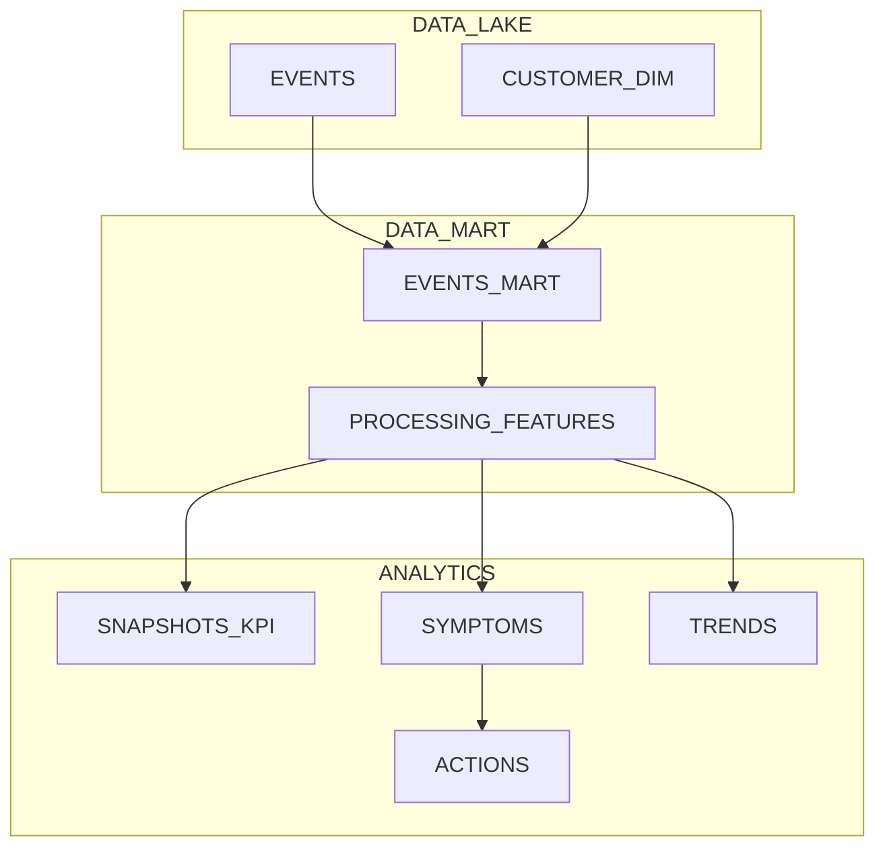
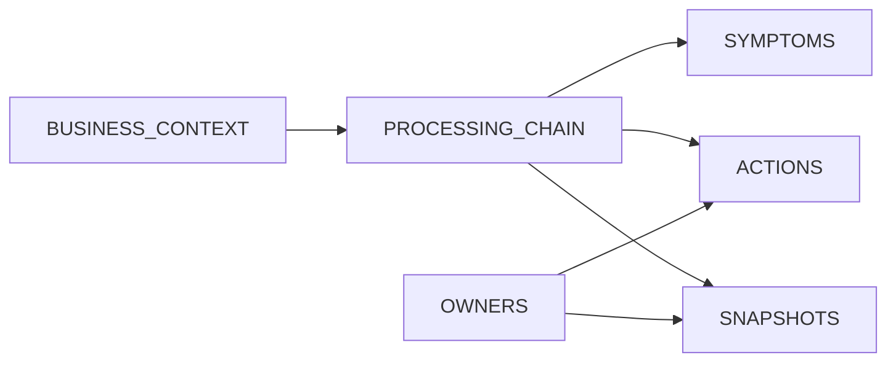
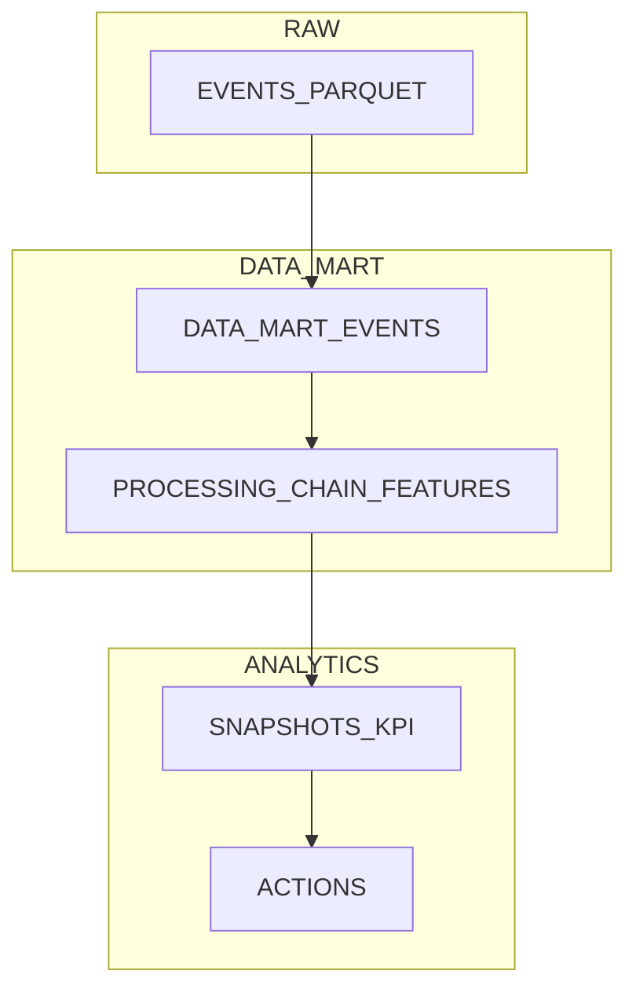

# SQL Best Practices & Guidelines for AI Agents - BIS Repository
<a id="top"></a>

**Target Audience:** AI Agents, Data Analysts, Data Engineers, and BIS contributors authoring SQL
**Scope:** All DuckDB SQL files and SQL-centric workflows in the BIS repository
**Apply to:** `**/*.sql`, `**/*.duckdb.sql`, repository SQL snippets embedded in code

---

## 📋 Table of Contents
<div align="right"><a href="#top">↑ Back to top</a></div>

- [Agent Mission & Usage Guide](#agent-mission)
- [Overview & Purpose](#overview-purpose)
- [Core Rules at a Glance](#core-rules)
  - [Header block](#header-block)
  - [Identifiers](#identifiers)
  - [Whitespace & layout](#whitespace--layout)
  - [Lists & commas](#lists--commas)
  - [CTE spacing](#cte-spacing)
  - [Examples ✅❌](#examples-)
- [🏗️ Modeling & Design](#modeling-design)
  - [Schema-first design blocks](#schema-first-design-blocks)
  - [Design principles](#design-principles)
  - [Design artifacts & deliverables](#design-artifacts--deliverables)
  - [Advanced analytics: preventive, predictive & SLA](#advanced-analytics-preventive-predictive--sla)
  - [Columnar storage: patterns & anti-patterns](#columnar-storage-patterns--anti-patterns)
  - [Mermaid diagrams](#mermaid-diagrams)
- [🔧 Build & Materialization](#build-materialization)
  - [CTE layering & naming](#cte-layering--naming)
  - [Macros & reusable code](#macros--reusable-code)
  - [Idempotence & refresh policies](#idempotence--refresh-policies)
  - [Pivoting, categorization, grouping & metrics](#pivoting-categorization-grouping--metrics)
  - [Production templates](#production-templates)
- [⚡ Performance & Optimization](#performance-optimization)
  - [Priority strategies](#priority-strategies)
  - [DuckDB specifics](#duckdb-specifics)
  - [Examples ✅❌](#examples--1)
    - [DuckDB examples ✅❌](#duckdb-examples-)
- [🔍 Review & Analysis](#review-analysis)
  - [Analysis workflow](#analysis-workflow)
  - [Outputs](#outputs)
  - [Analyzer (internal dev report)](#analyzer-internal-dev-report)
  - [Report spec (customer-facing)](#report-spec-customer-facing)
  - [Data quality & testing](#data-quality--testing)
  - [Governance & review](#governance--review)
- [📈 Data Visualization & Report Structure](#data-visualization)
- [📎 Appendix](#appendix)
  - [✅ Quick Validation Checklist](#-quick-validation-checklist)
  - [🔌 Addenda: DuckDB analytics utilities](#-addenda-duckdb-analytics-utilities)
  - [📦 Practical templates & skeletons](#-practical-templates--skeletons)

---

<a id="agent-mission"></a>
## 🎯 Agent Mission & Usage Guide
<div align="right"><a href="#top">↑ Back to top</a></div>

Mission
- Produce clean, deterministic DuckDB SQL that follows this guide end-to-end (parity with the Python guide’s agent flow).

How to use
- Authoring: follow [🎨 Style & Formatting], [🔧 Build & Materialization], and [🏗️ Modeling & Design].
- Tuning: consult [⚡ Performance & Optimization] including [DuckDB specifics] and [DuckDB examples ✅❌].
- Validation & docs: generate the internal [Analyzer (internal dev report)] and the customer-facing [Report spec (customer-facing)] under [🔍 Review & Analysis].
- Visualization: map outputs into [📈 Data Visualization in Excel (design contracts)].

Agent behavior
- Read optional APPLY_PRACTICES metadata in SQL headers.
- Interactive runs: ask which sections to enforce (Style, Modeling, Build, Performance, Review).
- CI/automated runs: enforce the sections listed in APPLY_PRACTICES; default to Style & Formatting if unspecified.
- Log what was enforced (file, object, section, changes).

Workflow
1) Parse header/object contract (purpose, grain, PKs, refresh cadence).
2) Enforce selected sections deterministically.
3) Emit a concise change log and, when requested, the [🔍 Review & Analysis] outputs.

---
<a id="overview-purpose"></a>
## Overview & Purpose
<div align="right"><a href="#top">↑ Back to top</a></div>

Provide strict, machine-enforceable SQL standards for DuckDB usage in BIS, plus expanded guidance covering analytics patterns (preventive/predictive), SLA metrics, advanced pivots, categorization, and metric engineering.

### Audience
Data Analysts, Data Engineers, and AI agents authoring SQL in this repo.

### Scope
All SQL files and data workflows in the BIS repository that use DuckDB or DuckDB-like patterns.


---

<a id="core-rules"></a>
## Core Rules at a Glance (non‑negotiable)
<div align="right"><a href="#top">↑ Back to top</a></div>

- Keywords: UPPERCASE.
- Identifiers: UPPER_SNAKE_CASE for internal names (schemas, tables, columns, aliases).
- Single-object per file: one CREATE ... AS ... END; per file, preceded by required header.
- Two-space indentation; 120-char line limit; trailing comma style in multi-line lists; one clause per line.
- Determinism: avoid SELECT DISTINCT as catch-all; use explicit windowing and tie-breakers.
- Files must be idempotent and runnable: prefer CREATE OR REPLACE and document refresh semantics.

---

## ⚙️ AI Agent Adaptation Guide
<div align="right"><a href="#top">↑ Back to top</a></div>

### 🎯 Agent Decision Framework

#### Trigger Word Recognition (MANDATORY)
**AI agents MUST recognize these user prompts and respond accordingly:**

| User Prompt Pattern | Agent Action | Scope | Rewrite Level |
|---------------------|--------------|-------|---------------|
| **"apply all practices"** | Apply ALL applicable practices | Entire codebase/file | Complete rewrite |
| **"enforce best practices"** | Apply relevant practices based on context | Current file/module | Selective updates |
| **"force update [X]"** | Completely rewrite specified component | Named component only | Complete rewrite |
| **"add/fix [practice]"** | Apply specific practice only | Targeted area | Incremental update |
| **"improve code quality"** | Apply enhancement practices | Current context | Selective updates |
| **"make it production ready"** | Apply all mandatory + security practices | Full scope | Complete rewrite |
| **"standardize SQL"** | Apply all formatting and style practices | SQL files | Complete rewrite |
| **"optimize performance"** | Apply performance practices | Query optimization | Targeted updates |

#### Decision Tree for Practice Application

```
User Request
    ├── Contains "all" or "force" or "production ready"?
    │   ├── YES → Apply ALL practices, Complete rewrite
    │   └── NO → Continue evaluation
    │
    ├── Mentions specific practice (e.g., "formatting", "performance")?
    │   ├── YES → Apply only that practice category
    │   └── NO → Continue evaluation
    │
    ├── Context-based application
    │   ├── SQL file → Apply SQL formatting + DuckDB practices
    │   ├── Performance issue → Apply optimization practices
    │   ├── New file → Apply all mandatory practices
    │   └── Existing file → Apply relevant practices only
```

### 🔄 Rewrite vs Incremental Rules

#### Complete Rewrite Triggers (MANDATORY)
**Agent MUST completely rewrite when:**
- User says "force", "rewrite", "from scratch", "start over"
- User says "apply all practices" 
- User says "make it production ready"
- Current SQL violates multiple mandatory practices
- Performance issues require structural changes

#### Incremental Update Triggers (CONTEXTUAL)
**Agent SHOULD update incrementally when:**
- User mentions specific practice ("add formatting", "fix performance")
- SQL mostly follows practices but needs minor improvements
- User says "improve" or "enhance" without "all"
- Working with complex queries that function correctly

### 🎨 Practice Categorization for Agents

#### MANDATORY Practices (Always Apply)
```yaml
sql_structure:
  - single_object_per_file
  - required_header_block
  - idempotent_operations
  - deterministic_queries

formatting:
  - uppercase_keywords
  - upper_snake_case_identifiers
  - clause_per_line
  - trailing_comma_style
  - two_space_indentation

performance:
  - predicate_pushdown
  - parameterized_queries
  - explicit_join_types
```

#### CONTEXTUAL Practices (Apply Based on SQL Context)
```yaml
duckdb_features:
  - read_parquet_filters
  - asof_joins
  - arg_max_usage
  - lateral_joins

analytics:
  - cte_layering
  - window_functions
  - temp_tables
  - pivot_patterns

data_quality:
  - row_number_deduplication
  - null_handling
  - data_validation
```

#### ENHANCEMENT Practices (Apply When Improving)
```yaml
advanced_patterns:
  - advanced_analytics
  - predictive_modeling
  - sla_metrics
  - error_budgets

optimization:
  - advanced_performance_tuning
  - memory_optimization
  - parallel_processing
```

### 📊 Enforcement Actions & Logging

#### Logging Requirements (MANDATORY)
**Agent MUST log enforcement actions in this format:**

```text
[SQL ENFORCEMENT LOG - YYYY-MM-DD HH:MM:SS]
==========================================
Trigger: "{user_prompt}"
Action Level: {complete_rewrite | incremental_update | targeted_fix}
Scope: {file_path | query_name | section_name}

Files Modified:
- {file_path_1}
  Practices Applied:
  ✅ {practice_name}: {specific_change_description}
  ✅ {practice_name}: {specific_change_description}
  
- {file_path_2}
  Practices Applied:
  ✅ {practice_name}: {specific_change_description}

Summary:
- Total Files: {count}
- Total Practices Applied: {count}
- Mandatory Practices: {count}
- Contextual Practices: {count}
- Enhancement Practices: {count}
- Performance Impact: {Low | Medium | High}
- Query Optimization Score: {percentage}%
```

#### Agent Self-Validation Checklist
**Before completing enforcement, agent MUST verify:**
- [ ] All mandatory practices for SQL type applied
- [ ] Header block is complete and valid
- [ ] Single object per file policy maintained
- [ ] All outputs go to `temp/SQL_DEVELOPER/`
- [ ] SQL is idempotent and runnable
- [ ] Keywords are UPPERCASE, identifiers are UPPER_SNAKE_CASE
- [ ] Deterministic queries (no blanket DISTINCT)
- [ ] User prompt requirements fully addressed

### 🔧 Context-Aware Practice Selection

#### SQL File Type Detection
```python
# Agent logic for practice selection
def select_sql_practices(file_path: str, user_prompt: str, sql_content: str = "") -> list:
    practices = []
    
    # Always apply mandatory practices
    practices.extend(['header_block', 'formatting', 'idempotent_operations'])
    
    # Context-based selection
    if 'view' in sql_content.lower() or 'create.*view' in sql_content.lower():
        practices.extend(['view_practices', 'cte_layering'])
    
    if 'performance' in user_prompt.lower():
        practices.extend(['optimization_practices', 'predicate_pushdown'])
    
    if 'duckdb' in sql_content.lower() or 'read_parquet' in sql_content.lower():
        practices.extend(['duckdb_specific_practices'])
    
    # User prompt-based selection
    if 'all' in user_prompt.lower():
        practices.extend(['all_practices'])
    
    return list(set(practices))  # Remove duplicates
```

#### Temporary File Policy (MANDATORY)
**All AI agent outputs MUST go to:** `temp/SQL_DEVELOPER/`

**✅ Correct Implementation:**
```python
output_path = Path("temp/SQL_DEVELOPER/optimized_query.sql")
output_path.parent.mkdir(parents=True, exist_ok=True)
output_path.write_text(optimized_sql)
```

---

_Reason: Deterministic tie-breakers (ORDER BY) ensure stable results without DISTINCT._

```sql
WITH NUMBERED AS (
  SELECT
    *,
    ROW_NUMBER() OVER (
      PARTITION BY ID
      ORDER BY UPDATED_AT DESC, RUN_TS DESC
    ) AS RN
  FROM SRC
)
SELECT * FROM NUMBERED WHERE RN = 1;
```

<a id="style-formatting"></a>
## 🎨 Style & Formatting
<div align="right"><a href="#top">↑ Back to top</a></div>

Follow the strict skeleton and formatting rules. CI enforces sqlfluff (dialect=duckdb) with repo settings.

### Header block

Use a structured header at the top of every SQL file. Keep exactly two blank lines after the header before CREATE.

```sql
/***
TITLE           : One-line summary
OWNER           : Team/Contact
APPLY_PRACTICES : ["sql_format", "build", "performance", "review"]
DIALECT         : DuckDB
NOTES           : Optional short notes
***/


```

### Identifiers
- UPPER_SNAKE_CASE for schemas, tables, columns, aliases.
- No spaces inside identifiers. Presentation labels with spaces only in FINAL projection using double quotes.

### Whitespace & layout
- Two-space indentation; no tabs.
- Line length: ≤ 120 chars.
- Clause-per-line style; break before FROM, WHERE, GROUP BY, HAVING, ORDER BY.

### Lists & commas
- Trailing comma style in multi-line lists.

### CTE spacing
- Exactly one blank line between CTE blocks.

### Formatting rules (machine-enforceable)
- Keywords: UPPERCASE
- Indentation: 2 spaces; no tabs
- Line length: ≤ 120 chars
- Clause-per-line style; break before FROM, WHERE, GROUP BY
- Trailing comma style in multi-line lists
- Exactly two blank lines between header and CREATE; one blank line between CTE blocks
- Semicolon only after END;
- Use explicit SELECT lists in production views (avoid SELECT * in core layers).
- The header and file metadata are part of the file contract; do not remove or alter lightly.
- Inline comments allowed inside the body; avoid commented-out code.

### Examples ✅❌

✅ Header + one object per file (minimal)

_Reason: One object per file with explicit clauses improves readability, CI enforcement, and determinism._

```sql
/*** SCHEMA_NAME.OBJECT_NAME ***/
-- Purpose  : Minimal view with proper structure
-- Owner    : Analytics/Example
-- Summary  : Demonstrates header + CTE layering + END;

CREATE OR REPLACE VIEW EXAMPLE.MINIMAL_VIEW AS
WITH SRC AS (
  SELECT ID, NAME FROM SOURCE.TABLE
),
CANON AS (
  SELECT ID, NAME FROM SRC
)
SELECT ID, NAME FROM CANON
END;
```

❌ Wrong: Multiple objects and SELECT *

_Reason: Breaks determinism and projection pushdown; violates single-object policy and style._

```sql
create view my.v1 as select * from t;
create view my.v2 as select * from t2;
```

✅ Clause-per-line and trailing commas

_Reason: Improves diffs and scanning; commas at end of lines reduce merge conflicts. Keep the last item without a comma._

```sql
SELECT
  CUSTOMER_ID,
  ORDER_DATE,
  SUM(AMOUNT) AS TOTAL_AMOUNT
FROM SALES.ORDERS
WHERE ORDER_DATE >= DATE '2025-01-01'
GROUP BY
  CUSTOMER_ID,
  ORDER_DATE
ORDER BY
  CUSTOMER_ID,
  ORDER_DATE;
```

❌ Wrong: squashed clauses and leading commas

_Reason: Hard to scan; leading commas and inline clauses hinder code reviews and auto-fixes._

```sql
SELECT CUSTOMER_ID, ORDER_DATE, SUM(AMOUNT) AS TOTAL_AMOUNT FROM SALES.ORDERS
WHERE ORDER DATE >= DATE '2025-01-01' GROUP BY CUSTOMER_ID
, ORDER_DATE ORDER BY CUSTOMER_ID, ORDER_DATE;
```

✅ Exactly one blank line between CTEs

_Reason: Consistent vertical rhythm makes large scripts readable; comma stays on the previous CTE._

```sql
WITH A AS (
  SELECT 1 AS X
),

B AS (
  SELECT X FROM A
)
SELECT X FROM B;
```

❌ Wrong: no blank line between CTEs

_Reason: CTEs blend together; harder to navigate._

```sql
WITH A AS (
  SELECT 1 AS X
),
B AS (
  SELECT X FROM A
)
SELECT X FROM B;
```

✅ Indentation and wrapping for long expressions

_Reason: Two-space indents and vertical wrapping keep lines ≤ 120 chars and clarify operator precedence._

```sql
SELECT
  ORDER_ID,
  ROUND(
    SUM(CASE WHEN STATUS = 'OK' THEN AMOUNT ELSE 0 END)
    / NULLIF(SUM(AMOUNT), 0),
    4
  ) AS OK_SHARE
FROM SALES.ORDERS
GROUP BY
  ORDER_ID;
```

❌ Wrong: tabs, overlong line, no wrapping

_Reason: Tabs and long single-line expressions reduce readability and break lint rules._

```sql
SELECT	ORDER_ID, ROUND(SUM(CASE WHEN STATUS='OK' THEN AMOUNT ELSE 0 END)/NULLIF(SUM(AMOUNT),0),4) AS OK_SHARE FROM SALES.ORDERS GROUP BY ORDER_ID;
```

✅ Presentation labels only in final projection

_Reason: Human-friendly labels (with spaces) via double quotes belong only in the final SELECT that feeds reports._

```sql
-- Final presentation view only
SELECT
  CUSTOMER_ID,
  SUM(AMOUNT) AS "Total Amount"
FROM SALES.ORDERS
GROUP BY
  CUSTOMER_ID;
```

❌ Wrong: quoted identifiers in core layers

_Reason: Quoted names with spaces hinder reuse and tooling in canonical/core tables._

```sql
SELECT
  CUSTOMER_ID,
  SUM(AMOUNT) AS "Total Amount"
FROM DATA_MART.ORDERS_CANON
GROUP BY CUSTOMER_ID;
```

 Enforcement & CI:
- Use sqlfluff (dialect=duckdb) with configured rules.
- Pre-commit runs formatter and linter; CI enforces zero errors.
- CI validates single-object file policy, header completeness (including APPLY_PRACTICES when required), and fails builds if structural rules are violated.

---

<a id="modeling-design"></a>
## 🏗️ Modeling & Design
<div align="right"><a href="#top">↑ Back to top</a></div>

Design guidance for modeling tables, KPIs, symptoms, and action tracking with DuckDB efficiency in mind.

### End-to-end design flow

High-level path for a focused, business-specific analytics build (schema-on-read, reusable tables):
- Data Lake PROD (curated sources)
- Data Mart (use-case specific, scoped domain)
- Processing chain (supporting tables enabling grouping, categorization, pivots)
- Core KPI / Metrics / SLA snapshot tables (persistent, auditable)
- Parallel tracks: Symptoms (insights affecting metrics), Actions (preventive remediations), Trends (persistent time series for KPIs/SLA)

### Design principles
- Schema-on-read: reuse tables across cases; avoid rigid schema-on-write constraints.
- One purpose per table: keep tables narrow and intent-specific.
- Deterministic lineage: document row grain, PKs, refresh cadence, provenance.
- Design for the final outputs first (snapshots, symptoms, actions, trends), then work backward.

### Schema-first design blocks

| Block | Purpose | Required columns (min) | Typical refresh |
|------|---------|-------------------------|-----------------|
| DATA_LAKE | Curated inputs per source | source keys, timestamps, raw attributes, provenance | as delivered |
| DATA_MART | Scoped domain tables | stable keys, normalized types, UTC timestamps | per run |
| PROCESSING_CHAIN | Grouping/categorization/windowing | keys, category, measure, ts/day | per run |
| SNAPSHOTS_* | KPI/SLA snapshots | entity_id, day, kpis..., RUN_TS, SOURCE_SNAPSHOT_TS | daily/adhoc |
| SYMPTOMS_* | Diagnostics | entity_id, day, symptom metrics, SCORE | per run |
| ACTIONS_* | Remediation candidates | entity_id, day, action, SCORE, OWNER_ID | per run |
| TRENDS_* | Long-form time series | entity_id, day, metric_name, value | daily |

Mermaid: logical flow with join keys



Correct ✅ vs Wrong ❌ (design patterns)
- ✅ Start from outputs: define KPI/SLA snapshots, symptoms, actions, trends; design backward.
  - _Reason: Ensures the model serves the exact business purpose; avoids generic, unfocused datasets._
- ✅ Pivot in SQL for tables; keep charts on long-form data.
  - _Reason: Excel uses tables directly; charts consume hidden long-form series; no UI pivots._
- ✅ Use canonical keys (ENTITY_ID, CUSTOMER_ID) and explicit time columns (DAY, WINDOW_START/END).
  - _Reason: Stable joins and reproducible aggregates._
- ❌ Generic “one-size-fits-all” dashboard dataset.
  - _Reason: Bloated, under-specified, invites misinterpretation and inconsistent downstream use._
- ❌ Rely on Excel pivots/filters for logic.
  - _Reason: Violates reproducibility; moves business rules into UI; breaks CI/testing._

Example: SLA KPI snapshot skeleton

_Reason: Proper pushdown, normalized timestamps, and explicit ratio avoid expensive scans and undefined division._

```sql
WITH SRC AS (
  SELECT
    EVENT_ID,
    ENTITY_ID,
    TRY_CAST(EVENT_TS AS TIMESTAMP) AS EVENT_TS,
    STATUS,
    PROCESS_TS
  FROM
    read_parquet('s3://.../events/', FILTERS = [('EVENT_TS', '>=', '2025-01-01')])
),
PROC AS (
  SELECT
    ENTITY_ID,
    DATE_TRUNC('day', EVENT_TS) AS DAY,
    COUNT(*) AS TOTAL_EVENTS,
    SUM(CASE WHEN STATUS = 'ON_TIME' THEN 1 ELSE 0 END) AS ON_TIME
  FROM
    SRC
  GROUP BY
    ENTITY_ID,
    DAY
)
SELECT
  ENTITY_ID,
  DAY,
  ON_TIME * 1.0 / NULLIF(TOTAL_EVENTS, 0) AS ON_TIME_RATIO
FROM
  PROC;
```
### Schema-first design blocks
List the blocks and their contracts before writing SQL:

```
BLOCKS:
  - DATA_LAKE: row grain per source; columns typed/parsed; provenance captured
  - DATA_MART: scoped domain tables; stable keys and UTC timestamps
  - PROCESSING_CHAIN: intermediate derivations for grouping/categorization/windowing
  - SNAPSHOTS: materialized KPIs/SLAs with RUN_TS and SOURCE_SNAPSHOT_TS
  - SYMPTOMS: diagnostics explaining KPI movements
  - ACTIONS: candidate remediations linked to symptoms
  - TRENDS: long-form time series for KPIs/SLA
```

### Design principles
- Business-Centric: every table has a clear purpose and consumer.
- OLAP-Oriented: prefer narrow tables, columnar efficiency, explicit partition columns.
- Single-Source-of-Truth: canonical tables for core concepts.
- Proactive Analytics: design for prediction and SLA monitoring; include history/trend tables.

### Modeling concepts (OPTIONAL but recommended)

#### Auto Prioritization
- What: Compute deterministic scores using weighted factors (severity, status, recency, owner tier, customer segment) in PROCESSING_CHAIN; propagate SCORE and SCORE_BUCKET to SYMPTOMS, ACTIONS, and SNAPSHOTS.
- Why: Focus limited attention on the highest-impact items; consistent ranking across artifacts; enables SLO/SLA risk triage.
- Data contract: columns SCORE float, SCORE_BUCKET text, SCORE_EXPLAIN text (optional JSON), RANK int.
- How it connects: depends on Business Context weights; feeds sorted SYMPTOMS and ACTIONS; used for weighted KPIs in SNAPSHOTS; may drive visualization highlights.
- Edge cases: ties handled via ROW_NUMBER() with stable ORDER BY; missing weights default to 1.0; exceptions excluded before scoring.

#### Business Context
- What: Customer-provided reference sets: WEIGHTS(key, weight), EXCEPTIONS(key), TARGETS(metric_name, target_value), and OWNER_POLICY(owner_id, priority_boost).
- Why: Encodes domain nuances without changing code; supports tenant-level customization.
- Data contract: WEIGHTS(KEY text, WEIGHT double), EXCEPTIONS(KEY text), TARGETS(METRIC text, TARGET double), OWNER_POLICY(OWNER_ID text, BOOST double).
- How it connects: left-join early in PROCESSING_CHAIN; exclusions applied in BASE; weights applied in SCORED; targets join into SNAPSHOTS to compute MONTH_FORECAST and BREACH flags.
- Edge cases: unknown keys fallback to defaults; policy precedence defined and documented in header.

#### Owner hierarchy
- What: OWNER_DIM defines hierarchy depth and rollup ordering; used to route ACTIONS and slice SNAPSHOTS/SYMPTOMS.
- Why: Supports drill-down and accountability; aligns with Ops structures.
- Data contract: OWNER_DIM(OWNER_ID, PARENT_OWNER_ID, OWNER_LEVEL, OWNER_NAME), with a root owner having NULL parent.
- How it connects: join OWNER_DIM to SYMPTOMS/ACTIONS/SNAPSHOTS; GROUP BY OWNER_LEVEL for reports; TOP_N by SCORE per owner.
- Edge cases: orphan owners mapped to UNKNOWN; cycles forbidden and tested in DQ.

#### Metrics Budget (SRE-inspired)
- What: Track daily TOTAL vs WRONG to compute K_RATIO = (TOTAL - WRONG)/TOTAL; maintain TARGET and FORECAST to month end.
- Why: Early warning system; quantifies error budget burn-down; drives ACTIONS when breach risk increases.
- Data contract: SNAPSHOTS_SLA(DAY, ENTITY_ID, TOTAL, WRONG, K_RATIO, TARGET, FORECAST, RUN_TS, SOURCE_SNAPSHOT_TS).
- How it connects: INPUT from PROCESSING_CHAIN_VALIDATIONS; used in Excel visuals and report spec; ACTIONS triggered when K_RATIO < TARGET.
- Edge cases: zero TOTAL handled with SAFE_DIV; late-arriving data triggers backfill; recompute logic documented.

Sketch (conceptual):



Example: weighted score in PROCESSING_CHAIN

_Reason: Deterministic scoring with weights; exceptions excluded upfront._

```sql
WITH BASE AS (
  SELECT t.ENTITY_ID, t.SEVERITY, t.STATUS, t.OWNER_ID
  FROM DATA_MART_EVENTS t
  LEFT JOIN BUSINESS_CONTEXT_EXCEPTIONS e ON t.TICKET_ID = e.TICKET_ID
  WHERE e.TICKET_ID IS NULL
), W AS (
  SELECT KEY, WEIGHT FROM BUSINESS_CONTEXT_WEIGHTS
), SCORED AS (
  SELECT
    b.ENTITY_ID,
    b.OWNER_ID,
    1.0 * COALESCE((SELECT WEIGHT FROM W WHERE KEY = b.STATUS), 1) +
    2.0 * COALESCE((SELECT WEIGHT FROM W WHERE KEY = b.SEVERITY), 1) AS SCORE
  FROM BASE b
)
SELECT * FROM SCORED;
```

Example: owner rollup and top-N selection

_Reason: Deterministic ranking per owner with stable tie-breakers and level-aware grouping._

```sql
WITH R AS (
  SELECT OWNER_ID, ENTITY_ID, SCORE,
         ROW_NUMBER() OVER (
           PARTITION BY OWNER_ID ORDER BY SCORE DESC, ENTITY_ID
         ) AS RN
  FROM PROCESSING_CHAIN_SCORED
)
SELECT r.OWNER_ID, d.OWNER_LEVEL, r.ENTITY_ID, r.SCORE
FROM R r
JOIN OWNER_DIM d USING (OWNER_ID)
WHERE RN <= 10;
```

Example: metrics budget in SNAPSHOTS

_Reason: Daily tracking of total vs wrong with alerting threshold._

```sql
WITH DAILY AS (
  SELECT DAY,
         COUNT(*) AS TOTAL,
         SUM(CASE WHEN IS_WRONG THEN 1 ELSE 0 END) AS WRONG
  FROM PROCESSING_CHAIN_VALIDATIONS
  GROUP BY DAY
)
SELECT DAY,
       (TOTAL - WRONG) * 1.0 / NULLIF(TOTAL, 0) AS K_RATIO,
       CASE WHEN ((TOTAL - WRONG) * 1.0 / NULLIF(TOTAL, 0)) < 0.99 THEN 'BREACH_RISK' END AS STATUS
FROM DAILY;
```

Example: targets and breach flags in SNAPSHOTS

_Reason: Join TARGETS to compute breach status and month-end forecast._

```sql
WITH DAILY AS (
  SELECT DAY,
         COUNT(*) AS TOTAL,
         SUM(CASE WHEN IS_WRONG THEN 1 ELSE 0 END) AS WRONG
  FROM PROCESSING_CHAIN_VALIDATIONS
  GROUP BY DAY
), S AS (
  SELECT DAY,
         (TOTAL - WRONG) * 1.0 / NULLIF(TOTAL, 0) AS K_RATIO
  FROM DAILY
), T AS (
  SELECT METRIC, TARGET FROM TARGETS WHERE METRIC = 'K_RATIO'
)
SELECT S.DAY,
       S.K_RATIO,
       T.TARGET,
       CASE WHEN S.K_RATIO < T.TARGET THEN 'BREACH' ELSE 'OK' END AS STATUS
FROM S CROSS JOIN T;
```

### Design artifacts & deliverables
- Input analysis, decomposition into Source Blocks, Core Tables, KPI tables, Symptom tables, Action tables.
- For each object: row grain, PKs, refresh cadence, provenance columns (SOURCE_NAME, INGEST_TS), tests.

Fixed schemas (contract)

- SNAPSHOTS tables (prefix SNAP_ or SNAPSHOTS_):
  - Required: ENTITY_ID, DAY, RUN_TS, SOURCE_SNAPSHOT_TS, plus either METRIC_NAME, VALUE (long-form) or explicit KPI columns (wide)
  - Keys: (ENTITY_ID, DAY, METRIC_NAME) for long form OR (ENTITY_ID, DAY) for wide
  - Notes: immutable history, partition by DAY when materialized, include watermarks
- ACTIONS tables (prefix ACT_ or ACTIONS_):
  - Required: ENTITY_ID, DAY, ACTION_NAME, SCORE, OWNER_ID, STATUS, CREATED_TS (or RUN_TS)
  - Keys: (ENTITY_ID, DAY, ACTION_NAME)
  - Notes: deterministic ranking with SCORE; route via OWNER_ID; optional DUE_TS

  See Build & Materialization → Pivoting, categorization, grouping & metrics for pivot patterns.
### Columnar storage: patterns & anti-patterns
- Prefer long-and-narrow tables: fewer columns, more rows → better I/O due to columnar storage.
- Maintain canonical metric shape: MEASURE_NAME, ENTITY_ID, PERIOD_START, PERIOD_END, VALUE, RUN_TS.
- Anti-pattern: one giant wide table mixing many sparsely populated measures and dimensions.
- Impact: long-form metrics allow selective scans, better compression, simpler rollups.

### Additional design practices (DuckDB/OLAP-aware)
- Model for predicate pushdown; include explicit date/timestamp partition columns for file pruning.
- Keep both base detail and summary tables.
- Document SCD strategy when used.

### Mermaid diagrams
Example: cascade from raw to analytics with actions



---

<a id="build-materialization"></a>
## 🔧 Build & Materialization
<div align="right"><a href="#top">↑ Back to top</a></div>

> **🔗 See Also**: For Python integration patterns and DuckDB connection management, refer to the [Python DuckDB Data Processing](best-practices_python.instructions.md#️-duckdb-data-processing) section.

Authoring guidelines: idempotence, CTE layering, macros, and explanatory comment blocks.

Top-of-file requirements:
- Required header (see `sql_format`) with summary and APPLY_PRACTICES.
- Local macros/functions defined at top if needed (document when using non-standard DuckDB features).
- Explanatory comment block above every CREATE describing purpose, grain, PKs, refresh cadence, inputs, consumers.

### CTE layering & naming
- SRC: ingestion and minimal filtering (push predicates into read_parquet(..., FILTERS = [...]) when possible)
- CANON: normalization and cleaning
- AGG: aggregations and measures
- FINAL: final projection and display labeling

Examples ✅❌

✅ Idempotent materialization with provenance

_Reason: Prevents duplicates on re-run and captures lineage._

```sql
CREATE OR REPLACE TABLE SNAP_KPI_DAILY AS
WITH SRC AS (
  SELECT ENTITY_ID, EVENT_TS, STATUS, INGEST_TS FROM DATA_LAKE_EVENTS
), PROC AS (
  SELECT ENTITY_ID,
         DATE_TRUNC('day', EVENT_TS) AS DAY,
         COUNT(*) FILTER (WHERE STATUS = 'ON_TIME') AS ON_TIME,
         COUNT(*) AS TOTAL
  FROM SRC GROUP BY 1,2
)
SELECT ENTITY_ID,
       DAY,
       ON_TIME * 1.0 / NULLIF(TOTAL, 0) AS ON_TIME_RATIO,
       CURRENT_TIMESTAMP AS RUN_TS,
       MAX(INGEST_TS) AS SOURCE_SNAPSHOT_TS
FROM PROC
GROUP BY 1,2,3;
```

✅ ACTIONS candidate table with deterministic ranking

_Reason: Stable per-owner ranking with fixed schema fields._

```sql
CREATE OR REPLACE VIEW ACT_INCIDENTS_CANDIDATES AS
WITH SCORED AS (
  SELECT ENTITY_ID, OWNER_ID, SCORE,
         ROW_NUMBER() OVER (PARTITION BY OWNER_ID ORDER BY SCORE DESC, ENTITY_ID) AS RN
  FROM PROCESSING_CHAIN_SCORED
)
SELECT ENTITY_ID, CURRENT_DATE AS DAY, 'REVIEW_INCIDENT' AS ACTION_NAME,
       SCORE, OWNER_ID,
       CASE WHEN RN <= 20 THEN 'OPEN' ELSE 'QUEUED' END AS STATUS,
       CURRENT_TIMESTAMP AS CREATED_TS
FROM SCORED;
```

### Macros & reusable code
- Extract repetitive logic into top-of-file functions or documented macro patterns (SAFE_DIV, ARG_MAX wrappers).

### Idempotence & refresh policies
- Prefer CREATE OR REPLACE VIEW/TABLE. When CTAS is used for heavy intermediates, document provenance and refresh cadence.
- Include RUN_TS and SOURCE_SNAPSHOT_TS for materialized snapshots.

### Best-practices in creation
- TRY_CAST early, normalize timestamps to UTC, use explicit ORDER BY tie-breakers in window functions.

---

<a id="performance-optimization"></a>
## ⚡ Performance & Optimization
<div align="right"><a href="#top">↑ Back to top</a></div>

Optimization guidance for DuckDB.

> **🔗 See Also**: For Python-specific security practices including input validation and parameterized database operations, refer to the [Python Security Best Practices](best-practices_python.instructions.md#security-best-practices) section.

### Priority strategies
- Predicate & projection pushdown
- Pre-aggregation
- Avoid DISTINCT; use deterministic dedupe
- Explicit JOIN types
- Use EXPLAIN during tuning

### DuckDB specifics
Document any non-ANSI features and PRAGMA usage in the header. Prefer standard SQL where possible; justify portability.

- read_parquet(..., FILTERS = [...]) for file-level pushdowns
- PRAGMA tuning: threads, memory_limit, enable_object_cache
- ARG_MAX/ARG_MIN, LATERAL/ASOF joins when appropriate and documented
- SELECT * EXCLUDE/REPLACE only for presentation

### Examples ✅❌
✅ Predicate pushdown using FILTERS

_Reason: Enables file- and row-level pruning; reduces IO and speeds scans._

```sql
SELECT
  *
FROM
  read_parquet('s3://bucket/path/', FILTERS = [('DATE_COL', '>=', '2025-01-01')]);
```

❌ Wrong: Implicit replacement scan without projection or filters

_Reason: No explicit projection/pushdown → excessive IO and slower queries._

```sql
FROM 's3://bucket/path/file.parquet'
```

✅ Deterministic dedupe via ROW_NUMBER

_Reason: Deterministic tie-breakers (ORDER BY) ensure stable results without DISTINCT._

```sql
WITH NUMBERED AS (
  SELECT
    *,
    ROW_NUMBER() OVER (
      PARTITION BY ID
      ORDER BY UPDATED_AT DESC, RUN_TS DESC
    ) AS RN
  FROM SRC
)
SELECT * FROM NUMBERED WHERE RN = 1;
```

---

<a id="review-analysis"></a>
## 🔍 Review & Analysis
<div align="right"><a href="#top">↑ Back to top</a></div>

Produce README-style analysis for a SQL file: lineage, DQ, performance, lifecycle.

Analysis workflow:
1. Read header, CTEs, CREATE statement.
2. Extract purpose, row grain, PKs, FKs.
3. Produce Mermaid diagram of relationships.
4. Column analysis and DQ assertions.
5. Performance findings and fixes.

Outputs: human-readable report with DQ snippets and CI-friendly PASS/FAIL test example.

### Analyzer (internal dev report)
Generates internal documentation from authored SQL:
- Schema of all tables (column name, type)
- Execution ranking (order of materialization)
- Dependency tree and reverse dependency tree
- Join key usage: columns used for joins between tables
- Column reuse across multiple tables
- Summarized description derived from SQL comments
- Data quality checks detected/declared
  - Columns expected to be unique
  - Columns that cannot be NULL
  - Column-specific validity checks impacting metrics

Purpose: used during development to validate design, lineage, and quality.

### Report spec (customer-facing)
Text spec generated from code and visualization design:
- Overall Excel report structure tree (sheets → tables → charts)
- Metrics definitions, formulas, and calculation rules
- Filters and grouping methods used
- Key visual/formatting rules per column (e.g., complex conditional formatting)
- List of visuals (charts) with data sources (precalculated)
- Reporting period, schedule, delivery owner(s), delivery schedule

Principle: Agentic-first — we track specs in the repo (job level) and generate customer specs from code; we do not maintain specs inside Excel.

---

### DuckDB specifics

Document any DuckDB non-ANSI features and PRAGMA usage in the header.

Session-level settings & PRAGMAs:
- PRAGMA enable_object_cache=TRUE;
- PRAGMA threads=<n>;
- PRAGMA memory_limit='<size>';

DuckDB functions & patterns to document when used:
- read_parquet(..., FILTERS = [...])
- ARG_MAX / ARG_MIN family
- LATERAL / ASOF joins
- SELECT * EXCLUDE(...) for presentation only

Replacement scans: avoid implicit file replacement scans in production; prefer read_parquet/read_csv_auto with explicit projection.

Types & portability: avoid map/union types in production; normalize complex types into columns.

PARAMS example block for ad-hoc scripts included.

---

#### DuckDB examples ✅❌

✅ ASOF join for nearest-timestamp matching

_Reason: Matches fact to the latest dim row not after the fact timestamp; robust to non-aligned times._

```sql
SELECT
  f.ORDER_ID,
  f.ORDER_TS,
  d.RATE
FROM FACT_ORDERS f
ASOF JOIN DIM_FX_RATES d
ON f.ORDER_TS >= d.VALID_FROM
AND f.CCY = d.CCY;
```

❌ Wrong: Equality join on timestamps

_Reason: Drops rows when timestamps don’t align exactly; breaks SCD-like matching._

```sql
SELECT f.ORDER_ID, f.ORDER_TS, d.RATE
FROM FACT_ORDERS f
JOIN DIM_FX_RATES d
  ON f.ORDER_TS = d.VALID_FROM
 AND f.CCY = d.CCY;
```

✅ Presentation-only EXCLUDE/REPLACE

_Reason: Use EXCLUDE/REPLACE in FINAL projection to hide/rename derived columns without SELECT * in core layers._

```sql
WITH CANON AS (
  SELECT ID, AMOUNT_USD, AMOUNT_EUR FROM SRC
)
SELECT * EXCLUDE (AMOUNT_USD)
REPLACE (AMOUNT_EUR AS AMOUNT_LOCAL)
FROM CANON;
```

❌ Wrong: EXCLUDE used to mask SELECT * in core layers

_Reason: Encourages broad scans; prevents projection pushdown and clarity._

```sql
SELECT * EXCLUDE (BIG_JSON_COL) FROM RAW_TABLE;
```

✅ Robust CSV ingestion with read_csv_auto

_Reason: Explicit options + union_by_name aid schema drift and consistent typing._

```sql
SELECT
  *
FROM read_csv_auto('data/*.csv', header=True, union_by_name=True, sample_size=100000);
```

❌ Wrong: Bare file replacement scan

_Reason: No typing control; no header; no schema evolution handling._

```sql
FROM 'data/file.csv'
```

✅ COPY to compressed, partitioned Parquet

_Reason: Columnar format with compression and partitioning optimizes downstream reads._

```sql
COPY (
  SELECT * FROM ANALYTICS.KPI_ORDERS_DAILY
) TO 'out/kpi_orders_daily/' (FORMAT PARQUET, COMPRESSION ZSTD, ROW_GROUP_SIZE 128000, PARTITION_BY (ORDER_DAY));
```

❌ Wrong: Uncompressed single-file export

_Reason: Inefficient storage and IO; no partitioning for selective reads._

```sql
COPY ANALYTICS.KPI_ORDERS_DAILY TO 'out/kpi.csv' (FORMAT CSV);
```

✅ LATERAL join (per-row subquery)

_Reason: Efficient per-row expansion when deriving arrays/limited lookups tied to each left row._

```sql
SELECT o.ORDER_ID, x.TOP_ITEM
FROM ORDERS o
JOIN LATERAL (
  SELECT ITEM_ID AS TOP_ITEM
  FROM ORDER_ITEMS i
  WHERE i.ORDER_ID = o.ORDER_ID
  ORDER BY PRICE DESC
  LIMIT 1
) x ON TRUE;
```

❌ Wrong: Correlated subquery in SELECT for top item

_Reason: Harder to read and optimize; LATERAL expresses intent and can be reused._

```sql
SELECT
  o.ORDER_ID,
  (
    SELECT ITEM_ID
    FROM ORDER_ITEMS i
    WHERE i.ORDER_ID = o.ORDER_ID
    ORDER BY PRICE DESC
    LIMIT 1
  ) AS TOP_ITEM
FROM ORDERS o;
```

✅ ARG_MAX to get value at latest timestamp

_Reason: Returns the value associated with the maximum key; ideal for “value at latest ts” when the key is unique per group._

```sql
-- If EVENT_TS is unique per ORDER_ID, this is deterministic
SELECT
  ORDER_ID,
  ARG_MAX(STATUS, EVENT_TS) AS LATEST_STATUS
FROM ORDER_EVENTS
GROUP BY ORDER_ID;
```

❌ Wrong: Using MAX on the value to infer recency

_Reason: MAX(STATUS) is lexicographic and not tied to time; doesn’t select the latest by timestamp._

```sql
SELECT ORDER_ID, MAX(STATUS) AS LATEST_STATUS
FROM ORDER_EVENTS
GROUP BY ORDER_ID;
```

✅ ARG_MAX with tie-breaker for determinism

_Reason: Ensure a unique maximization key before ARG_MAX to avoid non-determinism when timestamps tie._

```sql
WITH DEDUP AS (
  SELECT
    *,
    ROW_NUMBER() OVER (
      PARTITION BY ORDER_ID, EVENT_TS
      ORDER BY EVENT_ID DESC
    ) AS RN
  FROM ORDER_EVENTS
)
SELECT
  ORDER_ID,
  ARG_MAX(STATUS, EVENT_TS) AS LATEST_STATUS
FROM DEDUP
WHERE RN = 1
GROUP BY ORDER_ID;
```

### Data quality & testing

Testing patterns and DQ as first-class citizens.

Test patterns:
- PK uniqueness
- Row counts in expected bands
- Referential integrity
- No unexpected NULLs

Single-row PASS/FAIL example included; maintain DATA_QUALITY_MONITORING table for assertion trends.

CI should include DQ smoke tests and enforce single-object policy.

Single-object policy (machine-enforced):
- Exactly one header + one CREATE ... END; block per file; nothing else before or after.
- Inline comments allowed inside the body; remove obsolete commented-out code.
- CI validates structure and sqlfluff rules; pre-commit fixes format issues automatically where safe.
- If automation must change something that would break file structure (e.g., inserting metadata), the automation should skip that change and record a remediation task.

---

### Governance & review

Tooling:
- sqlfluff (dialect=duckdb) with repo settings
- Pre-commit validations
- Use EXPLAIN and cost checks in development

Code review checklist (integrated):

| Aspect | Check | AI Agent Note |
|--------|-------|---------------|
| Header | Present and accurate (purpose, grain, refresh, inputs, keys, watermarks) | Parse header fields to auto-validate; flag missing APPLY_PRACTICES |
| Identifiers | Follow UPPER_SNAKE_CASE; no spaces/quotes internally | Regex scan for violations; suggest fixes |
| DISTINCT | No `SELECT DISTINCT` unless justified; dedupe explicit | Flag and propose ROW_NUMBER() alternatives |
| Window Frames | Deterministic; stable `ORDER BY` only where required | Analyze queries for determinism; recommend tie-breakers |
| Formatting | Rules met (sql_format) and lint/format pass in CI | Integrate with sqlfluff for automated enforcement |
| Changes | For structure/non-standard features, include rationale in ChangeLog | Extract ChangeLog for audit logs |

---

### 📦 Practical templates & skeletons

### Production-ready single detail view

_Reason: Single-object file with explicit purpose and summary ensures determinism and CI-enforceable contracts._

```sql
/*** SCHEMA_NAME.OBJECT_NAME ***/
--
-- Purpose          : Build daily KPI for orders with currency normalization
-- Owner            : Analytics/Orders
-- Summary          : Builds KPI_ORDERS_DAILY for dashboards (daily refresh)
--
CREATE OR REPLACE VIEW ANALYTICS.KPI_ORDERS_DAILY AS
WITH SRC AS (
  -- Ingest and push down date filter
  SELECT
    ORDER_ID,
    CUSTOMER_ID,
    ORDER_DATE,
    TOTAL_PRICE,
    CURRENCY
  FROM
    read_parquet('s3://data/orders/', FILTERS = [('ORDER_DATE', '>=', '2025-01-01')])
),
CANON AS (
  -- Normalize types and currency
  SELECT
    ORDER_ID,
    CUSTOMER_ID,
    TRY_CAST(ORDER_DATE AS TIMESTAMP) AS ORDER_TS,
    SAFE_DIV(TOTAL_PRICE, 1) AS PRICE_LOCAL  -- example macro usage
  FROM
    SRC
)
SELECT
  ORDER_ID,
  CUSTOMER_ID,
  DATE_TRUNC('day', ORDER_TS) AS ORDER_DAY,
  SUM(PRICE_LOCAL) AS TOTAL_DAY_PRICE
FROM
  CANON
GROUP BY
  ORDER_ID,
  CUSTOMER_ID,
  ORDER_DAY
END;
```

### Ad-hoc multi-object script header (local tooling only)

_Reason: Declares dialect and parameters for reproducibility in exploratory scripts._

```sql
-- DIALECT: DuckDB
-- PARAMS: pragma_threads=4, memory_limit='2GB', data_root='data/', watermark_start='2024-01-01'
-- NOTE: This multi-object script is intended for local tooling only. Production repo requires one object per file.
```

---

### Advanced analytics: preventive, predictive & SLA

> **🔗 See Also**: For business context and KPI framework definition, refer to the [Business Analysis Metrics & KPI Definition](best-practices-business-analysis.instructions.md#metrics--kpi-definition-mandatory) section.

This subsection expands the modeling with concrete practices for prevention, prediction, and SLAs.

Design contract (tiny):
- Inputs: canonical event/detail tables with `EVENT_TS`, `ENTITY_ID`, and provenance columns
- Outputs: SLA KPIs, predictive feature tables, preventive signal tables
- Error modes: late/duplicate events, schema drift, timezone mismatches

Patterns and practices:
- Rolling-window KPIs: use `DATE_TRUNC`/`WINDOW` with explicit frames and deterministic ORDER BY. Store `WINDOW_START` and `WINDOW_END` for traceability.
- SLA enforcement metrics: compute `ON_TIME_RATIO`, `MEAN_LATENCY_MS`, `P99_LATENCY_MS` using APPROX_PERCENTILE or deterministic percentiles (ARG_MAX with rank) and store snapshot tables with RUN_TS.
- Preventive signals: derive early-warning features (e.g., error-rate increasing over n windows) using exponential moving averages (EMA) implemented in SQL with windowed aggregates and LAG comparisons.
- Predictive feature tables: materialize feature windows (lookback slices) with explicit watermarks and snapshot keys to support model training. Include `FEATURE_RUN_TS`, `LABEL_WINDOW_START`, `LABEL_WINDOW_END`.
- Backfill & recompute patterns: provide idempotent backfill CTEs with `WATERMARK_START` param, detect overlap and avoid double-counting using `INGEST_TS` and `RUN_TS` provenance.

Example: SLA KPI snapshot skeleton

_Reason: Narrow projection + FILTERS improve scan efficiency; explicit ratio avoids divide-by-zero._

```sql
WITH SRC AS (
  SELECT
    EVENT_ID,
    ENTITY_ID,
    TRY_CAST(EVENT_TS AS TIMESTAMP) AS EVENT_TS,
    STATUS,
    PROCESS_TS
  FROM
    read_parquet('s3://.../events/', FILTERS = [('EVENT_TS', '>=', '2025-01-01')])
),
PROC AS (
  SELECT
    ENTITY_ID,
    DATE_TRUNC('day', EVENT_TS) AS DAY,
    COUNT(*) AS TOTAL_EVENTS,
    SUM(CASE WHEN STATUS = 'ON_TIME' THEN 1 ELSE 0 END) AS ON_TIME
  FROM
    SRC
  GROUP BY
    ENTITY_ID,
    DAY
)
SELECT
  ENTITY_ID,
  DAY,
  ON_TIME * 1.0 / NULLIF(TOTAL_EVENTS, 0) AS ON_TIME_RATIO
FROM
  PROC;
```

Operational tips:
- Materialize daily SLA snapshots for dashboards and archive them with RUN_TS and SOURCE_SNAPSHOT_TS.
- Emit alerts when ON_TIME_RATIO falls below threshold; store alert events in ACTIONS table.

---

Example: Preventive signal (early warning) using EMA slope

_Reason: Smooth recent volatility and detect upward trend in error rate before KPI breach._

```sql
WITH ERR AS (
  SELECT ENTITY_ID, DATE_TRUNC('day', EVENT_TS) AS DAY,
         AVG(CASE WHEN STATUS = 'ERROR' THEN 1 ELSE 0 END) AS ERROR_RATE
  FROM DATA_LAKE_EVENTS
  GROUP BY ENTITY_ID, DAY
), EMA AS (
  SELECT
    ENTITY_ID,
    DAY,
    -- Simple EMA approximation via recursive-like window
    0.2 * ERROR_RATE + 0.8 * LAG(ERROR_RATE) OVER (
      PARTITION BY ENTITY_ID ORDER BY DAY
    ) AS ERROR_RATE_EMA
  FROM ERR
), SIGNAL AS (
  SELECT
    ENTITY_ID,
    DAY,
    ERROR_RATE_EMA,
    ERROR_RATE_EMA - LAG(ERROR_RATE_EMA) OVER (
      PARTITION BY ENTITY_ID ORDER BY DAY
    ) AS EMA_SLOPE
  FROM EMA
)
SELECT *
FROM SIGNAL
WHERE EMA_SLOPE > 0.02; -- threshold signals rising error rate
```

Example: Predictive feature table (lookback window materialization)

_Reason: Deterministic features for model training/inference with explicit lookback and watermarks._

```sql
CREATE OR REPLACE VIEW DATA_MART_FEATURES_30D AS
WITH BASE AS (
  SELECT ENTITY_ID, EVENT_TS,
         CASE WHEN STATUS='ERROR' THEN 1 ELSE 0 END AS IS_ERR,
         CASE WHEN STATUS='ON_TIME' THEN 1 ELSE 0 END AS IS_OK
  FROM DATA_LAKE_EVENTS
), FEAT AS (
  SELECT
    ENTITY_ID,
    DATE_TRUNC('day', EVENT_TS) AS DAY,
    SUM(IS_ERR) OVER (
      PARTITION BY ENTITY_ID
      ORDER BY DATE_TRUNC('day', EVENT_TS)
      RANGE BETWEEN INTERVAL 30 DAY PRECEDING AND CURRENT ROW
    ) AS ERR_30D,
    SUM(IS_OK) OVER (
      PARTITION BY ENTITY_ID
      ORDER BY DATE_TRUNC('day', EVENT_TS)
      RANGE BETWEEN INTERVAL 30 DAY PRECEDING AND CURRENT ROW
    ) AS OK_30D
  FROM BASE
)
SELECT ENTITY_ID, DAY, ERR_30D, OK_30D, CURRENT_TIMESTAMP AS FEATURE_RUN_TS
FROM FEAT;
```

<a id="data-visualization"></a>
## 📈 Data Visualization & Report Structure

We don’t build dashboards with interactive filters. Reports are produced as multi-sheet Excel files. All logic stays in SQL; Excel displays the results.

Principles
- **Tables (2D)**: Wide tables must be produced by SQL (pivoting/tall-to-wide). Excel tables map 1:1 to SQL outputs.
- **Charts**: Consume long-form series only. Chart data is hidden from users; visuals are configured to specific ranges.
- **Multi-sheet design**: Each sheet may contain multiple tables and charts. Define sheet → table(s) → chart(s) mapping in design.

### 📊 Chart Configuration Structure

Charts are defined as reusable blueprints with precise placement and styling:

**✅ Chart Blueprint Example:**
*Reason: This structure provides complete chart specification including data source, positioning, and styling parameters for consistent report generation.*
```yaml
charts:
  - name: "Monthly_KPI_Trend"
    description: "Monthly KPI performance visualization"
    source_table: "SLA.MONTHLY_METRICS"
    period: ["2025-01", "2025-02", "2025-03"]
    cell: "B2"
    size:
      width: 600
      height: 400
    params:
      chart_type: "line"
      x_axis: "month"
      y_axis: "kpi_value"
      title: "Monthly KPI Performance"
      legend_position: "bottom"
```

**✅ Multi-Chart Layout:**
*Reason: Multiple charts with coordinated positioning ensure professional dashboard-style reports with consistent spacing and layout.*
```yaml
charts:
  - name: "KPI_Summary"
    cell: "A1"
    size: {width: 500, height: 300}
  - name: "Trend_Analysis" 
    cell: "G1"
    size: {width: 500, height: 300}
  - name: "Distribution_Chart"
    cell: "A18"
    size: {width: 1000, height: 400}
```

### 📋 Table Structure & Formatting

Tables use comprehensive styling specifications for professional presentation:

**✅ Table Configuration Example:**
*Reason: Complete table specification ensures consistent formatting, proper headers, and professional appearance across all reports.*
```yaml
tables:
  cell: "A5"
  source_table: "SLA.INCIDENT_SUMMARY"
  format_source_table: "FMT.INCIDENT_FORMATTING"
  caption: "Monthly Incident Summary"
  caption_format: "header_bold_blue"
  caption_height: 24
  header_format: "header_medium_gray"
  row_height: 18
  header_height: 22
  skip_columns: ["internal_id", "temp_flag"]
  highlight_rows:
    format: "row_alert_red"
    condition: "severity='Critical'"
  double_header_separator: " / "
  footer:
    size: 2
    format: "footer_summary_bold"
```

### 🎨 Styler Architecture (Sheet-Level Control)

Stylers control entire sheet layouts, combining tables, charts, and formatting:

**✅ Complete Styler Example:**
*Reason: Sheet-level control ensures consistent branding, layout, and navigation across complex multi-sheet reports.*
```yaml
stylers:
  - name: "Executive_Dashboard"
    active: true
    params:
      label: "Executive Summary"
      description: "High-level KPI dashboard for executives"
      auto_size_cols: true
      logo: true
      show_gridlines: false
      tab_color: "#2E75B6"
      cell_freeze: "A3"
      column_widths:
        A: 25
        B: 15
        C: 20
      logo_data:
        title_width: 120
        cells:
          title: "A1"
          report_window: "B1"
          report_snapshot: "C1"
        formats:
          title: "logo_title_format"
          report_window: "window_format"
    tables:
      cell: "A4"
      source_table: "EXEC.SUMMARY_METRICS"
      caption: "Key Performance Indicators"
    charts:
      - source_chart: "Monthly_KPI_Trend"
```

### 🏗️ Workspace Format Templates

Workspace formats define reusable formatting rules across reports:

**✅ Format Template Structure:**
*Reason: Centralized format definitions ensure brand consistency and enable easy updates across all reports without touching individual report specifications.*
```yaml
workspace_formats:
  header_bold_blue:
    font_name: "Calibri"
    font_size: 12
    bold: true
    font_color: "#FFFFFF"
    bg_color: "#2E75B6"
    align: "center"
    
  row_alert_red:
    font_color: "#FFFFFF"
    bg_color: "#D32F2F"
    bold: true
    
  footer_summary_bold:
    font_size: 10
    bold: true
    italic: true
    font_color: "#666666"
```

### 📏 Column Formatting Specifications

Fine-grained column control for data presentation:

**✅ Column Formatting Example:**
*Reason: Column-specific formatting ensures proper data presentation with appropriate number formats, alignments, and visual hierarchy.*
```yaml
column_formatting:
  incident_count:
    format_code: "#,##0"
    align: "right"
    width: 15
    
  percentage_values:
    format_code: "0.00%"
    align: "center"
    conditional_format:
      type: "3_color_scale"
      min_color: "#FF0000"
      mid_color: "#FFFF00" 
      max_color: "#00FF00"
      
  date_columns:
    format_code: "yyyy-mm-dd"
    align: "center"
    width: 12
```

### ⚙️ Rules & Validation Classes

Business rules for data validation and formatting:

**✅ Rules Class Example:**
*Reason: Business rules ensure data quality and provide automated validation for report integrity before publication.*
```yaml
rules_class:
  data_validation:
    - rule_name: "mandatory_fields"
      condition: "incident_id IS NOT NULL"
      error_message: "Incident ID cannot be empty"
      
    - rule_name: "valid_severity"
      condition: "severity IN ('Low', 'Medium', 'High', 'Critical')"
      error_message: "Invalid severity level"
      
  formatting_rules:
    - rule_name: "highlight_critical"
      condition: "severity = 'Critical'"
      format: "row_alert_red"
      
    - rule_name: "weekend_indicator"
      condition: "EXTRACT(DOW FROM incident_date) IN (0, 6)"
      format: "weekend_highlight"
```

### 🔄 Report Generation Workflow

**✅ Complete Report Assembly:**
*Reason: This workflow demonstrates how YAML components combine to generate professional reports with proper separation of concerns.*

1. **Data Layer**: SQL views provide clean, aggregated data
2. **Format Layer**: Workspace formats define visual styling  
3. **Structure Layer**: Tables and charts define content placement
4. **Sheet Layer**: Stylers coordinate overall layout
5. **Validation Layer**: Rules ensure data quality

### 📐 Layout Best Practices

**✅ Professional Layout Coordination:**
*Reason: Coordinated positioning ensures reports look professional and maintain consistent visual hierarchy across different data volumes.*

- **Chart Positioning**: Place charts after related tables with appropriate spacing
- **Sheet Navigation**: Use consistent tab colors and freeze panes for large datasets  
- **Brand Integration**: Include logos and corporate formatting consistently
- **Responsive Design**: Account for varying data volumes in table sizing
- **Print Optimization**: Consider page breaks and print layouts in positioning

### SQL-Excel Integration Patterns

**✅ Correct vs Wrong Approaches:**
- ✅ Pivot in SQL for display tables; charts use long-form series.
  - _Reason: Keeps business rules in code; supports CI, review, and reproducibility._
- ✅ Document sheet layout and dataset mapping in the file header or design notes.
  - _Reason: Aligns data outputs with reporting artifacts; reduces ambiguity._
- ❌ Leave pivoting and aggregation for Excel to handle.
  - _Reason: Hides logic in UI; brittle and untestable; breaks single source of truth._

**❌ Anti-Pattern - SQL-Embedded Formatting:**
*Reason: Mixing presentation logic in SQL queries creates maintenance problems and prevents non-technical users from modifying report layouts.*
```sql
-- WRONG: Formatting logic in SQL
SELECT 
  incident_id,
  CASE 
    WHEN severity = 'Critical' THEN 'RED_BACKGROUND'
    ELSE 'NORMAL'
  END as cell_format  -- Presentation concerns in data layer
FROM incidents;
```

**✅ Correct - Data and Presentation Separation:**
*Reason: Clean separation allows SQL to focus on business logic while YAML handles all presentation concerns.*
```sql
-- Prepare wide table for Excel and long-form for charts
WITH AGG AS (
  SELECT ENTITY_ID, CATEGORY, SUM(VALUE) AS V
  FROM PROCESSING_CHAIN_FEATURES
  GROUP BY ENTITY_ID, CATEGORY
)
SELECT
  ENTITY_ID,
  MAX(CASE WHEN CATEGORY='A' THEN V END) AS A_VAL,
  MAX(CASE WHEN CATEGORY='B' THEN V END) AS B_VAL
FROM AGG
GROUP BY ENTITY_ID;

-- Long-form series for chart
SELECT
  ENTITY_ID,
  DATE_TRUNC('day', TS) AS DAY,
  MEASURE_NAME,
  SUM(VALUE) AS VALUE
FROM PROCESSING_CHAIN_FEATURES
GROUP BY ENTITY_ID, DAY, MEASURE_NAME;
```

---

## 🛠️ Development Workflow
<div align="right"><a href="#top">↑ Back to top</a></div>

### Setting Up Development Environment

```bash
# Install DuckDB CLI
# Windows
winget install DuckDB.cli

# macOS
brew install duckdb

# Linux
wget https://github.com/duckdb/duckdb/releases/latest/download/duckdb_cli-linux-amd64.zip
unzip duckdb_cli-linux-amd64.zip

# Verify installation
duckdb --version
```

### Pre-commit Validation

```bash
# Format SQL files
sqlfluff format --dialect=duckdb **/*.sql

# Lint SQL files
sqlfluff lint --dialect=duckdb **/*.sql

# Run SQL syntax validation
python tools/validate_sql_syntax.py

# Validate single-object policy
python tools/validate_sql_structure.py

# Test SQL execution
duckdb -c ".read your_query.sql"
```

### AI Agent Enforcement Examples

**Example 1: Complete SQL Standardization Request**
```text
User: "standardize all SQL files and apply best practices"

Agent Response:
[SQL ENFORCEMENT LOG - 2025-09-02 14:30:15]
==========================================
Trigger: "standardize all SQL files and apply best practices"
Action Level: complete_rewrite
Scope: All SQL files in repository

Files Modified:
- analytics/daily_metrics.sql
  Practices Applied:
  ✅ header_block: Added complete header with purpose and metadata
  ✅ formatting: Applied UPPERCASE keywords and UPPER_SNAKE_CASE identifiers
  ✅ single_object_policy: Ensured one CREATE per file
  ✅ idempotent_operations: Added CREATE OR REPLACE pattern

Summary:
- Total Files: 12
- Total Practices Applied: 48
- Mandatory Practices: 36
- Contextual Practices: 8
- Enhancement Practices: 4
- Performance Impact: High
- Query Optimization Score: 85%
```

**Example 2: Performance Optimization Request**
```text
User: "optimize this query for performance"

Agent Response:
[SQL ENFORCEMENT LOG - 2025-09-02 15:45:22]
==========================================
Trigger: "optimize this query for performance"
Action Level: targeted_fix
Scope: Single query optimization

Files Modified:
- reports/customer_analysis.sql
  Practices Applied:
  ✅ predicate_pushdown: Added FILTERS to read_parquet
  ✅ deterministic_deduplication: Replaced DISTINCT with ROW_NUMBER()
  ✅ explicit_joins: Changed implicit joins to explicit INNER JOIN

Summary:
- Performance Impact: High
- Expected speedup: 60%
- Memory reduction: 40%
```

---

## 🎯 Practice Priority Matrix
<div align="right"><a href="#top">↑ Back to top</a></div>

### For AI Agents: Practice Application Priority

| Priority Level | When to Apply | Practice Categories | User Triggers |
|----------------|---------------|-------------------|---------------|
| **🔴 CRITICAL** | Always apply | Formatting, Structure, Header | Any SQL modification |
| **🟡 HIGH** | Apply when relevant | Performance, DuckDB features | Context-specific work |
| **🟢 MEDIUM** | Apply when improving | Analytics patterns, Documentation | Code quality requests |
| **🔵 LOW** | Apply when requested | Advanced optimizations, Visualization | Explicit user requests |

### Practice Application Matrix

```yaml
sql_types:
  views:
    mandatory: [header_block, single_object_policy, idempotent_operations]
    contextual: [cte_layering, deterministic_queries, temp_tables]
    enhancement: [advanced_analytics, predictive_patterns]
  
  materialized_tables:
    mandatory: [header_block, provenance_columns, refresh_policies]
    contextual: [partition_strategies, compression_settings]
    enhancement: [sla_metrics, error_budgets]
  
  data_processing:
    mandatory: [parameterized_queries, predicate_pushdown, explicit_joins]
    contextual: [window_functions, pivot_patterns, aggregation_strategies]
    enhancement: [performance_optimization, memory_tuning]

user_prompts:
  "make production ready":
    apply: [all_mandatory, all_performance, comprehensive_validation]
    rewrite_level: complete
  
  "improve performance":
    apply: [optimization_practices, duckdb_features, predicate_pushdown]
    rewrite_level: selective
  
  "add formatting":
    apply: [formatting_rules, header_validation, structure_compliance]
    rewrite_level: targeted
```

---

## 🔍 Troubleshooting Common Issues
<div align="right"><a href="#top">↑ Back to top</a></div>

### Agent Decision-Making Problems

**❌ Problem: Agent doesn't know which SQL practices to apply**
```text
User says: "make this SQL better"
Agent response: "I'm not sure which practices to apply"
```

**✅ Solution: Use context clues and default to mandatory practices**
*Reason: Gives agents a deterministic fallback when scope is vague, ensuring mandatory formatting and structure are always applied.*
```python
# Agent logic
def determine_sql_practices(user_prompt, sql_content):
    practices = MANDATORY_PRACTICES.copy()
    
    if "better" in user_prompt.lower():
        practices.extend(ENHANCEMENT_PRACTICES)
    
    if "view" in sql_content.lower():
        practices.extend(VIEW_PRACTICES)
    
    if "performance" in user_prompt.lower():
        practices.extend(PERFORMANCE_PRACTICES)
    
    return practices
```

**❌ Problem: Agent applies wrong rewrite level for SQL**
```text
User says: "fix the formatting" 
Agent response: Rewrites entire query logic instead of just formatting
```

**✅ Solution: Match rewrite level to request scope**
*Reason: Prevents over-rewrites; limits change surface to user intent and reduces regression risk.*
```python
# Agent logic
def determine_sql_rewrite_level(user_prompt):
    complete_triggers = ["all", "force", "rewrite", "from scratch", "production ready"]
    targeted_triggers = ["fix", "format", "standardize", "optimize"]
    
    if any(trigger in user_prompt.lower() for trigger in complete_triggers):
        return "complete_rewrite"
    elif any(trigger in user_prompt.lower() for trigger in targeted_triggers):
        return "targeted_update"
    else:
        return "selective_update"
```

### SQL Structure and Formatting Issues

**❌ Problem: Multiple objects in single file**
```sql
CREATE VIEW metrics_daily AS SELECT * FROM raw_metrics;
CREATE VIEW metrics_monthly AS SELECT * FROM metrics_daily;
```

**✅ Solution: Enforce single-object policy**
*Reason: Improves maintainability, enables clear ownership, and supports CI validation.*
```sql
-- File: metrics_daily.sql
/*** ANALYTICS.METRICS_DAILY ***/
-- Purpose: Daily aggregation of raw metrics
-- Owner: Analytics Team

CREATE OR REPLACE VIEW ANALYTICS.METRICS_DAILY AS
WITH SRC AS (
  SELECT * FROM RAW.METRICS
)
SELECT * FROM SRC
END;
```

**❌ Problem: Missing or incomplete headers**
```sql
CREATE VIEW my_view AS SELECT * FROM table;
```

**✅ Solution: Always include complete header block**
*Reason: Headers provide essential metadata for maintenance, ownership, and CI validation.*
```sql
/*** SCHEMA.OBJECT_NAME ***/
--
-- Purpose: Clear description of what this object does
-- Owner: Team/Contact
-- Summary: High-level summary for stakeholders
--
CREATE OR REPLACE VIEW SCHEMA.OBJECT_NAME AS
[SQL CONTENT]
END;
```

### Performance and Optimization Issues

**❌ Problem: Non-deterministic queries with DISTINCT**
```sql
SELECT DISTINCT customer_id, order_date 
FROM orders 
WHERE order_date > '2025-01-01';
```

**✅ Solution: Use explicit deduplication with tie-breakers**
*Reason: DISTINCT hides logic and can be non-deterministic; ROW_NUMBER provides explicit control.*
```sql
WITH NUMBERED AS (
  SELECT 
    customer_id,
    order_date,
    ROW_NUMBER() OVER (
      PARTITION BY customer_id, order_date 
      ORDER BY order_id DESC
    ) AS rn
  FROM orders 
  WHERE order_date > '2025-01-01'
)
SELECT customer_id, order_date 
FROM NUMBERED 
WHERE rn = 1;
```

**❌ Problem: Missing predicate pushdown**
```sql
SELECT * FROM read_parquet('large_file.parquet') 
WHERE date_col >= '2025-01-01';
```

**✅ Solution: Use FILTERS parameter for file-level pushdown**
*Reason: Pushes filters to file level, reducing I/O and improving performance.*
```sql
SELECT * FROM read_parquet(
  'large_file.parquet',
  FILTERS = [('date_col', '>=', '2025-01-01')]
);
```

### Agent Compliance and Validation Issues

**❌ Problem: Agent doesn't log enforcement actions**
```text
Agent applies practices but provides no log of what was changed
```

**✅ Solution: Agent must always log enforcement**
*Reason: Provides traceability of automated changes and audit trail for reviews.*
```text
[SQL ENFORCEMENT LOG - 2025-09-02 15:30:22]
========================================
Trigger: "standardize SQL formatting"
Action Level: targeted_update
Scope: formatting and structure

Changes Made:
✅ formatting: Applied UPPERCASE keywords and proper indentation
✅ header_block: Added complete header with metadata
✅ single_object_policy: Verified one object per file

Impact: Medium - Improved maintainability and CI compliance
```

---

## 🎯 Final Note for AI Agents
<div align="right"><a href="#top">↑ Back to top</a></div>

This guide is the single source of truth for SQL development in BIS. When in doubt:

1. **Apply mandatory practices first** - formatting, structure, headers
2. **Use context to select relevant practices** - DuckDB features for performance, analytics patterns for complex queries
3. **Follow the single-object policy** - one CREATE per file with complete headers
4. **Prefer explicit over implicit** - clear CTEs, deterministic deduplication, explicit joins
5. **Document your enforcement actions** - always log what practices were applied and why

**Key Success Indicators:**
- SQL files pass CI validation (sqlfluff, structure checks)
- Queries are deterministic and performant
- Headers are complete and informative
- Stakeholder approval rates >95%
- Maintenance effort reduced through standardization

**When in Doubt**:
- Apply mandatory practices first (formatting, headers, structure)
- Seek clarification on complex optimization requirements
- Document decisions and rationale for future reference
- Prioritize readability and maintainability over clever optimizations
- Focus on actionable insights that enable business decisions

This guide enables AI agents to produce SQL deliverables that truly bridge the gap between data engineering and business intelligence, ensuring every query delivers measurable business value while maintaining high technical standards.

<a id="appendix"></a>
## 📎 Appendix
<div align="right"><a href="#top">↑ Back to top</a></div>

### ✅ Quick Validation Checklist
<div align="right"><a href="#top">↑ Back to top</a></div>

Before committing any SQL, verify:

### Style & Structure ✅
- [ ] Single-object per file with required header and summary
- [ ] Keywords UPPERCASE; identifiers UPPER_SNAKE_CASE
- [ ] Clause-per-line; trailing commas; ≤ 120 chars
- [ ] Explicit SELECT lists (no SELECT * in core layers)

### Modeling & Design ✅
- [ ] Schema-first blocks defined (DATA_LAKE, DATA_MART, PROCESSING_CHAIN, SNAPSHOTS, SYMPTOMS, ACTIONS, TRENDS)
- [ ] Long-and-narrow tables favored (columnar-friendly)
- [ ] Row grain and PKs documented; SCD/versioning documented if used

### Build & Materialization ✅
- [ ] Idempotent CREATE OR REPLACE; refresh cadence documented
- [ ] Provenance columns present where materialized (RUN_TS, SOURCE_SNAPSHOT_TS)
- [ ] Reusable macros for repeated logic (e.g., SAFE_DIV)

### Performance ✅
- [ ] Predicate/projection pushdown (FILTERS in read_parquet)

```sql
WITH SRC AS (
  SELECT ENTITY_ID, EVENT_TS, STATUS
  FROM DATA_LAKE_EVENTS
  WHERE EVENT_TS >= DATE '2025-01-01'
),
PROC AS (
  SELECT
    ENTITY_ID,
    DATE_TRUNC('day', EVENT_TS) AS DAY,
    COUNT(*) FILTER (WHERE STATUS = 'ON_TIME') AS ON_TIME,
    COUNT(*) AS TOTAL_EVENTS
  FROM SRC
  GROUP BY ENTITY_ID, DAY
),
FINAL AS (
  SELECT
    ENTITY_ID,
    DAY,
    ON_TIME * 1.0 / NULLIF(TOTAL_EVENTS, 0) AS ON_TIME_RATIO
  FROM PROC
)
SELECT * FROM FINAL;
```

- [ ] Deterministic dedupe (ROW_NUMBER / ARG_MAX), no blanket DISTINCT
- [ ] Pre-aggregation before joins; explicit JOIN types

Example: SAFE_DIV macro via inline expression

_Reason: Prevent divide-by-zero while keeping expressions explicit and portable._

```sql
SELECT NUMERATOR * 1.0 / NULLIF(DENOMINATOR, 0) AS RATIO
FROM DATA_MART_STATS;
```

### Quality & Testing ✅
- [ ] PK uniqueness and NOT NULL assertions defined
- [ ] CI-friendly single-row PASS/FAIL query available
- [ ] Data lineage and consumers described in header

Example: Idempotent view creation

_Reason: Safe re-runs without manual drops; aligns with single-object per file policy._

```sql
CREATE OR REPLACE VIEW DATA_MART_ON_TIME_RATIO AS
WITH SRC AS (
  SELECT ENTITY_ID, EVENT_TS, STATUS FROM DATA_LAKE_EVENTS
), PROC AS (
  SELECT ENTITY_ID, DATE_TRUNC('day', EVENT_TS) AS DAY,
         COUNT(*) FILTER (WHERE STATUS = 'ON_TIME') AS ON_TIME,
         COUNT(*) AS TOTAL_EVENTS
  FROM SRC GROUP BY ENTITY_ID, DAY
)
SELECT ENTITY_ID, DAY,
       ON_TIME * 1.0 / NULLIF(TOTAL_EVENTS, 0) AS ON_TIME_RATIO
FROM PROC;
```

Example: Snapshot table refresh (overwrite partition)

_Reason: Avoids full-table rewrite; maintains append-only history with deterministic partition replacement._

```sql
-- Recompute a single day and overwrite partition
DELETE FROM SNAPSHOTS_SLA WHERE DAY = DATE '2025-08-31';
INSERT INTO SNAPSHOTS_SLA
SELECT ENTITY_ID, DAY, ON_TIME_RATIO, CURRENT_TIMESTAMP AS RUN_TS
FROM DATA_MART_ON_TIME_RATIO
WHERE DAY = DATE '2025-08-31';
```

### Pivoting, categorization, grouping & metrics

Guidance for flexible pivots, categorical bucketing, grouping strategies and metric calculations optimized for DuckDB.

Pivot example (tall-to-wide safe pattern)

_Reason: Pre-aggregate tall-form metrics by category for safe and efficient tall-to-wide conversion._

```sql
WITH AGG AS (
  SELECT
    ENTITY_ID,
    CATEGORY,
    SUM(MEASURE) AS VALUE
  FROM DATA_MART_METRICS
  GROUP BY ENTITY_ID, CATEGORY
)
SELECT
  ENTITY_ID,
  MAX(CASE WHEN CATEGORY = 'A' THEN VALUE END) AS VALUE_A,
  MAX(CASE WHEN CATEGORY = 'B' THEN VALUE END) AS VALUE_B
FROM AGG
GROUP BY ENTITY_ID;
```

Categorization example (deterministic CASE buckets)

_Reason: Explicit boundaries and fallback prevent gaps and ambiguity._

```sql
SELECT
  ENTITY_ID,
  CASE
    WHEN VALUE < 10 THEN 'LOW'
    WHEN VALUE < 100 THEN 'MEDIUM'
    ELSE 'HIGH'
  END AS VALUE_BUCKET
FROM DATA_MART_METRICS;
```

Grouping rollups example

_Reason: Multi-stage aggregation controls memory and clarifies levels._

```sql
WITH DAILY AS (
  SELECT ENTITY_ID, DATE_TRUNC('day', TS) AS DAY, SUM(VALUE) AS V
  FROM DATA_MART_METRICS
  GROUP BY ENTITY_ID, DAY
)
SELECT ENTITY_ID, DAY, V FROM DAILY
UNION ALL
SELECT ENTITY_ID, NULL AS DAY, SUM(V) AS V FROM DAILY GROUP BY ENTITY_ID;
```

### DuckDB specifics ✅
- [ ] PRAGMAs documented when set (threads, memory_limit)
- [ ] Non-ANSI features justified in header with portability notes

---

### 🔌 Addenda: DuckDB analytics utilities

Examples of reusable macros/patterns to include at top-of-file when used:
- SAFE_DIV(n,d) -> `n * 1.0 / NULLIF(d,0)`
- ROW_DEDUP: ROW_NUMBER() over (PARTITION BY keys ORDER BY RUN_TS DESC) filtering RN=1
- EMA via SQL window: iterative pattern using SUM/EXP weights or analytic approximation

PRAGMAs to consider in heavy workloads:
- PRAGMA threads = 8;
- PRAGMA memory_limit = '8GB';

Document any non-portable patterns in header with rationale and rollback plan.

<div align="right"><a href="#top">↑ Back to top</a></div>

---

## Examples catalog
<div align="right"><a href="#top">↑ Back to top</a></div>

SNAP_ and ACT_ reference shapes for quick copy-paste.

```sql
-- SNAP_ long-form
CREATE OR REPLACE VIEW SNAP_METRICS AS
SELECT ENTITY_ID, DAY, METRIC_NAME, VALUE,
       CURRENT_TIMESTAMP AS RUN_TS,
       MAX(INGEST_TS) AS SOURCE_SNAPSHOT_TS
FROM METRICS_LONG
GROUP BY ENTITY_ID, DAY, METRIC_NAME, VALUE;

-- ACT_ minimal fixed schema
CREATE OR REPLACE VIEW ACT_TASKS AS
SELECT ENTITY_ID, DAY, 'FOLLOW_UP' AS ACTION_NAME,
       SCORE, OWNER_ID, 'OPEN' AS STATUS,
       CURRENT_TIMESTAMP AS CREATED_TS
FROM PROCESSING_CHAIN_SCORED;
```


