# Phase I: The Age of Regional Conflict (1996-1999)

> **← [Story Index](09_LORE_INDEX.md) | [Lore Overview](00_LORE_OVERVIEW.md) | [🌍 World Index](10_WORLD_INDEX.md) | [Prev: Phase 0](03_PHASE_0_INITIATION.md) | [Next: Phase II →](05_PHASE_2_SHADOW_WAR.md)**

---

## Quick Navigation
- [What Is Phase I?](#the-orchestrated-chaos)
- [Five Factions Overview](#the-five-factions-in-phase-i)
- [Condor Cartel](#condor-cartel-the-rising-power)
- [European Concord](#european-concord-the-paralyzed-power)
- [Siberian Bloc](#siberian-bloc-the-hardened-survivors)
- [Dragon's Eye](#dragons-eye-the-cybernetic-state)
- [New Patriots](#new-patriots-the-isolationist-military)
- [Paranormal Threats](#paranormal-emergence)

---

## Phase I Overview: Regional Conflict

```mermaid
graph TB
    subgraph Visible["Visible Surface"]
        CC["🇧🇷 Condor Cartel<br/>Resources<br/>South America"]
        EC["🇪🇺 European Concord<br/>Corporate<br/>Europe"]
        SB["🇷🇺 Siberian Bloc<br/>Survivors<br/>Russia/Eurasia"]
        DE["🇨🇳 Dragon's Eye<br/>Cybernetic<br/>Asia"]
        NP["🇺🇸 New Patriots<br/>Isolationist<br/>North America"]
    end
    
    subgraph Hidden["Hidden Reality"]
        SYN["⚡ THE SYNDICATE<br/>Orchestrating Everything"]
    end
    
    subgraph XA_Role["X-Agency"]
        XA["👥 Mercenary Pawns<br/>Think they choose contracts<br/>Actually manipulated<br/>Becoming regional power"]
    end
    
    CC -.->|Believes competing with| EC
    EC -.->|Believes competing with| SB
    SB -.->|Believes competing with| DE
    DE -.->|Believes competing with| NP
    CC -.->|Believes competing with| NP
    
    SYN -->|Controls all| CC
    SYN -->|Controls all| EC
    SYN -->|Controls all| SB
    SYN -->|Controls all| DE
    SYN -->|Controls all| NP
    
    SYN -->|Manipulates| XA
    XA -->|Works for| CC
    XA -->|Works for| EC
    XA -->|Works for| SB
    XA -->|Works for| DE
    XA -->|Works for| NP
    
    style Visible fill:#f9f9f9,stroke:#ccc
    style Hidden fill:#DC143C,stroke:#000,stroke-width:3px,color:#fff
    style XA_Role fill:#FFA500,stroke:#000,stroke-width:2px
    style SYN fill:#DC143C,stroke:#000,stroke-width:3px,color:#fff
    style CC fill:#8B4513
    style EC fill:#4169E1
    style SB fill:#2F4F4F
    style DE fill:#FF69B4
    style NP fill:#228B22
    style XA fill:#32CD32,stroke:#000,stroke-width:2px
```



---

## The Orchestrated Chaos

### What Is Phase I?

Phase I is the period where the world appears to be locked in natural regional conflicts between five independent powers. In reality, every conflict, every supply chain disruption, every military engagement is orchestrated by a single hidden power: **The Syndicate**.

Phase I lasts from 1996 (when X-Agency reputation begins growing) through 1999 (when manufactured aliens begin arriving). During these years, the X-Agency grows from small mercenary contractor to regional superpower, completely unaware that their victories, failures, and every contract accepted or rejected are being manipulated to feed into a larger plan.

**The Core Deception:** Everyone—including the five factions—believes they are engaged in natural geopolitical competition. No one suspects that an invisible hand is creating artificial scarcity, inserting false intelligence, providing selective weapons transfers, and orchestrating "coincidental" military advantages.

**The X-Agency's Role:** Unknowingly used as a tool by multiple factions, sometimes serving as a counterbalance to another faction's advantage, sometimes as a weapon to eliminate rivals. The X-Agency thinks they are mercenaries choosing contracts. In reality, they are pieces being moved across the board.

---

## Phase I: The Human Toll (1996-1999)

### Casualty Overview

**Estimated Deaths (1996-1999):** 45-90 million

**Global Population (1996):** 5.8 billion  
**Global Population (1999):** 5.71-5.755 billion  
**Casualty Rate:** 0.9% - 1.7% of world population

### Casualty Breakdown by Region

| Region | Military | Civilian | Disease/Collapse | Total |
|--------|----------|----------|-----------------|-------|
| **South America** | 3-5M | 8-12M | 2-4M | 13-21M |
| **Europe** | 2-3M | 3-5M | 1-2M | 6-10M |
| **Russia/Central Asia** | 5-8M | 2-3M | 1-2M | 8-13M |
| **Asia-Pacific** | 4-6M | 6-9M | 2-3M | 12-18M |
| **Africa** | 2-3M | 3-5M | 1-2M | 6-10M |
| **Rest of World** | 1-2M | 1-2M | 1-1M | 3-5M |
| **TOTAL** | 17-27M | 23-36M | 8-15M | **45-90M** |

### Why Phase I Is Deadly

**Direct Combat:** Regional faction wars kill military personnel and civilians caught between lines
- Condor Cartel vs. regional tribes: 3-5M deaths (territorial expansion)
- Siberian Bloc incursions: 5-8M deaths (military casualties + civilian displacement)
- Dragon's Eye cyber-enhanced operations: 2-3M targeted casualties
- European economic warfare: 1-2M indirect deaths (collapse of industries, starvation)
- New Patriots internal conflicts: 1-2M deaths (Project Adam refugees, bio-weapons)

**Systemic Collapse:** Paranormal threats destabilize infrastructure
- Husk swarm quarantine zones: 5-10M deaths (disease, starvation in isolation)
- Shadow Entity incidents: 2-3M deaths (psychological effects cascade to suicide)
- Tox-Weaver infestations: 1-2M deaths (environmental contamination)
- Feral Clone attacks: <100K deaths (rare encounters, high mortality rate)

**Refugee Crisis:** Faction conflicts create displacement
- South American displacement: 8-12M refugees
- Russian expansion: 2-3M displaced Central Asians
- Economic collapse refugees: 3-5M across Europe

**Disease & Infrastructure Collapse:** Breakdown of medical/sanitation systems
- Malaria: 2-3M deaths (conflict zones block disease control programs)
- Cholera/typhoid: 1-2M deaths (water treatment systems fail)
- Influenza: 1-2M deaths (epidemic in poorly-served regions)
- Starvation: 2-4M deaths (agricultural disruption)

### The Human Experience

**1996-1997:** Initial conflicts seem manageable. Deaths are shocking but localized.

**1998:** Patterns emerge. Conflicts are not stopping; they're accelerating. Casualties mount. Refugee crises overwhelm neighboring countries. First paranormal threats appear; responses are chaotic.

**1999:** By late 1999, the world has lost nearly 1% of its population in just 3 years. No one understands why conflicts continue escalating. Intelligence communities begin asking if there's coordination behind the chaos. (The answer is yes—but they haven't discovered the Syndicate yet.)

### Transition to Phase II

As Phase I ends, cumulative deaths reach 45-90 million. The world is weaker, poorer, and desperate for peace. And then—manufactured alien invasions begin. The Syndicate, having destabilized nations through regional conflict, now introduces the "manufactured alien threat" to consolidate global control.

The transition is carefully timed: nations are too weak to unite against external threat. They accept ACI/GRF authority to survive. The Long War has truly begun.

---

## X-Agency During Phase I: From Mercenaries to Regional Power

### The Growing Organization

By 1996, Director Hawthorne has taken the small X-Agency group through several successful contracts. The organization grows from 20-30 core operatives in Phase 0 to 150-300+ operatives by the end of Phase I. Each successful mission builds reputation. Each reputation milestone opens new contract opportunities. Each new contract brings more experienced soldiers and larger equipment budget.

**1996 Status:**
- Core operatives: 20-30
- Headquarters: Small base camp in contested region
- Equipment: Salvaged, repaired, improvised
- Reputation: Unknown except in local markets
- Funding: Barely breaking even; survival is the goal

**1999 Status:**
- Core operatives: 150-300+
- Headquarters: Fortified base with training facilities
- Equipment: Purchased, commissioned, some custom-built
- Reputation: Regional military power (known from South America to Central Asia)
- Funding: Substantial; can sustain operations and expand

This transformation occurs through relentless mission execution, intelligent contract selection, and the rise of one particular operative whose skills reshape X-Agency's capabilities and values.

---

### Field Commander Morgan Chen-Williams: The Rising Star

**Background:** Born 1975, military family (father is Colonel Marcus Chen), formal military training, combat experience  
**Joins X-Agency:** 1997 (mid-Phase I)  
**Rank by 1999:** Field Commander (operational authority over 20-50 soldiers)  
**Defining Characteristic:** Questions every order; advocates for soldiers; finds creative solutions

**Who She Is:**
Morgan Chen-Williams is Colonel Marcus Chen's daughter. Unlike her father, who represents the old military order, Morgan represents something new: a soldier who thinks, questions, adapts, and leads from the front rather than from a command center.

She joins X-Agency in 1997 after becoming frustrated with regular military bureaucracy. She sees X-Agency as an organization where soldiers' concerns matter, where creative problem-solving is valued over protocol, and where incompetent leadership gets corrected by results rather than rank.

**Her Impact on X-Agency:**
- **Operational Excellence:** Her teams win missions with fewer casualties than other units. Players notice this.
- **Moral Questions:** She begins asking why X-Agency takes certain contracts. Why destroy settlements? Why destabilize regions? This tension with Hawthorne's pragmatism drives character development.
- **Loyalty:** Her troops trust her implicitly. They'll follow her into impossible situations.
- **Strategic Thinking:** Unlike pure mercenaries, Morgan thinks about long-term consequences of contracts.

**Relationships:**
- **Father (Colonel Chen):** Complex. Proud of her success, terrified of losing her, disagreed with her joining X-Agency
- **Director Hawthorne:** Mutual respect. He sees her as the future of X-Agency. She pushes him to be better than pure mercenary work.
- **X-Agency soldiers:** Adore her. She's the soldier's commander, not the administrator's.

**Character Arc in Phase I:**
- **Early 1997:** Joins X-Agency, eager and skilled
- **Mid 1997:** Proves herself in combat; begins rising through ranks
- **Late 1997:** Questions taking brutal contracts; tensions with Hawthorne over ethics
- **1998:** Becomes de facto leader of field operations; unit cohesion improves dramatically
- **1999:** By end of Phase I, she's the most respected operative in X-Agency; trusted to lead major operations

**Quote:** *"I didn't leave the military to do mercenary work the same way the old army did it. I left to do it better. That means asking hard questions about what we're doing and why."*

---

## The Five Factions in Phase I

Detailed information is in the factions document. Here is how each evolves during Phase I specifically:

### CONDOR CARTEL: The Rising Power

**Phase I Arc:** From dominant regional power to overextended aggressor to destabilized force

**1996-1997 Events:**
- January 1996: Rare-earth element prices spike artificially (Syndicate manipulation)
- March 1996: Condor Cartel launches aggressive territorial expansion to monopolize rare-earth mining
- June 1996: First major battles between Condor Cartel and regional tribes; civilian displacement begins
- September 1996: Condor Cartel hires X-Agency for multiple "resource security" missions
- December 1996: Condor Cartel controls 80%+ of global rare-earth production

**Player Experience (1996-1997):**
Players might be hired by Condor Cartel to:
- Assault tribal settlements resisting resource extraction
- Protect mining operations from interference
- Eliminate competitors' supply chains
- Intimidate regional powers into trading agreements

**Moral Complexity:** Condor Cartel pays excellently, but missions involve destroying communities and destabilizing regions. Players face choices: take high-paying brutal contracts or refuse and seek lower-paying ethical work.

**1998-1999 Events:**
- February 1998: Condor Cartel reaches peak military power
- April 1998: European Concord challenges Condor Cartel's dominance through economic warfare
- June 1998: Dragon's Eye begins undercutting rare-earth prices with Syndicate-supplied alternatives
- August 1998: Condor Cartel's profit margins collapse
- October 1998: Condor Cartel launches desperate invasion attempt against European Concord (fails)
- December 1998: Condor Cartel stabilizes but cedes significant territory

**Player Experience (1998-1999):**
- Hired to defend against invasions or conduct invasions
- Witness faction desperation as profits collapse
- Realize that X-Agency's success or failure affects global economics
- Begin noticing patterns: every action against one faction benefits another

**The Realization:** By late 1998, perceptive players might suspect something is wrong. Why does every X-Agency victory against Condor Cartel immediately benefit Dragon's Eye? Why are Condor Cartel's supply chains being systematically cut?

### EUROPEAN CONCORD: The Paralyzed Power

**Phase I Arc:** From stable power to confused mess to defensive consolidation

**1996-1997 Events:**
- January 1996: Project Chimera begins flooding Concord decision-makers with contradictory intelligence
- March 1996: Council meetings become increasingly fractious and indecisive
- June 1996: Concord military deployments become slower and less coordinated
- September 1996: Concord intelligence agencies begin producing contradictory threat assessments
- December 1996: Concord is effectively paralyzed by internal disagreement

**Player Experience (1996-1997):**
Players might notice:
- Concord offers contracts, then cancels them
- Concord military units appear and disappear unpredictably
- Concord intel is often contradictory or completely wrong
- Concord seems militarily capable but strategically disorganized
- Players might be hired to investigate "why Concord operations keep failing"

**The Frustration:** Concord commanders and politicians genuinely believe they are making rational decisions based on intelligence. They don't realize their intelligence is deliberately corrupted. This creates a faction that is:
- Politically isolated and frustrated
- Militarily capable but unable to coordinate
- Increasingly defensive
- Growing more authoritarian (trying to regain control through force)

**1998-1999 Events:**
- February 1998: Concord Council enacts "Emergency Coordination Authority" (attempts to streamline decision-making)
- April 1998: Concord begins systematic defensive expansion (strengthening borders)
- June 1998: Concord military proves highly effective at defensive operations despite strategic confusion
- August 1998: Concord effectively retreats to defending known territory (abandons expansion)
- October 1998: Concord develops understanding of which intelligence sources are reliable
- December 1998: Concord stabilizes but accepts reduced global influence

**Player Experience (1998-1999):**
- Concord becomes more militarily organized (easier to predict)
- Concord missions shift from conquest to defense
- Players begin to see that Concord was never as weak militarily as they appeared strategically
- Realize that internal confusion was the main weapon against Concord

**The Realization:** By late 1998, Concord is becoming more stable. The Syndicate's paralysis strategy is becoming less effective as Concord develops countermeasures. This sets up their relative weakness going into Phase II.

### SIBERIAN BLOC: The Desperate Expansion

**Phase I Arc:** From struggling survival to aggressive expansion to resource-secured stability

**1996-1997 Events:**
- January 1996: Siberian Bloc faces artificial water scarcity (Syndicate environmental sabotage)
- March 1996: Bloc leadership declares "territorial expansion necessary for survival"
- June 1996: Siberian Bloc launches southward expansion into Central Asia
- September 1996: Bloc faces unexpectedly strong resistance (population doesn't want conquest)
- December 1996: Bloc achieves mixed results; gains some territory but faces significant casualties

**Player Experience (1996-1997):**
- Hired by Siberian Bloc for expansion missions
- Fight irregular forces, local militias, and rival powers defending Central Asia
- Witness desperation driving Bloc actions
- See casualties mount; understand Bloc won't easily give up
- Possible assignments: secure water sources, capture resource-rich territories, eliminate rival power bases

**Moral Complexity:** Siberian Bloc's expansion is driven by genuine survival need, not mere conquest. But the methods are brutal, and civilians suffer. Players face moral gray areas: are you helping people survive or enabling colonization?

**1998-1999 Events:**
- February 1998: Siberian Bloc secures Central Asian territories and resource access
- April 1998: Bloc expansion reaches plateau; further conquest becomes too costly
- June 1998: Bloc achieves relative resource stability
- August 1998: Bloc military consolidates; focuses on defense rather than further expansion
- October 1998: Bloc begins diplomatic relationships with Condor Cartel (resource trade)
- December 1998: Bloc achieves surprising stability and prosperity from new resources

**Player Experience (1998-1999):**
- Siberian Bloc becomes stable and confident
- Missions shift from survival-driven expansion to resource protection
- Players realize Bloc was genuinely desperate, not merely ambitious
- Respect Bloc's competence despite their brutality

**The Realization:** By late 1998, Siberian Bloc has solved its primary problem (resource scarcity) through territorial expansion. They are no longer driven by desperation. This stability makes them more predictable and less useful as a destabilizing force for the Syndicate.

### DRAGON'S EYE: The Rapid Ascension

**Phase I Arc:** From emerging power to technological dominant force to worried competitor

**1996-1997 Events:**
- January 1996: Dragon's Eye begins Syndicate-funded infrastructure projects
- March 1996: Dragon's Eye launches aggressive tech-development programs
- June 1996: Dragon's Eye deploys first cybernetically enhanced infantry units
- September 1996: Dragon's Eye military capabilities exceed European Concord
- December 1996: Dragon's Eye establishes dominance in Asian theater

**Player Experience (1996-1997):**
- Dragon's Eye employs X-Agency for espionage and sabotage missions
- Fight Dragon's Eye's enemies using X-Agency skills to breach fortifications
- Witness incredible tech capability of Dragon's Eye units
- Experience Dragon's Eye's rapid, coordinated responses
- Notice Dragon's Eye always seems to anticipate problems (Syndicate intelligence backdoor)

**Technological Advantage:** Dragon's Eye operators are faster, better coordinated, and better equipped than any faction. Players experience this as:
- Encounters with Dragon's Eye units that are unusually lethal
- Enemies that move in perfectly coordinated patterns
- Tech that seems too advanced compared to other factions
- Intelligence that is preternaturally accurate

**1998-1999 Events:**
- February 1998: Dragon's Eye achieves tech superiority confirmed globally
- April 1998: Dragon's Eye begins diplomatic overtures to other factions
- June 1998: Dragon's Eye realizes some operations are being countermeasured (Syndicate backdoors being detected by observant competitors)
- August 1998: Dragon's Eye becomes worried about losing tech advantage
- October 1998: Dragon's Eye accelerates tech development (seeks to maintain edge)
- December 1998: Dragon's Eye stabilizes as a major power but becomes increasingly isolationist

**Player Experience (1998-1999):**
- Dragon's Eye missions become more defense-oriented (protecting research facilities)
- Encounter increasing numbers of highly trained Dragon's Eye units
- Realize Dragon's Eye is worried about losing advantage
- See Dragon's Eye preparing for worst-case scenarios
- Possible assignments include: defend research facilities, eliminate spies, secure tech resources

**The Realization:** By late 1998, Dragon's Eye has achieved dominance but is beginning to suspect their rapid rise might not be entirely their own achievement. Perceptive Dragon's Eye contacts might hint at being manipulated.

### NEW PATRIOTS: The Isolated Decline

**Phase I Arc:** From self-sufficient isolationist to resource-dependent weakened faction

**1996-1997 Events:**
- January 1996: New Patriots' railgun program depends on rare-earth element supply
- March 1996: Condor Cartel artificially raises rare-earth prices (Syndicate plan)
- June 1996: New Patriots experience first significant railgun maintenance failures
- September 1996: New Patriots attempt to develop alternative rare-earth sources (fails due to geology)
- December 1996: New Patriots forced to enter international trade agreements (violates isolationist philosophy)

**Player Experience (1996-1997):**
- New Patriots hire X-Agency for diplomatic and commercial missions (violation of isolationist tradition)
- Assignments include: negotiate with other factions, secure rare-earth supplies, protect trade convoys
- Witness New Patriots' frustration at forced internationalization
- See internal political conflict (isolationists vs. pragmatists)
- Experience New Patriots' military competence but diplomatic awkwardness

**The Trap:** New Patriots' philosophy of isolationism makes them vulnerable to supply-chain manipulation. They can't simply declare independence from the rare-earth market—their entire military depends on it.

**1998-1999 Events:**
- February 1998: New Patriots' military superiority in continental defense acknowledged
- April 1998: New Patriots' political leadership becomes divided on isolation vs. trade
- June 1998: New Patriots begins Project Adam (desperate attempt to create bio-engineered supersoldiers to reduce reliance on tech)
- August 1998: Project Adam produces first feral clones (partial success, partial disaster)
- October 1998: New Patriots' rare-earth supply remains critical vulnerability
- December 1998: New Patriots achieves unstable equilibrium (resource dependent but militarily strong)

**Player Experience (1998-1999):**
- New Patriots missions become increasingly desperate
- Assignments include: secure rare resources, defend against sabotage attempts, pursue black-market rare-earth deals
- Encounter Feral Clones from Project Adam (unstable, dangerous, unpredictable)
- Witness internal factional conflict within New Patriots leadership
- See New Patriots isolationism crumble into pragmatism

**The Realization:** By late 1998, New Patriots is fundamentally weakened by supply-chain dependency. Their military is strong but their strategic position is compromised. They are the faction most vulnerable to collapse.

---

## Chapter 1: The Scraps of the World and the Five Factions

### How the Conflicts Manifest

During Phase I, players experience global conflict through regional missions:

#### Border Conflicts
- **Condor Cartel vs. Everyone:** Cartel expands aggressively; other factions resist
- **Siberian Bloc vs. Central Asia:** Bloc expands for resources; region resists
- **European Concord vs. Siberian Bloc:** Ancient rivals compete for European influence
- **Dragon's Eye vs. Everyone:** Tech dominance creates tension with all factions
- **New Patriots vs. Trade Partners:** Reluctant commerce creates friction with isolationist philosophy

#### Economic Warfare
- **Rare-Earth Supply Wars:** Condor Cartel controls supply; others compete for access
- **Tech Transfer Disputes:** Dragon's Eye sells/withholds technology strategically
- **Sanction Regimes:** Factions embargo each other's resources
- **Currency Devaluation:** Economic instability in disputed regions

#### Intelligence Operations
- **Project Chimera:** Syndicate floods Concord with false intelligence
- **Dragon's Eye Backdoors:** Syndicate spies within Dragon's Eye command
- **Faction Infiltration:** Syndicate agents distributed throughout all five factions
- **False Flag Operations:** Syndicate creates incidents that appear to be faction-on-faction

#### Military Deployments
- **Condor Cartel Offensives:** Aggressive territorial expansion missions
- **Concord Defensive Operations:** Attempting to hold borders despite confusion
- **Siberian Bloc Pushes:** Relentless expansion for resource acquisition
- **Dragon's Eye Surgical Strikes:** Precise, coordinated military operations
- **New Patriots Border Fortification:** Strengthening defensive positions, rare offensive operations

### The X-Agency's Growth Through Phase I

#### Early Phase I (1996-1997): Mercenary Expansion
- **Status:** Small but growing reputation
- **Contracts:** Offered by all five factions; X-Agency can choose clients
- **Capability:** Now commanding 50-150 operatives; forming specialized units
- **Infrastructure:** Establishing bases in multiple regions
- **Reputation:** Known across multiple continents; other mercenary groups consider X-Agency rivals

**Typical Contracts:**
- Assassinate key political figures
- Capture or defend territory
- Espionage and intelligence gathering
- Secure supply lines or resource facilities
- Eliminate rival mercenary groups

#### Mid Phase I (1997-1998): Regional Superpower
- **Status:** Now considered a major regional power, not merely mercenaries
- **Contracts:** Factions compete for X-Agency allegiance; payment increases significantly
- **Capability:** 150-300+ operatives; established specialized units (infiltration, heavy weapons, cyberwarfare)
- **Infrastructure:** Bases in all major regions; supply chains independent of factional control
- **Reputation:** X-Agency is now a power that factions must consider strategically

**Typical Contracts:**
- Lead military campaigns
- Overthrow governments or faction leadership
- Defend critical territory from invasion
- Conduct special operations of strategic importance
- Negotiate peace or arrange conflicts

#### Late Phase I (1998-1999): The Question of Allegiance
- **Status:** Powerful enough that factions offer permanent allegiances
- **Contracts:** X-Agency could shift global balance if they allied with one faction
- **Capability:** 300+ operatives; can field small armies
- **Infrastructure:** Essentially a nation-state in organizational complexity
- **Reputation:** X-Agency is now viewed as potential threat by all factions

**Strategic Situation:** X-Agency is at a critical juncture. Their growth and success have made them too powerful to remain independent mercenaries. Multiple factions offer:
- Permanent contracts with guaranteed income
- Political recognition and formal borders
- Integration into faction militaries
- Promise of regional control if they support faction

**X-Agency Leadership's Dilemma:** Independent mercenary work has limits. Accepting permanent alliance means sacrificing independence but gaining stability and power. Rejecting alliance means staying on uncertain mercenary footing.

**Syndicate's Plan:** The Syndicate has orchestrated this situation. They have positioned X-Agency's growth perfectly. Now, as Phase I draws to a close, X-Agency stands at the precipice. Whatever choice they make will determine how useful they are to the next phase.

---

## Chapter 2: The Whispers Start - Paranormal Threads and Local Threats

### The Emergence of Paranormal Threats

Throughout Phase I, players notice strange phenomena that don't fit the faction-versus-faction model:

### 1. HUSK PHENOMENON (Proto-Zombies)

**First Appearance:** Mid-1997, scattered reports from war-torn regions

**What Players Encounter:**
- Humanoid creatures exhibiting signs of infection
- Slow movement but high resilience to damage
- Fungal growths visible on bodies
- Located in areas of heavy combat or chemical weapons use
- Apparently mindless but coordinated in groups

**Initial Theory (Wrong):** Result of chemical weapons experimentation by factions

**Actual Origin:** Escaped test subjects from Syndicate bio-research labs attempting to develop a viral-fungal agent for mind control

**Mechanical Characteristics:**
- Low individual threat (slow, predictable)
- High swarm threat (difficult to kill completely)
- Spread slowly through contaminated areas
- Attracted to populated zones (seeking hosts)
- Vulnerable to fire and area-effect weapons

**Player Experience:**
- First encounters are shocking and confusing
- Husk swarms create moral dilemmas (shoot civilians transformed into Husks?)
- Some missions require quarantine and evacuation rather than combat
- Husks appear at mission sites unpredictably, complicating objectives

**The Narrative Problem:** Faction militaries blame each other for Husk creation, intensifying conflicts unnecessarily. X-Agency operatives who investigate realize something is different about Husks—they don't fit any faction's bio-research capability.

### 2. NIGHT HOWLERS (Feral Bio-weapons)

**First Appearance:** Mid-1998, forest and jungle regions

**What Players Encounter:**
- Large, predatory creatures (40-60 kg)
- Enhanced speed and strength beyond normal animals
- Coordinated pack hunting behavior
- Extreme aggression and apparent intelligence
- Visible genetic modifications

**Initial Theory (Wrong):** Natural evolution or result of local environmental mutation

**Actual Origin:** Syndicate attempt to create disposable bio-soldiers by splicing terrestrial predators with lunar-origin tissue cultures. Creatures exceeded design parameters (too aggressive, impossible to control) and were abandoned/escaped.

**Mechanical Characteristics:**
- Very high individual threat
- Dangerous in packs
- Hunt intelligently (use cover, coordinate attacks)
- Vulnerable to area-effect weapons and traps
- Nearly impossible to capture alive
- Immune to psychological deterrents

**Player Experience:**
- Night Howler encounters are terrifying and deadly
- Jungle/forest missions become much more dangerous
- Players must adapt tactics or avoid territory
- Some missions require destroying Howler packs, others require avoidance
- Howlers appear in areas factions are trying to use for expansion (complicating territorial control)

**The Narrative Problem:** Night Howlers prevent certain regions from being controllable. Factions discover that controlling territory means controlling Howler populations, and that's nearly impossible. Syndicate benefits from regions remaining unstable.

### 3. SHADOW ENTITIES (Psionic Experiments)

**First Appearance:** Late 1998, scattered across multiple regions, hard to pin down

**What Players Encounter:**
- Invisible or partially-visible humanoid presences
- Psychological effects (confusion, fear, mental distortion)
- Apparent phasing between dimensions
- Memory echoes and psychic impressions
- Individual manifestations appear and disappear unpredictably

**Initial Theory (Wrong):** Supernatural/paranormal phenomena; ghosts or dimensional beings

**Actual Origin:** Syndicate psionic amplifier testing on human subjects. Subjects were torn between dimensional layers by unstable amplifiers, creating psychologically and physically damaged entities with partial dimensional existence and psionic capability.

**Mechanical Characteristics:**
- Invisible or hard to see (concealed in multiple dimensions)
- Deal psychological damage rather than physical damage
- Cannot be killed through conventional weaponry (exist partially outside normal dimension)
- Can project mental images or false perceptions
- Drain psychic/mental resources from operatives who engage them
- Difficult to locate and combat

**Player Experience:**
- Shadow Entity missions are psychologically disturbing
- Traditional combat tactics don't work; require specialized equipment or techniques
- Exposure to Shadow Entities causes long-term mental effects (increased timidity, paranoia, reduced combat effectiveness)
- Some missions explicitly require avoidance or negotiation rather than combat
- Shadow Entities appear in areas where Syndicate research was conducted

**The Narrative Problem:** Shadow Entities cannot be easily eliminated or contained. They occupy research facilities and prevent their use. Factions begin avoiding areas with Shadow Entity presence, making those regions effectively neutral zones.

### 4. TOX-WEAVERS (Mutated Venomous Spiders)

**First Appearance:** 1997, Amazon Basin region

**What Players Encounter:**
- Massive arachnids (wingspan 1-2 meters)
- Extremely potent venom
- Coordinated colony behavior
- Create complex web structures that block travel
- Reproduce quickly, population growing exponentially

**Initial Theory (Correct):** Result of environmental pollution and mutation

**Actual Origin:** NOT engineered by Syndicate. This is ecological consequence of Condor Cartel's decades-long toxic waste dumping. Natural evolution accelerated mutation in local arachnid species.

**Significance:** Unlike other paranormal threats, Tox-Weavers demonstrate that **human action creates catastrophe independent of conspiracy**. This shows that the world has real problems beyond Syndicate manipulation.

**Mechanical Characteristics:**
- Extremely high damage-per-hit (lethal venom)
- Quick movement
- Large population (difficult to kill all)
- Create environmental hazards (webs, territory)
- Cannot be "solved"—only managed or avoided
- Ecosystem level threat

**Player Experience:**
- Tox-Weaver encounters in Amazon region are extremely dangerous
- Some missions require heavy equipment or specialized techniques
- Territory becomes progressively more hazardous as Tox-Weaver population grows
- Eventually, Condor Cartel is forced to cede some Amazon territory
- Realizes that environmental destruction has consequences beyond economics

**The Narrative Significance:** Tox-Weavers are a humanizing reminder that in a world obsessed with conspiracy and faction warfare, **nature operates independently**. The Tox-Weaver swarms don't care about the Syndicate, factions, or X-Agency. They just exist and spread.

### 5. FERAL CLONES OF PROJECT ADAM

**First Appearance:** 1998, North American region

**What Players Encounter:**
- Humanoid creatures with signs of rapid genetic degradation
- Enhanced strength and aggression but unstable mentally
- Prone to uncontrollable rage
- Unable to communicate coherently
- Appear in small numbers, often alone or in pairs

**Origin:** New Patriots' desperate Project Adam—attempt to bio-engineer rapid-deployment soldiers to compete with Dragon's Eye's cybernetic advantages. Chromosomal collapse during rapid cloning process resulted in creatures that are dangerous and unpredictable rather than useful soldiers.

**Mechanical Characteristics:**
- Very high individual threat
- Unpredictable behavior (sometimes flee, sometimes attack relentlessly)
- Resilient to damage
- Immune to psychological tactics
- Difficult to subdue non-lethally (generally unkillable except through lethal force)
- Represent failure of military desperation

**Player Experience:**
- Feral Clone encounters are shocking and tragic
- Players realize these are failed soldiers, not enemies with agency
- Some missions require neutralizing clones (mercy killing)
- Encounters remind players that faction desperation produces casualties on both sides
- Creates moral discomfort—these are victims, not enemies

**The Narrative Significance:** Feral Clones represent New Patriots' arrogance and desperation. They believed rapid bio-engineering could overcome Dragon's Eye's tech advantage. Instead, they created abominations. This demonstrates that **technological shortcuts produce disasters**.

### 6. THE STALKER (Kryptid Unknown)

**First Appearance:** Throughout Phase I, scattered rural reports, never clearly seen

**What Players Might Encounter:**
- Massive apex predator with mythological/supernatural qualities
- Reported killings of large animals and occasional humans
- Extraordinarily difficult to track or locate
- Appears across multiple continents (suggesting teleportation or multiple creatures)
- Defies conventional biological classification

**Origin:** Unknown; possibly ancient extradimensional being, possibly unknown Earth species, possibly completely different explanation

**Mechanical Characteristics:**
- Almost never encountered directly
- Leaves evidence of presence (kills, destruction)
- Responds unpredictably to player actions
- Cannot be hunted through normal means
- Appears to have agency and intelligence
- May or may not be hostile

**Player Experience:**
- Stalker is a mysterious background presence
- Creates atmosphere of unknown threat
- Appears in environmental storytelling more than direct encounters
- Occasionally appears in late-game missions, creating tension
- Players never receive definitive explanation of Stalker's nature

**The Narrative Significance:** The Stalker serves a crucial function: **it reminds the world that it holds mysteries older and deeper than human conspiracy**. In a universe where the Syndicate orchestrates everything, the Stalker represents the unknown—the thing that cannot be controlled or predicted because it exists outside the web of human manipulation.

---

## The Paranormal Themes

### Nature of the Threats

| Threat | Origin | Agency | Control | Meaning |
|--------|--------|--------|---------|---------|
| **Husks** | Syndicate failure | None (mindless) | Containment impossible | Weapons escape control |
| **Night Howlers** | Syndicate failure | Minimal (animal) | Cannot be controlled | Bio-engineering creates monsters |
| **Shadow Entities** | Syndicate torture | Unknown (damaged) | Partial agency | Weapons become victims |
| **Tox-Weavers** | Human greed | Natural (animal) | Managed through care | Humanity's own waste becomes enemy |
| **Feral Clones** | New Patriots failure | Partial (damaged) | Cannot be controlled | Desperation produces only chaos |
| **The Stalker** | Unknown | Unknown | Unknown | Universe holds mysteries |

### Player Progression Through Phase I

**Early Phase I:** Players are unaware of paranormal threats; they exist as background phenomenon in news reports and occasional mission complications

**Mid Phase I:** Players begin encountering paranormal threats directly; initially believe they are faction-created weapons

**Late Phase I:** Players realize paranormal threats are independent phenomena; begin suspecting larger forces are manipulating events

**End of Phase I Transition:** Players begin asking: "Who created all these things? Why are there so many failed experiments? What larger project are all these horrors part of?"

This questioning sets up the Phase II revelation: the Syndicate has been running massive genetic and psionic experiments for decades, and many have escaped or failed.

---

## The Hidden Pattern Players Might Notice

By late Phase I, careful players might notice:

1. **Every faction benefits from X-Agency actions:** When X-Agency defeats rival, beneficiary faction's position strengthens
2. **Paranormal threats appear strategically:** They emerge in regions where faction conflicts are most intense
3. **Intelligence is suspiciously perfect:** Some operations succeed too easily; others fail mysteriously
4. **Rare-earth supply shortages seem artificial:** Condor Cartel controls supply but strategic interruptions benefit different factions
5. **Dragon's Eye's success is too coordinated:** Their operations are always perfectly timed and executed
6. **No faction has clear geopolitical advantage:** Powers remain balanced despite enormous military expenditures

**The Question That Forms in Players' Minds:** "Is something controlling all of this?"

---

## Phase I Conclusion: The Setup for Phase II

By late 1999, Phase I reaches its conclusion. The five factions have achieved a balance of power. All are militarily strong but none has clear dominance. Regional conflicts continue but show no sign of conclusive resolution.

The X-Agency stands at a precipice:
- Powerful enough to threaten any faction
- Too independent to control completely
- Respected enough to command premium contracts
- Competent enough to succeed at nearly anything

Behind the scenes, the Syndicate is observing:
- X-Agency's unpredictable nature proved both asset and problem in Phase I
- They are too independent; cannot be fully controlled through contracts
- They are beginning to ask questions about unusual patterns
- Phase I's chaos is becoming stable; time to escalate

**The Decision:** The Syndicate decides to proceed with Phase II—the manufactured alien invasion. This will:
- Create apparent existential threat (unifying all factions)
- Require X-Agency's combat skill at enormous scale
- Position X-Agency as defenders and heroes
- Allow Syndicate to consolidate control during the chaos of "war"
- Set up the endgame where X-Agency's victory leads to Syndicate's triumph

Except Phase II contains a catastrophic flaw in the Syndicate's planning...

---

## Reading Guide

- **For Campaign Designers:** Use faction arcs to understand how regional conflict scales throughout Phase I
- **For Mission Designers:** Paranormal threat descriptions provide encounter variety and environmental storytelling
- **For Lore:** Phase I establishes how manipulation works—multiple layers of deception creating apparent natural conflict
- **For Players:** Understanding Phase I is essential to appreciating Phase II's shocking revelation

---

## Key Takeaway: The Invisible Hand

**Phase I appears to be natural geopolitical competition. It is actually an orchestrated symphony of manipulation, deception, and controlled chaos. Every nation, every faction, every military commander believes they are acting independently. None suspect that an invisible hand has been arranging events for years.**

**This is what makes the Phase I to Phase II transition so powerful: players discover that the conflict they've been participating in was choreographed. They are not soldiers in a natural war—they are actors in a conspiracy's play.**

---

> **← [Story Index](09_LORE_INDEX.md) | [Lore Overview](00_LORE_OVERVIEW.md) | [Prev: Phase 0](03_PHASE_0_INITIATION.md) | [Next: Phase II →](05_PHASE_2_SHADOW_WAR.md)**
```
