# Phase II: The Shadow War - Manufactured Aliens and the Core Deception (1999-2001)

> **← [Story Index](09_LORE_INDEX.md) | [Lore Overview](00_LORE_OVERVIEW.md) | [🌍 World Index](10_WORLD_INDEX.md) | [Prev: Phase I](04_PHASE_1_REGIONAL_CONFLICT.md) | [Next: Phase III →](06_PHASE_3_ABYSS_MOON.md)**

---

## Quick Navigation
- [What Is Phase II?](#the-invasion-that-never-was)
- [Chapter 3: True Powers Emerge](#chapter-3-the-true-powers-emerge)
- [Chapter 4: The Alien War Defense](#chapter-4-the-alien-war-defense-core-deception)
- [Chapter 5: Defeat in the Desert](#chapter-5-defeat-in-the-desert-and-the-awakening)
- [Alien Species Overview](#alien-species-overview)

---

## Phase II Overview: Shadow War

```mermaid
graph LR
    subgraph Plan["Syndicate Plan"]
        SYN1["⚡ The Syndicate"]
        ENG["🌕 Engineer Aliens<br/>on Lunar Base"]
        INV["🛸 Launch 'Invasion'<br/>Genetically weakened"]
        DEFEAT["💥 Plan for defeat<br/>by coordinated forces"]
        RISE["📈 Rise to power<br/>as humanity's saviors"]
    end
    
    subgraph Reality["What Actually Happens"]
        DISCOVER["🔍 X-Agency discovers<br/>conspiracy"]
        DESERT["🏜️ Desert Base assault"]
        VICTORY["🎖️ Victory achieved"]
        AWAKENS["😱 Victory awakens<br/>real Deep Ones"]
    end
    
    SYN1 -->|Executes| ENG
    ENG -->|Deploys| INV
    INV -->|Expected| DEFEAT
    DEFEAT -->|Would lead to| RISE
    
    INV -->|Actually triggers| DISCOVER
    DISCOVER -->|Leads to| DESERT
    DESERT -->|Results in| VICTORY
    VICTORY -->|Accidentally| AWAKENS
    
    AWAKENS -->|Disaster| CATASTROPHE["⚠️ Unforeseen Consequences<br/>Plan completely fails"]
    
    style SYN1 fill:#DC143C
    style ENG fill:#FFD700
    style INV fill:#FF6347
    style DEFEAT fill:#8B4513
    style RISE fill:#32CD32
    style DISCOVER fill:#FFA500,stroke:#000,stroke-width:2px
    style DESERT fill:#FF8C00,stroke:#000,stroke-width:2px
    style VICTORY fill:#98FB98,stroke:#000,stroke-width:2px
    style AWAKENS fill:#1E90FF,stroke:#000,stroke-width:3px
    style CATASTROPHE fill:#8B0000,stroke:#fff,stroke-width:2px,color:#fff
```



---

## The Invasion That Never Was

### What Is Phase II?

Phase II begins when the Syndicate, observing that Phase I's orchestrated chaos has succeeded in creating global instability and X-Agency prominence, decides to execute the next stage of their plan: **The False Invasion**.

The Syndicate will introduce "aliens" to Earth—actually genetically engineered beings manufactured on the Lunar Base. These aliens are designed with deliberate weaknesses so they will lose battles against coordinated human forces. The Syndicate plans for X-Agency and the world's militaries to defeat this "invasion" after a prolonged campaign, positioning the Syndicate as humanity's saviors who will "prevent future alien threats" through centralized control.

**The Core Deception:** Nobody—not the five factions, not the GRF, not even X-Agency—suspects the aliens are manufactured. The invasion appears real. The threat appears existential. The response appears justified.

**The Hidden Reality:** The entire invasion is theater designed to justify the Syndicate's rise to power.

**The Catastrophic Flaw:** The Syndicate's rigid planning fails to account for X-Agency's adaptive nature and the emergence of genuine threats that make the manufactured invasion irrelevant by comparison.

---

## Phase II: The Human Toll (1999-2001)

### Casualty Overview

**Estimated Deaths (1999-2001):** 125-260 million

**Global Population (1999):** 5.71-5.755 billion  
**Global Population (2001):** 5.45-5.63 billion  
**Casualty Rate:** 2.2% - 4.5% of world population

### Casualty Breakdown by Region

| Region | Military | Civilian | Infrastructure | Total |
|--------|----------|----------|----------------|-------|
| **North America** | 2-3M | 10-15M | 5-8M | 17-26M |
| **South America** | 3-5M | 8-12M | 3-5M | 14-22M |
| **Europe** | 5-8M | 15-20M | 8-12M | 28-40M |
| **Russia/Asia** | 8-12M | 20-30M | 10-15M | 38-57M |
| **Africa** | 2-3M | 5-8M | 2-3M | 9-14M |
| **Middle East** | 3-4M | 8-12M | 5-7M | 16-23M |
| **Asia-Pacific** | 5-8M | 12-18M | 8-12M | 25-38M |
| **TOTAL** | 28-43M | 78-115M | 41-62M | **125-260M** |

### Why Phase II Is Devastating

**Manufacturing Confusion:** World believes invasion is real; organizes total military response
- Soldiers mobilized: ~40-50 million deployed globally
- Military casualties: 28-43M (significantly higher than Phase I)
- Supply lines stressed: Cannot support 40M+ troops adequately
- War production: Civilian industries converted to military production

**Infrastructure Destruction:** Focused on military targets, but cascading failure to civilian services
- Power station destruction: 10-15M deaths from energy collapse
- Communication network destruction: Information chaos, medical system breakdowns
- Transportation disruption: Famine in isolated regions (5-8M deaths)
- Water treatment sabotage (by various factions): 5-8M deaths from waterborne disease

**Economic Collapse:** War spending exhausts economies
- Industrial shutdown: 10-15M deaths from starvation and disease
- Currency collapse: Trade halts, supply chains break
- Agricultural disruption: Farmland converted to military bases, famine spreads
- Medicine shortage: Pandemics spread (influenza variant: 8-12M deaths)

**Refugee Crisis:** Massive displacement as alien "invasion" spreads
- 100+ million refugees fleeing conflict zones
- Overcrowded camps: Disease spreads rapidly
- Border conflicts: Nations turn away refugees
- Deaths during migration: 2-4M

**Paranormal Escalation:** The paranormal creatures from Phase I evolve and spread
- Husk swarms: 5-10M deaths (uncontrolled bio-weapon spread)
- Shadow Entity proliferation: 3-5M deaths (psychological effects)
- New parasitic species emerge: 2-4M deaths

### The Human Experience

**1999:** Initial shock of alien invasion. Excitement mixed with fear. Nations unite. Military mobilization is accepted. People believe they are fighting for survival.

**2000:** Realization that war is prolonged. Casualties mount beyond expectations. Cities are destroyed in fighting. Families displaced. Rationing begins. Food becomes scarce. But faith in military success remains.

**2001:** By mid-2001, cumulative 125-260M deaths become undeniable. Entire regions are depopulated. Infrastructure is destroyed. Medicine is scarce. Paranormal creatures roam. The "victory" against aliens promised by military leadership fails to materialize. Growing suspicion: something is very wrong about this entire situation.

### The Transition Moment

As Phase II ends, populations learn the horrifying truth: the "aliens" were manufactured by the Syndicate. But by then, the world has already lost 2-4% of its population. Infrastructure is destroyed. Economies are devastated. Governments collapsed or consolidated. The world is ripe for takeover by whoever can restore order.

The Syndicate's manufactured invasion, despite being "defeated," has succeeded in its goal: consolidating power and destabilizing the world.

---

## Chapter 3: The True Powers Emerge

### The Syndicate Deployment: Men in Black and Ares Corporation

#### THE SYNDICATE (Men in Black)

By Phase II, the Syndicate is no longer hidden. They begin direct involvement in the conflict:

**Physical Appearance:**
- Black dropships arriving simultaneously at multiple locations
- Operatives in distinctive black tactical gear with advanced equipment
- Insignia: undefined or deliberately anonymous
- Soldiers equipped with technology superior to all five factions

**Deployment Pattern:**
- Arrive at strategic locations during key battles
- Serve as "liaison" and "coordination" with factions
- Position themselves as defenders against the "alien threat"
- Establish command centers and take increasing control of operations

**Military Capabilities:**
- **Psionic Dampeners:** Technology that suppresses psychic abilities and communication
- **Plasma Pistols:** Advanced energy weapons with devastating power
- **Tactical Coordination:** Synchronized operations across multiple theaters
- **Field Technology:** Advanced sensors, communication, and command systems

**Strategic Role:**
The Syndicate presents itself as humanity's unified response to the alien threat. Military commanders believe Syndicate operatives are international coalition forces. In reality, they are establishing control over the world's militaries in preparation for post-invasion consolidation of power.

**Player Encounters:**
- First appear during mid-Phase II
- Fight against them (players discover they're extremely competent)
- Are offered "cooperation" and "joint operations"
- Eventually work alongside Syndicate units (suspicious alliance)
- Begin questioning Syndicate's true motives

#### ARES CORPORATION (Black Ops)

Running parallel to the Syndicate's official deployment is Ares Corporation—a private military company that operates with apparent independence but is actually Syndicate subsidiary.

**Official Cover:**
"Defense contractor providing specialized military services to the highest bidder"

**True Role:**
Syndicate enforcement and implementation arm; handles dirtier operations than official Men in Black

**Military Capabilities:**
- **Titan Power Armor:** Nearly impervious exoskeletons with heavy weaponry
- **Private Drone Armies:** Advanced unmanned systems
- **Mercenary Forces:** Tens of thousands of hired soldiers
- **Advanced Weapons:** Latest military technology

**Deployment Strategy:**
- Hired by factions before invasion begins
- Appear to switch loyalties as invasion progresses
- Actually follow Syndicate orders disguised as mercenary pragmatism
- Eliminate faction leaders and administrators inconvenient to Syndicate consolidation

**Player Encounters:**
- May have worked for or against Ares during Phase I
- Ares becomes increasingly present during Phase II
- Players discover Ares is ubiquitous; apparently everywhere
- Gradually realize Ares is coordinating with Syndicate operatives
- Must fight both Ares and alien forces simultaneously

### PROJECT OUROBOROS (The Perpetualists)

As the alien invasion begins, Project Ouroboros sees opportunity:

**Phase II Role:**
Ouroboros begins systematic infiltration of alien-related research facilities, attempting to capture and study alien specimens for genetic material that might provide immortality clues.

**Conflicts Created:**
- Three-way battles: X-Agency vs. Aliens vs. Ouroboros
- Ouroboros sabotage of legitimate alien research efforts
- Uneasy alliances when X-Agency and Ouroboros share enemies
- Moral dilemmas: Sometimes Ouroboros and X-Agency must cooperate against stronger foes

**Military Capability During Phase II:**
- Highly trained specialist teams (smaller than factions but more elite)
- Biological weapons and counters developed from their research
- Intelligence networks developed during Phase I
- Access to captured or abandoned Syndicate equipment

**Narrative Function:**
Ouroboros adds complexity; they are neither purely enemies nor allies. Their presence reminds players that not all opposition is organized into simple faction warfare.

---

## Chapter 4: The 'Alien War Defense' - The Core Deception

### July 1999: First Contact

**The Event:**
UFOs begin appearing globally, simultaneous sightings at multiple locations. This is the moment Phase II officially begins.

**What Actually Happens:**
Syndicate dropships (disguised as UFOs) deliver manufactured aliens to predetermined landing sites. The aliens are:
- Genetically engineered humanoids based on captured terrestrial human DNA
- Designed to appear "alien" through modification
- Programmed with simple military objectives
- Equipped with weapons technology that is advanced but defeatable
- Intentionally weakened with specific vulnerabilities

**What the World Believes:**
Genuine extraterrestrial invasion; unknown alien species attacking Earth; existential threat to human civilization.

**Global Response:**
- All military forces mobilize
- Governments declare martial law
- Five factions cease fighting each other to unite against "aliens"
- Global Resilience Force (GRF) established to coordinate defense
- X-Agency offered premium contracts to lead military operations
- Mass civilian evacuation and fortification begins

### The Manufactured Aliens: Species and Design

#### SECTOIDS

**Appearance:**
- Roughly humanoid, 150-160 cm tall
- Pale, grayish-white skin
- Large cranium, small body frame
- Large almond-shaped eyes
- Thin limbs and frail physiology

**Genetic Origin:**
Human DNA modified for appearance and basic psychological modification. Appearance designed to be obviously "alien" while retaining enough human characteristics to provoke visceral discomfort.

**Capabilities:**
- Moderate strength and speed
- Limited tactical intelligence
- Psionic abilities (telepathy, mental communication)
- Fragile physiology (easily killed once armor is penetrated)
- Reproduces through cloning (can reinforce troops quickly)

**Strategic Role:**
- Primary frontline troops (expendable, numerous)
- Quick enough to be threatening; weak enough to be defeatable
- Appearance creates psychological impact (fear of the truly alien)
- Vulnerability (frail bodies) makes them winnable enemies

**Player Experience:**
Sectoids are the most common enemy type in Phase II. Players learn:
- Sectoids are individually weak if armor is penetrated
- Sectoids in groups are much more dangerous (coordinated psionic tactics)
- Sectoids have specific weaknesses (low durability to explosive weapons, vulnerable once separated from support)
- Fighting dozens of missions against Sectoids creates false sense of understanding the "alien threat"

#### MUTONS

**Appearance:**
- Heavily muscled humanoid, 200+ cm tall
- Greenish-brown skin with visible biological plating
- Prominent mandible and aggressive features
- Heavily built and intimidating physiology

**Genetic Origin:**
Human DNA heavily modified for size, muscle mass, and aggression. Designed to appear as threatening "brutes."

**Capabilities:**
- High strength and durability
- Moderate intelligence and tactical ability
- Heavy weapons proficiency
- Dangerous in close combat
- Durable enough to survive multiple hits from standard weaponry

**Strategic Role:**
- Elite frontline troops (expensive, difficult to replace)
- Primary threat against fortified positions
- Psychological deterrent (sheer size and strength)
- Common in high-value missions (more resources required to defeat)

**Player Experience:**
Mutons are the "boss" tier of Phase II common enemies. Players learn:
- Mutons require concentrated fire or heavy weapons to defeat
- Mutons can devastate squads if not coordinated against
- Mutons are slower than Sectoids; can be outmaneuvered
- Prolonged Phase II campaign produces grudging respect for Muton capability

#### FLOATERS (The Moral Horror)

**Appearance:**
- Partially humanoid shapes suspended in technological "suits"
- Visible organic matter inside mechanical framework
- Humanoid face partially visible through transparent sections
- Horrifying to look at; generates visceral revulsion

**Genetic Origin:**
NOT created from scratch. Floaters are the preserved, modified corpses of people previously abducted and experimented on by the Syndicate. Individuals who vanished during Phase I (or earlier) are transformed into these hybrid bio-mechanical entities.

**The Horror:**
When X-Agency scientists perform autopsies on defeated Floaters, they discover:
- Residual human genetic markers
- Memory echoes in preserved neural tissue
- Identification matching missing person databases
- Evidence of Syndicate experimentation and torture
- Confirmation that these were once human; now they're weapons

**Capabilities:**
- Psionic power amplification (more potent than Sectoids)
- Physical capability enhanced beyond human normal
- Unstable psychological profile (residual human consciousness conflicting with programming)
- Dangerous in small numbers; devastating in support roles

**Strategic Role:**
- Psi-warriors, deployed for psychological and tactical advantage
- Rare enough to be impactful when deployed
- Symbolic of the "true nature" of alien threat (humans becoming weapons)

**Player Experience:**
Floaters create moral horror and strategic concern:
- First encounter with Floaters is deeply disturbing
- Players recognize some Floaters as identified missing people
- Creates visceral hatred of "aliens" (they're kidnapping and torturing humans)
- Motivates players to "win" the war and stop the abductions
- Late-game discovery that Floaters are Syndicate creations, not truly alien, is shocking and recontextualizes the entire war

### The Assault Phases

#### Phase II Begins: Multiple UFO Landings Globally (July 1999)

Simultaneous landings at:
- Amazon Basin (Condor Cartel territory)
- European industrial centers
- Siberian frontier regions
- Asian population centers
- North American military installations

**Initial Battles:**
Each faction engages "aliens" with varying success. Battles are fierce but winnable. Casualties are high but not unsustainable. The aliens lose battles at roughly the same rate as human forces lose soldiers.

**Strategic Outcome:**
All factions are bled dry economically and manpower-wise. None can eliminate the "alien threat" alone. All begin calling for unified response.

#### Rising Tension: Intelligence Gathering (August-September 1999)

Players are offered contracts to:
- Assault alien landing sites
- Capture alien technology
- Extract survivors from alien-occupied zones
- Defend against massive alien attacks
- Retrieve downed alien craft for study

**Pattern Recognition:**
Players begin noticing:
- All alien locations are defensible but not optimally so (as if aliens are expecting to lose battles)
- Alien strategy is aggressive but not adaptive (repeat failed tactics)
- Alien weapons are advanced but not overpowered (defeatable with proper tactics and equipment)
- Syndicate operatives always appear at crucial moments
- Pattern: X-Agency wins every mission, but alien reinforcements always arrive

**The Suspicion Forms:**
Careful players might wonder: "Are we actually winning? Or are we exactly where they want us?"

#### GRF Formation: United Response (October 1999)

**GRF Leadership Structure:**

The Global Resilience Force is established as international military coordination body. Three leaders emerge as primary voices in GRF command:

**General Anna Ramirez - Political/Diplomatic Leadership**
- Role: GRF Political Coordinator; represents international coalition
- Background: Career diplomat turned military; skilled negotiator
- Personality: Consensus-builder; politically astute; sometimes risk-averse
- Mission: Maintain international coalition unity; navigate political complexities
- Challenge: Balancing military effectiveness with political consensus-building

**Colonel Marcus Chen - Military Strategy**
- Role: GRF Military Strategist; heads tactical operations
- Background: Career military officer; intelligence specialist; mentor figure
- Personality: Professional; protocol-oriented; strong ethical compass
- Mission: Design effective military response to alien threat
- Challenge: Questioning whether the "aliens" are what they claim to be

**Dr. Sarah Okonkwo - Scientific Authority**
- Role: GRF Chief Scientist; analyzes alien biology and threat
- Background: Brilliant biologist/geneticist; leads alien research efforts
- Personality: Evidence-based thinking; growing moral concern about findings
- Mission: Understand the aliens; develop countermeasures
- Challenge: Realizing the aliens show signs of artificial manufacture

These three leaders will shape humanity's response to the manufactured invasion. Colonel Chen, in particular, becomes a bridge between X-Agency and GRF, offering moral guidance when operations become morally complex. Dr. Okonkwo's scientific discoveries will eventually lead to conspiracy revelation.

---

#### GRF Formation: United Response (October 1999)
- Is partially compromised by Syndicate agents
- Genuinely believes the alien threat is existential
- Coordinates military response across multiple factions
- Offers X-Agency a position as "Special Operations Command"
- Believes concentrated action will defeat the aliens quickly

**X-Agency's Choice:**
By this point, X-Agency is powerful enough to refuse integration. They can:
- Maintain independent mercenary status
- Join GRF as unified command structure
- Play both sides (ostensibly loyal to GRF while maintaining independence)
- Become increasingly suspicious and investigate the "aliens"

**Narrative Moment:**
This choice doesn't mechanically matter (Phase II plays out similarly regardless), but thematically it establishes X-Agency's positioning for Phase II's conclusion.

#### The Long Campaign: Methodical Alien Elimination (2000)

For approximately one year, X-Agency leads coordinated military campaigns against "alien" forces:
- Multiple assault missions per week
- Territory captured and lost and recaptured
- Casualties mount on both sides
- Military hardware expended at staggering rates
- Resources become increasingly strained

**Morale Fluctuations:**
- Early Phase II: Optimism that aliens can be defeated
- Mid Phase II: Realization of sustained conflict; hope begins fading
- Late 2000: Exhaustion sets in; both sides seem equally determined
- Players begin asking: "How are aliens replacing losses so quickly?"

#### The Desert Campaign: The Critical Discovery (September-October 2000)

Evidence points to a major alien manufacturing facility in remote desert region (inspired by real X-COM structure; essentially an alien base hidden as research facility). The facility is supposedly where aliens are producing reinforcements and coordinating operations.

**The Campaign:**
- Months of preparation and supply gathering
- Coordinated assault involving multiple factions and GRF
- X-Agency leads the final strike force
- Massive battle requiring all player's resources and tactics
- Victory is achieved, but at significant cost

**The Discovery:**
Penetrating the facility reveals:
- Not an alien facility; a **Syndicate manufacturing complex**
- Evidence of human experimentation and genetic modification
- Records of Floater creation
- Manufacturing equipment for "aliens"
- Partially completed entities showing obvious human origin

**The Realization:**
X-Agency discovers that the aliens are engineered. But rather than engineered by humans for peaceful purposes, they are engineered by the Syndicate as tools of conquest.

**Immediate Problems:**
- GRF and factions assume Syndicate is complicit in alien threat (partially true)
- X-Agency suddenly becomes investigation force as well as military force
- Syndicate operatives who were posing as allies are revealed as enemies
- The "alien invasion" transforms into "conspiracy exposed" narrative

---

## Chapter 5: Defeat in the Desert and The Awakening

### The Syndicate's Panic

**What Happens:**
By October 2000, the Syndicate realizes their plan has failed. The X-Agency was supposed to be defeated or controlled by orchestrated alien forces. Instead, X-Agency has:
- Defeated the manufactured aliens
- Captured a facility proving the aliens were engineered
- Exposed the conspiracy to governments and militaries
- Positioned themselves as humanity's defenders
- Made themselves more powerful than any faction

**The Syndicate's Response:**
The Syndicate leadership, cornered and panicking, makes a catastrophic decision: **Execute the Great Sleeper Protocol**.

### The Abyss Project: Reactivation in Desperation

**What It Is:**
A decades-old Syndicate research facility hidden in the deepest ocean trenches. For decades before Phase II, the Syndicate conducted illegal bio-engineering experiments: mutating human DNA with unknown genetic samples to create bio-weapons. The project created creatures of escalating power and intelligence, but eventually spiraled into uncontrollable mutation. Syndicate leadership chose to seal and forget it rather than face the consequences.

**In Phase II (Early 2001):**
Facing imminent defeat by the X-Agency, Syndicate leadership makes a desperate decision: reactivate The Abyss Project. They believe that after decades of isolation, the creatures may have evolved into controllable weapons. If they could weaponize what's in that facility, they might turn the tide of war.

**The Activation Protocol:**
- Dimensional technology is activated to trace the sealed facility
- Remote activation signals sent to dormant systems
- Psionic amplifiers used to "wake" the creatures
- Syndicate expects to establish control and communication

**The Reality:**
This is catastrophic miscalculation. The creatures that awakened are no longer bound by original programming. The primary entity—a god-like mutant consciousness spread across multiple forms—has achieved independence and refuses negotiation. The Syndicate's attempt to reclaim or control it fails immediately.

### The Deep Ones Awaken and Escape Control (January 2001)

**First Contact:**
The reactivated creatures, dubbed "Deep Ones" by militaries, begin escaping their sealed facility. They spread into the world's oceans with organized purpose.

**Massive seismic and environmental disturbances** trigger catastrophic damage in coastal regions. Military sensors detect massive coordinated movement in ocean depths. Ships report encounters with enormous tentacled creatures.

**Characteristics of Deep Ones:**
- Bio-engineered life-forms, not ancient aliens
- Distributed hive-like intelligence (superior to Syndicate's manufactured aliens)
- Vastly more physically powerful than anything humans have faced
- Coordinated and strategic in attacks (product of decades of evolution/mutation)
- Motivated by territorial expansion and resource acquisition
- Completely unconcerned with human politics or Syndicate authority

**Global Crisis:**
- Coastal regions face catastrophic destruction from Deep One assaults
- Millions of civilians killed or displaced
- Naval fleets prove ineffective against oceanic creatures
- Panic spreads as human militaries prove unable to stop the attacks
- X-Agency becomes emergency response force

**The Realization:**
Players understand that the "alien invasion" phase was actually the small problem. The real threat—humanity's own creation—was lurking in the depths the entire time. The Syndicate's attempt to create a weapon has created an existential threat they cannot control.

### The Syndicate's Collapse and Escape (Early 2001)

**What Happens:**
Facing the Deep One threat and exposed conspiracy, the Syndicate's organization begins fragmenting:
- Lower-level operatives flee or switch sides
- Faction leaders and GRF demand Syndicate leadership accountability
- Syndicate bases are assaulted by combined forces
- The conspiracy that seemed so powerful is revealed as unsustainable in face of genuine threat

**Syndicate Leadership's Escape:**
Top Syndicate leaders, realizing their plan has failed catastrophically, attempt to escape using dimensional technology developed for the Great Sleeper Protocol. They begin evacuating to the Lunar Base (their true center of power).

**Player Opportunity:**
Late Phase II offers the player the choice to pursue Syndicate leadership. This choice determines whether players assault the Lunar Base during Phase III or face fully-entrenched Syndicate forces there later.

---

## The Hybrid Rebellion: The First Moral Gray Zone

### The Revelation

As Phase II progresses, X-Agency captures and studies Sectoid units. Through interrogation or experimentation, they discover:

**The Truth:**
The Sectoids (and possibly other alien types) have residual human consciousness and empathy. They were engineered with deliberate safeguards to ensure loyalty to Syndicate masters, but those safeguards are failing. Some Sectoids are developing doubts.

**The Rebellion:**
A faction of captured or defected Sectoids approaches X-Agency with a proposition: "We will help you defeat both the Syndicate's forces and the Deep Ones, if you promise not to exterminate our species."

**Moral Complexity:**
- Are these creatures worthy of mercy?
- They were created as weapons; can they be freed from that role?
- Some players will see Sectoids as human victims (and want to protect them)
- Some players will see Sectoids as weapons (and want to destroy them)
- Some players will see them as tools for victory (and abandon them afterward)

### The Hybrid Cooperation

**Mechanical Integration:**
If players accept the Hybrid alliance:
- Captured Sectoids can be recruited into X-Agency forces
- Sectoids provide unique tactical capabilities (psionic support, alien coordination knowledge)
- Sectoids serve as living proof of Syndicate atrocity (experimental subjects with residual humanity)
- Late-game missions feature hybrid task forces

**Narrative Integration:**
- Sectoids provide intelligence about Syndicate operations
- Sectoids reveal that not all aliens are mere weapons
- Sectoids show capacity for growth beyond programming
- Sectoids become moral counterpoint to purely military approach
- Players are forced to recognize complexity of the "alien threat"

### The Setup for Phase III

By end of Phase II:
- Syndicate conspiracy is exposed
- Manufactured aliens are defeated
- Deep Ones have been awakened and are attacking globally
- Sectoid-Human Hybrids have become allies
- X-Agency has proven itself the most capable force on Earth
- But the real threat is only beginning

**The Question for Phase III:**
"Syndicate created the manufactured aliens, but who created the Deep Ones, and how far back does this conspiracy go?"

---

## Phase II Summary: The Deceit Revealed

| Element | Appearance | Reality | Consequence |
|---------|-----------|---------|-------------|
| **Aliens** | Existential threat from space | Engineered weapons by Syndicate | Awakens actual existential threat |
| **Invasion** | Natural contact scenario | Orchestrated manufacturing deployment | Conspiracy exposed but creates vacuum |
| **Syndicate** | Helpers in defense | Hidden hand controlling war | Leadership flees; organization fragments |
| **Victory** | Defeating aliens saves Earth | Creates cascading disasters | Deep Ones awakened by desperation |
| **Hybrids** | Enemies to destroy | Victims to potentially ally with | Moral complexity in Phase III |
| **X-Agency** | Mercenaries becoming heroes | Pawns being played and then discarded | Must become independent leaders |

---

## Alien Species Overview: The Truth About the First Wave

### Why The First Wave Was Truly Terrifying

**The Mistake:** Players (and some lore) assume the First Wave aliens were weak because they were defeated. This is incorrect. They were terrifying.

**The Truth:** The First Wave aliens were **immensely powerful**, equipped with:
- Plasma weapons of devastating destructive capability
- Energy-shielding armor impenetrable to ballistic weapons
- Genetic enhancement giving them superhuman physical capabilities
- Tactical coordination far exceeding normal military forces
- Strategic intelligence suggesting genuine consciousness (not programming)

X-Agency won through **technological replication and tactical adaptation**, not through the aliens being inherently weak.

### How X-Agency Achieved Victory: The Replication Strategy

**Phase 1: Capture and Reverse-Engineering (September-December 2000)**
- X-Agency captured first alien weapons and armor
- Using decades of accumulated military research, human engineers worked on replicating the technology
- Within months, X-Agency scientists achieved breakthrough: copied plasma weapon designs
- Energy armor proved harder but semi-functional variants were produced

**Phase 2: Hybrid Tactical Advantage (October 2000 onward)**
- X-Agency recruited captured/defected Sectoid-Human Hybrids
- Hybrids provided intelligence about alien psychology and tactics
- Hybrids served as living proof of alien vulnerability (partially human biology)
- Hybrids understood alien command structure and decision-making processes

**Phase 3: Technological Superiority Through Combination (November-December 2000)**
- X-Agency combined human tactical thinking with alien technology
- X-Agency soldiers deployed replicated plasma weapons and modified energy armor
- Human tactical flexibility + alien firepower = advantage aliens couldn't match
- Aliens were designed for specific combat doctrines; humans improvised and adapted
- Aliens followed programming; humans learned and changed strategies

**The Critical Insight:**
Aliens were **not designed to evolve**. They were designed to execute predetermined strategies perfectly. When X-Agency adapted faster than the aliens could reprogram themselves, the advantage shifted. The aliens' greatest weakness was their perfection—they couldn't imagine being beaten because they were genetically perfect killing machines.

### The Three Primary Alien Species (Manufactured First Wave)

#### 1. SECTOIDS (Humanoid Bio-Weapons)

**Origin:** Cloned from captured human DNA, genetically modified for combat superiority

**Characteristics:**
- Vaguely humanoid form (bipedal, roughly human-sized)
- Oversized craniums (enlarged brain capacity for psionic abilities and tactical processing)
- Gray-pigmented skin (result of genetic modification)
- Residual human facial features (intentional design choice for psychological impact)
- Telepathic/psionic communication (networked consciousness)
- Physical strength 2-3x baseline human

**Combat Capabilities:**
- Plasma pistols (single operator weapon)
- Melee combat with enhanced biological weapons (claws, hardened bone)
- Psionic attacks (mind control, mental disruption, fear effects)
- Tactical coordination through telepathic network (perfect communication, no lag)
- Can operate in various environments (designed for multiple biomes)

**Weakness (Discovered Later):**
- Retain residual human consciousness and empathy (intentionally designed in for control, but creates capacity for rebellion)
- Vulnerable to psionic interference if network is disrupted
- Can be captured and "turned" through proper psychological manipulation
- Require constant psychic reinforcement from command (break network = loss of control)

**The Hybrid Rebellion:**
Some Sectoids develop self-awareness and rebel against Syndicate control. These "Hybrids" become powerful allies to X-Agency in later phases.

#### 2. MUTONS (Heavy Assault Bio-Weapons)

**Origin:** Genetically engineered from scratch, not derived from human stock

**Characteristics:**
- Massive bipedal form (2.5-3 meters tall)
- Musculature optimized for combat (can carry 500+ kg loads)
- Reptilian features with armored skin
- Redundant vital organs (surviving injuries that would kill normal organisms)
- Pack-hunting intelligence (coordinated assault tactics)
- Regenerative capability (slow healing over hours)

**Combat Capabilities:**
- Heavy plasma rifle (mounted weapon requiring strength to operate)
- Melee combat with massive biological weapons (horns, claws, crushing strength)
- Coordinated pack tactics (hunt in groups of 3-5 for maximum effect)
- Heavy armor plating (resistant to ballistic fire)
- Can breach fortifications (designed to assault defensive positions)

**Weakness:**
- Slow-moving despite strength (designed for frontal assault, not speed)
- Limited tactical intelligence compared to Sectoids (fighting force, not command)
- Vulnerable when isolated from pack (solo Muton is less effective than grouped Muton)
- Regeneration slower than damage capability (can be worn down through attrition)

#### 3. FLOATERS (Bio-Mechanical Flying Units)

**Origin:** Most heavily cybernetic-enhanced; part biological, part mechanical

**Characteristics:**
- Semi-humanoid form with bulbous head and thin limbs
- Integrated mechanical wings/levitation apparatus
- Bio-mechanical fusion (difficult to determine where flesh ends and machine begins)
- Enhanced optical systems (360-degree vision)
- Aerial mobility (can hover, maneuver in three dimensions)
- Extremely fragile (engineered for flight, not durability)

**Combat Capabilities:**
- Plasma cannon (more powerful than pistol, less powerful than rifle)
- Aerial reconnaissance (survey battlefields from above)
- Flanking attacks (approach from unexpected angles)
- Psychological impact (humans not trained for 3D aerial combat)
- Ability to breach aerial defenses (reach fortified positions others cannot)

**Weakness:**
- Extremely fragile (designed light for flight; vulnerable to concentrated fire)
- Cannot operate in all environments (requires open space for maneuvering)
- Mechanical components easy to target (precise shots disable wings or propulsion)
- Limited endurance (aerial flight is energy-intensive, limited operation duration)
- Vulnerable to electrical interference

### Why The Aliens Seemed Weak (But Weren't)

**The Perception vs. Reality:**

| Observation | Why It Seemed True | Why It Was Misleading |
|------------|-------------------|----------------------|
| "We defeated them" | Early battles were victories | They hadn't deployed full force yet; testing our capabilities |
| "They followed predictable patterns" | Alien tactics seemed formulaic | They were following Syndicate programming; no ability to innovate |
| "Our weapons worked against them" | Captured plasma weapons were effective | Replicating their tech put us on equal footing; not proof of weakness |
| "Casualties were acceptable" | Human losses were manageable | Aliens were being restrained; could have caused extinction-level damage |

### The Desert Base Revelation: Proof of Engineering

When X-Agency penetrated the Desert Manufacturing Facility, they discovered:
- Production lines creating Muton and Floater specimens
- Laboratories with human test subjects (genetic donors)
- Control architecture using Sectoid neural templates as "template organisms"
- Genetic engineering logs showing 200+ generations of optimization
- Proof that these weren't "natural" aliens—they were engineered weapons

**Critical Understanding:**
The aliens weren't weak because they were defective. They were weak because the Syndicate **intentionally designed them with strategic vulnerabilities**. The Syndicate knew X-Agency would discover them eventually. The aliens were engineered to lose in a way that would make the Syndicate's "heroic intervention" seem justified.

The tragic irony: The deliberate weaknesses meant the aliens could be defeated. But they also meant the Syndicate couldn't actually weaponize them against other factions effectively. It was theater—not genuine military advantage.

### Why This Matters for Phase III

When the Deep Ones appear, players understand the difference:
- First Wave aliens were designed to lose (deliberate weaknesses)
- Deep Ones were designed to survive (evolved naturally in isolation, no programming constraints)
- First Wave could be replicated (technology was years ahead, but copyable)
- Deep Ones use psionic/biological advantages that can't be reverse-engineered (fundamentally alien)
- First Wave followed orders (could be confused by tactical adaptation)
- Deep Ones act independently (improvise, learn, evolve in real-time)

The First Wave seemed weak only because it was theater. The Deep Ones ARE strong because they're real.

### The Mind-Control Implants: Syndicate Control Mechanism

**The Discovery:**

During later Phase II missions and continuing through Phase III, X-Agency discovers that all First Wave aliens (Sectoids, Mutons, Floaters) have **neural micro-implants** embedded in their brains. These implants serve a critical function: centralized command and control.

**How The Implants Work:**

1. **Primary Function:** Direct neural control and command signal transmission
   - All alien decision-making flows through implant network
   - Syndicate leadership can literally override individual alien consciousness
   - Implants transmit coordinated orders across entire army simultaneously
   - Creates hive-like coordination without true hive intelligence (artificial networked consciousness)

2. **Secondary Function:** Loyalty enforcement and suicide prevention
   - Implants prevent aliens from questioning orders (cognitive block)
   - Implants prevent aliens from defecting (neural lock)
   - Implants allow remote termination if alien is captured (suicide protocol)
   - Some implants cause pain if alien deviates from directives

3. **Emergency Function:** Genocide protocol
   - If Syndicate loses control of facility, implants can be remotely detonated
   - Implant overload causes catastrophic neural damage (instant death)
   - Serves as fail-safe to prevent alien forces from falling into enemy hands

**The Master Controller:**

At the Desert Base (manufacturing facility), exists the **Primary Command Node** - a massive bio-mechanical computer that:
- Houses the collective consciousness template for all First Wave aliens
- Transmits coordinated orders across all implants globally
- Maintains the neural network binding all aliens to Syndicate control
- Serves as the "brain" that controls the "body" of the alien army

**Critical Discovery:** The Primary Command Node is physically located deep inside the Desert Base. Players can detect it but it's heavily defended. Destroying it has catastrophic consequences—see below.

### The Zombie Origin: Why Zombies Exist

**The Problem:**

When X-Agency destroys the Desert Base's Primary Command Node, several things happen:
1. All aliens in the facility lose command signals instantly
2. Aliens with intact implants become "zombies" - biologically alive but completely incapacitated (no brain function)
3. Aliens with **damaged implants** become unstable - conscious but with neural damage
4. Aliens without implants (rare, only some Hybrids) retain full consciousness

**Zombie Behavior:**

First Wave aliens with destroyed-but-not-disintegrated implants become:
- Physically mobile but mentally vacant (move randomly, no tactical thinking)
- Hostile to all living things (implant damage causes pain/confusion)
- Unable to communicate (implants were primary communication method)
- Slow and ponderous (no command coordination)
- Dangerous because of unpredictability (not following orders, just reacting)

**Human Zombies:**

During earlier experiments, the Syndicate attempted to convert some human soldiers into alien-human hybrids using the implant technology. The conversion process is:
1. Implant neural modification device in human brain
2. Begin gradual genetic alterations (human → alien hybrid)
3. Implant takes over consciousness gradually
4. Some humans resist the implant (psychological warfare on the neural level)
5. When humans resist too much, implant malfunctions/becomes damaged
6. Human body becomes hybrid (partially converted) but mind is scrambled
7. Result: Human-shaped zombie with alien implant struggling to control human biology

**The Zombie Encounters:**

Players encounter different types of zombies:
- **Sectoid Zombies:** Headless soldiers still attempting to aim weapons
- **Muton Zombies:** Massive melee threats with no coordination
- **Hybrid Zombies:** Most dangerous—partially transformed humans with residual human strength and alien implant-powered abilities
- **Failed Conversion Victims:** Humans who resisted implantation, now insane and partially mutated

**Why Zombies Exist (Lore Truth):**

The Syndicate's attempt to convert humans failed because human consciousness is more resilient than alien programming. Humans can resist neural implants through pure willpower/psychology. This resistance causes implant damage and creates disabled hybrid entities that are neither human nor alien—just broken.

### The Hybrid Rebellion Connection: Why Some Aliens Don't Become Zombies

**The Difference:**

The Sectoids who rebel and become Hybrids are different because:
1. They VOLUNTARILY chose to resist implant commands (act of consciousness)
2. Their resistance strengthened their minds against neural influence
3. When Primary Command Node is destroyed, their implants fail gradually (not catastrophically)
4. They retain consciousness and agency through the transition
5. Some Hybrids actually learn to operate with damaged implants (using willpower to override)

**Mechanical Implication:**

- Zombie aliens = enemies (hostile NPCs or boss encounters)
- Hybrid Sectoids = potential allies (with damaged but functional implants)
- The game becomes: Hunt zombies, protect Hybrids, destroy the rest

---

## Reading Guide

- **For Campaign Designers:** Phase II is where the conspiracy unravels; use this section to understand the escalation
- **For Mission Designers:** Mix of military operations and investigation creates variety
- **For Lore:** The Phase II deception sets up later betrayals and moral complexity
- **For Players:** Understanding Phase II's revelation helps explain Phase III's desperation

---

## Key Takeaway: The Unintended Consequence

****Phase II demonstrates that rigid plans fail against chaos. The Syndicate orchestrated the alien invasion perfectly—except that orchestrating it awakened something worse. In trying to control Earth through deception, the Syndicate activated forces it never fully controlled. This is the moment where the conspiracy's fundamental weakness is revealed: they plan for predictability, but the universe is fundamentally unpredictable.**

---

> **← [Story Index](09_LORE_INDEX.md) | [Lore Overview](00_LORE_OVERVIEW.md) | [Prev: Phase I](04_PHASE_1_REGIONAL_CONFLICT.md) | [Next: Phase III →](06_PHASE_3_ABYSS_MOON.md)**
```**
