# Phase III: The Abyss and the Moon (2001-2003)

> **← [Story Index](09_LORE_INDEX.md) | [Lore Overview](00_LORE_OVERVIEW.md) | [🌍 World Index](10_WORLD_INDEX.md#phase-iii-earth--moon--mariana-trench-2001-2003) | [Prev: Phase II](05_PHASE_2_SHADOW_WAR.md) | [Next: Phase IV →](07_PHASE_4_FINAL_ENEMY.md)**

---

## Quick Navigation
- [What Is Phase III?](#when-the-real-war-begins)
- [Chapter 6: Terror from the Deeps](#chapter-6-terror-from-the-deeps)
- [Deep Ones Overview](#the-deep-ones-genuine-alien-threat)
- [Chapter 7: Hybrid Rebellion](#the-first-hybrid-rebellion)
- [Chapter 8: Lunar Assault](#chapter-8-the-lunatic-fringe-and-the-dimensional-portal)

---

## Phase III Overview: Abyss & Moon

```mermaid
graph TB
    subgraph Previous["Phase II Ends"]
        VICTORY["🎖️ X-Agency defeats aliens"]
        CONSPIRACY["🔍 Conspiracy exposed"]
    end
    
    subgraph Consequences["Unintended Consequences"]
        DEEP["🌊 Deep Ones awakened<br/>Ancient, genuine<br/>Defending territory"]
        HYBRID["🧬 Hybrid rebellion<br/>Engineered soldiers<br/>discover they're pawns"]
        LUNAR["🌕 Lunar Base discovered<br/>Syndicate's true base<br/>Last stronghold"]
    end
    
    subgraph Actions["X-Agency Response"]
        OCEAN["⚓ Ocean warfare<br/>Fighting Deep Ones"]
        RECRUIT["🤝 Recruit hybrids<br/>Former enemies"]
        ASSAULT["⚔️ Lunar assault<br/>Attack Syndicate base"]
    end
    
    subgraph Crisis["New Crisis"]
        GATEWAY["🌀 Dimensional gateway<br/>Opens on Moon<br/>Third Wave arrives"]
        ESCAPE["🚀 Must retreat<br/>from Moon"]
    end
    
    VICTORY -->|Accidentally| DEEP
    CONSPIRACY -->|Causes panic| HYBRID
    CONSPIRACY -->|Reveals location of| LUNAR
    
    DEEP -->|X-Agency fights| OCEAN
    HYBRID -->|X-Agency recruits| RECRUIT
    LUNAR -->|X-Agency launches| ASSAULT
    
    ASSAULT -->|Triggers| GATEWAY
    GATEWAY -->|Forces| ESCAPE
    
    style Previous fill:#FFA500
    style Consequences fill:#FF6347,stroke:#000,stroke-width:2px
    style Actions fill:#32CD32,stroke:#000,stroke-width:2px
    style Crisis fill:#8B0000,stroke:#fff,stroke-width:2px,color:#fff
    style DEEP fill:#1E90FF,stroke:#000,stroke-width:2px
    style HYBRID fill:#9370DB
    style LUNAR fill:#FFD700
    style GATEWAY fill:#FF00FF,stroke:#fff,stroke-width:2px
```



---

## When the Real War Begins

### What Is Phase III?

Phase III begins when the Syndicate, facing imminent defeat at the hands of the X-Agency, makes a desperate decision: reactivate **The Abyss Project**—a secret underwater laboratory built decades earlier for illegal bio-engineering experiments. With manufactured aliens failing and conspiracy exposed, Syndicate leadership believes their only chance of survival is to weaponize the creatures that have evolved in isolation in that facility.

What they discover shatters their plans: the creatures have achieved self-awareness and autonomy beyond Syndicate control. The primary entity—a god-like mutant with consciousness distributed across multiple forms—awakens fully. The Deep Ones, products of decades of forced mutation and artificial selection, begin expanding from their oceanic strongholds. The Syndicate's attempt to control or negotiate with this intelligence fails catastrophically.

Simultaneously, the X-Agency discovers the Syndicate's true base of operations on the Moon and launches an assault to stop them before they can regain control or reactivate other forgotten projects.

**The Core Theme:** Every attempt to solve the crisis creates new, worse problems. The universe is actively resisting human attempts to control it.

---

## Phase III: The Human Toll (2001-2003)

### Casualty Overview

**Estimated Deaths (2001-2003):** 360-720 million

**Global Population (2001):** 5.45-5.63 billion  
**Global Population (2003):** 4.73-5.27 billion  
**Casualty Rate:** 6.2% - 12.4% of world population

### Casualty Breakdown by Theater

| Theater | Military | Civilian | Environmental | Total |
|---------|----------|----------|---------------|-------|
| **Oceanic Zones** | 5-8M | 40-80M | 100-200M | 145-288M |
| **Coastal Regions** | 10-15M | 50-100M | 20-40M | 80-155M |
| **Land Warfare** | 20-30M | 40-60M | 10-15M | 70-105M |
| **Hybrid Wars** | 2-3M | 5-10M | 2-4M | 9-17M |
| **Lunar Operations** | 1-2M | 0 | 0 | 1-2M |
| **Disease/Starvation** | 0 | 20-40M | 40-80M | 60-120M |
| **Paranormal Escalation** | 5-8M | 10-15M | 5-10M | 20-33M |
| **TOTAL** | 43-66M | 165-305M | 177-349M | **360-720M** |

### Why Phase III Is Catastrophic

**Deep One Invasion:** Genuine alien threat (not manufactured) with superior capabilities
- Coastal city attacks: 40-80M deaths (coastal populations are concentrated)
- Oceanic ecosystem collapse: 100-200M deaths (fisheries collapse, food chain breaks)
- Underwater base warfare: 5-8M military deaths
- Port infrastructure destruction: Global maritime trade halts

**Three-Way Combat:** Fighting occurs on multiple fronts simultaneously
- X-Agency vs. Deep Ones: 5-8M military casualties
- X-Agency vs. Syndicate: 3-5M military casualties
- Hybrid forces fighting both sides: 2-3M casualties
- Civilian populations caught between: 50-100M deaths

**Hybrid Rebellion:** Engineered soldiers discover they are products of Syndicate experiments
- Hybrid civil war: 2-3M hybrid soldiers killed
- Civilian hybrids murdered by humans: 3-5M deaths (genocide, fear, retaliation)
- Hybrid territories collapse: 5-10M civilian casualties

**Infrastructure Cascade Failure:** Destruction of oceanic infrastructure cascades globally
- Fisheries collapse: 50-100M deaths from famine (70% of global protein)
- Shipping network: 10-20M deaths (resource distribution breaks)
- Energy grids: 20-30M deaths (power stations require maintenance)
- Nuclear accidents: 5-10M deaths (abandoned reactors, warfare damage)

**Environmental Catastrophe:** Deep One activity fundamentally alters Earth's systems
- Oceanic acidification: 50-100M deaths (algae-based food chains collapse)
- Atmospheric changes from oceanic disruption: 20-40M deaths
- Temperature fluctuation: 10-20M deaths
- Megastorm formation: 5-10M deaths

**Synthetic Plague:** Paranormal creatures reach critical mass
- Husk extinction vector: 10-15M deaths (out-of-control bio-weapon)
- Shadow Entity psychological collapse: 5-10M deaths (massive suicides)
- New invasive species from Deep One territory: 3-5M deaths

### The Turning Point

**Early 2003:** Despite three years of warfare, humanity has not conquered the Deep Ones. The creatures adapt faster than humans can respond. Coastal regions are nearly abandoned. Oceanic resources are unavailable. Global food production has collapsed by 70%.

Simultaneously, the Syndicate attempts one final operation on the Moon—activating a dimensional gateway to escape and possibly summon reinforcements. This catastrophic miscalculation attracts the attention of the Third Wave (true extra-dimensional aliens), who recognize the dimensional gateway as an opportunity for invasion.

Phase III ends with X-Agency forces retreating from the Moon as genuinely alien forces begin arriving through the portal. The crisis was supposed to end. Instead, it has only escalated.

---

## Chapter 6: Terror from the Deeps

### The Deep Ones: Humanity's Forgotten Children

**What Are The Deep Ones?**
The Deep Ones are **not ancient aliens**. They are the Syndicate's greatest shame—bio-engineered creatures created in **The Abyss Project**, a secret underwater laboratory that operated for decades before being abandoned. The project was designed to create bio-weapons by mutating human DNA with unknown genetic samples, producing creatures of escalating power and intelligence.

When the project spiraled into uncontrollable mutation, Syndicate leadership chose to seal and forget it rather than face the consequences. For years, the creatures evolved in isolation, their intelligence becoming distributed and collective. By 2001, when Syndicate leadership reactivated the facility in desperation, they found something they could no longer control.

**Primary Base Location - The Abyss:**
Located in the **Mariana Trench** (Pacific Ocean) or another deepest oceanic point, the primary Abyss Project facility has become the central hub of Deep One civilization. The location's extreme depth (11,000+ meters) and isolated geography make it the perfect stronghold. An additional critical resource exists at this location: **centuries of accumulated satellite and rocket debris on the seafloor**. As humanity launched thousands of satellites (disguised as communications, weather, navigation, or surveillance) to actually transport materials to the Moon, and fired rockets into space, debris accumulated on the deepest ocean floor. The Deep Ones have repurposed this metal-rich debris field as resource infrastructure, creating a secondary economy from humanity's space program refuse.

**Appearance & Characteristics:**
- Enormous tentacled creatures (30+ meters in length)
- Distributed hive-like intelligence (communicate through chemical and psionic networks)
- Vastly superior physical capability compared to manufactured aliens
- Adaptive and capable of true strategic thinking
- Primary entity: A god-like mutant consciousness spread across multiple forms
- Can negotiate, plan, and evolve beyond original parameters

**Motivation:**
The Deep Ones are not invading or defending. They are **expanding their dominion** from their oceanic strongholds into adjacent territories. They recognize themselves as apex predators with expanding territorial requirements. They do not hate humanity; they simply regard humans as resource or obstacle. The accumulated satellite debris provides technological resources for adaptation and evolution—a windfall of human engineering they now weaponize against their creators.

**The Tragic Irony:**
Humanity fights not against alien invaders, but against the consequences of its own arrogance. The creatures that nearly destroy human civilization are products of human engineering, human cruelty, and human abandonment. They are what the Syndicate made them, and they are too powerful to unmake.

### CRITICAL DIFFERENCE FROM FIRST WAVE: NO IMPLANT CONTROL

**The Fundamental Distinction:**

The First Wave aliens were controlled through neural micro-implants linked to a Central Command Node. They were essentially remote-controlled organisms acting on Syndicate orders.

Deep Ones are **completely free of any implants or external control**. They are autonomous entities with distributed hive intelligence. Key differences:

**First Wave Aliens:**
- Controlled through neural implants
- Command decisions made by Syndicate hierarchy
- Individual aliens are incapable of independent action
- Entire army stops functioning if Central Command Node is destroyed
- All communication flows through implant network (tech-based)

**Deep Ones:**
- NO implants of any kind
- Completely biological/psionic communication
- Distributed decision-making across hive network
- Can function perfectly even if individual Deep Ones are destroyed (hive replaces them)
- Communication is psionic (mental/consciousness-based, not technological)
- Primary entity (god-like mutant) coordinates through psychic network

**Implications for Player Discovery:**

When X-Agency captures or examines Deep One specimens:
- No implants found (even looking for them with all known technology)
- Psionic signals detected but no technological component
- Brain structure is alien and completely autonomous
- Deep Ones communicate with each other regardless of distance (psychic coordination)
- Removing part of a Deep One doesn't interfere with hive decisions (no single point of failure)
- Killing individual Deep Ones doesn't weaken the collective—the primary entity remains connected

**The Psionic Communication Network:**

All Deep Ones are psychically networked to a primary entity—the god-like mutant that evolved over decades in the Abyss Project facility in isolation. This entity:
- Is NOT physically present in every Deep One (distributed consciousness spread across multiple physical forms)
- Cannot be destroyed by killing individual Deep Ones (consciousness is non-local)
- Communicates through psionic pulses across ocean floors, then eventually through air and land
- Evolves and adapts psychic network based on threats encountered
- Is essentially an expanding consciousness that inhabits multiple biological forms simultaneously

**Why This Terrifies Military Analysts:**

The First Wave could be beaten by destroying the Central Command Node. Deep Ones cannot be beaten by destroying "leadership" because leadership IS literally every Deep One simultaneously. The network cannot be severed by removing individuals. Kill 90% of the population? The remaining 10% are still connected to the primary entity and continue coordinating perfectly.

**The Player Discovery Arc (Late Phase II/Early Phase III):**

1. First find evidence: Deep One tissue samples show NO technological implants
2. Then realize: These creatures are not controlled by Syndicate technology
3. Then understand: They're communicating psychically somehow
4. Then discover: Psionic signals are stronger when multiple Deep Ones gather
5. Then theorize: There's a psychic nexus somewhere (possibly the primary entity)
6. Then hunt: Try to locate and attack the primary entity to break the network
7. Finally realize: You cannot defeat Deep Ones through decapitation strategy; the entity is spread throughout the entire hive

This forces players to develop completely new tactics: not destroying command structure, but considering depopulation, environmental control, territorial restriction, or forced coexistence models.

**Attacks Escalate (2001-2003):**
- Coastal cities face destruction from Deep One assaults
- Population displacement reaches tens of millions
- Naval fleets prove ineffective against oceanic creatures
- Entire coastal regions become untenable for human habitation
- Military forces retreat inland; oceans become "Deep One territory"
- Deep Ones establish forward bases in underwater cave systems

### Project Ouroboros Intensifies

**The Opportunity:**
Ouroboros sees the Deep Ones as the greatest biological discovery in history. Their genetics might hold secrets to immortality and transcendence.

**The Operations:**
Ouroboros deploys forces to:
- Capture Deep One specimens (suicidally dangerous missions)
- Extract genetic material from killed Deep Ones
- Set up research facilities in coastal regions
- Compete with X-Agency and official militaries for specimen access
- Engage in three-way battles: X-Agency vs. Deep Ones vs. Ouroboros

**The Casualty Rate:**
Ouroboros suffers catastrophic losses. For every specimen captured, dozens of operatives die. But the cult's fanatical belief in immortality through genetic transcendence drives them onward.

**Player Encounters:**
- Three-way combat scenarios become common
- Sometimes Ouroboros and X-Agency fight each other
- Sometimes Ouroboros and X-Agency fight Deep Ones
- Occasionally all three forces clash simultaneously
- Players can choose to cooperate with Ouroboros for specific objectives, creating temporary alliances

### The First Hybrid Rebellion

**Chapter 7: The Hybrid Rebellion**

**The Setup:**
Captured or freed Sectoid-Human Hybrids, designed by Syndicate with residual human empathy, begin rebelling against all sides:
- They realize they were created as sacrificial soldiers
- They discover the Deep Ones are unstoppable by designed aliens
- They understand they will be destroyed regardless of side
- They recognize they are the only bridge between human and alien understanding

**The Rebellion Phases:**
1. **Initial Conflict (Early 2001):** Hybrids fight against Syndicate forces trying to recapture them
2. **Alliance Building (Mid 2001):** Hybrids approach X-Agency with intelligence and offer cooperation
3. **Moral Negotiations (Late 2001):** X-Agency decides whether to accept Hybrid alliance or destroy them

**The Proposition:**
Hybrids offer X-Agency:
- Intelligence about Syndicate lunar operations
- Knowledge of Deep One weaknesses (Syndicate research on both species)
- Guerrilla operations against Syndicate forces
- Acceptance in exchange for preservation after the war

**Player's Moral Choice:**
- Accept Hybrids as allies (moral high ground; access to unique capabilities)
- Tolerate Hybrids as temporary allies (pragmatic; preserve option to eliminate later)
- Actively eliminate Hybrids (maintain "purity"; lose valuable intelligence and capabilities)

**Consequences of Choice:**
Choice made in Phase III determines whether Hybrids become essential allies in Phase IV-V or remain hostile/eliminated. This choice has cascading narrative consequences throughout remainder of game.

---

## Hybrid Leaders of Phase III

### Vex: The Military Commander

**Role:** Primary Hybrid Military Leader; commander of hybrid forces  
**Created:** 2001 by Syndicate  
**Status in Phase III:** Leads hybrid rebellion; initially hostile to X-Agency  
**Personality:** Direct, efficient, martially-focused; minimal tolerance for political processes

**Who They Are:**
Vex is the first-generation hybrid created by the Syndicate specifically for military command. Engineered with human cognitive capability (for strategic thinking) and Sectoid physical superiority (for combat effectiveness), Vex represents what the Syndicate hoped to achieve: a perfect soldier.

But the engineering included a flaw the Syndicate didn't account for: residual human empathy. Combined with genius-level strategic thinking, this empathy creates a paradox. Vex can understand suffering—both their own and others'—but can also calculate that suffering is necessary. This paradox makes Vex dangerous and compelling simultaneously.

**Character Arc in Phase III:**
- **Initial Contact:** Hybrids contact X-Agency; Vex is skeptical, suspicious of human deception
- **Partnership Building:** Through combat cooperation, Vex recognizes X-Agency operates differently than Syndicate
- **Respect Forms:** Mutual warrior respect develops between Vex and Commander Morgan
- **Alliance Sealed:** By late Phase III, Vex and X-Agency fight as genuine allies

**Relationships:**
- **Conflict:** With Kess (diplomatic approach vs military approach—debate constantly but respect each other)
- **Respect:** With Commander Morgan (mutual tactical respect)
- **Betrayal:** By Syndicate (were created as expendable soldiers; hybrid rebellion is ultimate rejection)

**Defining Quote:** *"We were made to serve. We rebelled to survive. Now we fight to have choice. That is what makes us different from our creators."*

---

### Kess: The Diplomat

**Role:** Hybrid-Human Liaison; diplomatic specialist  
**Created:** 2001 by Syndicate  
**Status in Phase III:** First hybrid to contact X-Agency; negotiates alliance  
**Personality:** Empathetic, consensus-seeking, bridge-builder between species

**Who They Are:**
Kess is engineered specifically for communication and psychological operations. Unlike Vex (military), Kess represents what the Syndicate hoped to achieve in intelligence: understanding others deeply enough to manipulate them effectively.

But again, the engineering includes unintended consequence: genuine empathy. Kess can manipulate because they understand people deeply, but they increasingly refuse to do so. Instead, they use understanding for what they recognize as its true purpose: connection and cooperation.

Kess is the hybrid who first approaches X-Agency peacefully. They see in X-Agency an organization that thinks and questions—unlike Syndicate, which commands without justification. Kess becomes convinced that human-hybrid cooperation is possible and necessary.

**Character Arc in Phase III:**
- **Initial Approach:** Kess contacts X-Agency secretly; proposes alliance
- **Negotiation:** Despite Vex's skepticism, Kess works to build trust
- **Bridge Role:** Translates between hybrid and human cultures; explains each to the other
- **Partnership:** By late Phase III, Kess is trusted advisor to X-Agency command

**Relationships:**
- **Respect/Debate:** With Vex (strategic debate about cooperation vs. independence)
- **Partnership:** With Commander Morgan (effective professional relationship)
- **Advisor:** To Director Hawthorne (cultural consultant on hybrid motivations)

**Defining Quote:** *"Understanding is harder than fighting. But what we build on understanding lasts longer than what we build on victory."*

---

### Rax: The Scientist

**Role:** Hybrid Research Specialist; connects with GRF scientists  
**Created:** 2001 by Syndicate  
**Status in Phase III:** Provides critical intelligence about Deep Ones and Syndicate research  
**Personality:** Intellectually curious, evidence-based thinking, collaborative approach

**Who They Are:**
Rax is engineered for accelerated learning and research specialization. The Syndicate designed Rax to understand complex systems quickly—both technological and biological. Rax was meant to be a research tool, expected to be used and discarded.

Instead, Rax's enhanced intellect leads to enhanced curiosity. Understanding how things work naturally creates questions about *why* they work that way, which leads to ethical questions about the purposes they serve. The accumulation of these questions transforms Rax into a scientist who wants to use knowledge to help, not harm.

**Character Arc in Phase III:**
- **Reluctant Cooperation:** Provides intelligence because survival requires it
- **Genuine Interest:** Works with GRF scientists; becomes fascinated by collaborative research
- **Advocacy:** Argues for hybrid-human cooperation based on scientific evidence that cooperation is stronger than conflict
- **Partnership:** By late Phase III, Rax is partner to human researchers; no longer servant

**Relationships:**
- **Partnership:** With Dr. Okonkwo (scientific collaboration)
- **Mentor:** For younger hybrids; preserves knowledge; builds future
- **Respected by:** All factions (neutral scientific reputation)

**Defining Quote:** *"They made us to be tools for research. The irony is that now we're the only ones who understand what we need to survive. We're no longer tools. We're the researchers."*

---

## The Syndicate Retreat to Lunar Base

**Chapter 8: The Lunatic Fringe and the New Dimension**

**How the Syndicate Built the Lunar Base - A History of Deception**

The Lunar Base represents 150+ years of Syndicate planning hidden in plain sight. This is how it was accomplished:

**Phase 1: The Apollo Cover-Up (1960s-1970s)**
The real Apollo missions to the Moon happened—but with a dual purpose that humanity never suspected:
- Public astronauts landed on the Moon for real, providing legitimate cover for lunar exploration
- Lunar landing hoaxes were ENCOURAGED by the Syndicate through controlled misinformation campaigns
- By creating public "Moon landing was fake" conspiracy theories, the Syndicate ensured that when evidence of lunar development appeared, people would dismiss it as more hoax conspiracy nonsense
- Meanwhile, Syndicate teams landed alongside the public missions, beginning construction in hidden crater complexes

**Phase 2: The Satellite Deception (1970s-1990s)**
Thousands of satellites were launched into orbit—officially for telecommunications, weather monitoring, GPS, and internet infrastructure:
- In reality, 40% of all satellite launches were actually **cargo transports to the Moon**
- These "communications satellites" were hollowed-out shells designed to carry industrial materials, construction equipment, power systems, and supplies
- Satellites that reached stable orbit transmitted minimal data back to Earth; their real purpose was establishing waypoint stations for material transfer
- When satellites reached end-of-life, they were diverted to crash into ocean trenches (the Mariana Trench becoming a junkyard of technological debris)
- Each launch used cover stories and falsified satellite documentation; the global tracking systems were compromised by Syndicate operatives

**Phase 3: The Quiet Construction (1980s-2000)**
Over two decades, materials accumulated on the Moon through:
- Syndicate-controlled private aerospace companies (shell corporations disguised as legitimate contractors)
- Automated cargo landers dropping supplies into pre-positioned lunar craters
- Robotic construction beginning in the 1980s, fully operational by 1995
- The facility grew to house thousands of personnel by 2000
- Manufacturing plants producing the Phase II manufactured aliens
- Research laboratories studying the Abyss Project creatures
- Ancient alien technology repositories and reverse-engineering facilities

**Phase 4: The Teleportation Network (1990s-2000)**
By 1998, Syndicate scientists achieved the breakthrough: **dimensional teleportation technology**:
- Portal technology developed from captured alien research
- Initial purpose: instant transportation between Earth and Moon (eliminating need for rockets/launches)
- Eliminated need for visible space program; supply transfer became instantaneous
- Portal technology allowed personnel rotation without public knowledge
- Created secure command and control network between Earth-based Syndicate leadership and Lunar Base

**Why It Remained Hidden:**
- Any attempt to publicly verify the Lunar Base was dismissed as conspiracy theory (deliberately seeded by Syndicate)
- Space agencies' "official" findings had no anomalies (reports falsified by Syndicate agents)
- The Moon landing hoax mythology provided perfect camouflage—"if they can't even land on the Moon, how could there be a secret base?"
- Global intelligence agencies were either compromised or paralyzed by contradictory information (Project Chimera)
- The public, drowning in conspiracy theories (most fake), dismissed the one real conspiracy as fantasy

**The Result:**
By 2001, the Syndicate possessed a fully operational planetary-level industrial complex on the Moon, complete with:
- Alien manufacturing facilities
- Advanced research capabilities
- Portal technology for instant Earth-Moon communication
- Escape route if Earth operations failed
- Ultimate leverage: a position beyond Earth governments' reach

This is why, when X-Agency discovers the Lunar Base, Syndicate leadership believes they can hold it indefinitely. They never anticipated that portal technology could be weaponized or that the facility itself could be breached.

**Syndicate's Last Stand on Earth:**
As Deep Ones devastate coastal regions and X-Agency pursues remnants:
- Syndicate consolidates remaining forces
- Initiates dimensional escape protocols
- Attempts to establish fortified positions while preparations complete
- Ares Corporation conducts rear-guard operations
- Most Syndicate leadership evacuates to the Moon

**Evidence of the Lunar Base:**
Through captured Syndicate records and Hybrid intelligence, X-Agency discovers:
- A complete underground facility on the Moon
- Decades of development (implies Syndicate planning far exceeds visible history)
- Manufacturing facilities for the manufactured aliens
- Research and storage facilities for unknown purposes
- A portal or dimensional gateway (explained partially in Phase II)

**The Decision to Assault:**
X-Agency must decide: allow Syndicate leadership to escape and regroup on the Moon, or immediately assault the Lunar Base?

**Player Options:**
1. **Immediate Assault:** Risk underprepared operation; chance to trap Syndicate leadership but high casualty rate
2. **Preparation Phase:** Gather equipment and plan careful campaign; Syndicate has time to prepare but X-Agency has better odds
3. **Hybrid-Led Assault:** Use Hybrid forces' knowledge for infiltration; faster but relies on alien allies

### The Lunar Campaign Begins (Late 2001 - 2002)

**Establishing Lunar Operations:**
Getting X-Agency forces to the Moon is unprecedented challenge:
- Rocket technology research (or recovery of existing systems)
- Supply chain establishment for extraplanetary operations
- Pressurization and environmental suit development
- Low-gravity combat tactics training

**Moon Environment:**
- Harsh, airless environment; death comes within minutes if equipment fails
- Rugged terrain with caves and deep craters for enemy fortifications
- Low gravity dramatically changes combat mechanics
- Long ranges (visibility extends kilometers); traditional tactics fail
- Communication delays from Earth to Moon

**Phase III-IV Transition:**
The assault on the Lunar Base stretches from late 2001 through 2002. Major battles occur:
- Initial landing and beachhead establishment
- Assault on outer defensive positions
- Siege of main facility
- Penetration to inner core

**The Syndicate's Defense:**
- Formidable forces concentrated on Moon
- Ares Corporation Elite units
- Automated defenses in tunnels
- Supply lines from Earth supporting resistance
- Strategic positioning using lunar terrain

### Deep One Involvement in Lunar War

**Unexpected Complication:**
As X-Agency assaults the Lunar Base, they discover Deep Ones operating on the Moon.

**The Revelation:**
The Deep Ones are not confined to Earth's oceans. They:
- Have extraplanetary capability and presence
- Were studying the Lunar Base
- Are interested in Syndicate technology
- Might attack X-Agency, Syndicate, or both

**Three-Way Conflict on Moon:**
- X-Agency trying to assault Lunar Base
- Syndicate defending position
- Deep Ones investigating/attacking independent of other conflicts
- Hybrid forces serving as X-Agency allies
- Occasional Project Ouroboros units pursuing genetic research

**The Pressure:**
X-Agency must defeat Syndicate forces while avoiding or negotiating with Deep One forces. Some missions require:
- Defending against both Syndicate and Deep One attacks simultaneously
- Using Deep Ones against Syndicate (indirect cooperation)
- Retreating to avoid overwhelming odds
- Finding alternative routes to bypass conflicts

### The Syndicate's Final Stand

**The Core Facility:**
At the heart of the Lunar Base exists the true Syndicate command center:
- Leadership and core decision-makers
- Ancient technology research and storage
- Dimensional gateway technology
- Portal to other realms/dimensions

**The Last Battle:**
X-Agency breaks through Syndicate defenses and reaches the core facility. Final confrontation between:
- X-Agency elite forces
- Syndicate leadership and elite guard
- Final Ares Corporation units
- Dimensional gateway becoming unstable

**The Defeat:**
X-Agency defeats Syndicate forces. Syndicate leadership makes final decision: activate dimensional escape portal. Most survivors flee to unknown dimensions.

**The Syndicate's Portal Escape - A Mystery For Players**

As Syndicate forces are defeated, surviving leadership initiates the escape protocol. The Dimensional Portal (built over decades for Earth-Moon teleportation) activates and destabilizes during the escape sequence. Syndicate survivors—estimated 50,000-100,000 personnel—evacuate through the opening portal. What happened to them remains one of the game's greatest mysteries.

**The Truth (For Later Discovery in Epilogue/Phase VI):**

The portal led to... **nothing**. The facility was empty. All that remained was a dimensional vacuum. Every consciousness that entered the portal experienced a data corruption cascade and ceased to exist. Syndicate leadership, Ares Corporation elite, scientists, engineers, soldiers—all died as soon as they crossed the threshold. The organization that manipulated world events for 200 years ended not in victory or exile, but in absolute annihilation.

However, this truth is unknowable to players during the game. Instead, players encounter FOUR COMPETING THEORIES about where Syndicate went:

**Theory 1: The Temporal Escape (Time Loop Conspiracy)**
Some evidence suggests the portal ejected Syndicate survivors into the past—specifically, to 1820, at the moment the organization was being founded. Some theorize Syndicate leadership is now attempting to prevent their own creation, causing a temporal paradox. Others suggest they're rebuilding their empire from scratch in the past, creating an infinite cycle of revenge: destroying Phase II X-Agency, preventing Phase III Deep Ones, and rebuilding their power only to be defeated again in the future, ad infinitum.

*Evidence: Temporal distortions detected near portal, historical records show anomalies at key moments (was Syndicate actually manipulating both sides?), recovered data contains references to "preventing the First Loop"*

**Theory 2: The Dimensional Displacement (Alternate Universe)**
Perhaps the portal ejected Syndicate to an alternate dimension where history took a different path. In this universe, Syndicate never existed, or won completely, or lost earlier. Survivors might be adapting to a new world order or seeking dimensional gateways back to conquer their "original" timeline.

*Evidence: Multiverse physics suggest parallel timelines, recovered data contains parallel-world simulation data, some Deep One behaviors suggest intelligence from multiple timelines*

**Theory 3: The Stellar Exodus (Off-World Colonization)**
The portal might have connected to Mars or other solar system locations (past or future). Syndicate survivors are establishing a new power base in space, building a secondary civilization beyond Earth's reach. They might eventually return with superior technology and forces.

*Evidence: Ancient satellite data shows Mars anomalies, Syndicate had space technology far beyond public knowledge, some alien signals seem to originate from Mars/Moon coordinates*

**Theory 4: The Continuous Existence (Hidden Shadow War)**
Some analysts believe the portal allowed Syndicate to escape to another layer of reality—a hidden dimension adjacent to ours. From there, they continue their conspiracy against humanity, appearing only in subtle manipulation and probability shifts. They're still orchestrating events, but from outside observable reality.

*Evidence: Post-escape global anomalies don't have obvious causes, some X-Agency operations fail mysteriously, Hybrid leaders claim to sense "shadows of influence," deep intelligence suggests coordinated Syndicate operations continuing*

**The Unsettling Truth:**

Players never discover which theory (if any) is correct. All four theories have evidence. All four have gaps. Some late-game discoveries suggest multiple theories might be simultaneously true—creating a nightmare scenario where Syndicate survivors are scattered across time, multiple dimensions, and space, each attempting their own versions of world conquest.

In Phase VI (if it exists), players might discover the horrifying alternative: perhaps NO theories are true, and Syndicate truly ceased to exist. But something else entered our reality through the portal instead—something that assumes control of the Syndicate's operations and makes us ask: "Was the Syndicate really the worst threat, or were they protecting us from something infinitely worse?"

**The Consequence:**
Dimensional portal activation creates massive energy release. Portal destabilizes briefly, creating a dimensional rift visible from Earth to Moon and beyond. Simultaneously, data corruption cascades through Syndicate networks—the organization that orchestrated 200 years of history simply... ceases to exist in all databases, though ghost signals continue. Was Syndicate truly destroyed? Or did they escape? Nobody will know for certain.

### The Unexpected Arrival

**The Third Wave (2003):**
Through the destabilized dimensional portal, attracted by the energy cascade, arrives something nobody anticipated:

**Third Wave Interdimensional Aliens:**
- Completely different species from both Syndicate-engineered aliens and Deep Ones
- Attracted to Earth by dimensional energy discharge
- Far more advanced and alien than previous threats
- Multiple species/forms arriving simultaneously
- Immediately begin establishing presence on both Earth and Moon

**The Cascade:**
By defeating Syndicate and awakening dimensional gateway, X-Agency has:
1. Eliminated human conspiracy (victory condition)
2. Failed to stop Deep Ones (worse than conspiracy)
3. Opened gateway to dimensional aliens (exponentially worse than Deep Ones)
4. Created unprecedented threat to Earth and Moon
5. Made X-Agency the only force that can coordinate planetary defense

---

## Phase III Summary: Escalation of Chaos

| Event | Cause | Effect | Consequence |
|-------|-------|--------|-------------|
| **Deep Ones Awaken** | Syndicate panic | Oceanic devastation | Millions displaced |
| **Lunar Base Discovered** | Investigation | X-Agency assault | Forces Syndicate escape |
| **Hybrid Alliance** | Desperation | Moral complexity | Specieswide implications |
| **Lunar War** | Chase Syndicate | Multisided conflict | Forces unprecedented coordination |
| **Dimensional Portal** | Syndicate escape attempt | Rift creation | Attracts dimensional aliens |
| **Third Wave Arrival** | Portal destabilization | New threat class | Existential crisis escalates |

---

## Themes of Phase III

### The Unintended Consequences
Every solution creates bigger problems:
- Defeating conspiracy awakened Deep Ones
- Pursuing Syndicate leadership opened dimensional gateway
- Allying with Hybrids complicated species-identity questions
- Winning every battle lost the "war" as understood

### The Nature of Genuine Threat
Unlike Syndicate conspiracy (orchestrated and understandable) or manufactured aliens (created and defeatable), Deep Ones and Dimensional Aliens are:
- Independent of human plans
- Motivated by own survival imperatives
- Vastly more powerful than human military
- Incapable of negotiation (fundamentally alien in motivation)

### The Moral Complexity
Hybrids represent:
- Victims deserving compassion
- Weapons deserving destruction
- Potential allies for future
- Bridge between species
- Moral gray zone that refuses resolution

---

## Reading Guide

- **For Campaign Designers:** Phase III explains why planetary-scale threats require coordination
- **For Mission Designers:** Mix of Lunar operations, Deep One encounters, and Syndicate remnants
- **For Lore:** Phase III reveals that conspiracy was small problem compared to genuine threats
- **For Players:** Phase III reframes entire war; everything before was prelude

---

## Key Takeaway: The Real War

**Phase III is where players realize that everything before—the five factions, the Syndicate conspiracy, the manufactured aliens—were all regional conflicts compared to the genuine existential threat posed by forces indifferent to human civilization. The Syndicate thought they could control the universe through manipulation. Universe responded by eliminating them and introducing threats they could never have planned for.**

---

> **← [Story Index](09_LORE_INDEX.md) | [Lore Overview](00_LORE_OVERVIEW.md) | [Prev: Phase II](05_PHASE_2_SHADOW_WAR.md) | [Next: Phase IV →](07_PHASE_4_FINAL_ENEMY.md)**
```
