# Architecture Folder - Visual System Documentation

**Purpose:** Visualize system structure, data flows, and integration points through diagrams  
**Audience:** Architects, senior developers, technical leads  
**Format:** Markdown + Mermaid diagrams

---

## What Goes in architecture/

### Structure
```
architecture/
├── README.md                    Overview and diagram guide
├── ARCHITECTURE_GUIDE.md       How to create/maintain diagrams
├── ROADMAP.md                  Architecture evolution plan
│
├── core/                        Core systems
│   ├── STATE_MANAGEMENT.md     State machine diagrams
│   └── MOD_SYSTEM.md           Mod loading architecture
│
├── layers/                      Major game layers
│   ├── GEOSCAPE.md             World map layer
│   ├── BATTLESCAPE.md          Tactical combat layer
│   ├── BASESCAPE.md            Base management layer
│   └── INTERCEPTION.md         Air combat layer
│
└── systems/                     Individual systems
    ├── AI_SYSTEMS.md           AI decision-making flow
    ├── ECONOMY.md              Economic system flows
    ├── RESEARCH.md             Research tree structure
    ├── ANALYTICS.md            Data collection flow
    └── ... (more systems)
```

---

## Core Principle: Visual Communication

Architecture documents USE DIAGRAMS to show:
- **Component relationships** (what talks to what)
- **Data flows** (how information moves)
- **State machines** (how states transition)
- **Sequence diagrams** (order of operations)
- **Integration points** (where systems connect)

**Text explains WHY. Diagrams show HOW.**

---

## Content Guidelines

### What Belongs Here
- ✅ Component diagrams (boxes and arrows)
- ✅ Sequence diagrams (call order)
- ✅ State machines (state transitions)
- ✅ Data flow diagrams (information movement)
- ✅ Integration points (system boundaries)
- ✅ Component responsibilities (brief descriptions)

### What Does NOT Belong Here
- ❌ Implementation code - goes in engine/
- ❌ Design rationale - goes in design/
- ❌ API schemas - goes in api/
- ❌ Detailed algorithms - goes in engine/
- ❌ Game content - goes in mods/

---

## Diagram Types

### 1. Component Diagram
**Shows:** System structure, relationships

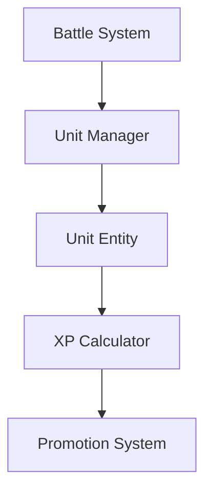

**Use When:** Showing how systems are organized

---

### 2. Sequence Diagram
**Shows:** Order of function calls

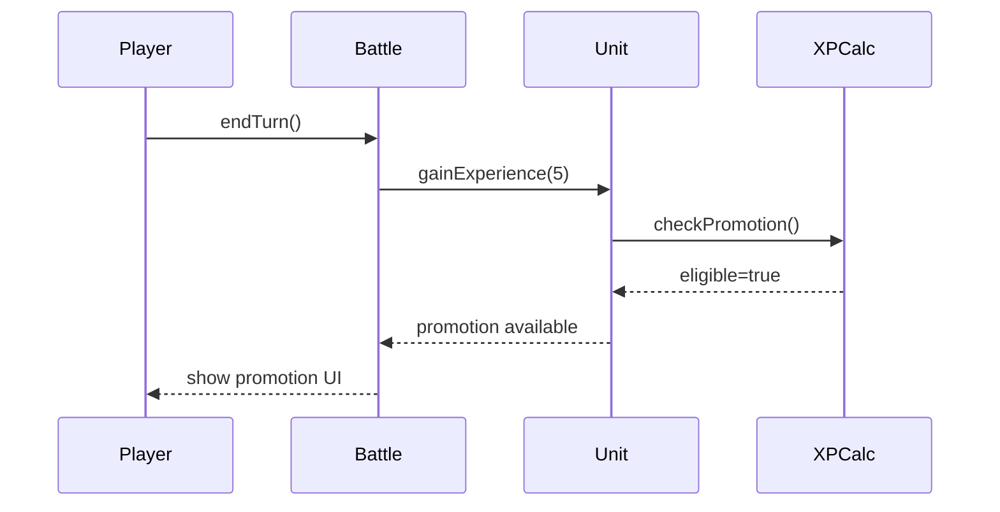

**Use When:** Showing how components interact over time

---

### 3. State Machine
**Shows:** Valid states and transitions

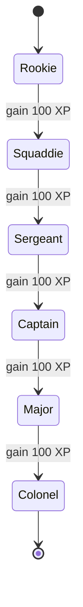

**Use When:** Showing how state changes

---

### 4. Data Flow Diagram
**Shows:** How data moves through system

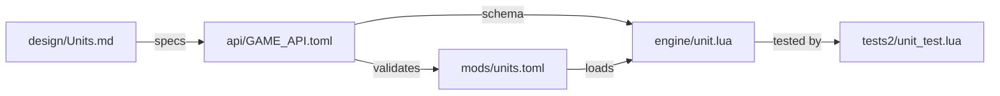

**Use When:** Showing information flow

---

## Integration with Other Folders

### design/ → architecture/
Complex designs get visual diagrams:
- **Design:** "Unit progression system with ranks and XP"
- **Architecture:** State machine showing rank progression

### api/ → architecture/
APIs define what to diagram:
- **API:** Defines `gainExperience()`, `promote()` functions
- **Architecture:** Sequence diagram showing call order

### architecture/ → engine/
Diagrams guide implementation:
- **Architecture:** Shows Battle → UnitManager → Unit
- **Engine:** Implements this exact structure

---

## Example: Unit Progression Architecture

### Document: architecture/systems/PROGRESSION.md

```markdown
# Unit Progression Architecture

## Overview
Visual documentation of unit XP and promotion system.

## Component Structure

### High-Level Components
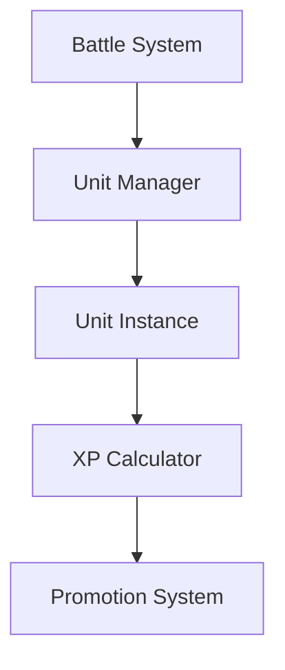

### Component Responsibilities
- **Battle System:** Manages combat, triggers XP awards
- **Unit Manager:** Maintains unit roster
- **Unit Instance:** Individual unit with stats
- **XP Calculator:** Computes XP thresholds
- **Promotion System:** Handles stat increases

## Experience Gain Flow

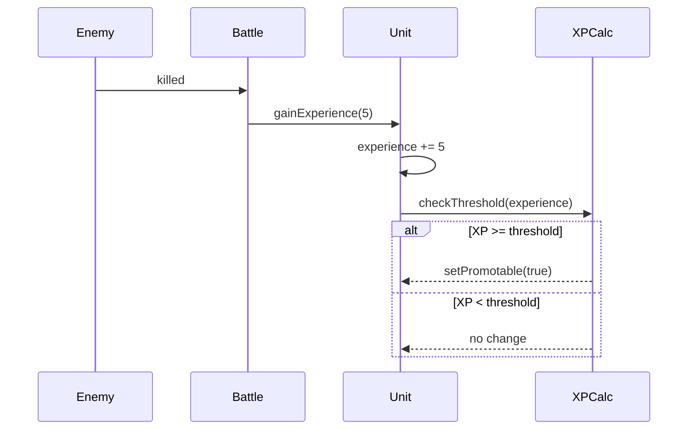

## Rank Progression State Machine

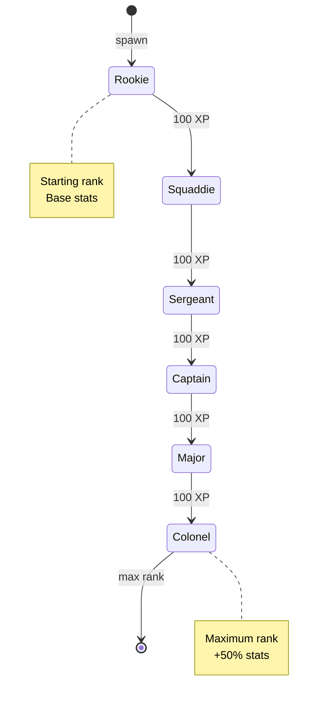

## Promotion Process

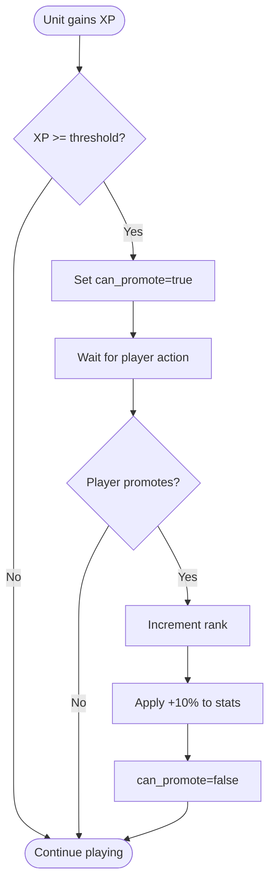

## Data Flow

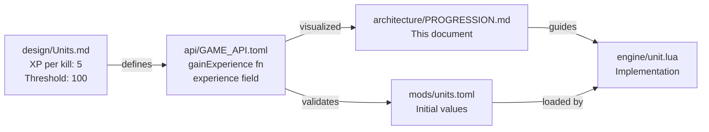

## Integration Points

### With Battle System
- Battle awards XP after kills
- Battle checks promotion eligibility
- Battle displays promotion UI

### With UI System
- UI displays XP bar
- UI shows promotion button
- UI shows rank indicators

### With Save System
- Save current XP value
- Save current rank
- Save promotion eligibility
```

---

## Mermaid Diagram Syntax

### Basic Component Diagram
```markdown
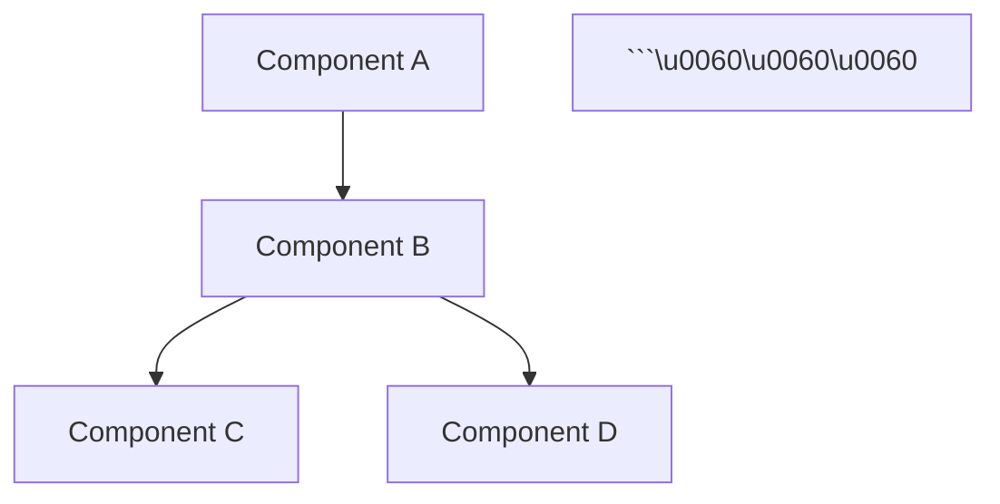

### Sequence Diagram
```markdown
```mermaid
sequenceDiagram
    Alice->>Bob: Hello
    Bob-->>Alice: Hi there
```\u0060\u0060\u0060
```

### State Diagram
```markdown
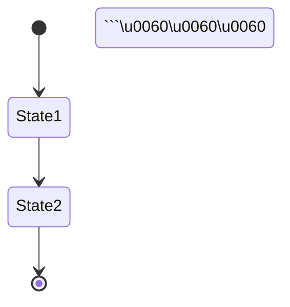

---

## Architecture Guide

### Creating New Architecture Document

1. **Start with Overview**
   - Brief description of system
   - Link to relevant design and API docs

2. **Add Component Diagram**
   - Show high-level structure
   - Identify major components

3. **Add Sequence Diagrams**
   - Show key interactions
   - Document call order

4. **Add State Machines**
   - Show state transitions
   - Document valid states

5. **Document Integration Points**
   - How this connects to other systems
   - Data flow between systems

6. **Keep Updated**
   - Update when structure changes
   - Keep synchronized with engine/

---

## Validation

### Architecture Quality Checklist

- [ ] All major components diagrammed
- [ ] Integration points documented
- [ ] Data flows shown
- [ ] State machines for stateful systems
- [ ] Sequence diagrams for complex interactions
- [ ] Diagrams render correctly
- [ ] Text explains diagram purpose
- [ ] Links to design/ and api/
- [ ] No implementation code
- [ ] Synchronized with engine/

---

## Tools

### Diagram Validator
```bash
lua tools/validators/mermaid_validator.lua architecture/
# Checks all Mermaid diagrams render correctly
```

### Architecture-Engine Drift Detector
```bash
lua tools/validators/architecture_drift.lua architecture/ engine/
# Checks if engine structure matches architecture
```

### Coverage Checker
```bash
lua tools/validators/architecture_coverage.lua api/ architecture/
# Checks if all APIs are diagrammed
```

---

## Best Practices

### 1. Diagram First, Text Second
Start with visual, add text to explain WHY

### 2. Keep Diagrams Simple
One concept per diagram. Multiple simple > one complex.

### 3. Use Consistent Notation
Same shapes mean same things across all diagrams.

### 4. Show Relationships
Arrows indicate direction of dependency or data flow.

### 5. Update with Changes
When architecture changes, update diagrams IMMEDIATELY.

### 6. Link Everything
Reference related design/ and api/ documents.

---

## Common Patterns

### Pattern 1: Manager-Entity
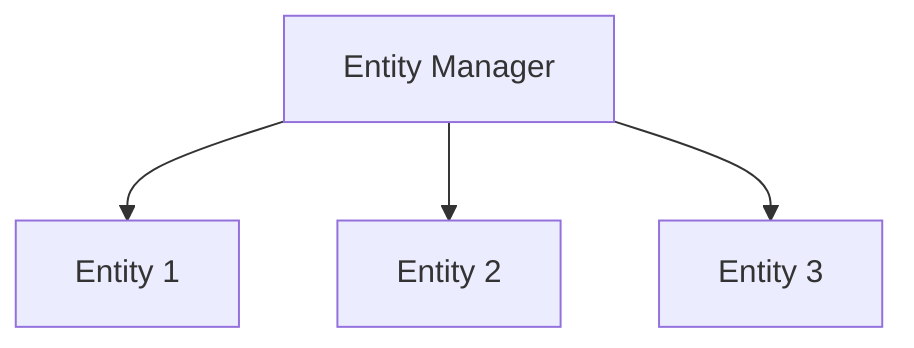
**Use:** When one manager controls many entities

### Pattern 2: Pipeline
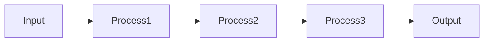
**Use:** When data flows through stages

### Pattern 3: Event Bus
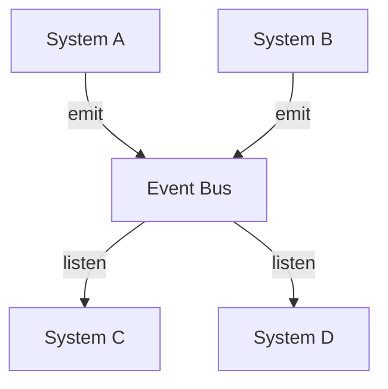
**Use:** When systems communicate via events

---

## Maintenance

**On Structure Change:**
1. Update relevant architecture document
2. Update affected diagrams
3. Verify engine matches
4. Update related docs

**Monthly:**
- Review all diagrams for accuracy
- Check for drift from engine/
- Update outdated diagrams

**Per Release:**
- Document major architecture changes
- Update roadmap
- Archive old versions

---

**See:** architecture/README.md and ARCHITECTURE_GUIDE.md

**Related:**
- [modules/01_DESIGN_FOLDER.md](01_DESIGN_FOLDER.md) - Designs become diagrams
- [modules/02_API_FOLDER.md](02_API_FOLDER.md) - APIs are visualized
- [modules/04_ENGINE_FOLDER.md](04_ENGINE_FOLDER.md) - Diagrams guide implementation

