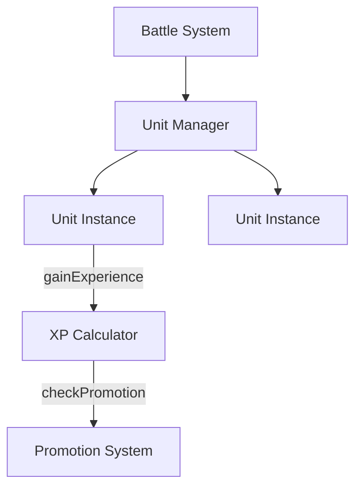

# Separation of Concerns System
**Pattern: Isolating Design, Interface, Implementation, and Content**

**Purpose:** Prevent coupling between what, how (interface), how (structure), how (execution), and what content  
**Problem Solved:** Code mixed with design rationale, interfaces embedded in implementation, content hardcoded  
**Universal Pattern:** Applicable to any software project requiring clear boundaries

---

## 🎯 Core Concept

**Principle:** Each concern lives in its own space with clear boundaries and validation rules.

```
CONCERN 1: SPECIFICATION (design/)
↓ Formalizes into
CONCERN 2: INTERFACE (api/)
↓ Visualizes as
CONCERN 3: STRUCTURE (architecture/)
↓ Implements as
CONCERN 4: EXECUTION (engine/)
↓ Configured by
CONCERN 5: CONTENT (mods/)
```

---

## 📁 The Five Concerns

### Concern 1: SPECIFICATION (design/ folder)

**Purpose:** Document WHAT the system should do and WHY

**Contains:**
- Functional requirements ("Units gain XP per kill")
- Business rules ("XP threshold for promotion is 100")
- Balance parameters ("Strength range: 6-12")
- Design rationale ("Why this range? Prevents overpowered units")

**Format:**
- Markdown documents
- Human-readable prose
- Examples and use cases
- Rationale and context

**Input:** Product requirements, user stories, game design ideas  
**Output:** Clear specifications for API layer

**Validation Rules:**
- NO implementation details ("Use array to store...")
- NO code snippets (examples OK, code NO)
- NO technical architecture (save for architecture/)
- YES rationale (why decisions made)
- YES examples (what it looks like in practice)

**Example Structure:**
```markdown
## Unit Progression System

### Purpose
Reward players for keeping units alive through multiple missions.

### Mechanic
- Units gain 5 XP per enemy kill
- Promotion requires 100 XP
- Each rank increases stats by 10%

### Rationale
5 XP per kill means 20 kills for promotion - achievable but meaningful.
10% increase is noticeable without being overpowered.

### Edge Cases
- What if unit earns exactly 100 XP? → Promotes immediately
- Can units skip ranks? → No, must progress sequentially
```

---

### Concern 2: INTERFACE (api/ folder)

**Purpose:** Define HOW systems communicate (contracts)

**Contains:**
- Function signatures
- Data structures
- TOML/JSON schemas
- Interface contracts
- Validation rules

**Format:**
- Markdown for documentation
- TOML schema (GAME_API.toml)
- Clear type definitions
- Required vs optional fields

**Input:** Design specifications  
**Output:** Formal contracts for engine implementation

**Validation Rules:**
- NO implementation ("Store in hash table...")
- NO design rationale (reference design/ instead)
- YES data types (integer, string, boolean, etc.)
- YES ranges and constraints (6-12, required field)
- YES interface contracts (function signatures)

**Example Structure:**
```toml
# api/GAME_API.toml

[entities.unit]
description = "Individual combat operative"

[entities.unit.fields]
id = { type = "string", required = true, pattern = "^[a-z_][a-z0-9_]*$" }
strength = { type = "integer", range = [6, 12], required = true }
experience = { type = "integer", range = [0, 999999], required = true }

[entities.unit.functions]
gainExperience = {
    parameters = [{ name = "amount", type = "integer" }],
    returns = "void",
    description = "Add experience points to unit"
}
```

---

### Concern 3: STRUCTURE (architecture/ folder)

**Purpose:** Visualize HOW systems are organized and connected

**Contains:**
- System diagrams (Mermaid)
- Component relationships
- Data flow diagrams
- State machines
- Integration points

**Format:**
- Markdown with Mermaid diagrams
- Visual representations
- Component hierarchies
- Sequence diagrams

**Input:** API contracts  
**Output:** Visual blueprints for implementation

**Validation Rules:**
- NO implementation code
- NO design rationale (reference design/)
- YES system structure (components, relationships)
- YES data flows (how information moves)
- YES state transitions (how state changes)

**Example Structure:**


---

### Concern 4: EXECUTION (engine/ folder)

**Purpose:** Implement HOW the system actually works

**Contains:**
- Source code (Lua)
- Implementation logic
- Algorithms
- Performance optimizations

**Format:**
- Code files (*.lua)
- Follows API contracts
- Matches architecture structure
- Implements design specifications

**Input:** API contracts, architecture diagrams  
**Output:** Working, executable code

**Validation Rules:**
- NO design rationale in code (reference design/)
- NO embedded magic numbers (use config or constants)
- YES implementation of ALL API contracts
- YES code comments (HOW complex parts work)
- YES error handling

**Example Structure:**
```lua
-- engine/battlescape/units/unit.lua

local Unit = {}
Unit.__index = Unit

-- Implements api/UNITS.md → gainExperience
function Unit:gainExperience(amount)
    -- Validate against API contract
    assert(type(amount) == "number", "Amount must be integer")
    assert(amount >= 0, "Amount cannot be negative")
    
    -- Implement logic defined in design/mechanics/Units.md
    self.experience = self.experience + amount
    
    -- Check promotion (threshold from design: 100 XP)
    if self.experience >= 100 and self.rank < 7 then
        self.can_promote = true
    end
end

return Unit
```

---

### Concern 5: CONTENT (mods/ folder)

**Purpose:** Separate data from code (data-driven design)

**Contains:**
- TOML configuration files
- Entity definitions (units, items, etc.)
- Asset files (sprites, sounds)
- Game content

**Format:**
- TOML data files
- PNG images
- OGG sounds
- Validates against API schema

**Input:** API schema  
**Output:** Game content loaded by engine

**Validation Rules:**
- NO code in TOML files
- NO design rationale (reference design/)
- YES entity data matching API schema
- YES asset file references
- VALIDATES against GAME_API.toml schema

**Example Structure:**
```toml
# mods/core/rules/units/soldiers.toml

[unit.rookie_soldier]
id = "rookie_soldier"
name = "Rookie Soldier"

# Values from design/mechanics/Units.md
strength = 8
dexterity = 7
constitution = 9

# XP progression from design
experience = 0
xp_to_next_rank = 100

# Asset references
sprite = "units/rookie_soldier.png"
```

---

## 🔄 Integration Flow

### Forward Flow (Development)

```
1. DESIGN
   Write: design/mechanics/Units.md
   Output: "Units gain 5 XP per kill, promote at 100 XP"
   
   ↓

2. API
   Define: api/GAME_API.toml
   Output: gainExperience(amount: integer) → void
   
   ↓

3. ARCHITECTURE
   Diagram: architecture/systems/progression.md
   Output: Battle → Unit → XPCalculator flow
   
   ↓

4. ENGINE
   Implement: engine/battlescape/units/unit.lua
   Output: function Unit:gainExperience(amount) ... end
   
   ↓

5. CONTENT
   Configure: mods/core/rules/units/soldiers.toml
   Output: experience = 0, xp_to_next_rank = 100
```

### Backward Flow (Validation)

```
5. CONTENT validates against
   ↓
4. ENGINE (loads and processes)
   ↓
3. ARCHITECTURE (structure matches)
   ↓
2. API (implements all contracts)
   ↓
1. DESIGN (meets requirements)
```

---

## ✅ Validation Rules Between Concerns

### Design ↔ API Validation

**Rule:** Every design decision must have corresponding API contract

**Check:**
```bash
# Find design decisions without API
tools/validators/design_api_gap_check.lua design/ api/

# Example violations:
# - design/ mentions "pilot system" but no api/PILOTS.md
# - design/ mentions "medal progression" but no schema in GAME_API.toml
```

**Fix:** Create missing API documentation

---

### API ↔ Architecture Validation

**Rule:** Architecture diagrams must show all API interfaces

**Check:**
```bash
# Verify architecture covers all API
tools/validators/api_architecture_coverage.lua api/ architecture/

# Example violations:
# - api/UNITS.md defines gainExperience() but no sequence diagram
# - api/RESEARCH.md defines unlockTech() but missing in architecture
```

**Fix:** Add diagrams showing API usage

---

### Architecture ↔ Engine Validation

**Rule:** Engine structure must match architecture diagrams

**Check:**
```bash
# Compare engine structure to architecture
tools/validators/architecture_implementation_drift.lua architecture/ engine/

# Example violations:
# - Architecture shows Battle → UnitManager but engine has direct Battle → Unit
# - Architecture shows EventBus pattern but engine uses direct calls
```

**Fix:** Refactor engine OR update architecture (choose one, keep synchronized)

---

### Engine ↔ Content Validation

**Rule:** Content must validate against API schema

**Check:**
```bash
# Validate TOML against schema
tools/validators/toml_validator.lua mods/ api/GAME_API.toml

# Example violations:
# - strength = 15 (out of range [6, 12])
# - missing required field 'id'
# - wrong type (string instead of integer)
```

**Fix:** Correct TOML to match schema

---

## 🚫 Anti-Patterns (What NOT To Do)

### Anti-Pattern 1: Design in Code

**WRONG:**
```lua
-- engine/unit.lua
function Unit:promote()
    -- Promotion increases stats by 10% because it needs to be noticeable
    -- but not overpowered. We tested 5%, 10%, and 15%, and 10% felt best.
    self.strength = self.strength * 1.1
end
```

**RIGHT:**
```lua
-- engine/unit.lua
function Unit:promote()
    -- See design/mechanics/Units.md for stat increase rationale
    local increase_percent = 10  -- From design spec
    self.strength = self.strength * (1 + increase_percent / 100)
end
```

**Why:** Rationale belongs in design/, code should reference it

---

### Anti-Pattern 2: Implementation in Design

**WRONG:**
```markdown
## Unit Progression

Units store XP in an integer variable. When XP reaches threshold,
set can_promote flag to true. Use modulo operator to check if XP
is divisible by 100 for bonus rewards.
```

**RIGHT:**
```markdown
## Unit Progression

Units accumulate experience points through combat. At defined thresholds,
units become eligible for promotion. Milestone achievements (every 100 XP)
trigger bonus rewards.

Implementation details: See engine/battlescape/units/unit.lua
```

**Why:** HOW to implement belongs in engine/, design describes WHAT happens

---

### Anti-Pattern 3: Hardcoded Values

**WRONG:**
```lua
-- engine/unit.lua
function Unit:checkPromotion()
    if self.experience >= 100 then  -- Magic number!
        self.can_promote = true
    end
end
```

**RIGHT:**
```lua
-- engine/unit.lua
function Unit:checkPromotion()
    local threshold = self:getXPThreshold()  -- From TOML config
    if self.experience >= threshold then
        self.can_promote = true
    end
end
```

**Why:** Values belong in mods/ (configurable), not code (hardcoded)

---

### Anti-Pattern 4: Schema in Multiple Places

**WRONG:**
- Define unit structure in design/
- Redefine in code comments
- Redefine in TOML
- Different definitions! Drift!

**RIGHT:**
- Define ONCE in api/GAME_API.toml
- Reference everywhere else
- Single source of truth

**Why:** Duplication causes drift, validation impossible

---

## 🔧 Tools for Maintaining Separation

### 1. Cross-Reference Validator

```bash
tools/validators/cross_reference_validator.lua

# Checks:
# - Design references point to valid API docs
# - API docs reference valid design specs
# - Engine comments reference valid docs
# - No orphaned documentation
```

### 2. Schema Validator

```bash
tools/validators/schema_validator.lua api/GAME_API.toml

# Checks:
# - Schema is complete (all fields defined)
# - Types are valid
# - Ranges are logical (min < max)
# - Required fields marked
```

### 3. TOML Validator

```bash
tools/validators/toml_validator.lua mods/ api/GAME_API.toml

# Checks:
# - TOML syntax correct
# - Matches schema types
# - Values in range
# - Required fields present
# - No unknown fields
```

### 4. Design-API Gap Checker

```bash
tools/validators/design_api_gap_check.lua design/ api/

# Checks:
# - Every design decision has API
# - Every API has design rationale
# - No gaps in either direction
```

---

## 📊 Metrics for Separation Quality

### Measure 1: Pure Separation

```
design/ files with implementation details: 0
api/ files with design rationale: 0
engine/ files with design rationale: <5% (comments only)
mods/ files with code: 0
```

### Measure 2: Reference Compliance

```
design/ → api/ references: 100%
api/ → design/ references: 100%
engine/ → api/ compliance: 100%
mods/ → api/ schema compliance: 100%
```

### Measure 3: Drift Detection

```
API-Engine drift: 0 (architecture matches implementation)
Design-API drift: 0 (all design has API)
Schema-Content drift: 0 (all TOML validates)
```

---

## 🌍 Universal Replication

### Adapt to ANY Project

**Game Development** (current):
- design/ = Game mechanics
- api/ = Entity schemas
- engine/ = Game code
- mods/ = Levels, content

**Web Application**:
- design/ = Product requirements
- api/ = REST/GraphQL specs
- engine/ = Backend services
- mods/ = App configuration

**Data Pipeline**:
- design/ = Data flow requirements
- api/ = Schema definitions
- engine/ = Processing code
- mods/ = Data sources config

**Embedded System**:
- design/ = Hardware requirements
- api/ = Protocol definitions
- engine/ = Firmware code
- mods/ = Device profiles

**Key:** The PATTERN remains, NAMES change per domain.

---

## 🎯 Success Criteria

Separation of Concerns is working when:

✅ Design documents have ZERO implementation details  
✅ API is single source of truth for all schemas  
✅ Engine implements ALL and ONLY what API defines  
✅ Content validates 100% against schema  
✅ No duplication - everything defined once  
✅ Validation passes automatically  
✅ Team can work on concerns independently  

---

## 📝 Replication Checklist

To implement this pattern in your project:

- [ ] Create folder structure (design/, api/, architecture/, engine/, mods/)
- [ ] Define what goes in each concern (adapt to your domain)
- [ ] Create schema file (like GAME_API.toml)
- [ ] Write validation rules between concerns
- [ ] Build validators (design-api gap, schema validator, etc.)
- [ ] Document anti-patterns for your team
- [ ] Set up automated validation in CI/CD
- [ ] Train team on separation principles
- [ ] Review regularly for drift

---

**Related Documents:**
- [modules/01_DESIGN_FOLDER.md](../modules/01_DESIGN_FOLDER.md) - Design folder usage
- [modules/02_API_FOLDER.md](../modules/02_API_FOLDER.md) - API folder usage
- [modules/03_ARCHITECTURE_FOLDER.md](../modules/03_ARCHITECTURE_FOLDER.md) - Architecture folder usage
- [modules/04_ENGINE_FOLDER.md](../modules/04_ENGINE_FOLDER.md) - Engine folder usage
- [modules/05_MODS_FOLDER.md](../modules/05_MODS_FOLDER.md) - Mods folder usage

**Next System:** [02_PIPELINE_ARCHITECTURE_SYSTEM.md](02_PIPELINE_ARCHITECTURE_SYSTEM.md)

**Last Updated:** 2025-10-27  
**Pattern Maturity:** Production-Proven

---

*"Separation of concerns is not about where files live—it's about preventing coupling that makes change expensive."*

