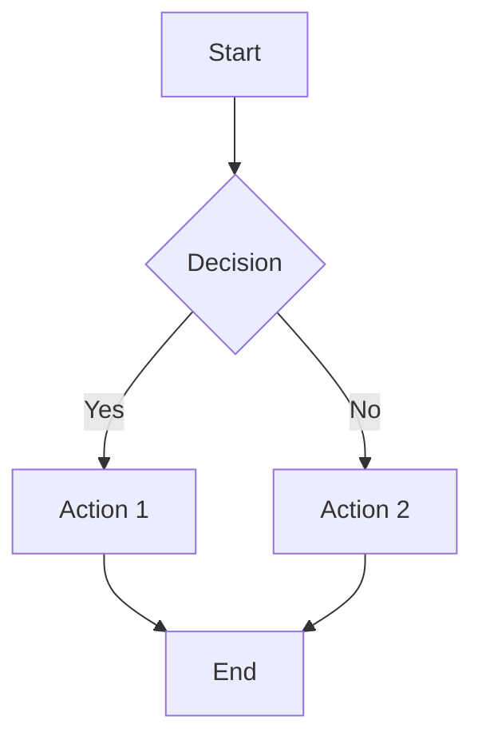

# Task: Create Visual Diagrams for Documentation

**Status:** TODO  
**Priority:** Medium  
**Created:** 2025-01-XX  
**Completed:** N/A  
**Assigned To:** AI Agent

---

## Overview

Create comprehensive visual diagrams for all major game systems as outlined in wiki/wiki/diagrams.md. Currently, the diagrams file is a placeholder with no actual diagrams. This task generates actual visual documentation using ASCII art, Mermaid diagrams, or image files.

---

## Purpose

Visual diagrams significantly improve documentation comprehension, especially for complex systems like game loops, data flows, and architectural patterns. Developers, modders, and AI agents benefit from clear visual representations of system relationships and workflows.

---

## Requirements

### Functional Requirements
- [ ] Game structure diagrams (layer integration, time scale hierarchy)
- [ ] Content generation diagrams (procedural pipelines)
- [ ] Combat & tactics diagrams (damage calculations, line of sight)
- [ ] Base management diagrams (facility adjacency, power flow)
- [ ] Economic diagrams (resource cycles, trade flows)
- [ ] AI behavior diagrams (decision trees, state machines)
- [ ] UI/UX diagrams (screen flows, widget hierarchy)
- [ ] Technical diagrams (architecture, data flow)
- [ ] Development diagrams (workflow, testing pipeline)

### Technical Requirements
- [ ] Use Mermaid.js for flowcharts and sequence diagrams
- [ ] Use ASCII art for simple diagrams
- [ ] Use image files (PNG/SVG) for complex diagrams if needed
- [ ] All diagrams stored in docs/diagrams/
- [ ] Diagrams embedded in relevant documentation files
- [ ] Maintain consistency in diagram style and notation

### Acceptance Criteria
- [ ] All sections from diagrams.md have corresponding visual diagrams
- [ ] Diagrams are clear, accurate, and up-to-date with implementation
- [ ] Diagrams render correctly in Markdown viewers
- [ ] Each diagram includes legend/key if needed
- [ ] Diagrams linked from relevant documentation pages

---

## Plan

### Step 1: Create Game Structure Diagrams
**Description:** Time scale hierarchy, layer integration, organizational progression  
**Files to create:**
- `docs/diagrams/game_structure.md`
- `docs/diagrams/time_scales.md`
- `docs/diagrams/layer_integration.md`
- `docs/diagrams/organization_progression.md`

**Diagrams:**
- Time scale hierarchy (Battle 10s → Interception minutes → Geoscape days)
- Game layer flow (Geoscape ↔ Interception ↔ Battlescape)
- Organization progression tree (5 levels with unlocks)

**Estimated time:** 3 hours

### Step 2: Create Content Generation Diagrams
**Description:** Procedural generation pipelines for maps, missions, entities  
**Files to create:**
- `docs/diagrams/procedural_generation.md`
- `docs/diagrams/map_generation_pipeline.md`
- `docs/diagrams/mission_generation_flow.md`
- `docs/diagrams/entity_generation.md`

**Diagrams:**
- Map generation pipeline (Template → Rules → Generator → Validator)
- Mission generation trigger flow
- Entity generation workflow

**Estimated time:** 3 hours

### Step 3: Create Combat & Tactics Diagrams
**Description:** Combat mechanics, damage calculations, line of sight, action point economy  
**Files to create:**
- `docs/diagrams/combat_flow.md`
- `docs/diagrams/damage_calculation.md`
- `docs/diagrams/line_of_sight.md`
- `docs/diagrams/action_points.md`

**Diagrams:**
- Damage type effectiveness matrix
- Armor penetration calculation flowchart
- Line of sight & cover system
- Action point economy flow

**Estimated time:** 4 hours

### Step 4: Create Base Management Diagrams
**Description:** Facility layouts, power flow, personnel assignment  
**Files to create:**
- `docs/diagrams/base_layout.md`
- `docs/diagrams/facility_adjacency.md`
- `docs/diagrams/power_flow.md`
- `docs/diagrams/personnel_management.md`

**Diagrams:**
- Base grid layout (6x6 facility grid)
- Facility adjacency bonuses
- Power generation and consumption

**Estimated time:** 3 hours

### Step 5: Create Economic Diagrams
**Description:** Resource cycles, trade flows, manufacturing chains  
**Files to create:**
- `docs/diagrams/economy_cycle.md`
- `docs/diagrams/resource_flow.md`
- `docs/diagrams/manufacturing_chain.md`

**Diagrams:**
- Monthly economic cycle (Income → Expenses → Net)
- Resource flow (Missions → Recovery → Manufacturing → Deployment)
- Manufacturing chain dependencies

**Estimated time:** 2 hours

### Step 6: Create AI & Behavior Diagrams
**Description:** AI decision trees, state machines, behavior priorities  
**Files to create:**
- `docs/diagrams/ai_decision_trees.md`
- `docs/diagrams/ai_state_machines.md`
- `docs/diagrams/ai_behavior_flow.md`

**Diagrams:**
- Battlescape AI decision tree
- Unit state machine (Idle → Alert → Combat → Retreat)
- AI priority evaluation flowchart

**Estimated time:** 3 hours

### Step 7: Create UI/UX Diagrams
**Description:** Screen flows, widget hierarchy, navigation  
**Files to create:**
- `docs/diagrams/screen_flow.md`
- `docs/diagrams/widget_hierarchy.md`
- `docs/diagrams/ui_navigation.md`

**Diagrams:**
- Screen transition flow (MainMenu → Geoscape → Basescape → Battlescape)
- Widget composition hierarchy
- 24x24 pixel grid layout

**Estimated time:** 2 hours

### Step 8: Create Technical & Development Diagrams
**Description:** Architecture, data flow, testing pipeline, development workflow  
**Files to create:**
- `docs/diagrams/architecture.md`
- `docs/diagrams/data_flow.md`
- `docs/diagrams/testing_pipeline.md`
- `docs/diagrams/development_workflow.md`

**Diagrams:**
- Engine architecture (Core → Services → Scenes)
- Data flow (TOML → Parser → Game State → Renderer)
- Testing workflow (Unit → Integration → Manual)

**Estimated time:** 3 hours

### Step 9: Integration and Documentation Updates
**Description:** Link diagrams to relevant documentation, update navigation  
**Files to update:**
- All relevant docs/ files to embed diagrams
- `docs/OVERVIEW.md` to link diagram index
- `docs/README.md` to reference visual guides

**Estimated time:** 2 hours

---

## Implementation Details

### Architecture
**Diagram Creation Approach**:
1. Use Mermaid.js for flowcharts, sequence diagrams, state diagrams
2. Use ASCII art for simple grid layouts and hierarchies
3. Use PNG/SVG only for complex visual diagrams that can't be rendered in Markdown

**Diagram Storage**:
- Primary location: `docs/diagrams/`
- Embedded in relevant documentation via relative links
- Index file: `docs/diagrams/README.md` with all diagrams listed

### Key Components
- **Mermaid Diagrams**: Flowcharts, sequence diagrams, state machines
- **ASCII Diagrams**: Grid layouts, simple hierarchies
- **Image Files**: Complex visual diagrams (if needed)

### Dependencies
- Markdown rendering with Mermaid.js support (GitHub, VS Code)
- docs/ folder structure
- Accurate understanding of current implementation

---

## Testing Strategy

### Manual Verification Steps
1. View all diagrams in VS Code Markdown preview
2. Check GitHub rendering of diagrams
3. Verify accuracy against actual implementation
4. Get feedback from developers on clarity
5. Test diagram links from documentation pages

### Expected Results
- All diagrams render correctly in Markdown viewers
- Diagrams accurately represent current implementation
- Diagrams improve documentation comprehension
- Diagrams are maintainable and easy to update

---

## How to Run/Debug

### Viewing Diagrams
- VS Code: Open .md file with diagram, use Markdown preview (Ctrl+Shift+V)
- GitHub: Push to repository and view diagrams in browser
- Mermaid Live Editor: https://mermaid.live/ for testing Mermaid syntax

### Diagram Examples

**Mermaid Flowchart**:


**ASCII Grid**:
```
+-----+-----+-----+
| A1  | B1  | C1  |
+-----+-----+-----+
| A2  | B2  | C2  |
+-----+-----+-----+
```

---

## Documentation Updates

### Files to Update
- [x] Create `docs/diagrams/README.md` - Index of all diagrams
- [x] Create all diagram files in docs/diagrams/
- [ ] Update `docs/OVERVIEW.md` - Link to diagram index
- [ ] Update relevant docs/ files - Embed diagrams
- [ ] Update `wiki/DEVELOPMENT.md` - Reference visual guides

---

## Notes

- Prioritize diagrams that explain complex systems (AI, combat, generation)
- Keep diagrams simple and focused - one concept per diagram
- Use consistent notation and style across all diagrams
- Update diagrams when implementation changes
- Consider using Mermaid.js for most diagrams (better maintainability)

---

## Blockers

- None identified - purely documentation task

---

## Review Checklist

- [ ] All diagrams render correctly in VS Code
- [ ] All diagrams render correctly on GitHub
- [ ] Diagrams accurately represent current implementation
- [ ] Diagrams have clear labels and legends
- [ ] Diagram style is consistent across all files
- [ ] Diagrams embedded in relevant documentation
- [ ] Index file lists all diagrams with descriptions
- [ ] Diagrams improve comprehension (verified with feedback)

---

## Post-Completion

### What Worked Well
- TBD after implementation

### What Could Be Improved
- TBD after implementation

### Lessons Learned
- TBD after implementation
