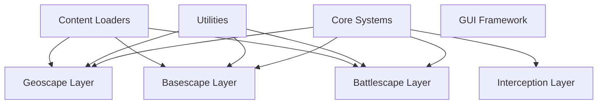

# Task: Reorganize Engine Folder Structure

**Status:** TODO
**Priority:** Medium
**Created:** 2025-10-24
**Completed:** N/A
**Assigned To:** AI Agent

---

## Overview

Audit entire `engine/` folder structure to ensure every file is in the correct location based on its purpose and features. Reorganize, rename, and move files as needed to improve logical structure, discoverability, and maintainability. Update all imports, tests, and documentation.

---

## Purpose

**Why this is needed:**
- Project has evolved organically
- Files may be in wrong folders
- Naming might not reflect current purpose
- Hard to find specific functionality
- Inconsistent folder organization
- Some folders might be too broad or too narrow
- New developers get confused
- Technical debt accumulation

**What problem it solves:**
- Clear, logical folder structure
- Easy to find files by purpose
- Consistent organization patterns
- Better discoverability
- Easier onboarding
- Reduced cognitive load
- Foundation for future growth

---

## Requirements

### Functional Requirements
- [ ] Scan entire `engine/` folder recursively
- [ ] Analyze each file's purpose and features
- [ ] Identify misplaced files
- [ ] Identify poorly named files
- [ ] Identify poorly organized folders
- [ ] Propose new structure
- [ ] Create file movement plan
- [ ] Move files to new locations
- [ ] Rename files as needed
- [ ] Update all imports/requires
- [ ] Update all tests
- [ ] Verify game still runs
- [ ] Verify all tests still pass

### Technical Requirements
- [ ] Automated scanning tool
- [ ] Generate report of current structure
- [ ] Generate proposed new structure (diff)
- [ ] Automated import path updates
- [ ] Git-friendly (preserves history)
- [ ] Rollback capability if issues
- [ ] Verification tests

### Acceptance Criteria
- [ ] Every file is in appropriate folder
- [ ] Folder names clearly indicate contents
- [ ] File names clearly indicate purpose
- [ ] No orphaned files
- [ ] No duplicate functionality in multiple places
- [ ] Consistent depth (not too deep, not too shallow)
- [ ] All imports updated correctly
- [ ] All tests updated correctly
- [ ] Game runs without errors
- [ ] All tests pass
- [ ] Documentation updated

---

## Plan

### Step 1: Audit Current Structure
**Description:** Scan and document current engine folder organization

**Tool to create:** `tools/structure/audit_engine_structure.lua`

**Analysis to perform:**
```lua
-- For each file in engine/:
-- 1. Extract file metadata
--    - Path
--    - Name
--    - Size
--    - Lines of code
-- 2. Analyze file content
--    - Module name
--    - Functions defined
--    - Dependencies (requires)
--    - Purpose (from comments/code)
-- 3. Check file location
--    - Is it in correct category?
--    - Does folder match purpose?
-- 4. Check file name
--    - Is it descriptive?
--    - Does it match content?
```

**Output:** `temp/engine_structure_audit.md`

**Report structure:**
```markdown
# Engine Folder Structure Audit

## Summary
- Total files: X
- Total folders: Y
- Total lines of code: Z

## Folder Analysis

### engine/accessibility/
Files: 5
Purpose: Accessibility features (screen readers, colorblind mode, etc.)
Issues:
- [ ] File X seems misplaced (should be in Y)
- [ ] Folder name could be clearer

### engine/ai/
Files: 12
Purpose: AI systems (tactical AI, strategic AI)
Issues:
- [ ] tactical_ai.lua and battle_ai.lua seem to overlap
- [ ] strategic_ai.lua is empty (dead code?)

... (continue for all folders)

## Misplaced Files

1. `engine/utils/map_generator.lua`
   - Current: utils/
   - Should be: battlescape/generation/
   - Reason: Specific to battlescape map generation, not general utility

2. `engine/core/unit_manager.lua`
   - Current: core/
   - Should be: battlescape/units/
   - Reason: Specific to combat units, not core engine

... (continue for all misplaced files)

## Poorly Named Files

1. `engine/geoscape/manager.lua`
   - Current name: manager.lua (too generic)
   - Suggested: geoscape_manager.lua or world_manager.lua
   - Reason: Clearer purpose

... (continue)

## Empty or Near-Empty Files

1. `engine/politics/factions.lua` - 5 lines, stub
2. `engine/network/multiplayer.lua` - 10 lines, not implemented

## Duplicated Functionality

1. `engine/utils/math_utils.lua` and `engine/core/math.lua`
   - Both contain vector math functions
   - Should merge into one

... (continue)
```

**Estimated time:** 6-8 hours

---

### Step 2: Define Organization Principles
**Description:** Establish rules for folder structure

**Principles to document:**

**1. Layer-Based Organization (Top Level)**
```
engine/
├── core/           -- Core engine systems (state, events, globals)
├── utils/          -- Generic utilities (math, strings, tables, files)
├── gui/            -- GUI framework (windows, widgets, rendering)
├── widgets/        -- Reusable UI widgets
├── content/        -- Content loaders (TOML parsers, mod system)
├── geoscape/       -- Strategic layer
├── basescape/      -- Base management layer
├── battlescape/    -- Tactical combat layer
├── interception/   -- Craft interception layer
├── accessibility/  -- Accessibility features
├── localization/   -- Translation system
├── tutorial/       -- Tutorial system
├── analytics/      -- Analytics and metrics
├── ai/             -- AI systems (cross-layer)
├── economy/        -- Economic systems (cross-layer)
├── politics/       -- Political systems (cross-layer)
├── lore/           -- Lore/story content system
├── network/        -- Networking (if implemented)
└── assets/         -- Asset loading and management
```

**2. Feature-Based Organization (Within Layers)**
```
battlescape/
├── combat/         -- Combat mechanics
├── movement/       -- Unit movement
├── units/          -- Unit management
├── weapons/        -- Weapon systems
├── maps/           -- Map generation and management
├── ai/             -- Battlescape-specific AI
├── ui/             -- Battlescape UI
└── effects/        -- Visual effects, animations
```

**3. File Naming Conventions**
- `*_manager.lua` - Manages a system (unit_manager.lua)
- `*_loader.lua` - Loads data from files
- `*_renderer.lua` - Renders something to screen
- `*_handler.lua` - Handles events/input
- `*_system.lua` - Complete system (inventory_system.lua)
- `*_utils.lua` - Utility functions for domain

**4. Folder Depth Guidelines**
- Maximum 4 levels deep (engine/layer/feature/subfeature/)
- If deeper needed, reconsider structure
- Prefer broader folders over deep nesting

**5. File Size Guidelines**
- Max 500-1000 lines per file
- If larger, consider splitting
- Related split files in subfolder

**Output:** `docs/ENGINE_ORGANIZATION_PRINCIPLES.md`

**Estimated time:** 3-4 hours

---

### Step 3: Generate Proposed New Structure
**Description:** Based on audit and principles, propose new structure

**Tool to create:** `tools/structure/propose_reorganization.lua`

**Process:**
1. Load audit results
2. Load organization principles
3. For each file, determine ideal location
4. Generate movement plan
5. Identify conflicts
6. Optimize structure

**Output:** `temp/proposed_structure.md`

**Format:**
```markdown
# Proposed Engine Reorganization

## Summary
- Files to move: X
- Files to rename: Y
- Folders to create: Z
- Folders to merge: A
- Folders to delete: B

## Detailed Changes

### Move Operations

#### 1. Move `engine/utils/map_generator.lua`
- **From:** `engine/utils/map_generator.lua`
- **To:** `engine/battlescape/maps/generator.lua`
- **Reason:** Specific to battlescape maps, not general utility
- **Impact:** Update 5 imports

#### 2. Move `engine/core/unit_manager.lua`
- **From:** `engine/core/unit_manager.lua`
- **To:** `engine/battlescape/units/manager.lua`
- **Reason:** Battle-specific unit management
- **Impact:** Update 12 imports

... (continue for all moves)

### Rename Operations

#### 1. Rename `manager.lua`
- **From:** `engine/geoscape/manager.lua`
- **To:** `engine/geoscape/world_manager.lua`
- **Reason:** More descriptive name
- **Impact:** Update 8 imports

... (continue)

### Folder Operations

#### Create `engine/battlescape/maps/`
- **Purpose:** Map generation and management
- **Contains:** generator.lua, loader.lua, renderer.lua

#### Merge `engine/utils/math_utils.lua` into `engine/utils/math.lua`
- **Reason:** Duplicate functionality
- **Impact:** Update 15 imports

#### Delete `engine/network/` (empty)
- **Reason:** Not implemented, no content
- **Impact:** None

... (continue)

## New Structure Overview

```
engine/
├── core/
│   ├── state_manager.lua
│   ├── event_system.lua
│   └── globals.lua
├── utils/
│   ├── math.lua (merged from math_utils.lua)
│   ├── string_utils.lua
│   ├── table_utils.lua
│   └── file_utils.lua
├── battlescape/
│   ├── combat/
│   │   ├── damage_calculator.lua
│   │   └── hit_calculator.lua
│   ├── movement/
│   │   ├── pathfinding.lua
│   │   └── movement_system.lua
│   ├── units/
│   │   ├── manager.lua (moved from core/)
│   │   └── stats.lua
│   ├── maps/
│   │   ├── generator.lua (moved from utils/)
│   │   ├── loader.lua
│   │   └── renderer.lua
│   └── ai/
│       ├── tactical_ai.lua
│       └── behavior_tree.lua
... (complete tree)
```

## Impact Analysis

### High Impact Changes (require extensive updates)
1. Move unit_manager.lua - affects 12 files
2. Merge math utilities - affects 15 files

### Medium Impact Changes
1. Move map_generator.lua - affects 5 files

### Low Impact Changes
1. Rename manager.lua - affects 2 files

## Estimated Effort
- File operations: 2-3 hours
- Import updates: 4-6 hours
- Test updates: 3-4 hours
- Verification: 2-3 hours
- **Total: 11-16 hours**
```

**Estimated time:** 4-6 hours

---

### Step 4: Review and Approve Plan
**Description:** Manual review of proposed changes

**Process:**
1. Generate proposed structure
2. Review with team/lead dev
3. Identify any issues or concerns
4. Adjust plan as needed
5. Get final approval

**Checklist:**
- [ ] All moves make sense
- [ ] No critical functionality disrupted
- [ ] Naming is clear and consistent
- [ ] Structure follows principles
- [ ] Impact is understood
- [ ] Timeline is realistic

**Estimated time:** 2-3 hours

---

### Step 5: Create Migration Script
**Description:** Automate file moves and renames

**Tool to create:** `tools/structure/migrate_structure.lua`

**Script capabilities:**
```lua
-- Read migration plan
local plan = loadMigrationPlan("temp/approved_migration_plan.json")

-- Create backup
backupEngine("temp/engine_backup/")

-- Create new folders
for _, folder in ipairs(plan.newFolders) do
  createFolder(folder)
end

-- Move files (preserve git history)
for _, move in ipairs(plan.moves) do
  gitMove(move.from, move.to)
end

-- Rename files
for _, rename in ipairs(plan.renames) do
  gitMove(rename.from, rename.to)
end

-- Update imports in all files
for _, file in ipairs(plan.filesToUpdate) do
  updateImports(file, plan.importMappings)
end

-- Delete empty folders
for _, folder in ipairs(plan.deleteFolders) do
  deleteFolder(folder)
end

-- Generate migration report
generateReport("temp/migration_report.md")
```

**Git commands:**
```bash
# Use git mv to preserve history
git mv engine/utils/map_generator.lua engine/battlescape/maps/generator.lua
```

**Import update logic:**
```lua
function updateImports(filePath, mappings)
  local content = readFile(filePath)

  for oldPath, newPath in pairs(mappings) do
    -- Update require statements
    content = content:gsub(
      'require%s*%(?["\']' .. escapePattern(oldPath) .. '["\']%)?',
      'require("' .. newPath .. '")'
    )
  end

  writeFile(filePath, content)
end
```

**Estimated time:** 6-8 hours

---

### Step 6: Update Test Files
**Description:** Update all test imports and paths

**Process:**
1. Scan all files in `tests/`
2. Update require statements
3. Update file paths in test data
4. Update mock paths

**Tool to create:** `tools/structure/update_test_imports.lua`

**Estimated time:** 3-4 hours

---

### Step 7: Execute Migration
**Description:** Run migration script

**Steps:**
1. Create git branch: `git checkout -b refactor/engine-restructure`
2. Run migration script
3. Review changes
4. Commit incrementally (by layer or feature)

**Commit strategy:**
```bash
# Commit moves by layer
git add engine/battlescape/
git commit -m "refactor: reorganize battlescape folder structure"

git add engine/geoscape/
git commit -m "refactor: reorganize geoscape folder structure"

# Commit import updates
git add engine/ tests/
git commit -m "refactor: update imports after restructure"
```

**Estimated time:** 2-3 hours

---

### Step 8: Verification Testing
**Description:** Ensure everything still works

**Tests to run:**
1. **All automated tests:**
   ```bash
   lovec tests/runners
   ```

2. **Manual game testing:**
   - Run game: `lovec engine`
   - Test each layer:
     - Geoscape loads
     - Basescape loads
     - Battlescape loads
     - Interception works
   - Check console for errors

3. **Import verification:**
   - Check for missing require errors
   - Check for circular dependencies

4. **Performance check:**
   - Load times acceptable
   - No performance regressions

**If issues found:**
- Fix immediately
- Document issues
- Update migration script for future use

**Estimated time:** 4-5 hours

---

### Step 9: Update Documentation
**Description:** Update docs to reflect new structure

**Files to update:**
- [ ] `README.md` - update folder structure section
- [ ] `docs/ENGINE_STRUCTURE_VALIDATION.md` - rewrite
- [ ] `architecture/README.md` - update diagrams
- [ ] `.github/copilot-instructions.md` - update structure
- [ ] `api/` - update any references to engine files
- [ ] Create `docs/ENGINE_ORGANIZATION_PRINCIPLES.md`

**New diagrams needed:**


**Estimated time:** 3-4 hours

---

### Step 10: Create Structure Validator
**Description:** Tool to check structure stays organized

**Tool to create:** `tools/structure/validate_structure.lua`

**Validation checks:**
- Files are in correct folders (based on principles)
- File names follow conventions
- No duplicate functionality
- No orphaned files
- Folder depth within limits
- No circular dependencies

**Can be run as:**
- Pre-commit hook
- CI/CD check
- Manual check

**Output:**
```
Engine Structure Validation
==========================

✓ All files in correct folders
✓ All file names follow conventions
✗ Duplicate functionality detected:
  - engine/utils/vector.lua and engine/battlescape/math/vector.lua
✓ No orphaned files
✓ Folder depth within limits (max: 3)
✓ No circular dependencies

Result: 1 issue found
```

**Estimated time:** 4-5 hours

---

## Implementation Details

### Architecture

**Three-Phase Approach:**
1. **Analysis Phase:** Audit current structure, propose changes
2. **Migration Phase:** Execute moves/renames, update imports
3. **Validation Phase:** Test, verify, document

**Tools:**
```
tools/structure/
├── audit_engine_structure.lua       -- Analyze current structure
├── propose_reorganization.lua       -- Generate migration plan
├── migrate_structure.lua            -- Execute migration
├── update_test_imports.lua          -- Update test files
└── validate_structure.lua           -- Ongoing validation
```

### Key Components

**Auditor:** Scans and analyzes current structure
**Planner:** Generates optimal structure based on principles
**Migrator:** Executes file operations and import updates
**Validator:** Verifies structure compliance

### Dependencies

- Lua file system library
- Git (for preserving history)
- TOML parser (for reading config)
- Pattern matching (for import updates)

---

## Testing Strategy

### Before Migration
- [ ] All tests pass
- [ ] Game runs without errors
- [ ] Create complete backup

### During Migration
- [ ] Incremental commits
- [ ] Test after each major change
- [ ] Keep migration log

### After Migration
- [ ] All tests pass
- [ ] Game runs without errors
- [ ] No performance regression
- [ ] No console errors
- [ ] Manual testing of all features

### Rollback Plan
If critical issues found:
```bash
# Rollback to pre-migration state
git checkout main
git branch -D refactor/engine-restructure
# Restore from backup if needed
```

---

## Documentation Updates

### Files to Create
- [ ] `docs/ENGINE_ORGANIZATION_PRINCIPLES.md`
- [ ] `temp/engine_structure_audit.md`
- [ ] `temp/proposed_structure.md`
- [ ] `temp/migration_report.md`

### Files to Update
- [ ] `README.md` - project structure
- [ ] `docs/ENGINE_STRUCTURE_VALIDATION.md` - rewrite
- [ ] `architecture/README.md` - update diagrams
- [ ] `.github/copilot-instructions.md` - update paths
- [ ] All API docs with file references

---

## Notes

**Critical Success Factors:**
1. **Preserve git history** - use `git mv` not `rm + add`
2. **Test thoroughly** - can't afford broken game
3. **Update ALL imports** - easy to miss some
4. **Document principles** - prevent future drift
5. **Create validator** - maintain structure

**Common Pitfalls:**
- Forgetting test file imports
- Missing imports in rarely used files
- Breaking circular dependencies incorrectly
- Moving files that shouldn't move
- Too aggressive refactoring

**Future Maintenance:**
- Run structure validator regularly
- Review new files during PR review
- Update principles as project evolves
- Don't let structure drift

---

## Blockers

**Must have:**
- [ ] Clean git state (no uncommitted changes)
- [ ] All tests passing
- [ ] Backup created
- [ ] Team approval of plan

**Potential issues:**
- Large number of files to update
- Circular dependencies might complicate moves
- Tests might be brittle
- Finding all import statements

---

## Review Checklist

- [ ] Audit complete
- [ ] Principles documented
- [ ] Plan reviewed and approved
- [ ] Migration script tested
- [ ] Backup created
- [ ] Migration executed
- [ ] All imports updated
- [ ] All tests updated
- [ ] All tests pass
- [ ] Game runs correctly
- [ ] Documentation updated
- [ ] Validator created

---

## Success Criteria

**Task is DONE when:**
1. Engine folder structure is logical and consistent
2. All files are in appropriate locations
3. All file names are descriptive
4. All imports updated correctly
5. All tests updated correctly
6. All tests pass
7. Game runs without errors
8. Documentation reflects new structure
9. Structure validator exists
10. Team approves new structure

**This enables:**
- TASK-007 (rewriting READMEs easier with clear structure)
- Easier code navigation
- Better onboarding
- Reduced cognitive load
- Foundation for future features
- Clearer architecture
