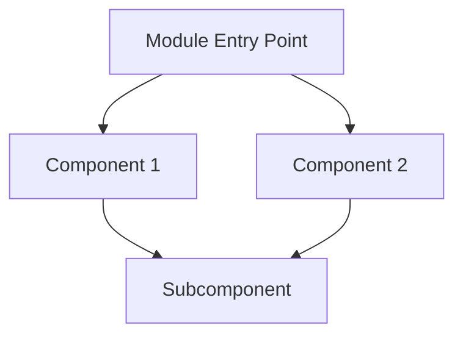
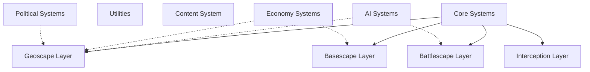
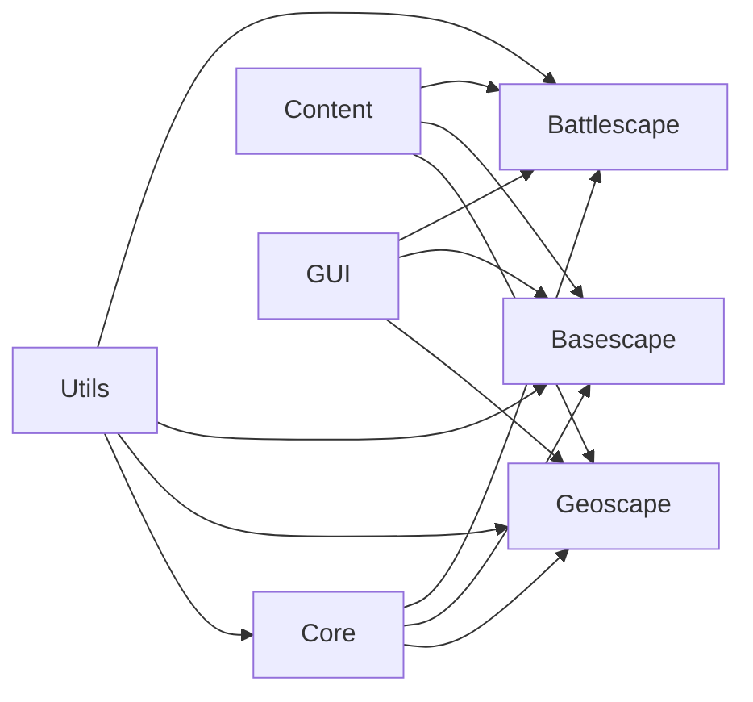
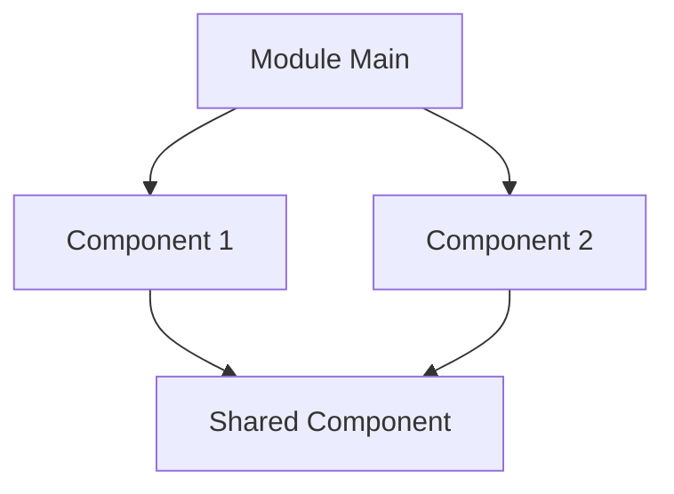
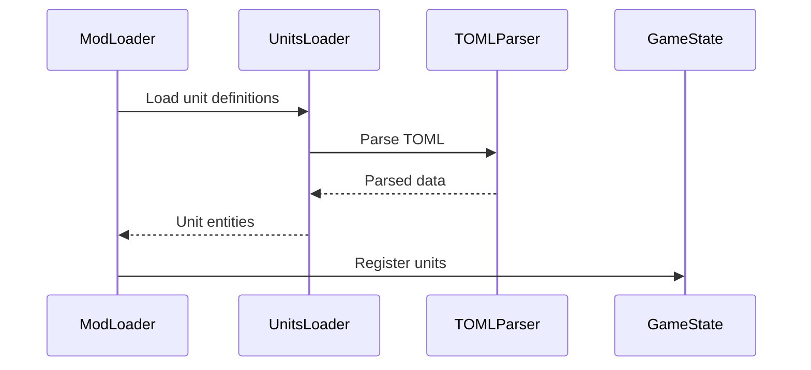
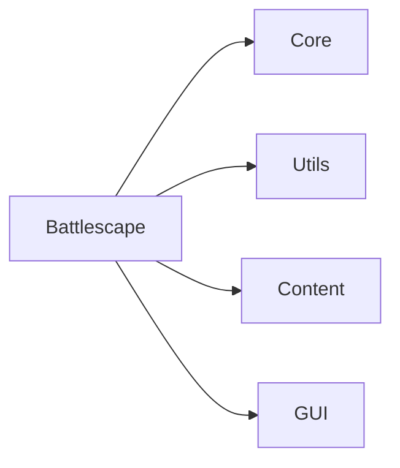

# Task: Rewrite All Engine README Files

**Status:** TODO
**Priority:** Medium
**Created:** 2025-10-24
**Completed:** N/A
**Assigned To:** AI Agent

**Dependencies:** TASK-006 (engine reorganization should be done first)

---

## Overview

Scan entire `engine/` folder recursively, find all `README.md` files, and rewrite them from scratch. Create comprehensive, clear documentation explaining each file and module's purpose, goals, features, inputs, outputs, relationships to other modules, and importance for GAME_API.

---

## Purpose

**Why this is needed:**
- Current READMEs are outdated or missing
- Many folders have no README at all
- Existing READMEs are too brief or unclear
- New developers need better guidance
- Modules lack clear documentation
- Relationships between modules unclear
- API integration points not documented
- Hard to understand codebase architecture

**What problem it solves:**
- Clear, comprehensive module documentation
- Easy onboarding for new developers
- Understanding of module purposes
- Clear API integration documentation
- Better code discoverability
- Reduced time to productivity
- Foundation for architectural decisions

---

## Requirements

### Functional Requirements
- [ ] Scan entire `engine/` folder recursively
- [ ] Find all existing README.md files
- [ ] Identify folders without READMEs
- [ ] Analyze each file in each folder
- [ ] Generate comprehensive README for each folder
- [ ] Include module purpose, goals, features
- [ ] Document inputs and outputs
- [ ] Document relationships to other modules
- [ ] Document GAME_API integration points
- [ ] Include code examples where helpful
- [ ] Include architecture diagrams (mermaid)
- [ ] Create index of all modules

### Technical Requirements
- [ ] Automated scanning tool
- [ ] Template for consistent README structure
- [ ] Mermaid diagram generation
- [ ] Cross-linking between READMEs
- [ ] Table of contents generation
- [ ] API reference generation
- [ ] Written in clear, concise English
- [ ] Markdown formatting

### Acceptance Criteria
- [ ] Every folder has a README.md
- [ ] Every README follows template
- [ ] Every README is comprehensive
- [ ] All modules are documented
- [ ] All relationships are documented
- [ ] All API integration points documented
- [ ] Diagrams included where helpful
- [ ] Examples included where helpful
- [ ] Master index exists
- [ ] Easy to navigate
- [ ] Review and approval by team

---

## Plan

### Step 1: Scan Engine Folder Structure
**Description:** Find all folders and files, identify missing READMEs

**Tool to create:** `tools/docs/scan_engine_docs.lua`

**Analysis:**
```lua
-- For each folder in engine/:
-- 1. Check if README.md exists
-- 2. If exists, assess quality (length, completeness)
-- 3. List all files in folder
-- 4. Categorize files (managers, loaders, renderers, etc.)
-- 5. Identify relationships (requires/imports)
-- 6. Identify GAME_API connections
```

**Output:** `temp/readme_audit.md`

**Format:**
```markdown
# README Audit Report

## Summary
- Total folders: 50
- Folders with README: 12
- Folders without README: 38
- Outdated READMEs: 5
- Complete READMEs: 7

## Folders Without README

### engine/battlescape/combat/
Files: 5
- damage_calculator.lua
- hit_calculator.lua
- cover_system.lua
- los_calculator.lua
- reaction_fire.lua

### engine/battlescape/movement/
Files: 3
- pathfinding.lua
- movement_system.lua
- cost_calculator.lua

... (continue for all)

## Folders With Outdated README

### engine/geoscape/
Current README: 50 words, brief overview only
Needs: Detailed documentation of systems, API integration

... (continue)

## Priority Order
1. High Priority: Core systems (core/, utils/, content/)
2. Medium Priority: Game layers (battlescape/, geoscape/, basescape/)
3. Low Priority: Supporting systems (analytics/, accessibility/)
```

**Estimated time:** 2-3 hours

---

### Step 2: Create README Template
**Description:** Standard structure for all READMEs

**File to create:** `docs/README_TEMPLATE.md`

**Template structure:**
```markdown
# [Folder Name] Module

## Overview

Brief 2-3 sentence description of what this module does and why it exists.

## Purpose

Detailed explanation of this module's role in the game engine.

## Features

- Feature 1
- Feature 2
- Feature 3

## Files

### [filename.lua]
**Purpose:** What this file does
**Key Functions:**
- `functionName(params)` - description
- `anotherFunction(params)` - description

**Dependencies:** What other modules it requires
**Used By:** What other modules use this

### [another_file.lua]
... (repeat for each file)

## Architecture



Brief explanation of how components interact.

## API Integration

### GAME_API Connections
- **Reads:** What TOML data this module loads
  - `mods/*/rules/units/*.toml` - unit definitions
  - `mods/*/rules/items/*.toml` - item definitions

- **Provides:** What API this module exposes
  - `ModuleName.function()` - description

### Example Usage

```lua
local ModuleName = require("engine/folder/module")

-- Example of how to use this module
local result = ModuleName.doSomething(params)
```

## Inputs and Outputs

### Inputs
- **Configuration:** What config files are read
- **Game Data:** What game state is accessed
- **User Input:** What input is handled

### Outputs
- **Game State Changes:** What state is modified
- **Rendering:** What is drawn to screen
- **Events:** What events are triggered

## Relationships

### Dependencies (Requires)
- `engine/core/event_system` - event handling
- `engine/utils/math` - math utilities

### Dependents (Required By)
- `engine/battlescape/main` - main battlescape entry
- `engine/battlescape/ui/battle_ui` - battle interface

### Collaborators (Interacts With)
- `engine/battlescape/movement` - movement calculations
- `engine/battlescape/units` - unit data access

## Key Concepts

### [Concept 1]
Explanation of important concept or pattern used in this module.

### [Concept 2]
Another important concept.

## Configuration

If module has configuration options:

```lua
-- In game config or mod files
config.moduleName = {
  option1 = value,
  option2 = value,
}
```

## Testing

- **Unit Tests:** `tests/unit/folder/`
- **Integration Tests:** `tests/integration/folder/`

**How to run:**
```bash
lovec tests/runners unit folder
```

## Common Issues and Solutions

### Issue 1
**Problem:** Description of problem
**Solution:** How to fix it

## Future Improvements

- Planned enhancement 1
- Planned enhancement 2
- Technical debt item

## Related Documentation

- [Link to API docs](../../api/SYSTEM.md)
- [Link to design docs](../../design/mechanics/system.md)
- [Link to architecture](../../architecture/diagrams.md)

---

*Last updated: [Date]*
*Maintainer: [Name/Role]*
```

**Estimated time:** 2-3 hours

---

### Step 3: Analyze Each Module
**Description:** Deep dive into each folder to understand content

**For each folder, gather:**

**Module Information:**
- Purpose (what does it do?)
- Features (what capabilities does it provide?)
- Entry points (main files)
- Public API (exported functions)
- Internal components (private files)

**File Information:**
- Each file's purpose
- Key functions defined
- Dependencies (requires)
- Dependents (required by)
- TOML data loaded
- Game state accessed
- Events handled/emitted

**Relationship Information:**
- What modules does this depend on?
- What modules depend on this?
- What modules does this collaborate with?
- Data flow (where does data come from/go to?)

**API Information:**
- What TOML files does it load?
- What API sections does it implement?
- What configuration does it use?

**Tool to create:** `tools/docs/analyze_module.lua`

**Usage:**
```bash
# Analyze single module
lovec tools/docs/analyze_module.lua engine/battlescape/combat

# Analyze all modules
lovec tools/docs/analyze_all_modules.lua
```

**Output:** `temp/module_analysis/[folder_name].json`

**Estimated time:** 8-12 hours (for analysis tool + running on all modules)

---

### Step 4: Generate README Drafts
**Description:** Auto-generate README drafts from analysis

**Tool to create:** `tools/docs/generate_readme_draft.lua`

**Process:**
```lua
function generateReadmeDraft(moduleAnalysis, template)
  local readme = template

  -- Fill in module info
  readme = readme:gsub("{MODULE_NAME}", moduleAnalysis.name)
  readme = readme:gsub("{OVERVIEW}", moduleAnalysis.overview)
  readme = readme:gsub("{PURPOSE}", moduleAnalysis.purpose)

  -- Generate file list
  local fileList = ""
  for _, file in ipairs(moduleAnalysis.files) do
    fileList = fileList .. generateFileSection(file)
  end
  readme = readme:gsub("{FILE_LIST}", fileList)

  -- Generate dependency list
  local deps = table.concat(moduleAnalysis.dependencies, "\n- ")
  readme = readme:gsub("{DEPENDENCIES}", deps)

  -- Generate API integration section
  local apiSection = generateAPISection(moduleAnalysis.apiConnections)
  readme = readme:gsub("{API_INTEGRATION}", apiSection)

  -- Generate mermaid diagram
  local diagram = generateArchitectureDiagram(moduleAnalysis.structure)
  readme = readme:gsub("{ARCHITECTURE_DIAGRAM}", diagram)

  return readme
end
```

**Estimated time:** 6-8 hours

---

### Step 5: Manual Enhancement
**Description:** Review and enhance generated READMEs

**Process:**
1. Review each generated README
2. Add human insights
3. Add examples
4. Clarify unclear sections
5. Add troubleshooting tips
6. Add future improvements
7. Verify accuracy

**Enhancement areas:**
- **Overview:** Make it clearer, more engaging
- **Examples:** Add real-world usage examples
- **Diagrams:** Improve or add additional diagrams
- **Relationships:** Clarify complex relationships
- **API Integration:** Add specific examples
- **Common Issues:** Document known issues
- **Future Work:** Document planned improvements

**Estimated time:** 20-30 hours (comprehensive review and enhancement)

---

### Step 6: Create Module Index
**Description:** Master index of all engine modules

**File to create:** `engine/README.md`

**Structure:**
```markdown
# Engine Module Index

## Overview

The AlienFall game engine is organized into logical layers and cross-cutting concerns.

## Architecture Overview



## Core Systems

### [core/](core/README.md)
Core engine systems: state management, event system, globals.

**Key Modules:**
- `state_manager.lua` - Game state management
- `event_system.lua` - Event bus
- `globals.lua` - Global constants

**API Integration:** None (core infrastructure)

---

### [utils/](utils/README.md)
Utility functions used across the engine.

**Key Modules:**
- `math.lua` - Math and vector operations
- `table_utils.lua` - Table manipulation
- `string_utils.lua` - String utilities

**API Integration:** None (utilities)

---

### [content/](content/README.md)
Content loading system - loads mods and TOML data.

**Key Modules:**
- `mod_loader.lua` - Mod system
- `toml_loader.lua` - TOML parser
- `units_loader.lua` - Loads unit definitions
- `items_loader.lua` - Loads item definitions

**API Integration:** Loads ALL mod TOML files

---

## Game Layers

### [geoscape/](geoscape/README.md)
Strategic layer - world map, countries, missions, UFO tracking.

**Key Features:**
- World map with countries/regions
- UFO detection and tracking
- Mission generation
- Time management
- Funding and diplomacy

**API Integration:**
- `mods/*/rules/regions/*.toml`
- `mods/*/rules/countries/*.toml`
- `mods/*/rules/missions/*.toml`

---

### [basescape/](basescape/README.md)
Base management layer - facilities, personnel, research, manufacturing.

**Key Features:**
- Base layout and facilities
- Personnel management
- Research projects
- Manufacturing
- Item storage

**API Integration:**
- `mods/*/rules/facilities/*.toml`
- `mods/*/rules/research/*.toml`
- `mods/*/rules/manufacturing/*.toml`

---

### [battlescape/](battlescape/README.md)
Tactical combat layer - turn-based combat, units, weapons.

**Key Features:**
- Turn-based tactical combat
- Unit management
- Weapon systems
- Map generation
- AI opponents

**API Integration:**
- `mods/*/rules/units/*.toml`
- `mods/*/rules/weapons/*.toml`
- `mods/*/rules/armor/*.toml`
- `mods/*/rules/tilesets/*.toml`

---

### [interception/](interception/README.md)
Air combat layer - craft interception of UFOs.

**Key Features:**
- Craft management
- Interception mechanics
- Air combat

**API Integration:**
- `mods/*/rules/crafts/*.toml`
- `mods/*/rules/weapons/*.toml` (craft weapons)

---

## Cross-Cutting Concerns

### [ai/](ai/README.md)
AI systems for tactical and strategic play.

### [economy/](economy/README.md)
Economic systems - pricing, costs, funding.

### [politics/](politics/README.md)
Political systems - factions, diplomacy, influence.

### [accessibility/](accessibility/README.md)
Accessibility features - screen readers, colorblind mode, etc.

### [analytics/](analytics/README.md)
Analytics and telemetry systems.

### [localization/](localization/README.md)
Translation and localization system.

---

## UI Systems

### [gui/](gui/README.md)
GUI framework - windows, rendering, input.

### [widgets/](widgets/README.md)
Reusable UI widgets - buttons, lists, etc.

---

## Supporting Systems

### [assets/](assets/README.md)
Asset loading and management - sprites, sounds, etc.

### [lore/](lore/README.md)
Lore and story content system.

### [tutorial/](tutorial/README.md)
Tutorial system.

---

## Module Relationships

### Dependency Graph



### Layer Communication

- **Core ↔ Layers:** Layers use core systems (events, state)
- **Content → Layers:** Content system provides data to layers
- **GUI ← Layers:** Layers use GUI to render interfaces
- **AI → Layers:** AI uses layer APIs to make decisions

---

## Quick Links

- [Architecture Documentation](../architecture/README.md)
- [API Documentation](../api/README.md)
- [Design Documentation](../design/README.md)
- [Testing Guide](../tests/README.md)

---

## How to Navigate This Documentation

1. **New to the project?** Start with [Core Systems](#core-systems)
2. **Working on gameplay?** Check [Game Layers](#game-layers)
3. **Adding a feature?** Find the relevant module, read its README
4. **Understanding data flow?** Follow the [Dependency Graph](#dependency-graph)
5. **Need API integration?** Check module's "API Integration" section

---

*This documentation is auto-generated and manually enhanced.*
*Last updated: [Date]*
```

**Estimated time:** 4-6 hours

---

### Step 7: Add Cross-References
**Description:** Link READMEs to each other and to other docs

**Links to add:**
- Module to API docs
- Module to design docs
- Module to architecture diagrams
- Module to tests
- Between related modules
- To master index

**Tool to create:** `tools/docs/add_cross_references.lua`

**Estimated time:** 2-3 hours

---

### Step 8: Generate Diagrams
**Description:** Create mermaid diagrams for each module

**Diagram types:**

**Architecture Diagrams:**


**Data Flow Diagrams:**


**Dependency Diagrams:**


**Estimated time:** 6-8 hours

---

### Step 9: Review and Refinement
**Description:** Team review of all READMEs

**Review process:**
1. Self-review each README
2. Peer review within team
3. Test with new developer (if possible)
4. Collect feedback
5. Make improvements
6. Final approval

**Review checklist per README:**
- [ ] Clear and concise
- [ ] Technically accurate
- [ ] Comprehensive coverage
- [ ] Good examples
- [ ] Helpful diagrams
- [ ] Proper cross-references
- [ ] Good formatting
- [ ] No typos/grammar errors

**Estimated time:** 8-12 hours

---

### Step 10: Create Maintenance Guide
**Description:** Document how to keep READMEs up-to-date

**File to create:** `docs/README_MAINTENANCE.md`

**Content:**
- When to update READMEs
- How to update READMEs
- README quality standards
- Review process
- Tools available

**Process:**
- Update README when adding new files
- Update README when changing module purpose
- Update README when changing APIs
- Review READMEs during PR reviews
- Quarterly README review
- Use tools to detect outdated READMEs

**Estimated time:** 2-3 hours

---

## Implementation Details

### Architecture

**Four-Phase Approach:**
1. **Analysis:** Scan and analyze all modules
2. **Generation:** Auto-generate README drafts
3. **Enhancement:** Manual improvement and examples
4. **Integration:** Cross-references, index, diagrams

**Tools:**
```
tools/docs/
├── scan_engine_docs.lua           -- Scan for READMEs
├── analyze_module.lua             -- Analyze module structure
├── analyze_all_modules.lua        -- Batch analysis
├── generate_readme_draft.lua      -- Generate drafts
├── add_cross_references.lua       -- Add links
└── validate_readme_quality.lua    -- Quality checks
```

### Key Components

**Scanner:** Finds all modules and files
**Analyzer:** Deep analysis of module structure and relationships
**Generator:** Creates README drafts from analysis
**Enhancer:** Manual review and improvement process
**Validator:** Checks README quality and completeness

### Dependencies

- Lua file system library
- Markdown parser/generator
- Mermaid diagram syntax
- Code analysis tools

---

## Testing Strategy

### Quality Checks
- [ ] Every folder has README
- [ ] Every README follows template
- [ ] All files documented
- [ ] All relationships documented
- [ ] All API connections documented
- [ ] All diagrams render correctly
- [ ] All links work
- [ ] No typos

### Validation Tool
Create `tools/docs/validate_readme_quality.lua`:
- Checks README completeness
- Validates markdown syntax
- Checks diagram syntax
- Validates links
- Checks for TODOs/placeholders

### User Testing
- Have new developer read READMEs
- Collect feedback on clarity
- Identify confusing sections
- Improve based on feedback

---

## Documentation Updates

### Files to Create
- [ ] `engine/README.md` - master index
- [ ] `engine/*/README.md` - module READMEs (50+ files)
- [ ] `docs/README_TEMPLATE.md` - template
- [ ] `docs/README_MAINTENANCE.md` - maintenance guide
- [ ] `tools/docs/*.lua` - documentation tools

### Files to Update
- [ ] `README.md` - link to engine docs
- [ ] `.github/copilot-instructions.md` - mention docs

---

## Notes

**Documentation Principles:**
1. **Clear Purpose:** Every module's purpose is obvious
2. **Comprehensive:** Cover all aspects of module
3. **Examples:** Show real usage, not just theory
4. **Relationships:** Explain how modules interact
5. **API Integration:** Document TOML connections
6. **Maintainable:** Easy to keep up-to-date
7. **Discoverable:** Easy to find what you need

**Best Practices:**
- Write for someone unfamiliar with code
- Use diagrams to explain complex concepts
- Provide examples for common use cases
- Link to related documentation
- Keep it up-to-date
- Review regularly

**Avoid:**
- Too brief (useless)
- Too detailed (overwhelming)
- Outdated information
- Missing critical information
- Poor organization
- No examples
- Broken links

---

## Blockers

**Must have:**
- [ ] TASK-006 completed (clean structure)
- [ ] Access to all engine code
- [ ] Understanding of all systems

**Potential issues:**
- Extremely time-consuming
- Requires deep understanding
- May uncover undocumented features
- May reveal unclear purposes

---

## Review Checklist

- [ ] All folders have READMEs
- [ ] All READMEs follow template
- [ ] All READMEs are comprehensive
- [ ] All files documented
- [ ] All relationships documented
- [ ] All API connections documented
- [ ] Master index complete
- [ ] All diagrams correct
- [ ] All links work
- [ ] Quality validation passes
- [ ] Team review complete
- [ ] Maintenance guide exists

---

## Success Criteria

**Task is DONE when:**
1. Every engine folder has comprehensive README
2. All READMEs follow consistent template
3. All modules well-documented
4. All relationships explained
5. All API integrations documented
6. Master index exists and is complete
7. Diagrams enhance understanding
8. Examples help comprehension
9. Quality validation passes
10. Team approves documentation

**This enables:**
- TASK-008 (architectural review easier with docs)
- Faster onboarding
- Better code understanding
- Clearer architecture
- Easier maintenance
- Better planning
- Reduced confusion
