# Task: Architectural Review and Enhanced Diagrams

**Status:** TODO
**Priority:** High
**Created:** 2025-10-24
**Completed:** N/A
**Assigned To:** AI Agent

**Dependencies:** TASK-007 (README documentation helps understand systems)

---

## Overview

Perform comprehensive architectural review comparing design docs, API documentation, engine implementation, and existing architecture diagrams. Update and enhance architecture documentation with additional diagrams covering modding flow, user experience, testing, development, automated balance systems, backend integration, logging, analytics, and metrics. Use mermaid diagrams with referenced tables for detailed content.

---

## Purpose

**Why this is needed:**
- Current architecture docs may be outdated
- Missing diagrams for many system interactions
- Need holistic view of entire system
- Integration flows unclear
- Data flows unclear
- User experience flows undocumented
- Mod creation workflow undocumented
- Testing strategy not visualized
- Development workflow not diagrammed
- Backend integration unclear
- Analytics/metrics architecture missing

**What problem it solves:**
- Complete architectural documentation
- Clear system integration understanding
- Visual representation of complex flows
- Better planning capabilities
- Easier onboarding
- Foundation for scaling
- Clear data architecture
- Documented lifecycle flows
- Complete system view

---

## Requirements

### Functional Requirements
- [ ] Review all existing architecture documentation
- [ ] Review all design documentation
- [ ] Review all API documentation
- [ ] Review all engine implementation
- [ ] Identify gaps and inconsistencies
- [ ] Create/update system integration diagrams
- [ ] Create modding workflow diagrams
- [ ] Create user experience flow diagrams
- [ ] Create testing architecture diagrams
- [ ] Create development workflow diagrams
- [ ] Create data architecture diagrams
- [ ] Create backend integration diagrams
- [ ] Create analytics/metrics architecture diagrams
- [ ] Create lifecycle diagrams (mission, combat, research, etc.)
- [ ] Use mermaid + tables format
- [ ] Cross-reference with code

### Technical Requirements
- [ ] Mermaid diagram format
- [ ] Markdown tables for detailed content
- [ ] Proper documentation structure
- [ ] Version control for diagrams
- [ ] Easy to update and maintain
- [ ] Render correctly in GitHub/VS Code
- [ ] Export to multiple formats (PNG, SVG, PDF)

### Acceptance Criteria
- [ ] All major systems diagrammed
- [ ] All integration points documented
- [ ] All data flows visualized
- [ ] All user flows documented
- [ ] All development workflows diagrammed
- [ ] Diagrams are clear and understandable
- [ ] Tables provide necessary detail
- [ ] Cross-references to code exist
- [ ] Documentation is comprehensive
- [ ] Team review and approval

---

## Plan

### Step 1: Audit Existing Architecture Documentation
**Description:** Review current state of architecture docs

**Files to review:**
- `architecture/01-game-structure.md`
- `architecture/02-procedural-generation.md`
- `architecture/03-combat-tactics.md`
- `architecture/04-base-economy.md`
- `architecture/INTEGRATION_FLOW_DIAGRAMS.md`
- `architecture/ROADMAP.md`
- `architecture/README.md`

**Analysis:**
- What is documented?
- What is outdated?
- What is missing?
- What needs enhancement?
- What diagrams exist?
- What diagrams are needed?

**Output:** `temp/architecture_audit.md`

**Format:**
```markdown
# Architecture Documentation Audit

## Existing Documentation

### 01-game-structure.md
- **Status:** Outdated (last updated: 2023)
- **Coverage:** High-level structure
- **Gaps:** Missing new systems (pilots, perks)
- **Quality:** Good but needs update

### 02-procedural-generation.md
- **Status:** Current
- **Coverage:** Map generation
- **Gaps:** Missing tileset integration
- **Quality:** Excellent

... (continue for all files)

## Missing Documentation

### System Integration
- No diagram showing how all systems connect
- No data flow between systems
- No event flow documentation

### User Flows
- No user experience flows
- No onboarding flow
- No gameplay loops documented

### Development Workflows
- No dev process documented
- No testing strategy visualized
- No CI/CD pipeline documented

... (continue)

## Recommendations

1. Update existing docs with new systems
2. Create master system integration diagram
3. Add detailed subsystem diagrams
4. Document all major user flows
5. Document development workflows
6. Add data architecture diagrams
7. Add backend integration diagrams

... (continue)
```

**Estimated time:** 4-6 hours

---

### Step 2: Cross-Reference with Design and API
**Description:** Compare architecture with design docs and API

**Process:**
1. For each design mechanic, find:
   - Architecture diagram (if exists)
   - API definition (if exists)
   - Engine implementation (if exists)

2. Identify mismatches:
   - Design describes feature not in architecture
   - API defines data not used in architecture
   - Engine implements feature not documented
   - Architecture shows system not in engine

3. Create reconciliation plan

**Output:** `temp/arch_design_api_comparison.md`

**Format:**
```markdown
# Architecture vs Design vs API Comparison

## Pilot System

### Design
- `design/mechanics/pilot_system.md`
- Describes: Pilot stats, ranks, perks, experience

### API
- `api/PILOTS.md`
- Defines: Pilot TOML structure, required fields

### Architecture
- **Missing:** No pilot system architecture diagram

### Engine
- `engine/basescape/pilots/`
- Implements: Pilot management

**Action:** Create pilot system architecture diagram

---

## Research System

### Design
- `design/mechanics/research.md`
- Describes: Tech tree, dependencies, unlocks

### API
- `api/RESEARCH_AND_MANUFACTURING.md`
- Defines: Research TOML structure

### Architecture
- `architecture/04-base-economy.md`
- Shows: Basic research flow

### Engine
- `engine/basescape/research/`
- Implements: Research system

**Status:** Documented but outdated
**Action:** Update research architecture diagram

... (continue for all systems)
```

**Estimated time:** 6-8 hours

---

### Step 3: Design Master Architecture Diagram
**Description:** Create top-level system integration diagram

**File to create:** `architecture/00-master-system-architecture.md`

**Content:**
```markdown
# Master System Architecture

## Overview

This document provides the highest-level view of the entire AlienFall game architecture, showing how all major systems integrate.

## System Layers

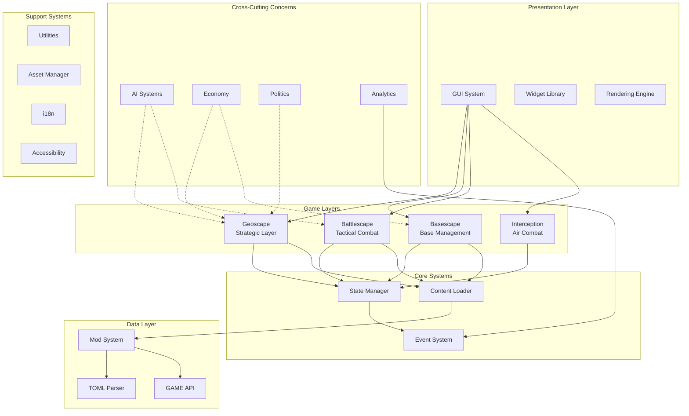

## System Communication

| Source System | Target System | Communication Method | Data Exchanged |
|--------------|---------------|---------------------|----------------|
| Geoscape | Basescape | State transition | Base selection |
| Geoscape | Battlescape | Mission launch | Mission params, squad |
| Basescape | Battlescape | Squad selection | Unit roster |
| Battlescape | Geoscape | Mission complete | Results, loot, casualties |
| Content | All Layers | Data loading | Game definitions |
| Events | All Systems | Event bus | Game events |
| AI | Geoscape | Decision making | Strategic actions |
| AI | Battlescape | Unit control | Tactical actions |

*See: [System Communication Details](#system-communication-details) for complete table*

## Data Flow

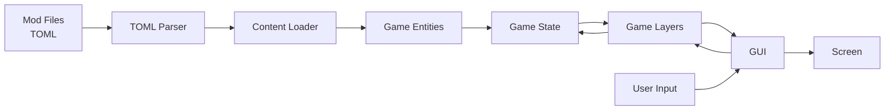

## Component Details

### Presentation Layer
See: [GUI Architecture](05-gui-architecture.md)

### Game Layers
See: [Game Layer Architecture](01-game-structure.md)

### Core Systems
See: [Core Systems Architecture](06-core-systems.md)

### Data Layer
See: [Data Architecture](07-data-architecture.md)

... (continue)
```

**Estimated time:** 8-10 hours

---

### Step 4: Create Modding Flow Diagrams
**Description:** Document complete mod creation and loading workflow

**File to create:** `architecture/08-modding-architecture.md`

**Content:**
```markdown
# Modding Architecture

## Mod Creation Workflow

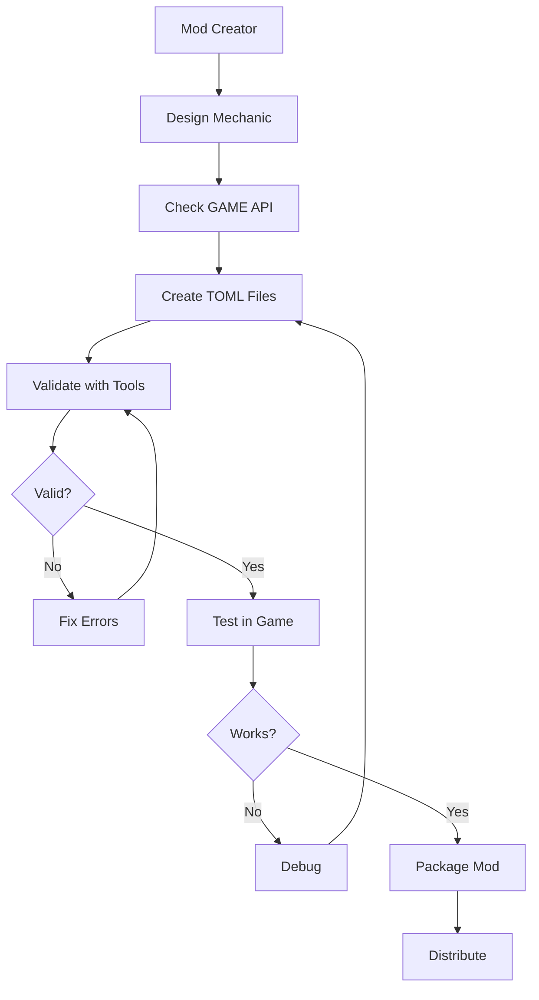

## Mod Loading Flow

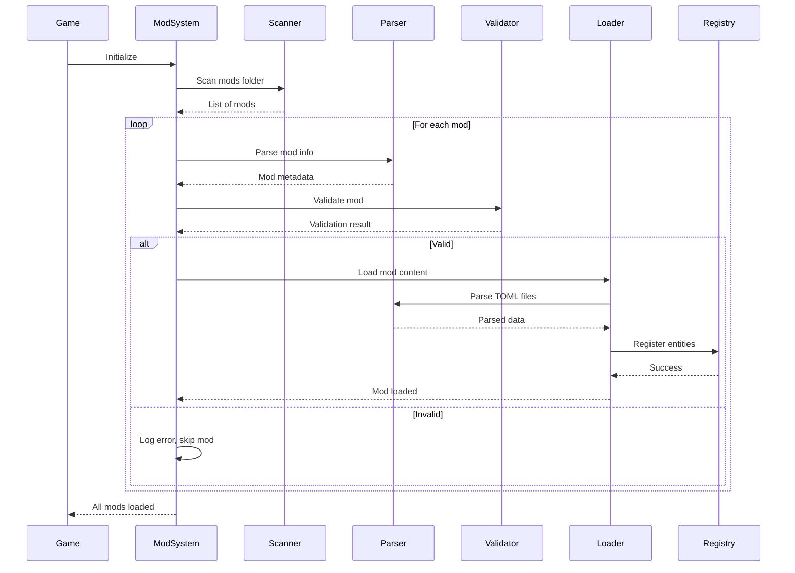

## Mod Structure

| Directory | Purpose | Content |
|-----------|---------|---------|
| `mods/mod_name/` | Mod root | All mod files |
| `mods/mod_name/mod.toml` | Mod metadata | Name, version, author, dependencies |
| `mods/mod_name/rules/` | Game data | TOML definitions |
| `mods/mod_name/rules/units/` | Unit definitions | soldier.toml, alien.toml, etc. |
| `mods/mod_name/rules/items/` | Item definitions | weapons, armor, equipment |
| `mods/mod_name/rules/research/` | Research projects | Tech tree definitions |
| `mods/mod_name/assets/` | Asset files | sprites, sounds, music |
| `mods/mod_name/assets/sprites/` | Sprite files | PNG images |
| `mods/mod_name/assets/sounds/` | Audio files | OGG, WAV files |

## Mod Validation Pipeline

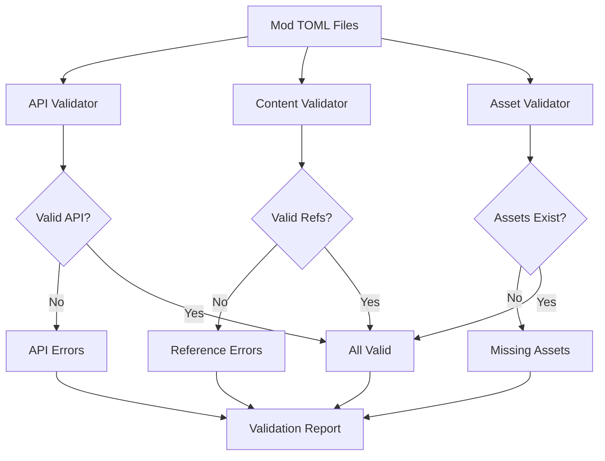

## Mod Loading Priority

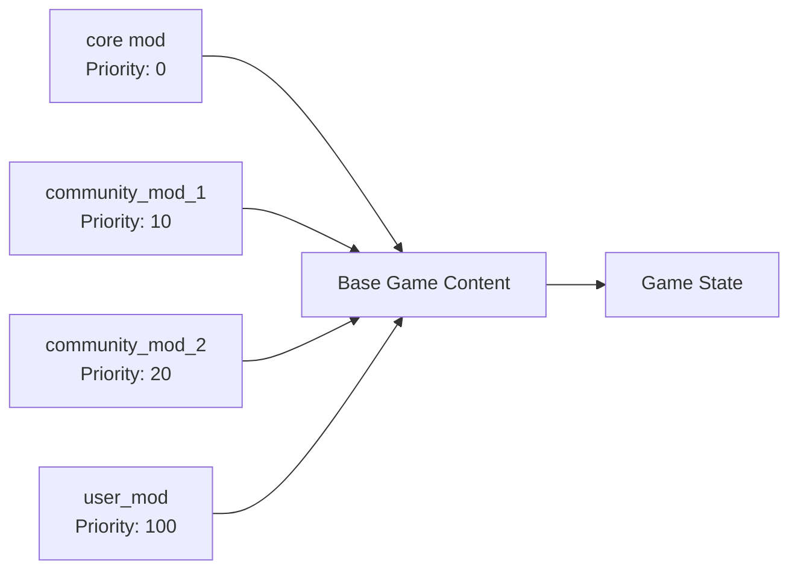

*Higher priority mods can override lower priority mods*

## Mod Conflict Resolution

| Scenario | Resolution | Example |
|----------|-----------|---------|
| Same entity ID | Higher priority wins | user_mod overrides core |
| Partial override | Merge definitions | Only changed fields overridden |
| Asset conflict | Higher priority wins | user_mod sprite used |
| Incompatible mods | Load order matters | First loaded wins |

... (continue with more modding details)
```

**Estimated time:** 6-8 hours

---

### Step 5: Create User Experience Flow Diagrams
**Description:** Document player journey through game

**File to create:** `architecture/09-user-experience-flows.md`

**Content:**
```markdown
# User Experience Flows

## New Game Flow

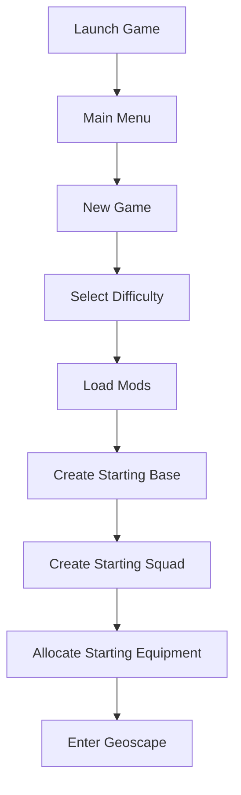

## Core Gameplay Loop

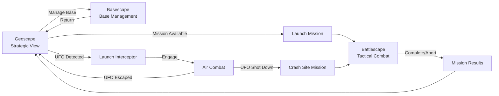

## Mission Lifecycle

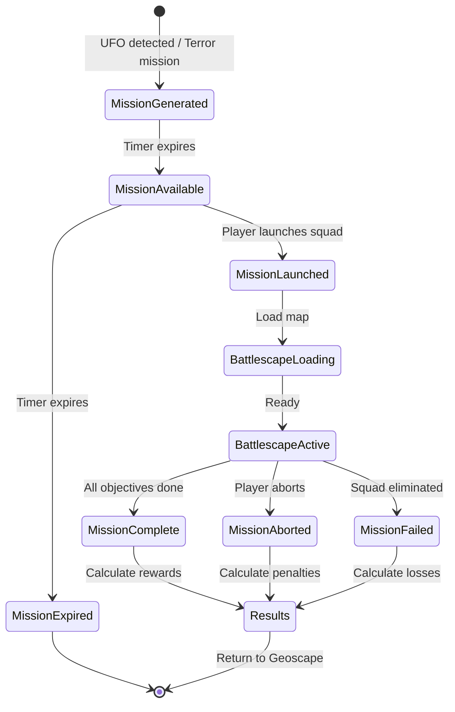

## Research Workflow

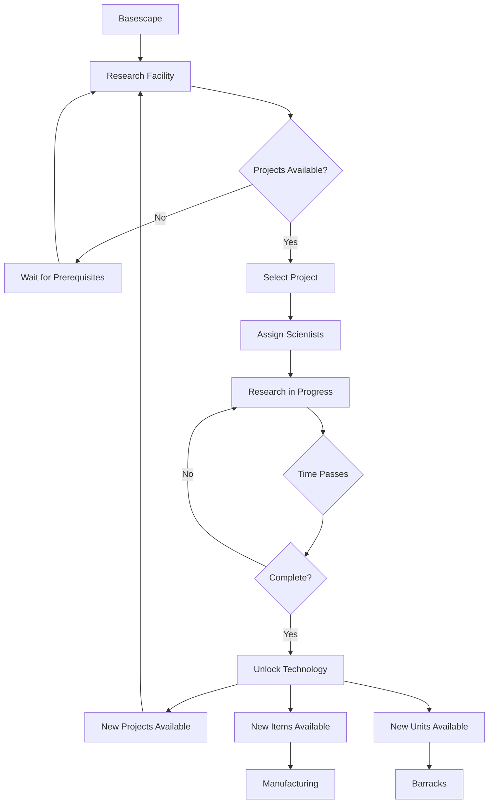

## Manufacturing Workflow

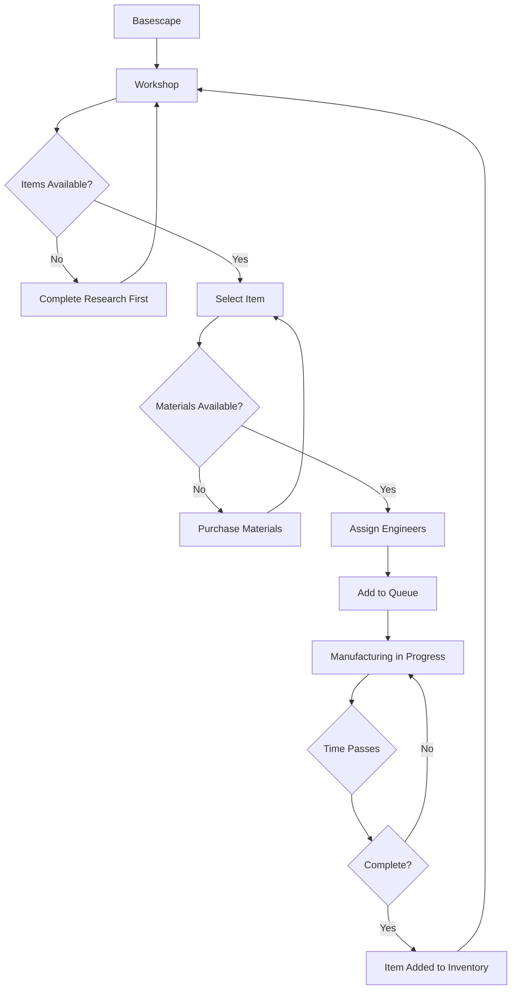

## Player Journey Stages

| Stage | Duration | Goals | Activities | Success Metrics |
|-------|----------|-------|------------|----------------|
| Early Game | Month 1-2 | Establish base, first missions | Basic missions, early research | Survive, complete missions |
| Mid Game | Month 3-6 | Expand capabilities | Advanced tech, larger squad | Tech progression, base expansion |
| Late Game | Month 7-12 | Counter alien threat | Final missions, best equipment | Campaign completion |

*See: [Player Progression](../design/mechanics/progression.md) for details*

... (continue with more UX flows)
```

**Estimated time:** 6-8 hours

---

### Step 6: Create Testing Architecture Diagrams
**Description:** Document testing strategy and infrastructure

**File to create:** `architecture/10-testing-architecture.md`

**Content:**
```markdown
# Testing Architecture

## Testing Pyramid

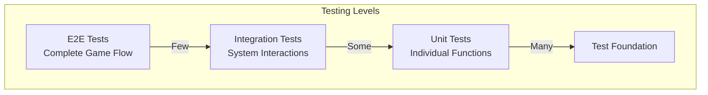

## Test Organization

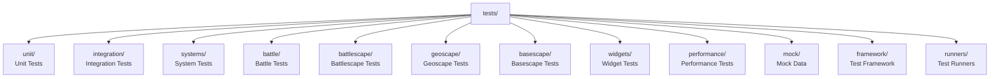

## Test Execution Flow

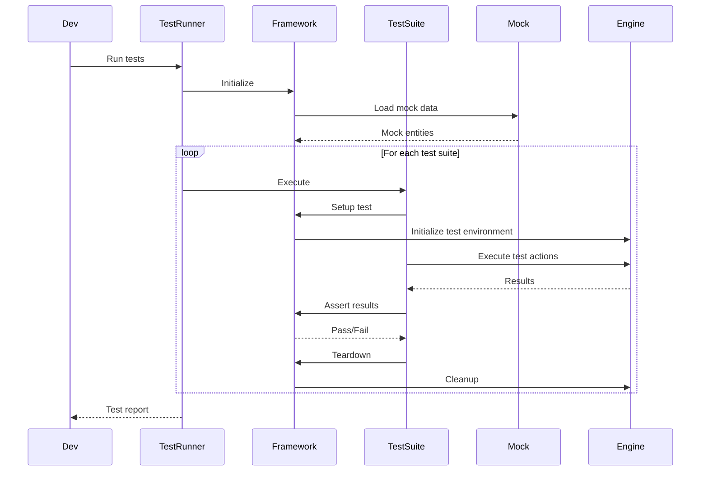

## CI/CD Testing Pipeline

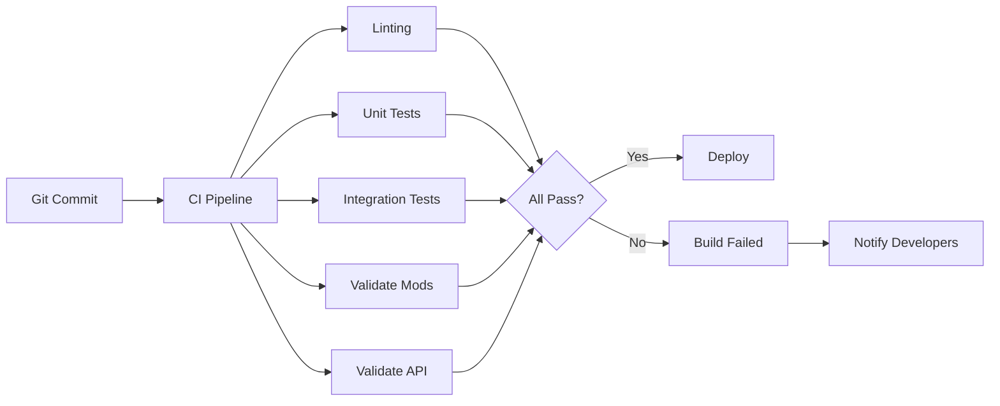

## Mock Data Architecture

| Mock Type | Location | Purpose | Usage |
|-----------|----------|---------|-------|
| Mock Units | `tests/mock/units/` | Test unit system | Unit tests, battle tests |
| Mock Items | `tests/mock/items/` | Test item system | Inventory tests, equipment tests |
| Mock Missions | `tests/mock/missions/` | Test mission system | Mission generation tests |
| Mock Maps | `tests/mock/maps/` | Test map system | Battlescape tests |
| Synthetic Mod | `mods/synth_mod/` | Complete API coverage | Integration tests, validation |

## Performance Testing

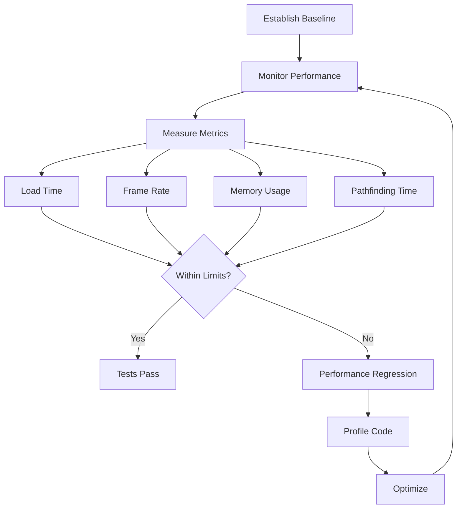

... (continue with more testing architecture)
```

**Estimated time:** 6-8 hours

---

### Step 7: Create Development Workflow Diagrams
**Description:** Document development processes

**File to create:** `architecture/11-development-workflows.md`

**Content:**
```markdown
# Development Workflows

## Feature Development Flow

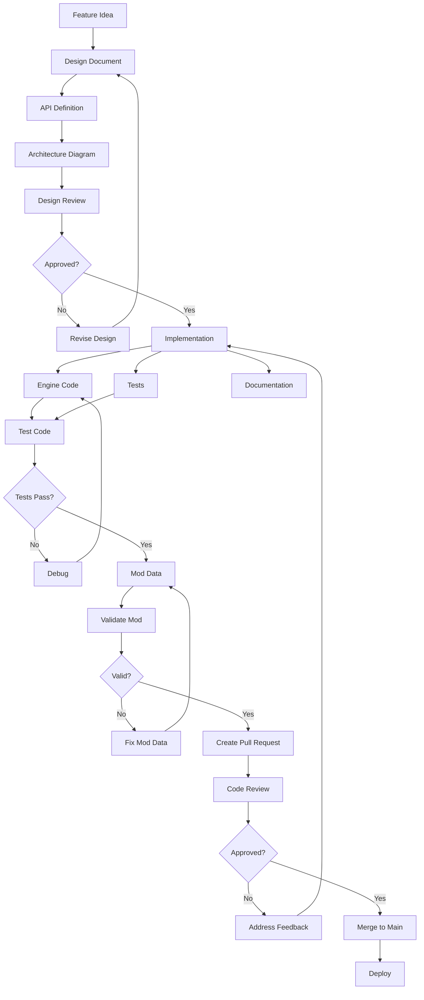

## Git Workflow

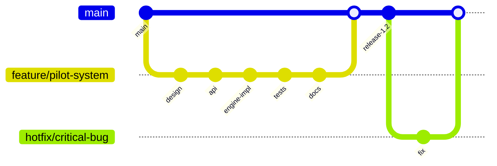

## Code Review Process

| Step | Reviewer Checks | Outcome |
|------|----------------|---------|
| 1. Automated Checks | Linting, tests, build | Must pass to proceed |
| 2. Design Review | Follows architecture, good patterns | Approve / Request changes |
| 3. Code Quality | Readability, comments, no globals | Approve / Request changes |
| 4. Test Coverage | Tests exist and cover changes | Approve / Request changes |
| 5. Documentation | Docs updated, READMEs current | Approve / Request changes |
| 6. Final Approval | All concerns addressed | Merge |

## Release Workflow

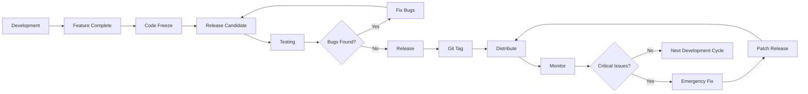

... (continue)
```

**Estimated time:** 5-6 hours

---

### Step 8: Create Data Architecture Diagrams
**Description:** Document data flows and persistence

**File to create:** `architecture/07-data-architecture.md`

**Content:**
```markdown
# Data Architecture

## Data Layer Overview

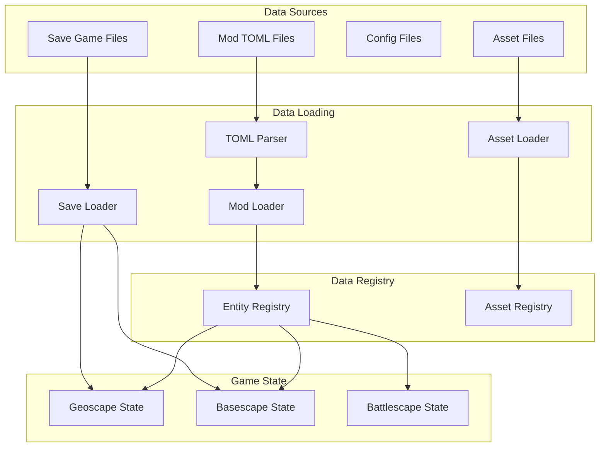

## Entity Data Flow

```mermaid
sequenceDiagram
    participant ModFile as units/soldier.toml
    participant Parser as TOML Parser
    participant Loader as Units Loader
    participant Registry as Entity Registry
    participant Game as Game State

    ModFile->>Parser: Read file
    Parser->>Parser: Parse TOML
    Parser-->>Loader: Parsed data

    Loader->>Loader: Validate structure
    Loader->>Loader: Create entity
    Loader->>Registry: Register entity
    Registry-->>Loader: Success

    Note over Registry: Entity available to game

    Game->>Registry: Get entity("soldier")
    Registry-->>Game: Entity data
```

## Save/Load Architecture

| Component | Responsibility | Format |
|-----------|---------------|--------|
| Save Manager | Orchestrate save/load | - |
| State Serializer | Convert state to saveable format | JSON/TOML |
| File Writer | Write to disk | Binary/Text |
| File Reader | Read from disk | Binary/Text |
| State Deserializer | Convert saved data to state | Lua tables |
| Validator | Verify save integrity | Checksums |

... (continue)
```

**Estimated time:** 5-6 hours

---

### Step 9: Create Backend Integration Diagrams
**Description:** Document backend/analytics architecture

**File to create:** `architecture/12-backend-integration.md`

**Content:**
```markdown
# Backend Integration Architecture

## Analytics Data Flow

```mermaid
flowchart TD
    Game[Game Client] --> Events[Event Collector]
    Events --> Buffer[Local Buffer]

    Buffer --> Batch{Batch Full?}
    Batch -->|No| Wait[Wait]
    Wait --> Buffer

    Batch -->|Yes| Send[Send to Backend]
    Send --> API[Analytics API]

    API --> Process[Process Events]
    Process --> Store[Data Store]

    Store --> Analytics[Analytics Engine]
    Analytics --> Dashboard[Dashboard]
    Analytics --> Balance[Balance Analysis]
    Analytics --> ML[ML Models]

    ML --> Recommendations[Game Balance Recommendations]
```

## Metrics Collection

| Metric Category | Examples | Purpose |
|----------------|----------|---------|
| Player Actions | Mission launches, research started | Behavior analysis |
| Performance | Frame rate, load times | Technical monitoring |
| Balance | Win rates, unit usage | Game balance |
| Progression | Research completion, tech unlocks | Difficulty tuning |
| Engagement | Session length, feature usage | Retention analysis |

## Automated Balance System

```mermaid
flowchart LR
    Logs[Game Play Logs] --> Collector[Log Collector]
    Collector --> Aggregator[Data Aggregator]

    Aggregator --> Analyzer[Balance Analyzer]
    Analyzer --> Detect[Detect Imbalance]

    Detect --> OP{Overpowered?}
    Detect --> UP{Underpowered?}

    OP -->|Yes| ReportOP[Report OP Items/Units]
    UP -->|Yes| ReportUP[Report UP Items/Units]

    ReportOP --> Review[Designer Review]
    ReportUP --> Review

    Review --> Adjust[Adjust Values]
    Adjust --> Test[Test Changes]
    Test --> Deploy[Deploy Balance Patch]
```

... (continue)
```

**Estimated time:** 4-5 hours

---

### Step 10: Create Lifecycle Diagrams
**Description:** Document major game object lifecycles

**File to create:** `architecture/13-lifecycle-diagrams.md`

**Content:**
```markdown
# Game Object Lifecycles

## Unit Lifecycle

```mermaid
stateDiagram-v2
    [*] --> Created: Recruit / Generate
    Created --> Ready: Training complete
    Ready --> Deployed: Assigned to mission
    Deployed --> InCombat: Mission start
    InCombat --> Wounded: Takes damage
    InCombat --> KIA: Dies in combat
    InCombat --> MissionComplete: Survives mission
    Wounded --> InCombat: Continues fighting
    MissionComplete --> Ready: Returns to base
    Wounded --> Recovery: Returns wounded
    Recovery --> Ready: Heals
    Recovery --> Died: Dies from wounds
    KIA --> [*]
    Died --> [*]
    Ready --> Dismissed: Player dismisses
    Dismissed --> [*]
```

## Mission Lifecycle

```mermaid
stateDiagram-v2
    [*] --> Generated: UFO/Terror event
    Generated --> Available: Countdown complete
    Available --> Expired: Time runs out
    Available --> Launched: Player launches
    Expired --> [*]

    Launched --> Loading: Load map
    Loading --> Active: Battlescape ready
    Active --> PlayerTurn: Player turn
    Active --> AlienTurn: Alien turn

    PlayerTurn --> Active: Turn end
    AlienTurn --> Active: Turn end

    Active --> Victory: Objectives complete
    Active --> Defeat: Squad eliminated
    Active --> Abort: Player aborts

    Victory --> Results: Calculate rewards
    Defeat --> Results: Calculate losses
    Abort --> Results: Calculate penalties

    Results --> [*]: Return to geoscape
```

## Research Project Lifecycle

```mermaid
stateDiagram-v2
    [*] --> Locked: Prerequisites not met
    Locked --> Available: Prerequisites complete
    Available --> InProgress: Scientists assigned
    InProgress --> Paused: Scientists reassigned
    Paused --> InProgress: Scientists assigned again
    InProgress --> Complete: Research done
    Complete --> Unlocked: Tech unlocked
    Unlocked --> [*]
```

... (continue with more lifecycles)
```

**Estimated time:** 4-5 hours

---

### Step 11: Consolidate and Review
**Description:** Review all diagrams, ensure consistency

**Process:**
1. Review all created/updated diagrams
2. Check cross-references
3. Ensure consistent terminology
4. Verify mermaid syntax
5. Test rendering
6. Get team feedback
7. Revise based on feedback

**Estimated time:** 6-8 hours

---

### Step 12: Create Architecture Index
**Description:** Master index of all architecture docs

**File to update:** `architecture/README.md`

**Content:**
```markdown
# Architecture Documentation Index

## Overview Documents

1. [Master System Architecture](00-master-system-architecture.md)
   - Highest-level system view
   - All major systems and their relationships

2. [Game Structure](01-game-structure.md)
   - Game layer architecture
   - State management

3. [Data Architecture](07-data-architecture.md)
   - Data flows and persistence
   - Save/load system

## System-Specific Architecture

4. [Procedural Generation](02-procedural-generation.md)
5. [Combat Tactics](03-combat-tactics.md)
6. [Base Economy](04-base-economy.md)
7. [GUI Architecture](05-gui-architecture.md)
8. [Core Systems](06-core-systems.md)

## Workflow and Process Architecture

9. [Modding Architecture](08-modding-architecture.md)
10. [User Experience Flows](09-user-experience-flows.md)
11. [Testing Architecture](10-testing-architecture.md)
12. [Development Workflows](11-development-workflows.md)

## Integration Architecture

13. [Backend Integration](12-backend-integration.md)
14. [Lifecycle Diagrams](13-lifecycle-diagrams.md)
15. [Integration Flow Diagrams](INTEGRATION_FLOW_DIAGRAMS.md)

## Planning Documents

16. [Roadmap](ROADMAP.md)

... (continue)
```

**Estimated time:** 2-3 hours

---

## Implementation Details

### Architecture

**Documentation Structure:**
```
architecture/
├── README.md (index)
├── 00-master-system-architecture.md
├── 01-game-structure.md (update)
├── 02-procedural-generation.md (update)
├── 03-combat-tactics.md (update)
├── 04-base-economy.md (update)
├── 05-gui-architecture.md (new)
├── 06-core-systems.md (new)
├── 07-data-architecture.md (new)
├── 08-modding-architecture.md (new)
├── 09-user-experience-flows.md (new)
├── 10-testing-architecture.md (new)
├── 11-development-workflows.md (new)
├── 12-backend-integration.md (new)
├── 13-lifecycle-diagrams.md (new)
├── INTEGRATION_FLOW_DIAGRAMS.md (update)
└── ROADMAP.md (update)
```

### Diagram + Table Pattern

**Pattern:**
```markdown
## System Component

```mermaid
graph TD
    A[Component A] --> B[Component B]
    B --> C[Component C]
```

### Component Details

| Component | Responsibility | API | Notes |
|-----------|---------------|-----|-------|
| Component A | Does X | `api.x()` | See engine/x/ |
| Component B | Does Y | `api.y()` | See engine/y/ |
| Component C | Does Z | `api.z()` | See engine/z/ |

*Diagram shows flow, table provides details*
```

### Dependencies

- Mermaid diagram renderer
- Markdown editor with preview
- Understanding of entire codebase
- Design and API documentation

---

## Testing Strategy

### Diagram Validation
- [ ] All mermaid syntax correct
- [ ] All diagrams render properly
- [ ] All cross-references work
- [ ] No broken links

### Content Review
- [ ] Technically accurate
- [ ] Complete coverage
- [ ] Clear and understandable
- [ ] Consistent terminology

### Usability Testing
- [ ] New developer can navigate
- [ ] Diagrams aid understanding
- [ ] Questions are answered

---

## Documentation Updates

### Files to Create
- [ ] `architecture/00-master-system-architecture.md`
- [ ] `architecture/05-gui-architecture.md`
- [ ] `architecture/06-core-systems.md`
- [ ] `architecture/07-data-architecture.md`
- [ ] `architecture/08-modding-architecture.md`
- [ ] `architecture/09-user-experience-flows.md`
- [ ] `architecture/10-testing-architecture.md`
- [ ] `architecture/11-development-workflows.md`
- [ ] `architecture/12-backend-integration.md`
- [ ] `architecture/13-lifecycle-diagrams.md`

### Files to Update
- [ ] `architecture/README.md` - complete rewrite
- [ ] `architecture/01-game-structure.md` - update
- [ ] `architecture/02-procedural-generation.md` - update
- [ ] `architecture/03-combat-tactics.md` - update
- [ ] `architecture/04-base-economy.md` - update
- [ ] `architecture/INTEGRATION_FLOW_DIAGRAMS.md` - update
- [ ] `architecture/ROADMAP.md` - update

---

## Notes

**Documentation Philosophy:**
- Diagrams for overview
- Tables for details
- Cross-references for navigation
- Examples for clarity

**Key Principles:**
1. **Visual First** - Diagrams tell the story
2. **Detail in Tables** - Tables provide specifics
3. **Layered Information** - High-level to detailed
4. **Connected** - Everything links together
5. **Maintainable** - Easy to update

---

## Blockers

**Must have:**
- [ ] TASK-007 completed (helps understand systems)
- [ ] Access to all documentation
- [ ] Deep understanding of architecture

**Potential issues:**
- Extremely comprehensive task
- Requires holistic understanding
- Time-consuming
- May reveal architectural issues

---

## Review Checklist

- [ ] All systems diagrammed
- [ ] All flows documented
- [ ] All integrations shown
- [ ] All lifecycles documented
- [ ] Diagrams render correctly
- [ ] Tables are complete
- [ ] Cross-references work
- [ ] Index is comprehensive
- [ ] Team review complete
- [ ] Technically accurate

---

## Success Criteria

**Task is DONE when:**
1. Complete architectural documentation exists
2. All major systems diagrammed
3. All integrations documented
4. All workflows visualized
5. Diagrams + tables format used
6. Cross-references complete
7. Master index exists
8. Team approves documentation
9. New developers can navigate
10. Foundation for future planning

**This enables:**
- Better architectural decisions
- Easier planning
- Clearer communication
- Better onboarding
- Scaling foundation
