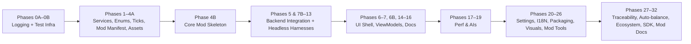
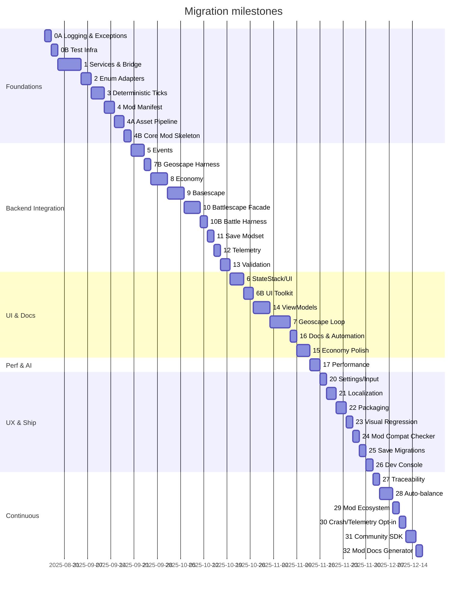
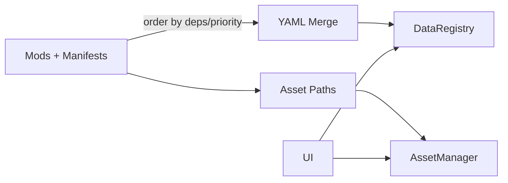
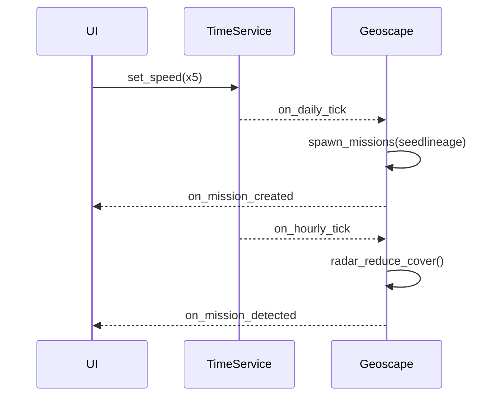
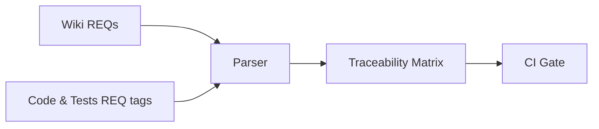
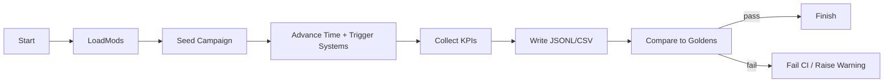

# AlienFall — Implementation Plan to Migrate to the New Architecture (v1)

This plan describes how to implement the new technical architecture (`wiki/architecture.md`) while reusing and adapting the existing codebase implemented under `src/`, aligned with the functional design across the wiki (`wiki/wiki.md` and its subpages).

It is written as a structured, actionable set of phases and task cards that an AI coding agent can execute step by step. Each task card includes an agent‑ready prompt, success criteria, and quality gates. The plan assumes Python 3.11+, PySide6 UI, YAML‑first data, and Windows development.

## Executive summary

- Strategy: Add a thin “Bridge Layer” that adapts legacy engine/services (`TGame`, `TMod`, `TModLoader`, managers) to the new architecture’s service interfaces. Migrate incrementally subsystem‑by‑subsystem behind those interfaces.
- Priorities: Determinism (RNG + Time), EventBus, DataRegistry backed by current `TMod`, ServiceRegistry, StateStack, and ViewModels; then rewire existing systems (Economy, Basescape, Battlescape) via the EventBus.
- Guardrails: Tests first where feasible, minimal invasive edits, adapters over rewrites, continuous docs updates, and seed provenance logging for reproducibility.

### Why this ordering matters
- Services first: Establish the backbone for determinism and decoupling so every later change sits behind stable contracts.
- Adapters over rewrites: Preserve working behavior while shifting to the new architecture; reduce risk and diff churn.
- UI later: Prevents fighting UI and domain changes at the same time; ViewModels let us migrate screens gradually.

### Roadmap diagrams

Overall migration flow (grouped)

Expanded roadmap (including new phases)

```mermaid
flowchart TB
  subgraph Foundations
    Z0A[0A Logging/Exceptions]
    Z0B[0B Test Infra]
    A1[1 Services/Bridge]
    A2[2 Enum Adapters]
    A3[3 Deterministic Ticks]
    A4[4 Mod Manifest]
    A4A[4A Asset Pipeline]
  end
  subgraph Content
    A4B[4B Core Mod Skeleton]
  end
  subgraph Backend Integration
    B5[5 Events Across Subsystems]
    B7B[7B Geoscape Headless Harness]
    B8[8 Economy Integration]
    B9[9 Basescape Progression]
    C10[10 Battlescape Facade]
    C10B[10B Battle Headless Harness]
    D11[11 Save Modset Validation]
    D12[12 Telemetry]
    D13[13 Data Validation]
  end
  subgraph UI & Docs
    B6[6 StateStack]
    B6B[6B UI Toolkit/Theme]
    D14[14 ViewModels]
    B7[7 Geoscape Time/Report UI]
    D16[16 Docs & Automation]
    D15[15 Economy Polish]
  end
  subgraph Perf & AI
    D17[17 Performance]
    E18[18 Interception AI]
    E19[19 Battlescape AI]
  end
  subgraph UX & Ship
    E20[20 Settings/Input]
    E21[21 Localization]
    E22[22 Packaging]
    E23[23 Visual Regression]
    E24[24 Mod Compat Checker]
    E25[25 Save Migrations]
    E26[26 Dev Console]
  end
  subgraph Continuous
    F27[27 Wiki Traceability]
    F28[28 Auto-balance Simulation]
    F29[29 Mod Ecosystem]
    F30[30 Crash/Telemetry Opt-in]
    F31[31 Community SDK/Docs]
    F32[32 Mod Docs Generator]
  end

  Z0A --> Z0B --> A1 --> A2 --> A3 --> A4 --> A4A --> A4B --> B5 --> B7B --> B8 --> B9 --> C10 --> C10B --> D11 --> D12 --> D13 --> B6 --> B6B --> D14 --> B7 --> D16 --> D15 --> D17 --> E18 --> E19 --> E20 --> E21 --> E22 --> E23 --> E24 --> E25 --> E26 --> F27 --> F28 --> F29 --> F30 --> F31 --> F32
```

Phase dependencies (indicative Gantt)

### Why this ordering matters
- Services first: Establish the backbone for determinism and decoupling so every later change sits behind stable contracts.
- Adapters over rewrites: Preserve working behavior while shifting to the new architecture; reduce risk and diff churn.
- UI later: Prevents fighting UI and domain changes at the same time; ViewModels let us migrate screens gradually.

## Legacy anchors (SRC pointers)

This plan is self-contained. When it references the legacy code, use these concrete files in `src/` instead of any old architecture document:
- Game orchestration and ticks: `src/engine/game.py` — singleton via `__new__`; daily/monthly hooks; `get_base_summary()` uses string heuristics today.
- Mod loader and YAML merge: `src/engine/modloader.py` — loads `mods/<mod>/rules/` and performs shallow `dict.update()` merges; logs missing folders.
- Mod object registries and engine-local enums: `src/engine/mod.py` — defines `TItemCategory`/`TUnitCategory`; tileset/terrain references.
- Enums used elsewhere: `src/enums.py` — global enums duplicated vs engine-local ones; target for adapter mapping.
- Economy: purchases and transfers integration: `src/economy/purchase.py`, `src/economy/purchase_manager.py` — daily processing and transfer scheduling hooks.
- Save/Load: `src/engine/savegame.py` — save system to be wrapped by SaveManager.
- UI entry point: `src/main.py` — place for Qt exception bridge and future StateStack bootstrap.

## Conventions and guardrails

- Branch naming: feature/<short-scope> (e.g., feature/services-registry)
- Commits: Conventional Commits style (feat:, fix:, refactor:, test:, docs:, chore:)
- Coding standards: Follow `.github/instructions/instructions.instructions.md`
- Tests: pytest; keep fast unit/integration tests per subsystem
- Types: add type hints gradually; prefer mypy-compatible hints, but don’t block merges for partial typing
- Lint: ruff/flake8 style; keep changes minimal and scoped to the task
- Docs: update wiki and inline docstrings alongside code edits
- Requirements traceability: Tag wiki requirements as REQ-IDs and reference them in code/tests via comments (e.g., `# REQ-GEO-001`). Generate and check a traceability matrix in CI.

### Logging and exception policy
- Logging: Use Python `logging` with module-level loggers and a shared config.
  - Levels: DEBUG (dev only), INFO (gameplay flow), WARNING (recoverable issues), ERROR (operation failed but app continues), CRITICAL (app-wide failure).
  - Handlers: Console (dev) + Rotating file handler to `logs/game.log` (keep 5 × 5MB), optional JSON lines file `logs/events.jsonl` for structured events.
  - Format: `%(asctime)s %(levelname)s %(name)s: %(message)s` and a JSON formatter for structured logs (event, payload keys).
  - Categories: services.*, engine.*, ui.*, content.*, mods.* for targeted filtering.
- Exceptions: Wrap subsystem entry points; isolate handler failures on EventBus.
  - Global hooks: `sys.excepthook` and Qt exception bridge to log CRITICAL and show a safe dialog in dev builds.
  - Never swallow exceptions silently; either re-raise after logging or publish a failure event.
  - Tests should assert that expected exceptions are raised, and the log contains the diagnostic.

### Test-driven development (TDD) strategy
- Red/Green/Refactor for every task: write a failing test against the contract first.
- Determinism: all tests that touch time or randomness must use TimeService and RNGService fixtures.
- Property tests for invariants when suitable (merge idempotence, LOS symmetry, AP conservation).
- Golden snapshot tests for deterministic outputs (map topology, monthly report); store under `tests/_golden/` and update via env flag.
- Benchmarks inform performance but don’t fail CI until perf budgets are set.

## Key cross-cutting contracts (target)

- ServiceRegistry: look up shared services by name
- EventBus: publish/subscribe with deterministic ordering
- RNGService: per-scope seeded generators + provenance logs
- TimeService: ticks and cron (daily/monthly) scheduling
- DataRegistry: typed read‑only views over current `TMod` collections
- AssetManager: logical key → image/sound with mod‑path search order
- SaveManager: wrap existing `TSaveGame`, including modset validation
- StateStack: UI mode transitions, one active state owns rendering
- ViewModel + Qt Models: UI adapters with no domain logic

---

## Design patterns and class mapping (precise guidance)

Why: Consistent patterns reduce coupling, improve testability, and align legacy reuse with the new architecture.

- Service Locator (lightweight) → `ServiceRegistry`
  - Class: ServiceRegistry (register/get). Used by all services to look up peers. Keep usage at composition boundaries.
- Publisher/Subscriber → `EventBus`
  - Class: EventBus (subscribe/once/publish). Emitted by subsystems; observed by UI/ViewModels and Telemetry.
- Strategy → AI policies, RNG policies, Merge policies
  - Classes: InterceptionPolicy, BattleAIPolicy, MergePolicy; injectable into controllers/services.
- State pattern → App StateStack & game mode states
  - Classes: MainMenuState, GeoscapeState, BasescapeState, DogfightState, BattlescapeState, DebriefingState, UfopaediaState.
- Facade → Domain services over legacy subsystems
  - Classes: BattleService, MarketService, ResearchService, ManufacturingService, SaveManager.
- Adapter → Bridge to legacy classes
  - Classes: TGameAdapter, EnumAdapter (mappers), DataRegistryAdapter (backed by TMod), AssetPathAdapter.
- Factory → Deterministic object creation
  - Classes: UnitFactory, ItemFactory, FacilityFactory, MissionFactory; derive seeds from RNGService via context.
- Repository (read‑only) → DataRegistry
  - Class: DataRegistry (get/list/resolve_ref). Single source of truth for templates and catalogs.
- Command (optional) → UI actions and undoable operations
  - Classes: PlaceFacilityCommand, PurchaseCommand, AssignResearchCommand. Commands publish events and can be queued if needed.
- Observer (Qt) → ViewModels observing EventBus
  - Classes: ItemListModel, MissionListModel, FacilityListModel; refresh on events from EventBus.
- Template Method (generation) → Map generator pipeline
  - Classes: BattleGeneratorBase with hook methods for select_terrain/validate/emit_map; concrete TBattleGenerator adapts legacy.
- Null Object (safe stubs)
  - Classes: NullAudioPlayer, NullSaveManager used in tests/headless harness.

## Target engine file structure (one class per file)

Goal: Single class per file for clarity and test isolation. Below is the proposed end state (high level).
- Verify `requirements.txt` covers PySide6, pyyaml, pillow, pytmx; defer additions if not present.
- Confirm tests run in CI or locally with pytest. If missing, add a minimal `tests/smoke/test_imports.py` smoke test in a later phase.

2) Shared developer docs
- Add or update a short `README.md` section: “How to run tests” and “How to run engine test main” referencing existing VS Code task.

Note: This phase is documentation‑only unless gaps are found. Implement as part of the first code PR touching services.

## Phase 0A — Logging & exception handling foundation

Outcome: Central logging configured early with rotating files, structured JSON option, and robust exception handling across services/UI/EventBus.

Deliverables:
- `src/engine/services/logging_config.py` — `configure_logging(env: str)` to set handlers/formatters/levels
- `src/engine/services/errors.py` — exception taxonomy (e.g., DataError, AssetError, ModLoadError) and helpers
- EventBus wraps subscribers; logs exceptions with context and continues
- Qt exception bridge: logs CRITICAL, shows dev dialog; headless mode logs only
- Configurable log level via env var `ALIENFALL_LOG_LEVEL` and CLI flag `--log-level`

Agent Task Card: Add logging and exception policy
- Objective: Provide consistent logging across engine and safe exception isolation.
- Steps:
  1. Implement `configure_logging()` with console + rotating file handlers; JSON lines optional.
  2. Add `errors.py` with domain exceptions; replace generic `Exception` in hot paths when easy.
  3. Update EventBus to wrap handlers: try/except, log exception with event name and subscriber metadata.
  4. Add a minimal Qt exception hook in UI initialization path (guard if PySide6 not installed).
  5. Tests: simulate a handler raising; assert EventBus continues and log contains the error.
- Quality gates: Logs written to `logs/`; failing handlers don’t crash the bus; tests pass.
- AI prompt tips: Include file paths, desired handlers/levels, and acceptance test (log file created, contains line with ERROR and event name). Ask the agent to avoid changing unrelated code and to keep EventBus API stable.

References
- wiki/architecture.md § Core services, determinism/logging
- Legacy anchors: `src/engine/game.py`, `src/engine/mod.py`, `src/engine/modloader.py`, Qt hook in `src/main.py`
- wiki/wiki.md § Project overview for terminology

## Phase 0B — Test infrastructure & benchmarking

Outcome: Deterministic fixtures and a baseline performance harness.

Deliverables:
- `pytest.ini` with defaults (testpaths, -q)
- `tests/conftest.py` fixtures: `rng_service`, `time_service`, `event_bus`, `service_registry`, `seed_campaign`
- Integrate `pytest-benchmark`; optional `hypothesis`
- Golden snapshot helper util (read/write under `tests/_golden/`)

Agent Task Card: Set up test infra
- Objective: Provide deterministic fixtures and benchmarking tools.
- Steps:
  1. Create pytest.ini; addopts: -q
  2. Add conftest fixtures building services stack
  3. Add golden helper
  4. Add sample benchmark for LOS stub to prove wiring
- Quality gates: `pytest` runs; benchmark prints results; golden helper works
- Done: Tests depend on shared services; a baseline perf test exists

References
- wiki/architecture.md § Determinism & RNG strategy; § Test strategy
- wiki/wiki.md § Summary (for domain nouns used in fixtures)

## Phase 1 — Bridge services and adapters (minimum viable engine services)

Outcome: New service interfaces exist and are backed by adapters to the current implementation without changing behavior.

Deliverables:
- `src/engine/services/registry.py` (ServiceRegistry)
- `src/engine/services/event_bus.py` (EventBus)
- `src/engine/services/rng.py` (RNGService with provenance)
- `src/engine/services/time.py` (TimeService with daily/monthly crons)
- `src/engine/services/data_registry.py` (DataRegistry backed by `TMod`)
- `src/engine/services/assets.py` (AssetManager stub; search order only)
- `src/engine/services/save.py` (SaveManager wrapping `TSaveGame` if present)
- `src/engine/bridge/game_adapter.py` (Adapter wrapping `TGame` to new services)
- Minimal tests for EventBus and RNG determinism

Agent Task Card: Create service interfaces and adapters
- Objective: Introduce new service interfaces and minimal adapters that delegate to existing code.
- Inputs:
  - wiki/architecture.md (services definitions and contracts)
  - Legacy anchors: `src/engine/game.py`, `src/engine/mod.py`, `src/engine/modloader.py` (adaptees)
- Constraints:
  - Do not break existing imports; place new code under `src/engine/services/` and `src/engine/bridge/`.
  - Zero behavior change for legacy flows; newly written tests must pass deterministically on repeated runs.
- Steps:
  1. Add `ServiceRegistry` (simple dict registry with typed get/register; no globals, but allow one process‑wide instance exported as `service_registry` for now).
  2. Implement `EventBus` with:
     - subscribe(handler, priority=0); publish(event, payload, ordered by priority then subscription index)
     - once(event, handler)
     - Unit tests: subscribes order; once auto‑unsubscribe; handler exceptions isolated and logged
  3. Implement `RNGService` wrapper using `random.Random` with seed lineage:
     - rng(scope: str, context: dict) -> `random.Random` with derived seed = H(parentSeed, scope, sorted(context))
     - small provenance log store (in‑memory) for testability
     - Tests: same inputs → same draws; different scope/context → different draws
  4. Implement `TimeService` with:
     - now (game time), advance(hours|ticks), schedule(at, cb), cron("daily"/"monthly", cb)
     - publish `on_daily_tick` and `on_monthly_tick` on EventBus
     - Tests: advancing across boundaries triggers callbacks exactly once
  5. Implement `DataRegistry` backed by existing `TMod`:
     - get(type: str, id: str) → dict|obj; list(type) → list; resolve_ref({type,id})
     - defer schemas; pass‑through to `TMod` storages
  6. Implement `AssetManager` skeleton: mod‑ordered search paths, `exists/logical_key`, no caching yet
  7. Implement `SaveManager` wrapper: thin proxies to `TSaveGame` if present; stub otherwise
  8. Implement `TGameAdapter` to wire existing `TGame` into EventBus/TimeService (listen for daily/monthly and call legacy hooks)
  9. Add small tests for bus/rng/time
- Quality gates:
  - Build: PASS; Lint: PASS; Tests: new unit tests pass locally
  - Runtime: can import ServiceRegistry and create services without starting UI
- Definition of Done:
  - New modules created; no legacy module import failures; tests for EventBus/RNG/Time exist and pass
- Agent prompt (ready to paste):
  - System:
    - You are an expert Python engineer. Add minimal new service interfaces under `src/engine/services/` and a bridge under `src/engine/bridge/` without breaking current imports. Write focused unit tests for EventBus/RNG/Time.
  - Developer:
    - Follow repo coding standards. Keep edits small and localized. Prefer adapters over changes to legacy classes.
  - User:
    - Implement the deliverables above. Provide tests under `src/test/` or `tests/` as appropriate. Ensure determinism in RNG/Time tests.
  - Prompt tips for AI agent:
    - Name the exact files to add and where; include 1–2 minimal tests with deterministic assertions. State constraints: no legacy rewrites, keep imports stable.

Why
- This phase creates the architectural seam: future work plugs into these services, keeping changes localized and reversible.

References
- wiki/architecture.md § Core services (ServiceRegistry, EventBus, RNG, Time, DataRegistry, AssetManager, Save)
- `src/engine/game.py`; `src/engine/mod.py`; `src/engine/modloader.py` — current behaviors
- wiki/wiki.md § Systems overview (to align terminology)

## Phase 2 — Enum harmonization with adapters

Outcome: One canonical enum surface for items/units; adapters translate legacy to canonical values without mass rewrites.

Deliverables:
- `src/engine/bridge/enums.py` with mapping functions between `src/enums.py` and engine‑local enums in `engine/mod.py`
- Replace string heuristics in `TGame.get_base_summary()` with enum mappings
- Tests covering mapping round‑trips

Agent Task Card: Add enum mapping and use in base summary
- Objective: Eliminate brittle string heuristics; keep legacy enums working via adapters.
- Inputs: `src/enums.py`, `src/engine/mod.py`, `src/engine/game.py`
- Constraints: Do not edit public enum names; add mappers and use at call sites
- Steps:
  1. Implement mapper functions: to_canonical_item_category, to_canonical_unit_category, and reverse
  2. Update `get_base_summary()` to use enums, not name contains("tank"|"dog"|"alien")
  3. Add tests: categories map correctly; summary counts unchanged on sample data
- Quality gates: Tests pass; no behavior change
- Done: Mappers exist; summary logic no longer string‑based
- Agent prompt: same style as Phase 1; include file paths for the three files
  - Prompt tips: Provide a before/after snippet for summary logic; require tests that assert counts unchanged on a small fixture.

Why
- Canonical enums simplify data handling across UI and persistence, and remove brittle string heuristics noted in the legacy scan.

References
- wiki/architecture.md § Domain model map (enums/categories)
- `src/engine/mod.py` (TItemCategory, TUnitCategory); `src/enums.py` — enum duplication
- `src/enums.py`; `src/engine/mod.py`; `src/engine/game.py`

## Phase 3 — Deterministic Time/RNG integration in legacy game loop

Outcome: Legacy daily/monthly flows are driven via `TimeService` and `EventBus` with seeded RNG access.

Deliverables:
- `TGameAdapter` subscribes to TimeService crons and calls: transfers, research progress, facility build days, purchase resets/invoices
- Inject `RNGService` into subsystems that drew randomness implicitly, replacing any global calls

Agent Task Card: Wire TimeService into TGame and replace global random
- Objective: Route daily/monthly ticks via EventBus/TimeService; standardize RNG usage
- Inputs: `src/engine/game.py`, `src/item/*`, `src/economy/*`, `src/base/facility.py`
- Constraints: No rewrite; add adapters/injections
- Steps:
  1. In `TGameAdapter.__init__`, register cron handlers for daily/monthly and delegate to legacy methods
  2. Audit modules for `random.*` usage; thread an `rng: Random` where practical or centralize at entry points
  3. Add provenance log hook calls in RNGService for key draws
- Quality gates: Repeat runs with same seed produce same daily/monthly side‑effects in a small scripted scenario
- Done: Ticks come from TimeService; no direct random.* in hot paths without service
  - Prompt tips: List target modules to scan for `random.` calls; ask to thread an rng parameter where low risk and to add a provenance log call in one representative spot.

Why
- Reproducibility underpins debugging, balancing, and shareable challenges. Ticks and RNG must be deterministic now, not later.

References
- wiki/architecture.md § Determinism & RNG; § TimeService
- `src/engine/game.py` (daily/monthly); `src/economy/purchase.py`; `src/economy/purchase_manager.py` (transfer integration)

## Proposed mod structure (comprehensive)

Goal: A predictable, override‑friendly mod layout with explicit manifest and complete content coverage.

Deliverables:
- `mods/<core>/mod.yaml` manifest format (id, name, version, priority, dependencies, data paths)
- Extend `TModLoader` to:
  - read optional manifest
  - apply mod ordering (priority, deps)
  - keep current shallow merge by default; add per‑file policy hooks (merge/replace/append) stubs
- Diagnostics: count of files, missing folders warnings, and final merge report

Agent Task Card: Extend mod loader with manifest concept
- Objective: Add non‑breaking manifest support and ordering; keep existing behavior as default
- Inputs: `src/engine/modloader.py`, example mod folder
- Constraints: Backward compatibility; if no manifest, behave as today
- Steps:
  1. Define `ModManifest` dataclass (id, name, version, priority, dependencies, data, assets)
  2. Update loader to discover manifests; order mods; compute search paths for AssetManager
  3. Keep shallow dict.update() merge; add TODO hooks with logging for future policy per key
  4. Emit a summary log: N files, keys merged, last‑wins stats
- Quality gates: Legacy mods load unchanged; manifest respected when present
- Done: Loader prints ordered modset and merge stats
  - Prompt tips: Provide a tiny sample manifest inline; ask the agent to add a test that loads two mods with priorities and verifies data override order.

Why
- Manifests make mods explicit, improving portability and allowing a robust asset search order for overrides.

Additional Diagram — Mod loading and assets (unchanged structure, updated labels)

### Comprehensive mod folder structure

Use this as the canonical layout for mods; all catalogs are optional but well-defined. Include only what you need.

- mods/<modId>/
  - mod.yaml (id, name, version, priority, dependencies, paths)
  - rules/
    - items.yaml
    - item_groups.yaml (optional bundles)
    - units.yaml
    - unit_ranks.yaml
    - factions.yaml
    - races.yaml
    - facilities.yaml
    - facility_upgrades.yaml (optional)
    - terrains.yaml
    - map_blocks.yaml
    - missions.yaml
    - mission_types.yaml
    - research.yaml
    - manufacturing.yaml
    - economy/
      - market.yaml
      - suppliers.yaml
      - contracts.yaml
    - policies.yaml
    - fame_karma.yaml
    - company_levels.yaml
    - ufopaedia.yaml
    - localization_index.yaml (optional index of string files)
  - localization/
    - en.yaml
    - <lang>.yaml
  - assets/
    - images/
      - ui/
      - tilesets/
      - sprites/
      - icons/
    - sounds/
      - sfx/
      - ui/
      - music/
  - theme/
    - qss/
      - core.qss
      - widgets.qss
  - tests/ (optional, for golden snapshots)
  - README.md (brief description/changelog)

References
- wiki/architecture.md § Mod system; merge semantics; assets
- `src/engine/modloader.py` — YAML merge implementation (shallow dict.update)

## Phase 4A — Asset pipeline and resource loading (expanded)

Outcome: Deterministic asset loading (images/audio/theme) with mod override precedence and caching.

Deliverables:
- AssetManager logical key resolution; ordered search paths; LRU cache; optional SHA‑1 cache keys
- Authoring guidelines and validation scripts

Agent Task Card: Implement resource resolution and caching
- Objective: Load assets by logical key using mod search paths, with caching
- Steps:
  1. Define logical keys: images/foo.png, sounds/sfx/explosion.ogg, theme/qss/core.qss
  2. Resolve via manifest roots; first‑found by priority
  3. Add in‑memory LRU for QPixmap/QImage; `purge()` method
  4. Expose `exists(key)`, `image(key)`, `sound(key)` APIs
- Quality gates: Cache hits verified; overrides respect priority
- Done: Deterministic lookup and override
  - Prompt tips: Specify one concrete logical key example and expected resolved path when two mods provide the same file; require a cache hit assertion.

Authoring guidelines
- Images
  - PNG for sprites/tiles; spritesheets with `meta.yaml` (frame_w/h, origin/anchor, animations)
  - Tilesets 32x32 or 40x40; `materials.yaml` for damage properties
  - TMX world maps or pre‑sliced tiles; terrains registered in DataRegistry
- Audio
  - OGG for SFX, WAV for short UI cues; normalize loudness; channel folders (music/sfx/ui)
- Theme/Text
  - QSS fragments per mod; namespaced variables
  - Localization via YAML ids; defaults in core mod

Tools
- `scripts/assets/slice_spritesheet.py`
- `scripts/assets/validate_assets.py`
- Optional asset manifest with hashes for CI validation

References
- wiki/architecture.md § Assets (images/sound/theme)
- wiki/wiki.md § UI theming notes if any

## Phase 4B — Core mod skeleton content (new)

Outcome: Minimal `core` mod content exists so backend harnesses and smoke tests can run end-to-end.

Deliverables:
- `mods/core/mod.yaml` (id: core, version, priority: 0)
- Rules with tiny, consistent datasets:
  - items.yaml (WEAPON/ARMOUR/EQUIPMENT)
  - units.yaml (basic human soldier, one alien)
  - factions.yaml (XCOM, ALIENS)
  - facilities.yaml (Access Lift, Stores, Power)
  - terrains.yaml + map_blocks.yaml (tiny set)
  - research.yaml, manufacturing.yaml (stubs)
  - policies.yaml, fame_karma.yaml, races.yaml, company_levels.yaml, contracts.yaml (stubs)
- `mods/core/assets/` minimal PNGs/OGGs and theme/qss fragment
- Tiny TMX or block‑based 20x20x2 test map

Agent Task Card: Author core content
- Objective: Provide sufficient data to run Geoscape/Basescape/Battlescape smoke tests.
- Steps:
  1. Draft YAML matching DataRegistry expectations
  2. Add placeholder assets with meta.yaml when needed
  3. Validate using schema‑lite; fix warnings
- Quality gates: Game boots with core mod; can spawn test mission and base
- Done: End‑to‑end smoke tests pass

References
- wiki/architecture.md § Mod system; DataRegistry contracts
- wiki/wiki.md § Geoscape/Basescape/Battlescape basics; content expectations

## Mod data & content authoring tips

## Phase 5 — EventBus integration across subsystems

Outcome: Subsystems communicate via events; UI/ViewModels observe events instead of polling legacy singletons.

Deliverables:
- Define core events: on_game_start, on_daily_tick, on_monthly_tick, on_purchase_completed, on_transfer_delivered, on_research_completed
- Emit events from existing managers (wrap in adapters if needed)
- Add a small sample subscriber in tests to validate payloads

Agent Task Card: Publish key events from legacy managers
- Objective: Publish deterministic events at important lifecycle points
- Inputs: `src/economy/*`, `src/item/transfer_manager.py`, `src/economy/research*.py`
- Constraints: Keep APIs stable; add `event_bus.publish()` calls at safe points
- Steps:
  1. Inject EventBus into managers via constructor or setter
  2. Publish events with minimal payloads (ids, quantities, timestamps)
  3. Tests: simulate a delivery and assert an event arrived once
- Quality gates: Tests pass; no regressions
- Done: Events flowing for purchases/transfers/research
  - Prompt tips: Ask for a minimal fake manager in tests that publishes an event; assert one receipt and payload keys.

Why
- Events produce loose coupling and observability; UI and telemetry react without modifying core logic.

References
- wiki/architecture.md § Event bus and hook DSL
- `src/economy/purchase.py`; `src/economy/purchase_manager.py` — purchase/transfer integration

## Phase 6 — StateStack and initial UI decoupling

Outcome: Introduce StateStack and wire the existing main window to it; start moving screens to ViewModels.

Deliverables:
- `src/gui/state_stack.py` (push/pop/replace; current_state.render())
- Initial states: MainMenuState, GeoscapeState, BasescapeState (shells)
- Adapt `src/main.py` to instantiate StateStack and push MainMenuState
- ViewModel base class; example Qt Model (e.g., UnitListModel) bound to EventBus

Agent Task Card: Add StateStack, hook main entry, create one Qt model
- Objective: Establish UI state coordination with minimal change to existing screens
- Inputs: `src/main.py`, `src/gui/*`
- Constraints: Avoid breaking current base/globe screens; add an isolated path guarded by a config flag if needed
- Steps:
  1. Implement StateStack with simple API; states own a QWidget and a ViewModel
  2. Create MainMenuState (buttons stub) → GeoscapeState transition; keep current Base UI reachable
  3. Create UnitListModel reading from DataRegistry and refreshing on events
- Quality gates: App boots and shows Main Menu; no crashes
- Done: StateStack present; one model demonstrates decoupled data flow
  - Prompt tips: Request a feature flag (env or config) to toggle new UI path; include a smoke test that imports and constructs StateStack without launching the app.

References
- wiki/architecture.md § State stack; UI layer strategy
- wiki/wiki.md § Screens and flows (Geoscape/Basescape/Ufopaedia)

## Phase 6B — UI coding without Designer: toolkit and theme

Outcome: A small UI toolkit (code‑only) and theme/QSS system with mod overrides.

Deliverables:
- `src/gui/ui_toolkit.py` for layout helpers and `px()` utilities
- `src/gui/theme_manager.py` for tokens and QSS fragment loading via AssetManager
- `src/gui/icons.py` logical key → QIcon loader
- `src/gui/widgets/` reusable widgets (ListWithFilter, SectionPanel)

Agent Task Card: Build UI toolkit and theme
- Objective: Enable coding UI without Designer at speed and consistency
- Steps:
  1. Implement ui_toolkit helpers returning QWidgets/QLayouts
  2. Implement theme_manager with mod QSS fragment support
  3. Refactor one state to use toolkit + theme
- Quality gates: Screen renders with theme; legacy UI unaffected
- Done: Toolkit used in at least one state
  - Prompt tips: Provide the QSS logical keys to load and require one assertion that a QWidget has a theme class name applied.

Why
- StateStack isolates modes (menu/geoscape/basescape/battlescape), simplifying transitions and widget lifetimes.

References
- wiki/architecture.md § Assets/theme; UI principles

## Phase 7 — Geoscape: Time control and daily/monthly reporting

Outcome: Time controls update TimeService; daily/monthly tick shows basic UI notifications using EventBus.

Deliverables:
- GeoscapeState time panel (play/pause/speeds)
- Event subscribers to open a simple monthly report dialog using legacy data

Agent Task Card: Wire time controls and monthly report dialog
- Objective: Prove the loop from UI → TimeService → EventBus → UI notification
- Inputs: GeoscapeState view, TimeService, EventBus
- Constraints: Keep UI simple; prefer QSS theming
- Steps:
  1. Add buttons and connect to TimeService.advance()
  2. Subscribe to on_monthly_tick to open a dialog summarizing finances (reuse legacy invoice data)
- Quality gates: Clicking play advances time; on monthly boundary a dialog appears
- Done: End‑to‑end flow confirmed
  - Prompt tips: Ask the agent to mock TimeService in a unit test and simulate crossing a monthly boundary to assert the dialog creation call or event.

Why
- Geoscape validates the time loop and monthly cadence central to strategic gameplay.

References
- wiki/architecture.md § Geoscape contract; TimeService integration
- wiki/wiki.md § Geoscape systems (missions, detection, funding)

Phase 7.x — Geoscape deep tasks
- Contracts and data
  - Define `CampaignConfig` in DataRegistry: world setup, initial suppliers, funding baselines
  - Catalogs for `Province/Region/Country/Terrain` wired to detection and funding
- Time control and scheduling
  - Speeds (x1/x5/x30); pause/resume; visual speed indicator
- Mission generation and lifecycle (from wiki)
  - Deterministic spawner using RNGService (campaignSeed, provinceId, day)
  - Cover model; radar reduces cover; events: on_mission_created/detected/resolved
- Radar and detection
  - Reuse legacy radar if available; otherwise range checks on world grid
  - Hourly scans via TimeService
- Interception hooks
  - Dogfight_State entry and outcome events to Geoscape
- Funding and monthly report
  - Funding deltas from Score per Country; monthly summary dialog
- Tests
  - Seeded missions/detection reproducibility with fixed seeds

Mermaid — Geoscape events (reference)

## Phase 7B — Headless Geoscape test harness

Outcome: Backend‑only CLI to advance time, spawn missions, and export summaries for automated validation.

Deliverables:
- `scripts/harness/geoscape_smoke.py --days 60 --seed <int> --export out/`
- Export JSON with mission timeline, detection events, funding deltas; optional CSV

Agent Task Card: Add headless geoscape harness
- Objective: Automate validation of mission generation and monthly reports
- Steps:
  1. Build services, load core mod, seed campaign; advance TimeService
  2. Subscribe to geoscape events; collect telemetry
  3. Save outputs and compare with goldens in tests
- Quality gates: Same seed → identical timeline/export; tests pass
- Done: Harness runs locally and in CI
  - Prompt tips: Require CLI args parsing with argparse and a deterministic JSON schema for output; specify exact keys to include.

References
- wiki/architecture.md § Determinism & Telemetry; Geoscape events
- wiki/wiki.md § Geoscape KPIs to export (missions, funding)

## Phase 8 — Economy: purchases, transfers, invoices integration

Outcome: Existing economy code emits/consumes events; deterministic daily progression via TimeService, with a minimal UI.

Deliverables:
- Event publications for purchase placed/completed, transfer scheduled/delivered
- Monthly invoice generation triggered and summarized
- Tests: purchase → transfer → delivery → inventory change → event

Agent Task Card: Eventize purchases and transfers
- Objective: Ensure operations are observable and reproducible
- Inputs: economy and item transfer managers
- Steps:
  1. Publish events in key points (as in Phase 5)
  2. Add a test helper to fast‑forward TimeService and assert outcomes
- Quality gates: Tests deterministic with fixed seed
- Done: Economy loop validated
  - Prompt tips: Ask for a helper to advance TimeService by N days in tests; require an assertion on inventory delta.

References
- wiki/architecture.md § Economy contracts; Event bus
- wiki/wiki.md § Economy: market, transfers, manufacturing, finance

## Phase 9 — Basescape: facilities build and capacities

Outcome: Facility construction progresses on daily ticks; base summaries consume canonical enums and raise events when facilities complete.

Deliverables:
- Ensure `build_day()` called via TimeService daily
- Event: on_facility_completed with base/facility ids
- UI: BasescapeState subscribes and refreshes facility list/grid

Agent Task Card: Drive facility progression with TimeService
- Objective: Connect time to bases and update the UI reactively
- Inputs: `src/base/facility.py`, BasescapeState
- Steps:
  1. Hook daily tick into facility progression via `TGameAdapter`
  2. Publish completion events
  3. Simple UI refresh subscriber
- Quality gates: A facility with N days completes after N daily advances in tests
- Done: Events and UI refresh work
  - Prompt tips: Provide a facility with build_days=3 in a fixture and assert completion after 3 daily ticks; check event payload matches base/facility ids.

Why
- Basescape is a spatial logistics puzzle; eventizing progress enables responsive UI and consistent reports.

References
- wiki/architecture.md § Basescape contract; capacities/services
- wiki/wiki.md § Basescape: Facilities, Capacities, Monthly report

Phase 9.x — Basescape deep tasks
- Facility placement and validation
  - Reuse `TFacilityType` and `TFacility`; add adjacency/footprint validation (wiki Services/Capacities)
  - Deterministic placement constraints and starting base checks
- Capacities and services
  - Capacity map (power, storage, labs, workshops) derived from facilities
  - Maintenance/services tallied into monthly report
- Inventory and transfers
  - Subscribe to on_transfer_delivered; update `TBaseInventory`; publish on_inventory_changed
  - Reuse existing widgets for drag&drop if possible
- Staff and salaries
  - Minimal staff roster bound to capacities; salaries in monthly report
- Base defense seed
  - Deterministic mapping from layout → battle seed/deployment for Phase 10
- UI
  - Grid placement widget; capacities side panel; event log
- Tests
  - N daily ticks complete builds; capacities recompute; inventory updates on delivery

## Phase 10 — Battlescape integration (tiles/terrain/generator)

Outcome: Keep using legacy tileset manager and generator; expose a deterministic entry using services.

Deliverables:
- `BattleService` façade to create a battle from missionSeed, terrain id, deployment
- Ensure tileset loading uses AssetManager search paths
- Smoke test: create a tiny battle map deterministically from a fixed seed

Agent Task Card: Add BattleService façade
- Objective: Provide a stable service entry for tactical generation
- Inputs: `src/battle/*`
- Steps:
  1. Identify the minimal API to construct a battle given inputs
  2. Thread RNGService to generator
  3. Optional: emit `on_battle_created`
- Quality gates: Smoke test produces same grid on repeated runs
- Done: Deterministic tactical generation entry exists
  - Prompt tips: Require a smoke test that calls BattleService with seed and asserts a hash of the topology grid string.

References
- wiki/architecture.md § Battlescape contract; map generation pipeline
- wiki/wiki.md § Battlescape: terrain, blocks, LOS, objectives

## Phase 10B — Headless Battlescape test harness

Outcome: Backend‑only CLI to generate and evaluate battles from seeds for automated debugging.

Deliverables:
- `scripts/harness/battle_smoke.py --seed <int> --terrain <id> --size 20x20x2 --export out/`
- Export PNG/ASCII snapshots, JSON topology/telemetry

Agent Task Card: Add headless battle harness
- Objective: Automate debugging of content/generator changes
- Steps:
  1. Build services, load core mod, run BattleService via CLI
  2. Save outputs and provenance (seed lineage)
  3. Wire golden snapshot tests
- Quality gates: Same seed → identical outputs; tests compare to goldens
- Done: Harness runs locally and in CI
  - Prompt tips: Specify CLI flags and require PNG + JSON outputs; ask to include a seed_provenance field.

Why
- Retains legacy generation while enforcing determinism, letting tactical playtests run early.

References
- wiki/architecture.md § Determinism & seed provenance; Battlescape

Phase 10.x — Battlescape deep tasks
- Terrain and tileset registry
  - Register tilesets/terrains in DataRegistry; resolve via AssetManager search paths
  - Provide tileset cache to reduce IO
- Map generation
  - Expose generator parameters (size, scripts) from data
  - Validate placements, reachability, floors per wiki
- Lighting/FOV/LOS
  - Reuse where present; otherwise add deterministic stubs to unblock smoke tests
- Damage model and materials
  - Map wiki damage types to weapon modes; deterministic area falloff
- Salvage
  - Deterministic loot from casualties and tile destruction using missionSeed
- UI shell
  - Minimal grid/textual render for smoke tests; full UI later
- Tests
  - Same seed+terrain → identical topology; identical salvage manifests

## Phase 11 — Save/Load with modset validation

Outcome: Existing save system is wrapped; modset fingerprints are stored and checked on load.

Deliverables:
- SaveManager stores: enabled mod ids + versions + priorities + seed lineage root
- On load: validate same modset unless `--force-mod`
- Tests: simple object saved/loaded; modset mismatch error

Agent Task Card: Save modset metadata
- Objective: Prevent silent save corruption when modsets change
- Inputs: `src/engine/savegame.py` (or equivalent), ModLoader/Manifest
- Steps:
  1. Extend save header with modset
  2. Validate on load and raise/log a clear error
- Quality gates: Tests confirm error on mismatch
- Done: Save/load respects modset
  - Prompt tips: Include two tiny fake modsets in tests; assert mismatch raises a specific exception and message.

References
- wiki/architecture.md § SaveManager; Modset validation
- `src/engine/savegame.py` — save/load implementation

## Phase 12 — Telemetry and provenance logging

Outcome: Minimal telemetry that records RNG seed lineages and key event counts; exportable for debugging.

Deliverables:
- Telemetry service (simple in‑memory store) and export to JSON/CSV
- Hooks in RNGService and EventBus
- Tests: telemetry captures expected entries

Agent Task Card: Add telemetry hooks
- Objective: Aid reproducibility and debugging
- Inputs: services/rng.py, services/event_bus.py
- Steps:
  1. Implement Telemetry with record(event, data)
  2. Call from RNG draws and EventBus publishes
- Quality gates: Unit tests verify captured telemetry entries
- Done: Basic telemetry present
  - Prompt tips: Require a test that publishes two events and draws from RNG once; assert three telemetry entries with expected types.

References
- wiki/architecture.md § Telemetry; RNG provenance

## Phase 13 — Data validation stubs (schema‑lite)

Outcome: Provide YAML validation stubs to catch early errors; keep permissive for now.

Deliverables:
- `data/schemas/*.yaml` or pythonic validators per type (unit, item, facility)
- Validator runs after merge and before object construction; produce actionable diagnostics

Agent Task Card: Add schema‑lite validators
- Objective: Improve mod safety without blocking current data
- Steps:
  1. Add simple required‑field checks (id, name, type, etc.)
  2. Integrate into ModLoader; count and log warnings/errors
- Quality gates: Loading succeeds with warnings; tests for invalid objects
- Done: Validation pipeline in place
  - Prompt tips: Provide a minimal invalid YAML object and ask the agent to write a test that captures the warning/error with a clear message.

References
- wiki/architecture.md § Mod system validation; schemas

## Phase 14 — UI ViewModels and models expansion

Outcome: Replace direct domain pulls in UI with ViewModels + Qt Models fed from services.

Deliverables:
- ItemListModel, FacilityListModel, CraftListModel, ResearchTreeModel
- ViewModels subscribe to events and expose Qt models
- Gradual migration of screens to use ViewModels; maintain legacy paths until parity

Agent Task Card: Add ItemListModel and wire into a screen
- Objective: Demonstrate end‑to‑end data flow via DataRegistry → ViewModel → Qt Model → View
- Steps:
  1. Implement ItemListModel reading canonical item categories
  2. Update one screen to use it (e.g., Storage screen)
- Quality gates: Screen renders items; filters work
- Done: One screen migrated
  - Prompt tips: Ask to include a test-only headless Qt app factory to instantiate the model and query rowCount with a seeded registry.

References
- wiki/architecture.md § UI/ViewModel; DataRegistry

## Phase 15 — Black Market, Research, Manufacturing polish

Outcome: Eventized behaviors, deterministic rolls, minimal dialogs.

Deliverables:
- Publish events for research completed, item crafted, market stock rolled
- Deterministic rolls under RNGService with stable seeds
- Tests for research progression, manufacturing invoices

Agent Task Card: Eventize and seed rolls
- Objective: Align economy subsystems with determinism and observability
- Steps:
  1. Replace random calls with RNGService handles derived from campaignSeed and subsystem ids
  2. Publish on_* events; tests consume them
- Quality gates: Deterministic across runs
- Done: Subsystems aligned
  - Prompt tips: Provide specific seed contexts (e.g., campaignSeed=42, subsystem="market", day=12) and require a reproducible roll in tests.

References
- wiki/architecture.md § Economy: market/research/manufacturing
- wiki/wiki.md § Economy & Research pages

## Phase 16 — Documentation and wiki automation

Outcome: Updated developer docs and wiki pages reflecting the migration.

Deliverables:
- Update `wiki/architecture.md` with “Implemented so far” checklists
- Add `wiki/architecture_api.md` and `wiki/architecture_inventory.md` if not present or regenerate via scripts
- Keep this `wiki/plan.md` as the authoritative execution plan; add progress markers

Agent Task Card: Update wiki docs and regenerate inventory
- Objective: Keep documentation synchronized
- Steps:
  1. Add progress tick boxes to architecture sections
  2. Run `scripts/generate_wiki.py` (already used in repo) and commit updates
- Quality gates: Wiki builds locally; no broken links
- Done: Docs reflect current state

Why
- Living docs keep design, architecture, and code aligned; essential for contributor onboarding.

References
- wiki/architecture.md; wiki/wiki.md; scripts/generate_wiki.py

---

## Phase 17 — Performance and micro‑benchmarks

Outcome: Benchmarks for hot paths with deterministic datasets and soft thresholds.

Deliverables:
- Benchmarks in `tests/benchmarks/`
- Targets: LOS, pathfinding, FOV, AI decision loops, Qt model refresh cycles
- Dataset generators seeded for repeatability
- UI render timing microbenchmarks (Qt Model/View): model reset + view repaint for large tables/lists

Agent Task Card: Add performance suites
- Objective: Track perf regressions and guide optimization
- Steps:
  1. Add pytest‑benchmark tests for LOS/pathfinding
  2. Add model refresh benchmark (1k items) and a UI render timing benchmark (1k/10k rows)
    - Use a minimal QApplication in tests and an offscreen/backbuffered widget
    - Measure with QElapsedTimer: ItemListModel.setData/resetModel + QTableView.repaint cycle
    - Keep GC controlled (gc.disable/enable) during timing to reduce variance
    - Provide test file: `tests/benchmarks/test_qt_model_refresh_benchmark.py`
  3. Record baseline; set soft budgets (document expected P50/P90 on dev machine)
- Quality gates: Stable numbers locally; thresholds documented
- Done: Suites run in CI (non‑blocking initially)
  - Prompt tips: Ask the agent to pin dataset sizes and iterations; include warmup and mark tests as perf to allow selective runs.

References
- wiki/architecture.md § Performance considerations (if any); Determinism

## Phase 18 — Interception AI (Air Battle)

Outcome: Deterministic, explainable AI for AP+Energy dogfights.

Design
- State machine: Approach/Engage/Disengage/Re‑engage
- Heuristics: weapon range bands, cooldowns, AP/Energy management, retreat rules
- Determinism via RNGService with engagementSeed

Deliverables:
- `src/interception/ai.py` policies
- Test harness scenarios and golden outcomes

Agent Task Card: Implement Air Battle AI
- Objective: Provide baseline AI with explainable decisions
- Steps:
  1. Define action set and features
  2. Implement scoring and transitions
  3. Add deterministic scenarios/tests
- Quality gates: Tests pass; telemetry logs decisions
- Done: AI integrated with interception view and headless harness
  - Prompt tips: Require a telemetry trail of decisions (state transitions + chosen action) and a golden JSON comparison for a seed.

References
- wiki/architecture.md § Interception/Dogfight state
- wiki/wiki.md § Interception mechanics

## Phase 19 — Battlescape AI (ground combat)

Outcome: Modular tactical AI with personalities; deterministic and testable.

Design
- Tactical unit loop + simple squad goals
- Features: cover, focus fire, TU budgeting, morale checks
- Deterministic tie‑breaks and cached queries

Deliverables:
- `src/battle/ai.py` or reuse existing with adapters
- Scenarios: small maps, expected outcomes

Agent Task Card: Implement Battlescape AI
- Objective: Baseline AI with cover seeking/focused fire
- Steps:
  1. Define evaluation features
  2. Implement move+shoot/overwatch
  3. Add edge tests (no LOS, panic)
- Quality gates: Deterministic across runs; telemetry decisions recorded
- Done: Usable for internal playtests
  - Prompt tips: Ask for a tiny 10x10 scenario with 2 agents; require deterministic move/shoot choice sequence under a fixed seed.

References
- wiki/architecture.md § Battlescape AI hooks (if defined)
- wiki/wiki.md § Tactical AI notes

## Phase 27 — Requirements traceability and wiki alignment

Outcome: Continuous validation that implemented code/tests cover the initial design in the wiki.

Deliverables:
- Requirement IDs in wiki (e.g., GEO-001, BASE-010). Add anchors/tags in `wiki/wiki.md` and subsystem pages.
- A traceability extractor: `scripts/traceability/generate_matrix.py` scanning code/tests for `# REQ-*` tags.
- Generated report `wiki/requirements_traceability.md` with coverage by subsystem (REQ → code/tests → status).
- CI check: fail if coverage for MUST REQs < threshold or if stale (wiki updated, no references updated).

Agent Task Card: Implement traceability toolchain
- Objective: Ensure features map back to design and tests.
- Steps:
  1. Add REQ tags to wiki pages (IDs + short descriptions).
  2. Build parser scanning `wiki/**/*.md`, `src/**/*.py`, `tests/**/*.py`.
  3. Emit Markdown matrix and JSON summary for CI.
  4. Add a CI step to compare REQ sets vs references; enforce coverage for MUST.
- Quality gates: Matrix file generated; CI fails on missing references for MUST.
- Prompt tips: Provide 3 example REQs and ask the agent to seed references in 2 files + 1 test.

Mermaid — Traceability pipeline

Why
- Keeps implementation honest against the original design and makes review straightforward.

References
- wiki/wiki.md § Requirements pages; all subsystem docs
- scripts/traceability (to be added)

## Phase 28 — Auto-balance simulation suite

Outcome: Headless simulation runs that loop core gameplay to collect KPIs and log balance metrics for regression tracking.

Deliverables:
- `scripts/harness/autobalance.py --seeds 100 --days 120 --export out/` running multiple campaigns in headless mode.
- KPIs: monthly score distribution, funding deltas, mission detection rates, base build timelines, research progression.
- Output: CSV/JSON logs + summary stats; optional heatmaps (saved as PNG via matplotlib if installed, otherwise CSV only).
- CI nightly job to run a small sample (e.g., 10 seeds, 30 days) and compare against golden thresholds.
 - First CSV deliverable (MVP): `out/kpi_summary.csv` with columns: seed, days, avg_monthly_score, stdev_monthly_score, missions_created, missions_detected, avg_detection_time_h, funds_delta, facilities_built, research_completed
 - Per-seed CSV: `out/kpi_runs.csv` with one row per seed using the same columns as summary; enables trend analysis across seeds

Agent Task Card: Build auto-balance simulator
- Objective: Automate balance checks and catch drifts over time.
- Steps:
  1. Compose existing headless harnesses (7B, 10B) + economy/base hooks to run scripted loops.
  2. Add KPI collectors; log to JSONL and aggregate to CSV.
  3. Implement seed sweep and reproducibility; record seed lineage.
  4. Provide a small nightly config and a local heavy config.
  5. Emit MVP CSV schema (`kpi_summary.csv`) and document field definitions in README comment.
  6. Also write `kpi_runs.csv` (one row per seed) to support plotting and trend analysis.
- Quality gates: Same seed → same KPIs; golden thresholds do not regress.
- Prompt tips: Specify exact KPI keys and accepted ranges; require a failing sample if outside bounds.

Mermaid — Balance simulation loop

Why
- Makes balancing data-driven and repeatable; informs tuning without manual playthroughs.

References
- wiki/architecture.md § Determinism & telemetry; KPIs (define)
- wiki/wiki.md § Balance goals per subsystem

## Phase 29 — Mod ecosystem and community integration

Outcome: Strong mod support and community workflows.

Deliverables:
- Extended manifest fields for metadata (author, license, homepage, compatibility).
- Optional packager: `scripts/mod_tools/package_mod.py` to zip with manifest validation.
- Optional “mod portal” integration stub (CLI link generation, not networked by default).
- Contributor docs: `wiki/modding_guide.md` with examples and best practices.

Agent Task Card: Strengthen mod ecosystem
- Objective: Make mods easier to build, share, and validate.
- Steps:
  1. Extend manifest dataclass and loader diagnostics.
  2. Add package_mod script; validate schema and assets presence.
  3. Update documentation with templates and examples.
- Quality gates: Packaged mod passes validation; loader shows friendly metadata.
- Prompt tips: Provide a sample manifest and expected output of the packager.

References
- wiki/architecture.md § Mod system; manifest

## Phase 30 — Crash reporting and telemetry opt-in

Outcome: Optional user-consented crash dumps and anonymous usage metrics to improve stability.

Deliverables:
- Crash dump writer on unhandled exceptions (stack + last 200 log lines), saved locally.
- Telemetry service respects settings/consent; no network by default; export bundle for user to share.

Agent Task Card: Add crash reporting hooks
- Objective: Improve debuggability without phoning home.
- Steps:
  1. Extend logging/exception hooks to write crash reports.
  2. Add settings toggles; document privacy policy (local only).
  3. Tests: simulate crash; ensure dump written.
- Quality gates: Crash dumps created; opt-in respected.
- Prompt tips: Ask to avoid network calls and keep data local-only.

References
- wiki/architecture.md § Logging/Exceptions; Telemetry settings

## Phase 31 — Community SDK and docs

Outcome: Developer-facing docs and code samples for content creators.

Deliverables:
- Example mods with increasing complexity under `mods/examples/`
- API reference pages and cookbook in wiki

Agent Task Card: Build community SDK
- Objective: Lower barrier for contributors and modders.
- Steps:
  1. Create example mods (items-only, terrains, full scenario).
  2. Document DataRegistry keys and YAML schemas.
  3. Link to compatibility checker and packager.
- Quality gates: Examples load; docs cover common workflows.
- Prompt tips: Provide a checklist of example goals and ensure they run with `core`.

References
- wiki/wiki.md § Modding guide entries; examples to cover

## Phase 32 — Mod documentation generator (YAML → Markdown)

Outcome: Auto-generate readable Markdown documentation for mods from their YAML catalogs to help modders and reviewers.

Deliverables:
- CLI: `scripts/mod_tools/gen_mod_docs.py --mod-path mods/<id> --out wiki/mods/<id>.md`
- Render items, units, facilities, research, manufacturing, missions/terrains, policies; include IDs, names, categories, key stats, and references.
- Optional index: `wiki/mods/index.md` listing all detected mods with links and metadata from manifest.
 - Support `--out-dir` to allow exporting to a mod’s own `docs/` folder for self-hosted documentation
 - Add `scripts/mod_tools/README.md` documenting usage for both `check_compat.py` and `gen_mod_docs.py` with example commands/flags

Agent Task Card: Build mod docs generator
- Objective: Produce Markdown docs from YAML with stable ordering and anchors.
- Steps:
  1. Parse manifest and rules YAMLs via DataRegistry or direct YAML load.
  2. Generate sections per catalog; sort by name then id; include backlinks and counts.
  3. Write to Markdown with a TOC and per-section anchors; include generation timestamp and mod version.
  4. Tests: use a tiny sample mod and assert presence of known IDs/fields in output.
- Quality gates: CLI runs and produces deterministic output given same inputs.
- Prompt tips: Provide a skeleton Markdown structure and require stable sorting and newline normalization.

Note on docs export
- If `--out-dir` is provided and points to a path containing `docs/`, write outputs under that directory; otherwise default to `wiki/mods/` in this repo.

## Phase 20 — Settings, input, and keybinds

Outcome: Centralized settings with persistence, input mapping (keyboard/mouse), and per-profile overrides.

Deliverables:
- `src/engine/settings.py` (load/save to `AppData/AlienFall/settings.json`), profiles, defaults
- Input mapper with actions (e.g., ui.accept, ui.cancel, geo.speed_up) bound to Qt shortcuts
- In-game settings dialog (basic): audio volume, theme, keybinds

Agent Task Card: Add settings and input mapping
- Objective: Provide configurable settings and keybinds with persistence.
- Steps:
  1. Implement settings read/write with schema validation and migration support.
  2. Add action registry and default keybinds; expose to UI.
  3. Tests: settings roundtrip; keybind triggers action callbacks.
- Quality gates: Settings persist across runs; keybind remap works.
- Prompt tips: Provide the JSON path and an example settings JSON; require a test for remapping and persistence.

References
- wiki/architecture.md § Core services/settings; UI input mapping

## Phase 21 — Localization and accessibility

Outcome: Multi-language support and basic accessibility features.

Deliverables:
- Localization loader (YAML) with fallback to core; right-to-left support flag
- Font scaling and UI scale factor; high-contrast theme variant

Agent Task Card: Add localization and accessibility basics
- Objective: Make UI text translatable and adjustable for readability.
- Steps:
  1. Implement `i18n.t(id)` helper reading from DataRegistry/localization.
  2. Add UI scale factor in theme manager; high-contrast QSS variant.
  3. Tests: missing key fallback; scale factor affects a sample widget size.
- Quality gates: Language switch applies; scale factor changes layout.
- Prompt tips: Provide example localization entries and require a test for fallback to English.

References
- wiki/architecture.md § Assets/theme; localization

## Phase 22 — Packaging and release pipeline

Outcome: Ship a runnable build for Windows; optional portable zip.

Deliverables:
- PyInstaller/briefcase spec; GitHub Actions workflow to build artifacts
- Versioning from git tags; embed version in About dialog

Agent Task Card: Add Windows packaging workflow
- Objective: Produce signed or unsigned installers and portable builds.
- Steps:
  1. Create a PyInstaller spec; include assets/mods and exclude dev-only files.
  2. Add a GH Actions job triggered on tags; upload artifacts.
  3. Smoke test on start: writes a log and shows main menu.
- Quality gates: Artifact starts on a clean machine (smoke run instructions).
- Prompt tips: Provide explicit entry-point path and data files to collect.

References
- wiki/architecture.md § Packaging/release (if defined); otherwise repo README

## Phase 23 — Visual regression tests

Outcome: Catch UI regressions via screenshot comparisons.

Deliverables:
- Headless screenshot harness for key screens; PNG goldens under `tests/_golden/ui/`
- Tolerant diff (SSIM/perceptual) with small threshold

Agent Task Card: Add UI visual regression
- Objective: Guard UI against accidental style/layout regressions.
- Steps:
  1. Instantiate screens in offscreen mode; take screenshots.
  2. Compare to goldens with threshold.
  3. Update goldens via env flag.
- Quality gates: Stable screenshots in CI; easy opt-in update.
- Prompt tips: Ask to use Qt AA_UseSoftwareOpenGL/offscreen platform plugin for consistency.

References
- wiki/architecture.md § UI testing guidelines (if defined)

## Phase 24 — Mod compatibility checker

Outcome: Detect common mod issues and conflicts before runtime.

Deliverables:
- CLI `scripts/mod_tools/check_compat.py` to scan two+ mods and report conflicts (duplicate ids, schema mismatches)

Agent Task Card: Add mod compatibility checker
- Objective: Help modders validate packs and detect conflicts early.
- Steps:
  1. Load YAMLs; build id maps; detect duplicates and type mismatches.
  2. Report with actionable suggestions; non-zero exit on ERRORs.
- Quality gates: Unit tests with conflicting sample mods.
- Prompt tips: Provide two tiny sample mods in tests and expected report lines.

References
- wiki/architecture.md § Mod system; validation

## Phase 25 — Savegame migrations

Outcome: Forward-compatible save format with lightweight migration scripts.

Deliverables:
- Save header versioning; migration registry (from->to)
- One sample migration (e.g., rename field, add default)

Agent Task Card: Add save migration framework
- Objective: Allow non-breaking evolution of save schema.
- Steps:
  1. Add version to save metadata; implement migration pipeline.
  2. Tests: load old fixture; migration applied; version bumped.
- Quality gates: Old saves load; new saves write with latest version.
- Prompt tips: Provide an example old JSON and expected transformed JSON.

References
- wiki/architecture.md § SaveManager; migration policy

## Phase 26 — Developer console and overlays

Outcome: In-game console and debug overlays for rapid diagnostics.

Deliverables:
- Tilde console to run limited debug commands (time advance, spawn mission)
- Overlays: FPS, seed lineage, event counts

Agent Task Card: Add dev console and overlays
- Objective: Improve iteration speed and visibility.
- Steps:
  1. Implement a restricted command registry; bind to hotkey.
  2. Draw overlays using a lightweight widget; toggle with F1.
  3. Tests: command parsing unit tests.
- Quality gates: Console limited to safe commands; overlays don’t impact perf significantly.
- Prompt tips: Ask to ensure commands are disabled in release builds unless `--dev`.

References
- wiki/architecture.md § Developer tooling (if defined)
## Mod data & content authoring tips

- Prefer id‑based catalogs and minimal overrides to reduce conflicts
- Standard mod layout: rules/, assets/images/, assets/sounds/, theme/, mod.yaml
- YAML hygiene: small files (items.yaml, units.yaml, facilities.yaml); add `source_mod` in loaders for diagnostics

---

## Additional Geoscape/Basescape/Battlescape tasks (granular)

Geoscape
- Mission types registry with weights and province eligibility
- Story hooks (Campaign/Event/Quest) to schedule missions
- Craft patrol paths and fuel/range (from wiki crafts) integrated with detection

Basescape
- Prisoners/containment capacity and events
- Adjacency bonuses (Services/Capacities from wiki)
- Automation/policies to auto‑assign projects or orders

Battlescape
- Panic/morale/sanity stubs wired to unit stat changes
- Overwatch/suppression primitives with deterministic legality checks
- Surrender checks and capture hooks back to Basescape

## Cross‑cutting quality gates template

For each PR/task:
- Build/Lint/Typecheck: PASS
- Tests: add at least 1 happy‑path + 1 edge test; ensure determinism by setting seeds
- Smoke test: minimal run of affected subsystem (import + basic call)
- Perf: avoid O(N^2) in hot paths; defer heavy work
- Security: no secrets; no network calls at runtime without explicit flags
- Docs: updated docstrings and wiki if public behavior changed

## Risks and mitigations

- Enum duplication causing regressions → Mitigate with adapters + tests before refactors (Phase 2)
- Hidden global randomness → Audit and thread RNGService (Phase 3)
- UI coupling to domain → Introduce ViewModels and Qt Models gradually (Phase 6/14)
- YAML merge conflicts → Add diagnostics and manifest ordering (Phase 4)
- Save incompatibility → Record modset and validate (Phase 11)

## Appendix A — Agent prompt template

Use this template for each task; fill brackets with task specifics.

- System:
  - You are an expert Python engineer working in a VS Code workspace. Implement the specified deliverables with minimal, well‑scoped changes. Prefer adapters over rewrites. Ensure determinism and tests.
- Developer:
  - Follow `.github/instructions/instructions.instructions.md`. Use Conventional Commits. Run tests. Keep UI code Qt‑only and domain pure Python.
- User:
  - Task: [objective]
  - Files to edit/add: [list]
  - Constraints: [bullets]
  - Steps: [ordered list]
  - Tests: [what to add]
  - Definition of Done: [bullets]

## Appendix B — Minimal test scaffolds (to be added when needed)

- tests/services/test_event_bus.py — order, once, exception isolation
- tests/services/test_rng.py — seed lineage reproducibility
- tests/services/test_time.py — daily/monthly crons boundary
- tests/bridge/test_enums.py — mapping round‑trips
- tests/economy/test_purchase_transfer_flow.py — deterministic delivery
- tests/base/test_facility_build.py — N days complete
- tests/battle/test_battle_service_smoke.py — deterministic map seed
- tests/harness/test_battle_smoke_cli.py — CLI produces outputs; golden compare
- tests/benchmarks/test_los_benchmark.py — LOS perf baseline
- tests/benchmarks/test_pathfinding_benchmark.py — Pathfinding perf baseline
- tests/interception/test_air_ai.py — air battle AI decisions
- tests/battle/test_battle_ai.py — ground AI decisions and edge cases

## Appendix C — AI Prompting Cookbook (for task execution)

Use these patterns to reliably instruct an AI coding agent. Always include:
- Scope: files to add/edit, constraints (no rewrites, determinism), and acceptance tests
- Contracts: brief inputs/outputs and edge cases
- Verification: how to run tests/benchmarks locally

Patterns:
- Implement a new module with tests
  - “Add file at `src/engine/services/foo.py` implementing {class/interface}; add tests at `tests/services/test_foo.py` with {2} cases; no changes to other files.”
- Adapt a legacy function with minimal changes
  - “In `src/base/facility.py`, inject TimeService without changing public API; feature-gate via optional param; add test verifying daily progression.”
- CLI harness
  - “Create `scripts/harness/bar.py` with argparse flags {--seed,--export}; write golden outputs; tests compare JSON shape and key fields.”
- Performance benchmark
  - “Under `tests/benchmarks/`, add pytest-benchmark test with dataset size N, warmup, and seeded RNG; store baseline in comments.”
- UI-by-code screen
  - “Add `src/gui/states/foo_state.py`; construct widgets via toolkit; load QSS via theme manager; smoke test constructs widget headlessly.”

Anti-patterns to avoid:
- Broad refactors without tests
- Changing public APIs without updating call sites
- Adding new dependencies without updating requirements/lockfiles
- Relying on system-global randomness/time

## Milestone view (high level)

- M0: Phase 0A–0B complete (logging/exception foundation, test infra)
- M1: Phase 1–3 complete (services bridge, enums, deterministic ticks)
- M2: Phase 4–4B complete (mod manifest, asset pipeline, core mod content)
- M3: Phase 5 & 7B–13 complete (events, backend integration, headless harnesses, save, telemetry, validation)
- M4: Phase 6–7, 6B, 14–16 complete (UI stack, ViewModels, Geoscape UI, docs)
- M5: Phase 17–19 complete (perf, Air AI, Ground AI)
- M6: Phase 20–26 complete (settings/i18n, packaging, visual regression, mod compat, save migrations, dev console)
- M7: Phase 27–32 complete (traceability, auto-balance, ecosystem, crash opt-in, SDK, mod docs generator)

### Phase priority and complexity matrix

The table summarizes priority (MoSCoW), estimated T-shirt size, and AI-agent complexity for each phase.

| Phase | Title | Priority | Size | AI Complexity |
|------:|-------|----------|------|---------------|
| 0A | Logging & exception handling | MUST | S | S |
| 0B | Test infra & benchmarking | MUST | S | S |
| 1 | Services/Bridge | MUST | M | M |
| 2 | Enum adapters | SHOULD | S | S |
| 3 | Deterministic ticks | MUST | M | M |
| 4 | Mod manifest/diagnostics | MUST | M | M |
| 4A | Asset pipeline | SHOULD | M | M |
| 4B | Core mod skeleton content | MUST | S | S |
| 5 | EventBus integration | MUST | M | M |
| 7B | Geoscape headless harness | MUST | S | S |
| 8 | Economy integration | MUST | M | M |
| 9 | Basescape build/capacities | MUST | M | M |
| 10 | Battlescape facade | SHOULD | M | M |
| 10B | Battle headless harness | MUST | S | S |
| 11 | Save modset validation | MUST | S | S |
| 12 | Telemetry/provenance | SHOULD | S | S |
| 13 | Data validation (schema-lite) | SHOULD | S | S |
| 6 | StateStack/UI shell | SHOULD | M | M |
| 6B | UI toolkit/theme | SHOULD | M | M |
| 14 | ViewModels expansion | SHOULD | M | M |
| 7 | Geoscape time/report | SHOULD | M | M |
| 14 | ViewModels expansion | SHOULD | M | M |
| 15 | Economy polish | COULD | M | M |
| 16 | Docs & automation | SHOULD | S | S |
| 17 | Performance/benchmarks | SHOULD | S | S |
| 18 | Interception AI | SHOULD | M | M |
| 19 | Battlescape AI | SHOULD | L | L |
| 20 | Settings & input | SHOULD | S | S |
| 21 | Localization & accessibility | SHOULD | M | M |
| 22 | Packaging & releases | SHOULD | M | M |
| 23 | Visual regression | SHOULD | S | M |
| 24 | Mod compatibility checker | SHOULD | S | S |
| 25 | Save migrations | SHOULD | S | M |
| 26 | Dev console & overlays | COULD | S | S |
| 27 | Wiki traceability | MUST | S | M |
| 28 | Auto-balance simulation | MUST | M | M |
| 29 | Mod ecosystem/community | SHOULD | S | S |
| 30 | Crash reporting opt-in | SHOULD | S | S |
| 31 | Community SDK & docs | SHOULD | M | S |
| 32 | Mod docs generator | SHOULD | S | S |

Legend:
- Priority: MUST/SHOULD/COULD (MoSCoW)
- Size: S/M/L (T-shirt)
- AI Complexity: relative difficulty for an AI coding agent (S/M/L)

## Done tracking

Use check boxes to track progress per phase:
- [ ] Phase 0A — Logging & exception handling
- [ ] Phase 1 — Services and bridge
- [ ] Phase 2 — Enum adapters
- [ ] Phase 3 — Deterministic ticks
- [ ] Phase 4 — Mod manifest and diagnostics
- [ ] Phase 5 — Events across subsystems
- [ ] Phase 6 — StateStack + initial ViewModels
- [ ] Phase 7 — Geoscape time/report
- [ ] Phase 8 — Economy events
- [ ] Phase 9 — Basescape build
- [ ] Phase 10 — Battlescape façade
- [ ] Phase 11 — Save modset
- [ ] Phase 12 — Telemetry
- [ ] Phase 13 — Validation
- [ ] Phase 14 — ViewModels expansion
- [ ] Phase 15 — Economy polish
- [ ] Phase 16 — Docs automation
- [ ] Phase 17 — Performance & benchmarks
- [ ] Phase 18 — Interception AI
- [ ] Phase 19 — Battlescape AI
- [ ] Phase 20 — Settings & input
- [ ] Phase 21 — Localization & accessibility
- [ ] Phase 22 — Packaging & releases
- [ ] Phase 23 — Visual regression
- [ ] Phase 24 — Mod compatibility checker
- [ ] Phase 25 — Savegame migrations
- [ ] Phase 26 — Dev console & overlays
- [ ] Phase 27 — Wiki traceability
- [ ] Phase 28 — Auto-balance simulation
- [ ] Phase 29 — Mod ecosystem/community
- [ ] Phase 30 — Crash reporting opt-in
- [ ] Phase 31 — Community SDK & docs
- [ ] Phase 32 — Mod docs generator

---

This plan is intentionally deep and incremental. Execute tasks in order unless a dependency is explicitly noted; prefer small PRs with passing tests and updated docs.
