# Phase 0: The Initiation - Running Scraps and Favors (1996)

> **← [Story Index](09_LORE_INDEX.md) | [Lore Overview](00_LORE_OVERVIEW.md) | [Next: Phase I →](04_PHASE_1_REGIONAL_CONFLICT.md)**

---

## Quick Navigation
- [Historical Context](#historical-context)
- [X-Agency Structure](#the-xagency-small-beginnings)
- [Mission 1: Retrieve & Repair](#mission-1-retrieve--repair)
- [Mission 2: Bring & Carry](#mission-2-bring--carry)
- [Mission 3: Verify & Check](#mission-3-verify--check)

---

## Phase 0 Overview: The Initiation

```mermaid
graph TB
    subgraph World["Broken World 1996"]
        CHAOS["🌍 Global Chaos<br/>Collapsed governments<br/>Regional warlords<br/>No international law"]
    end
    
    subgraph Agency["X-Agency Formation"]
        XA["👥 Small Mercenary Unit<br/>20-50 skilled operatives<br/>Seeking survival<br/>Taking any contract"]
    end
    
    subgraph Missions["Training Missions"]
        M1["📦 Retrieve & Repair<br/>Scavenge tech<br/>Local operation"]
        M2["🚚 Bring & Carry<br/>Logistics<br/>Supply chain test"]
        M3["✓ Verify & Check<br/>Reconnaissance<br/>Gather intelligence"]
    end
    
    CHAOS -->|Opportunity| XA
    XA -->|Learns through| M1
    M1 -->|Builds to| M2
    M2 -->|Leads to| M3
    
    style CHAOS fill:#8B4513
    style XA fill:#32CD32,stroke:#000,stroke-width:2px
    style M1 fill:#FFA500
    style M2 fill:#FF6347
    style M3 fill:#DC143C
```



---

## The Beginning: When the World Broke

### Historical Context

The year is 1996. The Cold War has ended, but instead of a unified new world order, the vacuum left by the collapse of the Soviet Union has fractured into regional conflicts, economic chaos, and the near-total breakdown of international law and cooperation.

What was once a bipolar world (USA vs USSR) has become a multipolar, anarchic space where powerful organizations, multinational corporations, regional warlords, and stateless military contractors operate in the gaps between crumbling governments. Infrastructure that once connected continents is now fragmented into regional fiefdoms. Communication networks exist in pockets. Supply chains are severed. Currency means different things in different places.

**The core truth of 1996:** The rule of law is dead. What remains is the rule of force, economic power, and reputation.

This is the world into which the X-Agency is born—not as a grand organization with global ambitions, but as a small group of skilled operatives desperate for survival in an utterly broken world.

---

## The X-Agency: Small Beginnings

### What is the X-Agency at This Point?

In 1996, the X-Agency is **not yet the organization depicted in Phase I-V**. It is not a government, not a military, and certainly not a threat to global powers.

The X-Agency in 1996 is:
- **A private security contractor**, essentially a mercenary company
- **Small:** 20-50 core operatives, growing slowly through successful missions
- **Opportunistic:** Takes contracts from whoever pays
- **Skilled:** Despite small size, operatives are highly trained and effective
- **Unknown:** No global reputation; operates locally and regionally
- **Adaptable:** Takes any contract that pays enough to survive

The organization's name—the X-Agency—is not chosen for dramatic effect. It is chosen because their actual identity doesn't matter. In a broken world, anonymity is safety. "X" means "expendable" or "unknown" or "variable"—the mark of something without fixed identity.

### The Organization Structure (1996)

```
     [COMMAND LEADERSHIP]
          (3-5 people)
               |
     [OPERATIONAL TEAMS]
          (4-5 teams)
               |
          /    |    \
      Team 1 Team 2 Team 3
      (4-6 ops each)
```

- **Leadership:** Makes contracts, handles negotiations, plans missions
- **Operational Teams:** Execute contracts; composed of specialists
- **Support:** Minimal; mainly field medics and basic logistics

Each team is semi-autonomous, capable of operating independently for weeks. No redundancy. No backup. If a team is lost, the X-Agency loses significant capability.

---

## Phase 0 Missions: The Tutorial Arc

Phase 0 consists of a series of missions that serve both as tutorial for players and as narrative establishment for the X-Agency's reputation and values.

### Mission 1: RETRIEVE & REPAIR

**Contract:** A remote communications relay in mountainous terrain has been damaged. The client (unknown corporation or faction) needs it repaired and operational within 72 hours.

**Situation:**
- Relay is 40 km from base camp in harsh terrain (mountains, snow)
- Local bandits control the region and will attempt to steal or sabotage repair equipment
- Environment is hostile: storms, avalanche risk, supply scarcity
- No backup available; team must be self-sufficient

**Learning Objectives (Tutorial):**
- Movement and terrain navigation
- Resource management (limited supplies must be used carefully)
- Combat against irregular forces (bandits, not organized military)
- Repair/interaction mechanics
- Environmental hazards

**Story Purpose:**
This mission establishes that the X-Agency:
1. **Takes dangerous jobs others won't.**
2. **Solves problems through ingenuity and skill, not firepower.**
3. **Values the ability to survive in hostile environments.**
4. **Works for money, not ideology.**
5. **Is small and vulnerable but professional.**

**Narrative Outcome:**
Successfully repairing the relay earns payment (food, fuel, supplies for base) and a reputation for reliability. Word spreads in local mercenary networks: "The X-Agency gets things done."

---

### Mission 2: BRING & CARRY

**Contract:** Escort a corporate cargo convoy through contested zone to a border checkpoint 80 km away.

**Situation:**
- Cargo includes medical supplies, tools, electronics (valuable)
- Route passes through territories controlled by different local warlords and criminal organizations
- Multiple groups will attempt to hijack cargo
- No direct military support available; X-Agency is sole protection
- Convoy is slow-moving; ambush vulnerability is high

**Learning Objectives (Tutorial):**
- Convoy protection mechanics
- Defensive positioning and overwatch tactics
- Decision-making under time pressure
- Negotiation with non-hostile forces
- Cargo preservation vs. combat efficiency

**Story Purpose:**
This mission establishes that the X-Agency:
1. **Protects assets and people under extreme pressure.**
2. **Can negotiate and choose non-lethal solutions when possible.**
3. **Maintains professionalism even when not all clients are "good."**
4. **Accepts moral gray zones (cargo contents aren't always known).**
5. **Operates as deterrent force, not aggressive power.**

**Narrative Outcome:**
Successfully delivering the cargo builds reputation. The client organization (now revealed to be a medical supply distributor) becomes repeat client. X-Agency starts developing relationships with corporate entities and regional power brokers.

---

### Mission 3: VERIFY & CHECK

**Contract:** Investigate abandoned industrial complex rumored to contain salvageable technology. Verify if the site is worth further exploration and retrieve any immediately useful equipment.

**Situation:**
- Complex is an old manufacturing facility, now abandoned for 5+ years
- Site is partially structurally unsound (floors weak, walls unstable)
- Rumors of equipment are unconfirmed; may be empty or may contain treasure
- Site is not actively occupied but may be visited by scavengers or squatters
- Environmental hazards exceed combat hazards

**Learning Objectives (Tutorial):**
- Exploration and search mechanics
- Hazard detection and avoidance
- Decision-making with incomplete information
- Inventory management and equipment selection
- Environmental problem-solving

**Story Purpose:**
This mission establishes that the X-Agency:
1. **Operates as explorers and investigators, not just combatants.**
2. **Takes risks for potential gain but mitigates those risks professionally.**
3. **Understands that not all problems can be solved with weapons.**
4. **Values knowledge and intelligence alongside combat capability.**
5. **Recognizes that abandoned sites may hold both treasure and danger.**

**Narrative Outcome:**
Retrieving salvageable equipment (electronics, tools, valuable metals) provides material resources for the X-Agency base. More importantly, successful exploration marks a turning point: the X-Agency begins to build assets independent of contract income.

---

## The Atmosphere of Phase 0

### What the World Feels Like in 1996

**Visual & Environmental:**
- Crumbling infrastructure; buildings half-destroyed
- Ruins of former prosperity mixed with makeshift settlements
- No consistent architecture; blend of 1990s tech and improvised equipment
- Transportation is unreliable; most travel is on foot or in repair-jury vehicles
- Communication is local and unreliable; no global networks

**Social & Political:**
- No functional government in most regions
- Local warlords, corporate representatives, and gang leaders make local decisions
- Trust is rare; everyone has an agenda
- Economic value is measured in physical goods (fuel, food, ammunition, medicine)
- Loyalty is temporary and transactional

**Psychological:**
- People are pragmatic and survival-focused
- Morality is situational; ethics adjust based on circumstances
- Optimism is rare; cynicism is the default
- Violence is common but usually measured (wanton destruction is wasteful)
- The future is uncertain; most people plan weeks ahead, not years

**Atmospheric Details:**
- Frequent blackouts; power is inconsistent
- Water is often contaminated; people boil everything
- Food is limited but available; starvation is rare but malnutrition is common
- Medicine is valuable; illness without access to medical care can be fatal
- Weapons are common but ammunition is controlled (expensive)

### The X-Agency's Place in This World

The X-Agency fits naturally into 1996:
- They are not powerful enough to impose order on regions
- They are not ideologically driven (they don't try to fix the world)
- They are not invulnerable (they can fail and die like anyone else)
- They are useful (they solve problems people cannot solve alone)
- They are professional (they complete contracts and maintain reputation)

In Phase 0, the X-Agency earns survival, not dominance.

---

## Key NPCs of Phase 0

### COMMAND LEADERSHIP

#### Director [Name to be determined by modding/campaign]
- **Role:** The head of X-Agency; makes strategic decisions
- **Personality:** Pragmatic, cautious, focused on survival
- **Attitude Toward Missions:** Accepts contracts that pay enough and don't seem suicidal
- **Relationship with Team:** Professional and distant; treats operatives as assets
- **Motivation:** Survival first, growth second

#### Lieutenant [Name to be determined]
- **Role:** Field operations coordinator
- **Personality:** Direct, tactical, experienced in combat
- **Attitude Toward Missions:** Focuses on achievable objectives; plans contingencies
- **Relationship with Team:** Professional but slightly more personal; understands operators' capabilities
- **Motivation:** Mission success and team survival

### RECURRING CONTACTS

#### Corporate Representative (Various Companies)
- **Role:** Provides contracts to X-Agency
- **Personality:** Business-like, profit-focused, little concern for operators' welfare
- **Attitude Toward X-Agency:** Views them as a resource; interested if X-Agency is reliable
- **Motivation:** Achieving corporate objectives at minimal cost

#### Regional Warlord Contact
- **Role:** Alternative contract provider; represents local power
- **Personality:** Volatile, demands loyalty, respects capability
- **Attitude Toward X-Agency:** Views them as a tool or potential threat
- **Motivation:** Consolidating local power

#### Syndicate Agent [Unknown as Agent in Phase 0]
- **Role:** Observing X-Agency from distance
- **Personality:** Smooth, professional, charming
- **Attitude Toward X-Agency:** Assessing their capability and potential usefulness
- **Public Cover:** Business consultant or corporate representative
- **Motivation:** Reporting back to hidden masters about X-Agency effectiveness

---

## Phase 0 Narrative Themes

### The Vulnerability of Small Organizations

Throughout Phase 0, the X-Agency faces situations that emphasize their smallness:
- They cannot handle multiple simultaneous contracts; they are stretched thin
- They cannot afford to lose operatives; casualties are catastrophic
- They cannot afford failure; non-payment means potential collapse
- They cannot refuse contracts lightly; they need the income
- They cannot plan years ahead; they plan missions

**This vulnerability creates tension and stakes.** Every mission matters. Every operative is valuable. Every failure could be catastrophic.

### The Transactional Nature of Morality

Phase 0 missions force moral choices without clear right answers:
- **Mission 1:** Repairing relay benefits unknown parties; is it helping or enabling?
- **Mission 2:** Escorting cargo whose contents might be used for harm; is it mercenary work?
- **Mission 3:** Salvaging technology that might have belonged to others; is it theft?

The X-Agency's pragmatic response: **"It pays, it doesn't obviously harm people we care about, and we need the money. We do it."**

This establishes a moral baseline for the X-Agency: they are professionals without ideology. This will become important in later phases when they face choices where ideology would be valuable.

### The Appeal of Competence

Despite the bleak atmosphere, Phase 0 missions create a feeling of **mastery within constraints.**

The X-Agency operatives are:
- Skilled enough to solve problems others cannot
- Resourceful enough to work with limited equipment
- Tough enough to survive in harsh conditions
- Professional enough to complete contracts
- Experienced enough to know what works and what doesn't

In a broken world, competence is attractive. It's what allows the X-Agency to survive and grow.

---

## The Transition to Phase I

Phase 0 ends when the X-Agency's reputation reaches a threshold where **larger powers become interested in them.**

**Indicators that Phase 0 is Ending:**
- Multiple factions approach X-Agency for contracts simultaneously
- Payment from successful missions increases dramatically
- More dangerous contracts are offered and accepted
- X-Agency begins recruiting additional operatives
- Hidden observers start taking detailed notes about X-Agency capabilities

**The Final Phase 0 Mission (or Opening Scene of Phase I):**
An important contract is offered by a mysterious representative of significant power. The offer is large—far more payment than previous missions. The objective is seemingly simple. The X-Agency doesn't realize they're being recruited into a larger game.

**The Turning Point:**
By accepting this contract, the X-Agency transitions from "struggling mercenary company" to "organization powerful enough to interest global powers." Their reputation for competence and reliability has marked them as tools—or threats—to larger organizations.

They have no idea they're about to become pawns in the Syndicate's orchestrated chaos.

---

## The Truth Hidden from Phase 0

At the end of Phase 0, the X-Agency knows nothing of:
- The Syndicate and their centuries-long conspiracy
- The five regional factions' artificial conflicts
- The existence of aliens (manufactured or otherwise)
- The Lunar Base or any space-based operations
- The Deep Ones sleeping in the ocean
- Project Ouroboros or any transhumanist movements
- The AI that will eventually threaten humanity

What they do know:
- The world is broken
- Power comes from capability and reputation
- Money buys survival
- Contracts define existence
- Trust is earned through reliability
- The future is uncertain

This innocence will not last long.

---

## Phase 0 Map Locations (Reference)

These locations serve as Phase 0 mission sites and establish the geographic world:

### Regional Locations
- **Northern Mountain Complex:** Setting for Mission 1 (Retrieve & Repair)
- **Border Checkpoint Route:** Setting for Mission 2 (Bring & Carry)
- **Abandoned Industrial Complex:** Setting for Mission 3 (Verify & Check)
- **X-Agency Base:** Small, hidden, defensible facility
- **Regional Trading Hub:** Where contracts are offered and cash is exchanged
- **Warlord Territory:** Where regional power is concentrated

### Environmental Types Encountered
- **Mountains:** High terrain, extreme weather, limited resources
- **Contested Territories:** Multiple power claims, regular combat
- **Ruins:** Abandoned infrastructure, salvage potential, structural hazards
- **Populated Areas:** Civilian zones where aggressive action causes problems

---

## Phase 0 Conclusion: The Graduation

Phase 0 serves multiple purposes:

1. **Tutorial Function:** Teaches core mechanics (movement, combat, resource management, decision-making)

2. **Character Establishment:** Shows what the X-Agency is in 1996—skilled, professional, pragmatic, but small

3. **World Building:** Establishes the atmosphere of a broken world without global organization

4. **Narrative Foundation:** Creates reputation and capability that will be exploited in Phase I

5. **Thematic Setup:** Introduces themes of vulnerability, moral gray zones, and the value of competence

By the end of Phase 0, players understand:
- What the X-Agency can do
- What limitations they face
- What kind of decisions they'll make
- What kind of world they operate in
- That larger forces are watching

This understanding will make Phase I shocking: the X-Agency thought they were operating independently, but larger powers were orchestrating events all along.

---

## Reading Guide

- **For New Players:** Read this entire section for narrative and thematic context
- **For Mission Designers:** Focus on the three mission descriptions for examples of Phase 0 encounter design
- **For Lore Builders:** Use the NPC descriptions and atmospheric details to inform dialogue and environmental narrative
- **For Campaign Planners:** Use the transition section to understand how to scale from Phase 0 to Phase I

---

## Key Takeaway

**Phase 0 is not the beginning of the Long War. It is the beginning of the X-Agency's visibility in the Long War. The war has been happening in hidden corners for years. Phase 0 is where the X-Agency enters the stage—and becomes noticed by forces already playing the game.**

This makes the X-Agency not the heroes of a universal narrative, but the disruptive variable in an existing conspiracy—unpredictable precisely because they were not designed to be part of the system.

---

> **← [Story Index](09_LORE_INDEX.md) | [Lore Overview](00_LORE_OVERVIEW.md) | [Next: Phase I →](04_PHASE_1_REGIONAL_CONFLICT.md)**
```
