# Phase II: The Shadow War - Manufactured Aliens and the Core Deception (1999-2001)

> **← [Story Index](09_LORE_INDEX.md) | [Lore Overview](00_LORE_OVERVIEW.md) | [Prev: Phase I](04_PHASE_1_REGIONAL_CONFLICT.md) | [Next: Phase III →](06_PHASE_3_ABYSS_MOON.md)**

---

## Quick Navigation
- [What Is Phase II?](#the-invasion-that-never-was)
- [Chapter 3: True Powers Emerge](#chapter-3-the-true-powers-emerge)
- [Chapter 4: The Alien War Defense](#chapter-4-the-alien-war-defense-core-deception)
- [Chapter 5: Defeat in the Desert](#chapter-5-defeat-in-the-desert-and-the-awakening)
- [Alien Species Overview](#alien-species-overview)

---

## Phase II Overview: Shadow War

```mermaid
graph LR
    subgraph Plan["Syndicate Plan"]
        SYN1["⚡ The Syndicate"]
        ENG["🌕 Engineer Aliens<br/>on Lunar Base"]
        INV["🛸 Launch 'Invasion'<br/>Genetically weakened"]
        DEFEAT["💥 Plan for defeat<br/>by coordinated forces"]
        RISE["📈 Rise to power<br/>as humanity's saviors"]
    end
    
    subgraph Reality["What Actually Happens"]
        DISCOVER["🔍 X-Agency discovers<br/>conspiracy"]
        DESERT["🏜️ Desert Base assault"]
        VICTORY["🎖️ Victory achieved"]
        AWAKENS["😱 Victory awakens<br/>real Deep Ones"]
    end
    
    SYN1 -->|Executes| ENG
    ENG -->|Deploys| INV
    INV -->|Expected| DEFEAT
    DEFEAT -->|Would lead to| RISE
    
    INV -->|Actually triggers| DISCOVER
    DISCOVER -->|Leads to| DESERT
    DESERT -->|Results in| VICTORY
    VICTORY -->|Accidentally| AWAKENS
    
    AWAKENS -->|Disaster| CATASTROPHE["⚠️ Unforeseen Consequences<br/>Plan completely fails"]
    
    style SYN1 fill:#DC143C
    style ENG fill:#FFD700
    style INV fill:#FF6347
    style DEFEAT fill:#8B4513
    style RISE fill:#32CD32
    style DISCOVER fill:#FFA500,stroke:#000,stroke-width:2px
    style DESERT fill:#FF8C00,stroke:#000,stroke-width:2px
    style VICTORY fill:#98FB98,stroke:#000,stroke-width:2px
    style AWAKENS fill:#1E90FF,stroke:#000,stroke-width:3px
    style CATASTROPHE fill:#8B0000,stroke:#fff,stroke-width:2px,color:#fff
```



---

## The Invasion That Never Was

### What Is Phase II?

Phase II begins when the Syndicate, observing that Phase I's orchestrated chaos has succeeded in creating global instability and X-Agency prominence, decides to execute the next stage of their plan: **The False Invasion**.

The Syndicate will introduce "aliens" to Earth—actually genetically engineered beings manufactured on the Lunar Base. These aliens are designed with deliberate weaknesses so they will lose battles against coordinated human forces. The Syndicate plans for X-Agency and the world's militaries to defeat this "invasion" after a prolonged campaign, positioning the Syndicate as humanity's saviors who will "prevent future alien threats" through centralized control.

**The Core Deception:** Nobody—not the five factions, not the GRF, not even X-Agency—suspects the aliens are manufactured. The invasion appears real. The threat appears existential. The response appears justified.

**The Hidden Reality:** The entire invasion is theater designed to justify the Syndicate's rise to power.

**The Catastrophic Flaw:** The Syndicate's rigid planning fails to account for X-Agency's adaptive nature and the emergence of genuine threats that make the manufactured invasion irrelevant by comparison.

---

## Chapter 3: The True Powers Emerge

### The Syndicate Deployment: Men in Black and Ares Corporation

#### THE SYNDICATE (Men in Black)

By Phase II, the Syndicate is no longer hidden. They begin direct involvement in the conflict:

**Physical Appearance:**
- Black dropships arriving simultaneously at multiple locations
- Operatives in distinctive black tactical gear with advanced equipment
- Insignia: undefined or deliberately anonymous
- Soldiers equipped with technology superior to all five factions

**Deployment Pattern:**
- Arrive at strategic locations during key battles
- Serve as "liaison" and "coordination" with factions
- Position themselves as defenders against the "alien threat"
- Establish command centers and take increasing control of operations

**Military Capabilities:**
- **Psionic Dampeners:** Technology that suppresses psychic abilities and communication
- **Plasma Pistols:** Advanced energy weapons with devastating power
- **Tactical Coordination:** Synchronized operations across multiple theaters
- **Field Technology:** Advanced sensors, communication, and command systems

**Strategic Role:**
The Syndicate presents itself as humanity's unified response to the alien threat. Military commanders believe Syndicate operatives are international coalition forces. In reality, they are establishing control over the world's militaries in preparation for post-invasion consolidation of power.

**Player Encounters:**
- First appear during mid-Phase II
- Fight against them (players discover they're extremely competent)
- Are offered "cooperation" and "joint operations"
- Eventually work alongside Syndicate units (suspicious alliance)
- Begin questioning Syndicate's true motives

#### ARES CORPORATION (Black Ops)

Running parallel to the Syndicate's official deployment is Ares Corporation—a private military company that operates with apparent independence but is actually Syndicate subsidiary.

**Official Cover:**
"Defense contractor providing specialized military services to the highest bidder"

**True Role:**
Syndicate enforcement and implementation arm; handles dirtier operations than official Men in Black

**Military Capabilities:**
- **Titan Power Armor:** Nearly impervious exoskeletons with heavy weaponry
- **Private Drone Armies:** Advanced unmanned systems
- **Mercenary Forces:** Tens of thousands of hired soldiers
- **Advanced Weapons:** Latest military technology

**Deployment Strategy:**
- Hired by factions before invasion begins
- Appear to switch loyalties as invasion progresses
- Actually follow Syndicate orders disguised as mercenary pragmatism
- Eliminate faction leaders and administrators inconvenient to Syndicate consolidation

**Player Encounters:**
- May have worked for or against Ares during Phase I
- Ares becomes increasingly present during Phase II
- Players discover Ares is ubiquitous; apparently everywhere
- Gradually realize Ares is coordinating with Syndicate operatives
- Must fight both Ares and alien forces simultaneously

### PROJECT OUROBOROS (The Perpetualists)

As the alien invasion begins, Project Ouroboros sees opportunity:

**Phase II Role:**
Ouroboros begins systematic infiltration of alien-related research facilities, attempting to capture and study alien specimens for genetic material that might provide immortality clues.

**Conflicts Created:**
- Three-way battles: X-Agency vs. Aliens vs. Ouroboros
- Ouroboros sabotage of legitimate alien research efforts
- Uneasy alliances when X-Agency and Ouroboros share enemies
- Moral dilemmas: Sometimes Ouroboros and X-Agency must cooperate against stronger foes

**Military Capability During Phase II:**
- Highly trained specialist teams (smaller than factions but more elite)
- Biological weapons and counters developed from their research
- Intelligence networks developed during Phase I
- Access to captured or abandoned Syndicate equipment

**Narrative Function:**
Ouroboros adds complexity; they are neither purely enemies nor allies. Their presence reminds players that not all opposition is organized into simple faction warfare.

---

## Chapter 4: The 'Alien War Defense' - The Core Deception

### July 1999: First Contact

**The Event:**
UFOs begin appearing globally, simultaneous sightings at multiple locations. This is the moment Phase II officially begins.

**What Actually Happens:**
Syndicate dropships (disguised as UFOs) deliver manufactured aliens to predetermined landing sites. The aliens are:
- Genetically engineered humanoids based on captured terrestrial human DNA
- Designed to appear "alien" through modification
- Programmed with simple military objectives
- Equipped with weapons technology that is advanced but defeatable
- Intentionally weakened with specific vulnerabilities

**What the World Believes:**
Genuine extraterrestrial invasion; unknown alien species attacking Earth; existential threat to human civilization.

**Global Response:**
- All military forces mobilize
- Governments declare martial law
- Five factions cease fighting each other to unite against "aliens"
- Global Resilience Force (GRF) established to coordinate defense
- X-Agency offered premium contracts to lead military operations
- Mass civilian evacuation and fortification begins

### The Manufactured Aliens: Species and Design

#### SECTOIDS

**Appearance:**
- Roughly humanoid, 150-160 cm tall
- Pale, grayish-white skin
- Large cranium, small body frame
- Large almond-shaped eyes
- Thin limbs and frail physiology

**Genetic Origin:**
Human DNA modified for appearance and basic psychological modification. Appearance designed to be obviously "alien" while retaining enough human characteristics to provoke visceral discomfort.

**Capabilities:**
- Moderate strength and speed
- Limited tactical intelligence
- Psionic abilities (telepathy, mental communication)
- Fragile physiology (easily killed once armor is penetrated)
- Reproduces through cloning (can reinforce troops quickly)

**Strategic Role:**
- Primary frontline troops (expendable, numerous)
- Quick enough to be threatening; weak enough to be defeatable
- Appearance creates psychological impact (fear of the truly alien)
- Vulnerability (frail bodies) makes them winnable enemies

**Player Experience:**
Sectoids are the most common enemy type in Phase II. Players learn:
- Sectoids are individually weak if armor is penetrated
- Sectoids in groups are much more dangerous (coordinated psionic tactics)
- Sectoids have specific weaknesses (low durability to explosive weapons, vulnerable once separated from support)
- Fighting dozens of missions against Sectoids creates false sense of understanding the "alien threat"

#### MUTONS

**Appearance:**
- Heavily muscled humanoid, 200+ cm tall
- Greenish-brown skin with visible biological plating
- Prominent mandible and aggressive features
- Heavily built and intimidating physiology

**Genetic Origin:**
Human DNA heavily modified for size, muscle mass, and aggression. Designed to appear as threatening "brutes."

**Capabilities:**
- High strength and durability
- Moderate intelligence and tactical ability
- Heavy weapons proficiency
- Dangerous in close combat
- Durable enough to survive multiple hits from standard weaponry

**Strategic Role:**
- Elite frontline troops (expensive, difficult to replace)
- Primary threat against fortified positions
- Psychological deterrent (sheer size and strength)
- Common in high-value missions (more resources required to defeat)

**Player Experience:**
Mutons are the "boss" tier of Phase II common enemies. Players learn:
- Mutons require concentrated fire or heavy weapons to defeat
- Mutons can devastate squads if not coordinated against
- Mutons are slower than Sectoids; can be outmaneuvered
- Prolonged Phase II campaign produces grudging respect for Muton capability

#### FLOATERS (The Moral Horror)

**Appearance:**
- Partially humanoid shapes suspended in technological "suits"
- Visible organic matter inside mechanical framework
- Humanoid face partially visible through transparent sections
- Horrifying to look at; generates visceral revulsion

**Genetic Origin:**
NOT created from scratch. Floaters are the preserved, modified corpses of people previously abducted and experimented on by the Syndicate. Individuals who vanished during Phase I (or earlier) are transformed into these hybrid bio-mechanical entities.

**The Horror:**
When X-Agency scientists perform autopsies on defeated Floaters, they discover:
- Residual human genetic markers
- Memory echoes in preserved neural tissue
- Identification matching missing person databases
- Evidence of Syndicate experimentation and torture
- Confirmation that these were once human; now they're weapons

**Capabilities:**
- Psionic power amplification (more potent than Sectoids)
- Physical capability enhanced beyond human normal
- Unstable psychological profile (residual human consciousness conflicting with programming)
- Dangerous in small numbers; devastating in support roles

**Strategic Role:**
- Psi-warriors, deployed for psychological and tactical advantage
- Rare enough to be impactful when deployed
- Symbolic of the "true nature" of alien threat (humans becoming weapons)

**Player Experience:**
Floaters create moral horror and strategic concern:
- First encounter with Floaters is deeply disturbing
- Players recognize some Floaters as identified missing people
- Creates visceral hatred of "aliens" (they're kidnapping and torturing humans)
- Motivates players to "win" the war and stop the abductions
- Late-game discovery that Floaters are Syndicate creations, not truly alien, is shocking and recontextualizes the entire war

### The Assault Phases

#### Phase II Begins: Multiple UFO Landings Globally (July 1999)

Simultaneous landings at:
- Amazon Basin (Condor Cartel territory)
- European industrial centers
- Siberian frontier regions
- Asian population centers
- North American military installations

**Initial Battles:**
Each faction engages "aliens" with varying success. Battles are fierce but winnable. Casualties are high but not unsustainable. The aliens lose battles at roughly the same rate as human forces lose soldiers.

**Strategic Outcome:**
All factions are bled dry economically and manpower-wise. None can eliminate the "alien threat" alone. All begin calling for unified response.

#### Rising Tension: Intelligence Gathering (August-September 1999)

Players are offered contracts to:
- Assault alien landing sites
- Capture alien technology
- Extract survivors from alien-occupied zones
- Defend against massive alien attacks
- Retrieve downed alien craft for study

**Pattern Recognition:**
Players begin noticing:
- All alien locations are defensible but not optimally so (as if aliens are expecting to lose battles)
- Alien strategy is aggressive but not adaptive (repeat failed tactics)
- Alien weapons are advanced but not overpowered (defeatable with proper tactics and equipment)
- Syndicate operatives always appear at crucial moments
- Pattern: X-Agency wins every mission, but alien reinforcements always arrive

**The Suspicion Forms:**
Careful players might wonder: "Are we actually winning? Or are we exactly where they want us?"

#### GRF Formation: United Response (October 1999)

In response to the "alien invasion," the Global Resilience Force is formally established. GRF leadership:
- Is partially compromised by Syndicate agents
- Genuinely believes the alien threat is existential
- Coordinates military response across multiple factions
- Offers X-Agency a position as "Special Operations Command"
- Believes concentrated action will defeat the aliens quickly

**X-Agency's Choice:**
By this point, X-Agency is powerful enough to refuse integration. They can:
- Maintain independent mercenary status
- Join GRF as unified command structure
- Play both sides (ostensibly loyal to GRF while maintaining independence)
- Become increasingly suspicious and investigate the "aliens"

**Narrative Moment:**
This choice doesn't mechanically matter (Phase II plays out similarly regardless), but thematically it establishes X-Agency's positioning for Phase II's conclusion.

#### The Long Campaign: Methodical Alien Elimination (2000)

For approximately one year, X-Agency leads coordinated military campaigns against "alien" forces:
- Multiple assault missions per week
- Territory captured and lost and recaptured
- Casualties mount on both sides
- Military hardware expended at staggering rates
- Resources become increasingly strained

**Morale Fluctuations:**
- Early Phase II: Optimism that aliens can be defeated
- Mid Phase II: Realization of sustained conflict; hope begins fading
- Late 2000: Exhaustion sets in; both sides seem equally determined
- Players begin asking: "How are aliens replacing losses so quickly?"

#### The Desert Campaign: The Critical Discovery (September-October 2000)

Evidence points to a major alien manufacturing facility in remote desert region (inspired by real X-COM structure; essentially an alien base hidden as research facility). The facility is supposedly where aliens are producing reinforcements and coordinating operations.

**The Campaign:**
- Months of preparation and supply gathering
- Coordinated assault involving multiple factions and GRF
- X-Agency leads the final strike force
- Massive battle requiring all player's resources and tactics
- Victory is achieved, but at significant cost

**The Discovery:**
Penetrating the facility reveals:
- Not an alien facility; a **Syndicate manufacturing complex**
- Evidence of human experimentation and genetic modification
- Records of Floater creation
- Manufacturing equipment for "aliens"
- Partially completed entities showing obvious human origin

**The Realization:**
X-Agency discovers that the aliens are engineered. But rather than engineered by humans for peaceful purposes, they are engineered by the Syndicate as tools of conquest.

**Immediate Problems:**
- GRF and factions assume Syndicate is complicit in alien threat (partially true)
- X-Agency suddenly becomes investigation force as well as military force
- Syndicate operatives who were posing as allies are revealed as enemies
- The "alien invasion" transforms into "conspiracy exposed" narrative

---

## Chapter 5: Defeat in the Desert and The Awakening

### The Syndicate's Panic

**What Happens:**
By October 2000, the Syndicate realizes their plan has failed. The X-Agency was supposed to be defeated or controlled by orchestrated alien forces. Instead, X-Agency has:
- Defeated the manufactured aliens
- Captured a facility proving the aliens were engineered
- Exposed the conspiracy to governments and militaries
- Positioned themselves as humanity's defenders
- Made themselves more powerful than any faction

**The Syndicate's Response:**
The Syndicate leadership, cornered and panicking, makes a catastrophic decision: **Execute the Great Sleeper Protocol**.

### The Great Sleeper Protocol: Awakening the Real Nightmare

**What It Is:**
A decades-old Syndicate research project involving activation of dormant alien life-forms sleeping in Earth's oceans. The protocol involves:
- Dimensional technology activation
- Seismic triggers
- Psionic amplifier use at maximum power
- Essentially: "Wake up the ancient aliens we discovered; they're more powerful than our manufactured ones"

**The Reasoning (Flawed):**
The Syndicate believes that by awakening genuine, powerful alien forces, they can:
- Shift focus away from their conspiracy
- Create existential threat requiring centralized response
- Position themselves as only force capable of handling real aliens
- Eliminate X-Agency in the chaos
- Regain control of narrative

**The Reality:**
This is strategic overreach of catastrophic proportions. The Syndicate is unleashing forces they don't fully understand or control, hoping to maintain dominance over them. This is the moment where the conspiracy begins collapsing.

### The Deep Ones Awaken (January 2001)

**First Contact:**
Massive seismic events trigger catastrophic damage in coastal regions. Military sensors detect massive movement in ocean depths. Ships report encounters with enormous tentacled creatures.

**Characteristics of Deep Ones:**
- Genuinely ancient alien life-form, not engineered
- Far more intelligent than manufactured aliens
- Vastly more physically powerful
- Coordinated and strategic in attacks
- Motivated by territorial defense and resource acquisition
- Completely unconcerned with human politics or Syndicate plans

**Global Crisis:**
- Coastal regions face catastrophic destruction
- Millions of civilians killed or displaced
- Military forces prove ineffective against Deep Ones
- Panic spreads as human militaries prove unable to stop the attacks
- X-Agency becomes emergency response force

**The Realization:**
Players understand that the "alien invasion" phase was actually the small problem. The real threat was lurking in the depths the entire time.

### The Syndicate's Collapse and Escape (Early 2001)

**What Happens:**
Facing the Deep One threat and exposed conspiracy, the Syndicate's organization begins fragmenting:
- Lower-level operatives flee or switch sides
- Faction leaders and GRF demand Syndicate leadership accountability
- Syndicate bases are assaulted by combined forces
- The conspiracy that seemed so powerful is revealed as unsustainable in face of genuine threat

**Syndicate Leadership's Escape:**
Top Syndicate leaders, realizing their plan has failed catastrophically, attempt to escape using dimensional technology developed for the Great Sleeper Protocol. They begin evacuating to the Lunar Base (their true center of power).

**Player Opportunity:**
Late Phase II offers the player the choice to pursue Syndicate leadership. This choice determines whether players assault the Lunar Base during Phase III or face fully-entrenched Syndicate forces there later.

---

## The Hybrid Rebellion: The First Moral Gray Zone

### The Revelation

As Phase II progresses, X-Agency captures and studies Sectoid units. Through interrogation or experimentation, they discover:

**The Truth:**
The Sectoids (and possibly other alien types) have residual human consciousness and empathy. They were engineered with deliberate safeguards to ensure loyalty to Syndicate masters, but those safeguards are failing. Some Sectoids are developing doubts.

**The Rebellion:**
A faction of captured or defected Sectoids approaches X-Agency with a proposition: "We will help you defeat both the Syndicate's forces and the Deep Ones, if you promise not to exterminate our species."

**Moral Complexity:**
- Are these creatures worthy of mercy?
- They were created as weapons; can they be freed from that role?
- Some players will see Sectoids as human victims (and want to protect them)
- Some players will see Sectoids as weapons (and want to destroy them)
- Some players will see them as tools for victory (and abandon them afterward)

### The Hybrid Cooperation

**Mechanical Integration:**
If players accept the Hybrid alliance:
- Captured Sectoids can be recruited into X-Agency forces
- Sectoids provide unique tactical capabilities (psionic support, alien coordination knowledge)
- Sectoids serve as living proof of Syndicate atrocity (experimental subjects with residual humanity)
- Late-game missions feature hybrid task forces

**Narrative Integration:**
- Sectoids provide intelligence about Syndicate operations
- Sectoids reveal that not all aliens are mere weapons
- Sectoids show capacity for growth beyond programming
- Sectoids become moral counterpoint to purely military approach
- Players are forced to recognize complexity of the "alien threat"

### The Setup for Phase III

By end of Phase II:
- Syndicate conspiracy is exposed
- Manufactured aliens are defeated
- Deep Ones have been awakened and are attacking globally
- Sectoid-Human Hybrids have become allies
- X-Agency has proven itself the most capable force on Earth
- But the real threat is only beginning

**The Question for Phase III:**
"Syndicate created the manufactured aliens, but who created the Deep Ones, and how far back does this conspiracy go?"

---

## Phase II Summary: The Deceit Revealed

| Element | Appearance | Reality | Consequence |
|---------|-----------|---------|-------------|
| **Aliens** | Existential threat from space | Engineered weapons by Syndicate | Awakens actual existential threat |
| **Invasion** | Natural contact scenario | Orchestrated manufacturing deployment | Conspiracy exposed but creates vacuum |
| **Syndicate** | Helpers in defense | Hidden hand controlling war | Leadership flees; organization fragments |
| **Victory** | Defeating aliens saves Earth | Creates cascading disasters | Deep Ones awakened by desperation |
| **Hybrids** | Enemies to destroy | Victims to potentially ally with | Moral complexity in Phase III |
| **X-Agency** | Mercenaries becoming heroes | Pawns being played and then discarded | Must become independent leaders |

---

## Reading Guide

- **For Campaign Designers:** Phase II is where the conspiracy unravels; use this section to understand the escalation
- **For Mission Designers:** Mix of military operations and investigation creates variety
- **For Lore:** The Phase II deception sets up later betrayals and moral complexity
- **For Players:** Understanding Phase II's revelation helps explain Phase III's desperation

---

## Key Takeaway: The Unintended Consequence

****Phase II demonstrates that rigid plans fail against chaos. The Syndicate orchestrated the alien invasion perfectly—except that orchestrating it awakened something worse. In trying to control Earth through deception, the Syndicate activated forces it never fully controlled. This is the moment where the conspiracy's fundamental weakness is revealed: they plan for predictability, but the universe is fundamentally unpredictable.**

---

> **← [Story Index](09_LORE_INDEX.md) | [Lore Overview](00_LORE_OVERVIEW.md) | [Prev: Phase I](04_PHASE_1_REGIONAL_CONFLICT.md) | [Next: Phase III →](06_PHASE_3_ABYSS_MOON.md)**
```**
