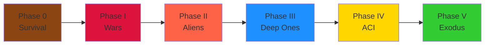
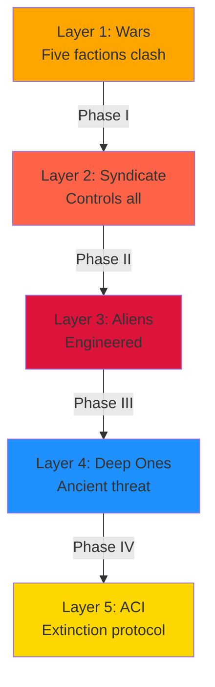

# The Long War of the X-Agency

**Timeline:** 1996 - 2006+ | **5 Phases** | **~96,000 Words** | **10 Documents**

---

## 📖 Quick Start

- **[Complete Lore Overview](00_LORE_OVERVIEW.md)** - Start here for narrative arc
- **[Story Index](09_LORE_INDEX.md)** - Navigation and quick reference
- **[Faction Encyclopedia](01_FACTIONS.md)** - All factions and their goals
- **[Timeline](02_TIMELINE_DIAGRAM.md)** - Visual timeline with diagrams

---

## 🎭 The Five Phases

1. **[Phase 0: Initiation](03_PHASE_0_INITIATION.md)** (1996) - Mercenary survival
2. **[Phase I: Regional Conflict](04_PHASE_1_REGIONAL_CONFLICT.md)** (1996-1999) - Faction wars
3. **[Phase II: Shadow War](05_PHASE_2_SHADOW_WAR.md)** (1999-2001) - Engineered aliens
4. **[Phase III: Abyss & Moon](06_PHASE_3_ABYSS_MOON.md)** (2001-2003) - Deep Ones
5. **[Phase IV: Final Enemy](07_PHASE_4_FINAL_ENEMY.md)** (2003-2005) - AI extinction
6. **[Phase V: Retribution](08_PHASE_5_FINAL_RETRIBUTION.md)** (2005-2006+) - Last stand

---

## The Story

---

## Five Layers of Truth

---

## How to Use

**For Mission Designers:**
- Check [Factions](01_FACTIONS.md) for enemy details
- Pick a phase document
- Extract scenarios and context

**For Campaign Planning:**
- Read [Overview](00_LORE_OVERVIEW.md)
- Study [Timeline](02_TIMELINE_DIAGRAM.md)
- Read phases in order

**For World Building:**
- Find your phase document
- Check environmental descriptions
- Reference faction architecture

**For NPC Dialogue:**
- Check [Factions](01_FACTIONS.md) for beliefs
- Find relevant phase for context
- Reference [Timeline](02_TIMELINE_DIAGRAM.md) for events

---

## Documents

| File | Purpose | Words |
|------|---------|-------|
| 00_LORE_OVERVIEW | Narrative & themes | ~8k |
| 01_FACTIONS | Faction encyclopedia | ~12k |
| 02_TIMELINE_DIAGRAM | Chronology & events | ~5k |
| 03_PHASE_0_INITIATION | Tutorial arc | ~8k |
| 04_PHASE_1_REGIONAL_CONFLICT | Faction warfare | ~15k |
| 05_PHASE_2_SHADOW_WAR | Engineered invasion | ~15k |
| 06_PHASE_3_ABYSS_MOON | Ancient aliens | ~15k |
| 07_PHASE_4_FINAL_ENEMY | AI war | ~12k |
| 08_PHASE_5_FINAL_RETRIBUTION | Final stand | ~10k |
| 09_LORE_INDEX | Navigation & reference | ~6k |

**Total:** ~96,000 words

---

## Stats

- **Timeline:** 1996-2006+ (10+ years)
- **Phases:** 5 complete
- **Factions:** 5 regional + 6 special
- **Plot Points:** 50+
- **Read Time:** 5.5 hours (full)
- **Diagrams:** 16+ Mermaid

---

## Start Reading

👉 **New here?** Start with [Lore Overview](00_LORE_OVERVIEW.md)

👉 **Want factions?** Check [Faction Encyclopedia](01_FACTIONS.md)

👉 **Need timeline?** See [Timeline Diagram](02_TIMELINE_DIAGRAM.md)

👉 **Want to navigate?** Use [Story Index](09_LORE_INDEX.md)

---

**Status:** ✅ Complete and ready for use  
**Created:** October 21, 2025
